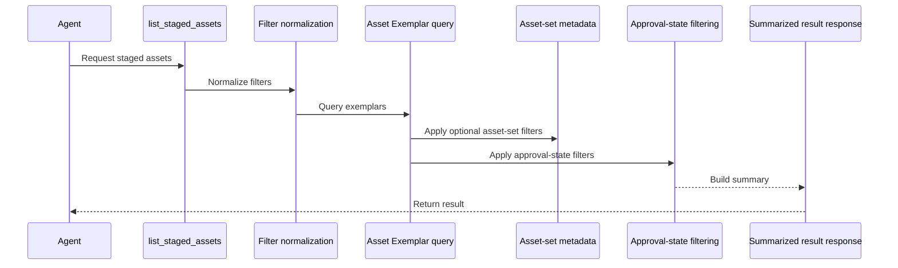
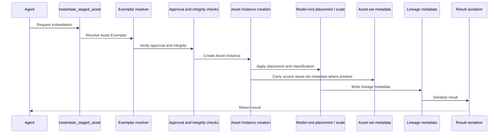
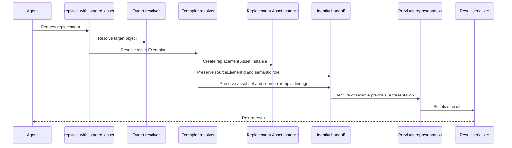
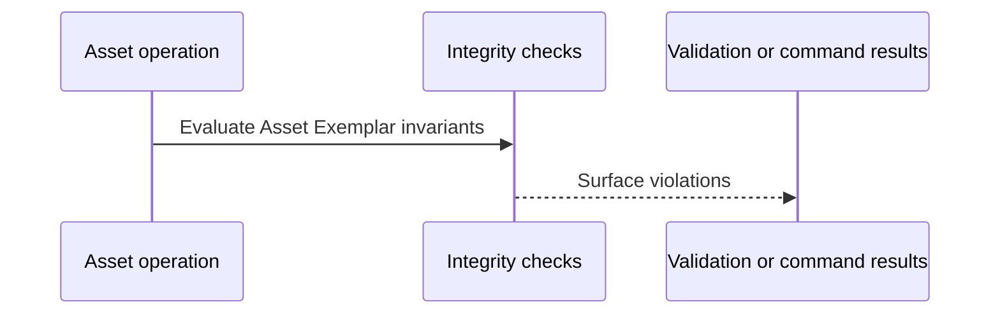

# HLD: Asset Exemplar Reuse

## System Overview

### Purpose

This HLD covers the implementation approach for the capability defined in [`prd-staged-asset-reuse.md`](../prds/prd-staged-asset-reuse.md).

It focuses on:

- Asset Exemplar discovery
- Asset Instance creation
- Asset Exemplar source stability during reuse
- replacement flows
- source asset lineage
- project-scoped asset sets, such as grouped low-poly vegetation component libraries

### Capability Intent

This capability turns the Asset Exemplar library concept into a reliable product workflow. The system should reuse curated Asset Exemplars safely and convert them into editable Asset Instances without damaging the library source objects.

The capability must also support practical project libraries assembled by designers inside SketchUp. A representative working example is the low-poly garden vegetation inventory in [`low_poly_garden_vegetation_inventory.md`](../research/asset-reuse/low_poly_garden_vegetation_inventory.md), where a coherent set of vegetation component instances is grouped in the model and selected by design semantics such as asset key, archetype, represented species, planting role, intended design height, height class, style, variant hints, and usage notes. Those fields are examples for the vegetation category, not a universal metadata schema for all asset types.

### Capability Scope

Initial scope:

- `list_staged_assets`
- `instantiate_staged_asset`
- `replace_with_staged_asset`
- Asset Exemplar metadata and approval handling
- Asset Exemplar integrity checks

## Architecture Approach

### Core Approach

Implement asset reuse around five concepts:

1. **Asset Exemplar registry and discovery**
2. **approval-state enforcement**
3. **project asset-set metadata and discovery**
4. **Asset Instance creation with lineage**
5. **Asset Exemplar source stability during reuse**

### Internal Structure for This Capability

- Asset Exemplar query command
- project asset-set metadata normalization
- Asset Instance creation command
- replacement command
- Asset Exemplar metadata rules
- integrity and source-stability checks
- lineage serializer helpers

### Separation Model

This capability must maintain a hard separation between:

- Asset Exemplars in the library/staging area
- Asset Instances in the editable design scene

This separation should be visible in:

- metadata
- model-root creation and later hierarchy state
- validation rules
- replacement flows

Scene organization can help users understand that separation, but it is not the primary architectural boundary. A common group containing component-instance exemplars is a supported library convention; the runtime should rely on explicit exemplar metadata, approval state, and source lineage rather than a required group name, exact nesting depth, or SketchUp tag/layer convention.

Reuse workflows must treat selected Asset Exemplars as sources and avoid mutating them implicitly. This does not make approved exemplars globally immutable: explicit target-based editing commands may still operate on exemplars for deliberate library maintenance.

## Component Breakdown

### 1. Asset Exemplar Discovery Component

**Responsibilities**

- locate approved Asset Exemplars
- filter by asset metadata
- return summarized selection-friendly results

### 2. Asset Exemplar Policy Component

**Responsibilities**

- define approval-state rules
- enforce minimum metadata requirements
- determine whether an Asset Exemplar is reusable
- distinguish reuse-flow source stability from deliberate explicit exemplar maintenance

### 3. Project Asset Set Metadata Component

**Responsibilities**

- preserve optional asset-set identity such as `assetSet`
- preserve category-specific selection metadata in `assetAttributes`, such as vegetation archetype/species/height semantics or different furniture/material/style semantics
- keep asset-set metadata JSON-safe and queryable without making the runtime depend on one fixed scene hierarchy
- support grouped component-instance libraries while keeping definition-level exemplar classification policy explicit

### 4. Asset Instance Creation Component

**Responsibilities**

- instantiate or duplicate the chosen Asset Exemplar
- place the result in the editable scene at model root
- support position-only minimum placement and optional direct scale variation
- assign lineage metadata
- mark the result as an Asset Instance and Managed Scene Object

### 5. Replacement Component

**Responsibilities**

- replace a Tree Proxy or similar lower-fidelity object
- preserve business identity
- preserve semantic role
- assign new source asset lineage

### 6. Integrity / Source-Stability Component

**Responsibilities**

- detect implicit in-place source edits during reuse workflows
- verify Asset Exemplar library invariants

## Integration & Data Flows

### 1. Discovery Flow

### 2. Instantiation Flow

### 3. Replacement Flow

### 4. Integrity Validation Flow

## Key Architectural Decisions

### 1. Asset Exemplars and Asset Instances Are Different Domain Objects

**Decision**

Do not treat a reused library object and an editable scene object as the same thing.

**Reason**

This is necessary to protect library integrity and preserve predictable reuse behavior.

### 2. Approval State Is a Product Gate

**Decision**

Only approved Asset Exemplars should be discoverable by normal reuse flows.

**Reason**

The PRD depends on curation and consistent asset quality.

### 3. Lineage Is Written at Instantiation Time

**Decision**

Asset source lineage is mandatory when creating an Asset Instance.

**Reason**

Without lineage, replacement, validation, and review all become weaker.

### 4. Asset-Set Metadata Is Optional but First-Class

**Decision**

Support project-scoped asset-set metadata as an explicit part of exemplar discovery, instantiation, replacement, and serialization, while keeping the minimum Asset Exemplar contract small.

**Reason**

Real project libraries often contain coherent component sets with domain semantics beyond a definition name. The low-poly vegetation library needs selection by asset key, archetype, represented species, planting role, intended design height, style, variant hints, and usage notes. Other asset categories should be able to carry their own semantics without being forced into vegetation fields. Keeping that data in JSON-safe metadata supports those workflows without hard-coding one scene hierarchy or one category-specific schema.

**Initial metadata shape**

Category-specific fields should remain JSON-safe under exemplar `assetAttributes` until repeated usage justifies first-class schema promotion. The low-poly vegetation setup should be representable with fields such as `assetSet`, `assetKey`, `archetype`, `plantingRole`, `representedSpecies`, `designHeightMeters`, `heightRangeMeters`, `heightClass`, `style`, `variantHints`, and `usageNotes`, but SAR-02 must not require those fields for non-vegetation assets.

`designHeightMeters` describes the intended SketchUp component height for the design role, not mature botanical height. Instantiation should carry that value as selection and lineage evidence; it should not auto-scale the created instance from that field.

### 5. Scene Grouping Is a Convention, Not the Boundary

**Decision**

Treat a common group containing reusable component instances as a supported staging pattern, but do not make one group name, nesting pattern, SketchUp tag, or layer the authoritative identity mechanism.

**Reason**

Designers should be able to organize libraries naturally inside SketchUp. Runtime behavior remains safer and more portable when approval, identity, asset-set membership, and lineage are explicit metadata.

### 6. Definition-Level Exemplar Classification Remains Deliberate

**Decision**

Default exemplar identity to curated group or component instances. Definition-level metadata may be added later only with explicit policy.

**Reason**

Component definitions are shared across instances. Treating a definition as an approved exemplar can unintentionally classify every instance of that definition as a library source object.

### 7. Explicit Exemplar Maintenance Remains Allowed

**Decision**

Do not add runtime refusals to generic mutation commands solely because a target is an approved Asset Exemplar.

**Reason**

Generic mutation commands already require explicit target references. Blocking approved exemplars in those paths would make deliberate library maintenance awkward or force a duplicate maintenance surface. Source-stability requirements belong to reuse workflows that select exemplars as sources, such as instantiation and replacement.

### 8. Replacement Preserves Business Identity

**Decision**

Replacement changes representation, not business identity.

**Reason**

The same source element may evolve from proxy to high-fidelity representation.

### 8. Discovery Returns Summaries, Not Raw Scene Objects

**Decision**

The selection workflow should use structured summaries.

**Reason**

It keeps the capability MCP-friendly and avoids leaking SketchUp internals.

## Technology Stack

| Concern | Technology / Approach | Purpose |
| --- | --- | --- |
| asset metadata | Ruby metadata service via attribute dictionaries | Asset Exemplar classification |
| asset-set metadata | JSON-safe exemplar attributes | Project library identity and category-specific selection metadata |
| asset discovery | Ruby query helpers | filtered Asset Exemplar lookup |
| instantiation | SketchUp groups / component instances at model root | Asset Instance creation with position-only minimum placement and optional direct scale |
| lineage tracking | metadata + serializer | traceability |
| MCP exposure | MCP tools | external interface |

## Opened Questions

1. What exact metadata is required for an Asset Exemplar to be approved?
2. How should deprecation and versioning of Asset Exemplars be represented?
3. What protections should block in-place edits versus only detect and report them?
4. Should the first release support separate Asset Exemplar libraries by category, or one unified library with metadata filters?
5. Which asset-set metadata fields should graduate from free-form attributes into documented first-class filters after the low-poly vegetation workflow is implemented?
6. Should future definition-level exemplar support be opt-in for immutable library definitions, or should the runtime continue to require instance-level curation for all component-backed exemplars?
