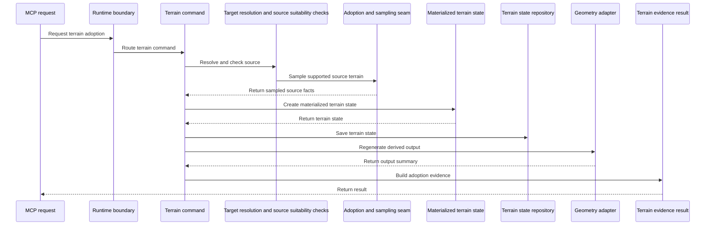
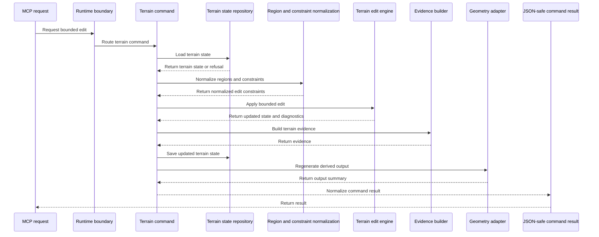
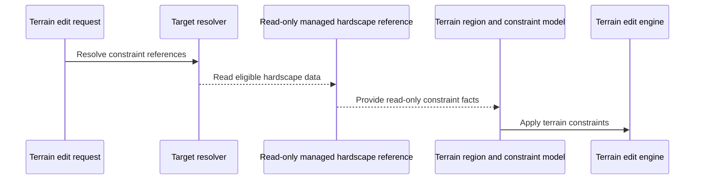
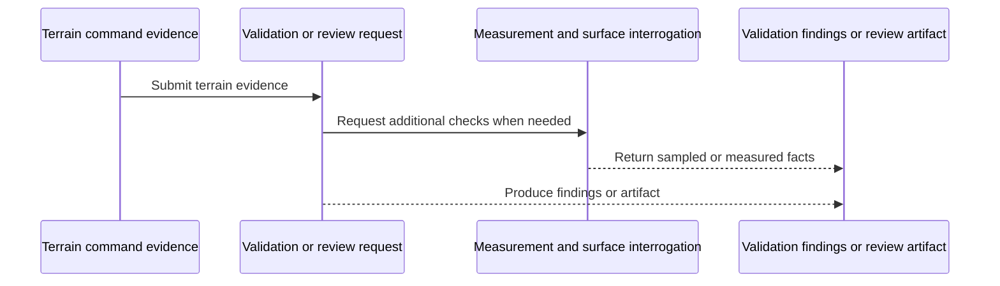
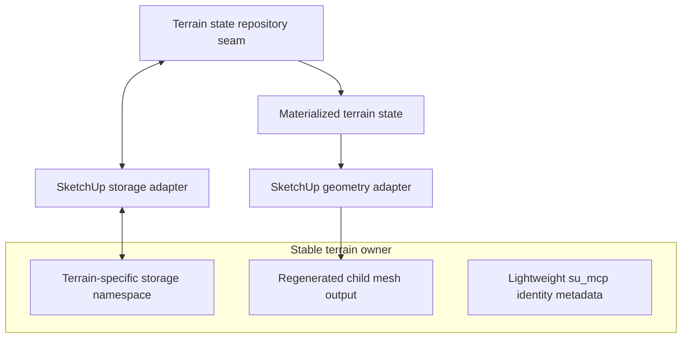
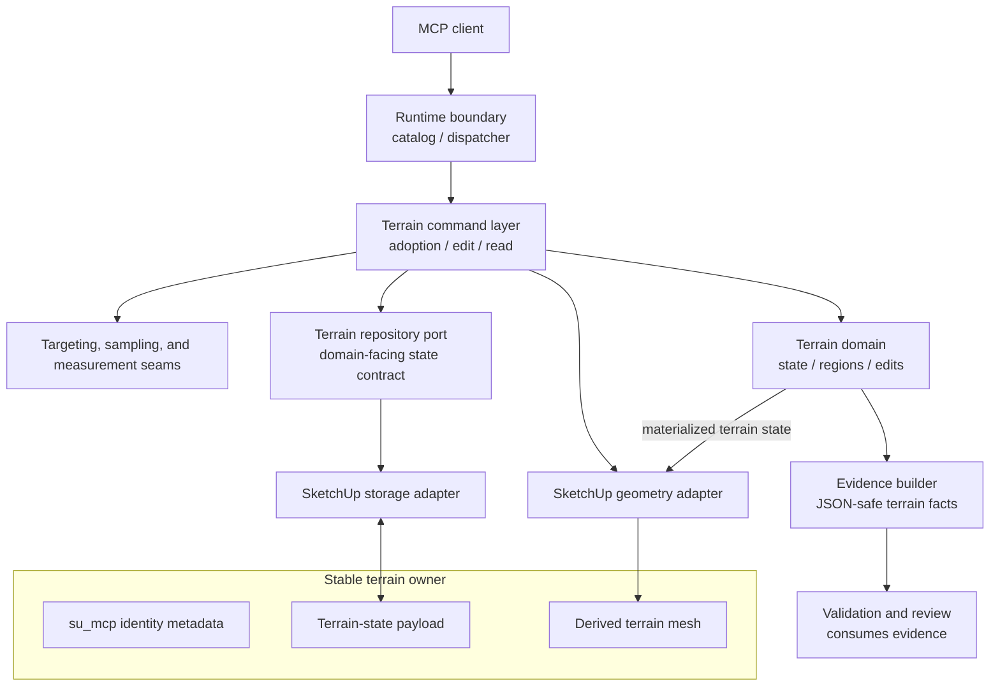

# HLD: Managed Terrain Surface Authoring

## System Overview

This is a capability HLD for the Managed Terrain Surface Authoring product slice described in [`prd-managed-terrain-surface-authoring.md`](../prds/prd-managed-terrain-surface-authoring.md).

The capability introduces Managed Terrain Surface as a terrain-specific managed scene concept for adopting existing SketchUp terrain, storing a materialized terrain state, applying bounded terrain edits, regenerating owned terrain output geometry, and producing terrain-edit evidence for review and validation.

This HLD is intentionally scoped to architecture. It does not define public MCP tool names, public request schemas, exact response payloads, iteration plans, or final Ruby class names. The UE research note at [`ue-reference-phase1.md`](../research/managed-terrain/ue-reference-phase1.md) is non-normative research input, not source of truth for public tool shape or repo layering.

Source context:

- [`domain-analysis.md`](../domain-analysis.md), which defines Managed Terrain Surface as a terrain-specific Managed Scene Object concept.
- [`ue-reference-phase1.md`](../research/managed-terrain/ue-reference-phase1.md), which preserves non-normative UE research pointers and inspection cadence for later MTA implementation tasks.
- [`prd-scene-targeting-and-interrogation.md`](../prds/prd-scene-targeting-and-interrogation.md), which owns workflow targeting and explicit surface sampling.
- [`prd-scene-validation-and-review.md`](../prds/prd-scene-validation-and-review.md), which owns validation acceptance semantics.
- [`prd-semantic-scene-modeling.md`](../prds/prd-semantic-scene-modeling.md), which owns semantic hardscape and Managed Scene Object conventions.
- [`hld-platform-architecture-and-repo-structure.md`](./hld-platform-architecture-and-repo-structure.md), which keeps MCP ownership, command behavior, SketchUp adapters, and serialization inside the Ruby extension runtime.

In scope:

- Managed Terrain Surface lifecycle, adoption, storage, edit orchestration, geometry regeneration, and evidence production.
- The bounded context split between terrain, semantic hardscape, targeting and interrogation, validation, and SketchUp adapters.
- The ownership model for heightmap or equivalent materialized terrain state.
- Internal terrain math boundaries for grade, transition, ramp-like, smoothing, and fairing behavior.
- Test and integration boundaries for terrain state, storage, geometry output, undo behavior, and evidence handoff.

Out of scope:

- Public MCP tool schemas or exact tool names.
- Unreal-style public tools such as flatten, smooth, or ramp as direct MCP contract commitments.
- Interactive sculpting, brush UI, broad mesh repair, erosion, weathering, procedural terrain generation, or photorealistic rendering.
- Semantic hardscape creation or mutation. Current `path`, `pad`, and `retaining_edge` objects remain separate hardscape Managed Scene Objects.
- Validation rule policy and pass/fail ownership, beyond the evidence terrain authoring must produce.

## Architecture Approach

Managed terrain authoring should be added as a capability slice inside the existing Ruby extension runtime. The slice should follow the current layered-monolith direction: native MCP registration and dispatch delegate to command/use-case behavior, commands coordinate domain services, domain services remain SketchUp-free, and SketchUp adapters isolate host API access.

The core architectural move is to stop treating the live SketchUp TIN as the normal editing substrate. Adoption converts a supported source surface into a materialized terrain state, such as a heightmap or equivalent sampled surface representation. After adoption, that terrain state is the authoritative product state. SketchUp mesh geometry is regenerated output derived from that state.

This directly addresses the current failure mode where fallback `eval_ruby` scripts drag vertices, delete faces, cut live triangulation, and attempt local topology repair. Those operations can remain outside the managed capability as unsupported fallback behavior, but they should not be the architecture for supported terrain workflows.

### Storage Posture

The heightmap or equivalent materialized terrain state must not be stored in the existing `su_mcp` metadata dictionary.

Managed terrain needs four separate storage concepts:

| Concept | Owner | Durable? | Purpose |
| --- | --- | --- | --- |
| Workflow identity metadata | Existing lightweight `su_mcp` metadata dictionary on the stable terrain owner | Yes | Stable targeting identity, semantic kind, state/version summary, source references, digest or pointer fields |
| Terrain state payload | Terrain-specific storage namespace on the stable terrain owner, not `su_mcp` | Yes | Heightmap or equivalent terrain state, state version, sample grid definition, edit revision data, and payload integrity data |
| Regenerated geometry output | Terrain geometry adapter under the stable terrain owner | Yes, but derived | Visible SketchUp mesh generated from terrain state |
| Runtime caches | Terrain runtime internals | No | Derived acceleration data, sampled indices, triangulation helpers, or temporary edit working data |

The stable terrain owner is the durable container for a Managed Terrain Surface. Adoption should create or designate this owner, attach lightweight `su_mcp` identity metadata to it, and store the terrain-state payload in a dedicated terrain namespace attached to that owner. Regeneration may replace child mesh geometry, but it must not destroy the owner or the terrain-state payload.

Managed Terrain Surface should be introduced as a terrain-specific Managed Scene Object extension. Semantic scene modeling still owns the shared identity and lifecycle conventions for managed objects; the terrain slice owns the terrain-state payload, terrain edit lifecycle, and derived terrain output below that owner.

A model-embedded terrain-specific attribute dictionary is the preferred Phase 1 storage approach because it travels with the SketchUp model, participates naturally in save/load behavior, and avoids sidecar path, permission, portability, and synchronization problems. The exact dictionary name, payload compression, chunking, and migration format are implementation details, but the boundary rule is architectural: `su_mcp` is metadata only; terrain state is stored behind a terrain-specific repository seam.

Model-embedded storage is not risk-free. The repository seam must treat payload size, chunking, integrity checks, unsupported versions, failed deserialization, and failed writes as first-class storage concerns. Mutating commands should update terrain state storage and regenerated output as one coherent SketchUp operation so a failed storage write or failed geometry replacement does not become the expected steady state.

Sidecar files are deferred. They may be reconsidered only if model-embedded payload size or performance becomes unacceptable and a later design defines portability, save/load synchronization, cleanup, and validation semantics.

### Bounded Contexts And Slippage Controls

| Context | Owns | Must Not Own |
| --- | --- | --- |
| Managed terrain authoring | Terrain adoption, materialized terrain state, bounded terrain edits, terrain output regeneration, terrain-edit evidence | Public tool naming as architecture, semantic hardscape state, validation pass/fail policy, generic surface sampling tools |
| Scene targeting and interrogation | Workflow target resolution, surface sampling requests and evidence, topology interrogation | Terrain state persistence, terrain edit semantics, terrain output regeneration |
| Semantic scene modeling | Managed Scene Object identity conventions and hardscape objects such as `path`, `pad`, and `retaining_edge` | Terrain heightmap state, terrain edit engine, implicit absorption of hardscape into terrain |
| Scene validation and review | Validation rules, acceptance semantics, review findings, measurement interpretation | Terrain mutation, terrain storage, command completion semantics |
| SketchUp adapters | Raw SketchUp entity lookup, operations, attribute dictionary access, entity creation, mesh output | Domain edit math, validation policy, public MCP behavior |
| Terrain repository port | Terrain-owned domain-facing load/save contract for materialized terrain state, backed by terrain-specific persistence adapters | Separate product slice ownership, edit algorithms, raw attribute-dictionary handles crossing into domain services, public transport contracts |

The main slippage risks are:

- Terrain evidence becoming validation policy. Terrain authoring should report changed regions, before/after samples, control preservation, and warnings; validation decides whether those are acceptable.
- Terrain constraints mutating hardscape. A `path`, `pad`, or `retaining_edge` may be read as an explicit constraint when product rules allow it, but it must not become part of terrain source state or be silently rewritten by terrain editing.
- Sampling becoming adoption ownership. Existing surface sampling should inform adoption and evidence, but the terrain slice owns conversion from source surface to managed terrain state.
- Storage leaking into domain math. Terrain edit internals should operate on in-memory terrain state and should not know whether persistence is an attribute dictionary, chunked payload, or future sidecar.
- Generated mesh becoming source of truth. The output mesh is replaceable derived geometry. The stored terrain state is the source of truth after adoption.

## Component Breakdown

### Native MCP Capability Exposure

**Responsibilities**

- Route terrain capability entrypoints through the MCP runtime boundary to isolated terrain commands when public contracts are later defined.
- Keep public requests routed to coherent terrain commands rather than chatty low-level geometry operations.
- Normalize transport-facing results into JSON-serializable envelopes.

**Must Not Own**

- Terrain edit math.
- Raw SketchUp geometry mutation.
- Exact HLD-level commitment to public tool names or fine-grained Unreal-style operations.

### Terrain Command And Use-Case Layer

**Responsibilities**

- Orchestrate terrain adoption, bounded edits, output regeneration, storage updates, undo behavior, and evidence assembly.
- Start and complete one coherent SketchUp operation for each mutating terrain workflow where practical.
- Enforce high-level refusal rules for ambiguous targets, unsupported source terrain, unsafe constraints, and unsupported edit intent.
- Return compact JSON-safe success, refusal, and evidence results.

**Must Not Own**

- Raw SketchUp object lifetime rules beyond adapter calls.
- Heightmap persistence format.
- Public validation acceptance policy.
- Semantic hardscape creation or mutation.

### Managed Terrain Identity And Metadata

**Responsibilities**

- Record stable workflow identity on the stable terrain owner using existing lightweight metadata conventions.
- Preserve fields needed for targeting, source reference, lifecycle state, terrain kind, state version summary, and integrity pointers.
- Keep metadata small and serializable.

**Must Not Own**

- The heightmap or equivalent terrain-state payload.
- Generated mesh geometry.
- Large evidence blobs or runtime caches.

### Terrain State Repository Seam

**Responsibilities**

- Load and save materialized terrain state through a terrain-specific storage namespace on the stable terrain owner.
- Hide the storage backing from commands, edit engines, and evidence builders.
- Own storage versioning, payload integrity checks, unsupported-version refusals, and migration hooks.
- Return explicit recovery/refusal outcomes when stored terrain state cannot be read, validated, migrated, or written.
- Support future changes to compression, chunking, or sidecar strategy without changing terrain edit logic.

**Must Not Own**

- Domain edit algorithms.
- Public MCP schemas.
- Validation policy.
- `su_mcp` metadata field ownership beyond reading the owner identity needed to locate state.
- Raw SketchUp entities or attribute-dictionary handles in the domain-facing contract.

### Terrain Adoption And Sampling Seam

**Responsibilities**

- Convert a supported existing SketchUp surface into materialized terrain state.
- Use existing targeting and surface-sampling capabilities where they fit, while owning terrain-specific source suitability checks.
- Capture enough source reference and sampling summary data for later audit, evidence, and validation.
- Refuse unsupported source surfaces rather than attempting live-TIN repair.

**Must Not Own**

- Generic `sample_surface_z` ownership.
- Long-term mutation of arbitrary source TINs.
- Semantic hardscape adoption.

### Materialized Terrain Surface State

**Responsibilities**

- Represent the adopted terrain state independent of SketchUp objects.
- Carry terrain extents, owner-local coordinate basis, grid or sample topology, elevation values, no-data handling, revision/version data, and unit-normalized tolerances.
- Provide the domain object that edit engines read and produce.

**Must Not Own**

- Attribute dictionary access.
- SketchUp mesh entities.
- Public transport response formatting.

### Terrain Edit Engine

**Responsibilities**

- Apply bounded terrain operations to materialized terrain state.
- Implement internal grade, transition, ramp-like, smoothing, and fairing kernels as domain behavior rather than public tool boundaries.
- Respect fixed controls, preserve zones, blend zones, and supported hardscape-derived constraints.
- Produce dirty-region summaries and edit diagnostics for evidence assembly.

**Must Not Own**

- SketchUp API calls.
- Storage backends.
- Public MCP contract naming.
- Validation pass/fail decisions.

### Terrain Region And Constraint Model

**Responsibilities**

- Normalize edit regions, fixed controls, preserve zones, blend zones, corridors, and optional read-only hardscape references into terrain-domain constraints.
- Keep terrain edits bounded and explicit.
- Support refusal when a referenced managed object cannot safely act as a terrain constraint.

**Must Not Own**

- Hardscape object mutation.
- Semantic object metadata policy.
- Scene-wide validation rules.

### Terrain Evidence Builder And Serializer

**Responsibilities**

- Produce structured terrain-edit evidence: changed-region summary, before/after samples, preserved-control status, preserve-zone status, source/adoption summary, warnings, and defect hints where available.
- Keep output JSON-safe and compact by default.
- Provide evidence in a shape validation and review workflows can consume without treating command success as correctness.
- Prefer terrain-domain references such as sample coordinates, grid indices, regions, or stable terrain owner identity over raw generated face or vertex references.

**Must Not Own**

- Validation acceptance thresholds beyond raw evidence and terrain-owned tolerances.
- Long-lived storage of bulky historical evidence unless a later PRD or HLD introduces that concept.
- Raw SketchUp objects in responses.

### SketchUp Terrain Model Adapter

**Responsibilities**

- Locate target entities, stable terrain owners, source terrain groups, and generated output containers.
- Encapsulate SketchUp operation lifecycle, attribute dictionary access, entity path handling, and persistent identifier lookup.
- Protect terrain commands from direct SketchUp object exposure.

**Must Not Own**

- Terrain edit math.
- Terrain storage schema beyond adapter primitives.
- Public MCP semantics.

### SketchUp Terrain Geometry Adapter

**Responsibilities**

- Regenerate terrain output mesh from materialized terrain state.
- Prefer host-supported bulk geometry creation paths where practical, while keeping the generation strategy behind an adapter boundary.
- Apply tags, materials, grouping, and ownership conventions for derived terrain geometry.
- Replace derived child geometry without deleting the stable terrain owner or terrain-state payload.

**Must Not Own**

- The authoritative terrain state.
- Bounded edit semantics.
- Validation policy.

### Validation And Interrogation Integration Seams

**Responsibilities**

- Let terrain commands depend on existing targeting, sampling, measurement, and validation capabilities through explicit collaborator boundaries.
- Keep terrain evidence compatible with validation and review without absorbing those slices.
- Let validation primarily consume terrain evidence, with resampling of regenerated output reserved for independent verification of final SketchUp geometry.

**Must Not Own**

- Terrain mutation.
- Terrain state storage.
- Terrain command orchestration.

## Integration & Data Flows

### Adoption Flow

The adoption flow may read an existing source surface, but it should not treat that source TIN as the future editing substrate. Once adoption succeeds, future supported edits load the materialized terrain state from terrain-specific storage.

### Bounded Edit Flow

The command layer owns the coherent undo boundary. If a mutation fails after it has started changing the model, it should abort the SketchUp operation and avoid partial managed terrain state as the expected outcome.

### Hardscape Constraint Flow

Hardscape references are inputs, not terrain children. Existing paths and pads remain explicit hardscape objects. Terrain editing must not silently reclassify, absorb, or rewrite them.

### Evidence And Validation Flow

Terrain authoring produces evidence. Validation and review decide whether the evidence and current scene satisfy expectations.

### Storage Flow

The heightmap or equivalent state lives in the terrain-specific storage namespace behind the repository seam. It does not live in the `su_mcp` metadata dictionary and it does not live on disposable mesh faces.

### Architecture Diagram

### Test Boundaries

The architecture creates four verification seams:

- Terrain domain behavior should be testable without SketchUp: materialized state, region constraints, edit kernels, and evidence assembly should not require raw host entities.
- Terrain storage should be contract-tested at the repository boundary: state round trips, payload integrity, unsupported versions, failed loads, failed writes, and migration refusals must be visible without leaking storage handles into domain services.
- SketchUp integration must be validated in host-aware smoke or integration coverage: adoption from real geometry, regenerated output ownership, save/load behavior, and undo coherence depend on the SketchUp runtime.
- Runtime contract coverage should be added when public terrain entrypoints exist: transport-facing outputs must stay JSON-safe and public failures must remain explicit.

Manual visual review remains useful for terrain plausibility, but it should not be the only control for supported workflows.

## Key Architectural Decisions

### 1. Managed Terrain Surface Is A Capability Slice In The Ruby Runtime

**Decision**

Implement managed terrain authoring as a Ruby extension capability slice that participates in the existing runtime, command, domain, adapter, and serializer boundaries.

**Reason**

The platform direction keeps MCP tool ownership, SketchUp API use, geometry work, metadata handling, and serialization inside the extension runtime. A second terrain app layer would duplicate boundaries the repo is already moving away from.

### 2. Adopted Terrain State Is The Source Of Truth

**Decision**

After adoption, the heightmap or equivalent materialized terrain state is authoritative. SketchUp terrain mesh geometry is derived output.

**Reason**

Live-TIN mutation is the source of the current fragility: topology artifacts, loose edges, uncontrolled drift, holes, and manual repair loops. Regenerating from state provides deterministic behavior, bounded edits, and clearer evidence.

### 3. Heightmap State Is Stored Outside `su_mcp`

**Decision**

Use existing `su_mcp` metadata only for lightweight identity and summary fields. Store the terrain-state payload in a terrain-specific namespace behind a terrain state repository seam.

**Reason**

The current `su_mcp` dictionary is a Managed Scene Object metadata mechanism. Putting terrain grids or large state payloads there would blur identity metadata with domain state and make future schema changes fragile.

### 4. Prefer Model-Embedded Terrain State For Phase 1

**Decision**

Prefer a model-embedded terrain-specific storage namespace on the stable terrain owner for the first implementation. Defer sidecars.

**Reason**

Model-embedded storage travels with the SketchUp file and aligns with undo/save/load expectations better than sidecars. Sidecars introduce path portability, permissions, cleanup, and synchronization responsibilities that are larger than the first terrain slice.

### 5. Regenerate Owned Output Instead Of Editing Arbitrary TINs In Place

**Decision**

Terrain mutations should regenerate owned child terrain output from state. They should not attempt arbitrary in-place repair of the original source TIN as the normal supported path.

**Reason**

The product goal is to replace recurring `eval_ruby` mesh surgery with bounded managed terrain workflows. Regeneration gives the architecture a stable recovery and verification model.

### 6. Keep Hardscape Separate From Terrain

**Decision**

Existing `path`, `pad`, and `retaining_edge` objects remain separate hardscape Managed Scene Objects. Terrain authoring may reference them read-only as constraints where supported, but it does not absorb or mutate their semantic state.

**Reason**

Hardscape is already explicitly modeled and validated through semantic scene modeling. Mixing it into terrain state would create ambiguous ownership and make both slices harder to reason about.

### 7. Terrain Produces Evidence; Validation Owns Acceptance

**Decision**

Terrain authoring returns terrain-edit evidence and warnings. Scene validation and review own rule interpretation, pass/fail semantics, and acceptance decisions.

**Reason**

This preserves the current product split: terrain commands are responsible for what changed and what was observed; validation is responsible for whether that satisfies expectations.

### 8. HLD Uses Conceptual Components Rather Than Final Class Names

**Decision**

This HLD defines component responsibilities and boundaries without committing exact Ruby class names.

**Reason**

The implementation should fit the codebase at task time. Naming and file layout are lower-level design choices, while the HLD should stabilize responsibilities, data ownership, and integration boundaries.

### 9. Unreal-Inspired Operations Are Internal References, Not Public Architecture

**Decision**

Grade, ramp-like transitions, smoothing, and fairing may inform internal terrain kernels and contracts, but they are not direct HLD-level public tools.

**Reason**

The curated UE research note preserves useful terrain-edit references, but this repository already has MCP authoring guidance, command boundaries, and domain ownership rules. Public tool shape should be designed through product and contract work, not imported from Unreal terminology.

### 10. Terrain State Uses Stable Owner-Local Coordinates

**Decision**

Materialized terrain state should be stored in the local coordinate basis of the stable terrain owner. SketchUp adapters translate workflow/world coordinates and nested host transforms at the boundary.

**Reason**

SketchUp groups and components can be transformed or scaled. Keeping state in a stable owner-local coordinate basis reduces drift, makes regeneration deterministic under the owner, and keeps transform handling out of terrain edit math.

## Technology Stack

| Concern | Technology / Approach | Purpose |
| --- | --- | --- |
| Extension runtime | SketchUp-hosted Ruby under `src/su_mcp/` | Keep terrain behavior in the supported extension runtime |
| MCP boundary | Existing runtime catalog, dispatcher, and command factory patterns | Add terrain capability exposure without changing platform ownership |
| Command behavior | Ruby command/use-case layer | Coordinate adoption, edits, storage, geometry regeneration, undo, and evidence |
| Terrain domain | SketchUp-free Ruby domain values and services | Make terrain state and edit behavior testable without host geometry |
| Identity metadata | Existing lightweight `su_mcp` metadata dictionary | Preserve targetable workflow identity and summary fields |
| Terrain state storage | Terrain-specific model-embedded storage namespace behind repository seam | Store heightmap or equivalent state outside `su_mcp` while keeping it portable with the model |
| Storage adapter | SketchUp attribute-dictionary access behind the terrain repository seam | Keep raw persistence handles out of terrain domain services |
| Geometry output | SketchUp geometry adapter using host-supported bulk geometry creation where practical | Regenerate derived mesh output safely under the stable terrain owner |
| Surface sampling | Existing scene-query sampling seams plus terrain-specific adoption checks | Reuse interrogation capability without making it own terrain adoption |
| Evidence serialization | JSON-safe hashes, arrays, strings, numbers, booleans, and nil-free normalized data where required | Keep runtime-facing command outputs transport safe |
| Verification | Plain Ruby tests, runtime contract tests, and SketchUp-hosted smoke/integration tests | Validate domain behavior, runtime wiring, storage round trips, geometry output, and undo |

## Opened Questions

1. What terrain-state payload format, compression, and chunking strategy should be used behind the repository seam?
2. What minimum `su_mcp` metadata fields should identify a Managed Terrain Surface without storing terrain state there?
3. What source surfaces are supported for adoption in the first implementation, and what source conditions produce structured refusals?
4. Which hardscape managed object types can be read as terrain constraints in the first release?
5. Which defect hints are terrain-owned evidence versus validation-owned findings: holes, loose edges, seam defects, slope spikes, humps, trenches, or abrupt transitions?
6. Should adoption retain a durable source-surface reference for comparison after first release, or is SketchUp undo plus evidence enough initially?
7. Should the first implementation regenerate the full owned terrain output or support dirty-region partial regeneration?
8. What SketchUp-hosted smoke coverage is mandatory before calling adoption and bounded edits supported?
9. What payload-size threshold should force refusal, alternate storage, or a future sidecar strategy?
10. What recovery behavior should users see when terrain-state deserialization, migration, or integrity validation fails after model open?
11. Does terrain evidence require its own versioning contract so validation and review can evolve independently?
12. Should terrain evidence ever reference regenerated face or vertex identifiers, or should it remain coordinate, region, and sample-index based to avoid stale references after regeneration?
13. How should commands detect and recover from manually deleted, exploded, or edited derived terrain output when the stable terrain owner and terrain-state payload still exist?
