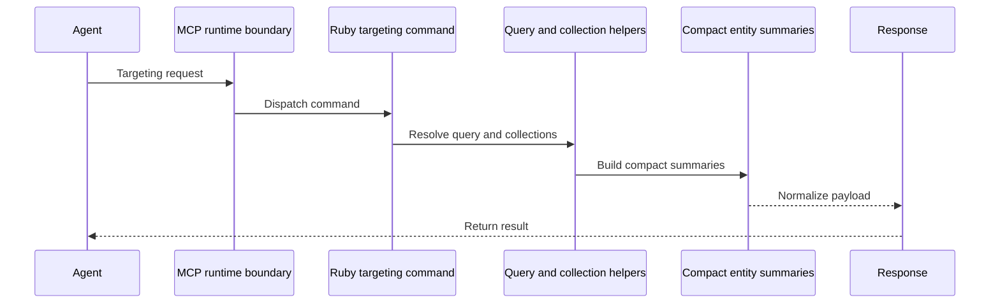
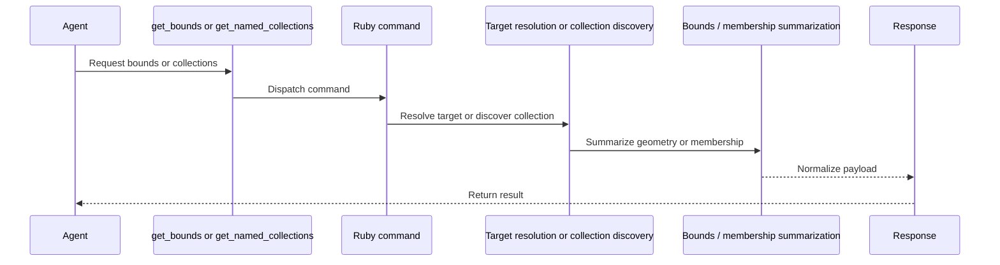
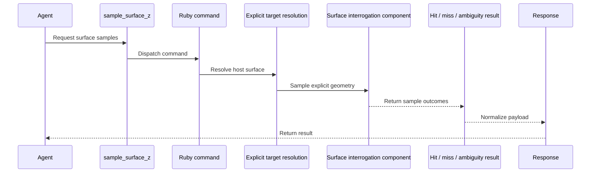
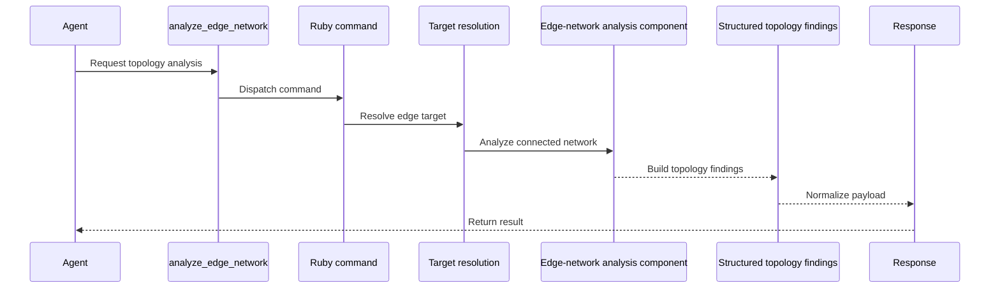
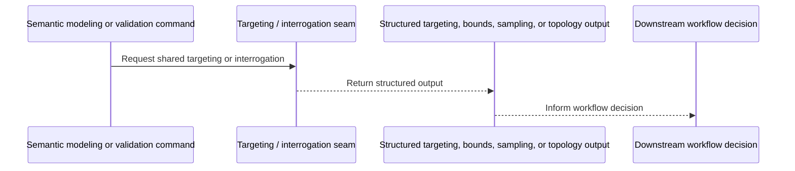
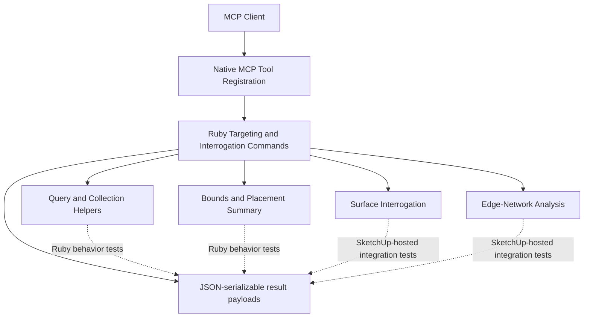

# HLD: Scene Targeting and Interrogation

## System Overview

### Purpose

This HLD covers the implementation approach for the capability defined in [`../prds/prd-scene-targeting-and-interrogation.md`](../prds/prd-scene-targeting-and-interrogation.md).

It focuses on:

- workflow-facing scene targeting
- collection-aware scene lookup
- structured bounds and placement summaries
- explicit surface interrogation
- edge-network topology analysis

This is a capability HLD, not a platform HLD. Shared runtime structure, transport shape, packaging, and cross-cutting result-envelope conventions remain in [`hld-platform-architecture-and-repo-structure.md`](./hld-platform-architecture-and-repo-structure.md).

### Capability Intent

This capability makes existing scene state reliably targetable before creation, mutation, placement, or validation workflows run. It gives the product a compact, structured way to identify the intended object or collection, interrogate explicit surfaces in world space, and detect edge-network problems early enough to avoid downstream ambiguity.

Its outputs are intended to be reusable by downstream projection-aware validation and revision flows without requiring a dedicated public helper for every geometry pattern.

### Capability Scope

Initial scope:

- `find_entities`
- `get_bounds`
- `get_named_collections`
- `sample_surface_z`
- `analyze_edge_network`

This HLD is the source of truth for the architecture of those tools. Where adjacent HLDs mention `find_entities`, `get_bounds`, or collection-oriented lookup as supporting behavior, they should depend on this capability rather than redefine its internal design.

Semantic scene modeling may re-expose `find_entities` or `get_named_collections` as part of higher-level workflows, but it should do so as a thin pass-through to the same Ruby command path and contract rather than defining a second lookup model.

### Out of Scope

This HLD does not define:

- `get_scene_info`
- `list_entities`
- `get_entity_info`
- semantic creation or metadata mutation flows
- validation pass/fail policy
- automatic geometry repair

## Architecture Approach

### Core Approach

Implement scene targeting and interrogation as a focused Ruby command slice with a small public tool surface and selective helper extraction.

The design should stay intentionally simple:

- each public tool maps to one coherent command
- the MCP runtime exposes the public tool surface directly
- shared helpers are extracted only when reuse is proven across at least two commands
- platform-owned concerns such as generic transport and result-envelope policy remain outside this capability

This avoids turning a small but important capability into a speculative subsystem before the codebase has earned that complexity.

### Current-State Posture

The current repository already has the correct runtime ownership but still concentrates behavior in a few shared runtime seams such as `src/su_mcp/runtime/tool_dispatcher.rb` and `src/su_mcp/runtime/runtime_command_factory.rb`.

This HLD assumes implementation will start from that reality. The intended refinement path is to keep adding targeting and interrogation commands in Ruby and extract focused helpers only where duplication becomes real.

### Boundary Posture

- Ruby owns tool registration, entity resolution, collection discovery, bounds summarization, surface-hit evaluation, topology analysis, and SketchUp-facing serialization.
- This capability may reuse platform-level serialization and result-envelope helpers, but it should not introduce a separate capability-specific response framework.
- Other Ruby capabilities should call the same Ruby command or helper paths directly when they need this behavior rather than routing back through a separate transport seam.
- Validation and semantic modeling may consume this capability's outputs, but they should not force a centralized shared subsystem up front.

## Component Breakdown

### 1. Native MCP Tool Registration

**Responsibilities**

- expose `find_entities`, `get_bounds`, `get_named_collections`, `sample_surface_z`, and `analyze_edge_network`
- validate basic argument shape and types at the MCP boundary
- route requests into the owning Ruby command seams
- surface MCP-facing failures as structured errors

**Must Not Own**

- SketchUp lookup rules
- ambiguity ranking policy
- surface-hit or topology logic

### 2. Ruby Command Dispatch for Targeting and Interrogation

**Responsibilities**

- provide one Ruby execution entrypoint per public tool
- normalize command inputs into command-local execution paths
- coordinate helper calls and return JSON-serializable results
- keep tool naming aligned with the MCP surface

**Must Not Own**

- socket lifecycle management
- MCP-specific concerns
- broad shared-runtime policy that belongs at platform scope

### 3. Query and Collection Helpers

**Responsibilities**

- resolve targets by `sourceElementId`, `persistentId`, metadata, name, tag, collection, material, and compatibility `entityId`
- provide reusable filtering for `find_entities`
- provide collection discovery and member summarization for `get_named_collections`
- keep identity preference aligned with the domain model: `sourceElementId` first, `persistentId` second, `entityId` as compatibility only
- treat Collection as a workflow metadata concept rather than a SketchUp Tag and return distinct collection values plus compact membership summaries

**Must Not Own**

- semantic object creation
- validation pass/fail policy
- topology or surface analysis

### Target Reference Shape

V1 targeting and interrogation commands should share one JSON target-reference concept:

- input references may identify a target by `sourceElementId`, `persistentId`, or compatibility `entityId`
- commands may also support structured metadata or collection filters where the contract calls for search rather than direct lookup
- output summaries should return all known identifiers, preserving the domain preference order of `sourceElementId`, then `persistentId`, then `entityId`

### 4. Bounds and Placement Summary Component

**Responsibilities**

- compute structured bounds for one or more resolved targets
- return placement-relevant summaries such as min/max, dimensions, centroid, origin, and world-space transform summary where meaningful
- keep output compact enough for automation-first consumers

**Must Not Own**

- target lookup beyond invoking shared query helpers
- scene validation rules
- asset placement decisions

### 5. Surface Interrogation Component

**Responsibilities**

- accept explicit target references and a canonical sampling object for XY point batches or ordered profile paths
- evaluate the intended surface in world space using SketchUp-owned geometry logic
- return structured hit, miss, and ambiguity results
- respect visible-only interrogation defaults and optional ignore-target references
- optionally include compact hit-chain detail when the contract requests it
- support bounded profile or section sampling by composing explicit target sampling over caller-supplied paths or section definitions, without taking ownership of terrain editing or validation verdicts

**Must Not Own**

- generic unconstrained scene probing
- downstream placement policy
- review or validation decisions about how sampling results should be acted on
- terrain patch creation, terrain fairing, or terrain working-copy lifecycle

### 6. Edge-Network Analysis Component

**Responsibilities**

- evaluate the connected edge graph reachable from the target, constrained to the target's immediate parent container
- summarize disconnected components, loose ends, isolated segments, and coincident-but-unmerged endpoints
- return findings in a structured form that downstream validation can consume directly

**Must Not Own**

- automatic geometry repair
- semantic creation behavior
- higher-level acceptance policy for blocking versus warning findings

## Integration & Data Flows

### 1. Targeting Flow

### 2. Bounds and Collection Flow

### 3. Surface Interrogation Flow

### 4. Topology Analysis Flow

### 5. Downstream Integration Flow

### Public Tool Contracts (V1)

The capability should keep tool contracts compact and explicit.

- `find_entities`
  - accepts a structured query over identifiers, metadata, names, tags, collections, and materials
  - supports match semantics and optional `require_unique` behavior for flows that need one resolved target
  - returns compact match summaries plus a resolution state of `none`, `unique`, or `ambiguous`
- `get_bounds`
  - accepts one or more explicit targets
  - returns world-space min/max, dimensions, centroid, and origin or transform summary where meaningful
  - returns geometry values in meters at the MCP boundary even if SketchUp internals use different units
- `get_named_collections`
  - returns distinct workflow collection values, member counts, and compact metadata or child summaries where documented
  - does not expose Tags as Collections
- `sample_surface_z`
  - accepts explicit target geometry, XY points in world coordinates, optional ignore-target references, and a visible-only default
  - returns one structured result per point with `hit`, `miss`, or `ambiguous` status and sampled XYZ when a hit is resolved
  - omits hit-chain detail by default and exposes it only through an explicit detail flag
  - may later be complemented by compact profile or section sampling that still resolves one explicit host surface and returns sampled evidence rather than terrain modifications
- `analyze_edge_network`
  - accepts an explicit target edge set or target reference plus a topology tolerance
  - returns component counts, loose ends, isolated segments, coincident-but-unmerged endpoints, and compact summary data
  - scopes traversal to the connected graph within the target's immediate parent container rather than the full model

### Architecture Diagram

### Verification Plan (MVP)

- Ruby tests should cover query parsing, identifier preference, collection filtering, and response-shape determinism where SketchUp runtime is not required.
- Ruby tests should cover MCP-facing argument handling and transport or error mapping without reimplementing capability logic.
- Native runtime tests should cover representative public request and response shape behavior, including happy-path, not-found, and ambiguous outcomes.
- SketchUp-hosted integration tests should cover `sample_surface_z` and `analyze_edge_network`, since their correctness depends on real SketchUp geometry behavior.
- Manual SketchUp verification is still acceptable for early geometry scenarios that are not yet automated, but any such gaps should be called out explicitly.

## Key Architectural Decisions

### 1. Keep the Capability Command-First

**Decision**

Implement the capability as a small set of Ruby commands rather than as a broad shared subsystem.

**Reason**

The current repo is still small, the behavior does not exist yet, and the immediate need is a clear capability surface rather than a reusable framework.

### 2. Extract Helpers Only When Reuse Is Real

**Decision**

Introduce shared query, collection, or geometry helpers only when reuse is proven across at least two commands.

**Reason**

This reduces speculative abstraction and keeps the implementation aligned with the repo's current scale.

### 3. Prefer Workflow Identity Over Runtime Identity

**Decision**

Targeting flows should prefer `sourceElementId`, support `persistentId` as a first-class lookup path, and treat `entityId` as compatibility support only.

**Reason**

That aligns the capability with the domain model and makes lookup more stable across revisions and downstream workflows.

### 4. Surface Sampling Must Use Explicit Targets

**Decision**

`sample_surface_z` should operate against explicitly resolved target geometry and return structured uncertainty states.

**Reason**

The PRD explicitly rejects generic scene probing as the normal path and requires deterministic hit, miss, or ambiguity outcomes.

### 5. Topology Analysis Returns Findings, Not Repair Actions

**Decision**

`analyze_edge_network` should report structural findings without attempting automatic correction.

**Reason**

This keeps the capability focused on interrogation and leaves repair or acceptance policy to later workflows.

### 6. Reuse Platform Result Conventions Instead of Inventing New Ones

**Decision**

This capability should use shared platform-level response and error conventions where available rather than defining a new targeting-specific envelope framework.

**Reason**

Result-envelope policy is a cross-cutting runtime concern, not a capability-local abstraction.

### 7. Standardize Target Resolution States

**Decision**

Targeting commands should return explicit resolution states rather than silently choosing a match. V1 resolution states are `none`, `unique`, and `ambiguous`. Ambiguous results should return candidate summaries by default, and callers that require one target may opt into stricter `require_unique` behavior.

**Reason**

Downstream automation should not depend on Ruby making arbitrary choices when multiple entities satisfy the same query.

### 8. Return Geometry Results in World Space

**Decision**

Geometry-based interrogation outputs such as bounds, centroids, origins, sample points, and hit coordinates should be serialized in world space by default. Public geometry values for this capability should be reported in meters at the MCP boundary, even if SketchUp internals use different units.

**Reason**

Placement, reprojection, and validation workflows need a consistent external coordinate system and unit model that does not depend on nested SketchUp transformations or model display settings.

### 9. Use Default-But-Overridable Tolerances

**Decision**

Topology and surface interrogation should use documented default tolerances, with per-call overrides where the public contract allows them. The contract should use one shared tolerance concept for endpoint coincidence and hit clustering rather than separate hidden tolerances per helper.

**Reason**

This keeps behavior deterministic by default while allowing tighter or looser checks in workflows that need them.

## Technology Stack

| Concern | Technology / Approach | Purpose |
| --- | --- | --- |
| MCP exposure | MCP tools | external command surface |
| Runtime invocation | native Ruby MCP dispatch and command seams | MCP-to-SketchUp transport |
| command execution | Ruby command methods in the SketchUp extension | capability orchestration |
| target identity | SketchUp persistent ids plus metadata stored in attribute dictionaries | stable lookup and workflow identity |
| collection discovery | Ruby scene traversal and metadata-aware filtering | workflow collection lookup |
| bounds summaries | SketchUp bounds and transformation data normalized in Ruby | placement and fit summaries |
| surface interrogation | Ruby geometry evaluation against explicit SketchUp targets | terrain-aware and reprojection-aware sampling |
| topology analysis | Ruby edge traversal with tolerance-aware endpoint comparison | connectivity and defect findings |
| serialization | Ruby JSON-safe hashes and arrays | MCP-safe payloads |

## Open Questions

1. Should `get_named_collections` return only canonical workflow collections or also custom collections that satisfy product rules?
2. How much optional detail should `sample_surface_z` expose beyond hit-chain data before payload size becomes counterproductive?
3. Should topology findings ever become automatic gates for semantic creation, or should that remain a validation-layer decision?
4. Which additional terrain profile or section sampling patterns are common enough to expand beyond the current points/profile `sample_surface_z` contract?
