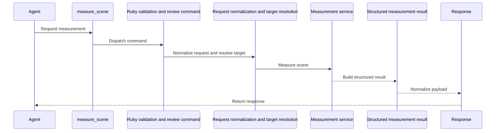
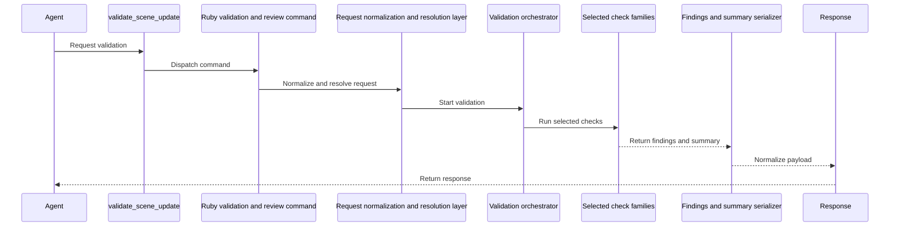
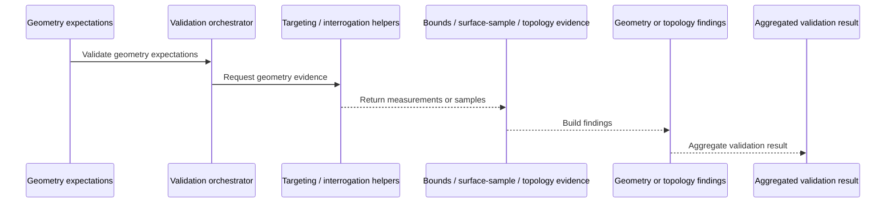
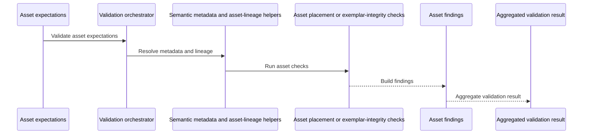
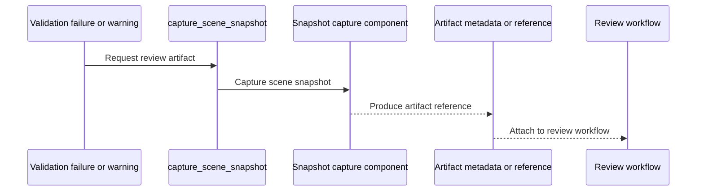
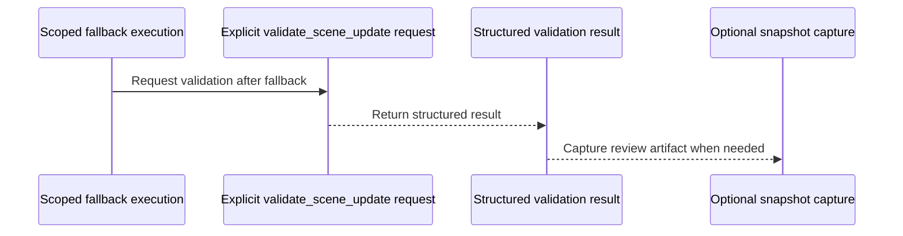
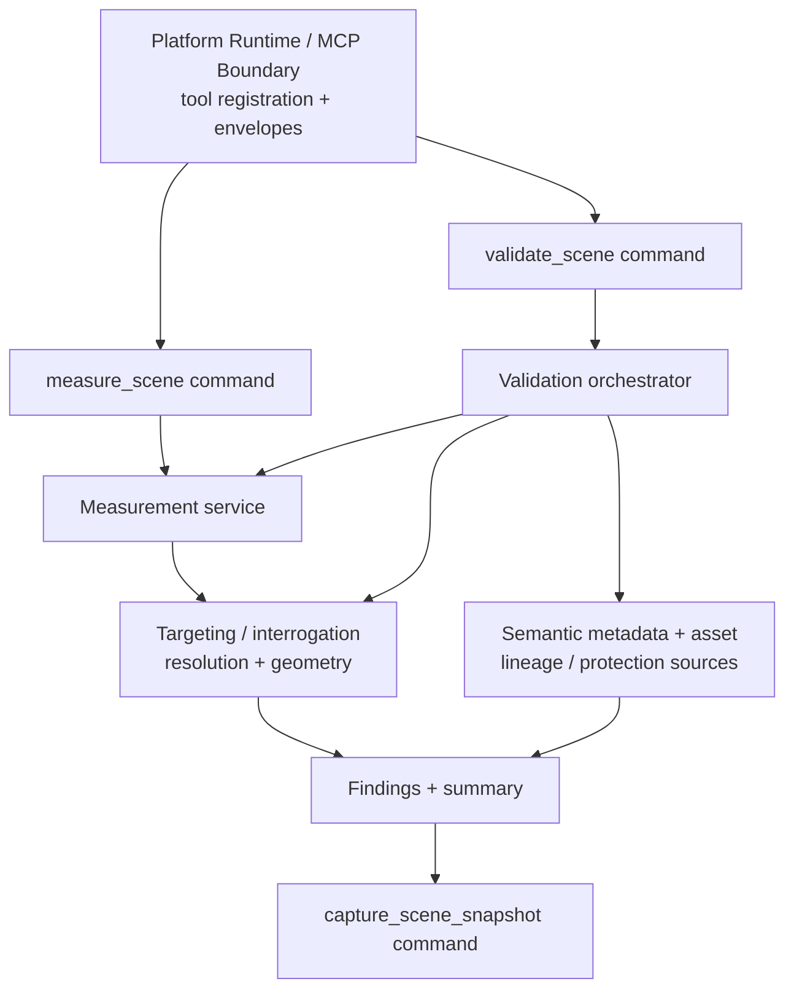

# HLD: Scene Validation and Review

## System Overview

### Purpose

This HLD covers the implementation approach for the capability defined in [`../prds/prd-scene-validation-and-review.md`](../prds/prd-scene-validation-and-review.md).

It focuses on:

- structured measurement through `measure_scene`
- primary scene acceptance checks through `validate_scene_update`
- review artifact capture through `capture_scene_snapshot`
- stable finding categories, severity handling, and validation summaries
- composition with scene targeting and interrogation, semantic modeling, and asset-reuse boundaries

This is a capability HLD, not a platform HLD. Shared runtime structure, transport, packaging, and cross-cutting result-envelope conventions remain in [`hld-platform-architecture-and-repo-structure.md`](./hld-platform-architecture-and-repo-structure.md).

The architecture and contracts for generic scene targeting, target-reference resolution, surface interrogation, and edge-network analysis remain in [`hld-scene-targeting-and-interrogation.md`](./hld-scene-targeting-and-interrogation.md). This HLD consumes those capabilities where validation needs them, but it does not redefine their internal design.

The current repository implements an initial `validate_scene_update` surface, while `measure_scene` and `capture_scene_snapshot` remain planned capability surfaces. This document defines the target architecture for completing that capability through the current Ruby-native runtime seams while preserving the boundary between shipped validation behavior and deferred measurement or review work.

### Capability Intent

This capability turns scene updates into explicit acceptance decisions instead of inferring correctness from command completion. It gives agents and human reviewers a compact, structured way to measure scene state, validate required expectations, understand what failed, and attach review artifacts when inspection is needed.

Its architectural job is not just to report pass or fail. It must also preserve the product's workflow identity model, reuse the existing targeting and interrogation slice for geometry-aware checks, and keep review artifacts subordinate to structured validation rather than replacing it.

### Capability Scope

The architecture in this HLD is centered on:

- `validate_scene_update` as the primary public validation entrypoint
- `measure_scene` as a reusable measurement surface and internal validation dependency
- `capture_scene_snapshot` as a review-only artifact tool
- reusable measurement modes and validation check families
- stable finding and summary serialization
- integration with workflow identity, geometry interrogation, semantic metadata, and Asset Exemplar protection rules

### Out of Scope

This HLD does not define:

- generic scene inspection tools such as `get_scene_info`, `list_entities`, or `get_entity_info`
- semantic object creation or metadata mutation behavior
- Asset Exemplar discovery, instantiation, or replacement flows
- automatic scene-repair behavior
- a user-authored rule engine or reporting dashboard
- treating `eval_ruby` or captured snapshots as correctness signals

## Architecture Approach

### Core Approach

Implement scene validation and review as a focused Ruby command slice, analogous to the existing `scene_query` capability, with a small public MCP surface and selectively extracted helpers.

The design should stay intentionally concrete:

- each public tool maps to one coherent Ruby command
- `validate_scene_update` is the single public validation orchestrator
- internal validation behavior is organized into a small set of check families rather than many public validators
- `measure_scene` provides reusable measurement behavior for both direct callers and validation internals
- `capture_scene_snapshot` remains a narrow diagnostic tool for review loops
- platform-owned concerns such as generic transport, logging, and result envelopes remain outside this capability

This keeps the public surface compact and aligned with the PRD while avoiding a speculative framework or rule engine before the codebase has earned it.

### Current-State Posture

The current repository already has the right platform seams for this capability:

- stable tool-name dispatch in `src/su_mcp/runtime/tool_dispatcher.rb`
- shared command assembly in `src/su_mcp/runtime/runtime_command_factory.rb`
- an adjacent Ruby capability pattern in `src/su_mcp/scene_query/*`

This HLD assumes the validation capability will be added through those seams, likely as a new Ruby-owned slice such as `src/su_mcp/scene_validation/*`, rather than by growing runtime bootstrap files or scattering validation behavior across unrelated command owners.

### Boundary Posture

- Ruby owns validation tool registration, request normalization, check selection, measurement execution, finding aggregation, snapshot capture, and SketchUp-facing serialization.
- The targeting and interrogation capability owns generic target resolution, bounds summarization, explicit surface sampling, and topology analysis. Validation may depend on those helpers or outputs, but it must not implement a second targeting or interrogation subsystem.
- Semantic scene modeling owns Managed Scene Object metadata conventions and invariant rules. Validation evaluates those rules and fields, but it should reuse the same semantic metadata sources rather than redefining them.
- Asset reuse owns Asset Exemplar lineage, approval, and protection semantics. Validation checks asset-placement outcomes and exemplar-integrity expectations using the same identity and metadata conventions, but it does not absorb asset-library workflow behavior.
- The platform runtime owns transport concerns, generic result-envelope conventions, and shared logging or configuration posture.

### Capability Dependencies

This capability depends on a few existing seams and should name them explicitly in its architecture:

- target-reference resolution and identity matching from the targeting and interrogation slice
- geometry-derived interrogation data such as bounds, surface samples, and edge-network topology findings from the targeting and interrogation slice
- semantic metadata and managed-object invariant sources from the semantic modeling slice
- asset-lineage and exemplar-protection signals from the asset-reuse slice
- platform-owned result-envelope and command-registration seams from the runtime layer

These dependencies should be satisfied through direct Ruby collaboration inside the monolith, not through internal MCP round-trips. The validation slice should consume targeting-owned collaborators for target-reference resolution and geometry evidence rather than redefining identifier normalization or matching rules locally.

### Validation Model

`validate_scene_update` should accept one structured expectation payload and translate it into a deterministic validation plan.

It should also be the single source of truth for the validation lifecycle states defined in [`../domain-analysis.md`](../domain-analysis.md): requested, running, passed, failed, and accepted with warnings.

The orchestrator should then run a small set of internal check families in a stable order:

1. target and identity resolution
2. existence and preservation checks
3. metadata, tag, and material checks
4. measurement and dimension or tolerance checks
5. geometry-relationship and topology checks
6. asset-placement and Asset Exemplar integrity checks
7. summary and finding aggregation

This ordering keeps low-cost identity and presence failures obvious early while still allowing geometry-aware and protection checks to contribute structured evidence to the same result.

The orchestrator must not expose individual check families as public MCP tools. The public contract remains one primary validation endpoint backed by internal reusable checks.

### Measurement Posture

`measure_scene` should be both:

- a public workflow-facing measurement tool
- the internal measurement dependency used by validation checks

That means the capability should define one reusable measurement component that owns documented modes such as:

- `distance`
- `area`
- `height`
- `path_length`
- `clearance`
- `bounds`
- `slope_hint`

Where measurement overlaps with targeting-owned behavior such as bounds or surface interrogation, the measurement layer should compose those existing helpers rather than duplicate their geometry logic.

The first `measure_scene` implementation should stay bounded to generic direct measurements such as `bounds/world_bounds`, `height/bounds_z`, `distance/bounds_center_to_bounds_center`, `area/surface`, and `area/horizontal_bounds`. Terrain-shaped groups and components may be valid targets for those generic modes when they expose the required evidence. The first terrain-aware follow-on is `terrain_profile/elevation_summary`, which builds on explicit surface interrogation and reusable measurement internals without becoming terrain-editing behavior or a validation verdict. Slope, clearance-to-terrain, grade-break, trench/hump, and fairness measurements remain follow-ons.

### Findings and Severity Posture

Validation findings should be structured, stable, and automation-friendly.

This capability should own the validation-specific finding taxonomy, including categories such as:

- `missing_entity`
- `preservation_violation`
- `metadata_violation`
- `tag_violation`
- `material_violation`
- `dimension_tolerance_failure`
- `geometry_relationship_failure`
- `topology_failure`
- `asset_integrity_failure`
- `asset_placement_failure`

The platform should continue to own the outer result-envelope conventions, but this capability owns the domain meaning of the findings, their severity, and their mapping back to the triggering expectation.

### Review Posture

`capture_scene_snapshot` exists to support diagnosis and approval workflows after warnings or failures remain. It should not become part of the correctness signal itself.

Validation may recommend or trigger a review artifact path in higher-level workflows, but pass or fail must remain determined by structured checks rather than by visual inspection alone.

### Validation and Test Boundaries

The capability should be designed so its behavior can be verified at the smallest practical owning layer:

- plain Ruby tests for request normalization, check-family behavior, severity mapping, and finding aggregation
- runtime integration tests for tool dispatch, response shapes, and collaboration between the validation slice and its shared dependencies
- SketchUp-hosted smoke validation for geometry-sensitive and host-sensitive paths such as explicit surface-based checks, topology on real model geometry, and snapshot generation

Snapshot behavior and geometry-heavy checks should be called out explicitly when they still require manual SketchUp-hosted verification for MVP completeness.

## Component Breakdown

### 1. Native MCP Tool Registration

**Responsibilities**

- expose `measure_scene`, `validate_scene_update`, and `capture_scene_snapshot`
- validate basic argument shape and types at the MCP boundary
- route requests into the owning Ruby command seams
- surface MCP-facing failures through the shared runtime result-envelope posture

**Must Not Own**

- validation policy
- target-resolution rules
- geometry-check logic
- snapshot-export decisions beyond boundary validation

### 2. Ruby Validation and Review Commands

**Responsibilities**

- provide one Ruby execution entrypoint per public tool
- normalize inputs into capability-local execution paths
- coordinate measurement, validation, and snapshot collaborators
- keep public tool naming aligned with the MCP surface
- avoid internal MCP re-entry when collaborating with other Ruby capabilities

**Must Not Own**

- socket lifecycle management
- generic platform envelope policy
- unrelated semantic creation behavior

### 3. Validation Planning and Target Resolution Component

**Responsibilities**

- normalize target references and expectation payloads into a stable internal plan
- preserve the domain identity preference order of `sourceElementId`, then `persistentId`, then compatibility `entityId`
- resolve direct targets and expectation references through targeting-owned resolution helpers
- reject unsupported or ambiguous references with structured validation errors

**Must Not Own**

- direct geometry interrogation logic
- semantic metadata policy definitions
- snapshot generation

### 4. Measurement Component

**Responsibilities**

- implement documented measurement modes for direct use and validation reuse
- reuse targeting-owned helpers where bounds, surface, or topology-derived evidence is needed
- normalize geometry outputs into compact, JSON-serializable result shapes
- keep unit handling explicit at the MCP boundary

**Must Not Own**

- global validation pass or fail policy
- internal transport behavior
- free-form scene inspection outside documented modes

### 5. Validation Coordination Component

**Responsibilities**

- translate the expectation payload into an execution plan
- choose the relevant check families for the current request
- run checks in a stable, deterministic order
- collect structured findings, warnings, and summary counters
- determine overall pass, fail, or accepted-with-warnings state

**Must Not Own**

- target-resolution implementation details already owned elsewhere
- review-artifact generation as a correctness substitute
- a public micro-tool surface for individual checks

### 6. Validation Check Families

**Responsibilities**

- existence and preservation checks
- metadata, tag, and material checks
- measurement and dimension or tolerance checks
- geometry-relationship checks such as surface expectations or named reference points
- topology checks backed by targeting-owned edge-network analysis
- Asset Exemplar integrity and asset-placement outcome checks

**Must Not Own**

- MCP routing
- broad scene-query behavior
- semantic creation or asset-instantiation workflows

### 7. Findings Serialization Component

**Responsibilities**

- map check outputs into stable finding categories and severities
- attach findings to the relevant target, expectation, or measurement evidence
- produce compact summary data such as validated targets, error counts, warning counts, and optional evidence pointers
- ensure all capability outputs remain JSON-serializable

**Must Not Own**

- host-specific geometry logic
- platform-wide envelope rules
- free-form reporting prose as a contract dependency

### 8. Snapshot Capture Component

**Responsibilities**

- capture a named review artifact from the current scene state
- return artifact metadata or references in a structured response
- preserve semantic scene state apart from the review artifact itself
- support validation and human-review loops without becoming a correctness signal

**Must Not Own**

- validation pass or fail decisions
- scene mutation unrelated to artifact capture
- long-form reporting workflows

## Integration & Data Flows

### 1. Measurement Flow

### 2. Validation Flow

### 3. Geometry-Aware Validation Flow

### 4. Asset-Integrity Validation Flow

### 5. Review Artifact Flow

### 6. Post-Fallback Validation Flow

### Architecture Diagram

## Key Architectural Decisions

### 1. Validation Uses One Primary Public Entry Point

**Decision**

Keep `validate_scene_update` as the primary public validation endpoint and implement richer behavior through internal check families rather than separate public validators.

**Reason**

The PRD explicitly favors a few strong validators over many narrow tools. One primary validation entrypoint keeps the MCP surface compact, consistent, and easier for agents to use correctly.

### 2. Validation Contracts Prefer Workflow Identity

**Decision**

Validation and measurement references should prefer `sourceElementId`, support `persistentId`, and reserve `entityId` for compatibility-only use.

**Reason**

This aligns the capability with the domain model and the targeting HLD so workflows remain stable across revisions and do not depend on fragile runtime-only identifiers.

### 3. Geometry-Aware Validation Composes With Targeting and Interrogation

**Decision**

Reuse targeting-owned resolution, bounds, surface-sampling, and topology-analysis seams rather than creating a second geometry-probing subsystem inside validation.

**Reason**

The product already treats targeting and interrogation as the reusable geometry-understanding slice. Duplicating that behavior inside validation would create hidden drift and conflicting interpretations of scene geometry.

### 4. Measurement Is Both Public and Internally Reusable

**Decision**

Implement `measure_scene` on top of a reusable measurement service that validation also depends on internally.

**Reason**

The PRD requires direct measurement as a first-class tool, while validation also needs the same evidence for dimension and geometry-related checks. One shared measurement layer avoids duplicate geometry-derived logic.

### 5. Findings Are Capability-Owned, Envelopes Are Platform-Owned

**Decision**

Keep validation-specific finding categories, severities, and summaries inside this capability while continuing to use shared runtime result-envelope conventions.

**Reason**

The capability needs stable domain-level finding categories for automation, but it should not invent a second generic response framework that conflicts with platform ownership.

### 6. Snapshots Support Review but Never Determine Correctness

**Decision**

Keep `capture_scene_snapshot` as a review aid and optional follow-up tool rather than a correctness mechanism.

**Reason**

The PRD explicitly calls out the risk of snapshots being treated as a substitute for validation. Visual review is useful for diagnosis, but structured checks remain the acceptance signal.

### 7. Capability Collaboration Stays Inside Ruby, Not Through Internal MCP Calls

**Decision**

When validation needs targeting, interrogation, semantic metadata, or asset-lineage behavior, it should collaborate through direct Ruby seams inside the monolith rather than calling public MCP tools internally.

**Reason**

The platform direction is one layered monolith inside SketchUp. Internal MCP re-entry would add unnecessary transport coupling and duplicate boundary validation that the runtime already owns.

### 8. Validation Lifecycle State Is Owned by `validate_scene_update`

**Decision**

Treat `validate_scene_update` as the single source of truth for the validation lifecycle states used by this capability.

**Reason**

The domain model already defines requested, running, passed, failed, and accepted-with-warnings states. Anchoring those states to one validation command prevents drift across measurement, review, and downstream workflow logic.

## Technology Stack

| Concern | Technology / Approach | Purpose |
| --- | --- | --- |
| public capability commands | Ruby command slice under the SketchUp-hosted runtime | own `measure_scene`, `validate_scene_update`, and `capture_scene_snapshot` |
| target resolution and geometry evidence | targeting and interrogation helpers under `src/su_mcp/scene_query/*` or equivalent shared collaborators | reuse bounds, surface-sample, and topology logic without duplication |
| semantic and asset validation inputs | metadata dictionaries, semantic helpers, and asset-lineage or protection sources | validate managed-object and Asset Exemplar expectations |
| scene execution environment | SketchUp embedded Ruby plus adapter seams | access scene geometry and host-owned artifact capture |
| response shaping | shared Ruby serializers and runtime result envelopes | keep outputs stable and JSON-serializable |
| verification | Minitest, runtime integration tests, and SketchUp-hosted smoke validation | cover deterministic logic plus host-sensitive geometry and snapshot paths |

## Opened Questions

1. Which failure categories should be blocking errors versus warning-level by default for MVP workflows?
2. Which overlap or clash-style checks, if any, belong in the first validation release rather than a later phase?
3. What snapshot formats and artifact-reference shape should `capture_scene_snapshot` support first?
4. How much geometry-derived inference should validation perform versus requiring explicit expectations in the request?
5. What is the minimum reliable evidence for Asset Exemplar integrity in validation: metadata and lineage checks only, or stronger geometry or fingerprint-style verification?
6. Should validation responses include optional low-level measurement evidence by default, or should detailed evidence remain behind explicit request flags to keep payloads compact?
