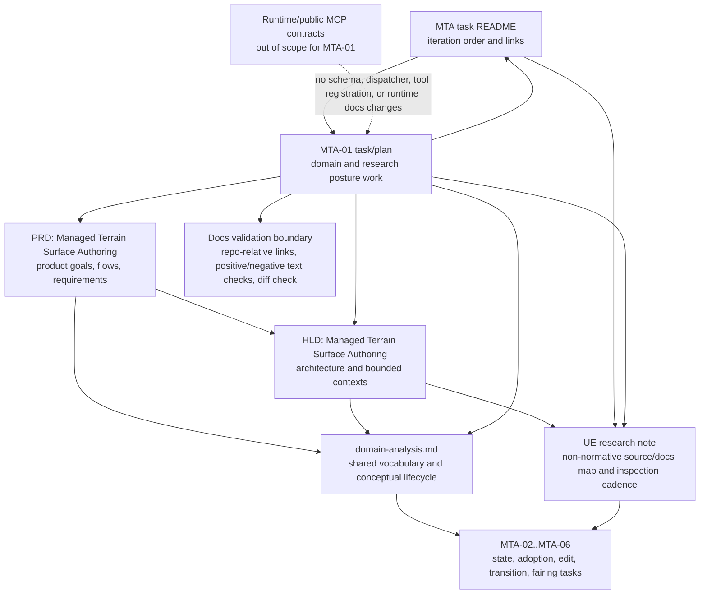

# Technical Plan: MTA-01 Establish Managed Terrain Domain And Research Reference Posture
**Task ID**: `MTA-01`
**Title**: `Establish Managed Terrain Domain And Research Reference Posture`
**Status**: `finalized`
**Date**: `2026-04-24`

## Source Task

- [Establish Managed Terrain Domain And Research Reference Posture](./task.md)

## Problem Summary

Managed Terrain Surface Authoring now has a product and architecture direction, but the shared domain analysis does not yet name Managed Terrain Surface as a formal domain concept. The repo also has a root-level UE terrain guide that contains useful research pointers mixed with blank-state HLD, PRD, public-tool, and Ruby architecture suggestions. That posture can mislead later MTA work into treating the guide as source of truth.

This task establishes the documentation boundary needed before terrain implementation tasks depend on shared terminology: domain vocabulary belongs in `specifications/domain-analysis.md`, architecture belongs in the terrain HLD, product requirements belong in the PRD, and UE material becomes a curated non-normative research note.

## Goals

- Add Managed Terrain Surface to the shared domain vocabulary as a terrain-specific Managed Scene Object concept.
- Keep `path`, `pad`, and `retaining_edge` explicitly outside terrain source state.
- Curate the UE guide into a research-only note that preserves useful UE docs/source pointers without retaining blank-state architecture or public tool recommendations.
- Record when later MTA tasks should inspect UE source so deep research happens with the relevant implementation questions.
- Update terrain PRD, HLD, task README, and MTA-01 links so the source-of-truth hierarchy is coherent.

## Non-Goals

- Implement terrain runtime code, storage, adoption, edit kernels, or SketchUp geometry behavior.
- Define public MCP terrain tool names, request schemas, response schemas, or dispatcher behavior.
- Define Ruby class/module names or final repo layout for terrain implementation.
- Define an exact terrain lifecycle state machine, storage schema, migration strategy, or metadata field list.
- Change semantic hardscape behavior or reclassify `path`, `pad`, or `retaining_edge` as terrain.

## Related Context

- [Managed Terrain Surface Authoring PRD](specifications/prds/prd-managed-terrain-surface-authoring.md)
- [Managed Terrain Surface Authoring HLD](specifications/hlds/hld-managed-terrain-surface-authoring.md)
- [SketchUp MCP Domain Analysis](specifications/domain-analysis.md)
- [Managed Terrain Surface Authoring task set](specifications/tasks/managed-terrain-surface-authoring/README.md)
- [MCP tool authoring guidance](specifications/guidelines/mcp-tool-authoring-sketchup.md)
- [PLAT-14 Establish Native MCP Tool Contract And Response Conventions](specifications/tasks/platform/PLAT-14-establish-native-mcp-tool-contract-and-response-conventions/task.md)
- [PLAT-16 Align Residual Public Contract Discoverability With Runtime Constraints](specifications/tasks/platform/PLAT-16-align-residual-public-contract-discoverability-with-runtime-constraints/task.md)
- [STI-02 Explicit Surface Interrogation via sample_surface_z](specifications/tasks/scene-targeting-and-interrogation/STI-02-explicit-surface-interrogation-via-sample-surface-z/task.md)
- [STI-03 Extend sample_surface_z With Profile And Section Sampling](specifications/tasks/scene-targeting-and-interrogation/STI-03-extend-sample-surface-z-with-profile-and-section-sampling/task.md)
- [SVR-04 Add Terrain-Aware Measurement Evidence](specifications/tasks/scene-validation-and-review/SVR-04-add-terrain-aware-measurement-evidence/task.md)
- [SEM-13 Realize Horizontal Cross-Section Terrain Drape For Paths](specifications/tasks/semantic-scene-modeling/SEM-13-realize-horizontal-cross-section-terrain-drape-for-paths/task.md)

## Research Summary

- `sample_surface_z`, profile sampling, terrain profile measurement, and `path + surface_drape` are implemented terrain-adjacent capabilities, but they are read-only interrogation, measurement, or hardscape creation behavior. They are not Managed Terrain Surface authoring.
- `eval_ruby` is already classified as an escape hatch, not the normal product path for first-class terrain authoring.
- Existing domain analysis defines Managed Scene Object identity and hardscape classification rules, but lacks Managed Terrain Surface.
- The terrain HLD already says public tool shape is out of scope, terrain state does not live in the existing `su_mcp` metadata dictionary, and UE-inspired operations are internal references rather than public architecture.
- Grok 4.20 review agreed with the overall direction and identified two corrections adopted here: avoid heavy lifecycle/state-machine vocabulary in MTA-01, and curate the UE guide rather than merely relocating it intact.

## Technical Decisions

### Data Model

`domain-analysis.md` should introduce Managed Terrain Surface as a terrain-specific Managed Scene Object concept, not as an implementation class, public tool, or storage record.

The domain update should include:

- a terminology entry for Managed Terrain Surface
- a Scene Objects table row for Managed Terrain Surface
- a product-slice categorization row for Managed Terrain Surface Authoring
- a short lifecycle mapping that relates Managed Terrain Surface to existing Managed Scene Object lifecycle concepts

Lifecycle text must remain conceptual:

- a source surface is pre-managed adoption input
- an adopted terrain surface becomes a terrain-specific Managed Scene Object
- edited terrain maps to revised managed-object behavior
- stale or invalid derived output is a terrain-specific integrity condition, not a complete state machine
- exact terrain lifecycle states, storage details, and migration behavior are deferred to `MTA-02`

### API and Interface Design

No runtime API or public MCP interface changes are planned.

Documentation interface decisions:

- Create `specifications/research/managed-terrain/ue-reference-phase1.md` as the curated UE research note.
- Remove the active root-level UE terrain guide after useful research content is curated.
- Update HLD/task links to point at the curated research note.
- Keep PRD links light; PRD should remain product-focused and should not depend on UE implementation details.

### Public Contract Updates

Not applicable.

This task must not change:

- public tool names
- request schemas
- response schemas
- runtime loader definitions
- dispatcher routing
- contract fixtures
- README tool examples

If implementation starts touching these surfaces, the task has left scope.

### Error Handling

The relevant failure modes are documentation failures:

- stale links after moving the research guide
- duplicated HLD/PRD content in the curated UE note
- UE-style public tool names surviving as apparent recommendations
- lifecycle wording implying a storage-backed state machine
- hardscape wording implying `path`, `pad`, or `retaining_edge` are terrain source state

The implementation should prevent these through text structure and detect them through positive and negative checks.

### State Management

No runtime state is introduced.

Documentation state ownership:

- PRD owns product goals, flows, requirements, and success metrics.
- HLD owns architecture, bounded contexts, storage posture, and diagrams.
- Domain analysis owns shared vocabulary and conceptual lifecycle mapping.
- Curated UE research note owns non-normative UE docs/source pointers and inspection cadence.
- Task README owns iteration order and task links.

### Integration Points

- `specifications/domain-analysis.md` integrates the new domain vocabulary with existing Managed Scene Object and hardscape language.
- `specifications/hlds/hld-managed-terrain-surface-authoring.md` links to the curated UE note and stops treating the root guide as the reference path.
- `specifications/prds/prd-managed-terrain-surface-authoring.md` no longer carries stale conflict/open-question language claiming the domain term is missing after this task lands.
- `specifications/tasks/managed-terrain-surface-authoring/README.md` links to the curated note and keeps the MTA task order coherent.
- `specifications/tasks/managed-terrain-surface-authoring/MTA-01-establish-managed-terrain-domain-and-research-reference-posture/task.md` links to this plan through `./plan.md`.

### Configuration

Not applicable. There are no runtime configuration sources, defaults, or override rules in this task.

## Architecture Context

## Key Relationships

- Managed Terrain Surface extends Managed Scene Object vocabulary for terrain authoring without absorbing hardscape semantics.
- The curated UE note supports later research but is subordinate to PRD/HLD/domain/task sources.
- Later MTA tasks use the curated note to decide when to inspect UE source, not to import UE architecture.
- Public MCP contract ownership remains untouched.

## Acceptance Criteria

- `domain-analysis.md` defines `Managed Terrain Surface` as a terrain-specific Managed Scene Object concept.
- `domain-analysis.md` explains that a source surface is adoption input, while managed terrain state and derived output are terrain-owned concepts refined by later MTA tasks.
- `domain-analysis.md` explicitly states that `path`, `pad`, and `retaining_edge` remain separate hardscape Managed Scene Objects and are outside terrain source state.
- `domain-analysis.md` adds Managed Terrain Surface Authoring to the relevant domain/product-slice categorization without changing existing ownership of targeting, semantic modeling, validation, or asset reuse.
- `domain-analysis.md` includes only lightweight lifecycle mapping and explicitly defers exact terrain state machine/storage details to later MTA work, especially `MTA-02`.
- A curated UE research note exists under `specifications/research/managed-terrain/`.
- The curated UE research note is clearly labeled non-normative and research-only.
- The curated UE research note does not read as a PRD, HLD, repo layout proposal, public MCP contract proposal, or Ruby class/module design.
- The curated UE research note preserves useful UE documentation/source pointers for later research.
- The curated UE research note includes a UE inspection cadence covering `MTA-01` through `MTA-06`, with substantial UE source inspection starting at `MTA-04` and deepening in `MTA-05`/`MTA-06`.
- The original root-level UE guide is removed from active source-of-truth posture after the curated note is created.
- Terrain HLD links point to the curated research note and no longer imply the root guide is normative architecture input.
- Terrain PRD and HLD conflict/open-question language is updated so the missing-domain-term issue is no longer stale after `domain-analysis.md` is updated.
- MTA task README links to the curated research note and keeps the task order/refinement posture coherent.
- MTA-01 task links and plan backlink remain repo-relative.
- No public MCP terrain tool names, request schemas, response schemas, dispatcher entries, runtime registrations, or README tool examples are introduced.
- Source-of-truth docs do not promote UE-style names such as `terrain.flatten`, `terrain.smooth`, or `terrain.ramp` as public tool commitments.
- Validation commands prove the expected text/link posture and report no whitespace errors via `git diff --check`.

## Test Strategy

### TDD Approach

Use documentation-first checks before and after edits:

1. Write or run the expected positive and negative text checks against the current repo to confirm the current failure shape.
2. Curate the UE research note and update source docs in small patches.
3. Re-run the checks after each patch cluster so stale links, promoted public tool names, or missing domain vocabulary are caught early.

### Required Test Coverage

- Positive checks:
  - `Managed Terrain Surface` appears in `specifications/domain-analysis.md`.
  - `specifications/domain-analysis.md` contains hardscape separation language for `path`, `pad`, and `retaining_edge`.
  - curated research note contains `non-normative` and `research-only` posture.
  - curated research note contains a `UE Inspection Cadence` table.
  - curated research note references `MTA-04`, `MTA-05`, and `MTA-06`.
  - HLD and task README link to `specifications/research/managed-terrain/ue-reference-phase1.md`.
- Negative checks:
  - source-of-truth docs do not promote `terrain.create_surface`, `terrain.flatten`, `terrain.smooth`, or `terrain.ramp` as public tool commitments.
  - curated research note does not contain active repo-layout or public MCP tool recommendations.
  - the former root-level UE terrain guide no longer remains as an active source file.
  - no source-of-truth docs under `specifications/` still reference the former root-level UE terrain guide after the curated note lands.
- General checks:
  - `git diff --check -- specifications/domain-analysis.md specifications/hlds/hld-managed-terrain-surface-authoring.md specifications/prds/prd-managed-terrain-surface-authoring.md specifications/tasks/managed-terrain-surface-authoring specifications/research/managed-terrain`

## Instrumentation and Operational Signals

- No runtime instrumentation is needed.
- Operational signal for this docs task is clean validation output from positive/negative text checks and `git diff --check`.

## Implementation Phases

1. Curate the UE research note into `specifications/research/managed-terrain/ue-reference-phase1.md`, preserving only research-useful UE references, responsible-use rules, and inspection cadence.
2. Remove the active root-level UE guide after the curated note exists.
3. Update `specifications/domain-analysis.md` with Managed Terrain Surface terminology, categorization, hardscape separation, and lightweight lifecycle mapping.
4. Update terrain HLD, PRD, task README, and MTA-01 references to the curated note and resolved domain posture.
5. Run validation checks and make only targeted wording/link fixes if failures appear.

## Rollout Approach

- Land as documentation/specification changes only.
- Keep public contract delta at none.
- If validation reveals any stale public-tool wording, remove or reframe it before considering the task complete.

## Risks and Controls

- Research note still reads as source of truth: trim blank-state HLD/PRD material and keep a strong non-normative banner.
- Domain lifecycle becomes premature state machine: use lifecycle mapping only and defer exact state machine/storage details to `MTA-02`.
- Hardscape boundary weakens: repeat that `path`, `pad`, and `retaining_edge` remain separate Managed Scene Objects outside terrain source state.
- Public contract drift: use negative checks for UE-style public tool names in source-of-truth docs.
- Stale links after moving guide: update HLD, PRD if needed, task README, and task references in the same change.
- PRD/HLD open questions stay stale: narrow or update missing-domain-term language after domain analysis is updated.

## Premortem

### Intended Goal Under Test

`MTA-01` must leave later terrain tasks with a clear domain term and a safe research posture: Managed Terrain Surface is named without blurring terrain and hardscape ownership, while UE references remain useful for later research without defining public tools, Ruby architecture, or final lifecycle/storage details.

### Failure Paths and Mitigations

- **Base assumptions that could lead us astray**
  - Business-plan mismatch: the task needs to remove ambiguity around source-of-truth hierarchy, but the plan could optimize for preserving the original UE guide too faithfully.
  - Root-cause failure path: the curated UE note keeps enough blank-state HLD/PRD material that contributors still treat it as architecture guidance.
  - Why this misses the goal: MTA-02 through MTA-06 may import old public tool names, class suggestions, or repo-layout assumptions.
  - Likely cognitive bias: preservation bias around a long research artifact.
  - Classification: can be validated before implementation.
  - Mitigation now: the implementation phases require curation, not relocation, and the test strategy includes negative checks against repo-layout and public-tool recommendations.
  - Required validation: manual review plus negative `rg` checks showing the curated note no longer reads as PRD, HLD, repo layout, public MCP contract, or Ruby class/module design.

- **Shortcuts that could weaken the outcome**
  - Business-plan mismatch: the task needs a formal domain concept, but a shortcut could add only a scattered mention of Managed Terrain Surface.
  - Root-cause failure path: `domain-analysis.md` gets a terminology bullet but no table/category placement or lifecycle mapping.
  - Why this misses the goal: later MTA tasks would still have to rediscover ownership and lifecycle vocabulary.
  - Likely cognitive bias: minimal-edit bias.
  - Classification: can be validated before implementation.
  - Mitigation now: acceptance criteria require terminology, Scene Objects placement, product-slice categorization, and lightweight lifecycle mapping.
  - Required validation: positive checks for Managed Terrain Surface in the relevant domain-analysis sections and review that existing slice ownership remains unchanged.

- **Areas that could be weakly implemented**
  - Business-plan mismatch: the task needs planning vocabulary only, but domain lifecycle text could become an accidental state machine.
  - Root-cause failure path: wording defines exact terrain states, storage statuses, or migration behavior that belongs in `MTA-02`.
  - Why this misses the goal: downstream tasks inherit premature storage and lifecycle commitments.
  - Likely cognitive bias: over-specification as a substitute for clarity.
  - Classification: can be validated before implementation.
  - Mitigation now: lifecycle text must be a mapping to existing Managed Scene Object concepts and must explicitly defer exact terrain state machine/storage details to `MTA-02`.
  - Required validation: review `domain-analysis.md` for the deferment phrase and absence of storage schema or migration commitments.

- **Tests and evaluations needed to stay on track**
  - Business-plan mismatch: the task needs durable source-link coherence, but local review could miss stale root-guide references.
  - Root-cause failure path: links are updated in one or two docs while another PRD, HLD, task README, or task file still points to the root guide.
  - Why this misses the goal: contributors follow stale links and revive the old guide as active authority.
  - Likely cognitive bias: spot-check bias.
  - Classification: can be validated before implementation.
  - Mitigation now: required validation includes repo-wide searches for the old root filename and checks that HLD/task README point to the curated research note.
  - Required validation: repo-wide stale-reference search under `specifications/`, positive checks for `specifications/research/managed-terrain/ue-reference-phase1.md`, plus `git diff --check`.

- **What must be true for the task to succeed**
  - Business-plan mismatch: the task must not change public MCP contracts, but UE-style operation names are tempting shorthand.
  - Root-cause failure path: source-of-truth docs mention `terrain.flatten`, `terrain.smooth`, `terrain.ramp`, or similar names as if they are accepted public tools.
  - Why this misses the goal: public contract work would be smuggled into an HLD/domain task and later implementation would optimize around the wrong boundary.
  - Likely cognitive bias: terminology anchoring from UE.
  - Classification: can be validated before implementation.
  - Mitigation now: public contract delta remains `Not applicable`, and negative checks are mandatory for promoted UE-style public tool names.
  - Required validation: negative checks over PRD, HLD, domain analysis, task README, and MTA-01 task/plan for UE-style public tool commitments.

- **Second-order and third-order effects**
  - Business-plan mismatch: the task needs later MTA work to know when to inspect UE source, but overly broad cadence text could invite deep UE research before the relevant task.
  - Root-cause failure path: `MTA-02` or `MTA-03` are framed as broad UE source-inspection tasks instead of targeted optional checks.
  - Why this misses the goal: early tasks could stall on research not needed for state/storage or adoption.
  - Likely cognitive bias: research completeness bias.
  - Classification: can be validated before implementation.
  - Mitigation now: the curated note must include a `UE Inspection Cadence` table stating that substantial UE source inspection starts at `MTA-04`, with `MTA-02`/`MTA-03` limited to targeted checks only if directly useful.
  - Required validation: positive check for the `UE Inspection Cadence` table and review that the cadence distinguishes light/targeted earlier inspection from substantial MTA-04+ inspection.

## Dependencies

- [Managed Terrain Surface Authoring PRD](specifications/prds/prd-managed-terrain-surface-authoring.md)
- [Managed Terrain Surface Authoring HLD](specifications/hlds/hld-managed-terrain-surface-authoring.md)
- [SketchUp MCP Domain Analysis](specifications/domain-analysis.md)
- [Managed Terrain Surface Authoring task set](specifications/tasks/managed-terrain-surface-authoring/README.md)
- Original root-level UE guide as raw source material before curation
- Existing public contract posture from PLAT-14 and PLAT-16
- Existing terrain-adjacent completed work from STI-02, STI-03, SVR-04, and SEM-13

## Quality Checks

- [x] All required inputs validated
- [x] Problem statement documented
- [x] Goals and non-goals documented
- [x] Research summary documented
- [x] Technical decisions included
- [x] Architecture context included
- [x] Acceptance criteria included
- [x] Test requirements specified
- [x] Instrumentation and operational signals defined when needed
- [x] Risks and dependencies documented
- [x] Rollout approach documented when needed
- [x] Small reversible phases defined
- [x] Premortem completed with falsifiable failure paths and mitigations
- [x] Planning-stage size estimate considered before premortem finalization
