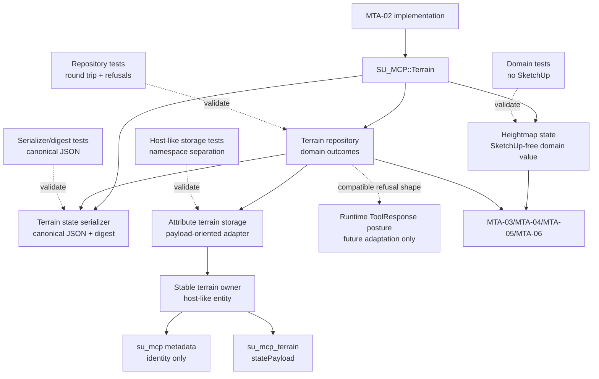

# Technical Plan: MTA-02 Build Terrain State And Storage Foundation
**Task ID**: `MTA-02`
**Title**: `Build Terrain State And Storage Foundation`
**Status**: `implemented`
**Date**: `2026-04-25`

## Source Task

- [Build Terrain State And Storage Foundation](./task.md)

## Problem Summary

Managed terrain authoring needs durable terrain state before adoption, editing, regeneration, or evidence workflows can safely exist. The current runtime can identify managed scene objects through lightweight `su_mcp` metadata and can sample surfaces, but it has no terrain-owned state model, no terrain repository seam, and no terrain-specific storage namespace.

`MTA-02` establishes the first materialized terrain-state foundation as a SketchUp-free owner-local heightmap/grid payload. The state must be loadable, serializable, versioned, integrity-checked, and stored outside `su_mcp` while still attaching to the stable terrain owner that later adoption will create or designate.

## Goals

- Define a SketchUp-free owner-local heightmap/grid terrain state suitable for later adoption and edit tasks.
- Specify the first persisted terrain-state payload as a versioned heightmap/grid schema.
- Establish a terrain repository seam that returns explicit JSON-safe success, absence, and refusal outcomes.
- Store terrain payload data in a terrain-specific namespace outside the existing `su_mcp` metadata dictionary.
- Provide deterministic version, integrity, corrupt-payload, missing-state, oversized-payload, and write-failure behavior.
- Prove the state, serializer, repository, and storage adapter through TDD-focused Ruby coverage.

## Non-Goals

- Adopting existing SketchUp terrain.
- Creating a stable terrain owner from source geometry.
- Creating, replacing, or regenerating terrain mesh output.
- Adding public MCP terrain tools.
- Updating native runtime loader schemas, dispatcher routes, contract fixtures, or README tool examples.
- Implementing grade, transition, smoothing, fairing, or terrain evidence kernels.
- Storing terrain state in sidecar files.
- Mutating or absorbing `path`, `pad`, or `retaining_edge` hardscape objects into terrain state.

## Related Context

- [Managed Terrain Surface Authoring HLD](specifications/hlds/hld-managed-terrain-surface-authoring.md)
- [PRD: Managed Terrain Surface Authoring](specifications/prds/prd-managed-terrain-surface-authoring.md)
- [SketchUp MCP Domain Analysis](specifications/domain-analysis.md)
- [MTA task set README](specifications/tasks/managed-terrain-surface-authoring/README.md)
- [MTA-01 task](specifications/tasks/managed-terrain-surface-authoring/MTA-01-establish-managed-terrain-domain-and-research-reference-posture/task.md)
- [MTA-01 summary](specifications/tasks/managed-terrain-surface-authoring/MTA-01-establish-managed-terrain-domain-and-research-reference-posture/summary.md)
- [Platform HLD](specifications/hlds/hld-platform-architecture-and-repo-structure.md)
- [Managed object metadata](src/su_mcp/semantic/managed_object_metadata.rb)
- [Tool response helper](src/su_mcp/runtime/tool_response.rb)
- [Shared model adapter](src/su_mcp/adapters/model_adapter.rb)

## Research Summary

- `MTA-01` is implemented and names `Managed Terrain Surface` as a terrain-specific Managed Scene Object while keeping semantic hardscape separate from terrain source state.
- The platform runtime is organized into capability subtrees under `src/su_mcp/`; there is no existing terrain slice, so `MTA-02` should introduce `src/su_mcp/terrain/` rather than attaching terrain storage to semantic, validation, or scene-query code.
- `ManagedObjectMetadata` owns the lightweight `su_mcp` metadata dictionary. Terrain heightmap payloads must not be stored in that dictionary.
- `ToolResponse` establishes the runtime-facing success/refusal posture, but `MTA-02` does not expose a public tool. Repository outcomes should be domain-level hashes that can be adapted to `ToolResponse` later.
- Existing terrain-adjacent work in `STI-*` and `SVR-*` is read-only sampling and measurement. It does not provide terrain authoring state or persistence.
- `MTA-03` through `MTA-06` are draft downstream tasks. They constrain this foundation but should not be treated as implemented behavior.
- Step 05 consensus across `grok-4.20` (for), `gpt-5.4` (against), and `grok-4` (neutral) agreed with the minimal heightmap/repository direction, but tightened the plan around exact schema invariants, digest canonicalization, payload-size limits, nullable no-data representation, owner-transform policy, and expanded failure tests.
- The requested final Grok chat verifier was blocked by the safety monitor after the three-model consensus completed. This is recorded as a planning validation gap; the accepted consensus recommendations are still incorporated.

## Technical Decisions

### Data Model

Introduce a new terrain capability subtree:

- `src/su_mcp/terrain/heightmap_state.rb`
- `src/su_mcp/terrain/terrain_state_serializer.rb`
- `src/su_mcp/terrain/terrain_repository.rb`
- `src/su_mcp/terrain/attribute_terrain_storage.rb`

The exact class names may be adjusted during implementation if the local Ruby style suggests clearer names, but the responsibilities must remain separate.

The first persisted terrain-state format is a heightmap/grid payload with these v1 invariants:

- `payloadKind`: `heightmap_grid`
- `schemaVersion`: `1`
- `units`: meters for origin, spacing, and elevation values
- `basis`: owner-local orthonormal XY frame plus vertical convention
- `origin`: owner-local coordinate of the lower-left grid cell center
- `spacing`: positive `x` and `y` grid spacing in meters
- `dimensions`: positive integer `columns` and `rows`
- `indexing`: row-major elevations, where `index = row * columns + column`
- `elevations`: JSON-safe array of numbers or `null`
- `null` elevation means no-data; do not use `NaN` because it is not portable JSON-safe persisted state
- `revision`: monotonic positive integer owned by repository writes
- `stateId`: stable payload identity string generated or supplied by callers where available
- `sourceSummary`: optional JSON-safe source-reference summary that may be `nil` in `MTA-02`; interpretation belongs to adoption in `MTA-03`
- `constraintRefs`: optional array reserved for later read-only terrain constraint references; `MTA-02` only validates and round-trips an empty or JSON-safe array
- `ownerTransformSignature`: optional adapter-produced signature for hosts that expose a transformation; used to detect owner-local transform assumptions that no longer hold
- `digestAlgorithm`: `sha256`
- `digest`: SHA-256 over canonical serialized payload excluding digest fields

The domain value object must:

- expose only hashes, arrays, strings, numbers, booleans, and `nil` through serialization
- avoid raw SketchUp objects and attribute dictionaries
- provide deterministic equality for round-trip tests
- validate dimensions, spacing, basis shape, elevation count, and no-data representation before persistence
- reject unrecognized required fields while round-tripping the explicit optional extension fields above

### API and Interface Design

Repository-facing behavior should be payload-oriented rather than dictionary-oriented:

- `save(owner, state)` returns `{ outcome: 'saved', state: state, summary: ... }` or a refusal outcome
- `load(owner)` returns `{ outcome: 'loaded', state: state, summary: ... }`, `{ outcome: 'absent', reason: 'missing_state' }`, or a refusal outcome
- `delete(owner)` may be introduced only if needed for tests or cleanup; it must remain storage-facing and not imply terrain deletion semantics

Every repository outcome must include enough state for callers to avoid guessing:

- terminal refusals carry `recoverable: false`
- recoverable absence carries `recoverable: true`
- summaries include `serializedBytes` when a payload was read or written

Storage adapter behavior should stay narrow enough to support future chunking/compression without changing domain callers:

- `load_payload(owner)`
- `save_payload(owner, payload_string)`
- `delete_payload(owner)`

Add a deterministic migration harness rather than embedding version branching throughout repository code:

- Define `CURRENT_SCHEMA_VERSION = 1`.
- Saved payloads always include `schemaVersion: 1`.
- Repository load parses the payload, requires `schemaVersion`, and routes that current persisted version through the migration harness before validation/deserialization.
- If `schemaVersion == CURRENT_SCHEMA_VERSION`, the harness performs a current-version no-op migration and passes the payload on unchanged.
- If `schemaVersion < CURRENT_SCHEMA_VERSION`, the harness applies explicit stepwise migrators such as `1 -> 2`, then `2 -> 3`; no future migrators exist in `MTA-02`.
- If `schemaVersion > CURRENT_SCHEMA_VERSION`, loading refuses with `unsupported_version`.
- Future schema-changing tasks own the concrete stepwise migrator and its tests.
- Migration failure is represented by `migration_failed` for future migrator failures; in `MTA-02`, this can be covered through the harness using a forced failing migrator test double rather than by inventing a real migration.

The storage adapter must hide raw attribute dictionaries and must not expose SketchUp handles to terrain domain services.

Recommended terrain namespace:

- dictionary: `su_mcp_terrain`
- payload key: `statePayload`

The exact constants should live in the terrain storage adapter. Tests must pin that payload content is not written to `su_mcp`.

### Public Contract Updates

Not applicable for `MTA-02`.

This task must not add or modify:

- public MCP tool names
- native runtime loader schemas
- dispatcher mappings
- runtime command factory wiring
- native contract fixtures
- README tool lists or examples
- public adoption, edit, or mesh-regeneration behavior

If implementation pressure appears to require a public tool or runtime command, stop and split that into a later task rather than widening `MTA-02`.

### Error Handling

Repository and serializer outcomes must be explicit and JSON-safe. Refusal payloads should be shaped so they can later be passed through `ToolResponse.refusal_result`, but repository code should not require a public MCP boundary.

Required refusal codes:

- `corrupt_payload`: payload is not parseable JSON or cannot be normalized into the expected object
- `unsupported_version`: `schemaVersion` is unsupported
- `invalid_payload`: payload is JSON-valid but violates required shape or invariants
- `integrity_failed`: canonical digest does not match payload content
- `payload_too_large`: serialized payload exceeds the initial storage threshold
- `write_failed`: storage adapter write raises or reports failure
- `owner_transform_unsupported`: storage adapter can detect an owner/basis condition that would invalidate owner-local semantics
- `migration_failed`: a payload version was recognized as migratable but migration did not produce valid v1 state

Missing state should be represented distinctly from corruption:

- `load(owner)` for a terrain owner with no stored payload returns `{ outcome: 'absent', reason: 'missing_state' }`
- callers that require state may convert absence to a refusal at their boundary

Initial serialized-size threshold:

- Use a named constant in the storage adapter, with a planned default of `8 * 1024 * 1024` bytes.
- Tests should verify both under-threshold save and over-threshold refusal.
- Tests should include a representative 512x512 numeric grid or a deterministic equivalent payload-size fixture that proves the threshold is not immediately hostile to realistic first-release terrain.
- The threshold is a guardrail for Phase 1, not evidence that chunking/compression is unnecessary forever.

### State Management

The authoritative terrain state after later adoption will be the stored heightmap payload. In `MTA-02`, no adoption lifecycle is introduced; tests may use a stable owner test double or host-like entity.

State ownership rules:

- `su_mcp` remains lightweight identity metadata only.
- `su_mcp_terrain` owns the serialized heightmap payload.
- The repository owns version/integrity enforcement.
- The serializer owns canonical payload normalization.
- The terrain domain object owns heightmap invariants.
- Derived mesh output remains out of scope.

Owner-local transform posture:

- Domain state stores owner-local basis data, not raw SketchUp transforms.
- The storage adapter may store an `ownerTransformSignature` when the owner exposes a stable transform representation.
- On load, a detectable incompatible transform signature must return `owner_transform_unsupported` rather than letting downstream code reinterpret stale local coordinates.
- Full reparenting and regeneration recovery remains a later adoption/edit concern.

Revision behavior:

- A persisted state carries a monotonic integer `revision`.
- The first saved state may start at `1`.
- A later save of a loaded state increments revision only if implementation can do so without inventing adoption/edit semantics; otherwise the repository must preserve supplied revision and document that edit-time revision increments belong to later tasks.

### Integration Points

Integration with existing code is intentionally narrow:

- `src/su_mcp/semantic/managed_object_metadata.rb`: remains the owner of lightweight Managed Scene Object identity metadata and is not expanded to store terrain payloads.
- `src/su_mcp/runtime/tool_response.rb`: informs refusal shape compatibility, but no runtime tool is added.
- `src/su_mcp/adapters/model_adapter.rb`: may remain unchanged. Terrain storage may use direct host-like owner attribute methods inside `AttributeTerrainStorage` because the storage behavior is capability-specific and narrow.
- `test/support/semantic_test_support.rb` and scene-query support doubles provide patterns for host-like attribute entities, but terrain tests should add terrain-local doubles if that is clearer.

### Configuration

No user-facing configuration is introduced.

Internal constants should define:

- current `schemaVersion`
- terrain dictionary name
- terrain payload key
- digest algorithm
- maximum serialized payload bytes

Do not add environment variables, settings files, or MCP-visible options in this task.

## Architecture Context

## Key Relationships

- `MTA-02` creates the terrain state and storage foundation consumed by `MTA-03` adoption and later edit kernels.
- `MTA-02` depends on `MTA-01` for Managed Terrain Surface terminology and hardscape separation.
- The terrain payload is attached to a stable owner but is not the same as the owner identity metadata.
- The repository hides storage details from domain code and future edit kernels.
- Existing sampling and measurement surfaces are related context only; they do not own terrain state.

## Acceptance Criteria

- A heightmap/grid terrain state can be created, validated, compared, and serialized in isolated Ruby tests without raw SketchUp objects.
- The v1 payload schema is deterministic and includes schema version, owner-local basis, grid origin, spacing, dimensions, row-major elevations, nullable no-data entries, revision, optional source/constraint extension fields, optional owner transform signature, and digest metadata.
- Canonical serialization produces the same digest for semantically identical payloads regardless of hash insertion order.
- The repository can save and load a supported terrain state through a host-like owner and the loaded state equals the original state.
- Terrain payload data is stored in `su_mcp_terrain` or the chosen terrain namespace, and tests prove raw payload data is not written into `su_mcp`.
- Missing stored state returns an explicit absent/missing-state outcome without fabricating a terrain state.
- Corrupt JSON, malformed-but-JSON-valid payloads, unsupported versions, digest mismatches, oversized payloads, migration failures, owner-transform mismatches, and write failures return explicit JSON-safe refusal outcomes.
- Repository outcomes identify whether the outcome is recoverable or terminal so downstream adoption/edit commands do not guess.
- Repository summaries expose serialized byte size without returning the full payload by default.
- The storage adapter does not expose raw attribute dictionaries or raw SketchUp objects to terrain domain services.
- No public MCP tool catalog, schema, dispatcher, contract fixture, or README tool example changes are made.
- The foundation leaves later chunking, compression, sidecar storage, adoption, mesh regeneration, and edit kernels possible without changing the domain-facing repository contract.

## Test Strategy

### TDD Approach

Implement from the most isolated behavior outward:

1. Write failing tests for the heightmap state invariants and equality semantics.
2. Write failing tests for canonical serialization, stable key ordering, digest generation, and digest verification.
3. Write failing repository tests for save/load round trips and the required refusal/absence outcomes.
4. Write failing host-like storage tests proving namespace separation from `su_mcp` and write-failure behavior.
5. Add negative tests for oversized payloads, unsupported versions, corrupt JSON, malformed valid JSON, digest mismatches, and invalid owner/basis conditions.
6. Run focused terrain tests first, then broader Ruby tests and linting.

### Required Test Coverage

- `test/terrain/heightmap_state_test.rb`
  - valid state construction
  - invalid dimensions, spacing, basis, and elevation count
  - nullable no-data entries
  - equality after serialization round trip
- `test/terrain/terrain_state_serializer_test.rb`
  - v1 schema output
  - canonical key ordering
  - digest generation and verification
  - unsupported schema versions
  - malformed valid JSON shape refusal
  - corrupt JSON refusal
  - current-version no-op migration through the migration harness and a forced migration failure path
  - no-op migration output proceeds into normal v1 validation/deserialization and round trips as a `HeightmapState`
- `test/terrain/terrain_repository_test.rb`
  - save/load round trip
  - missing state outcome
  - recoverable vs terminal outcome semantics
  - integrity failure refusal
  - oversized payload refusal
  - representative under-threshold 512x512-equivalent payload
  - owner transform mismatch refusal when a host-like owner exposes transform signature data
  - write failure refusal
  - no raw storage handle exposure
- `test/terrain/attribute_terrain_storage_test.rb`
  - writes payload under terrain namespace
  - does not write payload under `su_mcp`
  - reads host-like attribute dictionaries
  - deletes payload if delete support is included

Required validation commands:

- `bundle exec ruby -Itest test/terrain/heightmap_state_test.rb`
- `bundle exec ruby -Itest test/terrain/terrain_state_serializer_test.rb`
- `bundle exec ruby -Itest test/terrain/terrain_repository_test.rb`
- `bundle exec ruby -Itest test/terrain/attribute_terrain_storage_test.rb`
- `bundle exec rake ruby:test`
- `bundle exec rake ruby:lint`

Package verification is optional for this isolated runtime-support slice unless implementation touches packaging, load paths, or extension metadata.

SketchUp-hosted verification is strongly preferred for `MTA-02`: create a real group, write terrain payload attributes, save/reopen or equivalent hosted persistence check, and verify repository load. If hosted verification is not practical in the implementation session, document that gap explicitly and treat hosted persistence as a blocking validation item for `MTA-03` before adoption is called supported.

## Instrumentation and Operational Signals

No runtime instrumentation is required because no public tool or long-running service behavior changes.

Implementation should expose compact repository summaries for future command callers:

- schema version
- revision
- grid dimensions
- digest algorithm
- digest prefix or full digest where useful
- serialized byte size
- recoverability flag on absence/refusal outcomes
- owner transform signature status when available

These summaries should remain JSON-safe and should not include the full heightmap payload by default.

## Implementation Phases

1. Add the terrain domain state with validation and equality tests.
2. Add the canonical serializer and digest behavior with schema/refusal tests.
3. Add the payload-oriented storage adapter with host-like namespace tests.
4. Add the terrain repository and round-trip/refusal tests.
5. Add payload-size guardrails and write-failure handling.
6. Add migration no-op, transform-signature, recoverability, and summary-byte tests.
7. Run focused tests, then Ruby test and lint gates.
8. Run hosted persistence smoke if practical, or document the precise gap.
9. Update task artifacts only if implementation reveals a task-level correction.

## Rollout Approach

- Land as internal runtime support only.
- Do not wire to public MCP tools.
- Do not advertise a user-facing terrain capability yet.
- Treat downstream `MTA-03` as the first product-visible consumer.
- If payload size or host persistence issues appear during implementation, keep the repository contract stable and either tighten the threshold or create a follow-up task for chunking/compression.

## Risks and Controls

- **Schema calcification risk**: The first schema will constrain downstream adoption and edit work.
  Control: define exact v1 invariants, schema version, deterministic migration harness, and canonical serialization now.
- **Digest false-negative risk**: Non-canonical JSON can make unchanged payloads fail integrity checks.
  Control: canonicalize keys and digest only the normalized payload excluding digest fields.
- **Attribute payload size risk**: A large heightmap may bloat or fail SketchUp model-embedded attributes.
  Control: enforce an 8 MiB Phase 1 serialized-size threshold, test a representative 512x512-equivalent payload, expose `serializedBytes`, and return `payload_too_large` when exceeded.
- **Namespace leakage risk**: Terrain payloads could accidentally be written into `su_mcp`.
  Control: pin storage namespace tests and keep `ManagedObjectMetadata` unchanged.
- **Owner-local transform risk**: Non-rigid, mirrored, or reparented owners could invalidate stored basis assumptions.
  Control: constrain the v1 basis to owner-local orthonormal semantics, persist an adapter-level transform signature where possible, and return `owner_transform_unsupported` for detectable mismatches; defer full reparent/regeneration behavior to adoption/edit tasks.
- **Missing-state ambiguity risk**: Absence could be confused with corrupt state.
  Control: use an `absent` outcome for missing payloads, include recoverability flags, and reserve terminal refusals for corrupt or unsafe state.
- **Migration dead-end risk**: Version fields without a deterministic migration harness could force later tasks to scatter version branching or treat all old payloads as terminal failures.
  Control: add a current-version no-op migration path through the harness and document that future schema-changing tasks must add explicit stepwise migrators such as `1 -> 2` and `2 -> 3`.
- **Host-double blind spot risk**: Host-like doubles could pass while real SketchUp attribute persistence fails.
  Control: prefer a hosted persistence smoke in `MTA-02`; if unavailable, record the gap and require it before `MTA-03` support claims.
- **Over-abstraction risk**: A generic terrain state framework could exceed the foundation slice.
  Control: implement only heightmap/grid v1 while naming repository boundaries around terrain state for future evolution.
- **Public contract drift risk**: Internal terrain support could accidentally widen public MCP behavior.
  Control: no loader, dispatcher, command factory, contract fixture, or README tool changes in this task.

## Dependencies

- `MTA-01` completed domain terminology and research posture.
- [Managed Terrain Surface Authoring HLD](specifications/hlds/hld-managed-terrain-surface-authoring.md)
- [PRD: Managed Terrain Surface Authoring](specifications/prds/prd-managed-terrain-surface-authoring.md)
- [SketchUp MCP Domain Analysis](specifications/domain-analysis.md)
- Existing Ruby runtime and test structure under `src/su_mcp/` and `test/`
- Ruby JSON and digest standard libraries

## Step 05 Consensus Record

Models consulted:

- `grok-4.20` with a supportive stance
- `gpt-5.4` with an adversarial stance
- `grok-4` with a neutral stance

Consensus agreement:

- Proceed with an owner-local heightmap/grid state and repository seam.
- Keep the terrain payload outside `su_mcp`.
- Avoid public MCP surface changes in `MTA-02`.
- Use explicit version, digest, and refusal behavior from the first persisted format.
- Keep the storage adapter narrow enough for future chunking/compression.

Plan changes caused by consensus:

- Add exact indexing, origin, units, basis, no-data, revision, digest, and size-threshold decisions.
- Add `payload_too_large` and `owner_transform_unsupported` to the refusal taxonomy.
- Add deterministic migration harness semantics, recoverability flags, transform signatures, serialized byte summaries, and optional source/constraint extension fields after premortem review.
- Use nullable no-data instead of `NaN`.
- Require canonical digest determinism tests and malformed-valid-JSON tests.
- Treat missing payload as an `absent` outcome rather than corruption.

Remaining deferred decisions:

- Compression and chunking strategy.
- Sidecar storage.
- Real adoption owner creation.
- Derived terrain output regeneration.
- Terrain edit revision semantics beyond repository persistence.

## Premortem

### Intended Goal Under Test

`MTA-02` must create a durable, internal terrain state and storage foundation that lets later managed terrain adoption and edit workflows treat stored heightmap state as the source of truth instead of returning to live SketchUp TIN surgery.

### Failure Paths and Mitigations

- **Base assumptions that could lead us astray**
  - Business-plan mismatch: The business needs a foundation usable by adoption and edit tasks; the draft plan optimized for a minimal heightmap object.
  - Root-cause failure path: The v1 schema is too narrow to carry source/adoption summaries or later constraint references, so `MTA-03` or `MTA-04` mutates the schema immediately or re-samples live TIN state.
  - Why this misses the goal: Stored terrain state would not become the durable authoring substrate.
  - Likely cognitive bias: Minimal-slice bias.
  - Classification: can be validated before implementation.
  - Mitigation now: Add optional `sourceSummary` and `constraintRefs` fields that `MTA-02` only validates and round-trips.
  - Required validation: serializer and repository round-trip tests with empty and populated optional extension fields.
- **Shortcuts that could weaken the outcome**
  - Business-plan mismatch: The business needs model-embedded state durable enough for representative terrain; the draft plan used a small arbitrary size threshold.
  - Root-cause failure path: A realistic first-release grid exceeds the threshold and forces immediate refusal or sidecar pressure.
  - Why this misses the goal: Downstream workflows would reject practical terrain before authoring starts.
  - Likely cognitive bias: Convenience anchoring on a round number.
  - Classification: can be validated before implementation.
  - Mitigation now: Raise the initial threshold to 8 MiB and test a 512x512-equivalent payload.
  - Required validation: under-threshold representative payload test plus over-threshold refusal test.
- **Areas that could be weakly implemented**
  - Business-plan mismatch: The business needs reliable owner-local state; a weak implementation may ignore changed host transforms.
  - Root-cause failure path: Owner movement, non-rigid transform, or reparenting invalidates stored basis assumptions and downstream code silently interprets stale coordinates.
  - Why this misses the goal: Regeneration or edits could drift, pushing workflows back to live TIN corrections.
  - Likely cognitive bias: Mock-friendly abstraction bias.
  - Classification: requires implementation-time instrumentation or acceptance testing.
  - Mitigation now: Add optional `ownerTransformSignature` and `owner_transform_unsupported` refusal for detectable mismatches.
  - Required validation: host-like transform mismatch test, plus hosted persistence smoke where practical.
- **Tests and evaluations needed to stay on track**
  - Business-plan mismatch: The business needs persistence in SketchUp models, not just Ruby hash round trips.
  - Root-cause failure path: Host-like doubles pass while real SketchUp attribute persistence or save/reopen behavior fails.
  - Why this misses the goal: Terrain state could disappear or corrupt between sessions.
  - Likely cognitive bias: Unit-test sufficiency bias.
  - Classification: requires implementation-time instrumentation or acceptance testing.
  - Mitigation now: Require a hosted persistence smoke if practical, or explicitly carry the gap into `MTA-03` as blocking validation.
  - Required validation: real group attribute write/read and save/reopen or equivalent hosted persistence evidence.
- **What must be true for the task to succeed**
  - Business-plan mismatch: Later commands need to know whether missing/corrupt state can be recovered; the draft plan only separated `absent` from refusal.
  - Root-cause failure path: Downstream callers handle absence, migration, or corruption inconsistently and re-adopt from live TIN without policy.
  - Why this misses the goal: Live TIN becomes the practical fallback source of truth again.
  - Likely cognitive bias: Assuming callers will infer intent from outcome strings.
  - Classification: can be validated before implementation.
  - Mitigation now: Add `recoverable` semantics to repository outcomes and test terminal vs recoverable cases.
  - Required validation: repository tests for `absent` recoverable and corrupt/integrity/write refusals terminal.
- **Second-order and third-order effects**
  - Business-plan mismatch: Version fields alone do not guarantee evolvability; later tasks need a controlled migration path.
  - Root-cause failure path: Version branching spreads through repository and downstream code, or all future versions become terminal unsupported failures.
  - Why this misses the goal: Terrain state becomes brittle as soon as the first format changes.
  - Likely cognitive bias: Labeling versioning as migration strategy.
  - Classification: can be validated before implementation.
  - Mitigation now: Add a deterministic migration harness that passes current v1 payloads through a no-op migration and documents future explicit stepwise migrators.
  - Required validation: current-version no-op-migration-through-harness test and forced migration failure refusal test.

## Quality Checks

- [x] All required inputs validated
- [x] Problem statement documented
- [x] Goals and non-goals documented
- [x] Research summary documented
- [x] Technical decisions included
- [x] Architecture context included
- [x] Acceptance criteria included
- [x] Test requirements specified
- [x] Instrumentation and operational signals defined when needed
- [x] Risks and dependencies documented
- [x] Rollout approach documented when needed
- [x] Small reversible phases defined
- [x] Premortem completed with falsifiable failure paths and mitigations
- [x] Planning-stage size estimate considered before premortem finalization

## Implementation Closeout

- Implemented the planned terrain subtree under `src/su_mcp/terrain/` with `HeightmapState`, `TerrainStateSerializer`, `AttributeTerrainStorage`, and `TerrainRepository`.
- Preserved the internal-only boundary: no public MCP tools, dispatcher mappings, native schemas, contract fixtures, or README tool examples changed.
- Added terrain-focused Minitest coverage under `test/terrain/`, including a skipped hosted smoke marker for the remaining live SketchUp persistence review.
- PAL codereview with `grok-4.20` completed. Follow-up changes added default older-version migration coverage, removed a redundant repository parse after save, and froze normalized elevation arrays.
- Live SketchUp save/reopen verification was not run in this implementation pass; the task is complete locally and awaiting live SketchUp review for hosted persistence evidence.
