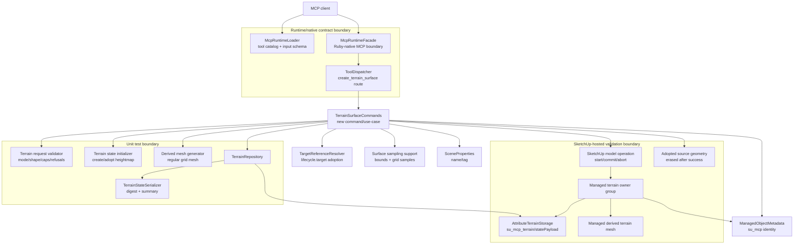

# Technical Plan: MTA-03 Create Or Adopt Managed Terrain Surface
**Task ID**: `MTA-03`
**Title**: `Create Or Adopt Managed Terrain Surface`
**Status**: `implemented`
**Date**: `2026-04-25`

## Source Task

- [Create Or Adopt Managed Terrain Surface](./task.md)

## Problem Summary

Managed Terrain Surface state exists after `MTA-02`, but clients still cannot create a targetable managed terrain object without arbitrary Ruby setup. `MTA-03` provides the first public terrain creation surface: one simple explicit grid-backed create path and one narrow adoption path for a supported existing source surface. Both paths must produce a stable managed terrain owner, lightweight semantic metadata, persisted terrain state, and owned derived terrain output.

The adoption path is intentionally replacement-oriented: it samples the existing source surface into managed heightmap state, regenerates a managed terrain mesh from that state, and removes the unmanaged source geometry only after the managed output has succeeded inside one SketchUp operation.

## Goals

- Add a public `create_terrain_surface` MCP tool owned by terrain runtime behavior.
- Support `lifecycle.mode: "create"` for a deliberately simple flat heightmap grid.
- Support `lifecycle.mode: "adopt"` for one explicit supported sampleable source surface.
- Persist terrain state through `SU_MCP::Terrain::TerrainRepository` and `su_mcp_terrain/statePayload`.
- Generate deterministic managed derived mesh output from saved heightmap state.
- Write lightweight `su_mcp` owner metadata with `semanticType: "managed_terrain_surface"`.
- Support optional wrapper `sceneProperties.name` and `sceneProperties.tag`.
- Support optional global `placement.origin` for create without hierarchy-aware placement.
- Provide structured JSON-safe success evidence and refusals.
- Validate public contract wiring, command behavior, undo, source replacement, and save/reopen coherence.

## Non-Goals

- Broad TIN import, mesh repair, contour import, procedural terrain generation, or naturalistic terrain synthesis.
- Public sampling-policy controls for adoption.
- Public elevation-array create mode.
- Parent or hierarchy-aware placement for terrain owners.
- Bounded terrain edits, corridor transitions, fairing, smoothing, or sculpting.
- Mutating or absorbing semantic hardscape objects.
- Durable references to generated terrain faces or vertices.
- Public Unreal-style terrain tools.
- Warning payloads in MTA-03; non-ideal expected cases should refuse.

## Related Context

- `specifications/hlds/hld-managed-terrain-surface-authoring.md`
- `specifications/prds/prd-managed-terrain-surface-authoring.md`
- `specifications/domain-analysis.md`
- `specifications/guidelines/ryby-coding-guidelines.md`
- `specifications/guidelines/sketchup-extension-development-guidance.md`
- `specifications/guidelines/mcp-tool-authoring-sketchup.md`
- `specifications/tasks/managed-terrain-surface-authoring/MTA-02-persist-heightmap-state-and-metadata/plan.md`
- `specifications/tasks/scene-targeting-and-interrogation/STI-02-targeted-surface-querying/task.md`
- `specifications/tasks/scene-targeting-and-interrogation/STI-03-surface-profile-sampling/task.md`

## Research Summary

- `MTA-02` already provides `HeightmapState`, `TerrainStateSerializer`, `TerrainRepository`, and `AttributeTerrainStorage`, including hosted save/reopen coverage.
- Terrain state is owner-local, SketchUp-free, serialized as canonical JSON, and stored under `su_mcp_terrain/statePayload`.
- `sample_surface_z` and supporting scene-query code already resolve explicit targets and sample transformed/nested faces. Adoption should reuse this support where practical, but should not call the public MCP tool internally.
- Runtime public tools are exposed through `McpRuntimeLoader`, `ToolDispatcher`, `McpRuntimeFacade`, and `RuntimeCommandFactory`; public contract changes must update all of those plus tests, docs, and fixtures.
- Existing selector vocabulary supports `lifecycle.target` in create/adopt style flows. MTA-03 must not introduce new `sourceSurface`, `surfaceTarget`, or predicate-search selector vocabulary for adoption.
- Existing `SceneProperties` already supports wrapper `name` and `tag`; this can be reused for managed terrain owner presentation.
- Curated UE terrain research is non-normative for MTA-03. No broad UE source inspection is required for this slice.

## Technical Decisions

### Data Model

Managed terrain output has three distinct layers:

- Lightweight owner metadata in `su_mcp`, written to the managed terrain owner group.
- Authoritative terrain state in `su_mcp_terrain/statePayload`, persisted by `TerrainRepository`.
- Disposable derived mesh output generated from the stored heightmap state.

Owner metadata:

- `managedSceneObject: true`
- `sourceElementId` from `metadata.sourceElementId`
- `semanticType: "managed_terrain_surface"`
- `status` from `metadata.status`
- `state: "Created"` for create mode or `state: "Adopted"` for adopt mode
- `schemaVersion: 1`
- Optional lightweight terrain summary fields may be written only if they do not duplicate the heightmap payload, such as `terrainStateId`, `terrainStateDigest`, or `terrainPayloadKind`.

Terrain state:

- `payloadKind: "heightmap_grid"`
- `schemaVersion: 1`
- `units: "meters"`
- owner-local `basis`, `origin`, `spacing`, `dimensions`, `elevations`
- `revision: 1`
- generated `stateId`
- `sourceSummary` populated for adoption
- `ownerTransformSignature` populated when available

Create mode initializes all elevations to `definition.grid.baseElevation`.

Adopt mode derives state from measured source bounds and sampled elevations. The caller does not provide `definition` for adoption.

### API and Interface Design

Public tool name:

```text
create_terrain_surface
```

Tool boundary:

- Terrain creation/adoption is a distinct workflow boundary because it owns terrain state, terrain repository persistence, source-surface replacement, and derived managed terrain output.
- `create_site_element` remains the semantic hardscape/site-element creation tool; MTA-03 must not absorb path, pad, retaining-edge, planting, structure, or tree-proxy behavior.
- The loader description and README examples must make this contrast explicit so clients do not treat the tools as overlapping alternatives.

Root request sections:

- `metadata`: required
- `lifecycle`: required
- `definition`: optional at schema level, runtime-required for create, runtime-forbidden for adopt
- `placement`: optional, create-only in MTA-03
- `sceneProperties`: optional

No `outputOptions` section is included in MTA-03 because response shape is fixed and there are no warning or verbosity controls.

Create request:

```json
{
  "metadata": {
    "sourceElementId": "terrain-main",
    "status": "existing"
  },
  "lifecycle": {
    "mode": "create"
  },
  "placement": {
    "origin": { "x": 120, "y": 80, "z": 0 }
  },
  "sceneProperties": {
    "name": "Managed Terrain",
    "tag": "Terrain"
  },
  "definition": {
    "kind": "heightmap_grid",
    "grid": {
      "origin": { "x": 0, "y": 0, "z": 0 },
      "spacing": { "x": 1, "y": 1 },
      "dimensions": { "columns": 10, "rows": 10 },
      "baseElevation": 0
    }
  }
}
```

Adopt request:

```json
{
  "metadata": {
    "sourceElementId": "terrain-main",
    "status": "existing"
  },
  "lifecycle": {
    "mode": "adopt",
    "target": { "sourceElementId": "existing-terrain" }
  },
  "sceneProperties": {
    "name": "Managed Terrain",
    "tag": "Terrain"
  }
}
```

Create placement:

- `placement.origin` is a world-space point for the managed terrain owner.
- `definition.grid.origin` remains owner-local.
- `placement.parent` and hierarchy-aware placement are not supported in MTA-03.

Adopt placement:

- The adopted source surface determines world placement.
- Caller-supplied `placement` is refused for adoption in MTA-03.
- The derived owner/local basis must preserve the source terrain's world position.

Adoption grid derivation:

- Resolve `lifecycle.target`.
- Accept only a single explicit resolved source target whose nested face entries produce one finite, sampleable XY terrain footprint for the derived grid.
- Refuse unresolved, ambiguous, unsupported, zero-extent, empty-face, multi-surface/hole-producing, or incomplete-sampling sources for MTA-03 rather than repairing them.
- Measure finite source XY bounds.
- Use internal adaptive high-fidelity grid derivation with hard caps.
- Initial cap profile:
  - `targetSamples: 4096`
  - `maxSamples: 10000`
  - `maxColumns: 128`
  - `maxRows: 128`
  - `minColumns: 2`
  - `minRows: 2`
- Choose dimensions that preserve the source aspect ratio and approach the high-fidelity budget while staying under all caps.
- Compute `spacing.x = width / (columns - 1)` and `spacing.y = depth / (rows - 1)`.
- Sample every grid point.
- Refuse incomplete or ambiguous sampling.

For a 40m by 70m source, the cap profile can support roughly 74 by 128 grid points, about 0.55m effective spacing, with 9,472 samples.

Derived mesh generation:

- Build vertices from owner-local heightmap coordinates.
- For each grid cell, create two triangles using one deterministic diagonal direction across the whole mesh.
- Return mesh type, vertex count, face count, and state digest linkage only.
- Do not expose generated SketchUp face or vertex IDs as durable references.

### Public Contract Updates

Required implementation updates:

- Add `create_terrain_surface` to `src/su_mcp/runtime/native/mcp_runtime_loader.rb`.
- Add provider-compatible schema with root `type: "object"` and required root sections `metadata` and `lifecycle`.
- Add `create_terrain_surface` to `src/su_mcp/runtime/tool_dispatcher.rb`.
- Add terrain command target creation to `src/su_mcp/runtime/runtime_command_factory.rb`.
- Ensure `McpRuntimeFacade` exposes the tool through dispatcher-derived method generation.
- Add native contract fixture coverage in `test/support/native_runtime_contract_cases.json`.
- Update loader, dispatcher, facade/native contract tests.
- Update `README.md` with the tool, create example, adopt example, response notes, and refusal behavior.

Success response uses existing `ToolResponse.success` vocabulary:

```json
{
  "success": true,
  "outcome": "created",
  "operation": {
    "name": "create_terrain_surface",
    "lifecycleMode": "create"
  },
  "managedTerrain": {
    "ownerReference": {
      "sourceElementId": "terrain-main",
      "persistentId": "..."
    },
    "semanticType": "managed_terrain_surface",
    "status": "existing",
    "state": "Created"
  },
  "terrainState": {
    "stateId": "...",
    "payloadKind": "heightmap_grid",
    "schemaVersion": 1,
    "revision": 1,
    "origin": { "x": 0, "y": 0, "z": 0 },
    "spacing": { "x": 1, "y": 1 },
    "dimensions": { "columns": 10, "rows": 10 },
    "digestAlgorithm": "sha256",
    "digest": "...",
    "serializedBytes": 1234
  },
  "output": {
    "derivedMesh": {
      "meshType": "regular_grid",
      "vertexCount": 100,
      "faceCount": 162,
      "derivedFromStateDigest": "..."
    }
  },
  "evidence": {
    "requestSummary": {},
    "sourceSummary": null,
    "samplingSummary": null
  }
}
```

Adopt success response changes:

- `outcome: "adopted"`
- `operation.lifecycleMode: "adopt"`
- `managedTerrain.state: "Adopted"`
- `evidence.sourceSummary` populated, including `sourceAction: "replaced"`
- `evidence.samplingSummary` populated with extent, dimensions, spacing, sample count, and cap values

No top-level `status` and no `warnings` are introduced.

This intentionally follows existing runtime response conventions rather than introducing a second success envelope for one tool. Contract tests and README examples must document the `success`/`outcome` shape clearly, because the MCP authoring guide prefers compact mutation result envelopes with status-like summaries.

Refusal response uses existing `ToolResponse.refusal` vocabulary:

```json
{
  "success": true,
  "outcome": "refused",
  "refusal": {
    "code": "invalid_lifecycle_combination",
    "message": "Definition is not supported for terrain adoption in MTA-03.",
    "details": {
      "field": "definition",
      "lifecycleMode": "adopt"
    }
  }
}
```

### Error Handling

Expected domain refusals:

- `missing_required_field`
- `unsupported_option`
- `invalid_lifecycle_combination`
- `invalid_grid_definition`
- `grid_sample_cap_exceeded`
- `duplicate_source_element_id`
- `target_resolution_failed`
- `ambiguous_target`
- `source_not_sampleable`
- `source_sampling_incomplete`
- `source_sampling_ambiguous`
- `terrain_state_save_failed`
- `terrain_output_generation_failed`
- `unsupported_definition_for_adoption`
- `missing_definition`
- `missing_lifecycle_target`
- `unexpected_lifecycle_target`
- `unsupported_placement_for_adoption`

Expected refusals should be returned before mutation where possible. If mutation has started and an unexpected failure occurs, abort the SketchUp operation and re-raise or convert according to existing runtime conventions.

Refusal details should include the relevant `field`, rejected `value`, `allowedValues`, caps, sample counts, or target resolution state when available.

### State Management

State transitions:

- Create success: no owner to `Created` managed terrain owner with saved state and derived output.
- Adopt success: unmanaged source geometry to `Adopted` managed terrain owner with saved state and derived output, source erased inside the same operation after managed output succeeds.
- Refusal: no expected scene mutation.
- Exception after mutation begins: abort SketchUp operation.

Duplicate `metadata.sourceElementId` for an existing managed terrain owner refuses. MTA-03 is create/adopt, not update/replace.

Generated derived mesh is never the source of truth. Later tasks must update terrain state first and regenerate output from state.

### Integration Points

- Runtime native schema and tool catalog.
- Tool dispatcher and facade route.
- Runtime command factory target list.
- New terrain command/use-case module.
- Terrain state initializer and adoption sampler.
- Terrain repository and terrain attribute storage.
- Semantic metadata writer and scene-property applier.
- SketchUp model operation lifecycle.
- Source entity erase behavior.
- Docs and native contract fixtures.

### Configuration

MTA-03 uses internal constants for grid caps and adoption derivation. There is no user-facing sampling-policy configuration in this task.

Initial constants:

- `TARGET_ADOPTION_SAMPLES = 4096`
- `MAX_TERRAIN_SAMPLES = 10000`
- `MAX_TERRAIN_COLUMNS = 128`
- `MAX_TERRAIN_ROWS = 128`
- `MIN_TERRAIN_COLUMNS = 2`
- `MIN_TERRAIN_ROWS = 2`

If implementation proves these numbers unsafe in live SketchUp, change them in the plan or premortem before finalizing rather than silently using a different cap.

## Architecture Context



## Key Relationships

- `create_terrain_surface` is terrain-owned and must not be implemented as a `create_site_element` branch.
- `lifecycle.mode` is the sole create/adopt discriminator.
- `definition` describes explicit create input only and is refused for adoption.
- Adoption target lives in `lifecycle.target` using existing target-reference shape.
- `placement` owns create-time global origin only, not adoption source selection or parent hierarchy.
- `sceneProperties` owns wrapper presentation only, not semantic identity or terrain state.
- Terrain state is authoritative; derived mesh output is replaceable.
- Source geometry replacement happens only after managed owner, state, and output are ready.

## Acceptance Criteria

- `create_terrain_surface` is registered as a public MCP tool with a provider-compatible root object schema exposing `metadata`, `lifecycle`, optional `definition`, optional `placement`, and optional `sceneProperties`.
- The runtime dispatcher, facade, and command factory route `create_terrain_surface` to a terrain-owned command target without routing through `create_site_element`.
- A create request with `lifecycle.mode: "create"` and supported `definition.kind: "heightmap_grid"` creates a stable managed terrain owner, writes `su_mcp` identity metadata, saves a `heightmap_grid` state payload through `TerrainRepository`, and generates a regular-grid derived mesh from saved state.
- Create mode accepts optional global `placement.origin` and uses it as the managed terrain owner/world origin without introducing parent or hierarchy-aware placement.
- Create mode refuses missing `definition`, unsupported definition kinds, malformed grid origin/spacing/dimensions/base elevation, non-positive spacing, invalid dimensions, `lifecycle.target`, and grid dimensions that exceed configured caps.
- An adopt request with `lifecycle.mode: "adopt"` and `lifecycle.target` resolves exactly one supported sampleable source surface using existing target-reference semantics.
- Adopt mode omits `definition`; if `definition` is supplied for adoption, the tool returns a structured refusal.
- Adopt mode derives internal terrain grid extent, spacing, dimensions, and elevations from measured source geometry using internal adaptive high-fidelity policy and configured caps.
- Adopt mode requires complete, unambiguous sampling for every derived grid point; missing, ambiguous, unsupported, zero-extent, or cap-exceeding sources refuse without creating expected partial managed terrain.
- Adopt mode regenerates managed terrain output from sampled terrain state, then replaces unmanaged source geometry only after owner creation, metadata write, state save, and derived output generation have succeeded.
- Create and adopt mutations run inside one SketchUp operation so success commits coherently and failure/undo restores the scene without expected split state.
- The success response uses existing `ToolResponse.success` envelope with `success: true`, `outcome`, `operation`, `managedTerrain`, `terrainState`, `output`, and `evidence`; it does not introduce a new top-level `status` field.
- The response contains JSON-safe summaries for request/source, terrain state digest/schema/dimensions/spacing/origin, output mesh counts, and adoption sampling/source replacement evidence.
- The response does not expose raw SketchUp objects or durable generated face/vertex identities.
- Expected domain failures use existing `ToolResponse.refusal` shape with actionable `code`, `message`, and `details`.
- `sceneProperties.name` and `sceneProperties.tag` are applied to the managed terrain wrapper using existing scene-property behavior.
- The final managed owner uses `semanticType: "managed_terrain_surface"` and stores terrain payload only in `su_mcp_terrain/statePayload`.
- Duplicate managed terrain identity refuses rather than silently updating, replacing, or adopting into an existing managed owner.
- Automated coverage verifies request validation, grid cap behavior, adaptive adoption grid derivation, terrain state construction, repository save summary, derived mesh counts, response serialization, loader schema, dispatcher routing, and native contract behavior.
- Hosted or manual SketchUp verification covers create, adopt, source replacement, undo, save/reopen persistence, owner metadata, terrain payload storage, and derived mesh presence.

## Test Strategy

### TDD Approach

Start with public contract and validator tests, then implement the smallest create path, then output generation, then adoption derivation and source replacement. Keep hosted validation late enough that the unit/integration behavior is deterministic, but do not mark adoption complete without a real SketchUp verification path.

### Required Test Coverage

- Validator tests:
  - missing `metadata`
  - missing `metadata.sourceElementId`
  - missing `metadata.status`
  - missing `lifecycle`
  - missing `lifecycle.mode`
  - unsupported lifecycle mode with `allowedValues`
  - create without `definition`
  - create with `lifecycle.target`
  - create with unsupported `definition.kind`
  - create with malformed or non-positive grid values
  - create grid caps exceeded
  - adopt without `lifecycle.target`
  - adopt with `definition`
  - adopt with `placement`
  - malformed target reference
  - duplicate `metadata.sourceElementId`
- State and output tests:
  - flat grid state construction and elevation count
- adoption grid dimension derivation for representative aspect ratios, including 40m by 70m
- cap-preserving dimension derivation
- complete sampling required
- unsupported multi-surface, hole-producing, zero-extent, and incomplete-source adoption refusals
- regular grid mesh vertex and face counts
- deterministic cell triangulation direction
- output digest linkage to state digest
- Command tests:
  - create writes metadata, state, and output
  - adopt resolves target, samples source, writes metadata/state/output, and erases source after success
  - repository refusal prevents success
  - output generation failure aborts operation
  - source erase failure aborts operation
  - response is JSON-safe
- Runtime tests:
  - loader exposes `create_terrain_surface`
  - schema root is provider-compatible and does not use root composition
  - dispatcher routes tool
  - facade exposes tool
  - command factory includes terrain command target
  - native contract fixtures preserve success and refusal shapes
- Docs/tests parity:
  - README create example matches loader schema
  - README adopt example matches loader schema
  - refusal examples match contract fixtures
- Hosted/manual verification:
  - create simple grid terrain in live SketchUp
  - adopt representative supported source in live SketchUp
  - undo restores source geometry for adoption
  - save/reopen preserves owner metadata and terrain payload
  - derived output exists under managed terrain owner
  - source surface is absent after committed adoption

## Instrumentation and Operational Signals

- Success response includes terrain state digest, serialized bytes, dimensions, spacing, and output mesh counts.
- Adoption evidence includes measured source extent, selected grid dimensions, effective spacing, sample count, sample cap, and `sourceAction: "replaced"`.
- Refusals include cap values and sample counts where relevant.
- Hosted verification notes should record whether create/adopt were automated hosted tests or manual SketchUp checks.
- Hosted adoption verification should record elapsed time or an equivalent practical performance note for representative capped terrain so the 10,000-sample policy is not accepted purely by assertion.

## Premortem Gate

Status: PASS

### Unresolved Tigers

- None after adjudication.

### Plan Changes Caused By Premortem

- Added an explicit tool-boundary justification for `create_terrain_surface` versus `create_site_element`.
- Added a requirement that loader descriptions and README examples contrast terrain-managed-surface creation with semantic site-element creation.
- Tightened the supported adoption source definition to a single explicit resolved source target with one finite, sampleable XY terrain footprint.
- Added explicit refusal coverage for unresolved, ambiguous, unsupported, zero-extent, empty-face, multi-surface/hole-producing, and incomplete-sampling adoption sources.
- Added deterministic mesh-triangulation requirements so implementation does not choose an ad hoc output pattern.
- Added test coverage for source-shape refusals, deterministic cell triangulation, and hosted performance evidence for representative capped adoption.
- Added response-envelope documentation guardrail because this plan follows existing `ToolResponse.success`/`outcome` convention rather than introducing a new top-level `status` field.

### Accepted Residual Risks

- Risk: a separate terrain public tool could drift toward overlap with `create_site_element`.
  - Class: Paper Tiger
  - Why accepted: terrain owns repository-backed heightmap state, source replacement, and derived terrain output; those are distinct from semantic hardscape/site-element creation.
  - Required validation: loader description, schema descriptions, README examples, and native contract fixtures must make the boundary explicit.
- Risk: adoption can lose source detail between sample points.
  - Class: Paper Tiger
  - Why accepted: MTA-03 intentionally avoids public sampling policy and broad terrain import; response evidence exposes effective spacing and sample count.
  - Required validation: hosted adoption check must record source extent, effective spacing, dimensions, sample count, cap, and practical performance for a representative supported source.
- Risk: hosted SketchUp operation behavior may differ from local command doubles.
  - Class: Elephant
  - Why accepted: this cannot be fully proven before implementation, but undo, source replacement, and save/reopen hosted validation are acceptance gates.
  - Required validation: live hosted or documented manual checks for create, adopt, undo, source replacement, and persistence.

### Carried Validation Items

- Hosted create verification must confirm owner metadata, terrain payload, derived mesh, undo, and save/reopen behavior.
- Hosted adoption verification must confirm source replacement, regenerated managed mesh, one-operation undo, save/reopen behavior, and representative capped-grid performance.
- Adoption evidence must include measured source extent, derived spacing, dimensions, sample count, sample cap, and `sourceAction: "replaced"`.
- Contract fixtures and README examples must match the final loader schema exactly.
- Tool descriptions must explicitly say `create_terrain_surface` is for Managed Terrain Surface state/output and not semantic hardscape or site-element creation.

### Implementation Guardrails

- Do not route terrain creation through `create_site_element`.
- Do not expose public adoption sampling controls in MTA-03.
- Do not accept `definition` for adoption or `lifecycle.target` for create.
- Do not erase source geometry until managed owner creation, metadata write, terrain state save, and derived mesh generation have succeeded inside the same SketchUp operation.
- Do not implement parent or hierarchy-aware placement in MTA-03.
- Do not store heightmap elevations in `su_mcp`; terrain payload belongs in `su_mcp_terrain/statePayload`.
- Do not return raw SketchUp objects or durable generated face/vertex IDs.

## Implementation Phases

1. Add terrain tool contract skeleton:
   - loader schema
   - dispatcher route
   - command factory target
   - facade exposure through existing dispatcher method generation
   - native contract fixture skeleton
2. Add terrain request validator and constants:
   - mode rules
   - create/adopt conditional sections
   - grid validation
   - cap validation
   - duplicate identity check seam
3. Implement create mode:
   - owner group creation
   - optional global `placement.origin`
   - flat `HeightmapState` initialization
   - metadata write
   - repository save
   - derived mesh generation
   - success response
4. Implement derived mesh generator:
   - deterministic regular-grid triangulation
   - counts and digest evidence
   - no durable generated face/vertex IDs
5. Implement adoption derivation:
   - target resolution
   - supported source verification
   - source bounds measurement
   - adaptive dimension derivation
   - complete sampling
   - state source summary
6. Implement adoption replacement:
   - one SketchUp operation
   - create owner/state/output first
   - erase source after success
   - abort on failure
   - response evidence
7. Complete public surface parity:
   - contract fixtures
   - README examples
   - hosted/manual verification notes

## Rollout Approach

- Ship as a new public tool rather than changing existing terrain or semantic tools.
- Keep create/adopt behavior narrow and refuse unsupported combinations.
- Do not expose adoption sampling knobs in MTA-03.
- Keep all public contract updates in the same implementation change.
- Defer broad terrain source support and terrain edit workflows to downstream MTA tasks.

## Risks and Controls

- Adoption fidelity risk: use high-fidelity adaptive derivation, expose effective spacing/dimensions in evidence, and refuse cap-exceeding sources instead of silently degrading.
- Source replacement risk: erase source only after managed owner, state save, and output generation succeed inside one operation.
- Undo atomicity risk: hosted verification must prove one undo restores the pre-adoption scene.
- Transform/basis risk: reuse existing transformed surface sampling support and verify nested/transformed source behavior for the supported source class.
- Owner-local state risk: define deterministic owner origin/basis and persist owner transform signature.
- Public contract drift risk: update loader, dispatcher, facade/factory, contract fixtures, tests, README examples, and plan together.
- Scope expansion risk: refuse unsupported source classes and keep sampling policy private.
- Storage/output split risk: abort operation on save/output/source erase failure.
- Payload size risk: enforce sample caps before saving; rely on existing storage byte cap as final guard.
- Identity collision risk: refuse duplicate terrain identity.
- Tag assignment risk: reuse existing `SceneProperties` and cover tag behavior in tests or hosted verification.

## Implementation Outcome

- Added the public `create_terrain_surface` MCP tool with `create` and `adopt` lifecycle modes, terrain-owned runtime command routing, provider-compatible loader schema, native contract fixtures, dispatcher/facade/factory coverage, and README examples.
- Added request validation for required metadata, finite lifecycle and definition options, create/adopt section rules, grid caps, duplicate terrain identity, malformed targets, and adoption source sampling refusals.
- Added terrain runtime components for create/adopt state construction, adaptive adoption sampling, deterministic regular-grid mesh generation, JSON-safe success evidence, and single-operation mutation/abort behavior.
- Preserved the planned boundary: `create_terrain_surface` is not routed through `create_site_element`, terrain payloads remain in `su_mcp_terrain/statePayload`, owner metadata remains lightweight in `su_mcp`, and responses do not expose raw SketchUp objects or generated face/vertex identities.
- Grok 4.20 codereview follow-up moved adoption sampling before mutation begins, replaced implicit test seams with explicit dependencies, removed a test-only source erase branch, and improved schema descriptions for finite lifecycle/definition options.
- Follow-up implementation after live testing fixed the public-meter/internal-unit mismatch, exact-boundary sampling misses, and request-local sampling performance for large adoption grids.
- Final Grok 4.20 codereview found no critical, high, medium, or low code issues after the live retest and performance fixes.

## Live Validation Checkpoint

- Live public-client testing on 2026-04-26 found create-mode behavior, public lookup, refusals, atomicity, scene properties, public sampling of created terrain, and undo-create behavior working.
- The same live pass found adopt-mode happy paths failing with `source_sampling_incomplete` for multiple publicly sampleable sources, including flat, top-level, large wavy, and context-cloned sources.
- Follow-up implementation changed adoption sampling to derive public-meter bounds before calling `sample_surface_z`, changed create placement and mesh generation to convert public meter inputs to SketchUp internal units, and added public diagnostics to `source_sampling_incomplete` refusals.
- A later live retest confirmed create meter placement, large grouped terrain adoption, adoption evidence, public lookup/sampling interoperability, and adoption undo. It still found exact max-edge sampling misses on simple flat faces and created terrain, which blocked top-level flat-face adoption.
- Follow-up implementation changed shared `sample_surface_z` runtime-face handling to tolerate exact boundary points near face edges and added request-local XY indexing for prepared face entries so large point-grid adoption does not scan every prepared face for every sample.
- Final live public-client retesting passed the focused MTA-03 scenarios: create meter terrain, exact-boundary sampling on created terrain, top-level flat-face adoption, simple flat-group adoption, large grouped wavy adoption, adoption evidence, source replacement, public lookup, and undo-adopt.
- Final live performance improved materially from the prior adoption baseline: representative 80m by 80m wavy adoption was about 31.25s MCP / 43.46s wall-clock, down from about 79.5s MCP / 83.9s wall-clock.
- Save/reopen persistence was not rerun in the final live pass. This is recorded as the remaining verification gap rather than a known functional failure; the final retest otherwise passed.

## Validation Results

- `bundle exec rake ruby:test`: 591 runs, 2237 assertions, 0 failures, 0 errors, 30 skips.
- `bundle exec rake ruby:lint`: 157 files inspected, no offenses detected.
- `bundle exec rake package:verify`: generated `dist/su_mcp-0.20.0.rbz`.
- Hosted smoke availability command for terrain repository, profile sampling, and measurement hosted smoke tests: 3 runs, 0 assertions, 3 skips.
- Post-live-failure local validation after the unit-contract fix:
  - `bundle exec rake ruby:test`: 594 runs, 2257 assertions, 0 failures, 0 errors, 30 skips.
  - `bundle exec rake ruby:lint`: 157 files inspected, no offenses detected.
  - `bundle exec rake package:verify`: generated `dist/su_mcp-0.20.0.rbz`.
  - `git diff --check`: clean.
- Post-boundary/performance-fix local validation:
  - `bundle exec rake ruby:test`: 596 runs, 2265 assertions, 0 failures, 0 errors, 30 skips.
  - `bundle exec rake ruby:lint`: 158 files inspected, no offenses detected.
  - `bundle exec rake package:verify`: generated `dist/su_mcp-0.20.0.rbz`.
- Focused post-fix local validation:
  - `bundle exec ruby -Itest -e 'ARGV.each { |path| load path }' test/scene_query/sample_surface_z_scene_query_commands_test.rb test/terrain/terrain_surface_adoption_sampler_test.rb test/terrain/terrain_surface_commands_test.rb`: 47 runs, 187 assertions, 0 failures, 0 errors, 0 skips.
- Final public-client retest after redeploy:
  - create meter placement: pass; measured bounds matched x 170..174m, y 10..14m, z 1.75m.
  - exact-boundary sampling on created terrain: pass.
  - top-level flat-face adoption and simple flat-group adoption: pass.
  - large grouped wavy adoption: pass with managed terrain findable by `sourceElementId`.
  - adoption evidence: pass with source replacement, dimensions, sample count, spacing, extent, and output mesh counts.
  - undo adopt: pass; managed terrain removed and original source restored.
  - caps: 128x128 refused for sample count; 129x77 refused for column cap.
  - performance: create 64x64 about 3.01s MCP, create 100x100 about 18.17s MCP, create 128x78 about 16.95s MCP, adopt 80m by 80m wavy terrain about 31.25s MCP.
- Final PAL codereview with Grok 4.20:
  - no critical, high, medium, or low issues.
  - only residual verification gap: final save/reopen persistence was not rerun live.

## Remaining Verification Gap

- Final live SketchUp public-client retesting passed the focused create/adopt, boundary sampling, source replacement, undo, evidence, caps, and representative performance scenarios.
- Save/reopen persistence was not rerun during the final live pass. Earlier `MTA-02` storage coverage and local repository tests still protect the storage layer, but this task retains a residual hosted persistence verification gap for the final create/adopt end-to-end flow.

## Dependencies

- `MTA-02` terrain state, serializer, repository, and attribute storage.
- `STI-02` / `STI-03` explicit target resolution and surface sampling support.
- Existing runtime native loader, dispatcher, facade, and command factory.
- Existing semantic metadata and scene-property helpers.
- SketchUp operation, group, transformation, layer/tag, erase, undo, and save/reopen behavior.
- README and native contract fixture maintenance.

## Quality Checks

- [x] All required inputs validated
- [x] Problem statement documented
- [x] Goals and non-goals documented
- [x] Research summary documented
- [x] Technical decisions included
- [x] Architecture context included
- [x] Acceptance criteria included
- [x] Test requirements specified
- [x] Instrumentation and operational signals defined when needed
- [x] Risks and dependencies documented
- [x] Rollout approach documented when needed
- [x] Small reversible phases defined
- [x] Premortem completed with falsifiable failure paths and mitigations
- [x] Planning-stage size estimate considered before premortem finalization
