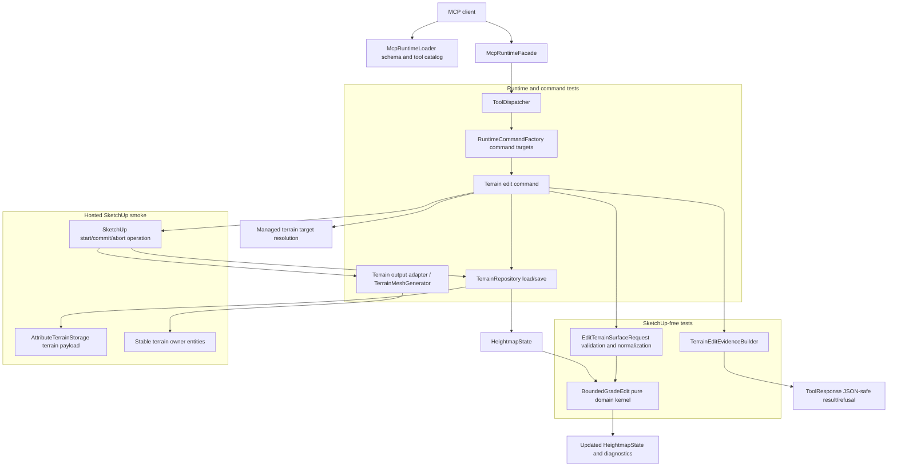

# Technical Plan: MTA-04 Implement Bounded Grade Edit MVP
**Task ID**: `MTA-04`
**Title**: `Implement Bounded Grade Edit MVP`
**Status**: `finalized`
**Date**: `2026-04-26`

## Source Task

- [Implement Bounded Grade Edit MVP](./task.md)

## Problem Summary

Managed terrain adoption establishes repository-backed terrain state and disposable derived SketchUp mesh output. MTA-04 adds the first supported terrain edit: a bounded, deterministic target-height edit that mutates authoritative `HeightmapState`, regenerates derived output, and returns reviewable evidence without editing arbitrary live TIN geometry in place.

The MVP must prove that a representative terrain edit can replace recurring `eval_ruby` terrain mesh patching while remaining bounded, reversible through SketchUp undo, and honest about current heightmap resolution and full-regeneration performance.

## Goals

- Add public `edit_terrain_surface` support for one deterministic bounded target-height terrain edit.
- Operate on materialized `HeightmapState` loaded and saved through `TerrainRepository`.
- Support rectangle edit regions, optional blend bands, fixed controls, and preserve zones.
- Regenerate derived SketchUp terrain mesh output from the updated state.
- Preserve stable terrain owner identity, metadata, name, tag/layer, and terrain payload ownership.
- Return JSON-safe before/after terrain-edit evidence with compact changed-sample, control, preserve-zone, output, and warning summaries.
- Refuse unsupported, unsafe, ambiguous, no-data, or incoherent requests before expected partial state/output mutation.

## Non-Goals

- Corridor, ramp, plane, slope, terrace, interval, smoothing, or fairing kernels.
- Interactive brush/stroke replay, pressure, or UE-style tool naming.
- Polygon/circle regions or adaptive local refinement.
- Chunked/tiled terrain state or partial output regeneration.
- Making generated SketchUp faces or vertices durable terrain identifiers.
- Mutating semantic hardscape objects or durable terrain `constraintRefs`.
- Changing owner `su_mcp.state` to `Edited` or adding a lifecycle state machine.

## Related Context

- `specifications/hlds/hld-managed-terrain-surface-authoring.md`
- `specifications/prds/prd-managed-terrain-surface-authoring.md`
- `specifications/domain-analysis.md`
- `specifications/guidelines/mcp-tool-authoring-sketchup.md`
- `specifications/guidelines/sketchup-extension-development-guidance.md`
- `specifications/tasks/managed-terrain-surface-authoring/MTA-02-build-terrain-state-and-storage-foundation/summary.md`
- `specifications/tasks/managed-terrain-surface-authoring/MTA-03-adopt-supported-surface-as-managed-terrain/task.md`
- `specifications/tasks/managed-terrain-surface-authoring/MTA-07-define-scalable-terrain-representation-strategy/task.md`
- `specifications/signals/2026-04-24-partial-terrain-authoring-session-reveals-stable-patch-editing-contract.md`

## Research Summary

- MTA-02 shipped `HeightmapState`, `TerrainStateSerializer`, `AttributeTerrainStorage`, and `TerrainRepository`. State payloads are `heightmap_grid`, schema version `1`, units `meters`, row-major, and support nullable elevations in the state model.
- MTA-03 live retest passed create/adopt/boundary-sampling/source-replacement/undo checks. Current caps are `maxColumns: 128`, `maxRows: 128`, `maxSamples: 10000`.
- MTA-03 performance after improvements makes adoption acceptable as a one-time workflow, but repeat near-cap full regeneration remains expensive: around `17-18 s` MCP time and `26-27 s` external wall time for roughly `10000` samples.
- Current output generation creates one SketchUp vertex per stored elevation sample and two triangular faces per grid cell. There is no durable sub-cell terrain detail in v1 state.
- UE Landscape research is non-normative but supports the chosen pattern: deterministic heightmap-region edits, explicit falloff weights, rectangular read/write areas, transaction-like operation boundaries, and preserving authoritative heightmap/edit-layer state rather than editing generated mesh as source of truth.
- UE-inspired falloff behavior for this MVP is limited to deterministic `none`, `linear`, and `smooth` smooth-step weights. Spherical/tip, slope flatten, terrace, interval, ramp, and interactive brush behavior are deferred.
- Consensus review with `gpt-5.4`, `grok-4.20`, and `grok-4` agreed on the core MVP, domain-outward sequencing, always-present warnings, full-regeneration risk visibility, and contract coverage for finite options. The main contested points were fixed-control tolerance defaults, stale-output behavior, and `constraintRefs`; this plan resolves those conservatively for the current repo shape.

## Technical Decisions

### Data Model

The edit operates on `SU_MCP::Terrain::HeightmapState`.

State mutation rules:

- Create a new `HeightmapState` value after the edit.
- Preserve `stateId`, `basis`, `origin`, `spacing`, `dimensions`, `sourceSummary`, `constraintRefs`, and `ownerTransformSignature`.
- Increment `revision` by `1`.
- Replace `elevations` with the edited row-major elevation array.
- Refuse any state with `nil` elevations for MTA-04 because the current full mesh generator cannot safely regenerate faces from no-data samples.

Coordinate rules:

- Public terrain coordinates and elevations are meters.
- Region and constraint coordinates are interpreted in the stored terrain state's XY frame using `origin`, `basis`, and `spacing`. For adopted terrain, this frame may carry source/world-like meter coordinates rather than zero-based bounds.
- Rectangle bounds are inclusive for sample eligibility.
- Requests below current grid resolution are allowed only insofar as they affect existing stored samples; evidence must report affected samples honestly.

Kernel rules:

- The domain kernel is SketchUp-free.
- Inputs are normalized state, target elevation, rectangle region, blend policy, fixed controls, preserve zones, and evidence options.
- Inner rectangle samples receive weight `1`.
- Blend extends outward by `blend.distance`.
- `blend.distance: 0` or `falloff: "none"` means a hard boundary.
- `falloff: "linear"` uses `1 - distance_into_blend / blend.distance`.
- `falloff: "smooth"` applies smooth-step `y * y * (3 - 2 * y)` to the linear blend value.
- Preserve zones are zero-weight masks applied after region/blend weighting and before mutation.
- Edited elevation formula is `new_z = old_z + weight * (targetElevation - old_z)`.

Fixed controls:

- `constraints.fixedControls[].point` identifies a point in the stored terrain state's XY coordinate frame.
- The control protects the bilinear sample stencil for that point: the four surrounding samples, or fewer at terrain edges.
- If `elevation` is omitted, the fixed elevation is the pre-edit bilinear interpolated elevation at the point.
- `tolerance` is optional and defaults to `0.01` meters.
- Provided tolerance must be positive and finite.
- If the predicted post-edit interpolated elevation differs from fixed elevation by more than the effective tolerance, the request refuses before model mutation.
- Evidence reports control id, point, before elevation, fixed elevation, predicted after elevation, delta, effective tolerance, protected stencil, and status.

Preserve zones:

- MTA-04 supports rectangle preserve zones only.
- Preserve zones can overlap the edit or blend region; overlap results in zero weight, not automatic refusal.
- Preserve masking should be conservative: protect samples that can influence the zone under the current regular-grid representation.
- Evidence reports zone id, bounds, protected sample count, max before/after delta, and status.

### API and Interface Design

Add public tool:

- `edit_terrain_surface`

Request shape:

```json
{
  "targetReference": {
    "sourceElementId": "terrain-main"
  },
  "operation": {
    "mode": "target_height",
    "targetElevation": 1.25
  },
  "region": {
    "type": "rectangle",
    "bounds": {
      "minX": 0.0,
      "minY": 0.0,
      "maxX": 10.0,
      "maxY": 8.0
    },
    "blend": {
      "distance": 1.0,
      "falloff": "smooth"
    }
  },
  "constraints": {
    "fixedControls": [
      {
        "id": "threshold",
        "point": { "x": 2.0, "y": 3.0 },
        "tolerance": 0.01
      }
    ],
    "preserveZones": [
      {
        "id": "tree-root-zone",
        "type": "rectangle",
        "bounds": {
          "minX": 4.0,
          "minY": 4.0,
          "maxX": 5.0,
          "maxY": 5.0
        }
      }
    ]
  },
  "outputOptions": {
    "includeSampleEvidence": false,
    "sampleEvidenceLimit": 20
  }
}
```

Supported finite option sets:

- `operation.mode`: `target_height`
- `region.type`: `rectangle`
- `region.blend.falloff`: `none`, `linear`, `smooth`
- `constraints.preserveZones[].type`: `rectangle`

Defaults:

- `region.blend.distance`: `0` when omitted.
- `region.blend.falloff`: `smooth` when a positive blend distance is provided and falloff is omitted.
- `constraints.fixedControls`: `[]`.
- `constraints.preserveZones`: `[]`.
- `constraints.fixedControls[].tolerance`: `0.01`.
- `outputOptions.includeSampleEvidence`: `false`.
- `outputOptions.sampleEvidenceLimit`: `20`, capped at `100`.

Response shape:

```json
{
  "success": true,
  "outcome": "edited",
  "operation": {
    "name": "edit_terrain_surface",
    "mode": "target_height",
    "regeneration": "full"
  },
  "managedTerrain": {
    "ownerReference": {
      "sourceElementId": "terrain-main",
      "persistentId": "5001"
    },
    "semanticType": "managed_terrain_surface",
    "status": "existing",
    "state": "Adopted"
  },
  "terrainState": {
    "before": {
      "revision": 1,
      "digest": "..."
    },
    "after": {
      "revision": 2,
      "digest": "...",
      "stateId": "...",
      "payloadKind": "heightmap_grid",
      "dimensions": { "columns": 100, "rows": 100 },
      "spacing": { "x": 0.8, "y": 0.8 }
    },
    "changed": {
      "sampleCount": 128,
      "indexBounds": {
        "minColumn": 10,
        "minRow": 12,
        "maxColumn": 25,
        "maxRow": 30
      },
      "minDelta": -0.4,
      "maxDelta": 0.2,
      "meanDelta": -0.1
    }
  },
  "output": {
    "derivedMesh": {
      "meshType": "regular_grid",
      "vertexCount": 10000,
      "faceCount": 19602,
      "derivedFromStateDigest": "..."
    },
    "regeneration": {
      "strategy": "full"
    }
  },
  "evidence": {
    "editRegion": {},
    "blend": {},
    "constraints": {
      "fixedControls": [],
      "preserveZones": []
    },
    "warnings": []
  }
}
```

Response constraints:

- JSON-safe only.
- No raw SketchUp objects.
- No durable generated face or vertex ids.
- `evidence.warnings` is always present as an array.
- Sample-level evidence is omitted by default and capped when enabled.

### Public Contract Updates

Implementation must update these public contract surfaces together:

- `src/su_mcp/runtime/native/mcp_runtime_loader.rb`
  - register `edit_terrain_surface`
  - add provider-compatible schema with root `type: "object"`, `properties`, and `additionalProperties: false`
  - expose finite enum sets for operation mode, region type, falloff, and preserve-zone type
  - describe that terrain coordinates and elevations are public meters
- `src/su_mcp/runtime/tool_dispatcher.rb`
  - route `edit_terrain_surface` to terrain command target method `edit_terrain_surface`
- `src/su_mcp/runtime/native/mcp_runtime_facade.rb`
  - no hand-written method needed if it continues deriving methods from `ToolDispatcher::TOOL_METHODS`, but tests must prove facade dispatch.
- `src/su_mcp/runtime/runtime_command_factory.rb`
  - ensure a command target responding to `edit_terrain_surface` is included
- `test/support/native_runtime_contract_cases.json`
  - add success fixture
  - add unsupported finite option refusal fixture
  - add fixed-control conflict refusal fixture
- `README.md`
  - document `edit_terrain_surface`, request example, response summary, finite options, refusal behavior, and full-regeneration performance caveat

### Error Handling

Refusals should use `ToolResponse.refusal` / `ToolResponse.refusal_result` conventions and include actionable details.

Planned refusal codes:

- `missing_required_field`
- `unsupported_option`
- `terrain_target_not_found`
- `terrain_target_ambiguous`
- `unsupported_target_type`
- `terrain_state_load_failed`
- `unsupported_terrain_state`
- `terrain_owner_transform_unsupported`
- `terrain_no_data_unsupported`
- `invalid_edit_region`
- `edit_region_outside_terrain`
- `edit_region_has_no_affected_samples`
- `invalid_blend_policy`
- `fixed_control_conflict`
- `invalid_preserve_zone`
- `terrain_output_contains_unsupported_entities`
- `terrain_state_save_failed`
- `terrain_output_regeneration_failed`

Finite-option refusals must include:

- `field`
- rejected `value`
- `allowedValues`

Constraint refusals must include:

- control or zone `id` when supplied
- effective tolerance
- predicted delta or invalid bounds when relevant

Mutation ordering:

- Validation, target resolution, state load, state suitability checks, request normalization, and pure kernel refusal happen before SketchUp model mutation.
- If repository save or output regeneration fails inside the operation, abort the operation and return a structured refusal rather than an expected split state/output outcome.
- Unexpected child groups/components or non-derived user content under the terrain owner refuse before deleting anything.

### State Management

The stable terrain owner remains the identity anchor.

Preserve:

- `sourceElementId`
- `semanticType`
- `status`
- `state`
- `schemaVersion`
- owner name
- owner tag/layer
- terrain payload namespace

Do not:

- set `su_mcp.state` to `Edited`
- rewrite `constraintRefs`
- store bulky terrain edit state in the lightweight `su_mcp` metadata dictionary

Record the edit through:

- terrain state `revision`
- terrain state digest
- response evidence

### Integration Points

Implementation should add or extend terrain-owned runtime classes in the existing Ruby extension runtime:

- request validation/normalization, likely `src/su_mcp/terrain/edit_terrain_surface_request.rb`
- pure edit kernel, likely `src/su_mcp/terrain/bounded_grade_edit.rb`
- edit evidence builder, likely `src/su_mcp/terrain/terrain_edit_evidence_builder.rb`
- command orchestration, likely extending or splitting from `src/su_mcp/terrain/terrain_surface_commands.rb`
- output cleanup/regeneration support, likely by extending `src/su_mcp/terrain/terrain_mesh_generator.rb` or adding a narrow output adapter

Output regeneration rules:

- Use full regeneration for MTA-04.
- Clear expected derived faces/edges from the stable terrain owner before regenerating.
- If the owner is empty or contains only recognized derived terrain faces/edges, regenerate from valid state.
- If the owner contains unexpected child groups/components or user-added content, refuse instead of deleting it.
- Normalize generated terrain face winding so front-face normals point upward in the z-up terrain basis.
- Derived output regeneration is required for success; optional response sample evidence can be omitted or capped, but the model output itself must be current.

### Configuration

No user-facing configuration file is added.

Runtime constants/defaults should be owned by the request validator or terrain edit domain objects:

- `DEFAULT_FIXED_CONTROL_TOLERANCE = 0.01`
- `DEFAULT_SAMPLE_EVIDENCE_LIMIT = 20`
- `MAX_SAMPLE_EVIDENCE_LIMIT = 100`
- supported option arrays for operation mode, region type, falloff, and preserve-zone type

Changing those constants later is a public contract change if it affects schema, refusal details, examples, or behavior.

## Architecture Context



## Key Relationships

- `edit_terrain_surface` is a terrain-owned mutation tool, not a create/adopt lifecycle mode and not a generic site-element edit.
- `HeightmapState` remains the source of truth; generated SketchUp mesh is disposable output.
- Request validation owns public option sets, defaulting, and refusal details.
- The edit kernel owns deterministic sample weights, masking, mutation, fixed-control prediction, no-data refusal, and domain diagnostics.
- Command orchestration owns SketchUp target resolution, operation boundaries, repository load/save, output cleanup/regeneration, and response assembly.
- Runtime loader/dispatcher/factory/docs/tests move together because this is a new public tool.

## Acceptance Criteria

- A valid `edit_terrain_surface` request edits a managed terrain surface by changing only affected stored heightmap samples within the rectangle and blend band, after preserve masks and fixed-control checks are applied.
- The edit supports only `operation.mode: "target_height"` and refuses unsupported operation modes with `field`, rejected `value`, and `allowedValues`.
- The edit supports only rectangle edit regions in the stored terrain state's public-meter XY frame and refuses invalid, inverted, out-of-terrain, or no-sample regions.
- Blend policy supports `none`, `linear`, and `smooth`; unsupported falloff values refuse with `allowedValues`.
- Preserve zones are rectangle zero-weight masks and remain unchanged in the resulting state within evidence-reported tolerance.
- Fixed controls protect the bilinear sample stencil and refuse before mutation if predicted post-edit elevation exceeds the effective tolerance.
- No-data terrain states refuse before mutation.
- Successful edits preserve owner identity metadata, owner name, owner tag/layer, terrain state `stateId`, terrain storage namespace, and durable `constraintRefs`.
- Successful edits increment terrain state `revision`, save the updated state through `TerrainRepository`, and regenerate full derived mesh output from the updated state.
- Save or output-regeneration failures abort the SketchUp operation and return structured refusal without an expected split state/output result.
- Unexpected child groups/components or user content under the terrain owner refuse before cleanup.
- Response evidence is JSON-safe and includes before/after state summary, changed-sample summary, edit/blend summary, fixed-control evidence, preserve-zone evidence, output regeneration summary, and always-present `warnings`.
- Sample-level evidence is omitted by default and capped by `sampleEvidenceLimit` when enabled.
- Runtime schema, dispatcher, command factory, native contract fixtures, README documentation, and examples all expose the same finite public options and request shape.
- Hosted SketchUp verification covers edit success, undo coherence, metadata/name/tag preservation, unexpected-child refusal, and at least one non-trivial timing note under current MTA-03 caps.
- A representative bounded target-height case that would otherwise require ad hoc Ruby terrain patching is expressible by the MTA-04 rectangle/blend/constraint contract and passes through the public tool path; if the representative case cannot be expressed without polygon, ramp, fairing, or chunked-output behavior, implementation must stop and split scope rather than widen MTA-04 silently.

## Test Strategy

### TDD Approach

Implementation starts with failing tests and proceeds from pure domain behavior outward:

1. Domain kernel and request validation tests.
2. Evidence builder tests.
3. Command orchestration tests with repository/output collaborators.
4. Runtime loader/dispatcher/factory/facade and native contract tests.
5. README/example parity checks where practical.
6. Hosted SketchUp smoke and timing capture.

Do not start production implementation before the full skeleton surface exists and the initial failing baseline is acknowledged.

### Required Test Coverage

Domain/request tests:

- target-height mutation over a small regular grid
- hard boundary edit
- linear falloff
- smooth-step falloff
- preserve-zone masking
- fixed-control implicit elevation and default tolerance
- fixed-control explicit tolerance
- fixed-control conflict refusal
- no-data refusal
- invalid rectangle bounds refusal
- outside terrain / no affected samples refusal
- finite option refusals for operation mode, region type, falloff, and preserve-zone type
- output option defaulting and sample evidence cap

Evidence tests:

- JSON-safe success evidence
- always-present `warnings`
- compact default response without sample evidence
- capped sample evidence when enabled
- fixed-control and preserve-zone evidence fields
- no raw SketchUp objects and no generated face/vertex durable ids

Command/use-case tests:

- target reference resolves to one managed terrain owner
- ambiguous or missing target refuses
- repository load absence/refusal maps to terrain refusal
- owner transform mismatch maps to terrain refusal
- successful edit saves updated state before output response
- full output regeneration is called with updated state
- save failure aborts operation
- output failure aborts operation
- owner metadata/name/tag/state are preserved
- unexpected child group/component refuses before cleanup
- missing existing derived faces can regenerate from valid state when owner has no unsupported content

Runtime contract tests:

- loader lists `edit_terrain_surface` with mutating annotations and provider-compatible schema
- schema exposes exact top-level request sections and finite option enums
- dispatcher routes `edit_terrain_surface`
- runtime command factory includes a target responding to `edit_terrain_surface`
- facade dispatches through shared command factory
- native contract fixture preserves success/refusal shapes

Hosted SketchUp smoke:

- create or adopt terrain, then edit a bounded rectangle
- run at least one representative bounded target-height terrain edit through the public `edit_terrain_surface` path
- verify saved state revision/digest changes
- verify output mesh exists and reflects updated state
- verify undo restores prior state/output coherence
- verify owner metadata, name, and tag/layer survive
- verify unexpected child content refusal if practical
- capture timing for one representative non-trivial grid under current caps

## Instrumentation and Operational Signals

- Response evidence reports changed sample count, changed sample index bounds, min/max/mean elevation delta, and output vertex/face counts.
- Hosted timing notes should distinguish MCP time from external wall time when available.
- Performance documentation must mention that near-cap full regeneration is expected to be materially slower than small-grid edits and that tiled/local refinement is deferred to MTA-07 follow-up work.

## Implementation Phases

1. **Domain skeleton and request contract**
   - Add request validator/normalizer skeleton.
   - Add pure edit kernel skeleton.
   - Add failing tests for finite options, defaults, rectangle normalization, falloff, preserve zones, fixed controls, and no-data refusal.

2. **Domain kernel implementation**
   - Implement index/range math, weight functions, preserve masks, fixed-control prediction, mutation, diagnostics, and updated state creation.
   - Keep all code SketchUp-free.

3. **Evidence builder**
   - Add JSON-safe edit evidence builder and tests for compact/capped sample evidence and warnings.

4. **Command orchestration**
   - Resolve target owner, load state, validate owner/state, run kernel, start one SketchUp operation, save state, clear/regenerate derived output, build response, and abort on save/output failures.

5. **Runtime public contract**
   - Register schema/tool in runtime loader.
   - Route through dispatcher/facade/factory.
   - Add native contract fixtures and tests.

6. **Docs and examples**
   - Update README and any relevant examples with request shape, finite options, refusals, evidence, and full-regeneration caveat.

7. **Hosted verification**
   - Run focused hosted SketchUp smoke for edit, undo, metadata/name/tag preservation, unexpected content refusal if practical, and timing.

## Rollout Approach

- Ship as a narrow public MVP tool with only `target_height` and rectangle regions.
- Refuse unsupported modes/shapes rather than accepting and ignoring them.
- Keep full regeneration as the only MTA-04 output strategy.
- Document performance caveat and avoid promising near-cap interactive latency.
- Defer scalable representation, tiled state, local refinement, chunked output regeneration, and patch overlays to MTA-07 follow-up work.

## Risks and Controls

- **Fixed-control math can be subtly wrong**: implement pure bilinear interpolation tests, edge-stencil tests, and tolerance conflict refusals before command wiring.
- **Preserve zones may not actually protect influenced samples**: use conservative sample protection and prove with before/after delta evidence tests.
- **No-data state can break output generation**: refuse no-data states before mutation and test the refusal.
- **Full regeneration can be slow near current caps**: capture hosted timing and document the current near-cap performance risk.
- **Rectangle target-height MVP may not cover every historical ad hoc Ruby terrain edit**: validate a representative bounded target-height case and stop/split if implementation evidence shows the required case needs polygon, ramp, fairing, or incremental mesh behavior.
- **Output cleanup can delete user content**: refuse unexpected child groups/components or user content; only clear expected derived faces/edges.
- **Save/output failure can split state and model output**: wrap save/regeneration in one SketchUp operation and test abort behavior with injected failures.
- **Public contract drift can create hidden behavior**: update loader schema, dispatcher, factory, contract fixtures, README, and tests in the same implementation.
- **Metadata lifecycle semantics can drift**: preserve existing owner `su_mcp.state` and record edits through terrain state revision/digest/evidence only.
- **Hosted behavior may differ from local doubles**: require hosted smoke for undo, owner metadata/name/tag, output regeneration, and timing.

## Dependencies

- MTA-02 terrain state and repository foundation.
- MTA-03 create/adopt managed terrain surface behavior and mesh generation path.
- Existing runtime loader, dispatcher, facade, command factory, and native contract fixture infrastructure.
- SketchUp operation semantics through `Sketchup::Model#start_operation`, `commit_operation`, and `abort_operation`.
- Hosted SketchUp verification environment for final smoke checks.

## Premortem Gate

Status: PASS

### Unresolved Tigers

- None.

### Plan Changes Caused By Premortem

- Added an explicit representative bounded target-height validation gate. MTA-04 must prove the rectangle/blend/constraint contract can replace at least one representative ad hoc Ruby terrain patching case; if not, implementation must stop and split scope instead of adding polygon/ramp/fairing/incremental behavior silently.
- Strengthened hosted smoke to run through the public `edit_terrain_surface` path, not only lower-level command objects.
- Kept full regeneration as the MTA-04 strategy but made timing evidence and the near-cap performance caveat mandatory.
- Rejected premortem suggestions to add polygon support, incremental output mutation, or `force: true`; those are scope-expanding changes that conflict with the settled MVP and the refusal-oriented product direction.

### Accepted Residual Risks

- Risk: Rectangle-only target-height editing will not cover every existing ad hoc terrain editing script.
  - Class: Elephant
  - Why accepted: MTA-04 is the first bounded grade edit MVP, while corridor/ramp/fairing/polygon/local-refinement behavior is explicitly deferred.
  - Required validation: A representative bounded target-height case must pass through the public tool; failures caused by shape mismatch become follow-up scope, not silent widening.
- Risk: Full regeneration may be too slow near current sample caps.
  - Class: Paper Tiger
  - Why accepted: The user explicitly accepted full regeneration for MTA-04 and deferred chunking/tiling/local refinement to follow-up work.
  - Required validation: Hosted timing must be recorded for one non-trivial grid under current caps, and docs/evidence must avoid claiming near-cap interactive latency.
- Risk: Strict refusals can reject cases ad hoc Ruby scripts previously handled permissively.
  - Class: Paper Tiger
  - Why accepted: The PRD and task require refusal-oriented safe mutation rather than unsafe best-effort live-TIN repair.
  - Required validation: Refusals must be structured, specific, and include enough detail for callers to adjust request shape or identify follow-up scope.

### Carried Validation Items

- Public tool hosted smoke for edit success, undo coherence, metadata/name/tag preservation, output regeneration, and timing.
- Representative bounded target-height case through the public MCP request shape.
- Contract fixtures for finite option refusals and fixed-control conflict.
- Failure-injection coverage for repository save and output regeneration abort behavior.
- Documentation check that README examples match loader schema and runtime refusal behavior.

### Implementation Guardrails

- Do not add polygon, ramp, fairing, smoothing, adaptive resolution, chunked output, or incremental mesh mutation inside MTA-04.
- Do not add `force: true` or any bypass that allows unsupported controls, no-data states, unexpected child content, or unsafe output deletion.
- Do not make generated face or vertex ids durable public references.
- Do not mutate durable `constraintRefs` or set owner `su_mcp.state` to `Edited`.
- Do not claim performance beyond the hosted timing evidence gathered during implementation.

## Quality Checks

- [x] All required inputs validated
- [x] Problem statement documented
- [x] Goals and non-goals documented
- [x] Research summary documented
- [x] Technical decisions included
- [x] Architecture context included
- [x] Acceptance criteria included
- [x] Test requirements specified
- [x] Instrumentation and operational signals defined when needed
- [x] Risks and dependencies documented
- [x] Rollout approach documented when needed
- [x] Small reversible phases defined
- [x] Premortem completed with falsifiable failure paths and mitigations
- [x] Planning-stage size estimate considered before premortem finalization
