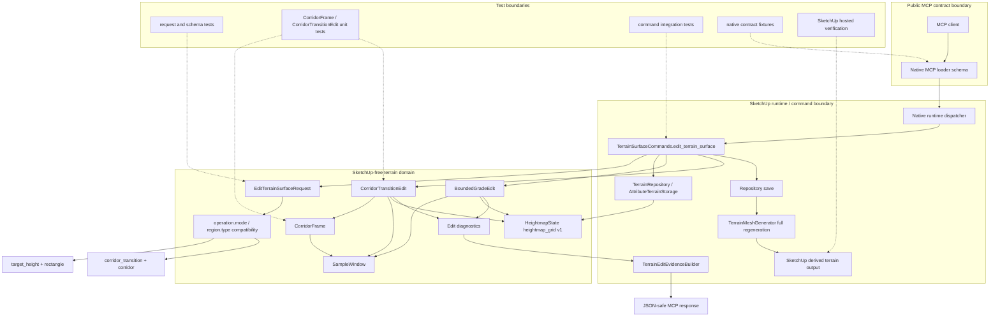

# Technical Plan: MTA-05 Implement Corridor Transition Terrain Kernel
**Task ID**: `MTA-05`
**Title**: `Implement Corridor Transition Terrain Kernel`
**Status**: `finalized`
**Date**: `2026-04-26`

## Source Task

- [Implement Corridor Transition Terrain Kernel](./task.md)

## Problem Summary

Managed terrain authoring needs a deterministic corridor transition edit for ramp-like access, threshold, and shoulder workflows. The implementation must update persisted managed terrain state, regenerate derived SketchUp output, honor fixed controls and preserve zones, return measurable evidence, and refuse unsupported or unsafe requests before mutation. It must not expose Unreal-style public names or mutate arbitrary live TIN geometry directly.

## Goals

- Add one supported corridor transition edit mode to the existing `edit_terrain_surface` public tool.
- Keep the public request shape aligned with existing terrain edit sections: `targetReference`, `operation`, `region`, `constraints`, and `outputOptions`.
- Apply corridor transitions to persisted `HeightmapState` and reuse the existing repository save and full-regeneration output flow.
- Use MTA-07 `SampleWindow` for candidate sample-window clipping and changed-region evidence.
- Add compact transition evidence without turning MTA-05 into terrain validation policy.
- Refuse invalid geometry, unsupported mode/region combinations, fixed-control conflicts, and no-affected-sample cases before persisted state mutation.

## Non-Goals

- No new public MCP tool for corridor transitions.
- No public Unreal-style ramp operation naming.
- No local smoothing, fairing, drainage simulation, civil road design, or terrain mesh repair.
- No hardscape mutation or hardscape participation as terrain state.
- No persisted `heightmap_grid` schema v2 migration.
- No partial regeneration requirement; full derived-output regeneration remains acceptable for MTA-05.
- No validation verdicts or slope-compliance policy.

## Related Context

- [Managed Terrain Surface Authoring HLD](specifications/hlds/hld-managed-terrain-surface-authoring.md)
- [PRD: Managed Terrain Surface Authoring](specifications/prds/prd-managed-terrain-surface-authoring.md)
- [Domain Analysis](specifications/domain-analysis.md)
- [MCP Tool Authoring Standard](specifications/guidelines/mcp-tool-authoring-sketchup.md)
- [MTA-04 bounded grade edit task](specifications/tasks/managed-terrain-surface-authoring/MTA-04-implement-bounded-grade-edit-mvp/task.md)
- [MTA-04 bounded grade edit plan](specifications/tasks/managed-terrain-surface-authoring/MTA-04-implement-bounded-grade-edit-mvp/plan.md)
- [MTA-07 scalable representation plan](specifications/tasks/managed-terrain-surface-authoring/MTA-07-define-scalable-terrain-representation-strategy/plan.md)
- [MTA-07 summary](specifications/tasks/managed-terrain-surface-authoring/MTA-07-define-scalable-terrain-representation-strategy/summary.md)
- [UE reference phase 1 research](specifications/research/managed-terrain/ue-reference-phase1.md)

## Research Summary

- MTA-04 provides the reusable public edit path: `edit_terrain_surface`, request validation, `BoundedGradeEdit`, edit evidence, repository load/save, full output regeneration, loader schema, contract fixtures, README examples, and hosted verification.
- MTA-04 actuals show the largest risk is live SketchUp output behavior: entity traversal, output cleanup, undo/abort coherence, and face/normals behavior.
- MTA-07 shipped `SU_MCP::Terrain::SampleWindow`, which should be consumed as the shared SketchUp-free sample-index window and changed-region primitive.
- Local Unreal Engine Landscape Ramp source supports an internal two-control corridor model with center full weight, side cosine falloff, conservative dirty bounds, clipped heightmap mutation, and both raise/lower behavior.
- UE's fractional side-falloff semantics are implementation reference only. The public MCP contract uses meter-based `sideBlend.distance` to match existing terrain edit vocabulary.

## Technical Decisions

### Data Model

Persisted terrain state remains `heightmap_grid` v1. MTA-05 mutates `HeightmapState` elevations and increments the revision through the existing repository save path.

`SampleWindow` is the only shared affected-window primitive. It owns:

- candidate window clipping from owner-local bounds to grid sample indices
- empty-window representation
- changed-region summaries from changed sample indices

`CorridorFrame` is a new SketchUp-free helper, not a persisted model and not a public schema object. It owns:

- start/end control normalization
- corridor direction, length, and perpendicular vector
- longitudinal parameter and lateral signed distance calculations
- conservative outer bounds for `SampleWindow`
- per-sample membership and center/side-blend weight

Public corridor semantics:

- `region.width` is the full-weight center corridor width in public meters.
- `region.sideBlend.distance` is an additional lateral blend shoulder on each side in public meters.
- total affected width is `width + (2 * sideBlend.distance)`.
- `sideBlend.falloff` supports `none` and `cosine` for MTA-05.

### API and Interface Design

Extend the existing public tool:

```json
{
  "targetReference": { "sourceElementId": "terrain-main" },
  "operation": {
    "mode": "corridor_transition"
  },
  "region": {
    "type": "corridor",
    "startControl": { "point": { "x": 1.0, "y": 2.0 }, "elevation": 0.5 },
    "endControl": { "point": { "x": 8.0, "y": 2.0 }, "elevation": 1.5 },
    "width": 3.0,
    "sideBlend": { "distance": 1.0, "falloff": "cosine" }
  },
  "constraints": {},
  "outputOptions": {}
}
```

`operation.mode` and `region.type` are independent compatibility axes:

| `operation.mode` | Supported `region.type` |
|---|---|
| `target_height` | `rectangle` |
| `corridor_transition` | `corridor` |

Future target-height polygon or circle regions should extend this matrix without changing the top-level request model.

### Public Contract Updates

Request deltas:

- Add `operation.mode: "corridor_transition"`.
- Add `region.type: "corridor"`.
- Add corridor region fields:
  - `startControl.point.x`
  - `startControl.point.y`
  - `startControl.elevation`
  - `endControl.point.x`
  - `endControl.point.y`
  - `endControl.elevation`
  - `width`
  - `sideBlend.distance`
  - `sideBlend.falloff`
- Keep `targetReference`, `operation`, and `region` required at the root.

Response deltas:

- Preserve the existing terrain edit response envelope.
- Preserve existing evidence fields such as `changedRegion`, `samples`, `sampleSummary`, `fixedControls`, `preserveZones`, and `warnings`.
- Add compact transition evidence under `evidence.transition`.

Schema and registration updates:

- Update `src/su_mcp/runtime/native/mcp_runtime_loader.rb` for new mode, region type, corridor fields, side-blend enum, and descriptions.
- Keep the root schema provider-compatible: no root `oneOf`, `anyOf`, or `allOf`.
- Change the public `operation` schema to require only `mode` at schema level; enforce `targetElevation` for `target_height` and corridor fields for `corridor_transition` in runtime validation.

Dispatcher/routing updates:

- Inject a `corridor_editor:` into `TerrainSurfaceCommands`.
- Dispatch by validated `operation_mode`.

Contract/test/docs updates:

- Update request tests, command tests, native loader tests, native contract fixtures, and README examples in the same change.
- Add README compatibility table for `operation.mode` and `region.type`.
- Document meter-based `width` and `sideBlend.distance` semantics.

### Error Handling

Validation and runtime refusals must be structured and client-actionable.

Reuse broad request-shape codes where appropriate:

- `missing_required_field`
- `invalid_edit_request`
- `unsupported_option`

Add or reuse behavior-specific refusals:

- `invalid_corridor_geometry`
- `edit_region_has_no_affected_samples`
- `fixed_control_conflict`
- `preserve_zone_conflict` if needed by existing behavior
- `terrain_no_data_unsupported`

Refusal details should include:

- `field`
- `reason`
- relevant values when safe and compact
- `allowedValues` for finite enum or compatibility errors

Examples of refused cases:

- invalid mode/region pair
- missing or non-finite corridor controls
- coincident endpoints
- non-positive width
- negative side-blend distance
- unsupported side-blend falloff
- `sideBlend.falloff: "none"` with a positive `sideBlend.distance`
- no affected samples after terrain clipping and preserve-zone masking
- fixed-control tolerance violation

### State Management

The edit command flow remains atomic:

1. validate request
2. resolve managed terrain owner
3. load persisted terrain state
4. apply SketchUp-free kernel to produce updated state and diagnostics
5. refuse before save if the kernel reports a conflict
6. save updated state
7. fully regenerate derived terrain output
8. commit SketchUp operation on success or abort on failure

No expected refusal should partially update persisted terrain state.

### Integration Points

- `EditTerrainSurfaceRequest` validates and normalizes mode-specific shapes.
- `CorridorTransitionEdit` mutates heightmap elevations and reports diagnostics.
- `CorridorFrame` composes with `SampleWindow` for candidate clipping and changed-region evidence.
- `TerrainEditEvidenceBuilder` adds compact transition evidence.
- `TerrainSurfaceCommands` reuses existing owner resolution, repository, regeneration, and response behavior.
- `mcp_runtime_loader` and native fixtures expose and test the public contract.

### Configuration

No global configuration is introduced.

Defaults:

- `sideBlend.distance` defaults to `0.0` if omitted.
- `sideBlend.falloff` defaults to `none` when distance is `0.0`.
- `sideBlend.falloff` defaults to `cosine` when distance is positive, if omitted.
- `sideBlend.falloff: "none"` with positive distance is refused because it makes the shoulder distance semantically inert.
- existing `outputOptions.includeSampleEvidence` and `sampleEvidenceLimit` behavior remains unchanged.

## Architecture Context



## Key Relationships

- `edit_terrain_surface` remains the public command boundary.
- `operation.mode` identifies the edit behavior; `region.type` identifies the spatial edit frame.
- `CorridorTransitionEdit` is a sibling to `BoundedGradeEdit`, not a replacement.
- `CorridorFrame` owns oriented corridor math; `SampleWindow` owns grid window clipping and changed-region summaries.
- `TerrainMeshGenerator` continues to produce disposable derived SketchUp output from persisted state.

## Acceptance Criteria

- `edit_terrain_surface` accepts `operation.mode: "corridor_transition"` with `region.type: "corridor"` using the existing top-level request sections.
- Runtime validation enforces supported mode/region pairs and refuses unsupported combinations with structured details.
- Valid corridor edits update persisted `HeightmapState`, increment terrain revision, and regenerate derived terrain output.
- The corridor kernel does not directly edit arbitrary live TIN geometry.
- `region.width` is interpreted as the full-weight center corridor width in meters.
- `region.sideBlend.distance` is interpreted as additional blend shoulder distance on each side in meters.
- `sideBlend.falloff: "cosine"` applies cosine lateral weighting from unchanged terrain at the outer edge to full transition at the center corridor edge.
- Endpoint elevations are linearly interpolated along the corridor length and support both raising and lowering.
- Corridor work is bounded to the corridor center and side-blend mask, clipped to the terrain grid.
- `CorridorFrame` computes conservative corridor outer bounds and per-sample weights without replacing `SampleWindow`.
- `changedRegion` is derived from changed sample indices through `SampleWindow.from_samples(...).to_changed_region`.
- Empty candidate or zero-affected-sample corridor edits refuse before state save.
- Preserve zones act as hard masks and remain unchanged.
- Fixed-control conflicts are detected before persisted state save and refuse with structured details.
- Successful corridor edits return compact `evidence.transition` plus existing edit evidence fields.
- Default evidence remains compact; detailed samples remain gated by `outputOptions`.
- Loader schema, native contract fixtures, README examples, and tests are updated with the contract change.
- Hosted verification confirms regenerated output, undo/abort coherence, adopted-terrain coordinates, diagonal face/normals sanity, and near-cap behavior.

## Test Strategy

### TDD Approach

Implement the corridor behavior from the inside out:

1. Start with failing `CorridorFrame` unit tests for geometry, bounds, and weights.
2. Add failing `CorridorTransitionEdit` tests for height mutation, constraints, and diagnostics.
3. Add request validation tests for public shape and refusals.
4. Add command integration tests for dispatch, repository save, regeneration, and abort behavior.
5. Add loader/schema/contract fixture tests.
6. Add hosted verification for SketchUp-derived output behavior.

### Required Test Coverage

Unit tests:

- horizontal, vertical, diagonal, and reversed corridor controls
- coincident endpoint refusal
- positive width validation
- sideBlend distance and falloff validation
- conservative outer bounds expansion
- center-strip full weight
- cosine side-blend weight
- `sideBlend.distance: 0` hard edge
- endpoint linear interpolation
- raise and lower symmetry
- non-zero origin and non-unit spacing
- no affected samples after clipping
- changed-region evidence via `SampleWindow`

Request/schema tests:

- valid corridor request normalization
- invalid mode/region combinations
- invalid controls, width, sideBlend, and enum values
- schema no longer requires `operation.targetElevation` for corridor mode
- runtime still requires `operation.targetElevation` for target-height mode
- structured refusal details with `field`, `reason`, and `allowedValues`

Command integration tests:

- target-height still dispatches to `BoundedGradeEdit`
- corridor transition dispatches to `CorridorTransitionEdit`
- repository load/save and full regeneration are reused
- refusals happen before save
- save/output failures abort operation

Runtime/docs tests:

- loader schema exposes finite mode, region, and sideBlend choices
- native contract fixtures cover success and representative refusals
- README example matches schema and request validation

Hosted verification:

- representative corridor edit visibly regenerates terrain output
- diagonal corridor output has sane faces/normals
- undo/abort behavior remains coherent
- adopted terrain coordinates use stored terrain-state origin/spacing
- near-cap edit remains acceptable with window-limited kernel work and full regeneration

## Instrumentation and Operational Signals

- `changedSampleCount`
- `changedRegion`
- compact transition evidence:
  - normalized controls
  - width
  - sideBlend
  - endpoint match deltas
  - slope or changed-delta summary
- warnings for clipping, preserve-zone masking, and compact diagnostic caveats
- output summary showing full regeneration strategy
- terrain state before/after revision and digest

## Implementation Phases

1. Add `CorridorFrame`.
   - Implement geometry normalization, direction/perpendicular vectors, conservative outer bounds, longitudinal/lateral sample math, and center/side-blend weights.
   - Expand outer bounds by at least one sample in terrain-state units before `SampleWindow.from_owner_bounds`; for non-uniform spacing this must cover both axes.
   - Add pure unit tests first.

2. Add `CorridorTransitionEdit`.
   - Apply endpoint interpolation, center full weight, cosine side blend, preserve-zone hard mask, fixed-control post-checks, no-affected-sample refusal, and diagnostics.
   - Use `SampleWindow` for candidate clipping and changed-region evidence.

3. Extend request validation.
   - Add mode/region compatibility checks.
   - Add corridor controls, width, and sideBlend validation.
   - Extract mode-specific helpers if the validator becomes hard to audit.

4. Update evidence building.
   - Add compact `evidence.transition`.
   - Preserve existing terrain edit evidence vocabulary.

5. Integrate command dispatch.
   - Inject `corridor_editor:`.
   - Dispatch by validated operation mode.
   - Reuse repository save, full regeneration, and undo/abort flow.

6. Update public contract artifacts.
   - Loader schema.
   - Runtime/native tests.
   - Contract fixtures.
   - README compatibility table and example.

7. Verify hosted behavior.
   - Run the smallest practical hosted or live checks for regenerated output, undo/abort, adopted-coordinate handling, diagonal output, and near-cap performance.

## Rollout Approach

- Ship as an additive `edit_terrain_surface` mode.
- Keep existing `target_height + rectangle` behavior unchanged.
- Keep persisted terrain schema v1.
- Refuse unsupported mode/region combinations rather than attempting recovery.
- Keep full regeneration as the initial output strategy.
- Document any hosted verification gaps in the task summary if not fully automatable.

## Risks and Controls

- Public contract drift: constrain the request shape with a mode/region compatibility matrix, loader descriptions, README examples, and contract fixtures.
- Operation schema drift: require only `operation.mode` at schema level and enforce mode-specific required fields in runtime validation.
- Validator bloat: keep `EditTerrainSurfaceRequest` as entrypoint but extract small mode-specific helpers when corridor validation makes the class unwieldy.
- Corridor edge samples omitted: expand `CorridorFrame` outer bounds conservatively before `SampleWindow` clipping and test diagonal/near-edge cases.
- UE side-falloff semantics leak into public API: document meter-based `width` and `sideBlend.distance`; keep UE fractional falloff as research input only.
- Fixed controls or preserve zones violated: hard-mask preserve zones, post-check fixed controls before save, and refuse conflicts before persisted mutation.
- Evidence becomes validation policy: keep transition evidence compact and descriptive, without pass/fail slope verdicts.
- Hosted SketchUp output differs from fakes: verify regeneration, undo/abort, face/normals, unexpected child behavior, and adopted-coordinate behavior on a real or hosted path.
- Performance at near-cap terrain size: limit kernel work through `SampleWindow`, keep full regeneration for MTA-05, and document near-cap timing.

## Dependencies

- MTA-04 bounded grade edit implementation and public edit flow.
- MTA-07 `SampleWindow`.
- Existing `HeightmapState`, terrain repository, terrain serializer, and mesh generator.
- Native MCP loader and contract fixture infrastructure.
- README and user-facing contract documentation.
- SketchUp-hosted verification environment.

## Premortem Gate

Status: PASS

### Unresolved Tigers

- None.

### Plan Changes Caused By Premortem

- Added the operation-schema correction: public schema must require only `operation.mode`; runtime validation owns mode-specific required fields such as `operation.targetElevation` for `target_height`.
- Added refusal behavior for `sideBlend.falloff: "none"` with positive `sideBlend.distance`.
- Strengthened `CorridorFrame` bounds-expansion guidance for non-uniform grid spacing.
- Added request/schema tests proving corridor mode is not blocked by `targetElevation` schema requirements while target-height still requires it at runtime.

### Accepted Residual Risks

- Risk: hosted SketchUp output behavior may still reveal regeneration, normals, cleanup, or undo edge cases.
  - Class: Paper Tiger
  - Why accepted: MTA-04 established the same output path and MTA-05 reuses it.
  - Required validation: hosted verification for representative corridor success, diagonal output, refusal-before-mutation, and undo/abort behavior.
- Risk: near-cap performance may be worse than predicted with full regeneration.
  - Class: Paper Tiger
  - Why accepted: kernel work is window-limited and full regeneration is already the accepted MTA-05 strategy.
  - Required validation: near-cap timing or performance-aware smoke check during implementation.
- Risk: preserve-zone hard masks may produce less graceful transitions than tolerance-aware preservation.
  - Class: Elephant
  - Why accepted: tolerance-based preserve behavior would introduce constraint solving and validation policy outside MTA-05.
  - Required validation: evidence must report protected samples and warnings clearly enough for follow-on evaluation.

### Carried Validation Items

- Verify loader schema, request validation, native fixtures, and README examples remain synchronized.
- Verify corridor mode is accepted without `operation.targetElevation`.
- Verify target-height mode still refuses missing `operation.targetElevation`.
- Verify `SampleWindow` drives changed-region evidence for corridor edits.
- Verify diagonal corridor bounds expansion includes edge samples with non-zero cosine weight.
- Verify hosted regenerated output, undo/abort coherence, adopted terrain coordinates, and face/normals sanity.

### Implementation Guardrails

- Do not add a new public corridor tool.
- Do not add root schema conditionals.
- Do not create a corridor-specific affected-window primitive.
- Do not change persisted `heightmap_grid` v1.
- Do not expose UE fractional side-falloff semantics through the public contract.
- Do not turn transition evidence into validation verdicts.
- Do not solve around fixed controls or preserve zones in MTA-05; preserve zones are hard masks and fixed-control conflicts refuse before save.

## Quality Checks

- [x] All required inputs validated
- [x] Problem statement documented
- [x] Goals and non-goals documented
- [x] Research summary documented
- [x] Technical decisions included
- [x] Architecture context included
- [x] Acceptance criteria included
- [x] Test requirements specified
- [x] Instrumentation and operational signals defined when needed
- [x] Risks and dependencies documented
- [x] Rollout approach documented when needed
- [x] Small reversible phases defined
- [x] Premortem completed with falsifiable failure paths and mitigations
- [x] Planning-stage size estimate considered before premortem finalization
