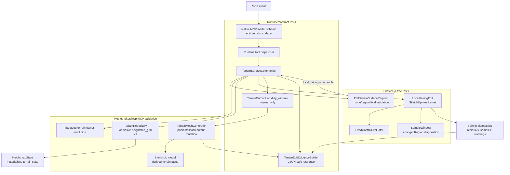

# Technical Plan: MTA-06 Implement Local Terrain Fairing Kernel
**Task ID**: `MTA-06`
**Title**: `Implement Local Terrain Fairing Kernel`
**Status**: `finalized`
**Date**: `2026-04-26`

## Source Task

- [Implement Local Terrain Fairing Kernel](./task.md)

## Problem Summary

Managed terrain authoring needs a bounded local fairing operation that can reduce local roughness, harsh triangulation artifacts, and abrupt transitions without editing live SketchUp TIN geometry directly. The operation must stay state-driven, measurable, constraint-aware, and compatible with the existing terrain edit and output regeneration flow.

## Goals

- Add a narrow `local_fairing` operation mode to the existing `edit_terrain_surface` public tool.
- Implement deterministic local fairing over materialized `heightmap_grid` terrain state.
- Support rectangle bounds, blend falloff, fixed controls, preserve zones, and bounded iteration.
- Return JSON-safe before/after fairing evidence using a documented residual metric.
- Feed actual changed-sample diagnostics into the existing dirty-window output planning path.
- Preserve current partial-output fallback behavior without exposing output strategy telemetry.

## Non-Goals

- Do not add a separate public smoothing tool.
- Do not expose public mode names such as `smooth` that imply broad sculpting behavior.
- Do not implement brush UI, circle regions, polygon preserve zones, erosion, drainage, or civil grading.
- Do not implement FFT-backed or detail-preserving smoothing.
- Do not change persisted terrain representation or depend on MTA-11 representation v2.
- Do not expose generated face IDs, vertex IDs, dirty windows, cell windows, chunks, tiles, or partial/full output strategy in public responses.

## Related Context

- [Managed Terrain Surface Authoring HLD](specifications/hlds/hld-managed-terrain-surface-authoring.md)
- [PRD: Managed Terrain Surface Authoring](specifications/prds/prd-managed-terrain-surface-authoring.md)
- [MCP Tool Authoring Standard for SketchUp Modeling](specifications/guidelines/mcp-tool-authoring-sketchup.md)
- [MTA-04 bounded grade edit](specifications/tasks/managed-terrain-surface-authoring/MTA-04-implement-bounded-grade-edit-mvp/task.md)
- [MTA-05 corridor transition kernel](specifications/tasks/managed-terrain-surface-authoring/MTA-05-implement-corridor-transition-terrain-kernel/task.md)
- [MTA-08 production bulk terrain output](specifications/tasks/managed-terrain-surface-authoring/MTA-08-adopt-bulk-full-grid-terrain-output-in-production/task.md)
- [MTA-09 dirty-window output planning](specifications/tasks/managed-terrain-surface-authoring/MTA-09-define-region-aware-terrain-output-planning-foundation/task.md)
- [MTA-10 partial terrain output regeneration](specifications/tasks/managed-terrain-surface-authoring/MTA-10-implement-partial-terrain-output-regeneration/task.md)
- [MTA-11 durable localized terrain representation v2](specifications/tasks/managed-terrain-surface-authoring/MTA-11-design-and-implement-durable-localized-terrain-representation-v2/task.md)

## Research Summary

- MTA-04 established the public `edit_terrain_surface` pattern with rectangle bounds, blend falloff, fixed controls, preserve zones, evidence, state save, output regeneration, and hosted undo/output validation.
- MTA-05 established the mode-specific extension pattern: finite operation modes, mode/region compatibility, runtime-required fields, dispatcher routing, kernel-specific evidence, and public schema/docs/fixtures updated together.
- MTA-08 through MTA-10 changed the output assumption. Fairing should emit clean `changedRegion` diagnostics and let the output layer choose partial replacement or full fallback internally.
- MTA-11 is intentionally not a dependency. MTA-06 operates on current `heightmap_grid` v1 state.
- Local Unreal Engine Landscape source inspection supports bounded neighborhood-average smoothing controlled by strength, radius, region influence, and repeated application. Detail-preserving/FFT smoothing is out of scope.
- Grok 4.20 review of the Step 05 proposal agreed with `local_fairing`, rectangle-only region support, `neighborhoodRadiusSamples`, bounded `iterations`, explicit lerp semantics, `actualIterations`, internal early convergence, and no public output-strategy leak.

## Technical Decisions

### Data Model

- Persisted terrain state remains `payloadKind: "heightmap_grid"` with schema version `1`.
- Fairing operates on `SU_MCP::Terrain::HeightmapState` elevations only.
- The generated SketchUp terrain mesh remains disposable derived output.
- Fairing diagnostics must include:
  - `samples`
  - `changedSampleCount`
  - `changedRegion`
  - `fixedControls`
  - `preserveZones`
  - `fairing`
  - `warnings`
- `changedRegion` must be derived from actual material elevation deltas, not merely requested or weighted samples.
- The same internal material-delta tolerance must drive `changedRegion`, `changedSampleCount`, sample evidence inclusion, and `fairing_no_effect`; use a small public-meter tolerance so floating-point noise does not produce false terrain edits.

### API and Interface Design

Add a new operation mode to existing `edit_terrain_surface`:

```json
{
  "operation": {
    "mode": "local_fairing",
    "strength": 0.35,
    "neighborhoodRadiusSamples": 4,
    "iterations": 2
  },
  "region": {
    "type": "rectangle",
    "bounds": { "minX": 10, "minY": 10, "maxX": 20, "maxY": 20 },
    "blend": { "distance": 2, "falloff": "smooth" }
  }
}
```

Operation field rules:

- `operation.mode`: add `local_fairing`.
- `operation.strength`: required finite number, `> 0`, `<= 1`.
- `operation.neighborhoodRadiusSamples`: required integer, `1..31`.
- `operation.iterations`: optional integer, default `1`, allowed `1..8`.
- `region.type`: `local_fairing` supports only `rectangle`.
- `region.bounds` and `region.blend` reuse existing rectangle edit semantics.
- `constraints.fixedControls`, `constraints.preserveZones`, and `outputOptions` reuse existing edit semantics.

Fairing algorithm:

- Use deterministic neighborhood-average smoothing over materialized heightmap samples.
- Each pass computes from a snapshot of the previous pass, not from in-place scan-order mutation.
- Neighborhood averages may read available in-bounds terrain samples outside the edit rectangle and inside preserve zones as fixed context, but only candidate samples with positive region weight and no preserve-zone mask may mutate.
- Candidate samples are terrain samples whose terrain-state XY coordinate receives positive rectangle/blend weight, excluding preserve-zone samples from mutation.
- The neighborhood is a cropped square sample-index window around each candidate:
  - radius is `operation.neighborhoodRadiusSamples`;
  - include samples where `abs(column - candidateColumn) <= radius` and `abs(row - candidateRow) <= radius`;
  - crop the window at terrain bounds;
  - include the center sample in the average.
- For each candidate sample:

```text
neighborhoodAverage = mean(snapshot elevations in the cropped square neighborhood)
next = current + ((neighborhoodAverage - current) * strength * regionWeight)
```

- `regionWeight` comes from existing rectangle/blend influence.
- Preserve-zone samples are hard-masked and do not change.
- Fixed controls are evaluated after the full candidate result is computed.
- Internal early convergence may stop before requested `iterations`; expose only `actualIterations` and a warning, not the tolerance knob.
- Use one internal material-delta tolerance, initially `1e-6` public meters, for early convergence, `fairing_no_effect`, changed sample evidence, `changedSampleCount`, and `changedRegion`.

Metric:

- Use `mean_absolute_neighborhood_residual`.
- Use the same cropped square neighborhood definition as smoothing.
- For each mutable candidate sample, compute `abs(elevation - mean(neighborhood elevations))`.
- Compute `beforeResidual` as the mean residual over candidate samples on original elevations.
- Compute `afterResidual` as the mean residual over candidate samples on final elevations.
- A steady slope should not be treated as inherently unfair; tests must cover this.

### Public Contract Updates

Request/schema updates:

- Add `local_fairing` to `EditTerrainSurfaceRequest::SUPPORTED_OPERATION_MODES`.
- Add `local_fairing => ["rectangle"]` to the mode/region compatibility map.
- Add operation fields to the native MCP loader schema:
  - `strength`
  - `neighborhoodRadiusSamples`
  - `iterations`
- Keep `operation.required` as `["mode"]`; runtime validation owns mode-specific required fields.
- Keep the root schema provider-compatible: no top-level `oneOf`, `anyOf`, or root enum.

Response update:

```json
"evidence": {
  "fairing": {
    "metric": "mean_absolute_neighborhood_residual",
    "beforeResidual": 0.42,
    "afterResidual": 0.18,
    "improved": true,
    "strength": 0.35,
    "neighborhoodRadiusSamples": 4,
    "iterations": 3,
    "actualIterations": 2,
    "changedSampleCount": 31,
    "warnings": []
  }
}
```

Registration/dispatch updates:

- No new public tool registration.
- Update `edit_terrain_surface` tool description to mention `local_fairing + rectangle`.
- Add `LocalFairingEdit` injection to `TerrainSurfaceCommands`.
- Route `operation.mode: "local_fairing"` to `LocalFairingEdit`.

Contract, fixture, docs, and examples:

- Update native contract fixtures for the new schema fields and enum values.
- Add contract stability tests proving no internal output-planning or generated-entity identifiers leak.
- Update README operation matrix and add a compact fairing example.
- Update refusal examples or schema descriptions where mode-specific required fields are documented.

### Error Handling

- Unsupported `operation.mode`: existing `unsupported_option` with finite `allowedValues`.
- `local_fairing` with non-rectangle region: existing mode/region `unsupported_option`.
- Missing or invalid `operation.strength`: `missing_required_field` or `invalid_edit_request`.
- Missing or invalid `operation.neighborhoodRadiusSamples`: `missing_required_field` or `invalid_edit_request`.
- Invalid `operation.iterations`: `invalid_edit_request`.
- Terrain state with no-data samples: `terrain_no_data_unsupported`.
- Region affects no samples: `edit_region_has_no_affected_samples`.
- Candidate produces no material elevation changes: `fairing_no_effect`.
- Fixed controls would drift beyond tolerance: `fixed_control_conflict`, before save/output mutation.
- Changed terrain but residual does not improve: success with warning, not refusal.
- Internal early convergence: success with `actualIterations` and warning such as `converged_early`.

### State Management

- Successful fairing creates a new `HeightmapState` revision.
- Refusals before mutation must not save state or mutate derived output.
- Output regeneration remains inside the same SketchUp operation as state save.
- Undo must restore state metadata and derived output coherently.
- No fairing-specific data is persisted beyond the updated heightmap elevations and normal terrain state revision/digest.

### Integration Points

- `EditTerrainSurfaceRequest` owns public request validation and normalization.
- `TerrainSurfaceCommands` owns target resolution, state load/save, model operation boundaries, editor dispatch, output planning, output regeneration, and response assembly.
- `LocalFairingEdit` owns SketchUp-free fairing math and diagnostics.
- `FixedControlEvaluator` remains the shared fixed-control conflict/evidence seam.
- `SampleWindow` remains the changed-region vocabulary used by the output planner.
- `TerrainOutputPlan` receives dirty-window intent internally.
- `TerrainMeshGenerator` remains the only SketchUp derived-output mutation boundary.
- `TerrainEditEvidenceBuilder` exposes JSON-safe fairing evidence.

### Configuration

- No user or environment configuration is added.
- `strength`, `neighborhoodRadiusSamples`, and `iterations` are per-request controls.
- Internal early-convergence epsilon, if used, is an implementation constant covered by tests and not a public option.

## Architecture Context



## Key Relationships

- Fairing is a terrain edit mode, not a new public workflow.
- Public schema advertises broad shape and finite modes; runtime validation owns mode-specific required fields.
- Edit kernels do not know about SketchUp entities or output ownership.
- Command orchestration translates kernel diagnostics into output planning intent.
- Output planning and partial/fallback execution stay private.
- Evidence is public, JSON-safe, and stable enough for review without becoming terrain validation policy.

## Acceptance Criteria

- `edit_terrain_surface` accepts `operation.mode: "local_fairing"` with `region.type: "rectangle"` and rejects incompatible region types with structured finite-option refusal details.
- The public schema exposes `strength`, `neighborhoodRadiusSamples`, and `iterations` in the existing `operation` object without top-level schema composition or a new public tool.
- A valid fairing request mutates only materialized managed terrain state and never falls back to live TIN smoothing.
- Fairing uses deterministic neighborhood-average smoothing with explicit per-pass strength semantics and stable multi-iteration results.
- Fairing changes are bounded to the rectangle and blend area, while preserve zones remain unchanged within documented tolerance.
- Fixed controls are evaluated against the candidate fairing result and conflicting requests refuse before state save or output mutation.
- A supported noisy local patch improves `mean_absolute_neighborhood_residual` and reports before/after residual evidence.
- A flat or otherwise materially unchanged request refuses as `fairing_no_effect` without bumping revision or producing an empty dirty-window mutation.
- A request with affected samples but non-improving residual succeeds with a warning when terrain state changed materially.
- Fairing evidence is JSON-safe and includes `beforeResidual`, `afterResidual`, `improved`, `strength`, `neighborhoodRadiusSamples`, `iterations`, `actualIterations`, `changedSampleCount`, and warnings.
- Diagnostics include actual changed samples and `changedRegion` suitable for MTA-10 dirty-window output planning.
- Public responses do not expose dirty-window internals, partial/full strategy, output cell ownership, face IDs, or vertex IDs.
- Hosted validation proves output coherence, undo behavior, unsupported-child refusal, non-zero adopted-origin behavior, normals, derived markers, digest linkage, and near-cap responsiveness.

## Test Strategy

### TDD Approach

1. Start with failing request/schema tests for the public contract.
2. Add failing SketchUp-free fairing kernel tests before implementation.
3. Implement the smallest `LocalFairingEdit` slice that passes kernel tests.
4. Wire command dispatch and evidence with integration tests.
5. Add contract/no-leak/docs parity coverage.
6. Run hosted MCP validation after local tests, lint, and package verification pass.

### Required Test Coverage

Request/schema:

- Accepts `local_fairing + rectangle`.
- Rejects `local_fairing + corridor`.
- Requires valid `strength` and `neighborhoodRadiusSamples`.
- Defaults `iterations` to `1`.
- Rejects invalid `iterations`, radius, and strength boundaries.
- Keeps `operation.required` to `["mode"]` in loader schema.

Kernel:

- Reduces residual on a noisy local patch.
- Does not treat a steady slope as roughness that must flatten.
- Uses out-of-region and preserve-zone elevations as fixed neighborhood context without mutating protected samples.
- Applies exact strength lerp semantics for one pass.
- Produces deterministic multi-iteration results.
- Uses prior-pass snapshots, not scan-order mutation.
- Applies rectangle blend weights.
- Leaves preserve-zone samples unchanged.
- Refuses fixed-control conflicts after candidate smoothing.
- Refuses no affected samples.
- Refuses `fairing_no_effect` for flat/no-material-change cases.
- Clips safely at terrain edges and corners.
- Emits `changedRegion` from actual changed samples only.
- Uses one material-delta tolerance consistently for no-effect refusal, changed sample evidence, and dirty-window diagnostics.

Command/integration:

- Dispatches `local_fairing` to `LocalFairingEdit`.
- Saves state and regenerates output only after non-refused fairing.
- Aborts the SketchUp operation on state save or output refusal.
- Passes dirty-window intent from fairing `changedRegion` to `TerrainOutputPlan`.
- Adds `evidence.fairing` without dropping existing evidence fields.

Contract/docs/no-leak:

- Native contract fixtures include new operation fields and enum values.
- Public output does not leak dirty windows, output plans, cell windows, chunks, tiles, face IDs, vertex IDs, partial strategy, or fallback strategy.
- README operation matrix and example match runtime behavior.

Hosted validation:

- Public MCP fairing improves a representative noisy patch.
- Preserve zone remains unchanged.
- Fixed-control conflict refuses before mutation.
- Undo restores prior state and output.
- Non-zero adopted origin and fractional spacing affect the intended samples.
- Partial/fallback output remains coherent and internal.
- Normals, derived markers, digest linkage, and unsupported-child refusal remain valid.
- Near-cap terrain remains responsive under bounded fairing parameters.

## Instrumentation and Operational Signals

- Public evidence `fairing.beforeResidual` and `fairing.afterResidual` prove the metric moved.
- `fairing.actualIterations` shows bounded iteration and early convergence behavior.
- `evidence.changedRegion` and `changedSampleCount` show output-planning handoff size.
- Hosted validation should record revision changes, mesh counts, normals, derived marker counts, digest linkage, refusal codes, undo behavior, and approximate wall-clock timing for near-cap cases.

## Implementation Phases

1. Public request and schema skeleton:
   - Add failing validator and loader schema tests.
   - Add enum and field validation with no dispatch behavior yet.
2. Fairing kernel red tests:
   - Add `LocalFairingEdit` tests for residual, lerp, iterations, preserve zones, fixed controls, no-effect, no-data, and edge clipping.
3. Kernel implementation:
   - Implement `LocalFairingEdit` as SketchUp-free terrain-domain code.
   - Reuse `FixedControlEvaluator`, preserve-zone expansion semantics, and `SampleWindow`.
4. Command and evidence integration:
   - Inject and dispatch `LocalFairingEdit`.
   - Add `evidence.fairing`.
   - Verify dirty-window handoff and no-leak behavior.
5. Public contract and docs:
   - Update native fixtures, README operation table, examples, and contract stability tests.
6. Validation and review:
   - Run focused terrain tests, full Ruby tests, lint, package verification, and hosted MCP validation.
   - Address review findings before finalizing implementation.

## Rollout Approach

- Ship as one coordinated public contract update to `edit_terrain_surface`.
- Keep current modes `target_height` and `corridor_transition` unchanged.
- Keep persisted terrain state at `heightmap_grid` v1.
- Keep full output fallback available through MTA-10.
- Do not expose a user-selectable output strategy.
- Treat hosted SketchUp validation as required before implementation closeout.

## Risks and Controls

- Contract drift: update validator, loader schema, dispatcher, fixtures, README, examples, and no-leak tests in the same implementation.
- Metric ambiguity: document `mean_absolute_neighborhood_residual` and test noisy patches plus steady slopes.
- Iteration semantics drift: require per-pass snapshots and deterministic multi-pass tests.
- Neighborhood-context ambiguity: allow the averaging window to read stable surrounding terrain and preserve-zone elevations while mutating only eligible samples; test boundary and preserve-zone adjacency.
- Constraint erosion: hard-mask preserve zones and evaluate fixed controls after candidate smoothing before save.
- Dirty-window incorrectness: compute `changedRegion` from actual material deltas using one tolerance shared with no-effect behavior and test output-plan handoff.
- Host coordinate mismatch: validate adopted non-zero origin and fractional spacing in hosted MCP.
- SketchUp output safety: rely on MTA-10 partial/fallback ownership checks and hosted validation for markers, normals, seams, digest linkage, undo, and unsupported children.
- Performance scaling: cap radius and iterations, allow internal early convergence, and run near-cap hosted validation.
- No-effect revision drift: refuse `fairing_no_effect` before state save or output mutation.

## Dependencies

- `MTA-04`
- `MTA-05`
- `MTA-08`
- `MTA-09`
- `MTA-10`
- [Managed Terrain Surface Authoring HLD](specifications/hlds/hld-managed-terrain-surface-authoring.md)
- [PRD: Managed Terrain Surface Authoring](specifications/prds/prd-managed-terrain-surface-authoring.md)
- [MCP Tool Authoring Standard for SketchUp Modeling](specifications/guidelines/mcp-tool-authoring-sketchup.md)

## Premortem Gate

Status: PASS

### Unresolved Tigers

- None.

### Plan Changes Caused By Premortem

- Added an explicit shared material-delta tolerance requirement so `fairing_no_effect`, changed samples, sample evidence, and `changedRegion` cannot diverge.
- Clarified neighborhood sampling context: fairing may read stable in-bounds terrain outside the edit rectangle and preserve-zone elevations, but only eligible unprotected candidate samples may mutate.
- Added tests for preserve-zone/out-of-region neighborhood context and tolerance-consistent dirty-window evidence.

### Accepted Residual Risks

- Risk: The selected residual metric may improve while a human still dislikes the visual terrain shape.
  - Class: Paper Tiger
  - Why accepted: MTA-06 is an evidence-producing fairing kernel, not terrain fairness validation or visual quality policy.
  - Required validation: Hosted representative noisy-patch case plus downstream validation tasks for richer fairness diagnostics.
- Risk: Near-cap hosted performance may still need tuning around radius, iterations, and output ownership checks.
  - Class: Paper Tiger
  - Why accepted: Public controls are bounded, MTA-10 fallback remains available, and hosted performance is an explicit implementation closeout gate.
  - Required validation: Near-cap public MCP fairing case with approximate timing and post-operation responsiveness.
- Risk: Complex preserve footprints remain rectangle-only approximations.
  - Class: Elephant
  - Why accepted: MTA-04 established rectangle preserve zones as the current public contract; polygon preserve zones would be a separate schema expansion.
  - Required validation: Preserve-zone adjacency tests and documentation that preserve zones remain rectangle-only.

### Carried Validation Items

- Public MCP hosted fairing on noisy local terrain must improve residual and update derived output coherently.
- Hosted non-zero-origin and fractional-spacing case must prove region coordinates select intended samples.
- Hosted unsupported-child refusal must prove old derived output is not deleted.
- Hosted undo must restore state revision/digest and derived output.
- Near-cap hosted fairing must record timing, responsiveness, normals, markers, digest linkage, and output counts.

### Implementation Guardrails

- Do not add a public `smooth` tool or mode.
- Do not introduce brush, circle, polygon, FFT/detail-preserving, or representation-v2 behavior inside MTA-06.
- Do not mutate SketchUp terrain output from the fairing kernel.
- Do not save state or regenerate output for `fairing_no_effect` or fixed-control conflict refusals.
- Do not expose dirty-window, cell-window, partial/fallback, face ID, or vertex ID internals in public responses.

## Quality Checks

- [x] All required inputs validated
- [x] Problem statement documented
- [x] Goals and non-goals documented
- [x] Research summary documented
- [x] Technical decisions included
- [x] Architecture context included
- [x] Acceptance criteria included
- [x] Test requirements specified
- [x] Instrumentation and operational signals defined when needed
- [x] Risks and dependencies documented
- [x] Rollout approach documented when needed
- [x] Small reversible phases defined
- [x] Planning-stage size estimate considered before premortem finalization
- [x] Premortem completed with falsifiable failure paths and mitigations
