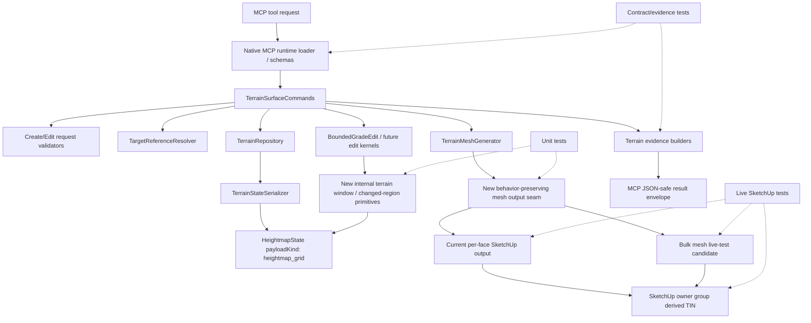

# Technical Plan: MTA-07 Define Scalable Terrain Representation Strategy
**Task ID**: `MTA-07`
**Title**: `Define Scalable Terrain Representation Strategy`
**Status**: `implemented`
**Date**: `2026-04-26`

## Source Task

- [Define Scalable Terrain Representation Strategy](./task.md)

## Problem Summary

Managed terrain currently stores an authoritative uniform `heightmap_grid` state and regenerates disposable SketchUp TIN output from that state. MTA-03 proved the create/adopt path is workable, and MTA-04 accepts full regeneration for the bounded grade edit MVP, but repeated near-cap terrain workflows should not be pushed toward globally dense grids as the only answer.

MTA-07 selects the next scalable representation direction and delivers a bounded preparatory implementation slice. The selected direction remains heightmap-derived managed state as source of truth, with generated SketchUp TIN geometry treated only as derived output. The prep work adds internal affected-region/window foundations, a behavior-preserving output-generation seam, and live SketchUp validation for a bulk mesh candidate.

## Goals

- Select a scalable managed terrain direction that supports localized detail without making all terrain globally dense.
- Preserve managed heightmap-derived state as authoritative and keep generated SketchUp TIN output disposable.
- Implement SketchUp-free terrain window / changed-region primitives derived from existing `heightmap_grid` state.
- Add a behavior-preserving terrain output seam that can support future region-aware or bulk output paths.
- Validate current per-face generation and a bulk mesh candidate in live SketchUp on representative terrain sizes.
- Keep current public terrain tool vocabulary stable unless a coordinated contract change is explicitly required.
- Sequence follow-on work for localized-detail state, tiled/chunked storage, partial regeneration, and production bulk output adoption if deferred.

## Non-Goals

- Implement the full future localized-detail representation.
- Change MTA-04 bounded grade edit MVP scope.
- Introduce managed SketchUp TIN geometry as source state.
- Add durable generated face or vertex identifiers.
- Change `heightmap_grid` payload kind or schema version by default.
- Add new public `create_terrain_surface` or `edit_terrain_surface` request fields by default.
- Implement renderer LOD, streaming proxies, World Partition, GPU render targets, or UE-style rendering architecture.
- Implement partial regeneration as production behavior in this task.
- Absorb semantic hardscape objects into terrain source state.

## Related Context

- `specifications/hlds/hld-managed-terrain-surface-authoring.md`
- `specifications/prds/prd-managed-terrain-surface-authoring.md`
- `specifications/domain-analysis.md`
- `specifications/guidelines/mcp-tool-authoring-sketchup.md`
- `specifications/guidelines/sketchup-extension-development-guidance.md`
- `specifications/guidelines/ryby-coding-guidelines.md`
- `specifications/tasks/managed-terrain-surface-authoring/MTA-02-build-terrain-state-and-storage-foundation/size.md`
- `specifications/tasks/managed-terrain-surface-authoring/MTA-03-adopt-supported-surface-as-managed-terrain/task.md`
- `specifications/tasks/managed-terrain-surface-authoring/MTA-04-implement-bounded-grade-edit-mvp/plan.md`
- `specifications/tasks/managed-terrain-surface-authoring/MTA-05-implement-corridor-transition-terrain-kernel/task.md`
- `specifications/tasks/managed-terrain-surface-authoring/MTA-06-implement-local-terrain-fairing-kernel/task.md`

## Research Summary

- MTA-02 shipped `HeightmapState`, `TerrainStateSerializer`, `AttributeTerrainStorage`, and `TerrainRepository`, with `heightmap_grid` schema version `1`, row-major elevations, JSON-safe summaries, digest checks, and model-embedded payload storage.
- MTA-03 shipped `create_terrain_surface` create/adopt behavior, source replacement, derived mesh generation, JSON-safe evidence, undo checks, caps, and representative live performance evidence.
- MTA-04 planning accepts full derived-output regeneration for the bounded grade edit MVP and intentionally defers scalable representation, localized refinement, and partial regeneration.
- MTA-04 implementation adds `edit_terrain_surface`, a SketchUp-free `BoundedGradeEdit` kernel, JSON-safe edit evidence, full derived-output regeneration, unsupported-child refusal, and existing `changedRegion` evidence based on affected sample min/max indices.
- MTA-04 live verification reinforces two MTA-07 constraints: edit coordinates are interpreted in the stored terrain state's owner-local XY meter frame, and adopted terrain may have non-zero origins from sampled source bounds.
- MTA-04 live verification found generated face winding could vary across create/regenerate/edit paths. `TerrainMeshGenerator` now normalizes generated terrain faces to positive Z normals and marks derived faces and edges. MTA-07 mesh seam work must preserve that invariant.
- MTA-04 near-cap edit evidence keeps full regeneration viable but expensive: a 100x100 terrain edit took about 23.62s MCP time and 29.65s external wall time while SketchUp stayed responsive.
- The current `TerrainMeshGenerator` creates one vertex per sample and two triangular faces per cell through per-face SketchUp calls.
- The current public MCP terrain vocabulary uses owner-local public-meter edit regions and result sections such as `operation`, `managedTerrain`, `terrainState`, `output`, and `evidence`.
- UE Landscape source research is material comparison evidence: useful lessons are componentized heightmap data, rectangular read/write regions, affected-region updates, edit layers, and patch overlays.
- UE renderer LOD, streaming, World Partition, GPU render targets, packed height textures, and public terminology are not product architecture for this SketchUp extension.
- PAL consensus with `gpt-5.4`, `grok-4.20`, and `grok-4` supported the base-plus-localized-detail direction but stressed strict boundaries around mesh generation, public evidence vocabulary, and persisted schema stability.

## Technical Decisions

### Data Model

Managed terrain source state remains heightmap-derived:

- Current source state remains `SU_MCP::Terrain::HeightmapState`.
- Existing persisted payload kind remains `heightmap_grid`.
- Existing schema version remains `1` unless implementation finds and documents a hard blocker.
- Future localized detail should be modeled as heightmap-derived representation units, such as tiled grids, variable-resolution regions, or explicit heightmap patch/overlay units.
- Generated SketchUp faces and vertices are never source state, public identity, or durable evidence.

New prep primitives:

- Add SketchUp-free terrain window / changed-region value objects or equivalent POROs under the terrain domain.
- Internal addressing may use sample-index windows for deterministic math.
- Public edit requests continue to use owner-local public-meter `region.bounds`.
- The conversion between owner-local meter bounds and sample-index windows must be deterministic and tested at grid boundaries.
- Internal calculations may use half-open windows if useful, but public evidence must remain compatible with existing `changedRegion`, `samples`, and `sampleSummary` vocabulary.
- The primitives must be exercised by current terrain integration seams, not only standalone tests. The mesh output seam should describe current full-grid output through the same window/region vocabulary, and the implemented `BoundedGradeEdit` changed-region calculation should use or adapt the shared primitive.

### API and Interface Design

Public API:

- No planned public request-shape change.
- `create_terrain_surface` remains sectioned as `metadata`, `lifecycle`, `definition`, `placement`, and `sceneProperties`.
- `edit_terrain_surface` remains sectioned as `targetReference`, `operation`, `region`, `constraints`, and `outputOptions`.
- Public edit region bounds remain owner-local public meters: `minX`, `minY`, `maxX`, `maxY`.

Internal interfaces:

- Terrain window primitives accept grid dimensions, terrain origin, terrain spacing, and owner-local bounds as needed.
- Changed-region summaries normalize affected samples into existing terrain evidence concepts.
- The mesh generation seam accepts the current full `heightmap_grid` output case as its first supported region descriptor.
- The production per-face output path remains the baseline unless live validation explicitly justifies switching.
- A full-grid region descriptor is the first required bridge between the window primitives and mesh generation, so the primitives are not purely speculative.
- The existing `BoundedGradeEdit` diagnostics are the second required bridge: its `changedRegion` calculation should move to the shared window/changed-region primitive or be covered by an adapter using that primitive.

### Public Contract Updates

Not applicable by default. MTA-07 should not change public request shape or persisted payload shape.

If implementation discovers that a public response change is required, the same change must update:

- native loader schema or descriptions where applicable
- dispatcher/facade tests if routing or output shape changes
- native contract fixtures
- terrain evidence builder tests
- README or usage examples
- this plan's public contract section before finalization

### Error Handling

- Malformed public request bounds continue to be refused by existing request validators.
- Internal terrain windows must reject or normalize invalid states consistently: malformed bounds, empty windows, non-finite coordinates, out-of-grid results, and incompatible grid dimensions.
- Internal errors exposed through public tools must remain JSON-safe refusals; no raw SketchUp objects or Ruby exceptions should leak into MCP responses.
- Bulk mesh candidate failures are validation findings unless production adoption is explicitly attempted.
- If bulk mesh validation fails or is inconclusive, production output remains on the existing per-face path and follow-on work is sequenced.

### State Management

- `TerrainRepository` remains the persistence seam.
- `TerrainStateSerializer` remains responsible for schema, digest, migration-baseline, and refusal behavior.
- New window / changed-region primitives must not be persisted inside `heightmap_grid` payloads unless a later explicit schema task changes that contract.
- Derived output cleanup and regeneration remain owned by terrain output generation, not by edit kernels.

### Integration Points

- `TerrainSurfaceCommands` remains the command orchestration boundary for create/edit flows.
- `BoundedGradeEdit` and future edit kernels may consume internal window / changed-region helpers, but must not know storage details.
- `TerrainMeshGenerator` gains the behavior-preserving output seam.
- Evidence builders keep public result vocabulary stable.
- Native loader schemas remain stable unless a public contract change is explicitly planned.
- Live SketchUp validation is required for any bulk mesh candidate and any production output-path change.

### Configuration

- No user-facing configuration is planned.
- Any bulk mesh candidate should be gated as an internal validation path or isolated implementation option, not as a public MCP option.
- Production adoption of a bulk mesh path requires explicit plan permission and live validation evidence.

## Architecture Context

## Key Relationships

- `HeightmapState` is authoritative terrain source state; generated SketchUp TIN is disposable output.
- `TerrainRepository` and `TerrainStateSerializer` protect persistence, digest, and migration-baseline behavior.
- Internal terrain windows map public owner-local meter regions to sample-index affected regions without changing public request shape.
- `TerrainMeshGenerator` owns derived output generation and is the only place where per-face versus bulk output behavior should vary.
- Evidence builders return compact, JSON-safe public summaries using established terrain vocabulary.
- Live SketchUp tests are the validation boundary for host behavior that cannot be trusted from mocks.

## Acceptance Criteria

- The selected long-term direction is documented as heightmap-derived managed terrain state with localized-detail support; generated SketchUp TIN remains disposable output.
- No managed SketchUp TIN geometry or generated face/vertex identifier becomes source state, public identity, or durable evidence.
- The implementation adds SketchUp-free terrain window / changed-region primitives derived from existing `heightmap_grid` state.
- Terrain window primitives are unit-testable without SketchUp and cover bounds construction, owner-local-to-grid mapping, clipping, intersection/union behavior, empty or invalid regions, and JSON-safe error/refusal outcomes.
- Public `create_terrain_surface` and `edit_terrain_surface` request vocabulary remains unchanged unless the final plan explicitly requires coordinated schema, dispatcher, tests, docs, and examples.
- Public result vocabulary remains aligned with existing terrain result sections: `operation`, `managedTerrain`, `terrainState`, `output`, and `evidence`.
- Any changed-region or sample evidence uses existing terrain evidence concepts such as `changedRegion`, `samples`, and `sampleSummary`; no unrelated public naming is introduced.
- Persisted `heightmap_grid` payload kind, schema version, digest behavior, repository loading, and migration-baseline behavior remain unchanged.
- `TerrainMeshGenerator` gains a behavior-preserving output seam that keeps current regular-grid semantics while preparing future region-aware or bulk output paths.
- Per-face output remains equivalent after the seam for derived mesh summary, digest linkage, derived face and edge marking, positive-Z face-normal orientation, regeneration refusal behavior, and undo/regeneration behavior.
- Live SketchUp validation exercises both the current per-face path and a bulk mesh candidate on representative near-cap terrain.
- Live validation records creation, regeneration, undo behavior, entity ownership/cleanup, save/reopen impact if production output changes, memory or practical responsiveness signals, and wall-clock timing.
- Production output switches to bulk mesh only if the plan explicitly allows it and live validation proves behavior equivalence and acceptable host behavior.
- If bulk adoption is deferred, the task still succeeds when primitives, the behavior-preserving seam, tests, hosted validation evidence, and follow-on sequencing are complete.
- Existing create/adopt terrain behavior remains unchanged.
- MTA-05 and MTA-06 guidance is recorded: they may proceed on uniform-grid state unless they require localized persistence, partial regeneration, or stronger performance guarantees.
- Follow-on tasks are identified for localized-detail materialization, tiled/chunked storage, partial regeneration, serializer/repository dispatch if needed, production bulk adoption if deferred, and any future evidence schema evolution.
- Tests cover primitive logic, contract/evidence stability, repository round-tripping, mesh seam equivalence, error/refusal paths, live host results, and performance baselines.

## Test Strategy

### TDD Approach

Implementation should proceed from the lowest SketchUp-free behavior outward:

1. Add failing unit tests for terrain window / changed-region primitives.
2. Implement primitives until unit tests pass.
3. Add failing tests that lock current mesh generator summaries, derived-output marking, and refusal behavior.
4. Introduce the behavior-preserving output seam without changing public output.
5. Add contract/evidence stability tests proving public terrain vocabulary is unchanged.
6. Add live SketchUp validation scripts or hosted smoke coverage for current per-face output and the bulk mesh candidate.
7. Use live evidence to decide whether bulk mesh remains validation-only, becomes a follow-on task, or is safe for production adoption inside MTA-07.

### Required Test Coverage

- Unit tests for terrain window construction, owner-local-to-grid mapping, clipping, intersection, union, invalid bounds, non-finite inputs, and empty results.
- Unit tests for changed-region summaries using existing `changedRegion`, `samples`, and `sampleSummary` vocabulary.
- Regression coverage proving `BoundedGradeEdit` changed-region evidence uses or matches the shared changed-region primitive.
- Existing terrain serializer/repository tests showing `heightmap_grid` round-tripping and digest behavior remain stable.
- Mesh generator tests for regular-grid output summary, face count, vertex count, digest linkage, derived-output marking for faces and edges, positive-Z normal orientation, and unsupported child refusal.
- Mesh seam tests proving the current full-grid output can be represented through the same internal region/window vocabulary without changing output behavior.
- Evidence builder tests proving responses remain JSON-safe and do not include raw SketchUp objects, generated face ids, or generated vertex ids.
- Native contract/schema tests proving public request vocabulary does not drift.
- Live SketchUp validation for per-face output and bulk mesh candidate on representative near-cap terrain.
- Live validation for undo/regeneration behavior and, if production output changes, save/reopen behavior.

## Instrumentation and Operational Signals

- Per-face generation wall-clock timing on representative terrain sizes.
- Bulk mesh candidate wall-clock timing on the same terrain sizes.
- Vertex count, face count, and derived state digest linkage for both output paths.
- Face-normal orientation and derived-output marking coverage for both per-face and bulk candidate paths.
- Derived-output cleanup result after regeneration.
- Undo behavior and operation atomicity in live SketchUp.
- Entity ownership and unsupported-child refusal behavior.
- Memory or practical responsiveness notes during near-cap validation.
- Save/reopen result if production output path changes.
- Minimum live comparison matrix: one small deterministic grid, one non-square representative grid, and one near-cap terrain case. Each case should record per-face baseline, bulk candidate result, success/refusal outcome, and any host-specific failure mode.

## Implementation Phases

1. **Baseline and contract lock**
   - Read Ruby and SketchUp extension guidelines before Ruby edits.
   - Add tests that lock existing public terrain vocabulary and current mesh summary behavior.
   - Confirm no public schema change is required for the prep slice.

2. **Terrain window / changed-region primitives**
   - Add SketchUp-free domain primitives for owner-local-to-grid affected-region reasoning.
   - Keep primitives out of persisted `heightmap_grid` payloads.
   - Add unit tests for boundary, invalid, clipping, and summary behavior.
   - Integrate the changed-region primitive with `BoundedGradeEdit` diagnostics or add an adapter that proves the current edit evidence matches the shared primitive.

3. **Behavior-preserving mesh output seam**
   - Refactor `TerrainMeshGenerator` around a seam that still emits the current full regular-grid output.
   - Represent current full-grid output through the internal window/region vocabulary so the primitive has a real integration point.
   - Preserve current per-face production output, positive-Z normal orientation, derived face/edge marking, and refusal behavior.
   - Add tests that prove output summaries and derived-output marking are unchanged.

4. **Bulk mesh live-test candidate**
   - Implement or isolate a bulk mesh candidate path for hosted validation.
   - Run live SketchUp checks against current per-face baseline for small, non-square representative, and near-cap terrain cases.
   - Record timing, undo, entity ownership, cleanup, and any host-specific failures.

5. **Decision and follow-on sequencing**
   - Decide whether bulk output is safe for production adoption in MTA-07 or should remain follow-on.
   - Record follow-on tasks for localized-detail persistence, tiled/chunked storage, partial regeneration, serializer/repository dispatch, and evidence evolution.
   - Update implementation notes and validation evidence.

## Implementation Notes

MTA-07 completed the bounded preparatory slice without changing the persisted terrain payload:

- Selected direction remains heightmap-derived managed terrain state with future localized-detail units, tiled/chunked storage, or patch overlays introduced through explicit follow-on tasks.
- Persisted `heightmap_grid` state remains schema version `1`; no v2 migration or chunked persisted representation was introduced in this task.
- Added `SampleWindow` as the SketchUp-free affected-region primitive for owner-local bounds, grid clipping, changed-region summaries, intersection, and union.
- `BoundedGradeEdit` now uses `SampleWindow.from_samples(...).to_changed_region` for edit diagnostics.
- Added `TerrainOutputPlan` as the full-grid output descriptor that preserves the existing `output.derivedMesh` public summary while representing current full regeneration through internal window vocabulary.
- `TerrainMeshGenerator` now builds current production summaries through `TerrainOutputPlan` while keeping the existing per-face production writer and regeneration behavior.
- Added `generate_bulk_candidate` as a validation-only builder-based mesh candidate. It is not used by production `generate` or `regenerate`, and production bulk adoption remains gated on live SketchUp evidence.

Grok-4.20 queue review before Step 06 confirmed that deferring persisted v2/chunked state is faithful to this task as long as contract/schema no-drift tests are part of the initial skeleton set. The implementation followed the corrected queue by locking contract/persistence behavior first, then adding domain primitives, edit integration, mesh seam equivalence, and the validation-only bulk candidate.

MTA-05 and MTA-06 may proceed on the existing uniform-grid substrate unless their representative cases require localized persistence, partial regeneration, or stronger hosted performance guarantees. Follow-on implementation tasks should own durable localized-detail persistence, tiled/chunked storage, serializer/repository dispatch, partial regeneration, production bulk-output adoption if validated, and any future evidence schema evolution.

## Rollout Approach

- Default rollout preserves current public tool contracts and current persisted payload shape.
- Current per-face output remains the fallback and baseline.
- Bulk output is gated by live SketchUp validation and may remain validation-only.
- If production bulk output is adopted, keep the old per-face path available until hosted validation covers creation, regeneration, undo, and save/reopen.
- MTA-05 and MTA-06 may proceed on uniform-grid state unless their representative cases require localized-detail persistence, partial regeneration, or stronger performance guarantees.

## Risks and Controls

- Bulk mesh host behavior: keep per-face baseline, run live SketchUp validation, and adopt bulk output only after equivalence is proven.
- Mesh seam behavior drift: lock existing regular-grid output summaries, derived-output marking, digest linkage, and refusal behavior before refactoring.
- Face-normal regression: preserve the MTA-04 positive-Z generated face-normal invariant for both per-face and bulk candidate paths.
- Internal sample windows leaking into public contract: keep request schema unchanged and use existing evidence vocabulary unless a coordinated contract update is explicitly planned.
- Changed-region ambiguity: document and test mapping between owner-local meter bounds, internal sample windows, and public evidence summaries.
- Persistence drift: keep new primitives out of `heightmap_grid` payloads and preserve repository/serializer round-trip tests.
- Hosted validation cost: run live tests before any production bulk-path decision, not after.
- Downstream coupling: keep MTA-05/MTA-06 guidance explicit and avoid making them wait for full localized-detail representation unless their scope requires it.

## Dependencies

- MTA-02 terrain state and storage foundation.
- MTA-03 create/adopt managed terrain baseline and live performance findings.
- MTA-04 bounded edit plan and current uniform-grid edit direction.
- Managed Terrain Surface Authoring HLD and PRD.
- MCP tool authoring guide for public vocabulary stability.
- Ruby coding and SketchUp extension guidance for implementation.
- Live SketchUp environment for hosted validation.
- UE research as comparison evidence, not a direct architecture dependency.

## Premortem Gate

Status: PASS

### Unresolved Tigers

- None.

### Plan Changes Caused By Premortem

- Required terrain window / changed-region primitives to connect to at least one current integration seam, rather than existing only as standalone domain tests.
- Required the mesh output seam to represent current full-grid output through the same internal region/window vocabulary.
- Added a minimum live SketchUp comparison matrix covering small, non-square representative, and near-cap terrain cases.
- Tightened mesh seam tests to prove region/window vocabulary does not change current output behavior.

### Accepted Residual Risks

- Risk: Bulk mesh candidate may fail or underperform in live SketchUp.
  - Class: Paper Tiger
  - Why accepted: Current per-face output remains the production fallback and baseline.
  - Required validation: Live SketchUp timing, undo, entity ownership, cleanup, and failure-mode notes for both per-face and bulk paths.
- Risk: Full localized-detail persistence remains unresolved.
  - Class: Elephant
  - Why accepted: MTA-07 intentionally prepares representation foundations and follow-on sequencing rather than implementing full localized-detail storage.
  - Required validation: Follow-on tasks must own persistence, serializer/repository dispatch, partial regeneration, and evidence schema evolution.

### Carried Validation Items

- Unit tests for terrain window / changed-region primitives and full-grid region descriptor behavior.
- Contract/evidence stability tests proving no public request vocabulary drift.
- Mesh seam equivalence tests for current regular-grid per-face output.
- Live SketchUp comparison matrix for per-face baseline and bulk candidate.
- Save/reopen validation if production output path changes.

### Implementation Guardrails

- Do not make generated SketchUp TIN geometry source state.
- Do not introduce durable generated face or vertex identifiers.
- Do not change `heightmap_grid` payload kind or schema version without an explicit plan revision.
- Do not expose internal sample-window terminology as public MCP vocabulary without coordinated schema, fixture, docs, and examples updates.
- Do not switch production output to bulk mesh unless live validation proves equivalence and the plan records that decision.

## Quality Checks

- [x] All required inputs validated
- [x] Problem statement documented
- [x] Goals and non-goals documented
- [x] Research summary documented
- [x] Technical decisions included
- [x] Architecture context included
- [x] Acceptance criteria included
- [x] Test requirements specified
- [x] Instrumentation and operational signals defined when needed
- [x] Risks and dependencies documented
- [x] Rollout approach documented when needed
- [x] Small reversible phases defined
- [x] Premortem completed with falsifiable failure paths and mitigations
- [x] Planning-stage size estimate considered before premortem finalization
