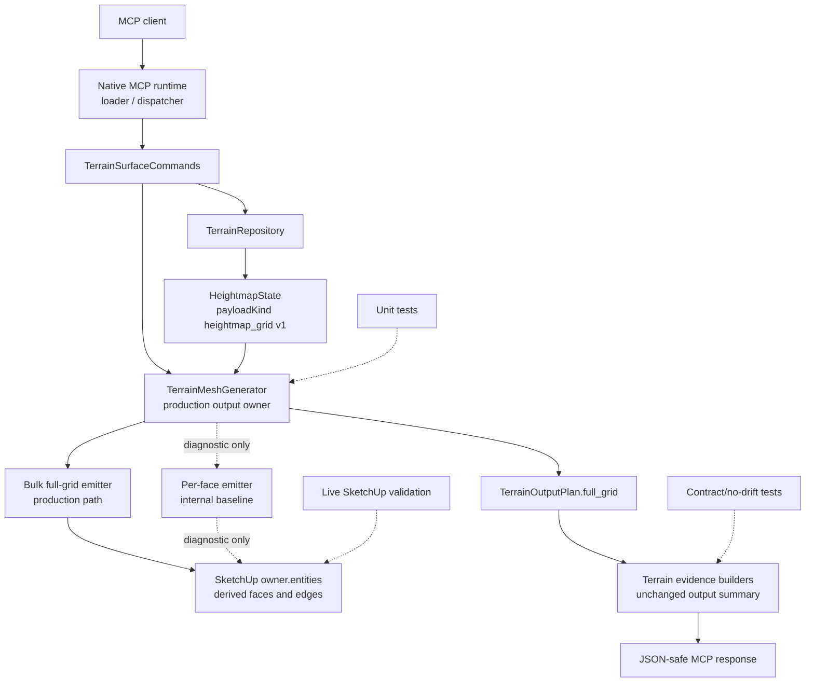

# Technical Plan: MTA-08 Adopt Bulk Full-Grid Terrain Output In Production
**Task ID**: `MTA-08`
**Title**: `Adopt Bulk Full-Grid Terrain Output In Production`
**Status**: `finalized`
**Date**: `2026-04-26`

## Source Task

- [Adopt Bulk Full-Grid Terrain Output In Production](./task.md)

## Problem Summary

Managed terrain create and edit workflows still regenerate derived SketchUp terrain output through per-face entity creation. MTA-07 proved that the bulk full-grid output path can produce equivalent regular-grid terrain output much faster in greybox/live validation, but it remains validation-only. This task promotes that full-grid bulk path into production create and regenerate behavior while preserving the current terrain ownership model, persisted `heightmap_grid` v1 state, public MCP request/response shapes, output summaries, derived markers, positive-Z normals, digest linkage, undo behavior, and unmanaged-scene safety.

## Goals

- Use bulk full-grid output as the production terrain output path behind the existing `TerrainMeshGenerator#generate` and `#regenerate` entrypoints.
- Preserve current `output.derivedMesh` semantics, mesh counts, digest linkage, face/edge derived markers, deterministic cell diagonals, and positive-Z face normals.
- Keep persisted terrain state as `payloadKind: "heightmap_grid"` with schema version `1`.
- Keep public `create_terrain_surface` and `edit_terrain_surface` request and response vocabulary stable.
- Retain the per-face output path as an internal diagnostic baseline until hosted validation and later tasks justify removal.
- Prove production behavior through automated tests and live SketchUp validation on small, non-square, near-cap, and high-variation terrain cases.

## Non-Goals

- Implementing partial terrain output regeneration.
- Introducing dirty-region output patching or chunked output ownership.
- Changing persisted terrain representation or adding schema v2.
- Changing public MCP terrain request fields, response vocabulary, loader schemas, or dispatcher contracts.
- Adding new terrain edit modes.
- Changing managed terrain owner hierarchy or moving output into a new child output container.
- Adding automatic production fallback that silently hides bulk-output failures.

## Related Context

- `specifications/hlds/hld-managed-terrain-surface-authoring.md`
- `specifications/prds/prd-managed-terrain-surface-authoring.md`
- `specifications/domain-analysis.md`
- `specifications/guidelines/ryby-coding-guidelines.md`
- `specifications/guidelines/sketchup-extension-development-guidance.md`
- `specifications/tasks/managed-terrain-surface-authoring/MTA-03-adopt-supported-surface-as-managed-terrain/size.md`
- `specifications/tasks/managed-terrain-surface-authoring/MTA-04-implement-bounded-grade-edit-mvp/size.md`
- `specifications/tasks/managed-terrain-surface-authoring/MTA-05-implement-corridor-transition-terrain-kernel/size.md`
- `specifications/tasks/managed-terrain-surface-authoring/MTA-07-define-scalable-terrain-representation-strategy/summary.md`
- `src/su_mcp/terrain/terrain_mesh_generator.rb`
- `src/su_mcp/terrain/terrain_output_plan.rb`
- `src/su_mcp/terrain/terrain_surface_commands.rb`
- `test/terrain/terrain_mesh_generator_test.rb`
- `test/terrain/terrain_contract_stability_test.rb`
- `test/terrain/terrain_output_live_validation_test.rb`

## Research Summary

- MTA-07 implemented `TerrainOutputPlan.full_grid`, integrated output summaries with the full-grid plan, and added `TerrainMeshGenerator#generate_bulk_candidate` as a validation-only builder-backed path.
- MTA-07 greybox validation showed a large performance gap: near-cap high-variation per-face generation took about `74.8048s`, while the bulk candidate took about `0.4239s`.
- MTA-07 production MCP validation still used the per-face path, with near-cap create/edit timings around tens of seconds.
- Calibrated MTA-03 and MTA-04 show that SketchUp-hosted validation is necessary for terrain output work because local fakes missed unit, sampling, traversal, face-winding, undo, and performance behavior.
- Calibrated MTA-05 reinforces that when terrain seams are ready, implementation friction can be contained, but live host-coordinate and output validation remain the dominant closeout burden.
- The current code already isolates terrain output mutation in `TerrainMeshGenerator`, which is the correct boundary for the production switch.
- Current public evidence builders consume only `output_summary` hashes, so the production output strategy can change without public schema changes if the summary shape stays stable.

## Technical Decisions

### Data Model

No persisted terrain data model changes are planned.

- Authoritative state remains `SU_MCP::Terrain::HeightmapState`.
- Persisted terrain payload remains `payloadKind: "heightmap_grid"` and `schemaVersion: 1`.
- `TerrainOutputPlan.full_grid` remains the source for regular-grid `derivedMesh` counts and digest linkage.
- Bulk output does not introduce durable generated face IDs, vertex IDs, output-region IDs, chunk IDs, tiles, or sample-window state.
- Generated SketchUp geometry remains disposable derived output under the stable managed terrain owner.

### API and Interface Design

- Keep `TerrainMeshGenerator#generate(owner:, state:, terrain_state_summary:)` as the production create-output entrypoint.
- Keep `TerrainMeshGenerator#regenerate(owner:, state:, terrain_state_summary:)` as the production edit-output entrypoint.
- Change production `generate` to emit through the bulk full-grid path when the host entity collection supports bulk building.
- Keep the per-face implementation as a private/internal diagnostic baseline rather than public command behavior.
- Keep command integration unchanged: `TerrainSurfaceCommands` continues to call `generate` for create/adopt and `regenerate` for edit.
- Do not add strategy parameters to public MCP requests or command calls.
- Demote or rename `generate_bulk_candidate` so production code no longer describes the bulk path as a candidate. If a diagnostic method remains, it must be internal/non-public and must not be used by MCP command orchestration.

### Public Contract Updates

No public contract change is planned.

- Request deltas: none.
- Response deltas: none.
- Loader schema or registration updates: none.
- Dispatcher or routing updates: none.
- Contract fixture updates: only no-drift assertions if needed; no intended shape changes.
- Docs/examples: no request/response example changes required. Add a short behavior note only if implementation exposes user-facing performance wording.

Public contract drift remains a risk because output-path work can accidentally change `output.derivedMesh`, evidence, or persisted payload fields. Tests must prove no drift.

### Error Handling

- `regenerate` must continue checking for unsupported non-derived child entities before erasing derived output.
- Unsupported-child refusal remains `terrain_output_contains_unsupported_entities`.
- Existing derived output must not be erased if unsupported children are present.
- Bulk generation failures should propagate through the existing SketchUp operation boundary so create/edit command orchestration aborts rather than silently committing partial state.
- Production must not automatically fall back to per-face generation after a bulk failure.
- Diagnostic per-face comparison can exist in tests or internal validation helpers, but it must be explicit and non-public.

### State Management

- Create/adopt mutation order remains: create owner and metadata, save terrain state, generate derived output, then return evidence.
- Edit mutation order remains: validate, resolve owner, load state, apply edit, save state, regenerate derived output, then return evidence.
- Command-level SketchUp operations remain responsible for coherent commit/abort and undo behavior.
- Bulk output must not mutate repository state, terrain metadata, or public evidence independently of the existing command flow.

### Integration Points

- `TerrainSurfaceCommands` remains the orchestration boundary and should not gain output-strategy branching.
- `TerrainMeshGenerator` owns all direct SketchUp output mutation for this task.
- `TerrainOutputPlan` owns summary shape and should remain independent of the emission strategy.
- `TerrainSurfaceEvidenceBuilder` and `TerrainEditEvidenceBuilder` consume unchanged `output_summary` hashes.
- Runtime loader, dispatcher, and tool schemas remain stable.
- Live SketchUp validation is required for real `Sketchup::Entities#build`, derived marker behavior, edge marker behavior, normals, undo, responsiveness, and unmanaged-scene safety.

### Configuration

- No user-facing configuration is planned.
- No environment or runtime flag is required for normal production.
- Any per-face diagnostic baseline should be internal test/validation code, not a public setting.

## Architecture Context

## Key Relationships

- `HeightmapState` remains the authoritative terrain source state; generated SketchUp TIN output remains derived.
- `TerrainSurfaceCommands` coordinates state and operations but does not choose an output strategy.
- `TerrainMeshGenerator` is the only production boundary that should know bulk versus per-face emission.
- `TerrainOutputPlan.full_grid` preserves derived mesh summary compatibility across output strategies.
- Evidence builders and public MCP responses should not reveal whether faces were emitted through bulk or per-face internals.
- Live SketchUp validation is the only acceptable proof for host builder behavior, marker propagation, real normals, undo, and responsiveness.

## Acceptance Criteria

- Production `create_terrain_surface` output is generated through the bulk full-grid path behind the existing command and generator entrypoints.
- Production `edit_terrain_surface` regeneration is generated through the bulk full-grid path behind the existing command and generator entrypoints.
- `output.derivedMesh` remains compatible with the current response shape and preserves `meshType`, `vertexCount`, `faceCount`, and `derivedFromStateDigest`.
- Persisted terrain state remains `payloadKind: "heightmap_grid"` with schema version `1`.
- No internal output-plan, bulk-strategy, sample-window, chunk, tile, generated face ID, or generated vertex ID fields leak into public responses or persisted state.
- Derived faces and edges are marked with the existing derived-output attribute.
- Generated terrain face normals are oriented upward after create and regenerate.
- Existing deterministic regular-grid triangle diagonal behavior is preserved.
- `regenerate` refuses unsupported child entities before erasing old derived output.
- Successful create/edit mutations remain one coherent SketchUp undo step where existing command behavior supports it.
- Unrelated unmanaged scene content is not deleted by production bulk output.
- Per-face generation remains available internally for diagnostic comparison or tests until a later task removes or demotes it.
- Small, non-square, near-cap, and high-variation live SketchUp validation cases record success/refusal, timing, mesh counts, normals, derived markers, undo behavior, responsiveness, and unmanaged-scene safety.

## Test Strategy

### TDD Approach

Start with failing tests that prove production `generate` uses the bulk builder path while preserving the existing external result shape. Then migrate the implementation behind the existing generator entrypoint, preserving current tests for counts, digest linkage, normals, unit conversion, deterministic diagonals, regeneration cleanup, and unsupported-child refusal. Add or update contract no-drift coverage before broad live validation.

### Required Test Coverage

- `TerrainMeshGenerator#generate` uses `entities.build` when available and still returns the existing `generated` result with `TerrainOutputPlan.full_grid` summary.
- `TerrainMeshGenerator#generate` falls back to the internal per-face emitter only when the host collection does not support `build`, if that compatibility path is kept.
- `TerrainMeshGenerator#regenerate` erases only derived output and rebuilds through the production bulk path after unsupported-child checks pass.
- Unsupported child refusal happens before any derived output is erased.
- Derived face and edge markers are applied in both initial generation and regeneration.
- Generated normals are normalized upward for representative flat and high-relief states.
- Public meter state values are converted to SketchUp internal geometry units before emission.
- Deterministic diagonal direction remains unchanged for every grid cell.
- `TerrainOutputPlan` summary counts and digest linkage remain unchanged.
- Contract stability tests prove `heightmap_grid` v1 persistence and public evidence vocabulary do not drift.
- Command tests prove create/edit orchestration still calls `generate`/`regenerate` without strategy branching.
- Live SketchUp validation covers production create/edit on small, non-square, near-cap, and high-variation terrain cases.
- Live validation records undo, responsiveness/ping, derived markers, normals, digest linkage, mesh counts, and unmanaged sentinel preservation.

## Instrumentation and Operational Signals

- Record create and edit/regenerate wall-clock timings for each live validation case.
- Record expected and actual vertex/face counts.
- Record up/down/flat face normal counts and minimum positive normal Z for high-relief cases.
- Record whether all derived faces and edges carry derived-output markers.
- Record terrain state digest and `derivedFromStateDigest`.
- Record undo result: revision, digest, representative samples, and derived output state after undo.
- Record post-operation responsiveness with a basic MCP `ping` or equivalent hosted check.
- Record unmanaged sentinel survival after create/edit/refusal/undo.

## Implementation Phases

1. Add failing mesh-generator tests for production bulk use through `generate` and `regenerate`.
2. Refactor `TerrainMeshGenerator` so the full-grid bulk emitter is the production path while retaining an internal per-face diagnostic emitter.
3. Preserve result summary, marker, normal, unit-conversion, deterministic diagonal, cleanup, and unsupported-child refusal behavior.
4. Update or remove validation-only `generate_bulk_candidate` tests so no production concept still calls bulk a candidate.
5. Add or strengthen contract no-drift tests for persisted state and public terrain response/evidence vocabulary.
6. Run focused terrain output tests, full Ruby tests, lint, and package verification.
7. Perform live SketchUp validation on representative cases and record timing, correctness, undo, responsiveness, and unmanaged-content evidence.

## Rollout Approach

- Ship the production bulk path behind existing generator and command entrypoints.
- Keep the per-face path internal for comparison until hosted validation and follow-on work make it unnecessary.
- Do not expose a user-facing rollout flag or MCP option.
- Do not proceed to MTA-09/MTA-10 assumptions until MTA-08 live validation confirms bulk full-grid output is stable as the production baseline.

## Risks and Controls

- Bulk builder does not behave like per-face emission in real SketchUp: prove through live validation of counts, markers, normals, undo, and responsiveness.
- Edge derived markers are missing after builder emission: add automated marker tests where fakes support edges and live marker inspection in SketchUp.
- Face normals differ on steep/high-relief terrain: keep upward normalization and validate high-variation near-cap terrain with minimum normal Z.
- Unsupported-child safety regresses: keep refusal-before-erase tests and live unmanaged sentinel validation.
- Public contract drift occurs accidentally: keep no-drift tests for `output.derivedMesh`, evidence vocabulary, and v1 persisted payload.
- Silent fallback hides production defects: do not automatically fall back after bulk failure; let command operation abort/refuse through existing behavior.
- Diagnostic per-face path becomes a second production mode: keep it private/internal and do not thread strategy options into command or MCP surfaces.
- Live validation availability delays closeout: sequence implementation so automated checks are complete before hosted validation, but do not mark the task production-ready without live evidence.

## Dependencies

- `MTA-07` implementation and validation evidence.
- Calibrated terrain analogs from `MTA-03`, `MTA-04`, and `MTA-05`.
- Live SketchUp runtime with MCP access for hosted validation.
- Existing terrain create/edit command flow and repository behavior.
- Existing test and packaging tasks: Ruby unit tests, lint, package verification, and hosted/manual validation recording.

## Premortem Gate

Status: PASS

### Unresolved Tigers

- None.

### Plan Changes Caused By Premortem

- Clarified that per-face fallback is not an automatic post-failure production fallback. If retained, it is only an internal diagnostic baseline or compatibility path for a host collection that lacks bulk-build support.
- Strengthened the live validation gate so edge marker behavior, high-variation normals, undo, responsiveness, and unmanaged sentinel preservation are explicit closeout evidence, not optional observations.
- Kept output ownership unchanged under the managed terrain owner and rejected a new child output container for this task because that would pull MTA-09/MTA-10 ownership work forward.

### Accepted Residual Risks

- Risk: Real SketchUp bulk builder semantics may still differ from local fakes.
  - Class: Paper Tiger
  - Why accepted: The task is specifically scoped to promote a previously validated bulk path, and the plan makes hosted validation a production-readiness gate.
  - Required validation: Live SketchUp create/edit validation must inspect counts, markers, normals, undo, responsiveness, digest linkage, and unmanaged-scene safety.
- Risk: No hard numeric speedup threshold is set.
  - Class: Paper Tiger
  - Why accepted: Runtime timings vary by host and scene state; correctness and materially improved representative timings are more reliable than a single threshold.
  - Required validation: Record per-case timing against the MTA-07 per-face baseline and call out any case that does not materially improve.

### Carried Validation Items

- Automated mesh-generator tests must prove production `generate` and `regenerate` use the bulk path through existing entrypoints.
- Contract no-drift tests must prove `heightmap_grid` v1 persistence and public evidence vocabulary remain stable.
- Live SketchUp validation must cover small, non-square, near-cap, and high-variation terrain cases.
- Live validation must record timing, mesh counts, derived face/edge markers, normal orientation, digest linkage, undo, responsiveness, and unmanaged sentinel preservation.

### Implementation Guardrails

- Do not expose output strategy selection through MCP request fields, response fields, loader schemas, or runtime dispatcher options.
- Do not silently fall back to per-face generation after a production bulk failure.
- Do not introduce output-region ownership, partial regeneration, chunking, tiles, or persisted schema changes.
- Do not move output mutation out of `TerrainMeshGenerator`.
- Do not finalize implementation as production-ready without hosted SketchUp evidence.

## Quality Checks

- [x] All required inputs validated
- [x] Problem statement documented
- [x] Goals and non-goals documented
- [x] Research summary documented
- [x] Technical decisions included
- [x] Architecture context included
- [x] Acceptance criteria included
- [x] Test requirements specified
- [x] Instrumentation and operational signals defined when needed
- [x] Risks and dependencies documented
- [x] Rollout approach documented when needed
- [x] Small reversible phases defined
- [x] Premortem completed with falsifiable failure paths and mitigations
- [x] Planning-stage size estimate considered before premortem finalization
