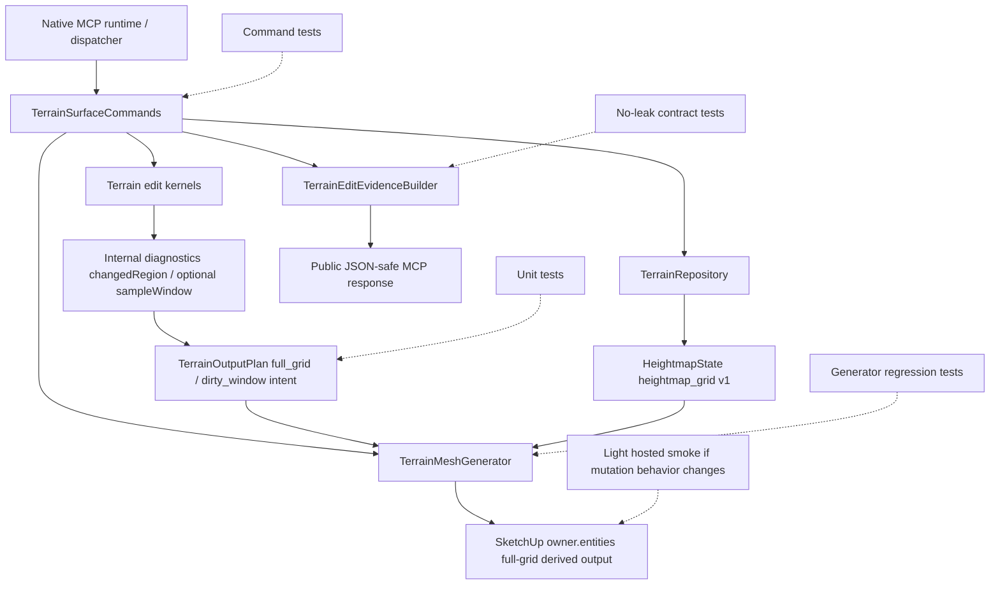

# Technical Plan: MTA-09 Define Region-Aware Terrain Output Planning Foundation
**Task ID**: `MTA-09`
**Title**: `Define Region-Aware Terrain Output Planning Foundation`
**Status**: `finalized`
**Date**: `2026-04-26`

## Source Task

- [Define Region-Aware Terrain Output Planning Foundation](./task.md)

## Problem Summary

Managed terrain edit kernels already know which samples changed, and `SampleWindow` gives the runtime a SketchUp-free way to describe bounded sample regions. MTA-08 made production output builder-backed full-grid regeneration. MTA-09 adds an internal output-planning vocabulary that can carry dirty-window intent to the output boundary while production remains full-grid bulk regeneration. The work must not expose planning internals through persisted terrain state or public MCP responses.

## Goals

- Represent full-grid and dirty-window output intent internally.
- Pass affected-region intent from terrain edit command orchestration to the output boundary.
- Preserve full-grid bulk regeneration as the production execution behavior.
- Keep persisted `heightmap_grid` v1 and public terrain evidence stable.
- Leave a testable boundary for MTA-10 partial regeneration without implementing partial replacement now.

## Non-Goals

- Replacing only part of the SketchUp terrain mesh.
- Introducing chunked, tiled, or durable output-region ownership.
- Adding persisted terrain representation v2.
- Changing public MCP request fields, response fields, loader schemas, or dispatcher routing.
- Adding public planning diagnostics, rich validation verdicts, or user-facing strategy selection.

## Related Context

- `specifications/hlds/hld-managed-terrain-surface-authoring.md`
- `specifications/prds/prd-managed-terrain-surface-authoring.md`
- `specifications/domain-analysis.md`
- `specifications/guidelines/ryby-coding-guidelines.md`
- `specifications/guidelines/sketchup-extension-development-guidance.md`
- `specifications/tasks/managed-terrain-surface-authoring/MTA-07-define-scalable-terrain-representation-strategy/summary.md`
- `specifications/tasks/managed-terrain-surface-authoring/MTA-08-adopt-bulk-full-grid-terrain-output-in-production/task.md`
- `src/su_mcp/terrain/sample_window.rb`
- `src/su_mcp/terrain/terrain_output_plan.rb`
- `src/su_mcp/terrain/terrain_surface_commands.rb`
- `src/su_mcp/terrain/terrain_mesh_generator.rb`
- `src/su_mcp/terrain/terrain_edit_evidence_builder.rb`
- `test/terrain/terrain_output_plan_test.rb`
- `test/terrain/terrain_contract_stability_test.rb`
- `test/terrain/terrain_surface_commands_test.rb`

## Research Summary

- MTA-07 completed `SampleWindow`, `TerrainOutputPlan.full_grid`, and contract tests proving window/chunk/tile state does not persist or leak into public evidence.
- MTA-08 completed production full-grid bulk output: `TerrainMeshGenerator#generate` uses the builder-backed full-grid path, `regenerate` retains unsupported-child refusal and cleanup before rebuilding through that path, and public output no longer leaks command-level regeneration strategy fields.
- MTA-05 shows `SampleWindow` composes cleanly with edit kernels, but public contract expansion greatly increases change surface. MTA-09 deliberately avoids public expansion.
- MTA-03, MTA-04, and MTA-07 show hosted SketchUp behavior matters when output mutation changes. MTA-09 should avoid changing output mutation; if implementation does change it, a hosted smoke check becomes required.
- Current public evidence already exposes `changedRegion`; this remains the public vocabulary. `SampleWindow` and output-plan intent remain internal.

## Technical Decisions

### Data Model

Extend `SU_MCP::Terrain::TerrainOutputPlan` as the internal output-planning value object.

- Keep `TerrainOutputPlan.full_grid(state:, terrain_state_summary:)`.
- Add dirty-window construction, for example `TerrainOutputPlan.dirty_window(state:, terrain_state_summary:, window:)`.
- Track internal intent separately from public summary:
  - `intent`: `:full_grid` or `:dirty_window`
  - `window`: a `SampleWindow`
  - `execution_strategy`: full-grid bulk regeneration for this task
  - `state_digest`, `mesh_type`, `vertex_count`, `face_count`: same summary inputs as today
- Keep `to_summary` public-shape compatible. It returns only the existing `derivedMesh` summary.
- Do not serialize `TerrainOutputPlan`, `SampleWindow`, dirty-window intent, output regions, chunks, or tiles into terrain state.

### API and Interface Design

- Command orchestration builds an internal output plan after a successful edit result and state save, before regeneration.
- Edit kernels may continue to expose `changedRegion` diagnostics. If implementation adds `sampleWindow` to diagnostics, it must be private and evidence builders must not serialize it.
- The landed MTA-08 generator has `regenerate` perform refusal/cleanup and then delegate to `generate`. To avoid accepting a plan that is then ignored, thread optional output-plan input through the shared generation path, for example:

```ruby
generate(owner:, state:, terrain_state_summary:, output_plan: nil)
regenerate(owner:, state:, terrain_state_summary:, output_plan: nil)
```

- `output_plan: nil` preserves compatibility by constructing a full-grid plan internally.
- `regenerate` should pass the provided plan into `generate` after unsupported-child checks and derived-output cleanup.
- In MTA-09, the generator still emits full-grid derived output. It may inspect the plan only enough to use or preserve the full-grid summary and execution choice.
- Do not add MCP request options, response fields, loader schema entries, dispatcher changes, or runtime registration changes.
- Do not reintroduce public `output.regeneration`, `strategy`, `bulk`, `candidate`, `validationOnly`, or equivalent output-strategy fields removed by MTA-08.

### Public Contract Updates

Not applicable. Public contract deltas must remain none.

- Request deltas: none.
- Response deltas: none.
- Loader schema or registration updates: none.
- Dispatcher or routing updates: none.
- Contract fixtures: only no-drift assertions if needed.
- Docs/examples: no public usage changes. Add internal developer notes only if the implementation would otherwise be unclear.
- MTA-09 no-leak tests must preserve MTA-08's public output vocabulary: `output.derivedMesh` remains the public output summary and strategy/planning internals remain absent.

### Error Handling

- Empty dirty windows should not be a normal user-facing path because edit kernels already refuse edits with no affected samples.
- If `TerrainOutputPlan.dirty_window` receives an empty window directly, raise an internal `ArgumentError` or equivalent construction error rather than adding a public refusal code.
- Invalid window bounds remain `SampleWindow` responsibility.
- Unsupported terrain output children remain `TerrainMeshGenerator` refusal behavior.
- A dirty-window plan must not create a warning or public response field when execution falls back to full-grid output; full-grid is the expected production behavior for MTA-09.

### State Management

- Authoritative terrain state remains `HeightmapState` persisted as `payloadKind: "heightmap_grid"` and schema version `1`.
- Output plans are invocation-scoped internal objects and are not stored on the terrain owner, in the repository payload, or in `su_mcp` metadata.
- Edit mutation order remains: validate, resolve owner, load state, apply edit kernel, save state, regenerate output, return evidence.
- SketchUp operation/undo behavior remains owned by existing command orchestration and output generation.

### Integration Points

- `TerrainSurfaceCommands` owns the command-level handoff from edit diagnostics to output planning.
- `TerrainOutputPlan` owns internal summary and intent vocabulary.
- `TerrainMeshGenerator` remains the only owner of direct SketchUp entity mutation.
- `TerrainEditEvidenceBuilder` remains a public-response whitelist and must not serialize planning internals.
- MTA-10 can later change execution behavior behind the same plan boundary.

### Configuration

No user-facing or environment configuration is planned.

## Architecture Context



## Key Relationships

- Edit kernels produce updated terrain state and bounded-region diagnostics; they do not mutate SketchUp entities.
- Command orchestration converts affected-region intent into an internal output plan.
- The generator accepts the plan but keeps full-grid bulk regeneration as production behavior.
- Public evidence remains evidence-driven and JSON-safe, with `changedRegion` as the public affected-region vocabulary.
- Persisted terrain state remains independent of output planning.

## Acceptance Criteria

- Internal terrain output planning can represent full-grid intent and dirty-window intent with `SampleWindow`-based bounds.
- Implementation preserves the landed MTA-08 full-grid bulk output baseline while wiring dirty-window intent into regeneration.
- Dirty-window output plans preserve the existing public `output.derivedMesh` summary shape while production output remains full-grid.
- Edit command orchestration passes affected-region intent through an internal output-planning boundary before regeneration.
- Existing edit kernels remain free of SketchUp entity mutation responsibilities.
- Empty or invalid dirty windows are handled as internal invalid-plan conditions, while existing user-facing no-affected-samples refusals remain unchanged.
- Persisted terrain state remains `payloadKind: "heightmap_grid"` and `schemaVersion: 1`.
- Public MCP request schemas, response shapes, and evidence vocabulary remain unchanged.
- Internal keys such as `sampleWindow`, `dirtyWindow`, `outputPlan`, `outputRegions`, `chunks`, `tiles`, `faceId`, and `vertexId` do not appear in persisted state or public responses.
- Public output does not regain `regeneration`, `strategy`, `bulk`, `candidate`, or `validationOnly` fields.
- Unsupported child refusal and full-grid regeneration safety behavior remain owned by `TerrainMeshGenerator`.
- The resulting boundary is test-covered enough for MTA-10 to implement partial regeneration without changing edit-kernel ownership.

## Test Strategy

### TDD Approach

Start with failing tests for `TerrainOutputPlan.dirty_window` and no-leak contract behavior. Then add command-level tests proving edit orchestration creates and passes a dirty-window output plan while external evidence stays unchanged. Finally, update generator tests so accepting `output_plan:` remains behavior-preserving and full-grid.

### Required Test Coverage

- `TerrainOutputPlan.full_grid` continues to return the current public summary.
- `TerrainOutputPlan.dirty_window` records dirty intent and a non-empty `SampleWindow` while returning the unchanged `derivedMesh` summary.
- Dirty-window construction rejects empty windows as an internal invalid plan.
- Command tests prove `edit_terrain_surface` regeneration passes an internal output plan derived from affected-region diagnostics.
- Generator tests prove `generate(..., output_plan:)` and `regenerate(..., output_plan:)` still perform full-grid generation/regeneration and preserve summary shape.
- Evidence tests prove public edit responses do not include internal planning fields.
- Contract tests preserve MTA-08's no-leak output vocabulary for `regeneration`, `strategy`, `bulk`, `candidate`, and `validationOnly`.
- Serializer/contract tests prove `heightmap_grid` v1 persistence has no window, output-region, chunk, tile, face ID, or vertex ID fields.
- Existing unsupported-child refusal tests continue to prove refusal happens before derived output is erased.
- If implementation changes SketchUp mutation behavior after MTA-08, run a light hosted smoke check for create/edit output, undo, derived markers, normals, and unmanaged sentinel preservation.

## Instrumentation and Operational Signals

- No new production instrumentation is required.
- Test assertions should record the selected internal plan intent and execution strategy.
- If hosted smoke is required, record output success/refusal, mesh counts, undo result, derived marker presence, normal orientation, and unmanaged sentinel preservation.

## Implementation Phases

1. Inspect the landed MTA-08 `TerrainMeshGenerator` seam and preserve builder-backed full-grid regeneration while adding plan handoff.
2. Add `TerrainOutputPlan` dirty-window tests and implement internal intent fields without changing `to_summary`.
3. Add no-leak persistence and public-response contract tests for planning vocabulary, including MTA-08 strategy-field no-leak terms.
4. Wire command orchestration to build a dirty-window plan for successful edits and pass it to regeneration.
5. Update the `TerrainMeshGenerator` generation path so `generate` and `regenerate` can accept an optional plan while preserving full-grid behavior.
6. Add or adjust kernel diagnostics only if needed for clean plan construction, keeping diagnostics private.
7. Run focused terrain tests, full Ruby tests, RuboCop, and package verification.
8. Run light hosted smoke only if output mutation behavior changed beyond accepting the plan.

## Rollout Approach

- Ship as an internal platform seam on top of completed MTA-08 full-grid bulk regeneration.
- Do not expose feature flags, public options, or public planning diagnostics.
- Keep full-grid bulk regeneration as the only production execution behavior.
- Treat MTA-10 as the first task allowed to implement partial derived-output replacement.

## Risks and Controls

- Scope bleed into partial regeneration: keep implementation limited to plan intent and full-grid execution; add tests that prove full-grid summary and behavior remain.
- Public contract drift: whitelist evidence fields and add no-leak contract assertions for planning vocabulary.
- MTA-08 strategy-field regression: preserve the completed MTA-08 public output shape and adjust only the plan handoff, not the output strategy or public vocabulary.
- Fake partial confidence: name the internal execution strategy clearly so dirty intent is not mistaken for partial output support.
- Generator ownership blur: keep all SketchUp entity creation, erasure, marking, and unsupported-child refusal in `TerrainMeshGenerator`.
- Host-sensitive output regression: avoid mutation changes; if unavoidable, validate with hosted smoke.
- `changedRegion` and internal `SampleWindow` divergence: derive both from the same affected samples/window and test compatibility.

## Dependencies

- MTA-07 completed `SampleWindow` and `TerrainOutputPlan.full_grid`.
- MTA-08 production full-grid bulk output is complete and provides the implementation baseline.
- Existing terrain edit command flow and repository behavior.
- Existing public contract fixture and terrain contract stability test coverage.
- Ruby test, RuboCop, package verification, and optional hosted SketchUp validation access.

## Premortem Gate

Status: PASS

### Unresolved Tigers

- None.

### Plan Changes Caused By Premortem

- Added an explicit first implementation phase to inspect and preserve the landed MTA-08 generator seam before coding MTA-09.
- Added an acceptance criterion that MTA-09 implementation confirms the production full-grid bulk baseline before dirty-window handoff is wired.
- Kept hosted validation conditional on actual SketchUp mutation changes, so this preparatory task does not inherit MTA-08's full live-validation burden unnecessarily.

### Accepted Residual Risks

- Risk: The completed MTA-08 regeneration seam differs from the draft MTA-09 example.
  - Class: Paper Tiger
  - Why accepted: MTA-08 has now completed, and the plan begins with seam inspection before implementation.
  - Required validation: Implementation must adapt to the landed generator interface without changing public contracts or output strategy.
- Risk: Internal diagnostics could leak because edit evidence receives diagnostic hashes.
  - Class: Paper Tiger
  - Why accepted: Evidence is already shaped through `TerrainEditEvidenceBuilder`, and the plan requires no-leak public response tests.
  - Required validation: Contract/evidence tests must reject planning vocabulary in public responses and persisted state.
- Risk: Dirty-window intent may be mistaken downstream for actual partial regeneration support.
  - Class: Paper Tiger
  - Why accepted: The task explicitly keeps execution full-grid and defers partial replacement to MTA-10.
  - Required validation: Tests must assert dirty intent and full-grid execution strategy separately.

### Carried Validation Items

- Focused `TerrainOutputPlan`, command orchestration, generator, and no-leak contract tests.
- Full Ruby test suite, RuboCop, and package verification.
- Light hosted SketchUp smoke only if implementation changes output mutation behavior beyond accepting an internal plan.
- Implementation-time check that MTA-09 preserves the completed MTA-08 builder-backed full-grid regeneration path and public no-strategy output shape.

### Implementation Guardrails

- Do not implement partial terrain output replacement in MTA-09.
- Do not add MCP request fields, response fields, loader schema changes, dispatcher changes, public strategy options, or public planning diagnostics.
- Do not reintroduce public `output.regeneration`, `strategy`, `bulk`, `candidate`, or `validationOnly` fields removed by MTA-08.
- Do not persist output plans, sample windows, output regions, chunks, tiles, face IDs, or vertex IDs in `heightmap_grid` v1 state.
- Keep all SketchUp entity creation, erasure, derived marking, unsupported-child refusal, and output mutation in `TerrainMeshGenerator`.
- Treat `changedRegion` as public evidence and `SampleWindow` / dirty-window intent as internal runtime vocabulary.

## Quality Checks

- [x] All required inputs validated
- [x] Problem statement documented
- [x] Goals and non-goals documented
- [x] Research summary documented
- [x] Technical decisions included
- [x] Architecture context included
- [x] Acceptance criteria included
- [x] Test requirements specified
- [x] Instrumentation and operational signals defined when needed
- [x] Risks and dependencies documented
- [x] Rollout approach documented when needed
- [x] Small reversible phases defined
- [x] Premortem completed with falsifiable failure paths and mitigations
- [x] Planning-stage size estimate considered before premortem finalization
