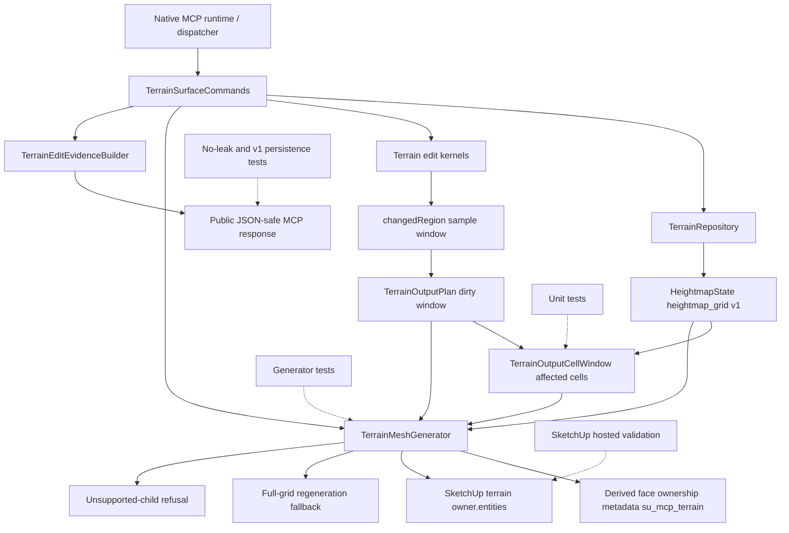

# Technical Plan: MTA-10 Implement Partial Terrain Output Regeneration
**Task ID**: `MTA-10`
**Title**: `Implement Partial Terrain Output Regeneration`
**Status**: `finalized`
**Date**: `2026-04-26`

## Source Task

- [Implement Partial Terrain Output Regeneration](./task.md)

## Problem Summary

MTA-08 made production terrain output builder-backed full-grid regeneration. MTA-09 added internal dirty-window output planning, and hosted evidence proved real edit commands can pass `TerrainOutputPlan` dirty-window intent into `TerrainMeshGenerator#regenerate`. Production output still erases and rebuilds every derived terrain face, even when the changed sample window is small.

MTA-10 implements local partial terrain output regeneration for the current managed terrain state model. It must update only the affected derived output cells when ownership is provable, preserve full-grid fallback when ownership is not provable, and avoid pulling in durable localized-detail terrain representation work reserved for MTA-11.

## Goals

- Replace only affected derived output faces for supported bounded edits when partial regeneration is safe.
- Convert dirty sample windows into affected output cell windows using overlap semantics.
- Add minimal derived-output ownership metadata so affected faces can be identified after save/reopen.
- Preserve derived markers, upward normals, deterministic triangle topology, seam coherence, full derived-mesh summary digest linkage, cleanup, and undo behavior.
- Fall back to full-grid regeneration for legacy or unsafe partial-output states.
- Keep public MCP request/response contracts and persisted `heightmap_grid` v1 terrain state stable.
- Validate the behavior in live SketchUp, including true partial replacement, fallback, undo, save/reopen, seams, markers, normals, responsiveness, and performance.

## Non-Goals

- Implementing durable localized-detail terrain representation v2.
- Adding broad terrain storage migration or representation-unit dispatch.
- Adding new public terrain edit modes, request options, or public strategy selectors.
- Making generated SketchUp mesh geometry, face IDs, or vertex IDs durable terrain source state.
- Implementing broad mesh repair, arbitrary TIN surgery, or hardscape mutation.
- Replacing validation/review policy with terrain output checks.

## Related Context

- `specifications/hlds/hld-managed-terrain-surface-authoring.md`
- `specifications/prds/prd-managed-terrain-surface-authoring.md`
- `specifications/domain-analysis.md`
- `specifications/guidelines/ryby-coding-guidelines.md`
- `specifications/guidelines/sketchup-extension-development-guidance.md`
- `specifications/guidelines/mcp-tool-authoring-sketchup.md`
- `specifications/tasks/managed-terrain-surface-authoring/MTA-08-adopt-bulk-full-grid-terrain-output-in-production/summary.md`
- `specifications/tasks/managed-terrain-surface-authoring/MTA-09-define-region-aware-terrain-output-planning-foundation/summary.md`
- `specifications/tasks/managed-terrain-surface-authoring/MTA-11-design-and-implement-durable-localized-terrain-representation-v2/task.md`
- `src/su_mcp/terrain/sample_window.rb`
- `src/su_mcp/terrain/terrain_output_plan.rb`
- `src/su_mcp/terrain/terrain_mesh_generator.rb`
- `src/su_mcp/terrain/terrain_surface_commands.rb`
- `test/terrain/terrain_mesh_generator_test.rb`
- `test/terrain/terrain_output_plan_test.rb`
- `test/terrain/terrain_contract_stability_test.rb`

## Research Summary

- MTA-08 is implemented and validated. It provides the full-grid bulk output baseline, derived face/edge marker expectations, upward normal checks, digest linkage, unsupported-child refusal behavior, undo proof, and hosted validation pattern.
- MTA-09 is implemented and validated. It provides `TerrainOutputPlan.dirty_window`, command-to-generator dirty-window handoff, no-leak contract coverage, and hosted proof that a real edit passes dirty-window intent into regeneration.
- MTA-09 deliberately did not implement partial output replacement. Its actual value for this task is the internal plan seam, not mutation safety.
- Calibrated MTA-03 and MTA-04 actuals show that live SketchUp entity behavior, unit conversion, entity traversal, normals, deletion safety, and undo can invalidate mock-friendly assumptions.
- Targeted Unreal Engine Landscape source inspection supports the ownership model: edited height regions are mapped to overlapping owned update units; shared boundary vertices require neighbor/overlap handling; changed units are locally updated or invalidated; broader fallback remains available when local ownership is not safe. This informs the dirty-sample-to-cell-window rule but does not change SketchUp runtime ownership.
- The split with MTA-11 is now explicit: MTA-10 may add derived-output ownership metadata, but MTA-11 owns durable localized-detail terrain source representation and representation-unit storage.

## Technical Decisions

### Data Model

`SampleWindow` remains the edit-domain vocabulary for changed samples.

Add an output-domain cell-window value object, for example `SU_MCP::Terrain::TerrainOutputCellWindow`.

Responsibilities:

- Represent affected output cells by `min_column`, `min_row`, `max_column`, and `max_row`.
- Derive a clipped cell window from a dirty `SampleWindow` and terrain dimensions.
- Report whether the cell window is empty or covers the complete output cell grid.
- Enumerate affected cells for generator tests and replacement logic.

Dirty sample to affected cell conversion:

```ruby
min_cell_column = [dirty.min_column - 1, 0].max
min_cell_row = [dirty.min_row - 1, 0].max
max_cell_column = [dirty.max_column, columns - 2].min
max_cell_row = [dirty.max_row, rows - 2].min
```

Rationale:

- A changed sample may affect every output cell that touches that vertex.
- The output unit is a grid cell, not a sample.
- Each cell emits two deterministic triangles.

Derived face ownership metadata belongs in `su_mcp_terrain`, not in persisted terrain state:

- `derivedOutput: true`
- `outputSchemaVersion: 1`
- `gridCellColumn: <integer>`
- `gridCellRow: <integer>`
- `gridTriangleIndex: 0` or `1`

Per-face ownership intentionally does not include the whole terrain state digest or revision. The full derived mesh summary remains linked to the saved state digest, but unchanged retained faces are not rewritten after every partial edit just because the whole terrain digest changed. Partial eligibility is based on complete affected-window ownership, not global output freshness.

Use the same per-key `set_attribute` / `get_attribute` pattern as the existing `derivedOutput` marker unless implementation evidence shows dictionary-level reads are needed for performance. Exact ownership lookup must still be implemented and tested before any partial erase path.

Edges remain marker-only unless implementation proves edge ownership is required for cleanup or hosted behavior.

### API And Interface Design

Keep public MCP tools unchanged.

Internal changes:

- Extend `TerrainOutputPlan` to expose a cell window or an execution strategy usable by the generator when dirty-window intent is present.
- Keep `TerrainOutputPlan#to_summary` public-shape compatible.
- Add generator-private or small collaborator methods for:
  - deriving partial eligibility,
  - collecting owned faces for affected cells,
  - falling back to full regeneration,
  - emitting only a cell window.
- Update full-grid `generate` to mark generated faces with ownership metadata.
- Update `regenerate` to:
  - refuse unsupported child entities before erasing anything,
  - attempt partial regeneration for dirty-window plans,
  - fall back to full-grid regeneration when partial ownership cannot be proven.

Do not add loader schema entries, dispatcher routing, public request options, or user-facing strategy selection.

### Public Contract Updates

Not applicable. Public contract deltas must remain none.

- Request deltas: none.
- Response deltas: none.
- Loader schema or registration updates: none.
- Dispatcher or routing updates: none.
- Contract fixtures: add no-leak assertions for new metadata vocabulary if existing tests do not cover it.
- Docs/examples: no usage change. Review README only to confirm no public terrain output wording now needs correction.

Forbidden public/persisted leak terms include:

- `outputSchemaVersion`
- `terrainStateDigest`
- `terrainStateRevision`
- `gridCellColumn`
- `gridCellRow`
- `gridTriangleIndex`
- `outputPlan`
- `dirtyWindow`
- `outputRegions`
- `chunks`
- `tiles`
- `faceId`
- `vertexId`
- public `output.regeneration.strategy`

### Error Handling

- Unsupported non-derived child entities under the terrain owner continue to return `terrain_output_contains_unsupported_entities` before any output erase.
- Legacy marker-only output falls back to full-grid regeneration.
- Missing ownership metadata in the affected cell window falls back to full-grid regeneration.
- Duplicate or incomplete affected-cell face ownership falls back to full-grid regeneration.
- Whole-grid dirty cell windows may use full-grid regeneration directly.
- Exceptions during mutation continue to abort through the existing SketchUp operation boundary in `TerrainSurfaceCommands`.

Partial ownership uncertainty should not become a public refusal while full-grid regeneration remains safe.

### State Management

Authoritative terrain state remains `heightmap_grid` schema version `1`.

The terrain repository and serializer do not store output regions, chunks, cell ownership, face IDs, or vertex IDs.

Derived-output ownership metadata is host-embedded metadata on generated SketchUp faces. It is durable enough to support save/reopen output cleanup, but it is not terrain source state.

State save remains command-owned:

1. validate request,
2. resolve owner,
3. load terrain state,
4. apply edit kernel,
5. save authoritative state,
6. regenerate output partially or fully,
7. build public evidence,
8. commit the SketchUp operation.

### Integration Points

- `TerrainSurfaceCommands`: existing command orchestration and undo boundary.
- `TerrainOutputPlan`: internal dirty sample intent and public summary preservation.
- `TerrainOutputCellWindow`: output-domain affected-cell derivation.
- `TerrainMeshGenerator`: SketchUp output mutation, face ownership metadata, partial replacement, fallback, marker/normal behavior, unsupported-child refusal.
- `TerrainEditEvidenceBuilder`: public response whitelist and no-leak boundary.
- `TerrainStateSerializer` / `TerrainRepository`: v1 persistence no-drift boundary.
- SketchUp host runtime: final authority for entity deletion, face creation, attributes, undo, save/reopen, responsiveness, and seam behavior.

### Configuration

No user-facing or environment configuration is planned.

Partial regeneration is automatic when internal eligibility checks pass. Full-grid regeneration remains automatic fallback.

## Architecture Context



## Key Relationships

- Edit kernels produce terrain state and changed-region diagnostics; they do not mutate SketchUp entities.
- Command orchestration translates changed-region diagnostics into internal output intent and keeps the coherent SketchUp operation boundary.
- Output planning carries sample-window intent, while output cell-window derivation defines the mesh mutation unit.
- The generator owns all direct SketchUp terrain output creation, deletion, marking, and fallback/refusal behavior.
- Public terrain evidence remains compact and JSON-safe. It does not expose output ownership internals.
- MTA-10 output ownership metadata may inform MTA-11 vocabulary, but MTA-11 owns durable localized terrain source representation.

## Acceptance Criteria

- Dirty sample windows are converted to clipped affected cell windows using overlap semantics, including first-row/column, last-row/column, single-sample, non-square, and whole-grid cases.
- Full-grid generation writes derived-output ownership metadata to generated faces without changing public response shape or persisted terrain state.
- Partial regeneration replaces only faces owned by the affected cell window when ownership metadata is complete and current for the saved terrain state.
- Replacement faces preserve derived markers, cell/triangle ownership metadata, upward normals, deterministic triangle topology, and full derived-mesh summary digest linkage.
- Adjacent unchanged faces remain present and coherent at seams after partial regeneration, with boundary vertex positions matching the regenerated cells within the project tolerance used by terrain geometry tests.
- Legacy marker-only output, missing ownership metadata, duplicate owned faces, or incomplete affected-cell ownership falls back to full-grid regeneration without exposing strategy fields publicly.
- Unsupported non-derived child entities under the terrain owner still refuse before any derived output or state is erased.
- Supported fresh metadata-bearing partial cases actually take the partial path; full-grid fallback is expected only for legacy or unsafe ownership cases.
- Public `create_terrain_surface` and `edit_terrain_surface` request and response shapes remain compatible; no output-region, cell, face ID, vertex ID, strategy, or partial-regeneration internals leak into MCP responses.
- Public `output.derivedMesh` remains the full derived mesh summary, not the changed-region face count or a partial-operation summary.
- Persisted `heightmap_grid` v1 terrain payload remains unchanged and does not store output ownership, output regions, chunks, tiles, face IDs, or vertex IDs.
- Hosted SketchUp validation proves true partial replacement, fallback from legacy output, undo coherence, save/reopen behavior, seam coherence, marker/normal preservation, responsiveness, and performance improvement on representative localized edits.

## Test Strategy

### TDD Approach

Start with pure Ruby tests for sample-window to cell-window conversion. Then add generator-level tests that prove full-grid generation writes ownership metadata and partial eligibility is conservative. Only after fallback and metadata behavior are locked should the implementation add actual partial deletion/replacement. Finish with public no-leak and hosted validation.

No production partial erase should be implemented until the exact ownership guard and seam-check test oracle exist. The generator should prove it can identify the complete affected face set before it is allowed to erase that set.

### Required Test Coverage

- `TerrainOutputCellWindow` derives the correct affected cell window from dirty sample windows.
- Cell-window derivation clips at first column/row and last column/row.
- Cell-window derivation explicitly covers a dirty window touching only the last sample column and/or last sample row on non-square terrain.
- Cell-window derivation handles non-square terrain and whole-grid dirty windows.
- Full-grid `generate` marks every derived face with output schema, cell column, cell row, and triangle index.
- Full-grid generation keeps existing derived edge markers.
- `regenerate` refuses unsupported child entities before any output erase.
- Partial regeneration deletes only faces in the affected cell window.
- Partial regeneration emits exactly two replacement faces per affected cell.
- Partial regeneration preserves upward normals and deterministic triangle ordering.
- Partial regeneration leaves adjacent unchanged faces present.
- Partial regeneration has a numeric seam assertion comparing regenerated boundary vertices against adjacent unchanged face vertices within tolerance.
- Legacy marker-only output falls back to full-grid regeneration.
- Missing, duplicate, or incomplete affected-cell metadata falls back to full-grid regeneration.
- Whole-grid dirty windows may take the full-grid regeneration path.
- Public `output.derivedMesh` summary remains full-grid shaped and stable for partial and full regeneration.
- Public edit evidence does not expose internal output metadata or strategy terms.
- Serialized `heightmap_grid` v1 state does not include output metadata, output regions, chunks, tiles, face IDs, or vertex IDs.
- Hosted validation covers:
  - fresh metadata-bearing terrain partial edit,
  - legacy marker-only fallback,
  - save/reopen metadata attribute round trip before a partial edit,
  - small terrain,
  - non-square terrain,
  - near-cap terrain,
  - high-variation boundary edit,
  - undo after partial regeneration,
  - save/reopen followed by partial regeneration,
  - marker and normal inspection,
  - seam inspection,
  - responsiveness and timing comparison against full-grid baseline.

## Instrumentation And Operational Signals

- No public instrumentation is required.
- Tests should be able to observe the internal execution path without leaking it into public responses.
- Internal test or hosted-validation diagnostics should record fallback reasons such as `legacy_output`, `incomplete_ownership`, and `duplicate_ownership` without exposing them in public MCP responses.
- Numeric seam checks should use one documented terrain geometry tolerance from shared test support so unit and hosted validation do not drift.
- Hosted validation should record:
  - dirty sample window,
  - affected cell window,
  - internal path taken: partial, fallback, or refusal,
  - expected and actual replaced face counts,
  - unchanged adjacent face count or representative identity evidence,
  - boundary vertex deltas at regenerated/unchanged seams,
  - derived ownership attribute values after save/reopen,
  - derived marker counts,
  - non-positive normal count,
  - full derived mesh summary digest linkage,
  - undo result,
  - save/reopen result,
  - timing versus full-grid baseline,
  - fallback/refusal reason where applicable.

## Implementation Phases

1. Add `TerrainOutputCellWindow` tests and implementation, including `each_cell`, `cell_count`, and whole-grid detection.
2. Add seam-oracle test support that can compare regenerated boundary vertices to adjacent unchanged face vertices within a single shared tolerance constant.
3. Update `TerrainOutputPlan` or generator-local planning so dirty-window plans can expose affected output cells while preserving `to_summary`.
4. Add full-grid face ownership metadata tests, then update `TerrainMeshGenerator` to write metadata during full output generation.
5. Add no-leak persistence and public-response tests for new metadata vocabulary and stable full-grid-shaped `output.derivedMesh` summaries.
6. Add partial-eligibility tests for complete, missing, duplicate, and incomplete metadata.
7. Implement exact ownership face collection and fallback decision logic before any partial erase logic.
8. Add partial replacement tests, then implement affected-face deletion and affected-cell emission.
9. Preserve unsupported-child refusal and full-grid fallback behavior with regression tests.
10. Run focused terrain tests, full terrain tests, full Ruby suite, RuboCop, package verification, and diff hygiene.
11. Run hosted SketchUp validation with loaded-code check, representative partial/fallback cases, undo, save/reopen metadata round trip, seam/normal/marker inspection, and performance timing.
12. Record implementation summary and remaining validation gaps, if any.

## Rollout Approach

- Ship partial regeneration as an internal automatic optimization behind existing terrain edit behavior.
- No public option is needed to select partial or full regeneration.
- The first edit after upgrading legacy output may fall back to full-grid regeneration and stamp ownership metadata for future partial edits.
- Full-grid regeneration remains the safe fallback for all ownership-uncertain output states.
- Hosted validation is mandatory before partial regeneration is considered production-ready.

## Risks And Controls

- Wrong dirty region: add cell-window tests first and use overlap expansion from dirty samples to output cells.
- Partial corruption: require exactly two current owned faces per affected cell before any partial erase; otherwise fall back to full.
- False partial success: hosted fresh metadata-bearing cases must prove the partial path was actually taken and did not silently fall back.
- Unsupported child deletion: keep unsupported-child refusal before any erase, partial or full.
- Seam defects: compute replacement vertices from authoritative state and validate boundary vertex deltas in tests and hosted SketchUp.
- Undo split-brain: keep existing command operation boundary and run hosted undo checks.
- Save/reopen metadata mismatch: validate derived ownership attributes after save/reopen and then perform a partial edit in the reopened model before claiming support.
- Public contract drift: add no-leak response and persistence tests for output ownership vocabulary.
- False live confidence: confirm loaded code in SketchUp before hosted validation.
- Scope slide into MTA-11: keep output metadata derived-only and leave repository schema/serializer dispatch unchanged.

## Dependencies

- MTA-08 completed production bulk full-grid terrain output.
- MTA-09 completed dirty-window planning and generator handoff.
- Current `heightmap_grid` v1 terrain repository and serializer.
- Current SketchUp-hosted MCP validation workflow.
- Targeted Unreal Engine Landscape source inspection already completed as supporting ownership-pattern research.

## Premortem Gate

Status: PASS

### Unresolved Tigers

- None.

### Plan Changes Caused By Premortem

- Added an explicit rule that no production partial erase should be implemented until exact ownership guards and seam-check test support exist.
- Added numeric seam validation through boundary vertex deltas, rather than relying only on visual or count-based hosted inspection.
- Added hosted save/reopen metadata round-trip validation followed by an actual partial edit in the reopened model.
- Added an acceptance criterion that supported fresh metadata-bearing cases must actually take the partial path; fallback is acceptable only for legacy or unsafe ownership cases.
- Added public summary stability requirements so `output.derivedMesh` remains a full derived mesh summary and does not become a partial-operation summary.

### Accepted Residual Risks

- Risk: Derived-output ownership metadata may look like a first step toward terrain representation v2.
  - Class: Paper Tiger
  - Why accepted: The metadata is attached to generated output faces only, does not enter the terrain repository payload, and remains disposable with the derived mesh.
  - Required validation: Contract and persistence tests must prove `heightmap_grid` v1 state and public responses contain no output ownership vocabulary.
- Risk: Edge ownership metadata might become necessary.
  - Class: Paper Tiger
  - Why accepted: Face ownership is the planned deletion unit, and preemptive edge ownership would add complexity before evidence requires it.
  - Required validation: Hosted partial replacement must prove edge cleanup, markers, and seams; if shared-edge cleanup fails, implementation must add edge ownership or fall back to full regeneration.
- Risk: Some representative localized edits may fall back more often than expected.
  - Class: Paper Tiger
  - Why accepted: Full fallback preserves correctness and the task explicitly treats partial regeneration as safe-only behavior.
  - Required validation: Hosted validation must distinguish true partial from fallback and record which representative cases actually use the partial path.

### Carried Validation Items

- Pure Ruby cell-window tests for overlap expansion and clipping.
- Generator tests for exact face ownership before partial erase.
- Contract tests for no public or persisted leak of output ownership metadata.
- Hosted loaded-code check before acceptance evidence.
- Hosted fresh partial, legacy fallback, boundary, non-square, near-cap, high-variation, undo, and save/reopen cases.
- Hosted seam validation with boundary vertex deltas and marker/normal inspection.
- Performance comparison against MTA-09 full-grid baseline for localized edits.

### Implementation Guardrails

- Do not add public request fields, response fields, loader schema entries, dispatcher routing, or user-facing strategy selection.
- Do not store output ownership metadata in the terrain repository payload.
- Do not make generated face or vertex identity authoritative terrain state.
- Do not erase any partial output until unsupported-child checks and exact affected-face ownership checks have passed.
- Keep unsupported-child refusal as the first `regenerate` guard; do not query ownership metadata, erase derived output, or emit replacement faces before that guard passes.
- Make the partial-ownership collector side-effect-free and require exactly two owned faces per affected cell, one per deterministic triangle index. Missing, duplicate, or incomplete ownership must fall back to full-grid regeneration.
- Reuse the same deterministic cell-triangle emitter and face metadata stamping for both full-grid and partial output paths.
- Keep edges marker-only unless implementation or hosted validation proves edge ownership metadata is necessary for correctness.
- Use one shared numeric tolerance for seam assertions so local and hosted validation do not drift.
- Ensure any full-grid fallback stamps fresh ownership metadata so later edits can become partial-capable.
- Do not report partial regeneration as successful for a supported case that silently fell back to full regeneration in validation evidence.
- Keep MTA-11 responsible for durable localized-detail terrain source representation.

## Quality Checks

- [x] All required inputs validated
- [x] Problem statement documented
- [x] Goals and non-goals documented
- [x] Research summary documented
- [x] Technical decisions included
- [x] Architecture context included
- [x] Acceptance criteria included
- [x] Test requirements specified
- [x] Instrumentation and operational signals defined when needed
- [x] Risks and dependencies documented
- [x] Rollout approach documented when needed
- [x] Small reversible phases defined
- [x] Premortem completed with falsifiable failure paths and mitigations
- [x] Planning-stage size estimate considered before premortem finalization
