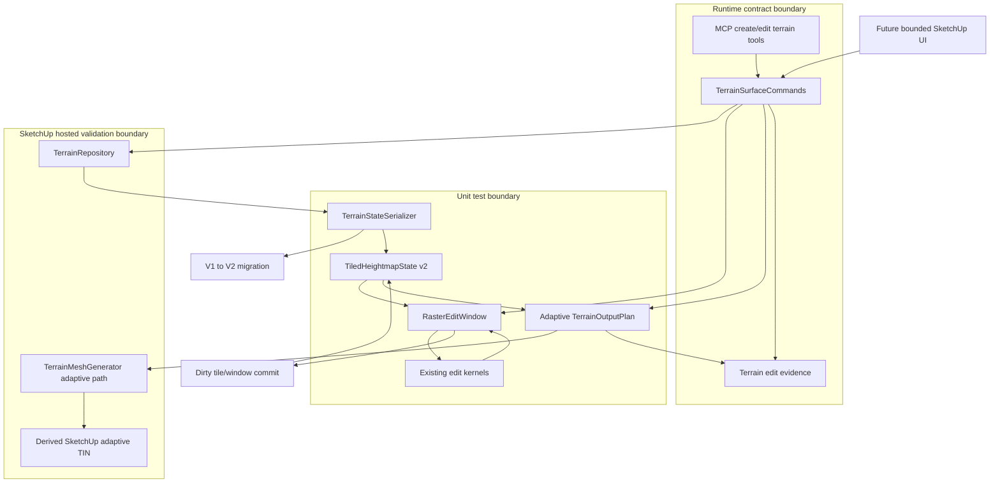

# Technical Plan: MTA-11 Migrate To Tiled Heightmap V2 With Adaptive Output
**Task ID**: `MTA-11`
**Title**: `Migrate To Tiled Heightmap V2 With Adaptive Output`
**Status**: `finalized`
**Date**: `2026-05-01`

## Source Task

- [Migrate To Tiled Heightmap V2 With Adaptive Output](./task.md)

## Problem Summary

Managed terrain currently stores a uniform `heightmap_grid` v1 payload and regenerates SketchUp mesh output directly from that regular grid. That keeps terrain state authoritative, but it ties representation fidelity and output face count together: finer source spacing increases generated geometry, while coarse source spacing cannot model narrow hardscape-adjacent shoulders, off-grid survey points, or visually graded local terrain without spillover.

The prior localized-detail-zone direction was rejected for this task because it would force edit kernels to reason across coarse, detailed, and coarse-again source regions. MTA-11 instead migrates Managed Terrain Surface state to a tiled heightmap heightfield v2, exposes edits through a bounded uniform raster edit window, and generates adaptive SketchUp TIN output from the tiled source.

Representation and first adaptive output generation must ship together. A v2 terrain state that cannot regenerate usable SketchUp geometry is not a complete Managed Terrain Surface.

## Goals

- Introduce tiled heightmap heightfield v2 as the authoritative terrain state.
- Migrate v1 payloads one way into v2 through the existing serializer migration path.
- Ensure runtime terrain commands receive and persist v2 state only after migration.
- Add a `RasterEditWindow` boundary so edit kernels operate on uniform raster semantics over v2 tiles.
- Preserve existing terrain edit behavior for target height, corridor transition, local fairing, survey point correction, and planar region fit.
- Generate first-slice adaptive SketchUp TIN output from dense v2 source using a bounded deterministic simplifier.
- Keep generated SketchUp geometry disposable and free of durable source-state identity.
- Keep MCP request contracts stable while updating response summaries, docs, and fixtures for adaptive output.

## Non-Goals

- Permanent v1 runtime compatibility or v1 round-trip behavior.
- Localized base/detail-zone overlays or mixed-resolution composite edit windows.
- Adaptive output without v2 source-state migration.
- Dense v2 source state without usable SketchUp output generation.
- Constrained Delaunay, breakline preservation, or global mesh optimization in the first adaptive output pass.
- Public Unreal-style terrain tools or new public terrain edit modes.
- Semantic hardscape mutation or absorption into terrain state.
- Sidecar terrain storage unless model-embedded payload limits are proven unacceptable.

## Related Context

- `specifications/hlds/hld-managed-terrain-surface-authoring.md`
- `specifications/prds/prd-managed-terrain-surface-authoring.md`
- `specifications/domain-analysis.md`
- `specifications/signals/2026-04-30-terrain-session-exposes-local-detail-hardscape-and-identity-gaps.md`
- `specifications/tasks/managed-terrain-surface-authoring/MTA-07-define-scalable-terrain-representation-strategy/task.md`
- `specifications/tasks/managed-terrain-surface-authoring/MTA-10-implement-partial-terrain-output-regeneration/task.md`
- `specifications/tasks/managed-terrain-surface-authoring/MTA-13-implement-survey-point-constraint-terrain-edit/task.md`
- `specifications/tasks/managed-terrain-surface-authoring/MTA-16-implement-narrow-planar-region-fit-terrain-intent/task.md`
- `specifications/tasks/managed-terrain-surface-authoring/MTA-18-define-bounded-managed-terrain-visual-edit-ui/task.md`
- `src/su_mcp/terrain/terrain_state_serializer.rb`
- `src/su_mcp/terrain/terrain_repository.rb`
- `src/su_mcp/terrain/heightmap_state.rb`
- `src/su_mcp/terrain/terrain_mesh_generator.rb`
- `src/su_mcp/terrain/terrain_output_plan.rb`

## Research Summary

- `MTA-07` selected a heightmap-derived scalable direction and captured prior lessons around componentized height data, bounded edit regions, and derived output behavior.
- `MTA-10` proved region-aware output planning and partial output regeneration for regular-grid output, but also showed hosted SketchUp output behavior needs real validation around derived markers, edge cleanup, seams, undo, and save/reopen.
- `MTA-13` and `MTA-16` proved current v1 terrain edits are useful but can honestly refuse or warn when grid spacing cannot represent survey or planar controls.
- Terrain-session feedback showed MCP-only numeric trial-and-error is too slow for local visual grading, but UI ergonomics do not remove the need for higher-fidelity source state.
- Landscape-style terrain editing confirms the relevant architectural pattern: edit APIs read and write bounded height regions into fixed arrays or sparse maps; write paths fan those regions out through owned storage chunks; changed regions update derived runtime data or accumulated dirty state; dirty edit data also uses bounded region access.
- Comparable terrain engines also carry significant host-specific behavior around chunk lookup, missing chunk interpolation, texture-backed source data, rendering synchronization, mips, and collision. Those details are not portable to SketchUp and should not be copied.
- The supported decision remains local to this extension: durable tiled heightmap heightfield state, bounded raster edit windows, explicit dirty tile/window tracking, and disposable SketchUp output regeneration.
- `grok-4.20` debate on kernel integration supported a hybrid decision: kernels should see a logical uniform raster edit-window contract, but that contract must be bounded and tile-backed so it does not allocate unbounded dense buffers.
- `grok-4.20` review of Step 5 decisions reinforced that the existing `TerrainStateSerializer` migration harness should own v1-to-v2 conversion directly instead of adding a separate repository-level migration workflow.

## Technical Decisions

### Data Model

Introduce `TiledHeightmapState` as the v2 terrain state object.

Initial payload posture:

- `payloadKind`: `heightmap_grid`
- `schemaVersion`: `2`
- `units`: `meters`
- `basis`, `origin`, `ownerTransformSignature`: same conceptual owner-local coordinate role as v1
- `spacing`: one terrain-wide source spacing for the Managed Terrain Surface
- `dimensions` or `extents`: total terrain sample dimensions or bounds
- internal tile edge size: one power-of-two tile size in samples
- `tiles`: ordered tile payloads with tile coordinates, dimensions, elevations, and optional per-tile integrity data
- `revision`, `stateId`, `sourceSummary`, `constraintRefs`: preserved terrain identity and lineage fields

Source spacing is terrain-wide in MTA-11. Per-tile spacing, local refinement overlays, and mixed-resolution source sections are out of scope.

The v2 state must expose domain-safe helpers for:

- payload/schema metadata
- terrain-local sample coordinate conversion
- bounds/extents
- tile lookup by sample window
- read/write through `RasterEditWindow`
- state summaries for evidence and output planning

First-slice tile size and source-spacing policy are pinned in the Configuration section so implementation does not defer resource assumptions until command integration.

### API and Interface Design

#### Serializer and Repository

`TerrainStateSerializer` becomes the state-format dispatcher:

- `CURRENT_SCHEMA_VERSION` becomes `2`.
- `migrate_payload` converts v1 `heightmap_grid` payloads into v2 `TiledHeightmapState` payloads.
- `loaded_result` dispatches to the correct state class and returns v2 state for all supported loads after MTA-11.
- V1 payloads are not round-tripped after migration.
- Migration refusal stays in the serializer's existing refusal path where possible.

`TerrainRepository` remains the domain-facing load/save seam. It should not grow tile-specific edit behavior.

#### RasterEditWindow

Add a bounded `RasterEditWindow` contract backed by v2 tiles.

Required behavior:

- exposes terrain-local origin, spacing, dimensions, and owner-local bounds for the edit window
- supports sample read/write by raster row/column and terrain-local `x/y`
- tracks dirty sample bounds
- tracks dirty tile IDs or tile windows
- commits edited samples back to v2 state as one edit result
- can provide compatibility methods needed by existing kernels while the kernels are migrated to the narrower window contract
- refuses before allocation when the requested edit window exceeds `MAX_SAMPLES`

The first implementation should refuse oversized windows rather than auto-chunk. Chunked editing can be planned later if real edits need it.

#### Kernel Integration

Existing edit kernels should consume `RasterEditWindow` or a narrow state-like adapter over it, not raw v2 tiles and not generated output topology.

The plan should preserve current behavior for:

- `target_height`
- `corridor_transition`
- `local_fairing`
- `survey_point_constraint`
- `planar_region_fit`

Kernels must compute target elevations from terrain-local `x/y` and window spacing. Tile boundaries must not change the math of a slope, plane, fairing neighborhood, survey residual, fixed control, or preserve zone.

#### Adaptive Output

Generalize `TerrainOutputPlan` beyond regular-grid output.

The adaptive output path should report:

- `meshType: adaptive_tin`
- source state digest and revision
- source sample spacing
- simplification tolerance
- generated vertex and face counts
- dirty bounds or dirty tile IDs where relevant
- max measured simplification error when available
- seam or boundary check summary

`TerrainMeshGenerator` adds an adaptive path that reads dense v2 source and emits derived SketchUp faces through a deterministic first-slice simplifier. The first algorithm is a quadtree/error-based simplifier with boundary/seam constraints, not Delaunay.

First-slice simplifier behavior:

- Start from the full terrain sample rectangle or dirty source bounds expanded to the output-safe boundary being regenerated.
- For each candidate rectangular cell, fit the cell output surface from its corner heights.
- Measure max absolute height error for source samples inside the cell against the fitted surface.
- Subdivide until max error is within tolerance, minimum output cell size is reached, or max depth is reached.
- Emit accepted leaf cells as deterministic triangle pairs with stable winding and derived-output metadata.
- Balance adjacent leaves so neighboring output cells differ by at most one subdivision level, or split the larger neighbor edge before emission.
- Refuse with `adaptive_output_seam_failed` or `adaptive_output_error_tolerance_exceeded` rather than replacing derived output when tolerance or seam constraints cannot be proven.

### Public Contract Updates

No public terrain edit request-shape changes are planned for MTA-11.

Response and documentation deltas are required:

- terrain output summaries may report `meshType: adaptive_tin` instead of `regular_grid`
- generated `faceCount` and `vertexCount` become output-dependent, not source sample count derived
- output summaries may include source spacing, simplification tolerance, max simplification error, and seam/boundary summary fields
- docs must clarify that terrain source sampling/validation targets the managed heightfield state unless explicitly validating generated SketchUp output
- native contract fixtures must be updated for output-summary response deltas while keeping provider-compatible schema shape

Runtime dispatcher and tool registration should not change unless response-shape tests prove existing contract fixtures need updated examples.

### Error Handling

Add or preserve structured refusals for:

- `terrain_state_migration_failed`
- `unsupported_terrain_state`
- `terrain_edit_window_too_large`
- `terrain_tile_payload_invalid`
- `adaptive_output_generation_failed`
- `adaptive_output_seam_failed`
- `adaptive_output_error_tolerance_exceeded`
- `owner_transform_unsupported`
- `terrain_state_load_failed`
- `terrain_state_save_failed`
- `terrain_output_contains_unsupported_entities`

`adaptive_output_generation_failed` should include a diagnostic category in `details` rather than creating many broad top-level codes for quadtree depth, SketchUp entity creation failure, or builder errors.

Failed migration, edit-window construction, state save, or output generation must not leave the expected steady state as partially migrated terrain with stale derived output.

### State Management

State transition:

```text
v1 payload on load
  -> serializer migration
  -> TiledHeightmapState v2 in memory
  -> RasterEditWindow mutation
  -> dirty tile commit to new v2 state revision
  -> repository save
  -> adaptive output regeneration
  -> evidence/output summary
```

Generated SketchUp mesh is disposable derived output. It must not become source state and must not expose durable face or vertex identifiers in runtime-facing responses.

Unexpected non-derived user content under the terrain owner still refuses before derived output cleanup.

### Integration Points

- `TerrainStateSerializer` integrates v1-to-v2 migration and v2 state dispatch.
- `TerrainRepository` validates owner transform and persists v2 payloads.
- `TerrainSurfaceCommands` loads v2 state, constructs edit windows, invokes kernels, saves v2, regenerates output, and builds evidence.
- Edit kernels integrate through `RasterEditWindow`.
- `TerrainOutputPlan` and `TerrainMeshGenerator` integrate adaptive output summary and generation.
- Runtime native contract tests integrate response summary changes.
- Docs integrate source-heightfield versus generated-output validation guidance.

### Configuration

Initial values should be constants or internal configuration, not public tool parameters unless planning later proves public control is necessary.

Required configuration points:

- v1 migration source spacing policy
- tile size
- maximum serialized v2 payload bytes
- `RasterEditWindow::MAX_SAMPLES`
- adaptive output simplification tolerance
- maximum quadtree depth or minimum output cell size

First-slice defaults and guardrails:

- v1 migration preserves source spacing and elevations; it must not invent finer detail during migration.
- New v2 terrain creation/adoption uses the requested or sampled source spacing; default densification beyond existing request/adoption semantics is a follow-on product decision unless separately specified.
- Initial tile size: `128x128` samples.
- Initial `RasterEditWindow::MAX_SAMPLES`: `262_144` samples.
- Initial serialized v2 payload threshold: inherit the `8 MiB` model-embedded payload guardrail from the terrain storage foundation unless implementation evidence justifies a stricter threshold.
- Initial adaptive output tolerance and min output cell size must be constants, included in summaries, and pinned by tests before command integration.

If these defaults cannot satisfy representative fixtures, implementation must stop and record drift rather than silently widening the task into sidecar storage, chunked edit execution, Delaunay output, or partial adaptive regeneration.

## Architecture Context



## Key Relationships

- `TiledHeightmapState` owns durable source samples; `TerrainMeshGenerator` owns disposable derived output.
- `RasterEditWindow` hides tile layout from terrain kernels while making edit-window size and dirty tile tracking explicit.
- `TerrainStateSerializer` owns v1-to-v2 migration; repository callers should not branch on v1 after MTA-11.
- `TerrainOutputPlan` must carry adaptive-output metadata instead of deriving face/vertex counts from regular-grid dimensions.
- MCP tools keep stable request shapes; response examples and docs must track output summary changes.
- `MTA-18` visual UI planning should benefit from the uniform raster edit substrate, but no UI implementation belongs in MTA-11.
- Landscape-style source patterns reinforce the edit-window and dirty-region shape, but they do not introduce external runtime dependencies or change SketchUp extension ownership boundaries.

## Acceptance Criteria

- Serializer loads supported v1 terrain payloads by migrating them into v2 tiled heightmap heightfield state.
- Repository callers do not receive editable v1 `HeightmapState` after MTA-11.
- V2 state serializes, deserializes, validates integrity, and reports deterministic summaries.
- V1 terrain state is not required to round-trip after migration.
- Terrain edit commands create, load, edit, save, and regenerate v2 terrain without exposing raw SketchUp objects or generated face/vertex identity.
- Existing terrain edit modes retain terrain-local mathematical behavior through `RasterEditWindow`.
- `RasterEditWindow` supports row/column and terrain-local sample access, dirty bounds, dirty tile IDs, and commit to v2 state.
- `RasterEditWindow` refuses oversized edit windows before large allocation.
- Cross-tile edits produce the same expected terrain math as equivalent single-window edits.
- Cross-tile edit fixtures match equivalent single-window reference output within `1e-6m` for target height, corridor transition, local fairing, survey correction, and planar region fit where those modes are supported.
- Dirty tile/window summaries identify every tile touched by a cross-tile edit and do not report untouched tiles as dirty.
- Adaptive output generation creates derived SketchUp geometry from v2 heightfield source, not prior generated mesh.
- Adaptive output reports `adaptive_tin` summary fields and simplification evidence.
- Representative flat or planar terrain simplifies to materially fewer output faces than dense-grid output while staying within tolerance.
- Locally detailed or high-error terrain retains enough output detail to satisfy simplification tolerance.
- Adaptive output validates tile boundary/seam behavior and refuses or reports structured failure when correctness cannot be guaranteed.
- Adaptive seam fixtures prove a plane crossing two or more source tiles generates watertight derived output with no measured gap greater than `1e-6m` and no known T-junctions before output replacement is accepted.
- Public edit request schemas do not change in the first v2 pass.
- Public response-summary additions remain backward-compatible: existing clients that ignore unknown summary fields keep parsing, and native contract tests cover both old regular-grid summaries and new adaptive summaries where compatibility is expected.
- Docs and native contract fixtures are updated for output-summary deltas.
- Existing output/entity safety rules remain intact.
- Mutating edit commands preserve coherent SketchUp undo behavior where practical across state save and adaptive output regeneration.
- Hosted validation covers at least one v1-to-v2 migration, one public edit, one adaptive output regeneration, owner metadata preservation, one SketchUp undo restoring the pre-migration state where practical, and output face-count/error evidence.
- Save/reopen hosted validation after migration and output regeneration loads v2 directly, does not re-run v1 migration, preserves `ownerTransformSignature`, and leaves no orphan v1-derived output entities under the owner.
- External terrain-engine patterns are advisory architecture evidence only; implementation acceptance remains based on local repository tests and SketchUp-hosted validation.

## Test Strategy

### TDD Approach

Implement from storage outward, with failing tests for each seam before integration:

1. v2 state normalization and serialization tests.
2. v1-to-v2 serializer migration tests.
3. `RasterEditWindow` sample access, dirty tracking, and cap/refusal tests.
4. edit-kernel behavior through raster windows, including cross-tile fixtures.
5. adaptive output plan and simplifier tests with measurable error bounds.
6. command integration tests for load/edit/save/regenerate/evidence.
7. native contract and docs parity updates.
8. hosted SketchUp smoke for persistence, output, undo, and owner safety.

### Required Test Coverage

- `test/terrain/terrain_state_serializer_test.rb`: v1 migration to v2, v2 serialization, corrupt payload, unsupported version, migration refusal.
- New v2 state tests: tile normalization, tile dimensions, source spacing, summaries, integrity, owner transform fields, serialized byte summaries, and representative under-threshold payload fixture.
- New raster edit window tests: bounds conversion, row/column and `x/y` access, dirty sample bounds, dirty tile IDs, commit behavior, `MAX_SAMPLES` refusal.
- Existing edit-kernel tests: add v2/raster-window variants for target height, corridor transition, local fairing, survey correction, and planar region fit with `1e-6m` cross-tile equivalence checks against single-window references.
- Cross-tile edit tests: slope or planar edit across tile boundary, fairing near tile boundary, preserve/fixed controls near tile boundary.
- `test/terrain/terrain_output_plan_test.rb`: adaptive plan summary and dirty tile/window metadata.
- `test/terrain/terrain_mesh_generator_test.rb`: adaptive simplification, planar face-count reduction, high-error retention, seam/boundary failure, no-gap seam fixture, T-junction guard fixture where detectable, and refusal when error tolerance cannot be met.
- `test/terrain/terrain_surface_commands_test.rb`: repository load migrates v1, edit saves v2, output summary reports `adaptive_tin`.
- `test/runtime/native/mcp_runtime_native_contract_test.rb` and `test/support/native_runtime_contract_cases.json`: output-summary response deltas remain provider-compatible, old summary fixtures still parse where compatibility is expected, and new adaptive fields do not require public request-schema changes.
- Hosted smoke: migrated terrain edit and adaptive output generation inside SketchUp with owner metadata preservation, undo behavior where practical, save/reopen loading v2 directly, no duplicate migration, and no orphan v1-derived output.

## Instrumentation and Operational Signals

- v2 source spacing
- tile size and tile count
- serialized payload bytes and payload threshold
- edit-window sample count
- dirty sample bounds and dirty tile count
- adaptive output simplification tolerance
- adaptive output leaf count and max subdivision depth
- generated vertex and face counts
- max simplification error
- seam/boundary validation result
- migration source schema and destination schema
- output generation elapsed time in hosted validation where practical

## Implementation Phases

1. **V2 state and serializer migration**
   - Add `TiledHeightmapState`.
   - Add serializer dispatch for v2.
   - Implement v1-to-v2 migration inside `TerrainStateSerializer#migrate_payload`.
   - Pin `128x128` tiles, `262_144` edit-window sample cap, serialized byte summaries, and payload threshold tests before command integration.
   - Update repository tests to prove load returns v2.

2. **Raster edit window**
   - Add `RasterEditWindow`.
   - Implement sample access, dirty tracking, dirty tile tracking, commit, and `MAX_SAMPLES` refusal.
   - Add unit tests before routing command edits through it.

3. **Kernel integration**
   - Route each existing edit mode through raster-window state semantics.
   - Preserve behavior with current edit fixtures and add cross-tile fixtures.
   - Keep kernels independent of raw tiles and generated output.

4. **Adaptive output plan and simplifier**
   - Generalize `TerrainOutputPlan`.
   - Implement deterministic quadtree/error-based adaptive output planning using corner-fit error checks, recursive subdivision, neighbor balancing, and refusal when tolerance or seams cannot be proven.
   - Add simplification error, planar reduction, high-error retention, no-gap seam, and T-junction guard tests before SketchUp output replacement.

5. **SketchUp output generation**
   - Add adaptive generation path to `TerrainMeshGenerator`.
   - Preserve derived output markers and owner cleanup rules.
   - Validate generated face counts, normals, and boundary behavior.

6. **Command, evidence, and contract integration**
   - Update terrain commands to save v2 and emit adaptive output summaries.
   - Update evidence builder and native contract fixtures for response deltas.
   - Keep request schemas stable.

7. **Docs and hosted validation**
   - Update docs for adaptive output and source-heightfield validation guidance.
   - Run hosted smoke for migration, edit, adaptive output, undo, save/reopen, no re-migration, no orphan v1 output, and owner metadata preservation.

## Rollout Approach

- Treat MTA-11 as a one-way representation migration. Do not keep v1 edit behavior as an active runtime branch.
- Keep public edit request contracts unchanged for the first v2 pass.
- Use conservative defaults and hard refusals before memory-heavy edit windows or unsafe adaptive output.
- Prefer full adaptive regeneration for the first v2 output path unless hosted validation proves it infeasible. Partial adaptive regeneration can be planned later.
- Preserve full command rollback/abort semantics around failed save or output generation.
- Do not replace derived output after migration unless v2 save and adaptive output validation both succeed; otherwise leave the command in a structured refusal state without mixed v1/v2 output ownership.

## Risks and Controls

- **Migration corrupts or weakens existing terrain state**: implement migration in serializer tests first; include v1 fixture migration and corrupt/unsupported refusal cases.
- **V2 payload exceeds model-embedded storage limits**: inherit the `8 MiB` guardrail, expose serialized bytes, include representative under-threshold and over-threshold fixtures, and refuse before save when exceeded.
- **Edit-window memory spikes on dense terrain**: enforce `MAX_SAMPLES` before allocation; refuse oversized windows before mutation.
- **Kernel behavior drifts during raster-window migration**: run existing kernel tests against v2/raster-window fixtures and add cross-tile equivalence tests.
- **Adaptive simplifier hides terrain detail**: validate max height error against tiled source and retain high-error regions.
- **Adaptive output creates cracks or T-junctions at tile boundaries**: add seam/boundary validation and refuse unsafe output before replacing derived geometry.
- **SketchUp generated geometry behaves differently than fake tests**: require hosted smoke for adaptive output, markers, cleanup, owner metadata, and undo.
- **Migration/output is not atomic in the host**: hosted validation must cover migrate-edit-regenerate, undo, save/reopen, no re-migration, and no orphan derived output before the task can close.
- **Response contract drift surprises MCP clients**: keep request schemas stable; update native fixtures, docs, and examples for response summary deltas.
- **Face-count reduction fails to materialize**: include planar terrain fixture proving generated output is materially smaller than dense-grid output within tolerance.
- **Partial regeneration complexity leaks into first v2**: default to full adaptive regeneration and defer partial adaptive regeneration unless hosted evidence requires it.
- **Overfitting to external terrain-engine internals**: keep external-engine language advisory rather than normative; do not copy texture, mip, collision, rendering synchronization, or missing-chunk interpolation behavior into the SketchUp extension unless local requirements independently demand it.

## Dependencies

- `MTA-07`
- `MTA-09`
- `MTA-10`
- `MTA-13`
- `MTA-16`
- `specifications/hlds/hld-managed-terrain-surface-authoring.md`
- `specifications/prds/prd-managed-terrain-surface-authoring.md`
- `specifications/domain-analysis.md`
- `specifications/guidelines/sketchup-extension-development-guidance.md`
- Existing terrain serializer, repository, command, kernel, output, evidence, and native contract test suites under `test/terrain/` and `test/runtime/native/`
- External terrain-engine pattern findings from Step 6-7 confirmation.

## Premortem Gate

Status: PASS

### Unresolved Tigers

- None.

### Plan Changes Caused By Premortem

- Pinned first-slice resource guardrails: v1 migration preserves source spacing, tile size starts at `128x128`, `RasterEditWindow::MAX_SAMPLES` starts at `262_144`, and serialized v2 payloads inherit the `8 MiB` model-embedded storage guardrail.
- Replaced the vague adaptive-output direction with a concrete quadtree/error simplifier shape: corner-fit error checks, recursive subdivision, neighbor balancing, deterministic triangle emission, and refusal when tolerance or seams cannot be proven.
- Strengthened hosted validation around migration atomicity: undo, save/reopen, direct v2 load, no duplicate migration, preserved owner transform signature, and no orphan v1-derived output.
- Made seam, contract, and cross-tile kernel validation falsifiable with `1e-6m` equivalence/gap targets and compatibility fixture requirements.

### Accepted Residual Risks

- Risk: first-slice quadtree simplification may be less compact than Delaunay or breakline-aware output.
  - Class: Paper Tiger
  - Why accepted: the task goal is a bounded first adaptive output, not optimal terrain meshing.
  - Required validation: planar face-count reduction, high-error retention, max error summary, and seam fixtures must pass before hosted validation.
- Risk: full adaptive regeneration may be too slow for some dense terrains.
  - Class: Elephant
  - Why accepted: partial adaptive regeneration is explicitly deferred to avoid mixing output-region complexity into v2 correctness.
  - Required validation: hosted output timing must be recorded; performance failure records drift or follow-on work rather than silently adding partial adaptive regeneration.
- Risk: default dense spacing policy may need product refinement for future UI workflows.
  - Class: Paper Tiger
  - Why accepted: MTA-11 migration must not invent terrain detail; future UI/MCP defaults can choose denser creation/adoption spacing once storage and output guardrails are proven.
  - Required validation: v1 migration preserves existing spacing, new v2 creation/adoption reports source spacing, and docs distinguish source spacing from output simplification tolerance.

### Carried Validation Items

- Representative v2 payload-size fixture under the inherited storage threshold and an over-threshold refusal fixture.
- Cross-tile edit equivalence fixtures for every existing edit kernel routed through `RasterEditWindow`.
- Adaptive no-gap/no-known-T-junction seam fixture and max-error fixtures.
- Native contract fixtures proving adaptive response-summary additions remain compatible without request-shape changes.
- Hosted migration/edit/regenerate smoke with undo, save/reopen, no re-migration, no orphan v1 output, owner metadata preservation, face-count evidence, max-error evidence, and timing.

### Implementation Guardrails

- Do not keep an editable v1 runtime branch after migration.
- Do not silently upsample v1 terrain during migration.
- Do not expose raw storage tiles, generated face IDs, or generated vertex IDs through public responses.
- Do not widen public edit request schemas in MTA-11.
- Do not adopt Delaunay, breaklines, sidecar storage, chunked edit execution, or partial adaptive regeneration without recording drift and revising the plan.
- Do not replace derived SketchUp output unless v2 state save and adaptive output validation succeed.

## Quality Checks

- [x] All required inputs validated
- [x] Problem statement documented
- [x] Goals and non-goals documented
- [x] Research summary documented
- [x] Technical decisions included
- [x] Architecture context included
- [x] Acceptance criteria included
- [x] Test requirements specified
- [x] Instrumentation and operational signals defined when needed
- [x] Risks and dependencies documented
- [x] Rollout approach documented when needed
- [x] Small reversible phases defined
- [x] Premortem completed with falsifiable failure paths and mitigations
- [x] Planning-stage size estimate considered before premortem finalization
