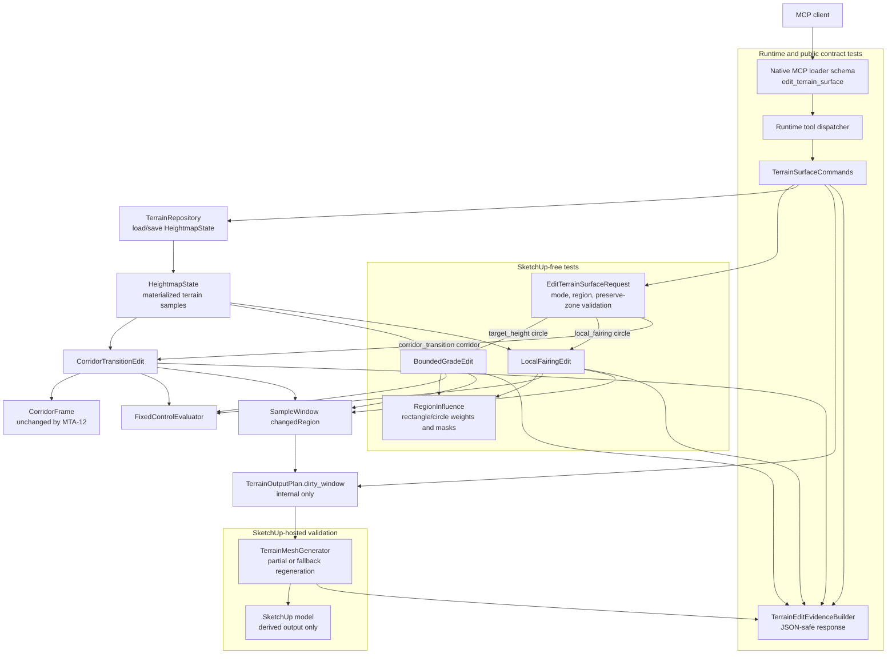

# Technical Plan: MTA-12 Add Circular Terrain Regions And Preserve Zones
**Task ID**: `MTA-12`
**Title**: `Add Circular Terrain Regions And Preserve Zones`
**Status**: `finalized`
**Date**: `2026-04-26`

## Source Task

- [Add Circular Terrain Regions And Preserve Zones](./task.md)

## Problem Summary

Managed terrain editing supports rectangle bounded grade edits, corridor transitions, and the MTA-06 local fairing baseline. Radial terrain authoring cases such as retained trees, planting islands, mounds, depressions, and localized cleanup still require awkward rectangle approximations. This task adds circular edit regions and circular preserve zones to the existing `edit_terrain_surface` command while preserving the managed terrain state, output regeneration, undo, refusal, and JSON-safe evidence contracts.

## Goals

- Support `region.type: "circle"` for `operation.mode: "target_height"`.
- Support `region.type: "circle"` for `operation.mode: "local_fairing"`.
- Support `constraints.preserveZones[].type: "circle"` for `target_height` and `local_fairing`.
- Keep `corridor_transition` limited to `region.type: "corridor"` and rectangle preserve zones.
- Keep the public response shape stable except for normalized request echoes that may now include circle regions.
- Keep terrain edits state-driven over materialized `HeightmapState`; do not mutate live SketchUp TIN geometry as source state.
- Keep loader schema, runtime validation, finite refusals, native contract fixtures, README examples, and tests synchronized.

## Non-Goals

- Do not add polygon, freeform, brush, or sculpting region vocabulary.
- Do not add circular edit regions to `corridor_transition`.
- Do not add circular preserve zones to `corridor_transition` in this task.
- Do not add survey-point constraints or representation-v2 localized detail zones.
- Do not expose dirty windows, partial/full regeneration strategy, generated face IDs, vertex IDs, or internal output ownership metadata.
- Do not change persisted terrain state schema or managed hardscape object semantics.

## Related Context

- [Managed Terrain Surface Authoring HLD](specifications/hlds/hld-managed-terrain-surface-authoring.md)
- [PRD: Managed Terrain Surface Authoring](specifications/prds/prd-managed-terrain-surface-authoring.md)
- [MCP Tool Authoring Standard for SketchUp Modeling](specifications/guidelines/mcp-tool-authoring-sketchup.md)
- [Ruby Coding Guidelines](specifications/guidelines/ryby-coding-guidelines.md)
- [SketchUp Extension Development Guidance](specifications/guidelines/sketchup-extension-development-guidance.md)
- [MTA-04 bounded grade edit](specifications/tasks/managed-terrain-surface-authoring/MTA-04-implement-bounded-grade-edit-mvp/task.md)
- [MTA-05 corridor transition kernel](specifications/tasks/managed-terrain-surface-authoring/MTA-05-implement-corridor-transition-terrain-kernel/task.md)
- [MTA-06 local terrain fairing kernel](specifications/tasks/managed-terrain-surface-authoring/MTA-06-implement-local-terrain-fairing-kernel/task.md)
- [MTA-10 partial terrain output regeneration](specifications/tasks/managed-terrain-surface-authoring/MTA-10-implement-partial-terrain-output-regeneration/task.md)

## Research Summary

- MTA-04 is the strongest calibrated analog for public terrain edit contract, target-height kernel behavior, preserve zones, state save, output regeneration, undo, and evidence. Its actual failure modes were hosted SketchUp output invariants, coordinate semantics, face winding, and proof burden rather than the rectangle edit math alone.
- MTA-05 is the closest analog for extending the edit vocabulary. It showed that schema, validator, finite refusals, docs, fixtures, kernel tests, and live numeric edge checks must move together. Its live bug was exact endpoint inclusion on adopted non-zero-origin/fractional-spacing terrain.
- MTA-06 establishes `local_fairing` as a rectangle-only mode on the same public tool, with square sample-neighborhood fairing and residual evidence. MTA-12 should change candidate selection and influence weighting for circle regions, not the fairing neighborhood kernel.
- MTA-10 means circle edits should continue to emit `changedRegion` diagnostics and let the existing output layer choose partial replacement or full fallback internally. MTA-12 must not leak output strategy vocabulary.
- Targeted Unreal Engine Landscape source review found useful circle brush semantics: Euclidean distance from center, full-strength inner radius, additional falloff band, linear falloff, and smoothstep `y * y * (3 - 2 * y)`. The public MCP contract should keep the existing meter-based `blend.distance` model rather than UE's UI falloff fraction.
- Grok-4.20 challenged the proposed shape and found no blocking issue. Adopted refinements: preserve-zone schema should no longer require `bounds`; runtime validation should enforce rectangle-vs-circle preserve-zone required fields; circular preserve zones should remain unsupported for `corridor_transition`; shared region math should normalize string/symbol coordinate keys.

## Technical Decisions

### Data Model

- Persisted terrain state remains the existing `heightmap_grid` model.
- A circle is request-time terrain-domain geometry, not persisted terrain metadata.
- Circle coordinates are expressed in the stored terrain state's public-meter XY frame:
  - `center.x`
  - `center.y`
  - `radius`
- Circle edit regions reuse existing `region.blend`:
  - `blend.distance` is an additional outer falloff band in public meters.
  - `blend.falloff` remains one of `none`, `linear`, or `smooth`.
- Circular preserve zones do not have blend. They are hard masks that protect overlapping samples.
- Preserve-zone membership for circle must account for terrain sample footprint like the existing rectangle path. Treat a sample as protected when the sample point is within `radius + footprintExpansion`, where `footprintExpansion = sqrt((spacing.x / 2.0)^2 + (spacing.y / 2.0)^2)`. This is the circle analog of rectangle preserve-zone bounds expanded by half spacing on each axis.

### API and Interface Design

Add `circle` to the existing `edit_terrain_surface` region vocabulary:

```json
{
  "region": {
    "type": "circle",
    "center": { "x": 10.0, "y": 12.0 },
    "radius": 3.0,
    "blend": { "distance": 1.5, "falloff": "smooth" }
  }
}
```

Add `circle` to the preserve-zone vocabulary for supported local-area modes:

```json
{
  "constraints": {
    "preserveZones": [
      {
        "id": "tree-01",
        "type": "circle",
        "center": { "x": 10.0, "y": 12.0 },
        "radius": 2.0
      }
    ]
  }
}
```

Supported region pairings:

```ruby
SUPPORTED_REGION_TYPES_BY_MODE = {
  'target_height' => %w[rectangle circle],
  'local_fairing' => %w[rectangle circle],
  'corridor_transition' => %w[corridor]
}
```

Supported preserve-zone pairings:

```ruby
SUPPORTED_PRESERVE_ZONE_TYPES_BY_MODE = {
  'target_height' => %w[rectangle circle],
  'local_fairing' => %w[rectangle circle],
  'corridor_transition' => %w[rectangle]
}
```

Circle edit influence formula:

```text
d = sqrt((sample_x - center_x)^2 + (sample_y - center_y)^2)

if d <= radius:
  weight = 1.0
elsif blend.distance <= 0.0 or blend.falloff == "none":
  weight = 0.0
elsif d >= radius + blend.distance:
  weight = 0.0
else:
  y = 1.0 - ((d - radius) / blend.distance)

  if blend.falloff == "linear":
    weight = y

  if blend.falloff == "smooth":
    weight = y * y * (3.0 - (2.0 * y))
```

Implementation should introduce a small SketchUp-free terrain-domain helper, tentatively `SU_MCP::Terrain::RegionInfluence`, that owns:

- rectangle influence parity with existing behavior;
- circle influence formula;
- rectangle and circle preserve-zone membership;
- coordinate key normalization for string-keyed and symbol-keyed point hashes.

`BoundedGradeEdit` and `LocalFairingEdit` should use this helper for region weights and preserve masks. Kernels still own operation-specific elevation changes, diagnostics, fixed-control evaluation, no-data refusal, no-effect refusal, and changed-region derivation.

### Public Contract Updates

Request deltas:

- Add `circle` to supported region types.
- Add `circle` to supported preserve-zone types.
- Add region fields:
  - `center`
  - `radius`
- Add preserve-zone fields:
  - `center`
  - `radius`
- Keep `bounds` for rectangles and corridor fields for corridors.
- Keep `operation.required` as `["mode"]`; runtime validation remains responsible for mode-specific and type-specific required fields.

Response deltas:

- No new public response section is added.
- Existing normalized operation/region echo may include `type: "circle"`, `center`, `radius`, and defaulted `blend`.
- Existing `evidence.preserveZones.protectedSampleCount` remains the preserve-zone evidence for rectangle and circle zones.
- Existing `evidence.fairing` remains unchanged for local fairing.
- Public output must not expose internal dirty windows, output strategy, generated face IDs, vertex IDs, or derived ownership metadata.

Schema and registration updates:

- Update native tool description to mention `target_height` and `local_fairing` circle regions.
- Update `edit_terrain_region_schema` to include `center` and `radius`.
- Update preserve-zone schema so `required` is only `["type"]`, with `bounds`, `center`, and `radius` present as optional schema properties and runtime validation enforcing the exact required set by `type`.
- Keep the schema provider-compatible: no top-level `oneOf`, `anyOf`, `allOf`, `not`, or root enum.

Dispatcher and routing updates:

- No new public tool registration.
- No dispatcher route change is expected.
- `TerrainSurfaceCommands` should continue dispatching by `operation.mode`: `target_height` to bounded grade, `local_fairing` to fairing, `corridor_transition` to corridor.

Contract, docs, and examples:

- Update native loader tests for region and preserve-zone enum values, `center`, `radius`, and preserve-zone requiredness.
- Update native contract fixtures for target-height circle success, local-fairing circle success, circle preserve-zone protection, malformed circle fields, and unsupported circle combinations.
- Update README operation matrix and terrain edit description.
- Add at least one target-height circle example and one circular preserve-zone example.

### Error Handling

- Missing `region.center` for circle returns `missing_required_field` with `details.field: "region.center"`.
- Missing `region.radius` for circle returns `missing_required_field` with `details.field: "region.radius"`.
- Invalid `region.center` shape returns `invalid_edit_request`.
- Invalid `region.center.x` or `region.center.y` returns `invalid_edit_request`.
- Invalid or non-positive `region.radius` returns `invalid_edit_request`.
- Missing or invalid preserve-zone circle fields return equivalent `constraints.preserveZones[n].center`, `.center.x`, `.center.y`, or `.radius` field details.
- Unsupported region/mode pairs return `unsupported_option` on `region.type` with finite mode-specific `allowedValues`.
- Unsupported preserve-zone type for the operation mode returns `unsupported_option` on `constraints.preserveZones[n].type` with finite mode-specific `allowedValues`.
- Existing no-data, no-affected-samples, fairing-no-effect, fixed-control-conflict, unsafe-output, and target-resolution refusals remain unchanged.
- Refusals must happen before state save, output mutation, or model operation side effects where the current command flow already supports that.

### State Management

- Successful target-height and local-fairing circle edits create a new `HeightmapState` revision through the existing repository save path.
- Refused requests must not save state or mutate derived terrain output.
- Output regeneration remains disposable derived output from state.
- Undo behavior remains one coherent SketchUp operation covering state metadata and derived output.
- No circle-specific state is persisted outside the changed elevations and normal terrain state summary.

### Integration Points

- `EditTerrainSurfaceRequest` owns public request validation, finite option refusals, and normalization.
- `RegionInfluence` owns SketchUp-free region/preserve-zone math.
- `BoundedGradeEdit` owns target-height elevation updates and diagnostics.
- `LocalFairingEdit` owns local fairing elevation updates, fairing metric evidence, and no-effect behavior.
- `FixedControlEvaluator` remains the fixed-control conflict/evidence seam.
- `SampleWindow` remains the changed-region vocabulary used by output planning.
- `TerrainSurfaceCommands` owns target resolution, state load/save, model operation boundaries, editor dispatch, output planning, output regeneration, and response assembly.
- `TerrainMeshGenerator` remains the SketchUp derived-output mutation boundary.
- `TerrainEditEvidenceBuilder` shapes JSON-safe success evidence.

### Configuration

- No environment or user configuration is added.
- Circle behavior is controlled per request by `center`, `radius`, and optional `blend`.
- Boundary tolerance is an internal implementation constant covered by tests and not a public option.

## Architecture Context



## Key Relationships

- Public tool shape remains one `edit_terrain_surface` surface with discriminated `region.type` and runtime mode/type validation.
- Circle and rectangle influence math should be shared so target-height and local-fairing cannot drift.
- Circle local fairing changes candidate selection and blend weight only; the MTA-06 square sample-neighborhood smoothing kernel remains unchanged.
- Circle preserve zones are hard masks, not blended masks.
- Output regeneration receives only changed-region intent and remains free to use partial replacement or full fallback internally.

## Acceptance Criteria

- `target_height` requests with `region.type: "circle"` update stored terrain samples inside the full-strength circle to the target elevation and apply documented blend weights in the outer falloff band.
- `target_height` circle edits leave samples outside `radius + blend.distance` unchanged within test tolerance.
- `local_fairing` requests with `region.type: "circle"` fair only positive-weight circular candidates while preserving the existing fairing residual evidence shape.
- Local fairing's neighborhood averaging remains the existing sample-radius kernel; circle controls influence/candidate weighting, not the neighborhood shape.
- Circle preserve zones protect affected samples for both `target_height` and `local_fairing`; protected samples remain unchanged within documented tolerance.
- Rectangle region and rectangle preserve-zone behavior remains unchanged by the shared helper adoption.
- `corridor_transition` with `region.type: "circle"` refuses with finite mode-specific `allowedValues`.
- Circle preserve zones with `corridor_transition` refuse with finite mode-specific `allowedValues`.
- Missing, malformed, non-finite, or non-positive circle fields return structured refusals without mutation.
- Native loader schema, contract fixtures, README operation matrix, README examples, and runtime validation advertise the same supported circle combinations.
- Successful circle edits continue to return JSON-safe evidence without raw SketchUp objects, output strategy, dirty windows, face IDs, or vertex IDs.
- Hosted validation covers at least one target-height circle edit, one local-fairing circle edit, circular preserve-zone protection, unsupported circle refusal, undo, and derived-output coherence where practical.

## Test Strategy

### TDD Approach

Start with public contract and helper tests before production changes:

1. Add failing validator and loader-schema tests for circle regions and preserve zones.
2. Add failing `RegionInfluence` tests for rectangle parity and circle formulas.
3. Wire kernels to the helper and make target-height/local-fairing circle tests pass.
4. Add command, contract fixture, README, and no-leak tests.
5. Run hosted validation after automated tests pass.

### Required Test Coverage

- Request validation:
  - accepts target-height circle;
  - accepts local-fairing circle;
  - accepts circular preserve zones for target-height and local-fairing;
  - refuses circle region for corridor transition;
  - refuses circular preserve zone for corridor transition;
  - refuses missing or invalid `center` and `radius`;
  - preserves finite `allowedValues` behavior.
- Region helper:
  - rectangle weight parity with existing tests;
  - circle center full weight;
  - exact radius full weight;
  - linear and smooth blend shoulder;
  - exact outer boundary zero weight;
  - outside zero weight;
  - rectangle and circle preserve membership with half-spacing expansion;
  - string-keyed and symbol-keyed coordinate compatibility.
- Kernels:
  - target-height circle updates intended samples and leaves outside unchanged;
  - local-fairing circle improves residual on a representative noisy patch;
  - circle preserve zones protect samples in both modes;
  - no-affected-samples refusals remain correct.
- Runtime and contract:
  - command flow passes circle changed-region diagnostics to output planning;
  - native loader schema exposes circle fields and no invalid preserve-zone requiredness;
  - native contract fixtures cover success/refusal shapes;
  - contract stability tests prove no internal output vocabulary leaks.
- Docs:
  - README matrix and examples match validator/schema behavior.
- Hosted:
  - public MCP target-height circle edit on non-zero-origin or fractional-spacing terrain;
  - public MCP local-fairing circle edit with fairing evidence;
  - circular preserve-zone protection;
  - unsupported circle combination refusal before mutation;
  - undo restores state/output;
  - output normals, markers, and digest linkage remain coherent.

## Instrumentation and Operational Signals

- Use existing response evidence:
  - `changedSampleCount`
  - `changedRegion`
  - sample evidence when requested
  - `evidence.preserveZones.protectedSampleCount`
  - `evidence.fairing` residual values for local fairing
  - `output.derivedMesh` summary
  - `warnings`
- Hosted validation may use greybox inspection only as validation evidence; no greybox telemetry becomes public output.

## Implementation Phases

1. Contract skeleton:
   - add failing validator tests;
   - add failing loader-schema tests;
   - add fixture expectations for circle success/refusal cases.
2. Region helper:
   - add `RegionInfluence` with rectangle parity tests;
   - add circle weight and preserve-membership tests;
   - avoid SketchUp API usage.
3. Kernel adoption:
   - migrate `BoundedGradeEdit` to helper;
   - migrate `LocalFairingEdit` to helper;
   - add target-height and fairing circle behavior tests.
4. Public integration:
   - update loader schema, native fixtures, contract stability tests, and README;
   - keep response shape stable.
5. Validation closeout:
   - run focused terrain tests, native contract tests, full Ruby tests, RuboCop, package verification, and diff hygiene;
   - run or record hosted SketchUp validation.

## Rollout Approach

- Ship circle support as a normal extension runtime update to the existing `edit_terrain_surface` tool.
- No data migration or feature flag is required.
- Existing rectangle and corridor requests remain valid.
- Unsupported combinations refuse rather than silently falling back to rectangle approximations.

## Risks and Controls

- Public contract drift: update validator constants, loader schema, native fixtures, README, and contract tests in the same change.
- Schema requiredness drift: preserve-zone schema must not require `bounds` once circle zones exist; runtime validation must own type-specific required fields.
- Numeric boundary errors: test exact radius, exact outer blend boundary, non-zero terrain origin, and fractional spacing; include hosted validation where practical.
- Rectangle regression from helper extraction: create rectangle parity tests before migrating kernels.
- Fairing semantic confusion: document and test that circle affects candidate influence while the neighborhood kernel remains square sample-radius based.
- Preserve-zone underprotection: implement and test half-spacing expansion for circle membership.
- Host output assumptions: validate undo, output markers/normals/digest, and unsupported-child refusal through hosted smoke where practical.
- Scope creep into corridor/polygon/brush behavior: keep unsupported combinations explicit and covered by tests.

## Dependencies

- Completed MTA-04 target-height bounded edit baseline.
- Landed MTA-06 local fairing baseline.
- Completed MTA-10 output regeneration and dirty-window behavior.
- Managed terrain HLD and PRD.
- MCP authoring guide for schema/provider compatibility.
- SketchUp runtime access for hosted validation.

## Premortem Gate

Status: PASS

### Unresolved Tigers

- None.

### Plan Changes Caused By Premortem

- Made circular preserve-zone sample-footprint expansion formula explicit with `sqrt((spacing.x / 2.0)^2 + (spacing.y / 2.0)^2)` so implementers do not choose inconsistent point-only or axis-only protection semantics.
- Kept preserve-zone schema requiredness as a named contract-drift guard because a stale `required: ["type", "bounds"]` schema would make valid circle preserve zones appear invalid to clients.
- Kept non-zero-origin and fractional-spacing hosted checks as carried validation because calibrated MTA-05 evidence showed local math tests can miss boundary behavior visible through public MCP usage.

### Accepted Residual Risks

- Risk: Hosted validation may find a numeric boundary defect despite formula-level unit tests.
  - Class: Paper Tiger
  - Why accepted: Prior MTA terrain tasks show these defects are usually contained to helper tolerance or boundary tests, not architecture.
  - Required validation: Public MCP hosted smoke on non-zero-origin or fractional-spacing terrain for target-height circle, local-fairing circle, and circle preserve-zone protection.
- Risk: Consumers may want circle preserve-zone counts broken down by zone rather than aggregate `protectedSampleCount`.
  - Class: Paper Tiger
  - Why accepted: Existing rectangle evidence uses aggregate preserve-zone evidence and task scope explicitly preserves response shape.
  - Required validation: Contract and README examples must show the stable aggregate evidence shape; any per-zone evidence should be a later task.
- Risk: Future corridor workflows may want circular preserve zones.
  - Class: Elephant
  - Why accepted: The task explicitly limits circular preserve zones to local-area edit modes, and adding corridor support would widen behavior and validation beyond MTA-12.
  - Required validation: `corridor_transition` plus circular preserve zone must refuse with finite mode-specific `allowedValues`.

### Carried Validation Items

- Validate schema, validator, native fixtures, README examples, and contract stability in the same implementation change.
- Run rectangle parity tests before and after migrating kernels to `RegionInfluence`.
- Run circle formula tests at center, exact radius, blend shoulder, exact outer boundary, outside, and smoothstep falloff.
- Run hosted public MCP checks for target-height circle, local-fairing circle, circular preserve zone, unsupported corridor circle refusal, undo, and derived-output coherence where practical.

### Implementation Guardrails

- Do not add top-level schema composition such as `oneOf` or `anyOf`.
- Do not add a new public tool or response section.
- Do not change local-fairing neighborhood shape; circle only changes candidate influence and masking.
- Do not add circle behavior to `corridor_transition`.
- Do not expose dirty windows, output strategy, generated face IDs, vertex IDs, or output ownership metadata.
- Do not persist circle geometry in terrain state.
- Do not silently approximate unsupported circular requests with rectangles.

## Quality Checks

- [x] All required inputs validated
- [x] Problem statement documented
- [x] Goals and non-goals documented
- [x] Research summary documented
- [x] Technical decisions included
- [x] Architecture context included
- [x] Acceptance criteria included
- [x] Test requirements specified
- [x] Instrumentation and operational signals defined when needed
- [x] Risks and dependencies documented
- [x] Rollout approach documented when needed
- [x] Small reversible phases defined
- [x] Premortem completed with falsifiable failure paths and mitigations
- [x] Planning-stage size estimate considered before premortem finalization
