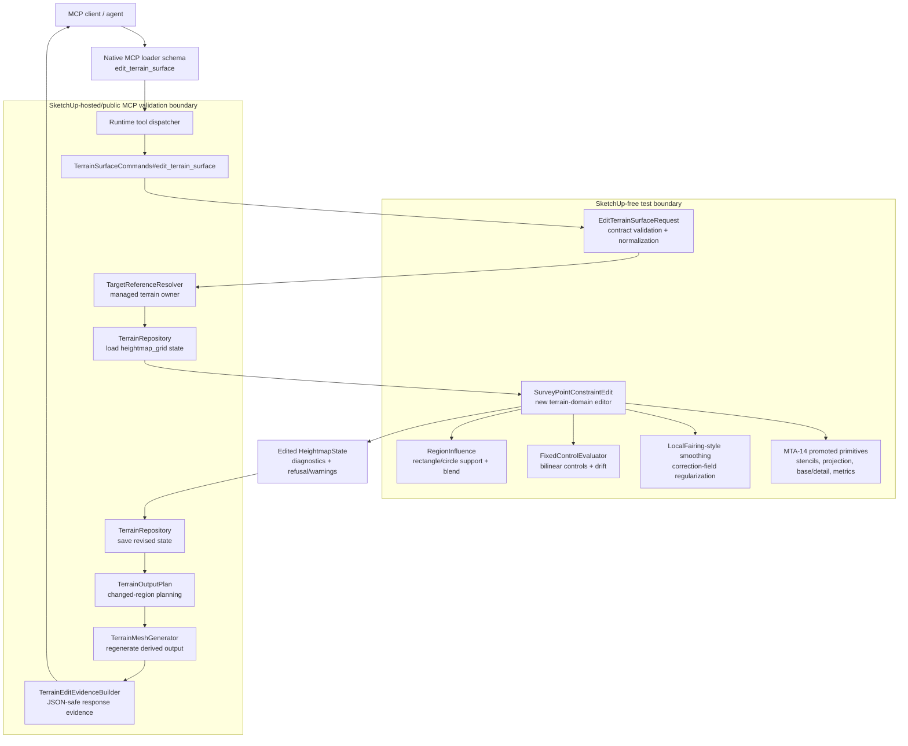

# Technical Plan: MTA-13 Implement Survey Point Constraint Terrain Edit
**Task ID**: `MTA-13`
**Title**: `Implement Survey Point Constraint Terrain Edit`
**Status**: `finalized`
**Date**: `2026-04-27`

## Source Task

- [Implement Survey Point Constraint Terrain Edit](./task.md)

## Problem Summary

Managed terrain workflows need to apply measured survey elevations to stored `heightmap_grid` terrain state without falling back to `eval_ruby` or live TIN surgery. Existing terrain edits can target a bounded height, transition a corridor, and locally fair terrain, but they cannot satisfy explicit surveyed `{ x, y, z }` constraints.

`MTA-13` adds a `survey_point_constraint` edit mode to existing `edit_terrain_surface`. The mode must support both isolated local point corrections and bounded regional grade-field adjustment over an explicit support region. Sparse survey points must not silently imply broad terrain reshaping; regional behavior is allowed only through an explicit `region` support area and must prove a coherent correction field rather than isolated point pockets.

## Goals

- Add a public `edit_terrain_surface` operation mode for survey point constraints.
- Support one survey point, multiple survey points, and later corrected survey points against the current terrain state.
- Support `local` and bounded `regional` correction scopes through one shared correction-field pipeline.
- Preserve fixed controls and preserve zones before saving terrain state.
- Use `MTA-14` base/detail evidence and solver primitives without making the test-support harness a runtime dependency.
- Reuse local-fairing-style neighborhood smoothing as correction-field regularization, not as the survey solver itself.
- Return compact survey, correction, detail-preservation, distortion, fixed-control, preserve-zone, and warning evidence.
- Keep public request and response shapes JSON-safe and free of raw SketchUp objects, solver internals, generated face IDs, generated vertex IDs, and output-plan internals.
- Validate hosted persistence, regenerated output, undo, and performance-sensitive regional behavior before closeout.

## Non-Goals

- Do not add a new public MCP tool.
- Do not add durable historical survey-control records.
- Do not add localized survey/detail zones or change the persisted terrain payload kind/schema version.
- Do not add polygon/freeform edit regions.
- Do not add a public global/surface-wide scope enum in this task.
- Do not expose smoothing weights, solver matrices, penalty functions, base/detail layers, or output regeneration strategy as public request or response fields.
- Do not mutate semantic hardscape objects as terrain state.
- Do not implement full regularized least-squares optimization with slope/curvature penalty unless the bounded fair/project loop fails and the plan is explicitly revised.

## Related Context

- [Managed Terrain Surface Authoring HLD](specifications/hlds/hld-managed-terrain-surface-authoring.md)
- [PRD: Managed Terrain Surface Authoring](specifications/prds/prd-managed-terrain-surface-authoring.md)
- [MCP Tool Authoring Standard for SketchUp Modeling](specifications/guidelines/mcp-tool-authoring-sketchup.md)
- [Ruby Coding Guidelines](specifications/guidelines/ryby-coding-guidelines.md)
- [SketchUp Extension Development Guidance](specifications/guidelines/sketchup-extension-development-guidance.md)
- [MTA-04 Implement Bounded Grade Edit MVP](specifications/tasks/managed-terrain-surface-authoring/MTA-04-implement-bounded-grade-edit-mvp/task.md)
- [MTA-06 Implement Local Terrain Fairing Kernel](specifications/tasks/managed-terrain-surface-authoring/MTA-06-implement-local-terrain-fairing-kernel/task.md)
- [MTA-10 Implement Partial Terrain Output Regeneration](specifications/tasks/managed-terrain-surface-authoring/MTA-10-implement-partial-terrain-output-regeneration/task.md)
- [MTA-12 Add Circular Terrain Regions And Preserve Zones](specifications/tasks/managed-terrain-surface-authoring/MTA-12-add-circular-terrain-regions-and-preserve-zones/task.md)
- [MTA-14 Evaluate Base Detail Preserving Survey Correction](specifications/tasks/managed-terrain-surface-authoring/MTA-14-evaluate-base-detail-preserving-survey-correction/task.md)
- [MTA-14 Summary](specifications/tasks/managed-terrain-surface-authoring/MTA-14-evaluate-base-detail-preserving-survey-correction/summary.md)

## Research Summary

- `MTA-04` proved that public terrain mutation spans request validation, command dispatch, terrain-domain math, evidence, state persistence, derived output regeneration, docs, fixtures, and hosted validation.
- `MTA-05` and `MTA-12` showed that coordinate semantics, region shape vocabulary, native schema, contract fixtures, docs, and hosted tests must move together for new edit vocabulary.
- `MTA-06` provides a SketchUp-free local fairing kernel with cropped-square neighborhood averaging, region weights, preserve-zone masking, fixed-control checks, residual evidence, bounded iterations, and edge clipping. It is useful as smoothing/regularization machinery, but it is not a survey constraint solver.
- `MTA-10` showed that hosted performance, target resolution, partial output, undo, and save/reopen behavior can dominate risk after local tests pass.
- `MTA-14` proved base/detail residual recomposition is viable and better than simple minimum-change for representative detail-preservation cases. It also proved reusable primitives: bilinear interpolation/stencils, minimum-norm projection, base/detail split, detail masks, metrics, refusals, repeated-edit fixtures, and hosted Ruby-domain smoke. It did not implement broad regional support scopes or the production MCP workflow.
- External consensus during planning agreed that `MTA-14` is an ingredient, not the final solver. The missing superior candidate is a constrained correction-field approach with explicit local/regional support.
- MCP authoring guidance favors extending the existing tool, preserving shallow top-level shape, keeping survey point data under `constraints`, and reusing existing `region` vocabulary instead of adding a new top-level `supportRegion`.

## Technical Decisions

### Data Model

- Terrain source of truth remains the persisted `heightmap_grid` v1 state loaded through `TerrainRepository`.
- Survey points are request-time constraints, not durable historical records:
  - `constraints.surveyPoints[]`
  - required `point.x`, `point.y`, `point.z`
  - optional `id`
  - optional `tolerance`, default `0.01`
- `region` is the correction support area for this mode:
  - `rectangle` with `bounds`
  - `circle` with `center` and `radius`
  - optional `blend` with existing `distance` and `falloff`
- `operation.correctionScope` is the requested correction breadth:
  - `local`
  - `regional`
- Internal working arrays may include:
  - `H`: current terrain elevations
  - `B`: low-pass base
  - `D`: residual detail, `H - B`
  - `M`: detail-retention mask
  - `D_retained`: retained residual detail
  - `C`: correction field over support samples
  - `H_prime`: recomposed output terrain
- These internal arrays are not persisted as new terrain schema and are not public response fields.

### API and Interface Design

Public request shape:

```json
{
  "targetReference": { "sourceElementId": "terrain-main" },
  "operation": {
    "mode": "survey_point_constraint",
    "correctionScope": "regional"
  },
  "region": {
    "type": "rectangle",
    "bounds": { "minX": 0.0, "minY": 0.0, "maxX": 20.0, "maxY": 10.0 },
    "blend": { "distance": 2.0, "falloff": "smooth" }
  },
  "constraints": {
    "surveyPoints": [
      { "id": "left-1", "point": { "x": 0.0, "y": 0.0, "z": 1.1 }, "tolerance": 0.01 },
      { "id": "right-1", "point": { "x": 20.0, "y": 0.0, "z": 0.7 }, "tolerance": 0.01 }
    ],
    "fixedControls": [],
    "preserveZones": []
  },
  "outputOptions": { "includeSampleEvidence": false, "sampleEvidenceLimit": 20 }
}
```

Internal production shape:

- Add a SketchUp-free `SurveyPointConstraintEdit` terrain editor under `src/su_mcp/terrain/`.
- Add or extract helper objects only where they reduce real complexity:
  - survey point validation/normalization helpers may remain inside request validation;
  - reusable interpolation/projection/base-detail code may be a small terrain-domain service;
  - fairing-style correction-field smoothing may be extracted from `LocalFairingEdit` only if direct reuse would create coupling or duplication.
- `TerrainSurfaceCommands#editor_for` dispatches `survey_point_constraint` to the survey editor.
- The survey editor returns the same broad kernel contract as existing editors:
  - edited result: `outcome: 'edited'`, updated `HeightmapState`, `diagnostics`
  - refused result: structured refusal with code, message, details

### Public Contract Updates

Request deltas:

- Add `survey_point_constraint` to `EditTerrainSurfaceRequest::SUPPORTED_OPERATION_MODES`.
- Add `operation.correctionScope`, required for `survey_point_constraint`, allowed values `local` and `regional`.
- Add `constraints.surveyPoints`, required non-empty array for `survey_point_constraint`.
- Add survey point validation:
  - each item must be an object;
  - `point` must include finite `x`, `y`, and `z`;
  - `tolerance`, when present, must be finite and non-negative;
  - `id`, when present, must be JSON-safe string-like public evidence only.
- Add mode-specific region compatibility:
  - `survey_point_constraint` supports `rectangle` and `circle`;
  - `corridor` is not supported for this mode in v1.
- Add mode-specific preserve-zone compatibility:
  - rectangle and circle preserve zones are supported for survey mode.

Response deltas:

- Add compact survey evidence under `evidence.survey`:
  - `points[]`
  - id or index
  - requested elevation
  - before elevation
  - after elevation
  - residual
  - tolerance
  - status
- Add compact correction evidence under `evidence.survey.correction`:
  - correction scope
  - support region type
  - changed sample count and changed bounds
  - max sample delta
  - detail-preservation summary
  - distortion summary
  - warnings
- Do not expose internal arrays, solver matrices, raw strategy names from MTA-14 test-support code, output-plan internals, face IDs, or vertex IDs.

Schema and registration updates:

- Update native loader `edit_terrain_surface` schema descriptions and enum values.
- Update tool description to include survey constraints and to distinguish local vs regional correction.
- Keep provider-compatible root schema: no root `oneOf`, `anyOf`, or conditional branches.

Dispatcher and routing updates:

- Wire `survey_point_constraint` in `TerrainSurfaceCommands#editor_for`.
- Update command tests so each mode routes to its own editor.

Contract, fixture, docs, and examples:

- Update `test/support/native_runtime_contract_cases.json`.
- Add validation cases for missing `correctionScope`, bad `correctionScope`, missing `constraints.surveyPoints`, invalid point shapes, unsupported `region.type`, and unsupported preserve-zone type if any.
- Add README operation matrix row and examples for local and regional survey edits.
- Update no-leak contract tests for survey evidence.

### Error Handling

Validation refusals:

- `missing_required_field` for missing operation mode, correction scope, region fields, or survey points.
- `invalid_edit_request` for invalid survey point shape, invalid numeric fields, negative tolerance, invalid region shape, or invalid sample evidence limit.
- `unsupported_option` for unsupported mode, correction scope, region type, preserve-zone type, or falloff.

Terrain-domain refusals:

- `survey_point_outside_bounds`
- `survey_point_outside_support_region`
- `survey_point_over_no_data`
- `contradictory_survey_points`
- `survey_point_preserve_zone_conflict`
- `fixed_control_conflict`
- `required_sample_delta_exceeds_threshold`
- `regional_correction_unsafe`
- existing terrain/output refusals such as target not found, unsupported child output, state load failure, and output regeneration failure

Warnings:

- residuals satisfied but slope/curvature/detail metrics approach thresholds;
- fair/project loop required all configured passes;
- regional correction produced broader-than-expected changed region while remaining within support and thresholds.

Structured refusals occur before state save and output mutation where possible. Any failure after a SketchUp operation starts must abort the operation through existing command handling.

### State Management

- Survey edits operate on the current loaded terrain state.
- Repeated edits do not replay original survey history and do not persist survey constraints as durable records.
- Successful edits create a new `HeightmapState` revision and save through `TerrainRepository`.
- Derived mesh output remains disposable and regenerated from saved state.
- Regional support may produce larger changed regions; output planning must receive accurate changed sample diagnostics.
- Save/reopen compatibility must remain unchanged because persisted state schema is not changing.

### Solver Design

Use a bounded correction-field fair/project loop for regional survey adjustment and a compatible local path for isolated corrections.

Core regional shape:

```text
H = current authored terrain
B = low_pass(H)
D = H - B
M = residual-detail retention mask
D_retained = D * M
C = correction field over support samples in region

repeat fixed number of passes:
  C = fair/smooth C over mutable support samples
  C = project C back onto survey constraints
  enforce support, preserve-zone, and boundary immutability

H' = B + C + D_retained
validate H'
```

Projection target:

```text
target_for_base_plus_c = survey_z - interpolate(D_retained, survey_xy)
project C so interpolate(B + C, survey_xy) ~= target_for_base_plus_c
```

Fairing rule:

```text
C[i] = C[i] + ((avg_neighbors(C) - C[i]) * strength * support_weight[i])
```

Solver guardrails:

- use fixed pass counts, not open-ended convergence;
- final residuals are validated after smoothing and recomposition;
- samples outside support region are immutable;
- preserve-zone samples are immutable;
- fixed controls are checked after correction;
- fallback to refusal or escalation rather than silently emitting local pockets for regional requests;
- full regularized optimization remains deferred unless this plan is explicitly revised.

### Integration Points

- `EditTerrainSurfaceRequest` owns public shape validation and normalization.
- `TerrainSurfaceCommands` owns target resolution, state load/save, SketchUp operation wrapping, output regeneration, and response assembly.
- `SurveyPointConstraintEdit` owns terrain-domain correction and diagnostics.
- `RegionInfluence` owns rectangle/circle support weights and preserve-zone containment.
- `FixedControlEvaluator` owns bilinear fixed-control checks.
- `TerrainEditEvidenceBuilder` owns JSON-safe public evidence.
- `TerrainMeshGenerator` and `TerrainOutputPlan` own derived output regeneration and changed-region behavior.

### Configuration

Initial defaults:

- Survey tolerance default: `0.01` public meters.
- Supported correction scopes: `local`, `regional`.
- Supported survey support regions: `rectangle`, `circle`.
- Supported support blend falloffs: existing `none`, `linear`, `smooth`.
- Detailed sample evidence remains controlled by existing output options.

Solver thresholds and pass counts should be constants in terrain-domain code with tests documenting expected behavior. They are not public request fields in this task.

## Architecture Context



## Key Relationships

- The public tool remains `edit_terrain_surface`; survey behavior is a new operation mode.
- Survey points are constraints to satisfy, so they live under `constraints.surveyPoints`.
- The support area remains `region`; for survey mode the region describes allowed correction support/influence.
- `MTA-14` provides reusable evidence and algorithmic ingredients, but production code must live under `src/su_mcp/terrain/`.
- `MTA-06` fairing behavior informs smoothing of the correction field, not direct terrain smoothing after survey correction.
- `MTA-10` output and performance lessons shape hosted validation for regional edits.

## Acceptance Criteria

- `edit_terrain_surface` accepts `operation.mode: "survey_point_constraint"` through public schema, runtime validator, native fixtures, and README examples.
- Survey requests use the existing top-level shape: `targetReference`, `operation`, `region`, `constraints`, and `outputOptions`.
- Survey requests require `operation.correctionScope` with finite values `local` or `regional`; invalid values return structured refusal with `allowedValues`.
- Survey target elevations are supplied as `constraints.surveyPoints`; each point has finite public-meter `point.x`, `point.y`, `point.z`, optional `id`, and optional non-negative `tolerance`.
- For survey mode, `region.type` supports rectangle and circle only, and `region` is documented and enforced as the permitted correction support area.
- Local survey correction satisfies supported points within tolerance while staying bounded by support region and preserve zones.
- Regional survey correction applies a coherent correction field over the support region on representative cross-fall or multi-plane fixtures rather than isolated point pockets.
- Repeated single, batch, and corrected single-point workflows evaluate against current terrain state and report repeated-edit drift evidence.
- Refusals occur before mutation for out-of-bounds points, points outside support, no-data stencils, contradictory points, preserve-zone conflicts, fixed-control conflicts, unsafe sample deltas, and unsafe regional correction.
- Preserve-zone conflicts cover direct survey overlap and post-correction drift of protected samples.
- Final survey residuals are validated after smoothing/detail recomposition.
- Successful responses include compact per-point survey evidence and compact correction/detail/distortion evidence.
- Successful responses put survey-specific evidence under `evidence.survey`, with per-point evidence under `evidence.survey.points` and correction summary under `evidence.survey.correction`.
- Detailed changed-sample evidence remains gated by existing output options.
- Public responses and refusals remain JSON-safe and do not expose raw SketchUp objects, generated face IDs, vertex IDs, solver matrices, output-plan internals, or test-support implementation names.
- Successful edits save updated terrain state, increment revision, and regenerate derived terrain output from saved state.
- Hosted validation proves local edit, regional edit, repeated correction, fixed-control refusal, preserve-zone refusal, output regeneration, undo, and performance-sensitive regional behavior.
- MTA-14 test-support code is not a runtime dependency.

## Test Strategy

### TDD Approach

Start with contract and request-validation tests to lock public field ownership. Then build the SketchUp-free terrain-domain solver tests before wiring command dispatch or output regeneration. Add integration/evidence tests once the kernel contract is stable. Finish with hosted public MCP validation because MTA-04 and MTA-10 showed host behavior can invalidate local assumptions.

### Required Test Coverage

- Request validation:
  - supported mode and correction scopes;
  - missing/invalid `constraints.surveyPoints`;
  - survey point finite `x`, `y`, `z`, tolerance, and id handling;
  - rectangle/circle region compatibility;
  - corridor refusal for survey mode;
  - preserve-zone compatibility;
  - output option compatibility.
- Native contract fixtures:
  - valid local survey request;
  - valid regional survey request;
  - invalid correction scope;
  - missing survey points;
  - invalid survey point shape;
  - unsupported region type.
- Terrain-domain kernel tests:
  - single local survey point;
  - multiple local survey points;
  - repeated single, batch, corrected single workflow;
  - regional cross-fall-like fixture;
  - regional multi-plane-like fixture;
  - points outside terrain bounds;
  - points outside support region;
  - no-data refusal;
  - contradictory points;
  - fixed-control conflict;
  - preserve-zone direct overlap;
  - preserve-zone post-correction drift;
  - max sample delta refusal;
  - unsafe regional correction refusal;
  - detail retention/suppression and distortion metrics.
- Command/evidence tests:
  - mode dispatch;
  - state save and revision summary;
  - output plan changed-region handling;
  - compact evidence shape;
  - sample evidence gating;
  - no internal vocabulary leak.
- Hosted/public MCP validation:
  - local survey edit;
  - bounded regional survey edit;
  - repeated correction;
  - fixed-control refusal;
  - preserve-zone refusal;
  - undo coherence;
  - save/reopen or persistence proof where practical;
  - performance-sensitive regional support case.

## Instrumentation and Operational Signals

- Survey residuals per point.
- Correction scope and support region type.
- Changed sample count and changed bounds.
- Max sample delta.
- Detail retention outside support influence and detail suppression in core/blend areas.
- Slope and curvature proxy max increase.
- Fixed-control and preserve-zone drift.
- Repeated-edit cumulative drift.
- Hosted edit timing and derived mesh summary for performance-sensitive regional validation.
- Warnings for threshold proximity or full configured pass usage.

## Implementation Phases

1. **Contract skeleton**
   - Add mode enum, correction scope enum, `constraints.surveyPoints`, validator normalization, native schema, native fixtures, README matrix/examples, and contract tests.

2. **Survey editor shell**
   - Add `SurveyPointConstraintEdit` with refusal ordering, diagnostics skeleton, and no runtime dependency on `test/support`.

3. **Promote reusable terrain math**
   - Move or reimplement MTA-14 interpolation/stencil, minimum-norm projection, base/detail split, detail mask, metrics, and refusal helpers under `src/su_mcp/terrain/`.

4. **Local correction**
   - Implement local correction using promoted primitives and support-region limits.
   - Add single, multi-point, repeated-edit, preserve, fixed-control, and no-data tests.

5. **Regional fair/project correction**
   - Implement correction field over support samples.
   - Add fairing-style smoothing of `C`, projection back to survey constraints, recomposition, and final validation.
   - Add cross-fall and multi-plane fixtures.

6. **Command integration and evidence**
   - Wire dispatch, persistence, output regeneration, and survey-specific evidence.
   - Add command and no-leak tests.

7. **Hosted validation and closeout hardening**
   - Deploy and run public MCP hosted matrix.
   - Patch any host-specific output, undo, persistence, coordinate, or performance issues before closeout.

## Rollout Approach

- Ship as an additive mode inside `edit_terrain_surface`.
- Keep persisted terrain state schema unchanged.
- Keep all solver knobs internal.
- Refuse unsupported or unsafe regional cases rather than downgrading silently to local behavior.
- If regional fair/project cannot satisfy representative fixtures within thresholds, revise the plan to narrow regional support or escalate the unsupported cases to `MTA-11`.

## Risks and Controls

- Regional solver overreach: validate against regional fixtures with residual, slope, curvature, max-delta, detail, and changed-region evidence; refuse unsafe corrections.
- Local pockets masquerading as regional correction: regional tests must prove coherent support-region correction, not only point residual satisfaction.
- Evidence name ambiguity: public response shape is fixed to `evidence.survey`, with nested `points` and `correction`; schema, docs, fixtures, and no-leak tests must use that name consistently.
- Survey drift after smoothing/detail recomposition: project after smoothing and validate final residuals after recomposition.
- Public contract drift: implement schema, validator, fixtures, dispatcher, docs, examples, and no-leak tests in the first phase.
- Section ownership confusion: document that survey points live under `constraints.surveyPoints` and survey `region` is correction support geometry.
- Hosted output and undo mismatch: require hosted public MCP validation for state, output, undo, and regional performance.
- Performance scaling: include performance-sensitive hosted regional case and apply MTA-10 target-resolution/output-planning lessons.
- Preserve-zone and fixed-control conflicts: check direct overlaps before solve and drift after correction before save.
- MTA-14 spike leakage: promote logic into `src/su_mcp/terrain/` and test that public evidence does not expose test-support names.

## Dependencies

- `MTA-04`
- `MTA-06`
- `MTA-10`
- `MTA-12`
- `MTA-14`
- Managed Terrain Surface Authoring HLD
- Managed Terrain Surface Authoring PRD
- MCP tool authoring guide
- Ruby coding guidelines
- SketchUp extension development guidance
- SketchUp-hosted MCP validation environment

## Premortem Gate

Status: PASS

### Unresolved Tigers

- None.

### Plan Changes Caused By Premortem

- Fixed public response evidence naming to `evidence.survey`, with per-point rows under `evidence.survey.points` and correction summary under `evidence.survey.correction`.
- Tightened the public scope guardrail: MTA-13 supports `local` and `regional` only; whole-surface-like use must be represented by an explicit bounded region, not a public `global` enum.
- Carried coherent-field validation as an implementation gate for regional correction so regional success cannot be proven by residual satisfaction alone.

### Accepted Residual Risks

- Risk: Regional fair/project correction may still create pockets, humps, rings, or slope breaks in fixtures that pass point residual checks.
  - Class: Paper Tiger
  - Why accepted: The plan contains regional cross-fall and multi-plane fixtures, detail/distortion evidence, unsafe-regional refusal, and an explicit fallback to plan revision or MTA-11 escalation.
  - Required validation: Regional kernel tests and hosted public MCP validation must prove coherent support-region correction and acceptable slope/curvature/detail metrics.
- Risk: No public `global` correction scope may disappoint whole-surface workflows.
  - Class: Elephant
  - Why accepted: A separate public global enum would widen the contract and validation burden; bounded regional support can represent whole-surface-like edits through an explicit rectangle in v1.
  - Required validation: README examples and contract fixtures must show the explicit-region pattern and must not imply implicit global reshaping.
- Risk: Solver constants and thresholds are internal and may need tuning after hosted validation.
  - Class: Paper Tiger
  - Why accepted: Keeping knobs internal protects the public MCP contract; the plan requires constants in terrain-domain code and tests documenting expected behavior.
  - Required validation: Fixture thresholds, warnings, refusals, and hosted timing/evidence must be reviewed before closeout.

### Carried Validation Items

- Contract drift check covering schema, validator, native fixtures, README examples, dispatcher routing, and no-leak response tests for `evidence.survey`.
- Regional coherent-field acceptance tests using cross-fall and multi-plane fixtures, not only isolated point residual assertions.
- Hosted MCP validation for local edit, regional edit, repeated correction, fixed-control refusal, preserve-zone refusal, undo, persistence, output regeneration, and performance-sensitive regional support.

### Implementation Guardrails

- Do not add public solver knobs, public base/detail fields, or MTA-14 strategy names to request or response payloads.
- Do not silently downgrade `regional` requests to local pockets; refuse unsafe regional correction or revise the plan.
- Do not add a `global` correction scope in MTA-13; whole-surface-like behavior must use explicit bounded region geometry.
- Do not save terrain state until final survey residuals, preserve-zone drift, fixed-control drift, and unsafe-delta checks pass after recomposition.
- Do not make production runtime depend on `test/support` MTA-14 harness code.

## Quality Checks

- [x] All required inputs validated
- [x] Problem statement documented
- [x] Goals and non-goals documented
- [x] Research summary documented
- [x] Technical decisions included
- [x] Architecture context included
- [x] Acceptance criteria included
- [x] Test requirements specified
- [x] Instrumentation and operational signals defined when needed
- [x] Risks and dependencies documented
- [x] Rollout approach documented when needed
- [x] Small reversible phases defined
- [x] Public contract artifacts identified
- [x] Hosted validation requirements identified
- [x] Premortem completed with falsifiable failure paths and mitigations
- [x] Planning-stage size estimate considered before premortem finalization
