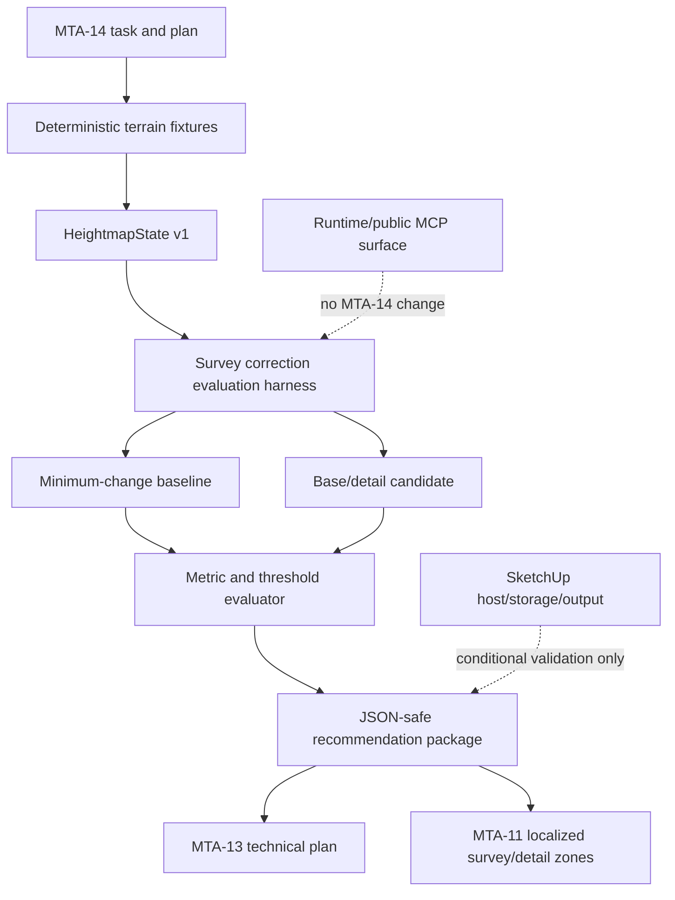

# Technical Plan: MTA-14 Evaluate Base Detail Preserving Survey Correction
**Task ID**: `MTA-14`
**Title**: `Evaluate Base Detail Preserving Survey Correction`
**Status**: `finalized`
**Date**: `2026-04-27`

## Source Task

- [Evaluate Base Detail Preserving Survey Correction](./task.md)

## Problem Summary

`MTA-13` needs to implement survey point constraint terrain editing without leaving the solver choice to implementation-time guesswork. A correction that only drives nearby heightmap samples to measured elevations can pass residual checks while erasing local terrain character, introducing humps or trenches, or accumulating drift across later corrected survey edits.

`MTA-14` evaluates whether current `heightmap_grid` v1 terrain can support a concrete base/detail-preserving survey correction strategy, or whether `MTA-13` should deliberately narrow to safe minimum-change cases, refuse unsafe cases, or escalate to `MTA-11` localized survey/detail zones.

## Goals

- Define measurable detail-preservation, distortion, and cumulative-drift criteria for survey point correction.
- Build deterministic terrain-domain fixtures covering flat terrain with local detail, sloped terrain with noise, nearby survey points, repeated edits, fixed controls, and preserve-zone conflicts.
- Compare a minimum-change bilinear correction baseline against a concrete base/detail-preserving correction candidate.
- Make the base/detail candidate implementable enough that `MTA-13` does not reopen broad solver research.
- Produce a solver recommendation package for `MTA-13`, including algorithm sketch, parameters, evidence, refusal/warning cases, and `MTA-11` escalation cases.

## Non-Goals

- Do not ship a public `edit_terrain_surface` survey mode in this task.
- Do not change native MCP loader schema, runtime dispatch, README tool examples, or public response shape.
- Do not add durable localized survey/detail zones or change persisted terrain payload kind/schema version.
- Do not implement interactive brush UI, broad sculpting, civil grading, erosion, or public Unreal-style terrain tools.
- Do not copy Unreal Engine edit-layer, render-target, GPU, or FFT architecture into the SketchUp extension.
- Do not mutate semantic hardscape objects as terrain state.

## Related Context

- [Managed Terrain Surface Authoring HLD](specifications/hlds/hld-managed-terrain-surface-authoring.md)
- [PRD: Managed Terrain Surface Authoring](specifications/prds/prd-managed-terrain-surface-authoring.md)
- [Managed Terrain Phase 1 UE Research Reference](specifications/research/managed-terrain/ue-reference-phase1.md)
- [Ruby Coding Guidelines](specifications/guidelines/ryby-coding-guidelines.md)
- [SketchUp Extension Development Guidance](specifications/guidelines/sketchup-extension-development-guidance.md)
- [MTA-06 local terrain fairing kernel](specifications/tasks/managed-terrain-surface-authoring/MTA-06-implement-local-terrain-fairing-kernel/task.md)
- [MTA-12 circular terrain regions and preserve zones](specifications/tasks/managed-terrain-surface-authoring/MTA-12-add-circular-terrain-regions-and-preserve-zones/task.md)
- [MTA-13 survey point constraint terrain edit](specifications/tasks/managed-terrain-surface-authoring/MTA-13-implement-survey-point-constraint-terrain-edit/task.md)
- [MTA-11 localized survey/detail zones](specifications/tasks/managed-terrain-surface-authoring/MTA-11-design-and-implement-durable-localized-terrain-representation-v2/task.md)

## Research Summary

- `MTA-06` establishes a SketchUp-free local fairing kernel over `HeightmapState`, cropped square neighborhood averaging, fixed-control conflict checks, preserve-zone masking, and mean neighborhood residual evidence.
- `MTA-12` establishes `RegionInfluence` for rectangle/circle influence weighting and preserve-zone masking, plus contract lessons around finite mode support and schema drift.
- `FixedControlEvaluator` already provides bilinear interpolation and 2x2 stencil calculation that can be reused as the survey-point evaluation baseline.
- `MTA-04`, `MTA-05`, and `MTA-10` show that public terrain mutation tasks need hosted validation, but `MTA-14` should avoid hosted burden unless the evaluation depends on storage, output regeneration, transforms, or public command orchestration.
- Targeted Unreal Engine inspection confirms a useful base/detail research pattern: UE smooth can use `DetailScale` with a low-pass filter, while edit layers can separate composed terrain from layer contribution. This repository should use those as math inspiration only, not as public API, architecture, class naming, or GPU/FFT implementation guidance.
- Grok 4.20 challenged the refinement and found the base/detail candidate needed more exact low-pass, mask, correction, metric, and threshold decisions before it could prevent `MTA-13` solver drift. This plan incorporates those corrections.
- UE source inspection must remain bounded: use explicit file paths and narrow line ranges only under `/mnt/c/Users/Gleb/Projects/UnrealEngine/Engine/`; do not run broad directory searches there.

## Technical Decisions

### Data Model

- The evaluation operates on current `SU_MCP::Terrain::HeightmapState` with `payloadKind: "heightmap_grid"` and schema version `1`.
- Evaluation working layers are in-memory only:
  - `H`: original elevation array.
  - `B`: low-pass base elevation array.
  - `D`: detail array, `H - B`.
  - `M`: detail-retention mask, one value per sample.
  - `D_retained`: retained detail array, `D * M`.
  - `B_prime`: corrected base elevation array.
  - `H_prime`: recomposed corrected height array, `B_prime + D_retained`.
- These layers must not be persisted, serialized as terrain state, or exposed as public MCP output.
- The evaluation report may serialize compact JSON-safe metrics, parameters, fixture names, and recommendation data.

### API and Interface Design

No public API is added or changed.

The implementation should use a test/support evaluation harness rather than production runtime files. Recommended shape:

- `test/support/terrain_survey_correction_evaluation.rb`
- `test/terrain/survey_correction_evaluation_test.rb`
- Required completion artifact: `summary.md` in this task folder with the final solver recommendation package.

The harness should expose a small internal API for tests, not a runtime command:

```ruby
evaluation = SurveyCorrectionEvaluation.run(
  state: heightmap_state,
  survey_points: survey_points,
  fixed_controls: fixed_controls,
  preserve_zones: preserve_zones,
  strategy: :base_detail,
  parameters: parameters
)
```

The result must be JSON-safe and include:

- `strategy`
- `parameters`
- `surveyPoints`
- `metrics`
- `warnings`
- `refusals`
- `recommendationInputs`

Concrete report shape for the evaluation harness:

```ruby
{
  'strategy' => 'base_detail',
  'parameters' => {
    'radiusSamples' => 2,
    'passes' => 2,
    'coreRadiusM' => 0.75,
    'blendRadiusM' => 3.0,
    'falloff' => 'smoothstep',
    'surveyTolerance' => 0.01
  },
  'surveyPoints' => [
    {
      'id' => 'survey-1',
      'point' => { 'x' => 2.5, 'y' => 2.5, 'z' => 4.2 },
      'beforeElevation' => 3.9,
      'afterElevation' => 4.2,
      'residual' => 0.0,
      'tolerance' => 0.01,
      'status' => 'satisfied'
    }
  ],
  'metrics' => {
    'maxSampleDelta' => 0.3,
    'changedRegion' => {
      'sampleCount' => 4,
      'bounds' => { 'min' => { 'column' => 2, 'row' => 2 }, 'max' => { 'column' => 3, 'row' => 3 } }
    },
    'detailRetention' => { 'outsideInfluenceRatio' => 1.0 },
    'detailSuppression' => { 'coreEnergy' => 0.5, 'blendEnergy' => 0.25 },
    'slopeProxy' => { 'beforeMax' => 0.4, 'afterMax' => 0.5, 'maxIncrease' => 0.1 },
    'curvatureProxy' => { 'beforeMax' => 0.2, 'afterMax' => 0.3, 'maxIncrease' => 0.1 },
    'fixedControlDrift' => { 'max' => 0.0, 'controls' => [] },
    'preserveZoneDrift' => { 'max' => 0.0, 'zones' => [] },
    'cumulativeDrift' => { 'max' => 0.0, 'mean' => 0.0 }
  },
  'warnings' => [],
  'refusals' => [],
  'recommendationInputs' => {
    'status' => 'satisfied',
    'detailPreserving' => true,
    'thresholdOnly' => false
  }
}
```

### Public Contract Updates

Not applicable for `MTA-14`.

If `MTA-14` later proves a strategy should be implemented in `MTA-13`, the `MTA-13` plan must explicitly update:

- public `edit_terrain_surface` request validation
- native loader schema
- runtime dispatcher/command wiring
- native contract fixtures
- README examples
- response evidence shape
- no-leak public contract tests

### Strategy Definitions

#### Minimum-Change Baseline

The baseline is a control, not the detail-preserving candidate.

- Evaluate each survey point using bilinear interpolation over the containing 2x2 sample stencil.
- Compute residual `target_z - current_z`.
- For a single point, apply the minimum-norm sample delta to the 2x2 stencil using interpolation weights.
- For multiple points, build the union of affected samples and solve a small minimum-norm linear least-squares system.
- Report artifacts and distortion metrics exactly like the base/detail candidate.

The baseline may be recommended for `MTA-13` only if it genuinely preserves detail on representative fixtures and the plan records that base/detail machinery is unnecessary for the supported cases. It must not become the default by drift.

#### Base/Detail Candidate

This is the primary candidate.

1. Compute low-pass base:
   - `B = low_pass(H, radius_samples, passes)`
   - Use deterministic cropped square neighborhood averaging.
   - No FFT.
   - No convergence-driven early exit for the evaluation matrix; use explicit pass counts.
2. Compute detail:
   - `D[i] = H[i] - B[i]`
3. Compute detail-retention mask:
   - `M[i] = 0.0` inside each survey point core radius.
   - `M[i]` smoothsteps from `0.0` to `1.0` across the blend band.
   - `M[i] = 1.0` outside all survey point influence areas.
   - Multiple survey points combine with `min`.
   - Preserve-zone conflicts are not silently overridden.
4. Retain detail:
   - `D_retained[i] = D[i] * M[i]`
5. Adjust survey targets for retained detail:
   - `d_point = interpolate(D_retained, survey_xy)`
   - `base_target = target_z - d_point`
6. Correct the base:
   - Single point: minimum-norm correction over the bilinear 2x2 stencil.
   - Multiple points: solve a minimum-norm least-squares system over the union of affected samples.
7. Recompose:
   - `H_prime[i] = B_prime[i] + D_retained[i]`
8. Validate final residuals and distortion metrics over `H_prime`.

MTA-14 must evaluate a parameter matrix rather than hard-code ungrounded constants:

- `radius_samples`: at least `1`, `2`, `3`
- `passes`: at least `1`, `2`
- `core_radius_m`: at least one value at or below one grid spacing
- `blend_radius_m`: at least one value spanning a few grid spacings
- `falloff`: smoothstep as the default; linear may be included only as a comparison

The final recommendation should select default guidance from fixture results.

#### Constrained Detail-Penalty Solver

Do not leave this as an open option for `MTA-13`.

If the base/detail candidate fails and evidence suggests v1 could still be salvageable with a constrained penalty solver, `MTA-14` must either:

- define that solver with the same level of pseudocode, parameters, and test evidence; or
- explicitly recommend deferring it to `MTA-11` or a follow-up research task.

### Metric Definitions

The evaluation must implement metrics, not just name them.

- Survey residual:
  - per point: `after_z - target_z`
  - status: satisfied, warning, refused, or escalated
- Max sample delta:
  - maximum absolute `H_prime[i] - H[i]`
- Changed-region size:
  - changed sample count plus sample-index bounds for material deltas above tolerance
- Detail retention outside influence:
  - ratio of retained high-frequency energy outside all survey influence areas, using `sum(abs(D_retained)) / sum(abs(D))` where denominator is non-zero
- Detail suppression inside core/blend:
  - suppressed high-frequency energy, `sum(abs(D - D_retained))`, reported separately for core and blend
- Curvature proxy:
  - maximum absolute discrete second difference over interior samples, measured before and after
  - report max increase and location
- Slope proxy:
  - maximum adjacent-sample elevation delta normalized by spacing, measured before and after
  - report max increase and location
- Cumulative drift:
  - maximum and mean absolute difference from the first acceptable state across single, batch, and corrected single-point edit sequence
  - exclude any sample that falls inside a current edit survey point's `core_radius_m + blend_radius_m` influence radius when computing drift against the first acceptable state
  - compare all other samples, including samples influenced by prior edits but not by the current edit
- Fixed-control drift:
  - use bilinear interpolation at fixed-control points and compare to tolerance
- Preserve-zone drift:
  - max and mean sample delta within each preserve zone

Metric pseudocode that skeleton tests must assert numerically:

```ruby
survey_residual = interpolate(after_elevations, survey_point) - survey_point.fetch('z')
max_sample_delta = before.zip(after).map { |a, b| (b - a).abs }.max
changed_indices = before.zip(after).each_index.select { |i| (after[i] - before[i]).abs > material_tolerance }
detail_retention = outside_indices.sum { |i| d_retained[i].abs } / outside_indices.sum { |i| detail[i].abs }
core_suppression = core_indices.sum { |i| (detail[i] - d_retained[i]).abs }
blend_suppression = blend_indices.sum { |i| (detail[i] - d_retained[i]).abs }
slope_proxy = adjacent_pairs.map { |a, b, spacing| (elevations[b] - elevations[a]).abs / spacing }.max
curvature_proxy = triples.map { |a, b, c, spacing| (elevations[a] - (2.0 * elevations[b]) + elevations[c]).abs / (spacing**2) }.max
cumulative_drift = compared_indices.map { |i| (current[i] - first_acceptable[i]).abs }
fixed_control_drift = fixed_controls.map { |control| (interpolate(after, control.point) - control.elevation).abs }
preserve_zone_drift = zone_indices.map { |i| (after[i] - before[i]).abs }
```

Thresholds should be fixture-derived in `MTA-14`. The recommendation package must provide default threshold guidance for `MTA-13`; it must not leave threshold tuning as an implementation-time decision.

### Error Handling

Evaluation outcomes should distinguish:

- `satisfied`: strategy satisfies survey residual and distortion/detail limits.
- `warn`: strategy satisfies survey residual but approaches a configured distortion/detail threshold.
- `refuse`: strategy cannot safely satisfy the request on v1 state within constraints.
- `escalate_mta11`: strategy appears to require localized survey/detail zones or representation work.

Required refusal/escalation cases:

- survey point outside terrain bounds
- survey point over no-data samples
- contradictory survey points within the same affected stencil or under-resolved area
- survey point inside or too close to a preserve zone where required samples cannot move
- survey correction conflicts with fixed controls beyond tolerance
- required sample delta exceeds max-delta threshold
- curvature/slope proxy exceeds safe threshold
- base/detail recomposition cannot satisfy residual after detail suppression/retention
- cumulative drift exceeds repeated-edit threshold

### State Management

- Evaluation should construct new `HeightmapState` instances for each simulated edit, incrementing revision as existing terrain edit kernels do.
- Repeated workflow tests must apply each candidate to the current simulated state, not replay from the original state unless the scenario explicitly requires an original-state comparison metric.
- The evaluation must not persist terrain state, update attribute dictionaries, regenerate SketchUp geometry, or start SketchUp operations.

### Integration Points

- Reuse current terrain-domain concepts where practical:
  - `HeightmapState` for materialized terrain state.
  - `FixedControlEvaluator` interpolation/stencil semantics as the point-evaluation baseline.
  - `RegionInfluence` coordinate/falloff conventions where applicable.
  - `LocalFairingEdit` neighborhood averaging as inspiration for low-pass behavior, not as a direct production dependency.
- Keep the harness outside runtime command registration.
- Produce an implementation-ready recommendation for `MTA-13`, not a new public surface.

### Configuration

No runtime configuration is added.

Evaluation parameters are test/harness inputs and must be recorded in the report:

- low-pass radius and pass count
- detail mask core radius and blend radius
- falloff kind
- survey tolerance
- fixed-control tolerance
- max sample delta guidance
- slope/curvature guidance
- cumulative-drift guidance

## Architecture Context



## Key Relationships

- `MTA-14` informs `MTA-13`; it does not implement the public survey edit mode.
- `MTA-14` may recommend that `MTA-13` use the base/detail strategy, use the baseline for safe cases only, refuse/warn unsafe cases, or defer to `MTA-11`.
- `MTA-11` remains the durable localized survey/detail-zone escalation path when v1 uniform heightmap fidelity is insufficient.
- Existing terrain edit kernels provide analogs and helpers, but the MTA-14 harness should stay isolated enough that prototype code does not accidentally become runtime behavior.

## Acceptance Criteria

- The evaluation compares the minimum-change baseline and concrete base/detail candidate on identical deterministic fixtures.
- The base/detail candidate includes exact low-pass, detail-mask, base-correction, recomposition, and validation logic.
- The evaluation covers flat terrain with local detail, sloped terrain with noise, nearby survey points, a single-point edit, a batch edit, and a later corrected single-point edit.
- The evaluation covers fixed-control and preserve-zone conflict cases.
- Each strategy reports survey residuals, max sample delta, changed-region size, slope or curvature proxy, detail retention, detail suppression, fixed-control drift, preserve-zone drift, and cumulative drift.
- The recommendation package states whether `MTA-13` should include base/detail preservation, use a deliberately justified simpler strategy, narrow/refuse unsafe cases, or escalate to `MTA-11`.
- The recommendation package includes enough pseudocode and parameters that `MTA-13` does not need broad solver research.
- The recommendation package explicitly distinguishes solver/math evidence from SketchUp-hosted runtime proof.
- The recommendation package explicitly says refusal/warning thresholds are not a substitute for detail preservation.
- The task does not change public MCP schemas, runtime dispatch, persisted terrain state, or README tool examples.
- Any additional UE inspection is limited to explicit paths and narrow line ranges.

## Test Strategy

### TDD Approach

Start with failing tests for the report shape and required metrics, then add fixtures, baseline strategy, base/detail strategy, repeated edit scenarios, and recommendation logic in small increments.

### Required Test Coverage

- Fixture construction:
  - flat terrain with localized detail
  - steady slope with high-frequency noise
  - nearby survey points
  - fixed-control conflict
  - preserve-zone conflict
  - repeated single, batch, corrected single-point workflow
- Metric tests:
  - bilinear residuals
  - changed-region bounds/count
  - max delta
  - slope proxy
  - curvature proxy
  - detail retention/suppression
  - cumulative drift
- Strategy tests:
  - baseline single-point solve
  - baseline multi-point solve/refusal
  - base/detail decomposition and recomposition
  - detail mask core/blend behavior
  - adjusted base target accounting for retained detail
  - base/detail refusal/escalation cases
- Recommendation tests:
  - base/detail wins when it preserves detail and satisfies residuals
  - baseline may be recommended only when fixture evidence shows detail preservation is unnecessary for supported cases
  - no unsafe threshold-only path is labeled detail-preserving
  - constrained penalty solver remains deferred unless concretely defined
  - parameter-matrix sweep proves the chosen `radius_samples`, `passes`, `core_radius_m`, `blend_radius_m`, and `falloff` tuple is selected by recommendation logic on the primary fixture
- Contract/no-drift checks:
  - no public loader schema or dispatcher changes
  - no persisted terrain payload schema change

### Hosted Validation

Hosted SketchUp validation is conditional, not default.

SketchUp-free tests can prove only terrain-domain solver behavior over `HeightmapState`: residuals, sample deltas, detail retention, slope/curvature proxies, fixed-control and preserve-zone math, and cumulative drift. They do not prove the public SketchUp-hosted survey edit workflow.

The final `summary.md` must explicitly state this boundary: the evaluation selects or rejects a solver strategy for `MTA-13`; it does not validate target resolution, SketchUp transforms beyond stored terrain state, repository persistence, regenerated mesh output, undo behavior, native MCP request/response behavior, or visual mesh quality.

Run a hosted smoke only if implementation evidence depends on:

- SketchUp transforms or non-zero origins not represented by `HeightmapState`
- repository save/load behavior
- regenerated mesh output
- public MCP command orchestration or native request/response shape
- hosted performance
- visual/output quality that cannot be inferred from terrain-domain arrays

If hosted validation is not run, `summary.md` must explicitly state why it was unnecessary for this evaluation-only solver task and must say that `MTA-13` still requires hosted/public MCP validation for the implemented edit mode.

## Instrumentation and Operational Signals

- Fixture result table showing strategy, parameters, residuals, detail-retention score, max delta, slope/curvature change, drift, and recommendation status.
- Reported parameter matrix for low-pass and mask settings.
- Explicit list of refused/warned/escalated scenarios and reason codes.
- Runtime timing for the evaluation harness on representative and larger synthetic grids if performance looks material.

## Implementation Phases

1. Add evaluation harness skeleton and report-shape tests.
2. Add deterministic terrain fixtures and metric functions.
3. Implement minimum-change bilinear baseline.
4. Implement low-pass base/detail decomposition and detail-retention mask.
5. Implement base correction and recomposition for single-point and multi-point cases.
6. Add fixed-control, preserve-zone, repeated-edit, and contradictory-point scenarios.
7. Add recommendation logic and generate the solver recommendation package.
8. Review whether hosted validation is necessary; run or document why not.
9. Finalize `summary.md`, update this task, and hand off explicit guidance to `MTA-13`.

## Rollout Approach

- No runtime rollout is required for `MTA-14`.
- The output is a planning/evaluation artifact for `MTA-13`.
- Do not promote prototype code into production runtime unless a later implementation task intentionally moves and hardens it.

## Risks and Controls

- Base/detail algorithm remains underspecified: make low-pass, mask, base correction, metrics, and thresholds executable in tests and documented in the recommendation package.
- Baseline solver drifts into `MTA-13` without proof: label it as control baseline and require fixture evidence before recommending it for supported cases.
- Threshold-only refusal posture masquerades as detail preservation: recommendation tests must reject that classification.
- Multi-point solve becomes broad optimization research: keep the first solve as minimum-norm least squares over affected stencils; defer constrained penalty optimization unless MTA-14 defines it concretely.
- Metrics are misleading on slopes: include sloped/noisy fixtures and separate slope proxy from high-frequency detail retention.
- Preserve-zone and fixed-control interactions are hidden: include explicit conflict fixtures and refusal/escalation outcomes.
- Repeated edits accumulate drift: require single, batch, and corrected single-point sequence metrics.
- Hosted behavior invalidates pure-domain assumptions: state clearly that MTA-14 only proves terrain-domain solver behavior unless hosted checks are run; keep a conditional hosted validation gate tied to transforms, persistence, output, orchestration, and performance dependencies.
- UE source inspection becomes unbounded: inspect only named files and narrow ranges; never run broad searches under the Unreal Engine directory.

## Premortem Gate

Status: PASS

### Unresolved Tigers

- None.

### Plan Changes Caused By Premortem

- Made `summary.md` a required completion artifact rather than optional, because the main business outcome is a solver recommendation package for `MTA-13`.
- Added an explicit proof boundary: SketchUp-free evaluation can prove terrain-domain solver behavior over `HeightmapState`, but it cannot prove public SketchUp-hosted survey edit behavior.
- Strengthened the hosted-validation section so a no-hosted-validation closeout must state why hosted validation was unnecessary for `MTA-14` and that `MTA-13` still requires hosted/public MCP validation.
- Added acceptance coverage requiring the recommendation package to distinguish solver/math evidence from SketchUp runtime proof.

### Accepted Residual Risks

- Risk: The base/detail candidate may still fail representative fixtures and force a deferral or narrowed `MTA-13` scope.
  - Class: Paper Tiger
  - Why accepted: This is an intended outcome of the evaluation, not a planning failure.
  - Required validation: Fixture results and recommendation logic must classify no-go, refusal, or `MTA-11` escalation cases explicitly.
- Risk: The test/support prototype may be tempting to promote directly into production.
  - Class: Paper Tiger
  - Why accepted: The plan keeps prototype code outside runtime registration and requires a later `MTA-13` implementation task to harden any adopted solver.
  - Required validation: Implementation review must verify no public MCP, runtime dispatch, persisted schema, or README tool-example changes occurred in `MTA-14`.

### Carried Validation Items

- `summary.md` must include the selected/no-go strategy, parameters, fixture results, thresholds or threshold guidance, refusal/warning/escalation cases, and solver pseudocode.
- `summary.md` must state that `MTA-13` cannot invent a different solver without updating its plan.
- If no hosted validation is run, `summary.md` must state that `MTA-13` still needs hosted/public MCP validation for request handling, persistence, output, undo, and visual/runtime behavior.

### Implementation Guardrails

- Do not present refusal/warning thresholds as detail preservation.
- Do not leave constrained optimization as an open MTA-13 implementation choice.
- Do not promote evaluation harness code into production runtime in this task.
- Do not change public MCP schema, dispatcher wiring, persisted terrain state, or README tool examples.
- Do not run broad searches under the Unreal Engine source tree; inspect only explicit files and narrow ranges.

## Dependencies

- `MTA-04`, `MTA-06`, and `MTA-12` terrain edit and region behavior.
- `MTA-13` for consuming the solver recommendation.
- `MTA-11` as the escalation path for localized survey/detail zones.
- Current `HeightmapState`, `FixedControlEvaluator`, `RegionInfluence`, and `LocalFairingEdit` concepts.
- Managed Terrain Surface Authoring HLD and PRD.
- Optional targeted UE source inspection at known file paths only.

## Quality Checks

- [ ] All required inputs validated
- [ ] Problem statement documented
- [ ] Goals and non-goals documented
- [ ] Research summary documented
- [ ] Technical decisions included
- [ ] Architecture context included
- [ ] Acceptance criteria included
- [ ] Test requirements specified
- [ ] Instrumentation and operational signals defined when needed
- [ ] Risks and dependencies documented
- [ ] Rollout approach documented when needed
- [ ] Small reversible phases defined
- [x] Premortem completed with falsifiable failure paths and mitigations
- [x] Planning-stage size estimate considered before premortem finalization
