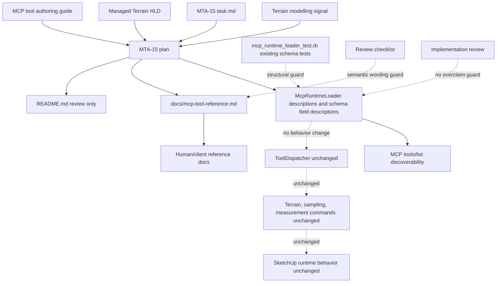

# Technical Plan: MTA-15 Harden Terrain Edit Contract Discoverability
**Task ID**: `MTA-15`
**Title**: `Harden Terrain Edit Contract Discoverability`
**Status**: `finalized`
**Date**: `2026-04-29`

## Source Task

- [Harden Terrain Edit Contract Discoverability](./task.md)

## Problem Summary

The managed terrain tools already expose useful edit behavior, evidence, and profile sampling, but the discoverable MCP contract still teaches request shape more clearly than safe terrain-edit semantics. Generic MCP clients can discover `edit_terrain_surface`, `sample_surface_z`, and `measure_scene`, but the current descriptions do not strongly enough guide clients through the baseline-safe terrain recipe: choose the operation by intent, bound the support region, protect known-good terrain with `preserveZones`, inspect terrain-edit evidence, and verify terrain shape with profiles.

This task hardens the existing public contract descriptions and reference docs. It does not change terrain solver behavior, request shapes, response shapes, tool names, or runtime routing.

## Goals

- Make `edit_terrain_surface` operation intent discoverable through concise tool and field descriptions.
- Clarify that `survey_point_constraint` with `correctionScope: regional` is a smooth correction-field behavior, not implicit planar or best-fit behavior.
- Describe `preserveZones` as the primary protection mechanism for known-good terrain during local and regional edits.
- Surface grid-spacing and close-control representational limits before callers repeatedly issue impossible or misleading edits.
- Make post-edit evidence review and profile sampling normal QA guidance for non-trivial terrain edits.
- Align `sample_surface_z` and `measure_scene terrain_profile/elevation_summary` guidance around the distinction between point/control verification and profile/shape verification.
- Keep runtime schema descriptions and `docs/mcp-tool-reference.md` aligned without adding brittle prose-locking tests.

## Non-Goals

- Do not add or change terrain solvers.
- Do not change public tool names, request shapes, response shapes, finite option sets, or refusal payloads.
- Do not add planar fit, monotonic profile, preview/dry-run, or boundary-preserving patch modes.
- Do not expose MCP prompts or resources.
- Do not turn profile sampling into validation pass/fail policy.
- Do not add detailed future-mode examples or workflow playbooks to loader descriptions.
- Do not add prose tests that fail on harmless wording changes.

## Related Context

- [Managed Terrain Surface Authoring HLD](specifications/hlds/hld-managed-terrain-surface-authoring.md)
- [Managed Terrain Surface Authoring PRD](specifications/prds/prd-managed-terrain-surface-authoring.md)
- [Terrain modelling signal](specifications/signals/2026-04-28-terrain-modelling-session-reveals-planar-intent-and-profile-qa-gaps.md)
- [MCP Tool Authoring Standard](specifications/guidelines/mcp-tool-authoring-sketchup.md)
- [Ruby Coding Guidelines](specifications/guidelines/ryby-coding-guidelines.md)
- [SketchUp Extension Development Guidance](specifications/guidelines/sketchup-extension-development-guidance.md)
- [MTA-13 survey point constraint summary](specifications/tasks/managed-terrain-surface-authoring/MTA-13-implement-survey-point-constraint-terrain-edit/summary.md)
- [MTA-14 base/detail survey correction summary](specifications/tasks/managed-terrain-surface-authoring/MTA-14-evaluate-base-detail-preserving-survey-correction/summary.md)
- [STI-03 profile sampling summary](specifications/tasks/scene-targeting-and-interrogation/STI-03-extend-sample-surface-z-with-profile-and-section-sampling/summary.md)
- [SVR-04 terrain profile measurement summary](specifications/tasks/scene-validation-and-review/SVR-04-add-terrain-aware-measurement-evidence/summary.md)

## Research Summary

- `MTA-13` is completed and shipped `survey_point_constraint`, `correctionScope: local|regional`, regional coherence evidence, survey residual evidence, and hosted validation. Its current boundary is important: regional survey correction satisfies supported survey constraints through bounded correction fields and detail-preserving behavior, but it is not a complete interior planar replacement mode.
- `MTA-14` is completed evaluation work. It supplies solver and evidence lessons such as survey residuals, max sample delta, changed region, slope and curvature proxy changes, detail preservation, and preserve-zone drift, but it did not change the public MCP surface.
- `STI-03` is completed and owns `sample_surface_z` point/profile sampling as explicit-host interrogation. It intentionally avoids terrain verdicts and terrain editing.
- `SVR-04` is completed and owns `measure_scene terrain_profile/elevation_summary` as measurement-only profile evidence. It intentionally avoids terrain diagnostics, validation verdicts, and editing.
- `PLAT-17` is the closest calibrated contract analog. Its main lesson is that public contract hardening should start with an inventory of affected public surfaces, but `MTA-15` should avoid broad cross-family behavior changes and avoid over-testing wording.
- A `grok-4.20` planning review agreed that this task is right-sized when it stays focused on existing loader descriptions, docs, and review criteria, while deferring richer examples, prompts/resources, and refusal payload improvements.

## Technical Decisions

### Data Model

No data model changes are planned.

Existing request and response structures remain unchanged:

- `edit_terrain_surface` keeps `targetReference`, `operation`, `region`, `constraints`, and `outputOptions`.
- `sample_surface_z` keeps explicit `target` plus `sampling`.
- `measure_scene` keeps current `terrain_profile/elevation_summary` request and response behavior.

### API and Interface Design

Public API changes are descriptive only. Implementers should update existing descriptions in [mcp_runtime_loader.rb](src/su_mcp/runtime/native/mcp_runtime_loader.rb) and reference docs, not add new schema fields or runtime branches.

Required semantic obligations by surface:

- `edit_terrain_surface` top-level description should identify the tool as bounded managed-terrain editing and should not frame it as arbitrary TIN editing, broad sculpting, or visual acceptance.
- `operation.mode` guidance should contrast:
  - `target_height`: local area or pad-style target elevation.
  - `corridor_transition`: linear corridor, ramp, or transition grade.
  - `local_fairing`: smoothing or finishing existing terrain, not expressing grade intent.
  - `survey_point_constraint`: measured-point correction; regional scope is a smooth correction field, not implicit planar or best-fit behavior.
- `operation.correctionScope` guidance should make the local/regional distinction clear and should explicitly avoid implying planar fitting.
- `constraints.preserveZones` guidance should present preserve zones as the primary way to protect known-good terrain that should not drift, especially near boundaries or known-good profiles outside the intended support area.
- Terrain edit output/evidence guidance should direct callers to review changed region, max sample delta, survey residuals, preserve-zone drift, slope/curvature proxy changes, and regional coherence where those fields are available.
- Grid-spacing guidance should explain that close controls can interact through shared grid samples, may be refused, or may move nearby samples; callers may need finer spacing, recreated terrain, or relaxed targets.
- `sample_surface_z` guidance should describe point sampling as control/elevation verification and profile sampling as terrain-shape review between controls.
- `measure_scene terrain_profile/elevation_summary` guidance should describe profiles as measurement evidence for terrain-shape review, not as validation verdicts.

Forbidden implications:

- Do not imply regional survey correction is planar fitting, best-fit plane behavior, monotonic correction, or complete interior replacement.
- Do not imply command success is visual, grading, or validation acceptance.
- Do not imply fairing expresses grade intent.
- Do not imply point residual satisfaction proves terrain shape between controls.
- Do not imply `sample_surface_z` or `measure_scene` accepts or produces validation pass/fail policy.
- Do not imply preview or dry-run mode exists.

### Public Contract Updates

This task changes discoverable descriptions and docs, not structural contract shape.

- Request deltas: none.
- Response deltas: none.
- Schema structure deltas: none.
- Registration deltas: update existing tool and field description strings only.
- Dispatcher/routing deltas: none.
- Runtime command deltas: none.
- Contract tests: keep existing schema/finite-option tests; add no prose-locking tests unless implementation discovers missing structural coverage.
- Docs/examples: update [docs/mcp-tool-reference.md](docs/mcp-tool-reference.md) for operation intent, preserve-zone guidance, grid limits, evidence review, and point/profile QA distinction. Add one compact `edit_terrain_surface` safe recipe/review subsection. Review [README.md](README.md) for stale terrain guidance and edit only if it actually contains conflicting text.

### Error Handling

No runtime error handling or refusal payload changes are planned.

The docs may mention categories of existing limitations, such as grid spacing and close-control conflicts, but must not promise new refusal reason codes or richer actionable payloads. Actionable refusal UX improvements are deferred behavior work.

### State Management

No state management changes are planned.

This task does not touch terrain storage, terrain state revisions, regenerated output, undo behavior, or SketchUp entities.

### Integration Points

- `McpRuntimeLoader` remains the MCP discoverability source.
- `docs/mcp-tool-reference.md` mirrors the loader posture and provides slightly richer human-readable guidance.
- `sample_surface_z` and `measure_scene` remain in their owning slices. Terrain authoring should refer callers to profile evidence, not absorb profile sampling or validation policy.
- Existing tests remain structural and contract-shape oriented rather than prose-locking.

### Configuration

No configuration changes are planned.

## Architecture Context

## Key Relationships

- `McpRuntimeLoader` owns discoverable native tool descriptions and field descriptions.
- `docs/mcp-tool-reference.md` is the human-readable MCP reference and should not contradict the runtime descriptions.
- `edit_terrain_surface` owns terrain mutation semantics; `sample_surface_z` and `measure_scene` provide read-only evidence paths.
- Validation/review remains separate from command success and measurement evidence.
- Future planar fitting, monotonic profile, boundary-preserving patch, and MCP prompts/resources work remains in follow-on tasks.

## Acceptance Criteria

- `edit_terrain_surface` discoverable descriptions explain operation intent, not only request shape.
- Regional `survey_point_constraint` is described as smooth correction-field behavior and not implicit planar or best-fit behavior.
- `preserveZones` guidance identifies them as the primary mechanism for protecting known-good terrain near local/regional edits, boundaries, and known-good profiles.
- Grid-spacing and close-control limits are documented without changing validation or refusal behavior.
- Post-edit review guidance covers available evidence such as changed region, max sample delta, survey residuals, preserve-zone drift, slope/curvature proxy changes, and regional coherence.
- `sample_surface_z` and `measure_scene terrain_profile/elevation_summary` guidance distinguishes point/control verification from profile/shape verification.
- `docs/mcp-tool-reference.md` includes a compact safe terrain edit recipe/review loop under `edit_terrain_surface`.
- No public request shape, response shape, tool name, mode, enum, refusal payload, or solver behavior changes.
- Docs and loader descriptions do not imply unsupported planar, monotonic, boundary-preserving, preview/dry-run, or validation pass/fail behavior.
- Relevant existing tests and lint pass, or validation gaps are explicitly recorded.

## Test Strategy

### TDD Approach

Use a light test-first posture only where durable structure is missing. Do not create tests that lock exact description wording or fail on harmless editorial reordering.

Implementation should start by running the current focused loader/docs tests to establish a baseline. If existing tests already cover schema shape and finite options, make description and docs edits directly and validate with existing tests plus review.

### Required Test Coverage

- Existing `mcp_runtime_loader_test.rb` coverage for tool inventory, schema shape, finite operation modes, region types, correction scopes, preserve-zone types, and sampling/measurement schema should remain green.
- Existing native contract tests should remain green if they are affected by rendered tool catalog output.
- Existing public contract posture tests should remain green.
- Add no detailed prose tests for `smooth correction field`, `preserveZones`, point/profile QA, or evidence wording.
- Add a new test only if implementation changes reveal a missing durable structural guard unrelated to prose.

Manual review checklist:

- Review every changed loader description against the required semantic obligations.
- Review every changed docs section against the forbidden implications.
- Confirm docs and loader descriptions do not contradict each other.
- Confirm README has no stale terrain guidance or is updated if it does.
- Record the semantic-obligation and forbidden-implication review result in the implementation summary or handoff notes.

## Instrumentation and Operational Signals

- No runtime instrumentation is needed.
- Operational proof is green focused test/lint output plus review confirmation that the public descriptions and docs satisfy the required semantic obligations.

## Implementation Phases

1. Inventory affected public text.
   - Review `edit_terrain_surface`, `sample_surface_z`, and `measure_scene` descriptions in `McpRuntimeLoader`.
   - Review `docs/mcp-tool-reference.md` terrain lifecycle, measurement, sampling, examples, and response notes.
   - Search `README.md` for terrain tool guidance.
2. Update loader descriptions.
   - Keep changes concise and field-owned.
   - Favor field descriptions where the caller is making that decision.
   - Avoid adding schema structure or behavior.
3. Update `docs/mcp-tool-reference.md`.
   - Add or refine operation-intent guidance.
   - Add one compact safe edit recipe/review subsection.
   - Keep richer future-mode examples out of this task.
4. Run validation.
   - Run focused runtime loader/native contract/public posture tests as applicable.
   - Run Ruby lint for changed Ruby files.
   - Run `git diff --check`.
   - Run broader Ruby tests if touched files or test failures make that practical.
5. Final review.
   - Check semantic obligations and forbidden implications.
   - Record any validation gaps.
   - Record the semantic-obligation and forbidden-implication review result in implementation closeout notes.

## Rollout Approach

- No migration or rollout gate is needed because this is descriptive contract hardening only.
- Ship descriptions and docs together.
- Do not require hosted SketchUp validation unless implementation accidentally changes runtime behavior.

## Risks and Controls

- Overclaiming behavior: Use forbidden implications to prevent wording that implies planar fitting, monotonic profiles, boundary-preserving patches, preview/dry-run, or validation verdicts.
- Under-teaching the signal: Use the semantic obligations by surface and compact docs recipe to ensure the public contract explains terrain-edit intent, not only parameter shape.
- Prose-locking tests: Avoid detailed wording tests; use review criteria instead.
- Docs/runtime drift: Update loader and docs in the same change and compare manually during review.
- Scope creep into behavior: Keep refusal payloads, solvers, request validation, routing, storage, and SketchUp behavior out of scope.
- Description bloat: Keep loader text concise and move richer examples to docs or follow-ons.

## Dependencies

- Completed `MTA-13`, `MTA-14`, `STI-03`, and `SVR-04`.
- Existing native runtime loader and MCP reference docs.
- MCP tool authoring guidance and SketchUp extension guidance.
- No external service, hosted SketchUp runtime, or packaging dependency is expected.

## Premortem Gate

Status: PASS

### Unresolved Tigers

- None.

### Plan Changes Caused By Premortem

- Added an explicit carried validation item requiring implementation closeout to record that changed loader descriptions and docs were reviewed against the semantic obligations and forbidden implications.
- Kept prose-locking tests out of scope, but made review evidence the required guardrail for wording quality.

### Accepted Residual Risks

- Risk: Wording quality depends on review rather than automated semantic assertions.
  - Class: Paper Tiger
  - Why accepted: The user explicitly does not want tests that fail on harmless wording edits, and this task changes descriptive prose rather than runtime behavior.
  - Required validation: Implementation closeout must state that changed descriptions and docs were reviewed against the semantic obligations and forbidden implications.
- Risk: Docs and loader descriptions could still drift later because exact parity is not enforced by tests.
  - Class: Paper Tiger
  - Why accepted: Exact text parity would make normal editorial changes brittle; the current task only needs both surfaces to communicate the same contract boundaries.
  - Required validation: Same-change review of `McpRuntimeLoader`, `docs/mcp-tool-reference.md`, and README search results.
- Risk: Refusal UX remains less actionable than the terrain signal wants.
  - Class: Elephant
  - Why accepted: Changing refusal messages or payloads would be runtime behavior work and is explicitly outside `MTA-15`.
  - Required validation: Do not add new refusal promises in docs; carry refusal UX to a follow-on if implementation review finds it still blocks safe use.

### Carried Validation Items

- Run focused existing loader/native contract/public posture tests as applicable.
- Run Ruby lint for changed Ruby files and `git diff --check`.
- Search README for terrain tool guidance and either confirm no stale guidance exists or update it in the same change.
- Record semantic-obligation and forbidden-implication review results in implementation closeout notes.

### Implementation Guardrails

- Do not change request shape, response shape, tool names, operation modes, enums, dispatcher routing, command behavior, terrain solvers, storage, undo behavior, or refusal payloads.
- Do not add prose-locking tests for terrain wording unless a structural contract gap unrelated to editorial phrasing is discovered.
- Do not imply regional survey correction is planar fitting, best-fit behavior, monotonic correction, boundary-preserving patch behavior, preview/dry-run behavior, or validation acceptance.
- Keep rich terrain recipes, future planar examples, prompts/resources, and actionable refusal UX out of this task unless a separate task explicitly accepts that scope.

## Quality Checks

- [x] All required inputs validated
- [x] Problem statement documented
- [x] Goals and non-goals documented
- [x] Research summary documented
- [x] Technical decisions included
- [x] Architecture context included
- [x] Acceptance criteria included
- [x] Test requirements specified
- [x] Instrumentation and operational signals defined when needed
- [x] Risks and dependencies documented
- [x] Rollout approach documented when needed
- [x] Small reversible phases defined
- [x] Premortem completed with falsifiable failure paths and mitigations
- [x] Planning-stage size estimate considered before premortem finalization
