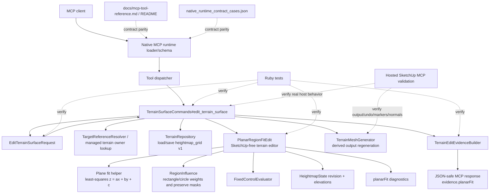

# Technical Plan: MTA-16 Implement Narrow Planar Region Fit Terrain Intent
**Task ID**: `MTA-16`
**Title**: `Implement Narrow Planar Region Fit Terrain Intent`
**Status**: `finalized`
**Date**: `2026-04-29`

## Source Task

- [Implement Narrow Planar Region Fit Terrain Intent](./task.md)

## Problem Summary

Managed terrain callers currently have `survey_point_constraint` for local survey correction and bounded regional smooth correction fields, but that behavior is not planar replacement. The terrain modelling signal and `MTA-13` closeout both exposed a product boundary: sparse controls can define a desired coherent plane, while regional survey correction intentionally preserves terrain detail and may not replace the interior with one plane.

`MTA-16` adds an explicit narrow planar terrain edit intent under the existing `edit_terrain_surface` public tool. The mode fits one coherent plane from caller-supplied controls, applies bounded sample-space planar replacement over existing `heightmap_grid` v1 terrain, respects fixed controls and preserve zones, and returns residual and changed-region evidence. It does not change `survey_point_constraint` behavior.

## Goals

- Add `operation.mode: "planar_region_fit"` to the existing `edit_terrain_surface` tool.
- Accept three or more planar controls over existing rectangle or circle support regions.
- Fit one least-squares plane from all effective controls and report clear residual evidence.
- Apply bounded weighted planar replacement to mutable heightmap samples.
- Respect existing preserve-zone and fixed-control behavior before state save/output mutation.
- Refuse or warn honestly for non-coplanar, contradictory, degenerate, close-control, preserve-zone, fixed-control, grid-spacing, and unsafe sample-delta cases.
- Keep public request and response payloads JSON-safe and free of raw SketchUp objects, generated face IDs, generated vertex IDs, solver matrices, and output-plan internals.
- Move runtime schema, dispatcher, native fixtures, docs, examples, tests, and no-leak coverage together as one public contract change.

## Non-Goals

- Do not change `survey_point_constraint` local or regional behavior.
- Do not reuse `survey_point_constraint` or `constraints.surveyPoints` for planar replacement semantics.
- Do not add a new public MCP tool.
- Do not add freeform polygon regions, localized detail zones, terrain representation v2, or durable planar-control records.
- Do not implement warped exact-fit behavior for arbitrary non-coplanar controls.
- Do not add monotonic profile constraints, edge-fall tools, boundary-preserving patch edits, broad civil grading, drainage, erosion, or terrain simulation.
- Do not move profile sampling or validation acceptance policy into terrain mutation.
- Do not mutate semantic hardscape objects or absorb them into terrain source state.

## Related Context

- [Managed Terrain Surface Authoring HLD](specifications/hlds/hld-managed-terrain-surface-authoring.md)
- [Managed Terrain Surface Authoring PRD](specifications/prds/prd-managed-terrain-surface-authoring.md)
- [SketchUp MCP Domain Analysis](specifications/domain-analysis.md)
- [MCP Tool Authoring Standard for SketchUp Modeling](specifications/guidelines/mcp-tool-authoring-sketchup.md)
- [Ruby Coding Guidelines](specifications/guidelines/ryby-coding-guidelines.md)
- [SketchUp Extension Development Guidance](specifications/guidelines/sketchup-extension-development-guidance.md)
- [Terrain modelling signal](specifications/signals/2026-04-28-terrain-modelling-session-reveals-planar-intent-and-profile-qa-gaps.md)
- [MTA-13 Implement Survey Point Constraint Terrain Edit](specifications/tasks/managed-terrain-surface-authoring/MTA-13-implement-survey-point-constraint-terrain-edit/task.md)
- [MTA-13 Summary](specifications/tasks/managed-terrain-surface-authoring/MTA-13-implement-survey-point-constraint-terrain-edit/summary.md)
- [MTA-14 Evaluate Base Detail Preserving Survey Correction](specifications/tasks/managed-terrain-surface-authoring/MTA-14-evaluate-base-detail-preserving-survey-correction/task.md)
- [MTA-14 Summary](specifications/tasks/managed-terrain-surface-authoring/MTA-14-evaluate-base-detail-preserving-survey-correction/summary.md)
- [MTA-15 Harden Terrain Edit Contract Discoverability](specifications/tasks/managed-terrain-surface-authoring/MTA-15-harden-terrain-edit-contract-discoverability/task.md)
- [MTA-15 Technical Plan](specifications/tasks/managed-terrain-surface-authoring/MTA-15-harden-terrain-edit-contract-discoverability/plan.md)

## Research Summary

- `MTA-13` is completed and implemented `survey_point_constraint` through production terrain-domain collaborators, runtime schema, dispatcher wiring, native fixtures, docs, and hosted validation. Its boundary is central: regional survey correction is bounded smooth correction-field behavior and must not be treated as complete interior planar replacement.
- `MTA-13` hosted validation specifically reclassified complex-terrain-to-plane from four corner points as a future explicit plane/replacement mode. `MTA-16` addresses that product boundary with opt-in planar intent.
- `MTA-14` is completed evaluation work. It provides residual, detail, metric, and refusal lessons, but it is not a public-runtime baseline and must not be imported as `test/support` runtime dependency.
- `MTA-15` is completed and hardened discoverability around current terrain edit intent, including that regional survey correction is not best-fit planar behavior. `MTA-16` must update that baseline to add the explicit planar mode without blurring the existing survey mode.
- `MTA-12` established reusable rectangle/circle `RegionInfluence` behavior and preserve-zone sample-footprint handling. `MTA-16` should reuse those semantics rather than add another region model.
- Calibrated analogs show the main size drivers are public contract breadth, terrain-domain numerical behavior, no-leak evidence, hosted output/undo validation, and contract/docs fixture synchronization.
- A consensus review with `gpt-5.4`, `grok-4.20`, and `grok-4` supported the five core decisions: `planar_region_fit`, `constraints.planarControls`, least-squares plane fit, weighted planar replacement through `RegionInfluence`, and `evidence.planarFit`.

## Technical Decisions

### Data Model

No persisted terrain schema changes are planned.

`heightmap_grid` v1 remains the source of truth. Planar controls are request-time constraints only; they are not persisted as durable records.

Add a new request-time constraints field:

```json
{
  "constraints": {
    "planarControls": [
      {
        "id": "sw",
        "point": { "x": 0.0, "y": 0.0, "z": 1.2 },
        "tolerance": 0.03
      }
    ],
    "fixedControls": [],
    "preserveZones": []
  }
}
```

`constraints.planarControls[]` item shape:

- `id`: optional JSON-safe scalar suitable for evidence.
- `point.x`: required finite number in terrain-state public-meter coordinates.
- `point.y`: required finite number in terrain-state public-meter coordinates.
- `point.z`: required finite number in public meters.
- `tolerance`: optional finite non-negative residual tolerance in meters.

Effective planar tolerance:

```text
control.tolerance || clamp(supportFootprintLength * 0.002, 0.03, 0.15)
```

The support footprint is computed from the edit support region, not the full terrain:

- Rectangle: diagonal length of `region.bounds`.
- Circle: diameter, `2 * radius`.

The default is intentionally size-aware. Small patches default to about `0.03m`; a `50m` support defaults to about `0.10m`; very large supports cap at `0.15m`. Per-control tolerance overrides this default when a caller needs tighter or looser fit behavior.

### API and Interface Design

Public request shape:

```json
{
  "targetReference": { "sourceElementId": "terrain-main" },
  "operation": { "mode": "planar_region_fit" },
  "region": {
    "type": "rectangle",
    "bounds": { "minX": 0.0, "minY": 0.0, "maxX": 20.0, "maxY": 10.0 },
    "blend": { "distance": 2.0, "falloff": "smooth" }
  },
  "constraints": {
    "planarControls": [
      { "id": "sw", "point": { "x": 0.0, "y": 0.0, "z": 1.2 } },
      { "id": "se", "point": { "x": 20.0, "y": 0.0, "z": 1.2 } },
      { "id": "nw", "point": { "x": 0.0, "y": 10.0, "z": 1.7 } }
    ],
    "fixedControls": [],
    "preserveZones": []
  },
  "outputOptions": { "includeSampleEvidence": false, "sampleEvidenceLimit": 20 }
}
```

Internal production shape:

- Add `SU_MCP::Terrain::PlanarRegionFitEdit` under `src/su_mcp/terrain/`.
- Start with one cohesive editor class. Extract `PlanarPlaneFit`, `PlanarControlInputRefusals`, or shared helpers only if implementation complexity justifies it.
- Keep all planar math SketchUp-free and operating on `HeightmapState`.
- Reuse `RegionInfluence` for rectangle/circle weights and preserve-zone sample membership.
- Reuse `FixedControlEvaluator` for fixed-control compatibility against predicted edited elevations.
- Reuse `SampleWindow` for changed-region summary.
- Reuse existing `TerrainSurfaceCommands` save/output/evidence flow.

Plane fit behavior:

- Use all effective controls to fit one least-squares plane in the form `z = ax + by + c`.
- Deduplicate equivalent solve equations where needed for numerical stability while preserving every requested control row in public evidence.
- Require at least three non-collinear effective controls.
- Validate finite fit coefficients.
- Evaluate each planar control against the fitted plane. If any residual exceeds effective tolerance, refuse with `non_coplanar_controls`.

Mutation behavior:

- Candidate samples are samples whose `RegionInfluence#weight_for` is positive.
- Preserve-zone samples are excluded from mutation.
- Full-weight samples are set to the fitted plane elevation.
- Blend-shoulder samples interpolate from original elevation to fitted plane elevation using the existing region weight.
- Fixed controls are checked against predicted edited elevations before save/output mutation.
- A successful edit creates a new `HeightmapState` revision and uses the existing repository/output regeneration flow.

### Public Contract Updates

Request deltas:

- Add `planar_region_fit` to `EditTerrainSurfaceRequest::SUPPORTED_OPERATION_MODES`.
- Add `planar_region_fit => ["rectangle", "circle"]` to region compatibility.
- Add `planar_region_fit => ["rectangle", "circle"]` to preserve-zone compatibility.
- Add `constraints.planarControls`, required non-empty and minimum three valid controls for `planar_region_fit`.
- Validate planar-control point coordinates and tolerance.
- Keep root schema provider-compatible: no root `oneOf`, `anyOf`, or conditional schema branches.

Response deltas:

- Add mode-specific evidence under `evidence.planarFit`.
- Keep shared evidence keys unchanged: `editRegion`, `changedRegion`, `samples`, `sampleSummary`, `fixedControls`, `preserveZones`, `warnings`.
- Do not reuse `evidence.survey`.
- Do not expose solver matrices, normal equations, stencils, output-plan internals, raw SketchUp objects, generated face IDs, generated vertex IDs, or `MTA-13`/`MTA-14` implementation names.

Recommended `evidence.planarFit` shape:

```json
{
  "plane": {
    "equation": { "form": "z = ax + by + c", "a": 0.0, "b": 0.05, "c": 1.2 },
    "normal": { "x": 0.0, "y": -0.0499376, "z": 0.998752 },
    "point": { "x": 10.0, "y": 5.0, "z": 1.45 }
  },
  "controls": [
    {
      "id": "sw",
      "index": 0,
      "point": { "x": 0.0, "y": 0.0 },
      "requestedElevation": 1.2,
      "beforeElevation": 1.0,
      "planeElevation": 1.2,
      "residual": 0.0,
      "tolerance": 0.03,
      "status": "satisfied"
    }
  ],
  "quality": {
    "maxResidual": 0.0,
    "meanResidual": 0.0,
    "rmseResidual": 0.0,
    "normalizedMaxResidual": 0.0
  },
  "supportRegionType": "rectangle",
  "changedSampleCount": 64,
  "fullWeightSampleCount": 36,
  "blendSampleCount": 28,
  "preservedSampleCount": 0,
  "changedBounds": {
    "min": { "column": 0, "row": 0 },
    "max": { "column": 7, "row": 7 }
  },
  "maxSampleDelta": 0.42,
  "grid": {
    "warnings": []
  },
  "warnings": []
}
```

Schema and registration updates:

- Update `src/su_mcp/runtime/native/mcp_runtime_loader.rb` `edit_terrain_surface` descriptions and schemas:
  - operation mode enum and description
  - `constraints.planarControls` array schema
  - operation intent text
  - evidence/output guidance where relevant
- Keep top-level schema shape stable.
- Runtime validation owns mode-specific required fields.

Dispatcher/routing updates:

- Add constructor dependency for `planar_region_fit_editor`, defaulting to `PlanarRegionFitEdit.new`.
- Route `operation.mode: "planar_region_fit"` to that editor.
- Keep `survey_point_constraint` dispatch unchanged.

Contract, fixture, docs, and examples:

- Update `test/support/native_runtime_contract_cases.json`.
- Add native contract cases for at least:
  - successful rectangle planar fit
  - successful circle planar fit
  - missing planar controls
  - invalid planar control shape
  - insufficient controls
  - unsupported corridor region
  - non-coplanar refusal
- Update native loader tests for finite operation modes and `constraints.planarControls` schema.
- Update `docs/mcp-tool-reference.md` operation matrix, intent table, grid-spacing guidance, evidence section, and examples.
- Review `README.md` and update terrain examples if it mirrors operation matrices or terrain evidence vocabulary.

### Error Handling

Validation refusals:

- `missing_required_field`: missing `constraints.planarControls`.
- `invalid_edit_request`: invalid `constraints.planarControls` shape, invalid point numbers, invalid tolerance, invalid output options, invalid region shape.
- `unsupported_option`: unsupported `operation.mode`, unsupported `region.type`, unsupported preserve-zone type for the mode.

Terrain-domain refusals:

- `insufficient_planar_controls`: fewer than three effective planar controls.
- `contradictory_planar_controls`: same XY controls request conflicting elevations beyond effective tolerance.
- `degenerate_planar_control_set`: controls cannot define a stable plane, such as collinear effective controls.
- `planar_control_outside_bounds`: a planar control is outside stored terrain state bounds.
- `planar_control_outside_support_region`: a planar control receives zero support-region weight.
- `planar_control_preserve_zone_conflict`: a planar control is inside a preserve zone.
- `non_coplanar_controls`: best-fit residuals exceed effective tolerances.
- `edit_region_has_no_affected_samples`: no mutable sample remains after region and preserve-zone masking.
- `fixed_control_conflict`: predicted planar replacement would move a fixed control outside tolerance.
- `planar_fit_unsafe`: computed edit requires unsafe sample movement or fails a grid/representation safety check not better represented by a more specific code.
- Existing repository, target resolution, output regeneration, and unsupported-output refusals remain unchanged.

Warnings:

- `close_planar_controls`: at least one pair of planar controls is closer than `max(spacing.x, spacing.y)`.
- `shared_grid_influence`: planar controls share bilinear sample influence, if the implementation can detect it without broad helper work.
- Warnings include affected control IDs, `minDistance`, relevant grid spacing, and a concise implication.
- Grid warnings do not refuse unless another concrete safety failure occurs.

Refusal evidence:

- `non_coplanar_controls` must include per-control residual rows, effective tolerances, `maxResidual`, `meanResidual`, `rmseResidual`, and violating controls.
- Degenerate and contradictory control refusals should include enough public control references for callers to correct the request.

### State Management

- Terrain state remains `payloadKind: "heightmap_grid"` and `schemaVersion: 1`.
- Successful planar edits create a new `HeightmapState` revision.
- Planar controls are not stored as durable state.
- A refused edit must not save state or regenerate output.
- Repository save or output regeneration failure must abort the SketchUp operation through the existing command path.
- Output regeneration strategy remains internal and must not appear in public response output.

### Integration Points

- Native MCP runtime schema advertises the mode and field vocabulary.
- Runtime validation normalizes and refuses mode-specific invalid requests.
- Command layer resolves managed terrain owner, loads state, delegates to `PlanarRegionFitEdit`, saves state, regenerates output, and shapes evidence.
- Terrain-domain editor computes the plane, residuals, warnings, edited elevations, fixed-control summaries, preserve-zone evidence, changed samples, and diagnostics.
- `TerrainEditEvidenceBuilder` passes `diagnostics[:planarFit]` into `evidence.planarFit`.
- Docs and native fixtures serve as public contract parity checks.

### Configuration

No external configuration is planned.

Internal constants should live near the owning validator/editor:

- `DEFAULT_PLANAR_TOLERANCE_RATIO = 0.002`
- `MIN_PLANAR_CONTROL_TOLERANCE = 0.03`
- `MAX_PLANAR_CONTROL_TOLERANCE = 0.15`
- `MATERIAL_DELTA_TOLERANCE = 1e-6`, consistent with existing terrain edit material-change thresholds where practical.

Do not expose solver knobs in the public request for MTA-16.

## Architecture Context



## Key Relationships

- Native schema advertises a provider-compatible optional-field shape; runtime validation owns mode-specific requiredness.
- `EditTerrainSurfaceRequest` owns public request validation and normalization.
- `PlanarRegionFitEdit` owns planar fit math and heightmap mutation, but not target resolution, persistence, output regeneration, or SketchUp API access.
- `TerrainSurfaceCommands` owns mutation lifecycle and preserves coherent undo/save/output behavior.
- `TerrainEditEvidenceBuilder` owns JSON-safe response shaping.
- `survey_point_constraint` remains a separate editor, request path, and evidence namespace.
- Profile sampling remains owned by scene targeting/interrogation and measurement/review surfaces.

## Acceptance Criteria

- `edit_terrain_surface` accepts `operation.mode: "planar_region_fit"` for `rectangle` and `circle` regions, and refuses unsupported region types with finite `allowedValues`.
- `planar_region_fit` requires `constraints.planarControls` with at least three valid, non-collinear effective controls.
- Planar controls use terrain-state public-meter coordinates and support optional per-control tolerance overrides.
- Default planar control tolerance is computed from support footprint length as `clamp(supportFootprintLength * 0.002, 0.03, 0.15)`.
- Coplanar controls fit successfully, and full-weight mutable samples in the support region are set to the fitted plane within effective tolerance.
- Blend shoulder samples interpolate from pre-edit terrain elevation toward fitted plane elevation using existing region blend semantics.
- Preserve-zone samples are not mutated, and preserve-zone evidence reports protected sample behavior.
- Fixed controls are evaluated against the predicted edited terrain and refuse before state save/output mutation when they would drift outside tolerance.
- Same-XY contradictory planar controls refuse with structured planar-control conflict data.
- Fewer than three controls, collinear controls, controls outside terrain bounds, controls outside support, and controls inside preserve zones refuse with structured, mode-accurate reason data.
- Non-coplanar controls whose fitted residual exceeds effective tolerance refuse with `non_coplanar_controls` and include per-control residual evidence.
- Close controls or shared grid influence produce structured warnings when the edit is still otherwise safe.
- Successful responses include `evidence.planarFit` with plane equation, normal, reference point, quality metrics, per-control residual rows, changed-region summary, max sample delta, warnings, and JSON-safe values only.
- Public responses do not expose solver matrices, raw SketchUp objects, generated face IDs, generated vertex IDs, output-plan internals, or MTA-13/MTA-14 implementation names.
- Existing `survey_point_constraint` request behavior, response namespace `evidence.survey`, and regional smooth correction semantics remain unchanged.
- Terrain state remains `heightmap_grid` schema version `1`; no new persisted representation, localized detail zone, or durable planar-control record is introduced.
- Successful edits create a new terrain-state revision, save it through the existing repository path, regenerate derived output, and return output digest evidence consistent with current terrain edit responses.
- Repository save failure or output regeneration failure does not leave a committed partial edit as the expected state.
- Native loader schema, runtime validation, native contract fixtures, docs, and examples describe the same `planar_region_fit` contract.
- Hosted/public MCP validation covers at least one rectangle planar fit, one circle planar fit, blend behavior, fixed-control refusal, preserve-zone protection, non-coplanar refusal, transformed or non-zero-origin terrain, undo, derived output markers/normals, and larger-terrain performance sanity.

## Test Strategy

### TDD Approach

Use contract-first and domain-first TDD.

1. Start with failing request validation and native loader tests for `planar_region_fit`.
2. Add failing `PlanarRegionFitEdit` tests for the mathematical and mutation behavior before wiring command dispatch.
3. Add command dispatch and evidence no-leak tests after the editor contract is stable.
4. Update docs and native fixtures once response shape is settled.
5. Run hosted validation after automated contract/domain/command coverage passes.

### Required Test Coverage

Request and schema tests:

- `EditTerrainSurfaceRequestTest` accepts minimal planar region fit rectangle request.
- Accepts circle request with blend defaults.
- Refuses corridor region with allowed values `["rectangle", "circle"]`.
- Refuses missing `constraints.planarControls`.
- Refuses invalid point shape, non-finite numbers, negative tolerance, non-array controls.
- Refuses fewer than three controls.
- Normalizes effective tolerance using support footprint when tolerance is omitted.
- Preserves explicit per-control tolerance.
- Native loader exposes `planar_region_fit` enum and `constraints.planarControls` item schema.

Terrain-domain tests:

- Exact coplanar rectangle fit updates full-weight samples to the plane.
- Exact coplanar circle fit updates only positively weighted circular samples.
- Blend shoulder interpolates existing terrain toward fitted plane.
- Near-coplanar controls succeed when residuals are within effective tolerance.
- Non-coplanar controls refuse with residual details when residuals exceed effective tolerance.
- Same-XY contradictory controls refuse.
- Collinear controls refuse.
- Controls outside terrain bounds refuse.
- Controls outside support refuse.
- Controls inside preserve zones refuse.
- Preserve-zone samples remain unchanged.
- Fixed-control conflict refuses before edit success.
- Fully protected or zero-mutable support refuses.
- Close controls emit warning when otherwise safe.
- No-data terrain refuses.
- Non-zero origin and non-uniform/fractional spacing produce correct fit/mutation behavior.

Command and evidence tests:

- `TerrainSurfaceCommands` dispatches `planar_region_fit` to the planar editor.
- Successful edit increments revision, saves state, regenerates output, and emits dirty-window/changed-region output plan.
- Repository/output refusals abort through existing command behavior.
- `TerrainEditEvidenceBuilder` exposes `evidence.planarFit`.
- No-leak contract test proves planar evidence does not expose solver matrices, stencils, output-plan internals, raw SketchUp objects, generated face IDs, or vertex IDs.
- Regression test proves `survey_point_constraint` behavior and `evidence.survey` remain unchanged.

Native contract/docs tests:

- Add native fixture success and refusal cases.
- Existing native transport contract tests continue to pass.
- Docs operation matrix, intent table, evidence table, and examples align with runtime schema.
- Docs describe the support-footprint tolerance formula with concrete rectangle/circle examples, including that the support footprint is not the full terrain size.

Hosted validation:

- Public MCP rectangle planar fit on created managed terrain.
- Public MCP circle planar fit.
- Blend shoulder planar fit.
- Preserve-zone protection.
- Fixed-control refusal.
- Non-coplanar refusal with residual evidence.
- Transformed or non-zero-origin terrain control coordinates.
- Evidence coordinate-frame parity for transformed or non-zero-origin terrain, proving planar-control points, fitted plane reference point, and changed bounds are reported in terrain-state public-meter coordinates rather than generated output/world-object identifiers.
- Fractional or non-uniform spacing.
- Undo restores state/output.
- Derived face/edge markers and normals remain sane.
- Larger terrain sanity/performance case, reusing `MTA-13` scale expectations where practical.

## Instrumentation and Operational Signals

No persistent runtime instrumentation is required.

Operational proof comes from response evidence and validation artifacts:

- `evidence.planarFit.quality.maxResidual`
- `evidence.planarFit.quality.rmseResidual`
- `evidence.planarFit.changedSampleCount`
- `evidence.planarFit.maxSampleDelta`
- grid warnings, especially `close_planar_controls`
- preserve-zone protected sample count and drift behavior
- fixed-control summaries
- hosted wall-clock timing and runtime responsiveness for larger terrain sanity checks

## Implementation Phases

1. Contract skeleton.
   - Add failing validator tests for mode, region compatibility, `planarControls`, tolerance normalization, and refusal shape.
   - Add failing native loader/schema tests.
   - Add fixture placeholders only after expected response shape is decided.
2. Terrain-domain editor skeleton.
   - Add `PlanarRegionFitEdit` tests for exact rectangle/circle planar replacement.
   - Implement minimum editor behavior: fit plane, compute candidate sample weights, produce edited state and diagnostics.
3. Safety and refusal coverage.
   - Add tests and implementation for insufficient, contradictory, degenerate, out-of-bounds, out-of-support, preserve-zone, fixed-control, non-coplanar, no-data, no-affected-samples, and grid-warning cases.
4. Command and evidence integration.
   - Wire `TerrainSurfaceCommands`.
   - Add `TerrainEditEvidenceBuilder` pass-through.
   - Add command dispatch, revision/output, dirty-window, and no-leak tests.
5. Public contract artifacts.
   - Update native fixtures.
   - Update `docs/mcp-tool-reference.md`.
   - Review and update `README.md` if terrain examples or operation matrices are mirrored there.
6. Automated validation.
   - Run focused terrain/request/runtime tests.
   - Run full Ruby test suite if practical.
   - Run RuboCop for changed Ruby files or repository lint target.
   - Run package verification if runtime code changed.
   - Run `git diff --check`.
7. Hosted validation.
   - Deploy/run public MCP cases in SketchUp for representative planar edits, refusals, undo, output markers/normals, and larger terrain sanity.
   - Record validation evidence and any gaps.

## Rollout Approach

- Ship as one coordinated extension runtime update to the existing `edit_terrain_surface` tool.
- Existing terrain edit modes remain valid and unchanged.
- Unsupported planar requests refuse rather than falling back to survey correction or target-height behavior.
- No migration is required because persisted terrain state remains `heightmap_grid` v1.
- No feature flag is planned; the public mode is discoverable once schema, docs, fixtures, and runtime support are all present.

## Risks and Controls

- Contract drift: Update validator constants, native schema, fixture cases, docs, examples, and no-leak tests in the same change.
- Survey semantic regression: Keep a dedicated editor and evidence namespace; add regression coverage for `survey_point_constraint`.
- Planarity overclaim: State and test that the fitted-plane guarantee applies to full-weight mutable samples only; blend shoulder and preserve-zone samples must be represented separately in evidence.
- Residual threshold misuse: Use size-aware tolerance defaults, per-control overrides, explicit residual evidence, and refusal above effective tolerance.
- Degenerate plane math: Deduplicate effective controls, require non-collinearity, validate finite coefficients, and refuse unstable fits.
- Grid-spacing surprises: Emit close-control/shared-grid warnings and rely on concrete residual/fixed/preserve/sample-delta failures for refusals.
- Preserve/fixed conflict ordering: Exclude preserve samples before mutation and evaluate fixed controls before save/output mutation.
- Host output mismatch: Hosted validation must cover transformed/non-zero-origin terrain, output markers, normals, undo, and larger terrain.
- Performance scaling: Reuse changed-region/output flow and validate a larger terrain case.
- Description bloat: Keep native schema descriptions concise; place richer examples in docs.
- Over-abstraction: Start with one cohesive `PlanarRegionFitEdit`; extract only when the implementation demonstrates real complexity.

## Premortem Gate

Status: WARN

### Unresolved Tigers

- None.

### Plan Changes Caused By Premortem

- Added evidence counts for full-weight, blend-shoulder, and preserved samples so implementation does not overclaim that every affected sample is exactly planar.
- Strengthened hosted validation for transformed or non-zero-origin terrain by requiring evidence coordinate-frame parity for controls, fitted plane reference point, and changed bounds.
- Added docs parity coverage for the support-footprint tolerance formula and concrete examples, including that the footprint is the edit region size rather than the full terrain size.

### Accepted Residual Risks

- Risk: `heightmap_grid` v1 may still be too coarse for some caller expectations even when planar math is correct.
  - Class: Paper Tiger
  - Why accepted: The task explicitly stays on `heightmap_grid` v1 and requires warnings or refusals for representation limits rather than adding localized detail zones.
  - Required validation: Close-control warnings, residual refusals, fixed/preserve conflict tests, and hosted larger-terrain sanity.
- Risk: Hosted SketchUp output behavior may expose transform, marker, normal, undo, or performance defects outside the planar editor.
  - Class: Elephant
  - Why accepted: The implementation plan already carries hosted validation as an acceptance gate; no pre-implementation redesign is justified without failing host evidence.
  - Required validation: Public MCP hosted matrix covering transformed/non-zero-origin terrain, output markers/normals, undo, and larger terrain.

### Carried Validation Items

- Contract drift check across validator constants, native loader schema, native fixtures, docs, examples, dispatcher, evidence, and no-leak tests.
- Hosted MCP rectangle and circle planar fits, blend behavior, fixed-control refusal, preserve-zone protection, non-coplanar refusal, transformed/non-zero-origin terrain, undo, output markers/normals, and larger-terrain performance sanity.
- Coordinate-frame parity check proving public evidence remains terrain-state/public-meter based and does not leak generated SketchUp entity identifiers.
- Tolerance-policy docs and tests showing `clamp(supportFootprintLength * 0.002, 0.03, 0.15)` for rectangle diagonal and circle diameter.

### Implementation Guardrails

- Do not change `survey_point_constraint` semantics or reuse `evidence.survey` for planar replacement.
- Do not fall back from failed planar fit to survey correction, target-height, or warped exact-fit behavior.
- Do not claim all changed samples are exactly planar; the exact-plane guarantee applies to full-weight mutable samples, while blend and preserve samples must be separately reported.
- Do not expose raw SketchUp objects, generated face IDs, generated vertex IDs, solver matrices, output-plan internals, or implementation names in public evidence.
- Do not widen MTA-16 into localized detail zones, freeform regions, durable planar-control records, or terrain representation v2.

## Dependencies

- Completed `MTA-13`, `MTA-14`, and `MTA-15`.
- Existing `heightmap_grid` v1 state, serializer, repository, and terrain output regeneration.
- Existing rectangle/circle region and preserve-zone behavior through `RegionInfluence`.
- Existing fixed-control evaluation.
- Existing native loader, runtime dispatcher, contract fixture, and test infrastructure.
- Hosted SketchUp/MCP validation access for final runtime proof.

## Quality Checks

- [x] All required inputs validated
- [x] Problem statement documented
- [x] Goals and non-goals documented
- [x] Research summary documented
- [x] Technical decisions included
- [x] Architecture context included
- [x] Acceptance criteria included
- [x] Test requirements specified
- [x] Instrumentation and operational signals defined when needed
- [x] Risks and dependencies documented
- [x] Rollout approach documented when needed
- [x] Small reversible phases defined
- [x] Planning-stage size estimate considered before premortem finalization
- [x] Premortem completed with falsifiable failure paths and mitigations
