# Technical Plan: MTA-18 Implement Minimal Bounded Managed Terrain Visual Edit UI
**Task ID**: `MTA-18`
**Title**: `Implement Minimal Bounded Managed Terrain Visual Edit UI`
**Status**: `finalized`
**Date**: `2026-05-07`

## Source Task

- [Implement Minimal Bounded Managed Terrain Visual Edit UI](./task.md)

## Problem Summary

Managed terrain edits already route through safe command behavior, managed terrain state, output regeneration, and JSON-safe evidence, but numeric MCP-only iteration is too indirect for small visual grading work. MTA-18 implements the smallest SketchUp-facing UI slice: one `Managed Terrain` toolbar container with one initial `Target Height Brush` toolbar button/menu entry, one non-modal settings dialog, and one click tool that applies the existing circular `target_height` edit to the currently selected managed terrain owner.

The UI is an interaction surface only. Durable mutation remains owned by the managed terrain command path.

## Goals

- Add the initial `Managed Terrain` SketchUp toolbar container and one menu-reachable `Target Height Brush` command for a circular managed terrain target-height brush.
- Capture target elevation, radius, blend distance, and falloff/profile in a compact non-modal dialog.
- Apply one bounded circular `target_height` edit per valid model click against the currently selected managed terrain owner.
- Build the existing `edit_terrain_surface` request shape without changing public MCP contracts.
- Preserve managed terrain state, repository persistence, output regeneration, evidence, and undo ownership in the existing command path.
- Provide clear success/refusal feedback and local-first automated validation with a narrow SketchUp-hosted smoke for host-owned UI lifecycle behavior.

## Non-Goals

- Multiple brush modes, custom region drawing, continuous strokes, pressure-sensitive behavior, or live sculpting.
- Raw generated mesh/TIN editing as durable terrain source state.
- Persistent preview geometry, broad live preview overlays, validation dashboards, or sample evidence controls.
- Public MCP schema, dispatcher, fixture, or contract changes.
- Replacing MCP sampling, profile measurement, validation, labeling, redrape, or capture workflows.
- Solving localized-detail representation limits owned by `MTA-11`.

## Related Context

- [Managed Terrain Surface Authoring HLD](specifications/hlds/hld-managed-terrain-surface-authoring.md)
- [SketchUp Extension Development Guidance](specifications/guidelines/sketchup-extension-development-guidance.md)
- [Ruby Coding Guidelines](specifications/guidelines/ryby-coding-guidelines.md)
- [Task Estimation Taxonomy](specifications/guidelines/task-estimation-taxonomy.md)
- Prior managed terrain edit analogs: `MTA-04`, `MTA-12`, `MTA-13`, `MTA-16`
- Selection/targeting analog: `PLAT-15`

## Research Summary

- `TerrainSurfaceCommands#edit_terrain_surface` already validates requests, resolves managed terrain targets, loads/saves terrain state, applies editors, regenerates output, returns JSON-safe evidence/refusals, and owns the SketchUp operation boundary.
- Circular regions are already supported for `target_height`; the UI should build that request rather than introduce new terrain math.
- `src/su_mcp/main.rb` currently owns only extension activation, menu installation, and MCP server lifecycle actions. Terrain UI behavior should live under a named support area and be installed by delegation.
- Official SketchUp API research supports `UI::Toolbar`/`UI::Command` for activation, non-modal `UI::HtmlDialog` for settings, and `Sketchup::Tool`/`InputPoint` for click capture. Real toolbar checked state, dialog callback lifecycle, and tool click behavior need narrow hosted smoke.
- Local terrain-editor prior art supports a central editable UI state owner, transient tool feedback, and separation of brush point capture from durable apply behavior. Continuous strokes, pressure, rich previews, and target layers remain follow-up scope.

## Technical Decisions

### Data Model

- Add a terrain UI support area under `src/su_mcp/terrain/ui/`.
- Use one Ruby session/controller as the source of truth for:
  - active brush mode, fixed to `target_height`;
  - settings: target elevation, radius, blend distance, falloff/profile;
  - active/inactive toolbar state;
  - dialog readiness/visibility;
  - selected terrain status;
  - latest success/refusal feedback.
- Use JSON-safe state snapshots for dialog communication. Do not expose raw SketchUp objects outside the UI adapter/controller boundary.
- Represent request settings in public terrain units before command invocation:
  - target elevation in public meters;
  - region center in owner-local public-meter XY;
  - radius in public meters;
  - blend distance in public meters;
  - falloff in the existing finite set: `none`, `linear`, `smooth`.

### API and Interface Design

- `main.rb` delegates installation to terrain UI code. It does not own brush state, dialog callbacks, coordinate conversion, or request construction.
- Toolbar/menu command behavior:
  - activate the target-height brush session;
  - show/focus the settings dialog;
  - select the SketchUp brush tool on the active model;
  - report active checked state through command validation where supported.
- Dialog behavior:
  - non-modal;
  - packaged HTML/JS/CSS;
  - callbacks for ready/state request/settings update/close;
  - selected-terrain/status row visible in the compact palette.
- Tool behavior:
  - capture click/input point and delegate to the session;
  - optionally draw a transient radius ring only if simple and host-verified;
  - never start its own model operation or mutate terrain directly.
- Session apply behavior:
  - resolve exactly one selected managed terrain owner;
  - convert click point to owner-local public-meter XY;
  - build the existing circular `target_height` request;
  - call `TerrainSurfaceCommands#edit_terrain_surface`;
  - map success/refusal into dialog/status feedback.

### Public Contract Updates

Not applicable by default. MTA-18 must preserve the existing public `edit_terrain_surface` contract.

If implementation discovers the current contract is insufficient, the task must explicitly add and review updates for `src/su_mcp/runtime/native/native_tool_catalog.rb`, dispatcher/facade routing, native contract fixtures, docs, examples, and command tests in the same change. That is treated as contract drift, not a routine implementation detail.

### Error Handling

- Invalid settings refuse in the UI session before command invocation where possible and display concise feedback.
- Empty selection, multiple selection, non-terrain selection, stale owner, unsupported child/derived-output selection, failed state load, and command refusal all produce visible status.
- Selection is resolved at apply time, not only when the toolbar command activates, so stale or changed selection cannot silently edit the wrong terrain.
- Positive blend distance with `none` falloff is an invalid UI setting and must refuse before command invocation; `none` is valid only for zero blend distance.
- Dialog feedback is preferred when visible; SketchUp status text is appropriate for routine tool guidance; message boxes are reserved for blocking refusals or dialog-unavailable failures.
- Ruby-to-dialog pushes are best-effort. Terrain mutation correctness must not depend on post-apply HTML updates.

### State Management

- Session state is the only shared state between toolbar, dialog, and tool.
- Dialog close/reopen must re-register callbacks or recreate a callback-bound dialog wrapper.
- Defaults:
  - target elevation starts unset and must be explicitly provided before a click can mutate terrain;
  - radius defaults to `2.0` public meters unless implementation safely derives and displays a terrain-spacing-aware value;
  - blend distance defaults to `0.0` public meters;
  - falloff defaults to `none`, and positive blend should use an explicit selected `linear` or `smooth` value.
- Settings should use SketchUp length parsing/formatting where practical, then normalize to public-meter floats for request construction.

### Integration Points

- `src/su_mcp/main.rb` -> terrain UI installer.
- Terrain UI installer -> SketchUp toolbar/menu APIs.
- Dialog wrapper -> `UI::HtmlDialog` callbacks and packaged assets.
- Brush tool -> `Sketchup::Tool`, view/input point, and optional pick helper.
- Selected terrain resolver -> active model selection and existing managed terrain identity fields.
- Coordinate converter -> clicked SketchUp world/internal point, selected owner transform, public-meter conversion.
- Session -> `TerrainSurfaceCommands#edit_terrain_surface`.
- Command path -> existing request validation, target resolution, repository load/save, edit engine, output regeneration, evidence/refusal response, and undo operation.

### Configuration

- No new global configuration is required.
- First-slice user settings are session-scoped unless implementation can safely persist small UI preferences without adding storage risk.
- Packaged asset paths must be relative to the extension support tree and verified through package checks.

## Architecture Context

```mermaid
flowchart TD
  subgraph SketchUpHost["SketchUp Host Boundary"]
    Toolbar["UI::Toolbar / UI::Command"]
    Menu["Extensions menu mirror"]
    Dialog["UI::HtmlDialog"]
    Tool["Sketchup::Tool"]
    View["View / InputPoint / PickHelper"]
    Model["Sketchup.active_model / selection / undo stack"]
  end

  subgraph TerrainUI["src/su_mcp/terrain/ui"]
    Installer["Toolbar/Menu Installer"]
    Session["BrushEditSession\nsingle UI state owner"]
    Settings["BrushSettings\nlength/falloff normalization"]
    DialogWrap["SettingsDialog wrapper\nready/callback protocol"]
    BrushTool["TargetHeightBrushTool\nclick/input delegation"]
    Selection["SelectedTerrainResolver"]
    Coordinates["BrushCoordinateConverter"]
    Feedback["Feedback/status mapper"]
    Assets["packaged SVG + HTML/CSS/JS"]
  end

  subgraph ExistingRuntime["Existing Managed Terrain Runtime"]
    Commands["TerrainSurfaceCommands#edit_terrain_surface"]
    Request["EditTerrainSurfaceRequest"]
    TargetResolver["TargetReferenceResolver"]
    Repository["TerrainRepository"]
    EditEngine["BoundedGradeEdit / circle region"]
    Output["TerrainMeshGenerator / TerrainOutputPlan"]
    Response["ToolResponse success/refusal evidence"]
  end

  subgraph LocalTests["Local Automated Proof"]
    SeamTests["adapter/session/dialog protocol tests"]
    ConversionTests["unit + transform conversion tests"]
    RequestTests["request shape + command-boundary tests"]
    PackageTests["package asset verification"]
  end

  subgraph HostedSmoke["Narrow SketchUp-Hosted Smoke"]
    HostUI["toolbar check/menu/dialog lifecycle"]
    HostClick["real Tool click/InputPoint"]
    HostUndo["visible mutation/refusal + undo"]
  end

  Main["src/su_mcp/main.rb"] --> Installer
  Installer --> Toolbar
  Installer --> Menu
  Toolbar --> Session
  Menu --> Session
  Session <--> DialogWrap
  DialogWrap <--> Dialog
  Session --> BrushTool
  BrushTool --> Tool
  Tool --> View
  Session --> Selection
  Selection --> Model
  Session --> Coordinates
  Coordinates --> View
  Coordinates --> Model
  Session --> Settings
  Session --> Commands
  Commands --> Request
  Commands --> TargetResolver
  Commands --> Repository
  Commands --> EditEngine
  Commands --> Output
  Commands --> Response
  Response --> Feedback
  Feedback --> Session
  Session --> DialogWrap
  Assets --> DialogWrap
  Assets --> Installer

  SeamTests -.prove.-> Session
  SeamTests -.prove.-> DialogWrap
  SeamTests -.prove.-> Installer
  ConversionTests -.prove.-> Coordinates
  RequestTests -.prove.-> Commands
  PackageTests -.prove.-> Assets
  HostUI -.smoke.-> Toolbar
  HostUI -.smoke.-> Dialog
  HostClick -.smoke.-> Tool
  HostClick -.smoke.-> View
  HostUndo -.smoke.-> Model
```

## Key Relationships

- Terrain UI owns interaction orchestration only; terrain command/use-case code owns durable edits.
- Toolbar, menu, dialog, and tool communicate through the Ruby session/controller rather than directly with each other.
- The selected managed terrain owner is authoritative; click location supplies only the brush center.
- Coordinate conversion is a first-class seam and must be proven locally before hosted smoke.
- Existing terrain command/repository/output tests remain the proof for terrain mutation semantics; UI tests prove request construction and boundary preservation.

## Acceptance Criteria

- The SketchUp extension exposes one `Managed Terrain` toolbar container with one `Target Height Brush` button and menu-reachable equivalent.
- The `Target Height Brush` toolbar command uses a packaged SVG icon and can represent active state where SketchUp supports checked command validation.
- Activating the command opens or focuses a non-modal settings dialog and selects the terrain brush tool without adding brush/session logic to `main.rb`.
- The dialog exposes only target elevation, radius, blend distance, falloff/profile, and selected-terrain/status controls.
- Dialog updates flow into Ruby session state through JSON-safe callbacks, and Ruby can push state/status back after dialog readiness.
- Closing and reopening the dialog does not leave stale callbacks or stale session state.
- With one selected managed terrain owner and valid settings, one click applies one circular `target_height` edit through the existing command path.
- The generated request uses the existing `target_height` circular region shape with `targetReference`, `operation.targetElevation`, `region.center`, `region.radius`, and normalized `region.blend`.
- Click coordinates are converted into selected-owner-local public-meter XY before request construction.
- Local tests prove non-zero-origin and transformed-owner conversion cases.
- Invalid selection, invalid settings, failed state load, command refusal, or no affected samples produce visible refusal feedback without raw mesh mutation.
- Selection/status is refreshed at apply time so changed selection between toolbar activation and click cannot silently edit the wrong terrain.
- The UI layer does not start its own model operation around the command call.
- Success/refusal feedback is visible through dialog status where available and appropriate SketchUp feedback otherwise.
- No public MCP registration, schema, dispatcher, fixture, or docs changes are made unless explicitly justified as contract drift.
- Packaged SVG/HTML/CSS/JS assets are included in package verification.
- Broad sculpting, continuous strokes, pressure-sensitive behavior, raw TIN editing, persistent preview geometry, validation dashboards, and multiple brush modes remain absent.

## Test Strategy

### TDD Approach

1. Start with settings/request tests: normalize length inputs, finite falloff values, defaults, invalid settings, and exact circular `target_height` request shape.
2. Add selected-terrain resolver tests for empty, multiple, non-terrain, managed owner, selection drift between activation and click, and optional child/derived-output normalization.
3. Add coordinate conversion tests using fake/injectable transforms for non-zero-origin and transformed-owner cases.
4. Add session tests that prove click apply invokes `TerrainSurfaceCommands#edit_terrain_surface`, maps success/refusal feedback, and does not start model operations directly.
5. Add toolbar/dialog/tool adapter tests before wiring real SketchUp APIs.
6. Add package verification and docs checks once assets and README/docs updates exist.
7. Run narrow SketchUp-hosted smoke after local proof passes, including apply-time selection/status refresh.

### Required Test Coverage

- Settings normalization and JSON-safe state snapshots.
- Dialog callback registration, ready-state queuing, settings updates, close/reopen handling, and status payloads through a wrapper seam.
- Toolbar/menu installation delegation and active-state calculation.
- Brush tool activation and click delegation through injectable model/view/tool seams.
- Selected owner resolution and refusal outcomes.
- Selection drift between activation and click.
- Owner-local/public-meter coordinate conversion.
- Command request shape and command invocation.
- Success/refusal feedback mapping.
- No raw SketchUp object leakage from controller-facing results.
- No UI-owned model operation around command invocation.
- Package asset presence for SVG and dialog files.
- Hosted smoke for toolbar display/check state, non-modal dialog lifecycle, real click/InputPoint integration, apply-time selection/status refresh, visible mutation/refusal, undo, and optional radius drawing.

## Instrumentation and Operational Signals

- Dialog/status messages should expose enough state to understand ready, invalid settings, invalid selection, applied, and refused states.
- Hosted smoke notes should record whether toolbar check state, dialog close/reopen, click apply, apply-time selection/status refresh, transformed/non-origin click conversion, and undo passed.
- No long-lived telemetry is required for this first slice.

## Implementation Phases

1. Create `src/su_mcp/terrain/ui/`, packaged asset path, and injectable UI host seams for toolbar/dialog/tool tests.
2. Implement and test settings normalization, length parsing/formatting seam, falloff validation, defaults, and circular `target_height` request builder.
3. Implement and test selected-owner resolution, coordinate conversion, feedback mapping, and no-direct-operation guard.
4. Implement and test the brush edit session over `TerrainSurfaceCommands#edit_terrain_surface`.
5. Wire toolbar/menu registration, SVG icon, active checked state, and `Sketchup::Tool` click-to-apply delegation.
6. Implement packaged compact `HtmlDialog`, callback lifecycle, selected-terrain/status row, and best-effort Ruby-to-dialog status pushes.
7. Add optional transient radius ring only if simple and cleanly validated; otherwise keep status/input-point feedback as the accepted baseline.
8. Update SketchUp UI docs, run focused Ruby tests, run package verification, and perform narrow hosted smoke.

## Rollout Approach

- Ship behind the normal extension UI entrypoint with no public MCP contract change.
- If host smoke reveals toolbar/dialog/tool lifecycle failure, keep local proof intact and document the host-integration gap rather than broadening the task.
- If transformed-owner click conversion cannot be confirmed in SketchUp, preserve local conversion tests and document the hosted limitation explicitly.
- Optional radius drawing can be skipped without failing the task.

## Risks and Controls

- Host UI API mismatch: wrap toolbar/dialog/tool calls and keep hosted smoke narrow for actual SketchUp behavior.
- Dialog callback lifecycle: use dialog-ready protocol, re-register callbacks on show/recreate, and test close/reopen locally.
- Coordinate conversion: isolate conversion and prove non-zero-origin/transformed math locally before hosted smoke.
- Selection ambiguity or drift: resolve selection at apply time, refuse empty, multiple, and non-terrain selections visibly, and keep selected owner authoritative.
- Undo semantics: do not create UI model operations; route durable mutation through `TerrainSurfaceCommands`.
- Contract drift: pin UI request builder to existing public request shape and treat any schema/docs/fixture changes as explicit drift.
- Asset packaging: keep assets under the extension support tree and run package verification.
- Scope creep: reject multi-brush systems, continuous strokes, pressure, persistent previews, and validation panels in MTA-18.
- Host smoke unavailable: preserve local validation and document the specific remaining UI lifecycle gap.

## Dependencies

- Existing `edit_terrain_surface` circular `target_height` behavior.
- Existing managed terrain owner metadata and target-reference resolution.
- Existing terrain repository, output regeneration, and command-owned undo operation behavior.
- SketchUp UI APIs for toolbar, command validation, non-modal dialog, tool selection, input points, view drawing, and selection.
- RBZ package staging/verification.
- SketchUp-hosted smoke access for final UI lifecycle checks.

## Premortem Gate

Status: PASS

### Unresolved Tigers

- None.

### Plan Changes Caused By Premortem

- Added apply-time selection resolution/status refresh so activation-time selection cannot become a stale target.
- Added explicit UI refusal for positive blend distance with `none` falloff before command invocation.
- Added selection-drift and apply-time status refresh coverage to local tests and hosted smoke.

### Accepted Residual Risks

- Risk: SketchUp host UI lifecycle still differs from adapter assumptions.
  - Class: Paper Tiger
  - Why accepted: The plan isolates host calls behind wrappers and keeps durable behavior locally testable.
  - Required validation: Narrow hosted smoke for toolbar checked state, dialog close/reopen, real tool click/InputPoint, visible mutation/refusal, and undo.
- Risk: Optional transient radius drawing may be skipped.
  - Class: Paper Tiger
  - Why accepted: Required acceptance is input-point/status feedback plus reliable click-to-apply/refusal.
  - Required validation: If implemented, hosted smoke must prove drawing is transient and leaves no persistent geometry.
- Risk: Derived-output click/selection normalization may not be included.
  - Class: Elephant
  - Why accepted: First-slice target model is selected managed terrain owner; derived-output normalization is explicitly optional and non-blocking.
  - Required validation: Resolver tests must either prove supported normalization or visible refusal.

### Carried Validation Items

- Local conversion tests for non-zero-origin and transformed-owner click mapping.
- Local dialog protocol tests for ready-state, callback re-registration, close/reopen, and stale callback prevention.
- Package verification for SVG and dialog assets.
- Hosted smoke for toolbar/menu/dialog/tool lifecycle, apply-time selected-terrain/status row, click apply, visible refusal, undo, and optional transient radius ring.

### Implementation Guardrails

- Do not mutate terrain or generated mesh from toolbar, dialog, or tool event handlers.
- Do not start UI-owned SketchUp model operations around the managed command call.
- Do not change public MCP schemas, dispatcher, native fixtures, or MCP docs unless contract drift is explicitly declared and handled in the same change.
- Do not add continuous strokes, pressure-sensitive behavior, persistent previews, multiple brush modes, or evidence dashboards in MTA-18.
- Do not expose raw SketchUp objects across controller-facing results or dialog payloads.

## Quality Checks

- [x] All required inputs validated
- [x] Problem statement documented
- [x] Goals and non-goals documented
- [x] Research summary documented
- [x] Technical decisions included
- [x] Architecture context included
- [x] Acceptance criteria included
- [x] Test requirements specified
- [x] Instrumentation and operational signals defined when needed
- [x] Risks and dependencies documented
- [x] Rollout approach documented when needed
- [x] Small reversible phases defined
- [x] Premortem completed with falsifiable failure paths and mitigations
- [x] Planning-stage size estimate considered before premortem finalization
