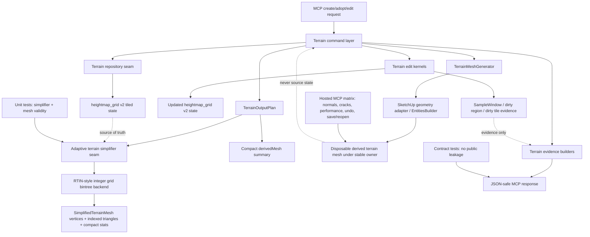

# Technical Plan: MTA-19 Implement Detail Preserving Adaptive Terrain Output Simplification
**Task ID**: `MTA-19`
**Title**: `Implement Detail Preserving Adaptive Terrain Output Simplification`
**Status**: `finalized; revised after live topology evidence`
**Date**: `2026-05-01`
**Last Updated**: `2026-05-02`

## Source Task

- [Implement Detail Preserving Adaptive Terrain Output Simplification](./task.md)

## Problem Summary

MTA-11 proved tiled `heightmap_grid` v2 state and first adaptive SketchUp output generation. The
first adaptive output path is intentionally simple: it recursively subdivides rectangular regions
using corner-fit error and emits two triangles per accepted region. That works for flat and planar
terrain and keeps public responses compact, but it is not yet a strong detail-preserving terrain
meshing strategy.

MTA-19 improves the derived adaptive terrain output while preserving the current source-of-truth
model: `heightmap_grid` v2 terrain state remains authoritative, generated SketchUp mesh remains
disposable output, and public MCP responses stay compact.

## Goals

- Improve adaptive output fidelity and face-count efficiency beyond the MTA-11 first slice.
- Preserve ridges, valleys, saddles, localized bumps, crossfall planes, hard grade breaks, and
  planar-fit regions within documented simplification tolerance.
- Keep flat, planar, smooth-slope, and simplified edit regions aggressively simplified.
- Keep public terrain tool request shapes and payload kind stable.
- Keep `output.derivedMesh` compact; detailed proof belongs in automated and hosted validation.
- Prove output quality, artifact safety, and performance through tests and live MCP verification.

## Non-Goals

- Do not change `terrainState.payloadKind: "heightmap_grid"`.
- Do not add a public simplification algorithm selector.
- Do not expose selected vertices, raw triangles, split trees, tile internals, solver internals,
  generated face IDs, or generated vertex IDs in MCP responses.
- Do not implement global greedy Delaunay, constrained Delaunay, breakline preservation, or
  global mesh optimization in this first production slice.
- Do not implement adaptive partial regeneration or adaptive face ownership metadata.
- Do not change terrain edit modes or introduce MTA-18 visual edit UI behavior.

## Related Context

- [Managed Terrain Surface Authoring HLD](specifications/hlds/hld-managed-terrain-surface-authoring.md)
- [PRD: Managed Terrain Surface Authoring](specifications/prds/prd-managed-terrain-surface-authoring.md)
- [Managed Terrain Surface Authoring Tasks](specifications/tasks/managed-terrain-surface-authoring/README.md)
- [MTA-11 Summary](specifications/tasks/managed-terrain-surface-authoring/MTA-11-design-and-implement-durable-localized-terrain-representation-v2/summary.md)
- [MTA-10 Summary](specifications/tasks/managed-terrain-surface-authoring/MTA-10-implement-partial-terrain-output-regeneration/summary.md)

## Research Summary

- Garland/Heckbert-style greedy terrain TINs and Delaunay retriangulation are strong quality
  references, but Delaunay is a triangulation step rather than the simplification strategy. A
  production Delaunay/CDT implementation would add robust computational geometry and breakline
  graph complexity beyond this bounded task.
- RTIN / triangle-bintree / MARTINI-style simplification is a better first production target for
  this codebase because it is deterministic, heightmap-aligned, Ruby-friendly, and compatible with
  future tiled or partial-output work.
- MARTINI is a useful RTIN reference for hierarchy construction, midpoint error propagation, and
  tolerance-driven extraction. MTA-19 is not implementing literal MARTINI constraints such as
  `(2^k + 1) x (2^k + 1)` square terrain tiles. The production target is a generalized
  RTIN-style integer-grid bintree for arbitrary rectangular `heightmap_grid` terrain states.
- Live topology evidence after early implementation attempts showed that a permissive custom TIN
  with arbitrary split candidates and post-hoc T-junction or normal-break repairs can satisfy point
  samples while still creating visually folded triangles around circular, corridor, and combined
  edits. The proper MTA-19 version must make valid topology a property of the refinement hierarchy,
  not a cleanup step after arbitrary connectivity has already been chosen.
- UE Landscape source is useful only as secondary terrain-engine context around heightmap source
  state, edit regions, dirtying, and boundary behavior. It does not define the SketchUp MCP output
  algorithm or public contract.
- Calibrated MTA-07/MTA-08/MTA-10/MTA-11 analogs show that terrain output work needs early
  contract/no-leak tests and hosted SketchUp verification for normals, seams, undo, save/reopen,
  performance, and wrong-runtime risk.
- `grok-4.20` planning review supported RTIN-style integer bintree as the primary path and
  recommended arbitrary-rectangle integer bintree over padding or patch decomposition for the
  first slice.

## Technical Decisions

### Data Model

Introduce a SketchUp-free simplified mesh result value under the terrain domain. The exact Ruby
class names may vary, but the shape must be explicit and stable:

- vertices are source-grid vertices, represented internally with grid coordinates and elevation
  until SketchUp emission
- triangles are indexed references into the vertex array
- stats include vertex count, face count, simplification tolerance, max simplification error, and
  seam/artifact status
- algorithm-specific details such as split trees, bintree levels, selected midpoint history, and
  per-triangle residuals remain internal test/debug data and do not enter public responses
- canonical edge registries and refinement worklists are test-visible implementation helpers only;
  they do not enter public responses or persisted terrain state

This value object is an in-memory runtime structure only. It is not persisted in the terrain state
payload and does not become public contract data.

### API and Interface Design

Add a narrow internal adaptive simplifier seam in the terrain domain:

```ruby
simplified_mesh = simplifier.simplify(state: state, tolerance: tolerance)
```

The first production simplifier is an RTIN-style integer grid bintree implementation:

- operate directly on arbitrary rectangular source grids
- keep vertices on original source heightmap samples
- use deterministic hierarchy-owned integer split rules
- split only at valid source-grid lattice points selected by the bintree hierarchy
- avoid arbitrary interior point insertion as the normal production path
- avoid free-form greedy edge choice that can connect correct-height vertices into invalid
  cross-feature triangles
- evaluate vertical simplification error against authoritative source samples covered by each
  candidate triangle
- derive feature/detail pressure from the final heightfield, not from edit operation type, so
  rectangles, circles, corridors, planar fits, local fairing, and combined edit histories all pass
  through the same topology rules
- stop when all output triangles satisfy tolerance or cannot be split further without invalid
  geometry

`TerrainOutputPlan` should no longer own adaptive subdivision logic. It should request a
simplified mesh from the simplifier seam and convert its compact stats into `derivedMesh`
summary fields.

`TerrainMeshGenerator` should no longer emit adaptive cells. It should emit generic indexed
triangles from the simplified mesh result while preserving builder-backed SketchUp output,
derived face/edge markers, and upward-normal normalization.

### Algorithm Sketch

The production backend is a generalized RTIN-style integer-grid bintree. It is not literal
MARTINI, not greedy Delaunay, and not a permissive custom TIN with repair passes. The hierarchy
owns which triangles may exist.

#### Grid And Root Decomposition

1. Read rectangular source samples from `heightmap_grid` v2 using integer grid coordinates
   `(column, row)`. Refuse no-data or unsupported dimensions before output mutation.
2. Cover the valid source sample rectangle with deterministic root right triangles or rectangular
   patches decomposed into right triangles. The root cover must:
   - stay inside terrain bounds
   - avoid output padding outside the source grid
   - use deterministic diagonal orientation for ties
   - support arbitrary create/adopt dimensions, including odd, non-square, and thin grids
3. Root decomposition may create multiple independent root triangles when a single two-triangle
   cover would produce poor bisection behavior for awkward dimensions. That decomposition is an
   internal implementation detail and must not create public tile or patch vocabulary.

#### Triangle Node And Split Rules

Each candidate triangle node should have explicit internal fields:

- integer-grid vertices
- canonical ordered edges
- hierarchy split edge, normally the hypotenuse or longest bisection edge selected by deterministic
  rules
- split lattice point
- parent and child node references
- neighbor/dependency edges
- source-sample error
- feature/detail pressure flags

The split rule is intentionally restricted:

1. A split point must be an existing source-grid lattice point on the selected split edge or at the
   hierarchy-defined bisection point for that triangle family.
2. For odd edge lengths, choose the valid lattice point nearest the geometric midpoint; ties break
   by deterministic column-then-row ordering.
3. A valid split must not duplicate an endpoint, must remain in bounds, and must create positive
   area children.
4. Children are generated only by the same restricted bintree rule.
5. Arbitrary interior insertion, arbitrary edge scoring, and post-hoc normal-break repair are not
   production topology strategies for MTA-19. If the restricted hierarchy cannot satisfy tolerance
   or topology constraints within guardrails, the operation must refuse rather than emit invalid
   best-effort geometry.

#### Error And Feature Evaluation

For each candidate triangle:

1. Evaluate authoritative source samples inside or on the triangle. Interpolate Z from the
   candidate triangle plane and record maximum absolute vertical error.
2. Include long-edge continuous error checks where a triangle edge crosses source grid cells whose
   dense-cell interpolation differs materially from the triangle plane.
3. Build a feature/detail mask from the final heightfield after all applied edits. This mask is not
   based on edit shape names. It should detect:
   - first-derivative changes
   - second-derivative or curvature changes
   - slope-direction discontinuities
   - local non-planarity
   - transition bands and hard grade breaks
4. Mark mandatory detail samples, edges, or cells where the feature mask shows that a large
   triangle would bridge incompatible terrain. Triangles crossing those marked areas must refine
   until they satisfy both vertical tolerance and feature constraints.
5. This generalized feature pressure is the conceptual fix for rectangles, circles, corridors,
   planar fits, local fairing, irregular grids, and combined edit histories. Implementation must
   not depend on enumerating known edit shapes.

#### Refinement And Dependency Propagation

1. Process triangles by tolerance and feature pressure so detail is spent where the final
   heightfield requires it.
2. Keep a canonical edge registry keyed by source-grid endpoint pairs.
3. When one triangle splits a shared edge, every neighboring triangle sharing that edge must
   represent the same split before emission. Forced split propagation is part of hierarchy
   extraction, not a late mesh cleanup.
4. Emit only leaf triangles whose dependencies are satisfied.
5. Treat an unsplittable above-tolerance or above-feature-pressure triangle as
   `adaptive_output_generation_failed` with category `tolerance_not_satisfied` or
   `invalid_output_mesh`, not as silent dense fallback or invalid sparse output.
6. Keep the output bounded by the source grid. The simplified mesh should never emit more faces
   than the dense full-grid triangulation unless implementation evidence justifies an explicit
   guardrail change.

#### Output Validation

Before replacing existing output, validate:

- max simplification error against authoritative samples
- no T-junctions or unreferenced vertices lying on emitted edges
- positive-area triangles
- unique vertices and valid indexed triangle references
- upward face orientation
- no non-manifold generated edges
- internal adjacent-normal break thresholds suitable for terrain output
- long-edge span limits near detected feature/detail cells
- no feature-boundary crossing by triangles that were required to refine
- complete generated face/edge markers

`seamCheck` may remain compact publicly, but it must be backed by topology checks that can catch
folded/seamed adaptive TIN output, not only elevation gaps or edge continuity.

This is still RTIN-style restricted bintree simplification. A later Delaunay or constrained
triangulation backend may reuse the simplified-mesh result, feature-mask concepts, and validation
tests, but MTA-19 should not implement that backend.

### Public Contract Updates

No public request shape changes are planned.

No public response expansion is planned beyond preserving the existing compact adaptive summary:

- `output.derivedMesh.meshType: "adaptive_tin"`
- `vertexCount`
- `faceCount`
- `derivedFromStateDigest`
- `sourceSpacing`
- `simplificationTolerance`
- `maxSimplificationError`
- `seamCheck`

Contract tests must prove responses do not expose:

- `rtin`
- `martini`
- `bintree`
- `splitTree`
- raw `vertices`
- raw `triangles`
- `strategy`
- `sampleWindow`
- `dirtyWindow`
- `outputRegions`
- `tiles`
- `faceId`
- `vertexId`
- Ruby class names or SketchUp object dumps

Docs and native contract fixtures should be updated only if compact field semantics change.

### Error Handling

Keep existing pre-mutation no-data refusal behavior. Adaptive output generation must refuse before
creating or erasing derived output when unsupported input or invalid simplified output is detected.

Use the existing refusal family unless premortem identifies a strong reason to split the public
code:

- code: `adaptive_output_generation_failed`
- categories:
  - `no_data_samples`
  - `simplifier_failed`
  - `invalid_output_mesh`
  - `unsupported_dimensions`
  - `tolerance_not_satisfied`

Regeneration must leave prior valid output in place when the refusal is detected before mutation.

### State Management

`heightmap_grid` v2 remains authoritative terrain state. The simplified mesh is derived runtime
data and is not persisted.

Dirty sample windows and dirty tile IDs remain terrain edit evidence/state concepts. MTA-19 does
not require the simplifier to preserve rectangular dirty-face mapping, and it does not introduce
adaptive partial regeneration.

Regular-grid v1 generation and MTA-10 partial regeneration behavior remain unchanged.

### Integration Points

- `TerrainOutputPlan` integrates with the internal simplifier seam.
- `TerrainMeshGenerator` emits generic simplified mesh triangles.
- Terrain commands keep existing create/adopt/edit orchestration and output replacement behavior.
- Terrain evidence builders keep current compact output summary behavior.
- Native contract fixtures and docs remain in sync if any compact summary semantics change.

### Configuration

Keep the existing adaptive simplification tolerance as the default unless implementation evidence
shows it is too strict or too loose for RTIN output. Any tolerance change must be deliberate,
covered by tests, and reflected in summary expectations.

Do not add public configuration or tool request fields for algorithm choice, tolerance tuning, or
face budgets in MTA-19.

## Architecture Context



## Key Relationships

- `heightmap_grid` v2 state is source of truth; derived mesh output is disposable.
- Simplification is terrain-domain behavior and must remain SketchUp-free.
- SketchUp geometry emission belongs in `TerrainMeshGenerator`.
- Public response shaping remains compact and JSON-safe.
- Dirty regions continue to describe terrain edits and evidence, not adaptive output ownership.

## Acceptance Criteria

- Flat terrain, minimum grids, and pure planar crossfall terrain simplify to minimal or
  near-minimal adaptive output while sampled elevations remain within configured tolerance.
- Irregular terrain fixtures with ridges, valleys, saddles, bumps, and crossfall variation retain
  source-shape fidelity within tolerance and reduce faces versus dense full-grid output.
- Post-edit terrain output regenerates from updated `heightmap_grid` v2 state after target-height,
  flattening, local-fairing, corridor-transition, and planar-region-fit edits.
- Post-edit terrain output remains topologically valid for non-rectangular and non-axis-aligned
  detail, including circular target-height edits, diagonal corridor transitions, and combined edit
  histories over planar and irregular terrain.
- The adaptive simplifier supports arbitrary rectangular grid dimensions used by current
  create/adopt flows without padding output outside terrain boundaries.
- The adaptive output mesh contains no degenerate triangles, down-facing faces, loose/unmarked
  generated faces or edges, duplicate invalid faces, or T-junction artifacts.
- The adaptive output mesh does not rely on long triangles spanning incompatible feature regions
  that create folded or visibly seamed terrain, even when sampled elevations are correct.
- Simplification error is computed against authoritative source samples, not prior generated mesh
  topology.
- No-data terrain refuses adaptive output before creating or erasing derived geometry.
- Simplifier failures or invalid simplified meshes return structured
  `adaptive_output_generation_failed` refusals before destructive output mutation.
- Public `output.derivedMesh` remains compact and does not expose algorithm names, raw mesh data,
  tile internals, dirty windows, generated face IDs, vertex IDs, Ruby class names, or SketchUp
  objects.
- Public request schemas, terrain edit modes, dispatcher routing, and
  `terrainState.payloadKind: "heightmap_grid"` remain stable.
- v1 regular-grid generation and existing partial regeneration behavior continue to pass unchanged.
- Live MCP verification covers representative flat, planar crossfall, irregular, edited, refusal,
  performance, undo, and save/reopen cases where practical.

## Test Strategy

### TDD Approach

Start with contract and seam tests before replacing the algorithm:

1. Lock current public adaptive summary shape and no-leak vocabulary.
2. Add failing tests for a generic simplified mesh result emitted through `TerrainMeshGenerator`.
3. Move current adaptive output through the new seam while preserving existing behavior.
4. Add failing RTIN/bintree tests for flat, planar, irregular, arbitrary rectangle, and
   T-junction-sensitive fixtures.
5. Implement RTIN-style integer grid bintree until tests pass.
6. Add hosted-verification notes and matrix expectations before implementation closeout.

### Required Test Coverage

- Unit tests for simplified mesh value validation, vertex uniqueness, triangle validity, and
  compact stats.
- Unit tests for RTIN split rules on arbitrary rectangular grids, odd dimensions, thin triangles,
  and min-split stopping.
- Unit tests proving production splits follow the restricted hierarchy and do not use arbitrary
  interior point insertion or free-form greedy edge choice.
- Error tests proving max vertical error is measured against covered source samples.
- Feature/detail mask tests for derivative changes, curvature changes, slope-direction changes,
  hard grade breaks, transition bands, and local non-planarity derived from final heightfield data.
- Guardrail tests proving simplified output never exceeds dense full-grid face count unless an
  explicit implementation exception is documented and reviewed.
- Fixture tests for flat, planar crossfall, ridge/valley, saddle, bump, hard grade break, and
  edited terrain states.
- Regression tests for the live failure families: 41x41 crossfall plus hard rectangle target-height,
  circular target-height, diagonal corridor transition, and local planar fit.
- Combined-edit tests where prior terrain history is intentionally not shape-specific, such as
  circle plus corridor, fairing after flattening, and planar fit inside irregular terrain.
- T-junction and crack-risk tests that detect missing midpoint-on-edge cases, not only mismatched
  shared vertex elevations.
- Forced-split tests proving a split edge shared by neighboring triangles is represented
  consistently before SketchUp emission.
- Topology-quality tests for high adjacent-normal breaks, long cross-feature edges, and triangles
  crossing mandatory feature/detail cells.
- Mesh generator tests proving generic indexed triangles emit upward faces, derived face/edge
  markers, and no degenerate faces.
- Refusal tests for no-data, invalid mesh, unsupported dimensions, and tolerance-not-satisfied
  before output mutation.
- Contract/no-leak tests for public output and evidence.
- Regression tests for v1 regular-grid and partial regeneration behavior.
- Native contract fixture and docs parity tests if compact output semantics change.
- Hosted MCP matrix for output quality, artifact inspection, performance, undo, and save/reopen.

## Instrumentation and Operational Signals

- Record generated vertex and face counts.
- Record dense full-grid face baseline in implementation/test evidence for comparison.
- Record simplification tolerance and max simplification error.
- Record compact seam/artifact status through existing `seamCheck`.
- During hosted verification, record output generation timing, total MCP timing, face count changes
  compared with MTA-11 baseline, and loaded-runtime confirmation.
- Keep detailed per-triangle or split-tree diagnostics in tests/debug only; do not expose them in
  public MCP responses.

## Implementation Phases

1. **Contract and baseline guards**
   - Lock public output summary and no-leak vocabulary.
   - Preserve no-data pre-mutation refusal tests.
   - Preserve v1 regular-grid and partial regeneration regressions.

2. **Simplified mesh seam**
   - Add an internal simplified mesh result value.
   - Adapt current adaptive output into that mesh result without changing behavior.
   - Update `TerrainOutputPlan` and `TerrainMeshGenerator` to consume the seam.

3. **RTIN integer grid bintree**
   - Implement deterministic arbitrary-rectangle root decomposition and split rules.
   - Restrict production refinement to hierarchy-owned bintree splits on source-grid lattice
     points.
   - Add feature/detail pressure derived from final heightfield derivatives, curvature, slope
     changes, and local non-planarity.
   - Compute vertical error against covered source samples.
   - Add restricted-neighbor or forced-split behavior to avoid T-junctions.
   - Validate topology quality before output mutation; do not rely on post-hoc arbitrary
     normal-break repair as the primary correctness mechanism.
   - Enforce the dense-grid face-count guardrail and unsplittable tolerance refusal.
   - Validate max error and mesh integrity.

4. **Production integration**
   - Make v2 adaptive output use the RTIN simplifier by default.
   - Keep v1 full-grid and partial regeneration paths unchanged.
   - Keep v2 adaptive regeneration on full output replacement.

5. **Validation hardening**
   - Add fixture/regression tests for representative terrain shapes and edit outputs.
   - Run focused terrain tests, full Ruby suite, RuboCop, package verification, and task review.
   - Hand off live MCP verification matrix and record results in `summary.md` during implementation.

## Rollout Approach

- Ship as an internal adaptive output improvement under existing terrain tools.
- Do not add a feature flag, public option, or schema field.
- Development may keep prior simplifier code temporarily for comparison, but production MTA-19
  output must not silently fall back to the MTA-11 first-slice rectangle simplifier or to dense
  output when the RTIN hierarchy fails. Refuse invalid output and replan rather than hiding the
  failure behind a different algorithm.
- If RTIN performance or correctness fails hosted validation, stop and replan rather than pulling
  in Delaunay/CDT or adaptive partial regeneration.

## Risks and Controls

- **T-junction / crack risk**: enforce restricted bintree or forced neighbor splits; strengthen
  internal tests and hosted seam inspection.
- **Folded sparse topology risk**: derive feature/detail pressure from the final heightfield and
  validate adjacent-normal breaks, long cross-feature edges, and feature-boundary crossings before
  output mutation.
- **Arbitrary rectangle split risk**: use deterministic integer split rules and test odd,
  non-square, and thin grids.
- **Tolerance false confidence**: compute error against authoritative covered samples, not corners
  only.
- **Public contract drift**: lock no-leak tests and update docs/fixtures only for compact summary
  semantics.
- **Host output mismatch**: run loaded-runtime hosted MCP checks for normals, markers, cracks,
  undo, responsiveness, and save/reopen.
- **Performance scaling**: measure simplifier time separately from SketchUp emission and compare
  with MTA-11 baseline.
- **No-data/refusal mutation**: preserve pre-mutation refusal ordering.
- **Scope creep**: defer Delaunay/CDT, breaklines, public options, and adaptive partial
  regeneration.

## Premortem Gate

Status: WARN

### Unresolved Tigers

- None.

### Plan Changes Caused By Premortem

- Added an explicit algorithm sketch covering rectangular source samples, initial coverage,
  source-sample error measurement, deterministic split selection, unsplittable tolerance refusal,
  and dense-grid face-count guardrail.
- Made crack prevention an algorithm requirement through canonical edge registration, forced
  neighboring splits, and final T-junction validation before output replacement.
- Added test and instrumentation requirements for dense-grid face-count comparison and forced
  shared-edge split consistency.
- Revised the algorithm from "RTIN-style split candidates" to a stricter generalized
  integer-grid bintree after live topology evidence showed that correct sample elevations can still
  produce invalid folded output when triangle connectivity is too permissive.
- Added feature/detail mask requirements so non-rectangular and combined edits are handled from
  final heightfield geometry rather than edit-shape-specific patches.

### Accepted Residual Risks

- Risk: Arbitrary-rectangle RTIN may not satisfy tolerance and face-count goals on representative
  terrain without more algorithm refinement.
  - Class: Paper Tiger
  - Why accepted: The plan has a concrete first backend, explicit refusal behavior, and a stop/replan
    rule rather than silently pulling in Delaunay/CDT.
  - Required validation: RTIN fixture tests, max-error tests, dense-face-count guardrail checks,
    and hosted irregular/adopt/edit profiles.
- Risk: Full v2 adaptive regeneration may be too slow once the stronger simplifier runs on
  representative terrain.
  - Class: Paper Tiger
  - Why accepted: Full regeneration is acceptable for this task, current MTA-11 evidence did not
    show edit hitches, and adaptive partial regeneration is explicitly outside scope.
  - Required validation: Measure simplifier time separately from SketchUp emission and compare
    representative create/adopt/edit timings with the MTA-11 baseline.
- Risk: Stable adaptive face ownership and dirty-region partial regeneration remain unsolved for
  future work.
  - Class: Elephant
  - Why accepted: MTA-19 treats generated adaptive mesh as disposable output and does not need
    stable face IDs or dirty-face mapping to satisfy the current business goal.
  - Required validation: Preserve v1 regular-grid and MTA-10 partial-regeneration regressions;
    do not introduce adaptive partial metadata in this task.
- Risk: A restricted hierarchy may need more faces than the permissive custom TIN on circular,
  corridor, and highly irregular edits.
  - Class: Paper Tiger
  - Why accepted: Topological correctness is higher priority than maximum reduction. Face-count
    efficiency remains a goal, but MTA-19 should prefer valid RTIN output over sparse folded
    geometry.
  - Required validation: Compare face counts with dense baseline and previous MTA-11 evidence while
    also enforcing normal-break, long-edge, and feature-crossing checks.

### Carried Validation Items

- Unit proof for arbitrary rectangular grids, odd dimensions, thin triangles, min-split stopping,
  source-sample interpolation error, and unsplittable above-tolerance refusal.
- Unit proof that production refinement uses restricted hierarchy-owned bintree splits, not
  arbitrary candidate insertion.
- Feature/detail mask proof for final-heightfield derivative, curvature, slope, transition-band,
  and local non-planarity signals.
- Crack/T-junction tests that check shared-edge split propagation and final emitted-edge validity.
- Topology tests for high adjacent-normal breaks, long cross-feature edges, circular edits,
  diagonal corridors, and combined edit histories.
- Public contract no-leak checks for algorithm names, raw vertices/triangles, tile internals,
  dirty windows, generated IDs, Ruby classes, and SketchUp object dumps.
- Hosted MCP matrix for flat, planar crossfall, irregular, edited, refusal, normals, seams,
  performance, undo, and save/reopen cases where practical.

### Implementation Guardrails

- Do not add public algorithm selectors, public tolerance knobs, or face-budget request fields.
- Do not expose RTIN/MARTINI/bintree internals or raw generated mesh data in MCP responses.
- Do not implement arbitrary interior insertion, free-form greedy edge scoring, or post-hoc
  normal-break repair as the primary production topology strategy.
- Do not silently emit best-effort output when max simplification error remains above tolerance.
- Do not silently fall back to dense output or the MTA-11 rectangle simplifier when the RTIN
  hierarchy fails hosted topology checks.
- Do not erase or replace prior valid output before detecting no-data, invalid mesh, unsupported
  dimensions, or tolerance-not-satisfied failures.
- Do not implement Delaunay/CDT, breakline preservation, adaptive partial regeneration, or stable
  adaptive face ownership in MTA-19.

## Dependencies

- Implemented MTA-11 tiled `heightmap_grid` v2 and adaptive output baseline.
- Implemented MTA-16 planar-region-fit behavior for planar edited cases.
- Existing terrain command, repository, output plan, mesh generator, evidence builder, and contract
  test infrastructure.
- Hosted SketchUp MCP verification access for closeout.

## Quality Checks

- [x] All required inputs validated
- [x] Problem statement documented
- [x] Goals and non-goals documented
- [x] Research summary documented
- [x] Technical decisions included
- [x] Architecture context included
- [x] Acceptance criteria included
- [x] Test requirements specified
- [x] Instrumentation and operational signals defined when needed
- [x] Risks and dependencies documented
- [x] Rollout approach documented when needed
- [x] Small reversible phases defined
- [x] Premortem completed with falsifiable failure paths and mitigations
- [x] Planning-stage size estimate considered before premortem finalization
