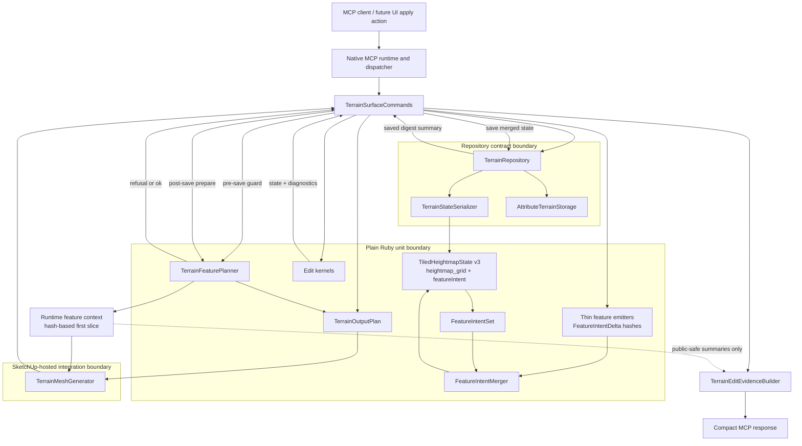

# Technical Plan: MTA-20 Define Terrain Feature Constraint Layer For Derived Output
**Task ID**: `MTA-20`
**Title**: `Define Terrain Feature Constraint Layer For Derived Output`
**Status**: `finalized`
**Date**: `2026-05-03`

## Source Task

- [Define Terrain Feature Constraint Layer For Derived Output](./task.md)

## Problem Summary

`MTA-19` showed that correct `heightmap_grid` samples and compact public terrain evidence are not
enough to produce reliable derived terrain topology. Corridor-heavy and adopted irregular terrains
need internal feature context before output planning and diagnostics can classify expected
feature-aligned breaks versus suspicious cross-feature output.

MTA-20 introduces a compact durable `featureIntent` section in `heightmap_grid` schema v3 and a
runtime-only feature planning layer. It must not make generated mesh durable terrain state and must
not expose feature internals through public MCP responses.

## Goals

- Persist compact authored feature intent, provenance, revision/window metadata, and generation
  policy in terrain state.
- Derive runtime feature constraints during output planning rather than persisting expanded lanes,
  graphs, triangles, or solver internals.
- Support one internal feature vocabulary for corridors, target regions, planar regions, preserve
  zones, survey/fixed controls, fairing regions, and minimal runtime-only inferred heightfield
  candidates.
- Preserve public MCP request/response shape while proving internal feature data does not leak.
- Run feature validation and planning before destructive output mutation so detectable refusals
  preserve previous valid output.

## Non-Goals

- No new Delaunay, constrained Delaunay, DELATIN, RTIN, or replacement triangulation backend.
- No public feature-constraint request or response fields.
- No public terrain-spline authoring tool or implementation-derived terrain editing terminology.
- No durable expanded feature graph, pointified lane payload, generated mesh vertex/face data, raw
  triangle list, or solver-internal persistence.
- No durable or rich inferred-heightfield feature detection in the first slice beyond minimal
  runtime-only candidate features needed to exercise diagnostic classification.
- No hardscape mutation or absorption into terrain state.

## Related Context

- [Managed Terrain Surface Authoring HLD](specifications/hlds/hld-managed-terrain-surface-authoring.md)
- [Managed Terrain Surface Authoring PRD](specifications/prds/prd-managed-terrain-surface-authoring.md)
- [Domain Analysis](specifications/domain-analysis.md)
- [MCP tool authoring guidance](specifications/guidelines/mcp-tool-authoring-sketchup.md)
- [SketchUp extension development guidance](specifications/guidelines/sketchup-extension-development-guidance.md)
- Local seams: `src/su_mcp/terrain/terrain_surface_commands.rb`,
  `src/su_mcp/terrain/tiled_heightmap_state.rb`,
  `src/su_mcp/terrain/terrain_state_serializer.rb`,
  `src/su_mcp/terrain/terrain_output_plan.rb`, and
  `src/su_mcp/terrain/terrain_mesh_generator.rb`

## Research Summary

- State-of-the-art terrain editing systems separate authored feature identity from derived
  invalidation/reapply scope. Authored features are deleted or updated exactly; affected
  components/bounds select derived-layer recomputation and do not imply authored ownership.
- State-of-the-art spline/corridor implementations derive lanes from authored controls, use
  deterministic resolution/caps, and repair tight-turn/self-intersection conditions at runtime.
- Local terrain source already has the required insertion points: edit kernels return
  `{ outcome, state, diagnostics }`, commands save state before regeneration, output planning is
  summarized through `TerrainOutputPlan`, and mesh regeneration owns destructive SketchUp output
  mutation.
- External review supported a hybrid feature working layer: first-class `FeatureIntentSet`,
  `FeatureIntentMerger`, and `TerrainFeaturePlanner`; lightweight plain hashes/helpers for deltas,
  emitters, feature records, and first-slice runtime constraint data.

## Technical Decisions

### Data Model

Use `heightmap_grid` schema v3 with unchanged `payloadKind` and a compact `featureIntent` section:

- `schemaVersion`
- `revision`
- `features`
- `generation`

`generation` includes:

- `pointificationPolicy: "grid_relative_v1"`
- `maxLaneSamplesPerFeature: 512`
- `maxLaneSamplesPerPlan: 4096`

Each feature uses a common envelope:

- `id`
- `kind`
- `sourceMode`
- `roles`
- `priority`
- `payload`
- `affectedWindow`
- `provenance`

`provenance` includes at least `originClass`, `originOperation`, `createdAtRevision`, and
`updatedAtRevision`.

Kind-specific payloads are minimal authored intent:

- `linear_corridor`: controls, tangent/orientation metadata where available, width, side falloff,
  end falloff, falloff type, endpoint-cap/control-zone intent, side/falloff lane intent, and
  optional internal raise/lower or layer/lane flags.
- `target_region`: region boundary and falloff.
- `planar_region`: region boundary, plane, support controls, falloff.
- `preserve_region`: region boundary.
- `fairing_region`: region boundary.
- `survey_control`: position, priority, optional support region.
- `fixed_control`: position, priority, optional support region.
- `inferred_heightfield`: no persisted first-slice entries; runtime-only candidates may carry
  tag/reason, low-confidence marker, source window, and coarse role when prepared by
  `TerrainFeaturePlanner`.

The first-slice feature kind list is finite: `linear_corridor`, `target_region`,
`planar_region`, `preserve_region`, `survey_control`, `fairing_region`, `fixed_control`, and
`inferred_heightfield`. Initial roles are also finite and internal: `centerline`,
`side_transition`, `endpoint_cap`, `boundary`, `support`, `protected`, `control`, `falloff`,
`hard_break`, and `soft_transition`. Must-hit behavior stays role/priority metadata on survey,
fixed, corridor endpoint, or planar controls rather than a separate top-level feature kind.

`affectedWindow` is a compact owner-local/grid-aware sample window computed from feature bounds
expanded by influence width, falloff, endpoint/control zones, and diagnostic margin. It is used for
invalidation, cap projection, planning bounds, and diagnostics; it is never ownership proof and
never authorizes retirement by overlap.

`FeatureIntentSet` is the first-class durable-intent normalizer. It owns canonical ordering,
feature lookup by semantic ID, digest-stable feature ordering, and conversion between state payload
and ordered feature records. It does not own retirement policy, pointification, persistence I/O, or
public response formatting.

Semantic feature IDs are deterministic:

```text
feature:<kind>:<sourceMode>:<semanticScope>:<short-hash>
```

The hash is the first 12 hex characters of SHA-256 over canonical JSON containing `kind`,
`sourceMode`, `semanticScope`, and normalized authored controls or region data. ID/hash numeric
normalization rounds owner-local meter coordinates to exactly six decimal places. Stored payload
values may retain normal numeric precision. Revision, digest, array index, transient SketchUp IDs,
and derived geometry are excluded from identity.

Semantic scopes:

- `linear_corridor`: normalized start/end controls plus width bucket.
- `target_region` and `planar_region`: normalized center plus bounding-box hash, or explicit region
  ID if supplied.
- `preserve_region`: explicit region ID if supplied, otherwise normalized boundary hash.
- `survey_control` and `fixed_control`: normalized position plus user-provided control ID when
  present.
- `fairing_region`: explicit fairing ID if supplied, otherwise normalized boundary hash.

### API and Interface Design

No public MCP API changes are planned. Internal contracts are:

- `FeatureIntentDelta`: plain JSON-safe hash containing `invalidation_window`, `upsert_features`,
  `retire_feature_ids`, and `retirement_hints`.
- Feature intent emitters: thin per-operation helpers/methods that translate successful edit
  request context into `FeatureIntentDelta`.
- `FeatureIntentMerger`: first-class lifecycle policy component. It applies exact retirement,
  semantic upsert, family-specific replacement, and overlap retention.
- `TerrainFeaturePlanner`: first-class runtime planning component. It performs pre-save feature
  validation and cheap cap projection, then post-save runtime constraint/context preparation,
  including minimal runtime-only inferred heightfield candidates for states without usable explicit
  edit intent.
- Runtime `FeatureConstraintSet` / feature context: initially hash-based runtime data, not durable
  state and not public evidence.

Emitter expectations:

- `corridor_transition` emits `linear_corridor` with centerline, side-transition, endpoint-cap, and
  control roles.
- `target_height` emits `target_region` with boundary, support, and falloff roles.
- `planar_region_fit` emits `planar_region` with plane, support, boundary, and control roles.
- `survey_point_constraint` emits `survey_control` plus support/falloff intent.
- `local_fairing` emits `fairing_region` support/influence intent.
- Request `preserveZones` emit `preserve_region`; request `fixedControls` emit `fixed_control`.

Merge policy:

- `retire_feature_ids` removes exact matching feature IDs only.
- `upsert_features` replaces existing features with the same semantic ID.
- `invalidation_window` selects candidates for review/replanning but never deletes by itself.
- Overlapping features remain active unless explicit retirement or semantic replacement applies.
- Replacement by geometry overlap or affected-window overlap is forbidden.

First-slice replacement matrix:

- `fixed_control`: exact ID only.
- `preserve_region`: exact ID or explicit retirement only.
- `linear_corridor`: same semantic corridor scope.
- `target_region`: same operation/source mode and same semantic scope.
- `planar_region`: same operation/source mode and same semantic scope.
- `survey_control`: same survey semantic scope.
- `fairing_region`: same fairing scope or explicit retirement.
- `inferred_heightfield`: no persisted first-slice upsert/replacement.

First-slice precedence and contribution rules:

- `fixed_control` has highest priority at the control locus; conflicting height-changing intent
  should refuse or diagnose before mutation rather than silently weaken the fixed control.
- `preserve_region` protects existing terrain from incompatible topology or height intent unless
  the current edit explicitly modifies or retires the same preserve feature.
- `linear_corridor` contributes centerline, side-transition, endpoint-cap, hard-break, and
  soft-transition constraints; derived lanes may be clipped or diagnostically marked where they
  collide with fixed or preserve constraints.
- `target_region` and `planar_region` contribute height-shaping support, boundary, control, and
  falloff constraints. They may replace prior regions from the same source/scope, but never retire
  unrelated corridors, preserve regions, fixed controls, survey controls, or fairing regions by
  overlap alone.
- `fairing_region` is the weakest height-shaping feature and must not erase hard breaks, fixed
  controls, or protected regions.
- `survey_control` remains an internal role/priority carrier. When its priority requires
  preservation, it participates in fixed-control-style conflict diagnostics without becoming a
  public must-hit contract.

First-slice support tiers:

- Full support: `linear_corridor`, `preserve_region`, and `fixed_control` emit, merge, participate
  in planner precedence, cap/conflict checks, and diagnostics.
- Basic support: `target_region`, `planar_region`, and `survey_control` emit, merge, participate in
  planner expansion where needed, and get basic conflict diagnostics.
- Weakest support: `fairing_region` emits and merges; `TerrainFeaturePlanner` treats it as lowest
  precedence.
- Runtime-only minimal support: `inferred_heightfield` is omitted from persisted first-slice
  entries, but `TerrainFeaturePlanner` must produce minimal runtime-only inferred candidates
  sufficient to classify at least one hard-break/transition case for adopted or legacy heightmap
  state.

### Public Contract Updates

Not applicable. MTA-20 should not change tool names, public request fields, response fields, loader
schema, dispatcher routing, or public docs/examples. Contract work is limited to tests proving no
internal feature vocabulary leaks through public MCP responses, public terrain-state summaries,
public evidence, output summaries, or refusal details. No-leak coverage must include `featureIntent`,
feature IDs, kinds, roles, payloads, `FeatureIntentSet`, `FeatureIntentDelta`,
`FeatureConstraintSet`, pointified lanes, raw triangles, raw vertices, solver internals, and
SketchUp objects. Internal diagnostics may retain feature IDs/kinds/windows for tests and debugging,
but public refusal details should expose only high-level category, aggregate counts, and stable
non-feature-specific reason codes unless a later public contract intentionally adds feature
evidence.

If implementation reveals a visible refusal-code addition is unavoidable, update runtime contract
fixtures, docs/examples, and tool-surface references in the same change.

### Error Handling

Feature-aware refusals are JSON-safe and must occur before destructive output mutation where
detectable. Initial internal refusal codes:

- `terrain_feature_conflict`
- `terrain_feature_pointification_limit_exceeded`
- `terrain_feature_intent_invalid`

Internal pointification cap diagnostics include feature ID, kind, projected sample count, cap, and
reason `pointification_limit_exceeded`. Internal conflict diagnostics include feature IDs, kinds,
windows, and conflict category. Public refusals must map those details to a public-safe reason,
category, and aggregate counts without exposing feature IDs, feature kinds, windows, raw lanes,
feature payloads, triangles, vertices, solver internals, or SketchUp objects.

Tight-turn and self-intersection cases are `TerrainFeaturePlanner` responsibilities. It must either
derive bounded runtime lane intent that deterministically collapses/repairs side, falloff, and
endpoint zones, or refuse before mutation when the case cannot be represented safely.
Repaired/collapsed lanes are runtime-only and must not be written back into durable
`featureIntent`.

Existing unsupported-child, no-data, repository, migration, and owner-transform refusals remain in
force.

The post-save planner phase must be deterministic over already validated state. Feature validity,
cap, and obvious fixed/preserve conflicts must be caught pre-save. If a host/output preflight still
fails after save, the command must preserve previous derived output, avoid leaking feature internals,
and hosted validation must prove the saved state, stale-output behavior, undo, and save/reopen
semantics are coherent.

### State Management

`TiledHeightmapState v3` owns `featureIntent` alongside existing authoritative heightmap state.
`with_elevations` and revision updates must preserve feature intent unless a merge explicitly
changes it.

Migration is sequential. Older payloads upgrade through the existing migration chain to schema v3
with empty/default `featureIntent`. `featureIntent` participates in the canonical state digest, and
features are ordered by stable semantic ID before digesting.

The command flow is two-phase:

1. Edit kernel produces an edited in-memory state and diagnostics.
2. Emitters produce a delta, merger applies it, and planner performs pre-save validation/cap
   projection.
3. Repository saves the merged state.
4. `TerrainFeaturePlanner` performs post-save runtime preparation using the saved digest.
5. Mesh generation regenerates derived output with prepared context.

Partial-regeneration paths must consume the full feature-planned invalidation scope. If the saved
feature windows, changed window, and existing partial-regeneration ownership metadata cannot be
reconciled safely, command integration should fall back to full output regeneration rather than
leaving retained faces that ignore current feature intent.

### Integration Points

- `TerrainSurfaceCommands`: insert feature emission, merge, pre-save planner guard, post-save
  planner preparation, and no-leak-safe evidence handling.
- `TiledHeightmapState`: add schema v3 `featureIntent` ownership and preservation across state
  replacement.
- `TerrainStateSerializer`: add sequential v3 migration, canonical digest participation, and
  serializer summary stability.
- Edit kernels: keep current mutation contract; emitters sit beside them and consume normalized
  request/context.
- `TerrainOutputPlan`: keep `to_summary` stable; allow optional opaque feature context reference or
  pass context beside the plan.
- `TerrainMeshGenerator`: continue owning SketchUp output mutation; consume prepared output context
  without deriving durable feature intent from mesh geometry.
- `TerrainEditEvidenceBuilder`: receive only public-safe summaries and never raw feature payloads.

### Configuration

No user-facing configuration is planned. First-slice internal defaults:

- `pointificationPolicy: "grid_relative_v1"`
- `maxLaneSamplesPerFeature: 512`
- `maxLaneSamplesPerPlan: 4096`
- semantic-ID numeric normalization: six decimal owner-local meters for ID/hash computation.

## Architecture Context



## Key Relationships

- `featureIntent` is durable state data; it is not a service, cache, or public contract.
- `FeatureIntentSet`, `FeatureIntentMerger`, and `TerrainFeaturePlanner` are the only first-class
  new MTA-20 components.
- `FeatureIntentDelta`, feature emitters, feature records, and runtime feature context stay
  lightweight data/helpers initially.
- `FeatureIntentMerger` owns lifecycle policy. `TerrainFeaturePlanner` owns runtime expansion,
  precedence, caps, and feature-aware refusal.
- `TerrainOutputPlan` remains an output descriptor and should not become the feature solver.
- `TerrainMeshGenerator` remains the derived SketchUp output mutation boundary.
- Public evidence builders may summarize safe outcomes but must not own or expose raw feature data.

## Acceptance Criteria

- Terrain state serializes as schema v3 with compact `featureIntent`, unchanged `payloadKind`, and
  stable digest participation.
- Sequential migration upgrades older payloads to v3 with empty/default `featureIntent`.
- State replacement and revision increments preserve feature intent unless a merge changes it.
- Semantic IDs are deterministic from kind, source mode, semantic scope, and normalized authored
  controls/regions, excluding revision, digest, array order, SketchUp IDs, and derived geometry.
- Repeated equivalent edits upsert; explicit retirement removes one targeted feature; overlapping
  unrelated features survive.
- Successful existing edit modes emit expected JSON-safe feature-intent deltas; refused edits emit
  no feature intent.
- Emitted corridor intent covers centerline, side-transition bands, endpoint/control zones,
  tangent/orientation metadata where available, width/falloff, control role/priority, affected
  window, and owner-local/grid-aware coordinates.
- Preserve zones and fixed controls become feature intent from request constraints when an edit
  succeeds.
- Adopted or legacy heightmap state without explicit edit intent can produce minimal runtime-only
  inferred candidates for at least one hard-break or transition-band diagnostic fixture; those
  candidates are marked separately from explicit edit-derived features and are not persisted.
- Pre-save feature validation refuses invalid intent, projected cap failures, and obvious
  fixed/preserve conflicts before repository save and mesh mutation.
- Post-save planning uses the saved digest that includes feature intent before regeneration.
- Feature-aware diagnostic classification is testable from prepared feature context and deterministic
  topology fixtures before any future feature-aware triangulation backend is introduced.
- Public MCP responses and output summaries remain compact and do not expose internal feature
  vocabulary, feature IDs/kinds/roles, payloads, lanes, triangles, vertices, solver internals, or
  SketchUp objects.
- Corridor, target, planar, preserve, survey, fixed, and fairing features are covered at their
  planned support tiers.
- Off-grid controls, non-square spacing, non-zero origins, transformed owners, adopted irregular
  terrain, tight corridor turns, save/reopen, undo, and unsupported-child refusal are validated at
  the appropriate unit, integration, or hosted boundary.

## Test Strategy

### TDD Approach

Start with durable state and merge correctness before runtime planning. The first failing tests
should prove schema v3 round-trip, canonical digest ordering, semantic ID stability, and merge
retention behavior. Add emitters only after state/merge contracts are stable. Add planner cap and
refusal behavior before command integration. Finish with public no-leak and hosted validation.

### Required Test Coverage

- State/serializer tests for schema v3, sequential migration, digest participation, canonical
  feature ordering, feature intent preservation across `with_elevations`, corrupt payloads, and
  unsupported versions.
- `FeatureIntentSet` tests for canonical ordering, normalization, lookup, and JSON-safe payloads.
- Semantic ID tests for repeated saves, reordered controls, revision-only changes, changed geometry,
  user ID participation, transformed owners, non-square grids, off-grid controls, and
  collision-resistant hash shape.
- `FeatureIntentMerger` tests for exact retirement, semantic upsert, overlap retention, invalidation
  windows as non-ownership scope, and the family replacement matrix.
- Emitter tests for corridor, target, planar, survey, fairing, preserve, and fixed feature deltas,
  including expected kind/role mapping and preserve/fixed emission from request constraints.
- Planner tests for cheap cap projection, conflict refusal, invalid intent refusal, diagnostic
  details, tight-turn/self-intersection repair-or-refusal behavior, runtime context no-persistence,
  minimal inferred-candidate preparation, feature-aware diagnostic classification over synthetic
  topology fixtures, and public no-leak.
- Command integration tests for merge-before-save, pre-save refusal guard, post-save planning,
  saved digest includes feature intent, partial-regeneration fallback when feature windows cannot be
  reconciled, post-save preflight abort behavior, and previous output preservation.
- Mesh/output tests for stable `TerrainOutputPlan#to_summary`, unsupported-child preflight, and no
  raw feature leakage.
- Hosted/manual validation for save/reopen, undo, owner transform behavior, transformed owners,
  corridor-heavy terrain with endpoints/side bands, adopted/off-grid terrain, and provenance round
  trip.

## Instrumentation and Operational Signals

- Feature planner diagnostic context should record projected sample counts, cap decisions, conflict
  categories, involved feature IDs/kinds, affected windows, and whether planning used pre-save or
  post-save phase.
- Public instrumentation and refusal summaries should never include feature IDs, feature kinds,
  affected windows, roles, or raw feature payloads; those values are internal diagnostics only.
- Public responses should expose only existing compact outcome/evidence fields and safe refusal
  summaries.
- Test fixtures should assert absence of internal feature keys in public response paths.

## Implementation Phases

1. Schema v3 foundation: add `featureIntent` state ownership, sequential migration, canonical
   digest participation, and `FeatureIntentSet` normalization tests.
2. Identity and merge policy: implement semantic ID helpers and `FeatureIntentMerger` with exact
   retirement, semantic upsert, overlap retention, and family matrix tests.
3. Feature emission: add thin emitters for existing edit modes and request constraints, keeping edit
   kernel mutation contracts stable.
4. Planner guard and runtime context: add `TerrainFeaturePlanner` pre-save validation, cap
   projection, post-save context preparation, minimal runtime-only inferred candidates, diagnostic
   classification fixtures, and runtime-only constraint data.
5. Command integration: wire emission, merge, pre-save guard, repository save, post-save planning,
   regeneration, partial-regeneration fallback, post-save abort handling, and public-safe evidence.
6. No-leak and hosted validation: extend public contract tests and run/record hosted or manual
   save/reopen, undo, unsupported-child, corridor-heavy, adopted/off-grid validation.

## Rollout Approach

- Keep public MCP shape unchanged.
- Migrate existing terrain state to v3 with empty/default feature intent.
- Enable feature intent generation only on successful edits.
- Treat feature-aware refusals as internal safety checks before output mutation.
- Keep existing derived-output generation as the production baseline; MTA-20 provides feature
  context for current diagnostics and future feature-aware output work rather than replacing the
  triangulation backend.

## Risks and Controls

- Merge policy incorrectly retires authored features: test `FeatureIntentMerger` before planner
  integration and forbid overlap/window deletion.
- Semantic IDs are unstable: fix normalization and hash contract before emitters; test repeated
  saves, reorder, revision-only change, and user-ID participation.
- Feature intent drops during state replacement: test state `with_elevations` and revision
  preservation before edit integration.
- Planner timing persists invalid intent: run cheap pre-save planner guard before repository save
  and validate hosted abort behavior; post-save planning must not discover new feature-validity
  failures that could have been projected pre-save.
- Public contract drift: add no-leak tests for responses, evidence, output summaries, and refusal
  details, and keep feature IDs/kinds/windows out of public refusal payloads.
- Pointification cost underestimation: use conservative projection, hard caps, aggregate plan caps,
  and cap-refusal tests.
- Hosted SketchUp assumptions fail: validate save/reopen, undo, owner transform behavior, and
  unsupported-child refusal in hosted/manual coverage.
- Partial-regeneration retains stale output: require feature-planned windows to be included in
  regeneration scope or fall back to full regeneration.
- Scope expands into rich inferred-feature detection: keep inferred heightfield entries runtime-only
  and minimal, limited to diagnostic fixtures for adopted/legacy state.
- Support tiers create false completion: require at least one explicit unit or integration test per
  tier/family before marking the family complete.

## Dependencies

- `MTA-05`, `MTA-06`, `MTA-09`, `MTA-10`, `MTA-11`, `MTA-12`, `MTA-13`, `MTA-16`, `MTA-19`
- [Managed Terrain Surface Authoring HLD](specifications/hlds/hld-managed-terrain-surface-authoring.md)
- [Managed Terrain Surface Authoring PRD](specifications/prds/prd-managed-terrain-surface-authoring.md)
- [Domain Analysis](specifications/domain-analysis.md)
- State-of-the-art terrain editing mechanics for authored feature identity, pointification,
  invalidation/reapply scope, and overlap contribution policy
- Existing Ruby terrain runtime and tests under `src/su_mcp/terrain` and `test/terrain`
- SketchUp-hosted/manual validation environment

## Premortem Gate

Status: PASS

### Unresolved Tigers

- None.

### Plan Changes Caused By Premortem

- Added minimal runtime-only inferred heightfield candidates so the inferred-feature acceptance
  scenario is testable without persisting inferred features or expanding public contract scope.
- Tightened public refusal/no-leak boundaries: public paths may expose only high-level categories,
  aggregate counts, and stable non-feature-specific reason codes; feature IDs/kinds/windows remain
  internal diagnostics only.
- Strengthened post-save planning and host-abort rules so feature validity/cap/conflict failures
  must be caught pre-save, while any later host/output preflight failure preserves previous output
  and has hosted save/reopen/undo validation.
- Added partial-regeneration fallback requirements when feature-planned windows cannot be safely
  reconciled with retained output ownership metadata.
- Added explicit test coverage for transformed/off-grid semantic ID stability, per-tier feature
  support, minimal inferred candidates, and feature-aware diagnostic classification fixtures.

### Accepted Residual Risks

- Risk: Diagnostic classification could still be too shallow to predict future feature-aware output.
  - Class: Paper Tiger
  - Why accepted: MTA-20 is a foundation task and explicitly does not replace the triangulation
    backend.
  - Required validation: Deterministic diagnostic fixtures must classify at least one expected
    feature-aligned break and one suspicious cross-feature case using prepared feature context.
- Risk: Hosted post-save/output preflight behavior may differ from local command assumptions.
  - Class: Elephant
  - Why accepted: The plan now requires pre-save feature validation and hosted abort-path proof
    before closeout.
  - Required validation: Hosted/manual matrix must prove previous output preservation, undo,
    save/reopen, and coherent state/output behavior on post-save preflight refusal.
- Risk: Support tiers could be misread as uniform feature completeness.
  - Class: Elephant
  - Why accepted: Tiered support is required to keep MTA-20 bounded, and each tier now has explicit
    coverage obligations.
  - Required validation: Each feature family and tier must have at least one unit or integration
    test proving its promised emit/merge/planner behavior before being marked complete.

### Carried Validation Items

- Public no-leak fixtures for success and refusal paths must assert absence of `featureIntent`,
  feature IDs, feature kinds, roles, payloads, lanes, windows, raw triangles, vertices, solver
  internals, and SketchUp objects.
- Semantic ID tests must include transformed owners, non-square grids, off-grid controls,
  save/reopen, repeated equivalent edits, and reorder/revision-only cases.
- Command integration must prove feature-planned windows either drive partial regeneration scope or
  force full regeneration fallback.
- Hosted/manual validation must include pre-save feature refusal, post-save output preflight
  refusal, unsupported-child refusal, save/reopen, undo, transformed owner, corridor-heavy, and
  adopted/off-grid scenarios.

### Implementation Guardrails

- Do not persist expanded lanes, inferred feature candidates, generated mesh data, raw geometry, or
  solver internals.
- Do not expose feature IDs, feature kinds, roles, affected windows, or payloads through public MCP
  responses, evidence, output summaries, or refusal details.
- Do not retire features by affected-window or geometry overlap; only exact retirement, semantic
  upsert, or same-family semantic replacement may change durable feature ownership.
- Do not let `TerrainOutputPlan` become the feature solver; feature expansion, inferred candidates,
  precedence, and refusals belong in `TerrainFeaturePlanner`.
- Do not mark a feature family complete until its declared support tier has explicit tests.

## Quality Checks

- [x] All required inputs validated
- [x] Problem statement documented
- [x] Goals and non-goals documented
- [x] Research summary documented
- [x] Technical decisions included
- [x] Architecture context included
- [x] Acceptance criteria included
- [x] Test requirements specified
- [x] Instrumentation and operational signals defined when needed
- [x] Risks and dependencies documented
- [x] Rollout approach documented when needed
- [x] Small reversible phases defined
- [x] Premortem completed with falsifiable failure paths and mitigations
- [x] Planning-stage size estimate considered before premortem finalization
