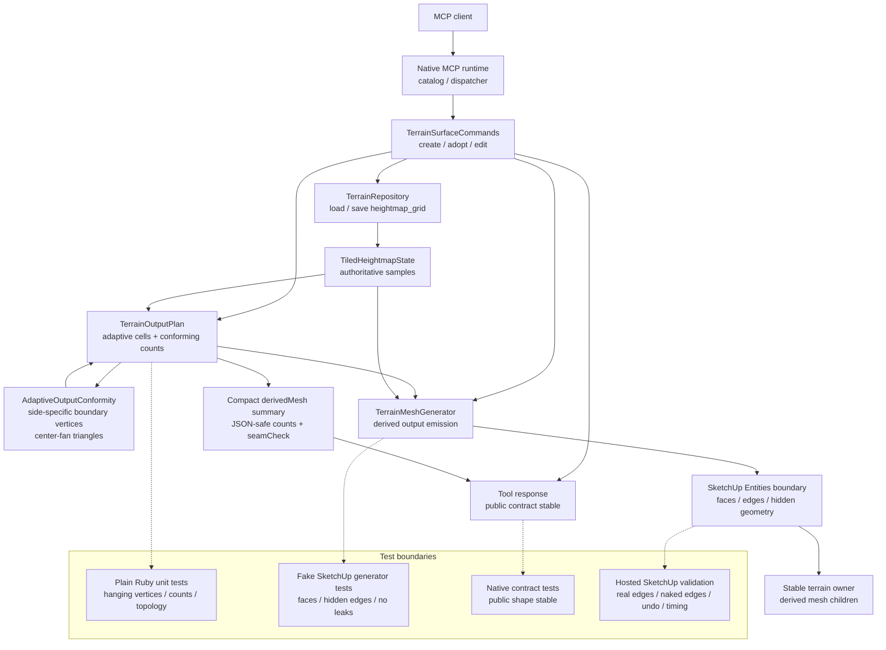

# Technical Plan: MTA-21 Make Adaptive Terrain Output Conforming
**Task ID**: `MTA-21`
**Title**: `Make Adaptive Terrain Output Conforming`
**Status**: `implemented`
**Date**: `2026-05-04`

## Source Task

- [Make Adaptive Terrain Output Conforming](./task.md)

## Problem Summary

Current adaptive terrain output can generate non-conforming mixed-resolution boundaries. A larger
adaptive cell may emit one long edge while neighboring smaller cells place intermediate vertices on
that edge. SketchUp then receives a derived mesh with hanging-node/T-junction-like topology even
though the authoritative `heightmap_grid` state is valid.

The fix must repair the existing adaptive-cell output path, keep valid terrain edits working, and
hide generated terrain edges as SketchUp hidden geometry. It must not replace the output path with a
new triangulation backend or revive the reverted MTA-19 adaptive TIN work.

## Goals

- Generate conforming adaptive-cell output with no hanging boundary vertices or internal gap seams.
- Preserve `heightmap_grid` as the authoritative terrain state and keep generated topology derived.
- Keep valid create, adopt, and edit operations from being refused due only to adaptive compactness
  loss.
- Hide generated terrain edges using SketchUp edge hidden state.
- Preserve compact public MCP response shapes and avoid exposing topology internals.
- Prove the repair through deterministic topology tests and hosted SketchUp validation.

## Non-Goals

- Implementing RTIN, Delaunay, constrained Delaunay, DELATIN, feature-aware output, or a new terrain
  meshing backend.
- Reviving MTA-19's reverted adaptive TIN replacement path.
- Changing public `create_terrain_surface` or `edit_terrain_surface` request contracts.
- Persisting generated vertices, triangles, densified cells, stitch data, or adaptive-cell graphs.
- Using full regular-grid output as the default production path.

## Related Context

- [specifications/hlds/hld-managed-terrain-surface-authoring.md](specifications/hlds/hld-managed-terrain-surface-authoring.md)
- [specifications/prds/prd-managed-terrain-surface-authoring.md](specifications/prds/prd-managed-terrain-surface-authoring.md)
- [specifications/domain-analysis.md](specifications/domain-analysis.md)
- [specifications/guidelines/ryby-coding-guidelines.md](specifications/guidelines/ryby-coding-guidelines.md)
- [specifications/tasks/managed-terrain-surface-authoring/MTA-10-implement-partial-terrain-output-regeneration/summary.md](specifications/tasks/managed-terrain-surface-authoring/MTA-10-implement-partial-terrain-output-regeneration/summary.md)
- [specifications/tasks/managed-terrain-surface-authoring/MTA-11-design-and-implement-durable-localized-terrain-representation-v2/summary.md](specifications/tasks/managed-terrain-surface-authoring/MTA-11-design-and-implement-durable-localized-terrain-representation-v2/summary.md)
- [specifications/tasks/managed-terrain-surface-authoring/MTA-19-implement-detail-preserving-adaptive-terrain-output-simplification/summary.md](specifications/tasks/managed-terrain-surface-authoring/MTA-19-implement-detail-preserving-adaptive-terrain-output-simplification/summary.md)
- [specifications/tasks/managed-terrain-surface-authoring/MTA-20-define-terrain-feature-constraint-layer-for-derived-output/summary.md](specifications/tasks/managed-terrain-surface-authoring/MTA-20-define-terrain-feature-constraint-layer-for-derived-output/summary.md)

## Research Summary

- Local probing of the current adaptive planner reproduced the likely defect: mixed cell widths such
  as `[1, 4]` can leave smaller-cell corner vertices on the interior of a larger cell edge.
- Current emission in [src/su_mcp/terrain/terrain_mesh_generator.rb](src/su_mcp/terrain/terrain_mesh_generator.rb)
  emits two corner-only triangles per adaptive cell, so those intermediate boundary vertices are
  not split into the larger cell.
- Current seam tests check duplicated XY elevation agreement, but they do not catch vertex-on-edge
  hanging-node topology.
- MTA-19 is a negative analog: a broader adaptive TIN replacement passed local CI but failed hosted
  topology/performance validation and was reverted. MTA-21 must stay targeted to the current
  adaptive-cell path.
- Initial Grok 4.3 review agreed that repairing the current adaptive-cell path was the right scope,
  while warning that counts must be owned before emission and face-count inflation must be measured.
- Implementation probing showed full source-grid subcell densification for hanging-boundary cells
  can cascade to full-grid output on common mixed-resolution fixtures. A follow-up Grok 4.3 review
  supported global adaptive boundary-line splitting as the narrower conforming repair within scope.
- Hosted validation after the global split-line repair showed representative corridor and adopted
  terrain cases were still nearly dense. The implementation was narrowed again to side-specific
  boundary vertices with center-fan triangulation only for cells that need extra boundary vertices.

## Technical Decisions

### Data Model

No durable terrain data model changes are planned.

Internal adaptive output planning continues to start from `TerrainOutputPlan#adaptive_cells`.
Planning then derives a conforming boundary plan for each adaptive cell through
`AdaptiveOutputConformity`.

The conforming boundary plan is side-specific:

- index adaptive cells by min/max row and min/max column
- for each cell edge, inspect only neighboring cells that share that edge
- add the neighbor's edge endpoints to that side when the shared edge ranges overlap
- keep unsplit cells on the current two-triangle rectangle path
- for cells with extra boundary vertices, add one derived center-fan vertex and triangulate each
  boundary segment to the center so no long emitted boundary edge skips an intermediate vertex

This repairs hanging boundary vertices without promoting every adaptive boundary row/column through
the whole cell interior.

The boundary plan is derived geometry planning only. It is not persisted, and public responses must
not expose boundary vertices, center-fan vertices, split columns, split rows, adaptive boundary
lines, generated vertices, or generated triangles.

### API and Interface Design

Public MCP APIs do not change.

Internal plan behavior changes:

- `TerrainOutputPlan.build_adaptive` computes final conforming output counts from adaptive cells
  after deriving per-cell boundary vertices and any required center-fan vertex.
- `TerrainOutputPlan` exposes enough internal boundary planning for `TerrainMeshGenerator` to decide
  whether a cell emits as one two-triangle rectangle or a boundary-preserving center fan.
- `TerrainOutputPlan#to_summary` keeps the existing compact `derivedMesh` shape while reporting
  final conforming `vertexCount` and `faceCount`.

Generator behavior changes:

- Adaptive generation dispatches per cell:
  - normal cell: current two-triangle rectangle emission
  - split cell: triangle fan from a derived center vertex to each boundary segment
- All generated terrain edges are marked as derived output and hidden with `edge.hidden = true`
  when the host object supports `hidden=`.

### Public Contract Updates

No public request fields, response fields, tool names, loader schema entries, dispatcher routes, or
runtime registrations are planned to change.

Expected public fixture impact is limited to natural `output.derivedMesh.vertexCount` and
`faceCount` changes where conforming boundary planning adds derived geometry. Contract tests must
prove public responses and refusals still do not expose raw vertices, triangles, split grids,
adaptive boundary lines, boundary vertices, center-fan vertices, adaptive cell graphs, stitch
internals, Ruby objects, or SketchUp objects.

Docs should be reviewed only for stale language around adaptive output counts or visible terrain
facets. No schema documentation update is required unless implementation changes compact summary
semantics.

### Error Handling

Valid terrain edits must not be refused solely because compact adaptive output becomes less compact.
Conformity is achieved by adding derived output geometry as needed.

Refusals remain appropriate for invalid or unsafe conditions such as:

- no-data adaptive terrain samples
- non-finite state values or coordinates
- unsupported child entities under the terrain owner before regeneration
- host mutation failure or inability to create valid SketchUp faces

Regeneration must validate preconditions before erasing existing derived output, preserving the
current unsupported-child refusal safety posture.

### State Management

Terrain state remains the authoritative `heightmap_grid` payload behind the terrain repository seam.
Conforming output boundary plans, generated vertices, and generated triangles are runtime-derived
output facts only.

No repository, serializer, migration, or owner metadata changes are planned.

### Integration Points

- [src/su_mcp/terrain/terrain_output_plan.rb](src/su_mcp/terrain/terrain_output_plan.rb): adaptive
  cell classification, final conforming counts, compact summary.
- [src/su_mcp/terrain/terrain_mesh_generator.rb](src/su_mcp/terrain/terrain_mesh_generator.rb):
  conforming adaptive emission, hidden edge marking, existing cleanup/refusal behavior.
- [test/terrain/terrain_mesh_generator_test.rb](test/terrain/terrain_mesh_generator_test.rb):
  generator topology, counts, markers, and hidden-edge coverage.
- [test/terrain/terrain_output_plan_test.rb](test/terrain/terrain_output_plan_test.rb): conforming
  count and classification coverage.
- [test/terrain/terrain_contract_stability_test.rb](test/terrain/terrain_contract_stability_test.rb)
  and [test/support/native_runtime_contract_cases.json](test/support/native_runtime_contract_cases.json):
  no-leak and fixture count checks if needed.

### Configuration

No user-facing or runtime configuration is planned.

Topology predicates should use a small deterministic tolerance for geometric comparisons in tests
and planning helpers where needed. The tolerance is internal and should not become a public option.

## Architecture Context

## Key Relationships

- `TerrainSurfaceCommands` continues to decide valid create/adopt/edit behavior and coordinate state
  save plus output regeneration.
- `TerrainOutputPlan` owns the shape and counts of derived output before emission.
- `TerrainMeshGenerator` owns all raw SketchUp mutation and derived face/edge marking.
- Public responses consume compact output summaries only; they do not consume internal topology
  detail.
- Hosted validation remains required because SketchUp edge merging, hidden geometry state, and naked
  edge behavior cannot be fully trusted from fakes.

## Acceptance Criteria

- Mixed-resolution adaptive output has no hanging boundary vertices: no emitted edge contains
  another emitted terrain vertex in its interior without being split.
- Adaptive output generation remains derived from `heightmap_grid` state only.
- Valid create, adopt, and edit operations continue producing derived terrain output when conformity
  requires extra derived faces.
- Adaptive output remains the normal production path; full-grid-equivalent output is treated as a
  worst-case metric, not a deliberate default fallback.
- Final `output.derivedMesh.vertexCount` and `faceCount` match emitted conforming geometry.
- Final conforming face count never exceeds the equivalent full-grid face count for the terrain
  dimensions.
- Representative mixed-resolution fixtures remain materially below full-grid face count after
  conformity repair, including spike, smooth hill, plateau, and gentle wave fixtures.
- Generated terrain faces preserve positive-Z orientation.
- All generated terrain edges are marked as derived output and use SketchUp hidden edge state when
  supported.
- Adaptive faces do not receive regular-grid cell ownership metadata.
- Public MCP request fields, tool names, response field names, and compact `output.derivedMesh`
  vocabulary remain compatible.
- Public responses and refusal details do not expose raw vertices, raw triangles, split grids,
  split columns, split rows, boundary vertices, center-fan vertices, emission triangles,
  adaptive-boundary internals, adaptive-cell graphs, stitch internals, Ruby objects, or SketchUp
  objects.
- No-data or non-finite terrain state still refuses before output mutation.
- Unsupported child entities under the terrain owner still refuse before erasing existing output.
- Regeneration replaces prior derived terrain output coherently and does not leave orphan derived
  edges.
- Undo restores terrain state and derived output coherently in hosted SketchUp validation.
- Hosted validation confirms no internal terrain-output naked-edge seam artifacts on at least one
  adopted/irregular terrain and one aggressive edited created terrain.
- Hosted validation records generated edge hidden state, face/edge counts, normals, timing, and
  face-count ratio versus full-grid.

## Test Strategy

### TDD Approach

Start with failing tests that reproduce the hanging-boundary defect from the current adaptive-cell
planner. Implement plan-level classification and counts before changing SketchUp emission. Then
update generator behavior and contract checks. Hosted validation comes after automated topology,
count, marker, hidden-edge, and no-leak checks pass.

### Required Test Coverage

- `test/terrain/terrain_output_plan_test.rb`
  - mixed-resolution fixture produces per-cell boundary vertices where adaptive boundaries would
    otherwise create hanging vertices
  - conforming counts account for planned boundary/fan triangles before emission
  - final face count is `<=` full-grid equivalent
  - boundary planning proves no planned emitted axis edge contains another planned emitted vertex in
    its interior
  - representative conforming fixtures remain materially below full-grid across spike, smooth hill,
    plateau, and gentle wave cases
  - summary shape remains compact
- `test/terrain/terrain_mesh_generator_test.rb`
  - current hanging-boundary fixture emits conforming topology
  - no emitted edge contains an unsplit intermediate terrain vertex
  - emitted face/vertex counts match `TerrainOutputPlan#to_summary`
  - split vertices use authoritative source-grid sample elevations
  - generated faces point upward
  - generated edges are derived and hidden
  - adaptive faces do not receive full-grid ownership metadata
  - regeneration preserves unsupported-child refusal-before-erase behavior
  - orphan derived edges are not left behind
- Contract and no-leak coverage
  - public output remains `output.derivedMesh`
  - no raw topology, split-plan data, or internal classification data leaks
  - native contract fixtures are updated only for expected natural count changes
- Hosted SketchUp validation
  - created flat terrain with aggressive/off-grid edits
  - adopted irregular terrain before and after bounded edits
  - real edge hidden-state inspection
  - internal naked-edge/topology inspection
  - face/edge counts, normals, timing, undo, and unsupported-child refusal preservation

## Instrumentation and Operational Signals

- conforming adaptive face count
- equivalent full-grid face count
- conforming-to-full-grid face-count ratio
- count of split adaptive cells
- count of normal two-triangle adaptive cells
- count of adaptive boundary columns and rows used for splitting
- generated edge hidden-state pass/fail in hosted validation
- hosted generation/regeneration elapsed time
- internal naked-edge or hanging-vertex topology check result

## Implementation Phases

1. **Red topology and count fixtures**
   - Add deterministic mixed-resolution fixtures that fail the current hanging-boundary topology
     predicate.
   - Add plan-level count expectations for full-grid cap and representative compactness.

2. **Plan-level conforming classification**
   - Add side-specific adaptive boundary planning in `AdaptiveOutputConformity`.
   - Compute per-cell `boundary_vertices` and a `fan_center` only where needed.
   - Prove planned emitted axis edges have no unsplit intermediate planned vertices.
   - Compute final conforming `vertexCount` and `faceCount` before emission.
   - Keep `to_summary` shape stable.

3. **Generator emission repair**
   - Dispatch adaptive cell emission between normal two-triangle output and center-fan output.
   - Keep no-data and unsupported-child refusal ordering intact.
   - Verify counts match emitted geometry.

4. **Hidden generated edges**
   - Extend derived edge marking to set SketchUp hidden edge state when supported.
   - Apply consistently to adaptive and full-grid derived output.

5. **Contract, docs, and hosted validation**
   - Run and update contract fixtures only for expected count changes.
   - Review docs for stale adaptive-output wording.
   - Run hosted validation matrix and record topology, hidden-edge, count, timing, undo, and refusal
     evidence.

## Rollout Approach

- Ship as an internal terrain-output repair with no public API migration.
- Keep the current adaptive output vocabulary and source-state model.
- Treat unexpectedly high face-count ratios as a validation finding and follow-up signal, not an
  edit refusal.
- Do not merge any new triangulation backend, public simplification option, or persisted generated
  topology under this task.

## Risks and Controls

- Face-count inflation: compute counts before emission, cap against full-grid equivalent, and record
  representative ratios across spike, smooth hill, plateau, and gentle wave fixtures.
- Incomplete boundary planning: require a plan-level topology predicate after boundary planning and
  before generator emission.
- Over-splitting from boundary repair: assert representative ratios remain materially below
  full-grid and treat unexpected full-grid ratios as validation findings.
- False local topology confidence: run hosted SketchUp naked-edge and hidden-edge checks before
  closeout.
- Summary drift: keep count ownership in `TerrainOutputPlan` and assert emitted geometry matches.
- Scope creep into new backend: restrict repair to adaptive-cell boundary triangulation within the
  current adaptive-cell path.
- Edit refusal regression: use conforming split output for compactness loss and keep refusals for
  invalid source/state/host conditions only.
- Hidden edge semantics mismatch: verify `edge.hidden?` in hosted SketchUp output.
- Orphan derived edges: test regeneration cleanup and inspect hosted output.
- Public contract leakage: keep no-leak contract tests around all public output and refusal paths,
  including split-grid, adaptive-boundary-line, boundary-vertex, and center-fan vocabulary.

## Dependencies

- `MTA-08`
- `MTA-10`
- `MTA-11`
- `MTA-20`
- SketchUp-hosted runtime access for validation
- Existing terrain unit, contract, package, and RuboCop validation tooling

## Quality Checks

- [x] All required inputs validated
- [x] Problem statement documented
- [x] Goals and non-goals documented
- [x] Research summary documented
- [x] Technical decisions included
- [x] Architecture context included
- [x] Acceptance criteria included
- [x] Test requirements specified
- [x] Instrumentation and operational signals defined when needed
- [x] Risks and dependencies documented
- [x] Rollout approach documented when needed
- [x] Small reversible phases defined
- [x] Premortem completed with falsifiable failure paths and mitigations
- [x] Planning-stage size estimate considered before premortem finalization

## Premortem Gate

Status: WARN

### Unresolved Tigers

- None.

### Plan Changes Caused By Premortem And Implementation Drift

- Initial premortem added iterative densification closure before emission. Implementation probing
  then showed the full source-grid densification closure can cascade to full-grid output on common
  mixed-resolution fixtures.
- Replaced binary full-cell source-grid densification with global adaptive boundary-line splitting,
  then replaced global split grids with side-specific boundary vertices after hosted validation
  showed representative cases were still nearly dense.
- Added boundary-planning tests, internal-vocabulary no-leak requirements, and representative
  face-count-ratio checks across multiple fixture classes.
- Kept valid-edit behavior unchanged: compactness loss still causes more derived output geometry,
  not edit refusal.

### Accepted Residual Risks

- Risk: Boundary-line splitting may still over-split some terrain.
  - Class: Paper Tiger
  - Why accepted: Probes show materially better compactness than full-cell densification, and the
    output remains bounded by the full-grid face-count cap.
  - Required validation: Record conforming-to-full-grid face-count ratios for spike, smooth hill,
    plateau, gentle wave, representative hosted created, and representative hosted adopted fixtures.
- Risk: Real SketchUp edge merging or hidden-edge behavior differs from fake tests.
  - Class: Paper Tiger
  - Why accepted: The behavior is host-sensitive but directly inspectable in hosted validation.
  - Required validation: Hosted checks must inspect hidden edge state and internal naked-edge
    topology on generated output.
- Risk: Current adaptive-cell repair does not solve future feature-aware or corridor visual-quality
  needs.
  - Class: Elephant
  - Why accepted: MTA-21 intentionally repairs conforming topology only; MTA-19 showed broader
    meshing work needs separate research and live-failure fixtures.
  - Required validation: Do not claim feature-aware output or visual-quality backend replacement in
    docs, summary, or implementation notes.

### Carried Validation Items

- Plain Ruby topology predicate after boundary planning.
- Generator count equality: `TerrainOutputPlan#to_summary` counts match emitted geometry.
- Hosted SketchUp inspection for hidden generated edges, internal naked terrain-output seams,
  normals, timings, undo, and unsupported-child refusal preservation.
- Contract/no-leak checks for raw topology and internal classification data.

### Implementation Guardrails

- Do not implement RTIN, Delaunay, CDT, DELATIN, feature-aware output, or a minimal local
  triangulator under this task.
- Do not refuse valid terrain edits due only to adaptive compactness loss.
- Do not persist generated vertices, triangles, split grids, or adaptive-cell boundary plans.
- Do not let public MCP responses expose raw topology or boundary-planning internals.
- Do not erase existing derived output during regeneration before existing precondition refusals are
  checked.
