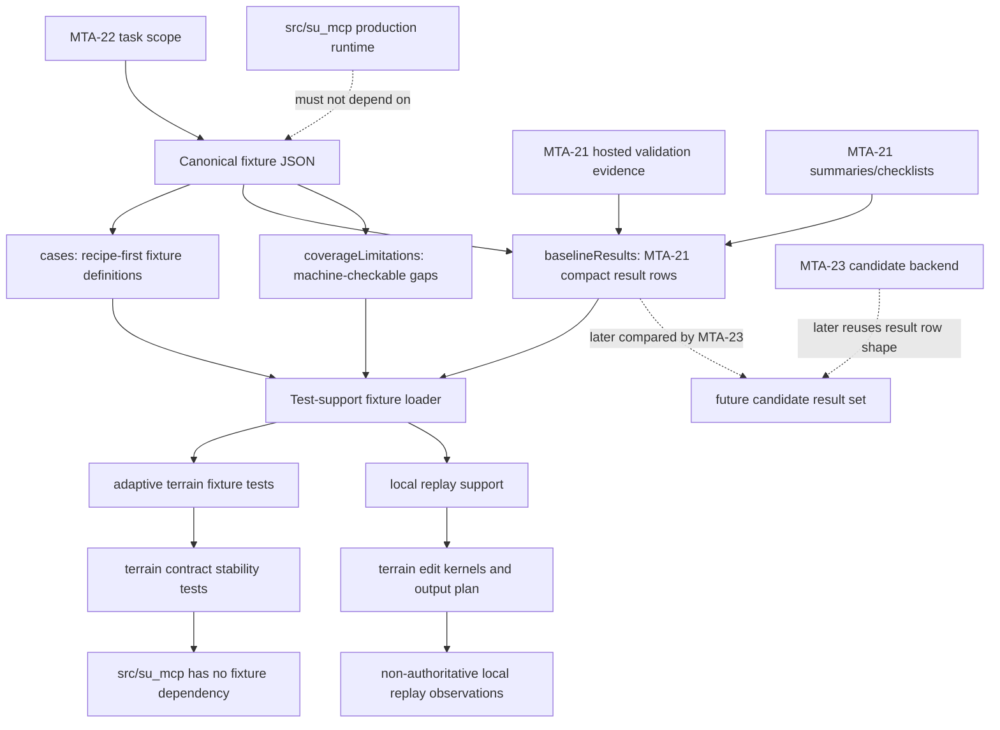

# Technical Plan: MTA-22 Capture Adaptive Simplification Benchmark Fixtures And Replay Framework
**Task ID**: `MTA-22`
**Title**: `Capture Adaptive Simplification Benchmark Fixtures And Replay Framework`
**Status**: `finalized`
**Date**: `2026-05-06`

## Source Task

- [Capture Adaptive Simplification Benchmark Fixtures And Replay Framework](./task.md)

## Problem Summary

MTA-21 repaired adaptive terrain output enough to serve as the current conforming production
baseline, but MTA-19 showed that narrow local checks can miss hosted topology, profile, residual,
and performance failures. MTA-22 must capture a representative, machine-checkable MTA-21 benchmark
fixture and baseline result set before MTA-23 prototypes another simplifier. MTA-22 captures the
baseline result set only; MTA-23 will later produce candidate result sets using the same row shape
and compare those sets against this baseline.

## Goals

- Capture representative adaptive terrain fixture definitions for MTA-23 reuse.
- Capture compact MTA-21 baseline result rows for every fixture case.
- Keep hosted, provenance-backed, local-backend, and non-authoritative local replay evidence
  distinct.
- Validate terrain/edit family coverage or machine-checkable coverage limitations.
- Preserve production neutrality: no public MCP contract, dispatcher, runtime behavior, or
  persisted terrain state changes.

## Non-Goals

- Implementing, selecting, or proving a new adaptive simplification backend.
- Producing MTA-23 candidate result rows or candidate-vs-baseline comparison output.
- Fixing the adopted off-grid corridor endpoint residual.
- Storing raw SketchUp objects, generated mesh topology, vertices, faces, raw triangles, adaptive
  internals, or full point clouds as fixture truth.
- Changing public MCP tool names, request schemas, response shapes, dispatcher routes, or user
  workflows.

## Related Context

- [MTA-22 task](specifications/tasks/managed-terrain-surface-authoring/MTA-22-capture-adaptive-terrain-regression-fixture-pack/task.md)
- [Managed Terrain Surface Authoring HLD](specifications/hlds/hld-managed-terrain-surface-authoring.md)
- [MTA-19 summary](specifications/tasks/managed-terrain-surface-authoring/MTA-19-implement-detail-preserving-adaptive-terrain-output-simplification/summary.md)
- [MTA-20 summary](specifications/tasks/managed-terrain-surface-authoring/MTA-20-define-terrain-feature-constraint-layer-for-derived-output/summary.md)
- [MTA-21 summary](specifications/tasks/managed-terrain-surface-authoring/MTA-21-make-adaptive-terrain-output-conforming/summary.md)
- [Ruby coding guidelines](specifications/guidelines/ryby-coding-guidelines.md)

## Research Summary

- MTA-19 failed because correct heightfield samples did not prove hosted SketchUp topology quality.
  Fixture evidence must include topology, profile, residual, and representative combined/adopted
  cases rather than face counts alone.
- MTA-20 introduced durable feature intent and edit-family context. MTA-22 should represent the
  edit families needed by MTA-23 or explicitly record why a family is not captured.
- MTA-21 is implemented and accepted as the current conforming adaptive baseline, but not as an
  ideal simplification-quality endpoint.
- Existing uncommitted MTA-22 work already provides fixture definitions, a test-owned loader,
  local replay for created corridor cases, provenance checks, and coverage assertions. It does not
  yet capture a separate MTA-21 baseline result set. Local replay currently produces adaptive counts
  that differ from hosted MTA-21 counts, so pure Ruby replay must not be treated as authoritative
  baseline evidence without proof.
- Grok-4.3 review agreed with compact baseline rows and coverage limitations, and recommended one
  canonical JSON document with logically separate `cases`, `baselineResults`, and
  `coverageLimitations` sections to reduce cross-file drift.

## Technical Decisions

### Data Model

Use one canonical fixture JSON document at
`test/terrain/fixtures/adaptive_terrain_regression_cases.json` with separate logical sections:

- `cases`: recipe-first fixture definitions keyed by stable `id`.
- `baselineResults`: compact MTA-21 result rows keyed by `caseId`.
- `coverageLimitations`: required root array listing named terrain or edit-family gaps that are
  not practically captured in this task.

Each `baselineResults` row must include:

- `caseId`
- `resultSchemaVersion`
- `backend`, with `mta21_current_adaptive` as the MTA-22 baseline backend
- `evidenceMode`, from a finite validated set such as `hosted_capture`, `local_backend_capture`,
  `provenance_capture`
- compact metric/probe fields for face count or face-count range, dense-equivalent count,
  dense ratio, profile named probes, topology status/counts, diagnostics, timing summary when
  practical, known residuals, provenance, and limitations

Each `coverageLimitations` row must state the limitation kind, covered name, reason, impact on
MTA-23, and downstream action or owner. Empty `coverageLimitations` is valid only when every
required terrain trait and edit family is represented by fixture cases and baseline result rows.

Optional local replay observations may be recorded only as compact non-authoritative summaries.
They must not replace the baseline result row unless the implementation proves equivalence to the
current MTA-21 production/backend path for that case.

The loader must reject forbidden source-truth keys or terms anywhere in fixture/result source truth:
raw SketchUp handles, live entity IDs, generated mesh vertices/faces, raw triangles, adaptive cell
internals, generated mesh dumps, and full point clouds.

### API and Interface Design

Keep the existing test-owned loader seam in
`test/support/adaptive_terrain_regression_fixtures.rb`, evolving it from case validation into
fixture/result validation. Public methods should support:

- loading and validating the canonical document
- enumerating fixture cases
- looking up a case by ID
- looking up the MTA-21 baseline result row by case ID
- producing coverage summaries
- replaying locally replayable cases as non-authoritative local observations

Do not introduce production runtime APIs for fixture support.

### Public Contract Updates

Not applicable. MTA-22 must not change public MCP tool names, input schemas, response shapes,
runtime dispatcher routes, native tool catalog entries, setup behavior, README tool examples, or
persisted terrain state. Contract stability tests and a source dependency guard must prove this.

### Error Handling

Loader validation should fail fast with clear `ArgumentError` messages for:

- missing root sections
- duplicate fixture case IDs
- duplicate baseline result rows
- baseline rows for unknown cases
- fixture cases without baseline rows
- invalid backend or evidence mode
- invalid dense-equivalent count
- invalid dense ratio
- missing provenance on hosted/provenance-backed rows
- forbidden source-truth fields or terms
- malformed coverage limitations
- coverage limitations that omit impact or downstream action

Local replay should continue raising clear errors for non-replayable cases or unsupported local
edit modes. A local replay failure is not an MTA-21 baseline failure unless the row is explicitly
classified as authoritative local backend capture.

### State Management

No production state changes are allowed. Fixture state is repo-native JSON. Terrain states created
during local replay are transient test objects and are not persisted as fixture truth.

### Integration Points

- Fixture JSON integrates with the test support loader.
- Local replay integrates with terrain kernels and `TerrainOutputPlan` for deterministic
  observations.
- Hosted/provenance evidence from MTA-21 summaries and validation checklists is represented as
  compact baseline rows.
- MTA-23 later reuses the same result-row shape for candidate result sets and performs comparison
  outside MTA-22.

### Configuration

No runtime configuration is required. Keep canonical fixture paths in test support constants.

## Architecture Context

## Key Relationships

- Fixture cases define the reproducible input recipes and edit sequences.
- Baseline result rows define compact MTA-21 evidence for every fixture case.
- Coverage limitations make omitted terrain/edit families visible and machine-checkable.
- The loader owns cross-section validation and keeps MTA-23 reuse constraints explicit.
- Local replay is a deterministic support path, not automatically the accepted hosted baseline.

## Acceptance Criteria

- The canonical adaptive terrain fixture JSON contains separate logical sections for fixture cases,
  MTA-21 baseline result rows, and coverage limitations.
- Every fixture case has exactly one MTA-21 baseline result row keyed by `caseId`.
- The loader rejects baseline rows that reference unknown cases, duplicate cases, or omit a case.
- Baseline result rows use a versioned compact schema suitable for MTA-23 candidate result reuse.
- Baseline result rows store compact metrics and named probes only.
- Fixture/result data rejects raw SketchUp handles, live entity IDs, generated mesh vertices/faces,
  raw triangles, full point clouds, adaptive internals, or generated mesh as source truth.
- Dense-equivalent face count is derived from fixture dimensions and validated.
- Dense ratio is derived from result face count and dense-equivalent face count and validated within
  a small numeric tolerance.
- Evidence modes are finite and validated; hosted/provenance-backed rows cannot be mistaken for
  pure local replay proof.
- Local replay observations, if present, are compact and explicitly non-authoritative unless
  equivalence to the current backend is proven for that case.
- Coverage validation proves required terrain traits are present or explicitly listed in
  machine-checkable coverage limitations.
- Coverage validation proves required edit families are present or explicitly listed in
  machine-checkable coverage limitations.
- Coverage limitation rows state the omitted family or trait, reason, MTA-23 impact, and downstream
  action, so limitations cannot silently substitute for benchmark coverage.
- Known residuals, including the adopted off-grid corridor endpoint mismatch, remain structured and
  provenance-backed.
- The fixture README documents source-truth rules, baseline-result-set role, evidence-mode
  semantics, and MTA-23 reuse expectation.
- Production runtime code under `src/su_mcp` does not depend on fixture or benchmark support.
- Existing public MCP contract stability tests remain green.
- Focused fixture tests pass and include happy-path loading, malformed schema failures,
  missing/duplicate result failures, invalid ratio failures, forbidden-geometry failures, and
  coverage-limitation validation.

## Test Strategy

### TDD Approach

Start with failing fixture-loader tests before reshaping the JSON:

1. Add failing tests for required root sections: `cases`, `baselineResults`, and
   `coverageLimitations`.
2. Add failing tests for exact case/result row matching.
3. Add failing tests for invalid result schema version, backend, evidence mode, dense ratio, and
   provenance.
4. Add failing tests for forbidden source-truth keys in both cases and baseline results.
5. Add failing tests for required terrain/edit family coverage or explicit coverage limitations.
6. Add failing tests that reject coverage limitations without an impact and downstream action.
7. Update the fixture JSON and loader until the tests pass.
8. Preserve local replay tests, but update assertions to label replay output as non-authoritative
   when it diverges from hosted baseline rows.

### Required Test Coverage

- Fixture document loads from the canonical repo path.
- Loader validates required root and per-case fields.
- Loader validates exact fixture/result row coverage.
- Loader rejects duplicate fixture IDs and duplicate result rows.
- Loader rejects unknown result `caseId` values.
- Loader derives and validates dense-equivalent face counts.
- Loader derives and validates dense ratios.
- Loader validates finite backend and evidence-mode enums.
- Loader requires provenance for hosted/provenance-backed rows.
- Loader validates compact named profile probes and topology/diagnostic summaries.
- Loader rejects forbidden geometry/source-truth fields and terms.
- Loader rejects coverage limitations that omit reason, impact, or downstream action.
- Loader validates that baseline result rows expose the stable row fields MTA-23 is expected to
  reuse.
- Coverage summary includes terrain traits, edit families, baseline dense ratios, provenance-only
  counts, known residual counts, and coverage limitation counts.
- Local replay tests prove locally replayable cases still execute through terrain kernels, while
  local observations remain separate from authoritative baseline rows.
- Production runtime dependency guard asserts `src/su_mcp/**/*.rb` does not reference the fixture
  loader or fixture filename.
- Terrain contract stability tests remain green.

## Instrumentation and Operational Signals

- Coverage summary from the loader should report total cases, baseline result count, evidence-mode
  counts, terrain trait coverage, edit-family coverage, coverage limitations, known residual count,
  and baseline dense ratios.
- Validation commands in the fixture document or README should identify the focused fixture test and
  terrain contract stability test.
- Timing evidence may be recorded in compact result rows when practical, but timing must not be the
  only quality signal.

## Implementation Phases

1. Add failing result-set schema tests.
   - Assert required `baselineResults` and `coverageLimitations`.
   - Assert exact one-to-one case/result coverage.
   - Assert result schema version, backend, evidence mode, dense ratio, and provenance validation.

2. Reshape the canonical fixture JSON.
   - Move MTA-21 observed metrics from per-case expectations into `baselineResults`.
   - Add structured `coverageLimitations`, even if initially empty.
   - Keep `cases` recipe-first and free of generated mesh source truth.

3. Update loader validation and summaries.
   - Add result-row lookup and validation helpers.
   - Add coverage limitation validation.
   - Update dense-ratio and coverage summaries to use baseline rows.

4. Preserve and clarify local replay.
   - Keep deterministic local replay for locally replayable created cases.
   - Represent local replay outputs as compact, non-authoritative observations unless equivalence is
     proven.

5. Expand or classify fixture coverage.
   - Add fixture cases for missing practical edit families where evidence is available.
   - Otherwise add machine-checkable coverage limitations with rationale and MTA-23 impact.

6. Update documentation and validation commands.
   - Update `test/terrain/fixtures/README.md`.
   - Keep validation commands focused on fixture tests and terrain contract stability.

7. Run focused and safety validation.
   - Focused fixture test.
   - Terrain contract stability test.
   - Production runtime dependency guard.
   - RuboCop on touched test support and test files.

## Rollout Approach

- Test infrastructure only; no runtime rollout, migration, public documentation rollout, or user
  behavior change.
- Keep the change atomic with task-plan implementation so MTA-23 can consume a stable result-row
  shape.
- If hosted evidence is unavailable for a named family, land an explicit coverage limitation rather
  than inventing unsupported baseline facts.

## Risks and Controls

- Baseline/result drift: use one canonical JSON document and exact case/result row validation.
- False authority from local replay: finite evidence modes and explicit non-authoritative local
  observations.
- Fixture breadth gap: required coverage checks plus machine-checkable coverage limitations.
- Bulky or misleading source truth: forbidden-key/term validation and compact named probes only.
- MTA-23 schema drift: versioned result schema and stable row fields.
- Coverage limitation loophole: require limitation impact and downstream action, and report
  limitation counts in coverage summaries.
- Provenance ambiguity: require evidence mode, provenance, and limitations on hosted or
  provenance-backed rows.
- Production behavior drift: contract stability tests and `src/su_mcp` dependency guard.
- Hosted-sensitive mismatch: hosted/provenance rows must state limitations instead of claiming pure
  local replay proof.

## Dependencies

- `MTA-20` feature intent and edit-family context.
- `MTA-21` accepted adaptive baseline metrics, hosted validation evidence, summaries, and known
  residuals.
- Managed Terrain Surface HLD source-truth and JSON-safe evidence boundaries.
- Existing terrain kernels and output planning for local replay observations.
- Existing Minitest and RuboCop validation stack.

## Quality Checks

- [x] All required inputs validated
- [x] Problem statement documented
- [x] Goals and non-goals documented
- [x] Research summary documented
- [x] Technical decisions included
- [x] Architecture context included
- [x] Acceptance criteria included
- [x] Test requirements specified
- [x] Instrumentation and operational signals defined when needed
- [x] Risks and dependencies documented
- [x] Rollout approach documented when needed
- [x] Small reversible phases defined
- [x] Premortem completed with falsifiable failure paths and mitigations
- [x] Planning-stage size estimate considered before premortem finalization

## Premortem Gate

Status: PASS

### Unresolved Tigers

- None.

### Plan Changes Caused By Premortem

- Tightened `coverageLimitations` from a generic list into structured rows that must state reason,
  impact, and downstream action.
- Added tests requiring coverage limitations to be machine-checkable rather than narrative-only.
- Added explicit validation that baseline result rows expose stable fields intended for MTA-23
  result-set reuse.

### Accepted Residual Risks

- Risk: Some named edit families may remain limitation-backed rather than captured with hosted
  baseline evidence.
  - Class: Paper Tiger
  - Why accepted: MTA-22 must not invent unsupported evidence or turn into an open-ended hosted
    matrix task; explicit limitations keep the gap visible.
  - Required validation: focused fixture tests must require limitation rows with reason, MTA-23
    impact, and downstream action.

- Risk: Compact result rows may omit a metric MTA-23 later wants for candidate comparison.
  - Class: Paper Tiger
  - Why accepted: the row schema includes versioning, compact probes, diagnostics, limitations, and
    provenance; MTA-23 can add a compatible candidate result schema revision if needed.
  - Required validation: MTA-23 must treat result schema version as an input contract and update
    candidate-row validation when extending metrics.

### Carried Validation Items

- Focused fixture tests must prove exact `cases` to `baselineResults` coverage.
- Coverage limitation tests must reject rows without impact and downstream action.
- Forbidden source-truth tests must scan both fixture cases and result rows.
- Contract stability and production dependency guard tests must remain part of closeout.

### Implementation Guardrails

- Do not store raw vertices, faces, raw triangles, full point clouds, live SketchUp entity IDs, or
  adaptive internals as fixture or result truth.
- Do not treat pure Ruby local replay as authoritative MTA-21 baseline evidence when it diverges
  from hosted/provenance rows.
- Do not add production runtime dependencies on fixture or benchmark artifacts.
- Do not implement MTA-23 candidate comparison or production backend changes in MTA-22.
