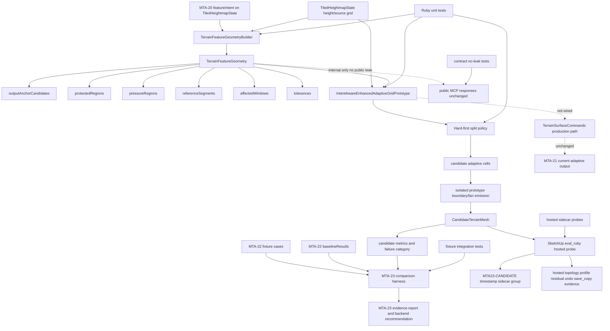

# Technical Plan: MTA-23 Prototype Intent-Constrained Adaptive Output Backend
**Task ID**: `MTA-23`
**Title**: `Prototype Intent-Constrained Adaptive Output Backend`
**Status**: `finalized`
**Date**: `2026-05-06`

## Source Task

- [Prototype Intent-Constrained Adaptive Output Backend](./task.md)

## Problem Summary

MTA-20 added durable terrain `featureIntent`, but the current adaptive output backend still mostly
behaves like a heightmap-only simplifier. MTA-19 proved that correct heightfield samples and green
local tests are not enough: emitted SketchUp terrain topology can still fail around corridors,
protected regions, combined edits, and hosted runtime behavior.

MTA-23 must implement a real validation-only simplification prototype. Validation-only means the
candidate is not production-wired; it does not mean mocked, simulated, planner-only, or diagnostic
only. The task must produce actual candidate geometry, compare it to the MTA-22 baseline, run
hosted sidecar probes for promising rows, and recommend whether to productionize later, pursue
constrained Delaunay/CDT, repair feature geometry, or stop/replan.

## Goals

- Derive backend-neutral executable output-planning geometry from MTA-20 `featureIntent`.
- Implement a real validation-only enhanced adaptive grid/quadtree-style candidate backend.
- Emit actual candidate vertices, triangles, metrics, failure categories, and comparison rows.
- Compare candidate rows against MTA-22 fixtures and MTA-21 baseline rows without mutating baseline
  artifacts.
- Run SketchUp-hosted sidecar probes for representative promising rows.
- Preserve public MCP contracts and production terrain output behavior.
- Produce evidence that distinguishes feature-geometry failure, adaptive-candidate failure,
  productionizable adaptive behavior, and CDT/Delaunay follow-up justification.

## Non-Goals

- Shipping or enabling a production terrain output backend.
- Adding a feature flag, default backend switch, or hidden production path.
- Changing public MCP tool names, schemas, dispatcher behavior, response shapes, docs, or examples.
- Mocking or simulating candidate output instead of implementing a real simplification kernel.
- Treating current-kernel ablations as the primary candidate.
- Implementing constrained Delaunay/CDT in MTA-23.
- Adding arbitrary polygons, clipping, breakline insertion, arbitrary triangle insertion, or dense
  fallback.
- Persisting candidate mesh, raw vertices, raw triangles, expanded geometry, constraints, or solver
  internals as terrain source truth.
- Treating feature geometry as terrain-edit validation or future-edit constraints.

## Related Context

- HLD: [Managed Terrain Surface Authoring](specifications/hlds/hld-managed-terrain-surface-authoring.md)
- Task: [MTA-19 failed/reverted simplification attempt](specifications/tasks/managed-terrain-surface-authoring/MTA-19-implement-detail-preserving-adaptive-terrain-output-simplification/summary.md)
- Task: [MTA-20 feature intent foundation](specifications/tasks/managed-terrain-surface-authoring/MTA-20-define-terrain-feature-constraint-layer-for-derived-output/summary.md)
- Task: [MTA-21 conforming adaptive output baseline](specifications/tasks/managed-terrain-surface-authoring/MTA-21-make-adaptive-terrain-output-conforming/summary.md)
- Task: [MTA-22 fixture pack and baseline results](specifications/tasks/managed-terrain-surface-authoring/MTA-22-capture-adaptive-terrain-regression-fixture-pack/summary.md)

## Research Summary

- MTA-19 is the negative analog. It produced real simplifier code, passed local CI, then failed
  hosted corridor-heavy verification and was reverted. The plan must avoid arbitrary insertion,
  free-form scoring, post-hoc repair loops, dense fallback, and local-only confidence.
- MTA-20 is implemented and provides durable `featureIntent`, `FeatureIntentSet`, feature emitters,
  planner diagnostics, and runtime context. It does not implement feature-aware output generation.
- MTA-21 is implemented and provides current conforming adaptive output behavior. It is useful as an
  emission/reference pattern but must not become a production integration path for this candidate.
- MTA-22 is implemented and provides fixture cases, immutable `baselineResults`, coverage
  limitations, and loader/test infrastructure. MTA-23 owns candidate execution and comparison rows.
- External consensus accepted the two-layer shape and hard-first split. The adversarial review
  raised backend-neutral evidence concerns; the accepted correction is `referenceSegments` with
  strength/role for comparable residuals, not hard corridor constraint segments.

## Technical Decisions

### Data Model

MTA-23 has two implementation layers:

1. `TerrainFeatureGeometryBuilder` / `TerrainFeatureGeometry`
   - Backend-neutral executable output-planning geometry derived from MTA-20 `featureIntent`.
   - SketchUp-free and JSON-safe at its boundaries.
   - Runtime/internal only; expanded geometry is not persisted as terrain source truth.
   - Reusable by the enhanced adaptive grid/quadtree prototype and by a later CDT/Delaunay
     prototype if MTA-23 evidence justifies that path.

2. `IntentAwareEnhancedAdaptiveGridPrototype`
   - Real validation-only simplification kernel.
   - Consumes `TiledHeightmapState` plus `TerrainFeatureGeometry`.
   - Emits actual candidate vertices, triangles, metrics, and result rows.
   - Is not mocked, simulated, planner-only, production-wired, feature-flagged, or exposed through
     public MCP responses.

Generated candidate mesh is disposable derived output. Terrain state remains authoritative.

#### Strength Semantics

Feature geometry is only input to derived mesh generation. It does not validate, reject, constrain,
or preserve future terrain edits.

- `hard`: preserve or avoid crossing in generated mesh; record violations.
- `firm`: strongly refine and measure representation quality.
- `soft`: secondary refinement pressure.

Hard output geometry is intentionally narrow:

- `preserve_region`: protected-domain non-crossing.
- `fixed_control`: fixed output anchor representation.

Corridor, survey, and planar features are firm pressure and metrics, not hard violations.

#### TerrainFeatureGeometry Schema

`TerrainFeatureGeometry` uses simple primitives only:

- `outputAnchorCandidates`
- `protectedRegions`
- `pressureRegions`
- `referenceSegments`
- `affectedWindows`
- `tolerances`

Avoid arbitrary polygons and clipping in MTA-23 unless an existing feature payload already gives a
simple shape that can be reduced to these primitives.

`outputAnchorCandidates` required fields:

- `id`
- `featureId`
- `role`
- `strength`
- `ownerLocalPoint`: `[x, y]`

`outputAnchorCandidates` optional fields:

- `gridPoint`: `[col, row]`
- `tolerance`

Anchor hit distance is Euclidean owner-local XY distance from candidate vertex to anchor point. It
is not grid-cell distance and does not include Z.

`protectedRegions` required fields:

- `id`
- `featureId`
- `role`
- `primitive`: `rectangle` or `circle`
- `ownerLocalBounds` for rectangles, encoded as `[[minX, minY], [maxX, maxY]]`
- `ownerLocalCenterRadius` for circles, encoded as `[centerX, centerY, radius]`

`protectedRegions` optional fields:

- `boundaryTolerance`

Protected regions are hard. Preserve interiors do not require dense interior conformity; the hard
requirement is protected-domain non-crossing.

`pressureRegions` required fields:

- `id`
- `featureId`
- `role`
- `strength`: `firm` or `soft`
- `primitive`: `rectangle`, `circle`, or `corridor`
- `ownerLocalShape`

`pressureRegions` optional fields:

- `gridWindow`
- `influenceDistance`
- `targetCellSize`
- `tolerance`

For `primitive: "corridor"`, `ownerLocalShape` must be:

```text
{
  "centerline": [[x, y], ...],
  "width": number,
  "blendDistance": number
}
```

It is derived from `CorridorFrame`. Side-band and endpoint-cap zones are represented through this
shape plus `referenceSegments`.

`referenceSegments` required fields:

- `id`
- `featureId`
- `role`
- `strength`: `firm` or `soft`
- `ownerLocalStart`: `[x, y]`
- `ownerLocalEnd`: `[x, y]`

`referenceSegments` optional fields:

- `influenceDistance`
- `targetCellSize`
- `tolerance`

`referenceSegments` are backend-neutral reference/evidence geometry. They are not hard corridor
constraints in MTA-23. Corridor centerlines, side bands, and endpoint cap references may emit firm
reference segments so adaptive and future CDT/Delaunay candidates can report comparable residuals.

`affectedWindows` required fields:

- `featureId`
- `role`
- `minCol`
- `minRow`
- `maxCol`
- `maxRow`
- `source`: `payload` or `derived_influence`

`affectedWindow` bounds or caps output planning and diagnostics. It is not itself a hard geometry
claim.

`tolerances` required fields:

- `value`

`tolerances` optional fields:

- `featureId`
- `role`
- `strength`

Coordinate model:

- Owner-local XY is primary geometry.
- Grid coordinates and windows are computed where derivable for adaptive-cell scoring.
- No SketchUp objects are stored in feature geometry.
- All geometry must be JSON-safe.

#### Feature Derivation Rules

| Feature kind | Output geometry | Strength |
| --- | --- | --- |
| `preserve_region` | protected region + boundary pressure | hard |
| `fixed_control` | output anchor candidate at control point | hard |
| `linear_corridor` | centerline, side bands, endpoint cap zones, endpoint anchor candidates, firm reference segments | firm |
| `survey_control` | output anchor candidate + support-region pressure | firm |
| `planar_region` | support region + boundary/tolerance pressure | firm |
| `target_region` | support region + falloff/boundary pressure | soft |
| `fairing_region` | support region/detail pressure | soft |
| `inferred_heightfield` | runtime break/transition pressure | soft |

Implementation rules:

- Name point-like geometry `outputAnchorCandidates`, not mandatory points.
- Anchor candidates carry `strength`, `featureId`, `role`, point, and optional tolerance.
- Corridor geometry derives from existing `CorridorFrame` math:
  - centerline from start/end controls
  - side bands from width and `sideBlend.distance`
  - endpoint cap zones from start/end controls and half-width/blend distance
- Region geometry reuses existing rectangle/circle semantics from `RegionInfluence` where possible.

Derivation fallback rules:

- Hard `preserve_region` / `fixed_control` derivation failure classifies as
  `feature_geometry_failed`.
- Firm or soft derivation failure records a limitation and continues.
- Missing `affectedWindow` derives from primitive geometry where possible, otherwise the window is
  omitted.
- Missing corridor width/blend emits centerline reference only and records a limitation.

### API and Interface Design

Internal candidate entrypoint:

```text
IntentAwareEnhancedAdaptiveGridPrototype.run(
  state: TiledHeightmapState,
  feature_geometry: TerrainFeatureGeometry,
  base_tolerance:,
  max_cell_budget:,
  max_face_budget:,
  max_runtime_budget:
)
```

The candidate returns JSON-safe prototype-owned result data:

- candidate mesh vertices and triangles for tests/hosted sidecar generation
- candidate cells and split diagnostics for tests
- candidate row metrics
- failure category
- budget status
- limitations/provenance

Candidate cell fields:

- `min_col`
- `min_row`
- `max_col`
- `max_row`
- `height_error`
- `hard_requirement_status`
- `firm_pressure`
- `soft_pressure`
- `local_tolerance`
- `split_reason`

Split policy uses a stable lexicographic tuple. Numeric values inside a tier are tie-breakers only
and must not reorder tiers. Free-form weighted scoring is rejected.

Locked priority order:

1. unresolved hard preserve/fixed requirement
2. `height_error > local_tolerance`
3. firm pressure coverage needed
4. soft pressure coverage useful
5. larger cell
6. stable row/column/feature order

Comparator:

```text
[
  hard_unresolved ? 1 : 0,
  height_error > local_tolerance ? 1 : 0,
  firm_pressure_needed ? 1 : 0,
  soft_pressure_useful ? 1 : 0,
  cell_area,
  stable_cell_id
]
```

The implementation selects the maximum tuple for split priority. `cell_area` is
`(max_col - min_col) * (max_row - min_row)`. `stable_cell_id` is
`min_row * tile_cols + min_col`, giving lexicographic row-major order.

Pressure predicate:

```text
pressure_coverage_needed(cell, strength)
```

Behavior:

```text
return false unless cell overlaps any pressureRegion/referenceSegment influence for strength
return false if cell_size <= target_cell_size_for(strength, role)
return true
```

Default target cell sizes:

- firm corridor centerline/side/endcap: 1-2 source grid cells
- firm survey support: 1-2 source grid cells
- firm planar support/boundary: 2 source grid cells
- soft target/fairing/inferred: 3-4 source grid cells

Source grid cells mean cells of the input `TiledHeightmapState` resolution. Pressure aggregation
uses max rather than sum so overlapping firm/soft pressure does not become accidental hard behavior.

Local tolerance:

```text
local_tolerance(cell, feature_geometry, base_tolerance)
```

Monotone tightening only:

```text
tolerance = base_tolerance
hard_default = base_tolerance * 0.25
firm_default = base_tolerance * 0.5
soft_default = base_tolerance
floor = base_tolerance * 0.1

if cell overlaps hard protected/anchor influence:
  tolerance = min(tolerance, hard feature tolerance or hard_default)

if cell overlaps firm pressure/reference influence:
  tolerance = min(tolerance, firm feature tolerance or firm_default)

if cell overlaps soft pressure/reference influence:
  tolerance = min(tolerance, soft feature tolerance or soft_default)

return max(tolerance, floor)
```

These multipliers are named prototype tuning constants. They may be adjusted during implementation
only by changing named constants and tests, not by ad hoc scoring.

Stop conditions:

- stop at minimum cell size; or
- stop when hard requirements are represented/non-crossing, height is within local tolerance, and
  pressure predicates do not require further subdivision.

Budget stops should still produce a comparable candidate row rather than an empty result where
practical.

Emission:

- candidate geometry remains cell-boundary/fan based
- no arbitrary triangle insertion
- no breakline insertion
- no constrained Delaunay/CDT in MTA-23
- no dense fallback
- no silent production-backend fallback
- use an isolated prototype emission helper that mirrors relevant conforming adaptive logic rather
  than directly coupling to production `AdaptiveOutputConformity`

Candidate row top-level fields:

- `caseId`
- `resultSchemaVersion`
- `backend`
- `evidenceMode`
- `metrics`
- `budgetStatus`
- `failureCategory`
- `featureGeometryDigest`
- `referenceGeometryDigest`
- `knownResiduals`
- `limitations`
- `provenance`

Metrics include:

- `meshType`
- `faceCount`
- `vertexCount`
- `denseEquivalentFaceCount`
- `denseRatio`
- `maxHeightError`
- `profileChecks`
- `topologyChecks`
- `topologyResiduals`
- `protectedCrossingCount`
- `protectedCrossingSeverity`
- `hardViolationCounts`
- `anchorHitDistances`
- `firmResidualsByRole`
- `splitReasonHistogram`
- `timing`

Role-specific firm residuals must distinguish at least:

- corridor centerline residual
- corridor side-band residual
- corridor endpoint-cap residual
- survey anchor residual
- planar plane-fit residual

`topologyChecks` and `topologyResiduals` must include:

- `downFaceCount`
- `nonManifoldEdgeCount`
- `maxNormalBreakDeg`
- normal-break counts or maxima by relevant role where classifiable, especially corridor endpoint
  cap, corridor side-band, protected boundary, and general terrain edges

Productionization recommendation gates use named prototype thresholds:

- `HOSTED_MAX_NORMAL_BREAK_DEG_PRODUCTION_GATE = 30`
- `CANDIDATE_FACE_COUNT_BASELINE_MULTIPLIER_GATE = 1.5`

These thresholds are evidence gates for MTA-23 recommendations, not public product guarantees.

Split/stop reason enum:

- `hard_requirement_unresolved`
- `height_error_exceeded`
- `firm_pressure_needed`
- `soft_pressure_useful`
- `area_tiebreak`
- `budget_stop`
- `min_size_stop`
- `satisfied`
- `hard_violation_at_min_size`

Rows must include `splitReasonHistogram`.

Budget status values:

- `ok`
- `max_cell_budget_exceeded`
- `max_face_budget_exceeded`
- `max_runtime_budget_exceeded`

When budget status is not `ok`, classify as `performance_limit_exceeded` unless a higher-priority
failure applies. Partial rows are allowed when topology is valid enough to compare. They are never
productionizable.

### Public Contract Updates

Not applicable. MTA-23 intentionally changes no public MCP tool names, request schemas, response
shapes, dispatcher behavior, docs, or examples.

Required public-boundary checks:

- contract tests must prove candidate internals do not leak into public terrain responses
- public response serialization must not expose feature geometry, raw vertices, raw triangles,
  solver vocabulary, candidate rows, backend class names, or SketchUp objects
- if implementation discovers a public surface change is necessary, stop and re-plan the public
  tool registration/schema/dispatcher/tests/docs surface together

### Error Handling

Failure categories:

- `feature_geometry_failed`
- `candidate_generation_failed`
- `hard_output_geometry_violation`
- `firm_feature_residual_high`
- `topology_invalid`
- `performance_limit_exceeded`
- `comparison_not_applicable`
- `none`

Failure precedence:

```text
feature_geometry_failed
candidate_generation_failed
hard_output_geometry_violation
topology_invalid
performance_limit_exceeded
firm_feature_residual_high
comparison_not_applicable
none
```

Use the highest-precedence applicable category as `failureCategory`, and retain secondary details
in metrics or limitations.

Hard requirement status per cell:

- `none`
- `satisfied`
- `unresolved`
- `violated_at_min_size`

When multiple hard features affect a cell, aggregate by severity:

```text
violated_at_min_size > unresolved > satisfied > none
```

Retain per-feature detail in diagnostics/metrics.

Minimum-cell hard violation behavior:

- still emit the min-size cell
- mark `hard_requirement_status = violated_at_min_size`
- record hard violation counts
- classify the row as `hard_output_geometry_violation`
- prototype candidate-failure threshold is `0` hard violations

Protected crossing checks:

- no polygon clipping
- for each emitted triangle edge in owner-local XY:
  - rectangle: count edge intersections with rectangle boundary
  - circle: count segment-circle boundary intersections
  - ignore edges whose both endpoints lie on the same protected boundary segment within tolerance
- intersection uses owner-local Euclidean distance `<= boundaryTolerance`, or `1e-6` if
  `boundaryTolerance` is absent
- endpoints lying on the boundary are not counted as crossings
- for circles, only true boundary intersections are counted; interior chords are measured by chord
  length only for severity

Record:

- `protected_crossing_count`
- `protected_crossing_severity`

Severity:

- rectangle: maximum emitted edge length inside the protected rectangle after boundary intersection
- circle: maximum straight-line chord length of the emitted edge segment that lies inside the circle,
  measured in owner-local XY, not arc length

Fixed anchor representation:

- a fixed anchor is represented if any emitted candidate vertex is within anchor tolerance of
  `ownerLocalPoint`
- if not represented and the containing cell is above min size, hard status is `unresolved`
- if min size and still not represented, emit `fixed_anchor_missing` or
  `fixed_anchor_residual_exceeded`

### State Management

- `TiledHeightmapState` remains source of truth.
- `featureIntent` remains durable MTA-20 state; `TerrainFeatureGeometry` is derived runtime data.
- Candidate mesh, candidate cells, expanded geometry, digests, and comparison rows are prototype/test
  artifacts only.
- MTA-22 `baselineResults` are read-only input.
- MTA-23 owns candidate result/comparison artifacts.
- Hosted sidecar groups are diagnostic output and must not mutate managed terrain output or terrain
  source state.

### Integration Points

- `TiledHeightmapState#feature_intent` and grid/elevation data feed `TerrainFeatureGeometryBuilder`.
- `FeatureIntentSet` kinds/roles define the feature vocabulary.
- Existing `CorridorFrame` semantics should be reused for corridor centerline, side-band, and cap
  derivation.
- Existing `RegionInfluence` rectangle/circle semantics should be reused where practical.
- Prototype emission mirrors the relevant conforming adaptive boundary/fan behavior but remains
  isolated from production output code.
- MTA-22 fixture loader and baseline row shape are used for candidate comparison.
- Hosted validation uses `eval_ruby` sidecar probes.

### Configuration

Prototype constants:

- `hard_default = base_tolerance * 0.25`
- `firm_default = base_tolerance * 0.5`
- `soft_default = base_tolerance`
- `floor = base_tolerance * 0.1`
- default boundary tolerance `1e-6` when no `boundaryTolerance` is present
- default role target cell sizes listed in the pressure predicate section

These are named prototype constants and test-visible. They must not become hidden free-form scoring
weights.

## Architecture Context



## Key Relationships

- `TerrainFeatureGeometryBuilder` is the reusable internal bridge from durable MTA-20 intent to
  mesh-generation geometry.
- `TerrainFeatureGeometry` is backend-neutral; adaptive consumes it first, later CDT/Delaunay may
  reuse it.
- `IntentAwareEnhancedAdaptiveGridPrototype` is real but validation-only.
- Candidate emission is isolated from production `AdaptiveOutputConformity`.
- MTA-22 baseline rows are read-only comparison input; MTA-23 owns candidate rows and report
  artifacts.
- Hosted probes emit sidecar geometry only and do not mutate managed terrain output or source state.

## Acceptance Criteria

- The implementation derives `TerrainFeatureGeometry` from MTA-20 `featureIntent` without depending
  on SketchUp objects.
- `TerrainFeatureGeometry` is JSON-safe and contains only the agreed primitive collections:
  `outputAnchorCandidates`, `protectedRegions`, `pressureRegions`, `referenceSegments`,
  `affectedWindows`, and `tolerances`.
- Feature derivation follows the locked hard/firm/soft mapping: hard only for `preserve_region` and
  `fixed_control`; firm for corridor, survey, and planar; soft for target, fairing, and inferred
  heightfield.
- Corridor derivation uses existing corridor-frame semantics and produces firm pressure/reference
  geometry without hard corridor constraints, breaklines, or mandatory corridor points.
- Hard `preserve_region` and `fixed_control` derivation failures classify as
  `feature_geometry_failed`; firm/soft derivation gaps continue with recorded limitations.
- The candidate backend is a real `IntentAwareEnhancedAdaptiveGridPrototype` simplification kernel
  that emits candidate vertices, triangles, and metrics.
- The candidate backend consumes `TerrainFeatureGeometry`; tests fail if candidate output ignores
  feature geometry.
- Candidate subdivision uses the hard-first lexicographic split policy and rejects weighted/free-form
  scoring.
- `local_tolerance(cell, feature_geometry, base_tolerance)` is monotone-tightening and applies the
  locked hard/firm/soft defaults and floor.
- `pressure_coverage_needed(cell, strength)` is used consistently for firm and soft pressure and
  respects target source-grid cell sizes.
- Stop conditions include min-size stop, satisfied hard/height/pressure stop, and budget-stop
  behavior that produces comparable rows where practical.
- Min-size hard violations still emit candidate cells, record `violated_at_min_size`, set hard
  violation metrics, and classify the row as `hard_output_geometry_violation`.
- Protected crossing checks support rectangle and circle primitives only, use owner-local XY segment
  checks, and report count and severity.
- Fixed anchor checks use Euclidean owner-local XY vertex distance and report anchor hit/residual
  metrics.
- Candidate geometry remains cell-boundary/fan based and does not use arbitrary triangle insertion,
  breakline insertion, constrained Delaunay/CDT, dense fallback, or production-backend fallback.
- Candidate emission is isolated from production output wiring and does not become a public or
  default terrain backend.
- Candidate rows use the agreed compact MTA-22-compatible shape plus candidate additions: digests,
  budget status, failure category, hard violations, role-specific firm residuals, topology
  residuals, and split reason histogram.
- Failure category precedence is deterministic and preserves secondary details in metrics or
  limitations.
- MTA-22 `baselineResults` are not mutated; MTA-23 owns candidate/comparison result artifacts.
- Comparison evidence can distinguish feature-geometry failure, candidate-generation failure, hard
  output violation, topology failure, performance limit, firm residual failure, and
  comparison-not-applicable cases.
- Public MCP responses, schemas, dispatcher behavior, and production `TerrainSurfaceCommands` output
  remain unchanged.
- Contract stability tests prove candidate internals, feature geometry, raw vertices, raw triangles,
  solver vocabulary, and backend-specific terms do not leak into public responses.
- Hosted probes create `MTA23-CANDIDATE-<timestamp>` sidecar geometry outside existing model bounds
  and do not mutate managed terrain output or terrain source state.
- Hosted probe evidence records before/after top-level entity preservation, generated face/vertex
  count, topology checks, profile/residual checks where applicable, timing, undo where practical,
  and `save_copy` where practical.
- Any skipped full save/reopen validation is explicitly recorded as a validation gap, and skipped
  save/reopen prevents a final productionization recommendation.
- The final report recommends exactly one of: productionize adaptive candidate later, pursue
  constrained Delaunay/CDT follow-up, fix feature geometry first, or stop/replan.
- The final recommendation cites concrete candidate, fixture, and hosted evidence supporting that
  path.

## Final Recommendation Criteria

Recommend productionizing the adaptive candidate in a later task only when:

- no hard violations
- topology valid
- `topologyChecks.downFaceCount == 0`
- `topologyChecks.nonManifoldEdgeCount == 0`
- hosted normal-break diagnostics are reviewed against the feature role that produced them; a single
  global max-normal-break threshold is not a production gate for deliberate corridor transitions,
  endpoint caps, protected-boundary checks, or other intended grade changes
- no performance budget failure
- candidate face count is not more than
  `CANDIDATE_FACE_COUNT_BASELINE_MULTIPLIER_GATE` times the MTA-22 baseline face count for the row
- dense ratio materially improves or remains within the accepted baseline comparison bound
- firm residuals are acceptable on representative cases
- hosted probes pass for promising rows
- hosted save/reopen recheck passes for rows used to justify productionization

Recommend constrained Delaunay/CDT follow-up when:

- feature geometry derives successfully; and
- adaptive candidate repeatedly fails firm corridor/survey/planar residuals, or needs too many faces
  to satisfy firm/reference geometry, or hosted topology remains invalid despite valid feature
  geometry after separating invalid topology from intentional role-specific normal breaks

Recommend fixing feature geometry first when:

- hard/firm/soft primitives cannot be derived reliably
- `featureGeometryDigest` or `referenceGeometryDigest` is unstable
- residual metrics cannot identify feature-specific failures

Recommend stop/replan when:

- both feature geometry and adaptive candidate fail; or
- MTA-22 fixtures are insufficient to support a credible recommendation

## Test Strategy

### TDD Approach

Implement test-first in this order:

1. Feature geometry schema and digest tests.
2. Feature derivation tests for each MTA-20 feature kind.
3. Split policy, pressure predicate, and local tolerance unit tests.
4. Hard checks for protected crossing and fixed anchor representation.
5. Candidate backend tests that prove real geometry emission and feature-aware subdivision.
6. Candidate row/failure classification tests.
7. MTA-22 fixture integration comparison tests.
8. Public no-leak contract tests.
9. Hosted sidecar probe checks for representative promising rows.

### Required Test Coverage

- Unit tests for `TerrainFeatureGeometryBuilder`:
  - JSON-safe schema
  - owner-local/grid coordinate projection
  - no SketchUp object references
  - preserve/fixed hard derivation failures
  - firm/soft derivation limitations
  - corridor centerline/side/endcap/reference segment derivation
  - rectangle/circle region derivation
  - stable `featureGeometryDigest` and `referenceGeometryDigest`

- Unit tests for split behavior:
  - hard-first tuple ordering
  - deterministic `cell_area` and `stable_cell_id`
  - no weighted/free-form scoring
  - pressure aggregation by max
  - `pressure_coverage_needed(cell, strength)`
  - monotone `local_tolerance`

- Unit tests for hard checks:
  - rectangle protected crossing count/severity
  - circle protected crossing count/chord severity
  - boundary endpoint tolerance behavior
  - fixed anchor Euclidean XY hit distance
  - min-size hard violation classification

- Candidate backend tests:
  - emits vertices and triangles
  - consumes feature geometry
  - no arbitrary insertion, breakline insertion, CDT/Delaunay, dense fallback, or production fallback
  - stop conditions
  - budget statuses
  - split reason histogram
  - failure precedence
  - `maxNormalBreakDeg`, down-face count, and non-manifold edge count in candidate diagnostics
  - role-specific topology residuals for corridor endpoint-cap and side-band reference geometry

- Fixture integration tests:
  - MTA-22 fixture cases can produce MTA-23 candidate rows
  - baseline rows are not mutated
  - comparison output distinguishes all failure categories
  - final recommendation criteria are exercised through controlled rows
  - local or hosted failures can capture `TiledHeightmapState`, `TerrainFeatureGeometry`, candidate
    row, digests, and fixture id for regression replay

- Contract stability tests:
  - no public leakage of candidate internals, raw mesh, feature geometry, solver terms, or backend
    names
  - production `TerrainSurfaceCommands` and current public terrain responses remain unchanged

- Hosted probe tests/checklist:
  - sidecar group naming and placement
  - candidate-only metadata dictionary
  - before/after top-level preservation
  - face/vertex counts
  - down-face and non-manifold checks
  - profile/residual checks where applicable
  - timing, undo, and `save_copy` where practical
  - save/reopen recheck for any row used to recommend productionization, or an explicit downgrade
    that prevents a final productionization recommendation
  - explicit save/reopen gap if skipped

## Instrumentation and Operational Signals

- `featureGeometryDigest`
- `referenceGeometryDigest`
- `splitReasonHistogram`
- `budgetStatus`
- `failureCategory`
- `protectedCrossingCount`
- `protectedCrossingSeverity`
- `hardViolationCounts`
- `anchorHitDistances`
- `firmResidualsByRole`
- face count, vertex count, dense equivalent count, dense ratio
- max height error and profile checks
- topology checks
- topology residuals including max normal break and role-specific normal-break evidence
- hosted timing, undo, `save_copy`, and scene-preservation evidence
- captured failure payloads for hosted/local probe failures: `TiledHeightmapState`,
  `TerrainFeatureGeometry`, candidate row, digests, and fixture id

## Implementation Phases

1. Add `TerrainFeatureGeometry` value object, JSON-safe schema normalization, digests, and tests.
2. Add `TerrainFeatureGeometryBuilder` derivation for preserve/fixed/region basics with hard failure
   and limitation handling.
3. Add corridor/survey/planar/target/fairing/inferred derivation, including firm `referenceSegments`
   and role-specific geometry tests.
4. Add candidate split policy, `pressure_coverage_needed`, `local_tolerance`, and hard check units.
5. Add `IntentAwareEnhancedAdaptiveGridPrototype` cell subdivision and stop/budget behavior.
6. Add isolated prototype boundary/fan emission and candidate mesh value/result data.
7. Add candidate row schema, metrics, failure precedence, digests, and result serialization.
8. Add MTA-22 fixture integration comparison without mutating baseline rows.
9. Add public contract no-leak coverage and production path stability assertions.
10. Add hosted sidecar probe harness and representative probe checklist.
11. Add failure-capture artifacts for local/hosted candidate failures.
12. Produce final evidence report with recommendation criteria applied.

## Rollout Approach

- No production rollout in MTA-23.
- Candidate backend remains internal/prototype/test-owned.
- No public MCP tool/schema/dispatcher/docs changes.
- No feature flag or default backend swap.
- MTA-24 is planned only if MTA-23 recommends a productionizable backend.
- If MTA-23 recommends CDT/Delaunay, it should be a later prototype using the same feature geometry
  and fixture comparison substrate.

## Risks and Controls

- False confidence from local tests: require MTA-22 comparison and hosted sidecar probes before any
  production recommendation.
- Candidate becomes planner-only: require actual candidate vertices/triangles and feature-sensitive
  geometry tests.
- Feature geometry over-hardens edit intent: test that corridor/survey/planar remain firm and only
  preserve/fixed produce hard violations.
- Feature geometry is too adaptive-specific for CDT follow-up: include owner-local primitives,
  `referenceSegments`, `featureGeometryDigest`, `referenceGeometryDigest`, and role-specific
  residuals.
- Firm corridor failures are hidden in aggregate metrics: require centerline, side-band,
  endpoint-cap residuals, and role-specific topology residuals.
- Protected crossing checks are underpowered: constrain MTA-23 to rectangle/circle primitives and
  record limitations/failures for unsupported hard geometry.
- Budget stops look successful: require explicit `budgetStatus`, `performance_limit_exceeded`, and
  “never productionizable” handling.
- Prototype emission couples to production: use isolated prototype emission helper and no production
  wiring.
- Public contract drift: run no-leak contract tests and stop/re-plan if public surface changes
  become necessary.
- Hosted sidecar mutates user scene: sidecar outside model bounds, candidate-only metadata,
  before/after top-level preservation, undo/save-copy evidence.
- Runtime/performance exceeds practical limits: max cell/face/runtime budgets and
  `performance_limit_exceeded` classification.
- Hosted evidence is single-session only: require save/reopen recheck for productionization
  recommendations or downgrade the recommendation.
- MTA-19-style visual topology failure hides behind residuals: require max normal-break diagnostics,
  down-face count, non-manifold count, and role-specific topology residuals in candidate rows.

## Premortem Gate

Status: WARN

### Unresolved Tigers

- None.

### Plan Changes Caused By Premortem

- Added required topology instrumentation: `topologyResiduals`, `maxNormalBreakDeg`, down-face count,
  non-manifold edge count, and role-specific normal-break evidence for corridor endpoint-cap,
  side-band, protected-boundary, and general terrain edges where classifiable.
- Added recommendation threshold `CANDIDATE_FACE_COUNT_BASELINE_MULTIPLIER_GATE = 1.5`.
- Replaced the early global `HOSTED_MAX_NORMAL_BREAK_DEG_PRODUCTION_GATE = 30` assumption with a
  role-aware hosted normal-break review. The global threshold was too blunt for deliberate corridor
  transitions and should be treated as a diagnostic signal, not a production gate.
- Added failure-capture artifacts for local/hosted failures: `TiledHeightmapState`,
  `TerrainFeatureGeometry`, candidate row, digests, and fixture id.
- Added hosted save/reopen guardrail for productionization recommendations: if save/reopen recheck is
  skipped, the report must downgrade the recommendation and record the gap.

### Accepted Residual Risks

- Risk: Adaptive grid/quadtree may still fail corridor endpoint-cap or side-band topology.
  - Class: Elephant
  - Why accepted: MTA-23 is intentionally a validation prototype; failure is useful if candidate
    rows and hosted probes identify adaptive-backend limits versus feature-geometry limits.
  - Required validation: role-specific firm residuals, topology residuals, MTA-22 comparison rows,
    and hosted sidecar probes.

- Risk: Adopted/irregular terrain may not produce enough inferred/reference geometry for decisive
  adaptive-candidate evidence.
  - Class: Elephant
  - Why accepted: expanding MTA-23 into a broad inferred-feature detector would violate scope; the
    correct outcome is `feature_geometry_failed` or feature-geometry repair recommendation when
    derivation is insufficient.
  - Required validation: derivation limitations, stable digests, fixture comparison, and final
    recommendation criteria that prevent productionization from created-only evidence.

- Risk: Public contract leakage.
  - Class: Paper Tiger
  - Why accepted: the candidate is not wired into production/public paths and the plan requires
    contract no-leak tests.
  - Required validation: public contract stability tests covering raw mesh, feature geometry,
    candidate row, solver vocabulary, and backend-name leakage.

- Risk: Budget-stop rows could look comparable but not viable.
  - Class: Paper Tiger
  - Why accepted: `budgetStatus`, `performance_limit_exceeded`, and never-productionizable handling
    are explicit.
  - Required validation: budget-stop candidate row tests and final recommendation gates.

### Carried Validation Items

- MTA-22 candidate comparison must include role-specific firm residuals and topology residuals.
- Hosted sidecar probes must record topology, timing, undo, save-copy, and scene-preservation
  evidence.
- Rows used for productionization recommendation must include save/reopen recheck, or the report must
  explicitly downgrade the recommendation and name the validation gap.
- Local or hosted candidate failures must capture replayable state/feature/candidate evidence for
  future regression work.

### Implementation Guardrails

- Do not harden corridor, survey, or planar features; they remain firm pressure and metrics.
- Do not add arbitrary insertion, breakline insertion, constrained Delaunay/CDT, dense fallback, or
  production fallback.
- Do not wire the candidate into `TerrainSurfaceCommands`, public MCP responses, or a feature flag.
- Do not recommend productionization from local-only evidence.
- Do not recommend productionization when hard violations, topology invalidity, budget failures, or
  missing hosted persistence evidence remain.

## Dependencies

- `MTA-20`: durable `featureIntent`, `FeatureIntentSet`, feature kinds and roles.
- `MTA-21`: current conforming adaptive output baseline/reference behavior.
- `MTA-22`: fixture cases, immutable baseline rows, fixture loader, and comparison substrate.
- `TiledHeightmapState`.
- Existing corridor frame semantics.
- Existing rectangle/circle region influence semantics.
- Hosted SketchUp `eval_ruby` access for sidecar probes.

## Quality Checks

- [ ] All required inputs validated
- [ ] Problem statement documented
- [ ] Goals and non-goals documented
- [ ] Research summary documented
- [ ] Technical decisions included
- [ ] Architecture context included
- [ ] Acceptance criteria included
- [ ] Test requirements specified
- [ ] Instrumentation and operational signals defined when needed
- [ ] Risks and dependencies documented
- [ ] Rollout approach documented when needed
- [ ] Small reversible phases defined
- [ ] Public contract update posture explicitly documented as not applicable
- [ ] Hosted SketchUp validation expectations documented
- [ ] Premortem completed with falsifiable failure paths and mitigations
- [ ] Planning-stage size estimate considered before premortem finalization
