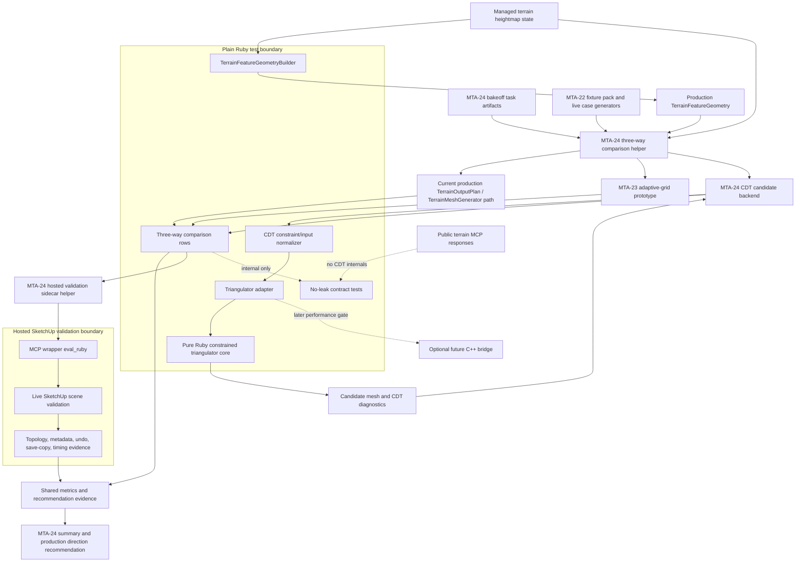

# Technical Plan: MTA-24 Prototype Constrained Delaunay/CDT Terrain Output Backend And Three-Way Bakeoff
**Task ID**: `MTA-24`
**Title**: `Prototype Constrained Delaunay/CDT Terrain Output Backend And Three-Way Bakeoff`
**Status**: `finalized`
**Date**: `2026-05-07`

## Source Task

- [Prototype Constrained Delaunay/CDT Terrain Output Backend And Three-Way Bakeoff](./task.md)

## Problem Summary

MTA-23 delivered the production `TerrainFeatureGeometry` substrate and proved that the
intent-aware adaptive-grid candidate is a serious upgrade candidate over current production terrain
output, especially for scene-level compactness and clean SketchUp topology. It did not justify an
unconditional production swap because hard preserve/fixed-anchor behavior, rough-terrain accuracy,
high-relief residuals, and runtime still need stronger evidence.

MTA-24 must implement a real constrained Delaunay/CDT or breakline-aware terrain output candidate
that is comparison-only, not production-wired. It must consume production `TerrainFeatureGeometry`,
emit real candidate meshes and diagnostics, compare against both current production output and the
MTA-23 adaptive-grid prototype on equivalent states, run the same live SketchUp validation families
used to close MTA-23, and end with a production-direction recommendation.

## Goals

- Implement a real comparison-only constrained Delaunay/CDT or breakline-aware candidate backend.
- Consume production `TerrainFeatureGeometry` as the backend-neutral constraint input boundary.
- Generate a candidate mesh row for every valid heightmap under comparison, even when constraints or
  CDT diagnostics are not fully satisfied.
- Compare current production output, MTA-23 adaptive-grid, and MTA-24 CDT on shared states and
  shared metrics.
- Run local fixture comparisons and hosted SketchUp sidecar bakeoff families.
- Recommend current backend, MTA-23 adaptive-grid, CDT, native-bridge follow-up, or a hybrid/fallback
  strategy from concrete evidence.

## Non-Goals

- Production-wiring CDT as the default terrain backend.
- Rejecting terrain edits from the comparison backend.
- Adding public user-facing backend selection or simplification controls.
- Changing public MCP request/response contracts.
- Persisting CDT meshes, raw triangles, expanded constraints, or solver internals as terrain state.
- Renaming or removing MTA-23 prototype files before production backend selection.
- Making native C++ bridge packaging part of the default MTA-24 implementation.
- Treating manual visual inspection alone as acceptance evidence.

## Related Context

- [MTA-24 task](./task.md)
- [MTA-23 summary](specifications/tasks/managed-terrain-surface-authoring/MTA-23-prototype-adaptive-simplification-backend-with-grey-box-sketchup-probes/summary.md)
- [MTA-23 size ledger](specifications/tasks/managed-terrain-surface-authoring/MTA-23-prototype-adaptive-simplification-backend-with-grey-box-sketchup-probes/size.md)
- [MTA-22 summary](specifications/tasks/managed-terrain-surface-authoring/MTA-22-capture-adaptive-terrain-regression-fixture-pack/summary.md)
- [MTA-20 summary](specifications/tasks/managed-terrain-surface-authoring/MTA-20-define-terrain-feature-constraint-layer-for-derived-output/summary.md)
- [MTA-19 summary](specifications/tasks/managed-terrain-surface-authoring/MTA-19-implement-detail-preserving-adaptive-terrain-output-simplification/summary.md)
- [Managed Terrain Surface Authoring HLD](specifications/hlds/hld-managed-terrain-surface-authoring.md)
- [Managed Terrain Surface Authoring PRD](specifications/prds/prd-managed-terrain-surface-authoring.md)
- [Domain analysis](specifications/domain-analysis.md)
- [Ruby coding guidelines](specifications/guidelines/ryby-coding-guidelines.md)
- [Ruby platform coding guidelines](specifications/guidelines/ruby-platform-coding-guidelines.md)
- [SketchUp extension development guidance](specifications/guidelines/sketchup-extension-development-guidance.md)

## Research Summary

- MTA-23 is the primary calibrated analog. It finished with validation burden `4`, discovery `4`,
  dependency drag `3`, and final confidence `3`. Its calibration says future terrain backend
  prototypes should assume a three-way evidence path early: candidate versus current, candidate
  versus hard-intent diagnostics, and candidate versus aggressive hosted terrain.
- MTA-19 is the key negative terrain-meshing analog. Correct heightfield samples can coexist with
  unreliable generated topology, long runtimes, and hosted SketchUp failures.
- MTA-22 provides the fixture and result-row substrate, but adopted/stress rows remain
  provenance-only locally. Hosted scene-level comparison is required for those families.
- MTA-20 and MTA-23 make `TerrainFeatureGeometry` production substrate. MTA-24 consumes it and must
  not rebuild feature intent or read raw SketchUp objects.
- CGAL and Triangle references show CDT requires explicit constraint handling, subconstraint or
  coverage tracking, robust orientation/incircle predicates, and careful handling of degeneracy.
- SketchUp Ruby C/C++ extensions are feasible, including a Ruby-to-C++ heavy-compute bridge, but
  native bridge work adds cross-platform build, binary loading, embedded-Ruby ABI, licensing, crash
  risk, and package verification scope. MTA-24 treats C++ as a performance follow-up gate, not the
  default implementation path.

## Technical Decisions

### Data Model

- `TerrainFeatureGeometry` is the CDT candidate input boundary. Candidate code consumes:
  - `outputAnchorCandidates`
  - `protectedRegions`
  - `pressureRegions`
  - `referenceSegments`
  - `affectedWindows`
  - `tolerances`
  - `featureGeometryDigest`
  - `referenceGeometryDigest`
- Candidate rows remain internal/task-owned and JSON-safe. They include MTA-23-style fields:
  `caseId`, `resultSchemaVersion`, `backend`, `evidenceMode`, `mesh`, `metrics`, `budgetStatus`,
  `failureCategory`, `featureGeometryDigest`, `referenceGeometryDigest`, `knownResiduals`,
  `limitations`, and `provenance`.
- MTA-24 CDT rows add candidate-only diagnostics:
  - `stateDigest`
  - `constraintCount`
  - `constrainedEdgeCoverage`
  - `delaunayViolationCount`
  - `triangulatorKind`
  - `triangulatorVersion`
  - CDT limitations or residuals
- Public terrain responses do not expose candidate rows or CDT internals.

### API and Interface Design

- Add an MTA-24-owned three-way comparison helper that calls:
  - current production output path through existing production planning/generation behavior
  - MTA-23 adaptive-grid prototype
  - MTA-24 CDT candidate backend
- Add a CDT backend with a batched triangulator adapter:
  - Ruby owns feature geometry consumption, input normalization, row shaping, metrics, sidecar
    evidence, no-leak behavior, and recommendation evidence.
  - The adapter accepts packed primitive arrays/hashes and returns JSON-safe mesh and diagnostic
    data.
  - The default MTA-24 implementation is pure Ruby.
  - A later C++ `poly2tri`/CDT bridge can replace only the triangulator core if performance evidence
    requires it.
- Add an MTA-24 sidecar/bakeoff helper that borrows MTA-23 sidecar patterns but avoids production
  sidecar refactoring.

### Public Contract Updates

Not applicable by default. MTA-24 does not change public MCP tools, request schemas, response
schemas, native tool catalog entries, dispatcher wiring, README usage, or public examples.

Required contract checks:

- Public terrain responses must not include `cdt`, `constrainedDelaunay`, `breakline`, raw
  triangles, expanded constraints, solver predicates, candidate rows, constraint graphs, or MTA-24
  prototype vocabulary.
- If implementation unexpectedly needs a public contract change, that change must update runtime
  behavior, native tool catalog/schema, dispatcher passthrough, contract tests, docs/examples, and
  task artifacts together.

### Error Handling

- The comparison backend never rejects terrain edits. Editing kernels remain separate from mesh
  generation.
- A valid heightmap must emit a candidate mesh row.
- Unsatisfied constraints, incomplete constrained-edge coverage, unsupported intersections,
  degeneracy, CDT diagnostic gaps, or runtime limits are recorded as residuals, limitations,
  budget status, and MTA-23-style failure categories.
- Reuse MTA-23 failure precedence unless a CDT residual truly requires a new category:
  `feature_geometry_failed`, hard output violation, `topology_invalid`, performance limit, firm
  residual high, then `none`.
- `candidate_generation_failed` is reserved for unexpected backend exceptions and should be treated
  as a prototype bug or high-severity comparison failure.

### State Management

- Terrain state remains authoritative.
- CDT output is disposable derived comparison geometry.
- CDT meshes, raw triangles, expanded constraints, and diagnostics are not persisted as terrain
  state.
- Hosted sidecars are explicitly marked validation artifacts and must not overwrite production
  terrain output or existing scene geometry.

### Integration Points

- `TerrainFeatureGeometryBuilder` derives production feature geometry from managed terrain state.
- MTA-22 fixture loader feeds locally replayable created-corridor cases into the comparison helper.
- Live hosted case generators or existing scene groups feed adopted/stress, hard preserve/fixed,
  aggressive varied, high-relief, and corridor-pressure families.
- Current production output remains the baseline and is not modified.
- MTA-23 adaptive-grid remains the prototype baseline and is not renamed or productionized in this
  task.
- MCP wrapper `eval_ruby` is the hosted validation integration path.

### Configuration

- Initial pure Ruby CDT budget envelope follows MTA-23 high-budget comparison:
  - `20.0` seconds runtime budget
  - `4096` point/constraint safety budget
  - face budget at dense equivalent unless a fixture defines a stricter comparison cap
- Fixed dense ratios must be treated as safety guards and reporting metadata, not as primary
  simplification targets. CDT refinement should stop when residual excess against the final edited
  heightmap is acceptable, not when a fixed `selected/dense` ratio is reached.
- Use one epsilon policy in predicates and tests:
  - default around `1e-9` for orientation/incircle
  - default around `1e-6` for duplicate/near-collinear detection
  - implementation may adjust values only with tests that preserve degeneracy limitation behavior

## Residual-Driven CDT Planning Direction

Live head-to-head checks showed a CDT prototype can preserve explicit edit features while
over-simplifying smooth or bumpy background heightmap detail. The CDT planner must therefore move
from fixed-ratio, feature-first point selection to final-surface residual refinement.

Ownership boundaries:

- `CdtTerrainPointPlanner` owns seed selection only:
  - terrain domain corners
  - hard fixed anchors
  - required protected/reference endpoints
  - protected rectangle corners and minimal boundary support where needed for constraints
  - source/dense baseline accounting and seed provenance
- `CdtTerrainPointPlanner` must not pre-fill dense pressure-region grids or affected-window grids.
  Firm/soft feature intent may influence tolerance and residual sampling priority, but it must not
  consume a large point budget before heightmap reconstruction error is measured.
- `IntentAwareAdaptiveGridPolicy` remains the shared intent-semantics helper:
  - hard/firm/soft overlap interpretation
  - local tolerance multipliers
  - anchor/protected-region interpretation
  - no CDT subdivision budget ownership
- `CdtTerrainCandidateBackend` owns the iterative CDT loop:
  1. ask the planner for seed points and mandatory constraints
  2. triangulate
  3. measure reconstructed height error against the final edited heightmap
  4. add distributed worst residual samples whose `error - localTolerance` is positive
  5. retriangulate
  6. stop on residual satisfaction, safety cap, runtime cap, or face cap
- `CdtHeightErrorMeter` remains stateless and owns residual measurement. Add an API that accepts
  `feature_geometry` and `base_tolerance` explicitly and returns per-sample `localTolerance`,
  `residualExcess`, and distributed worst samples.

Feature weighting rules:

- Hard features are mandatory and should impose strict local tolerance.
- Firm features lower local tolerance and guide residual sampling, but do not pre-consume dense
  support points.
- Soft features apply a mild local tolerance adjustment and do not guarantee point density by
  themselves.
- Affected windows guide where local tolerance and residual sampling matter; they do not directly
  add grid points.

Budget rules:

- Final edited surface complexity earns points. A bumpy final heightmap can exceed a fixed sparse
  ratio when residuals justify it.
- Flattened or planarized final surfaces should collapse aggressively even if the source terrain
  was complex or feature-rich.
- Safety caps remain required to prevent runaway Ruby computation, but hitting a safety cap is a
  limitation/stop reason, not a clean success.
- Candidate metrics must expose point provenance and stop reasons, including `seedCount`,
  `mandatoryCount`, `residualCount`, `stopReason`, `maxResidualExcess`, and `safetyCap`.

## CDT Math Direction

- Build solver inputs in owner-local XY.
- Lift candidate vertex Z from terrain state by direct sample lookup or interpolation after
  triangulation.
- Initial triangulation uses Bowyer-Watson Delaunay over normalized points.
- Constraint recovery runs before final Delaunay optimization:
  - if the segment edge exists, mark it constrained
  - otherwise identify crossed triangles/edges
  - form independent polygonal cavities on each side of the segment
  - retriangulate each side independently
  - mark recovered edge or subedges constrained
- Final optimization flips only unconstrained edges that violate incircle/Delaunay diagnostics.
- Constrained edges are never flipped.
- Post-recovery diagnostics determine `delaunayViolationCount` and whether the row can claim CDT
  behavior.
- Minimal predicates are orientation/signed area, segment intersection, incircle, triangle
  area/degeneracy, and near-equality.

## Architecture Context

## Key Relationships

- `TerrainFeatureGeometryBuilder` and `TerrainFeatureGeometry` are production substrate from MTA-23.
  MTA-24 consumes them; it does not redefine feature intent.
- The MTA-24 comparison helper owns bakeoff orchestration and row equivalence.
- The CDT backend owns comparison-only mesh generation and diagnostics.
- The triangulator adapter isolates CDT math from row shaping, metrics, hosted sidecars, and any
  later C++ bridge.
- Hosted sidecar validation emits SketchUp geometry for inspection but does not replace production
  terrain output.
- Public response builders stay separate from comparison artifacts.

## Acceptance Criteria

- A real CDT/breakline-aware candidate backend consumes production `TerrainFeatureGeometry` and
  produces JSON-safe candidate rows with real vertices, triangles, metrics, diagnostics, limitations,
  and provenance.
- Every valid terrain heightmap used by the candidate emits a mesh row. Unsatisfied constraints, CDT
  diagnostic gaps, hard-output residuals, or performance limits downgrade the row and recommendation;
  they do not reject terrain edits or suppress mesh output.
- The CDT core triangulates in owner-local XY, lifts Z from terrain state after triangulation, and
  records constrained-edge coverage plus post-recovery Delaunay diagnostics where CDT behavior is
  claimed.
- Constraint normalization inserts supported fixed anchors, protected-region boundaries, reference
  segment endpoints, corridor segments, and pressure-region hints according to hard/firm/soft
  precedence.
- Duplicate, near-collinear, intersecting, or unsupported constraints are handled as explicit
  limitations/residuals while preserving mesh emission for valid heightmaps.
- Three-way comparison rows exist for current production output, MTA-23 adaptive-grid, and MTA-24 CDT
  on equivalent source states.
- Comparison rows record face count, vertex count, dense ratio, max height error, protected
  crossings, fixed-anchor residuals, topology residuals, runtime, budget status, failure category,
  constrained-edge coverage, and CDT diagnostics where applicable.
- MTA-22 locally replayable created-corridor cases run through the three-way local harness.
- Hosted SketchUp validation emits comparison-only sidecars for MTA-22 created/adopted/stress, hard
  preserve/fixed, aggressive varied, high-relief, and corridor-pressure families through MCP wrapper
  `eval_ruby`.
- Hosted evidence records topology on SketchUp-emitted faces, face/vertex counts, residuals, timing,
  metadata, undo, and save-copy or save/reopen evidence where practical.
- Current, MTA-23 adaptive-grid, and CDT sidecars are jointly live-validated visually before any
  production-direction recommendation is accepted.
- Public MCP request/response contracts remain unchanged, and no-leak tests prove CDT internals do
  not leak.
- The final MTA-24 summary recommends current backend, MTA-23 adaptive-grid, CDT, native-bridge
  follow-up, or a hybrid/fallback strategy from evidence.
- A hybrid/fallback recommendation is only valid when it names measurable routing gates from the
  comparison rows, including case families, hard-output violations, topology status, constrained-edge
  coverage, runtime budget status, and residual thresholds.

## Test Strategy

### TDD Approach

Write failing tests in the same order as the implementation phases. Do not start with hosted
sidecars or recommendation output. Prove the math and row model in plain Ruby first, then integrate
comparison and hosted validation.

### Required Test Coverage

- Constraint normalization from production `TerrainFeatureGeometry`.
- CDT point planning from production `TerrainFeatureGeometry`, including `outputAnchorCandidates`,
  `protectedRegions`, `pressureRegions`, `referenceSegments`, `affectedWindows`, `tolerances`,
  `targetCellSize`, and hard/firm/soft precedence.
- Smooth-terrain simplification tests proving selected CDT input points are materially fewer than
  the dense source grid before triangulation begins.
- Height-error reconstruction tests proving `maxHeightError` is measured against the source
  heightmap and participates in CDT viability gates.
- Residual-driven refinement tests proving non-mandatory CDT points are added by final-heightmap
  reconstruction excess rather than feature count or a fixed sparse ratio.
- Feature-guided local tolerance tests proving hard/firm/soft intent changes residual thresholds
  without pre-filling dense support grids.
- Triangulator adapter interface and simple real mesh output.
- Bowyer-Watson base triangulation.
- Constraint recovery and constrained-edge coverage.
- Delaunay diagnostics after constraint recovery.
- Degenerate/intersecting/near-collinear limitations that still emit mesh rows for valid heightmaps.
- Candidate row shape and MTA-23-style failure precedence.
- Three-way row equivalence for current, adaptive-grid, and CDT.
- Public no-leak contract tests for CDT internals.
- Hosted sidecar helper tests.
- Live SketchUp validation for the required case families.

### Revised TDD Queue After Live CDT Simplification Review

The first implementation pass produced real CDT sidecars but no credible simplification because the
candidate backend fed every sampled grid point into the triangulator. CDT by itself is not a
simplifier. The next TDD queue must therefore prove the missing point-planning behavior before
expanding row-level or hosted evidence.

1. Add or update a `CdtTerrainPointPlanner` seed-only seam and dense-baseline accounting.
   - Failing tests assert the planner reports source dimensions, dense source point count, dense
     equivalent face count, selected point count, seed point count, mandatory point count, and
     feature geometry source counts.
   - The planner must consume production `TerrainFeatureGeometry`, not raw SketchUp objects or
     fixture-only hashes.
   - The planner must not dense-fill pressure regions or affected windows before residual
     measurement.
2. Prove flat final surfaces stay sparse even with feature intent.
   - A planar or flattened `33x33` state with hard, firm, and soft features must remain near
     seed-only after CDT residual refinement.
   - Feature count alone must not produce thousands of points or faces.
3. Prove bumpy final surfaces can earn more points than flat surfaces.
   - A bumpy final heightmap with no features must receive residual points when reconstruction
     excess remains above local tolerance.
   - The stop reason must be `residual_satisfied` when residual excess reaches tolerance.
4. Prove real height-error and local residual-excess accounting.
   - `maxHeightError` must be computed from source-height reconstruction rather than hardcoded.
   - Tightening `base_tolerance` must add residual points; loosening it must permit fewer points.
   - `CdtHeightErrorMeter` must expose per-sample `localTolerance` and `residualExcess`.
5. Prove hard anchors and tolerances are mandatory seed inputs.
   - `outputAnchorCandidates` from `TerrainFeatureGeometryBuilder` must appear in selected points.
   - Anchor hit distances and hard violation counts must use the production tolerance fields.
6. Prove protected-region boundaries are mandatory seed inputs.
   - Rectangle protected boundaries must contribute corner and edge-support points.
   - Unsupported protected primitives must emit limitations while preserving valid-heightmap mesh
     output.
7. Prove firm/soft feature intent guides local tolerance without pre-filling dense support.
   - Firm/soft pressure regions and affected windows must lower or bias local residual tolerance.
   - They must not directly add a dense grid of points before residual measurement.
8. Prove distributed residual sampling preserves multiple separated terrain details.
   - A heightmap with two or more distant residual hotspots must add samples across multiple
     spatial buckets in a refinement pass.
   - One high-error hotspot must not monopolize every residual point in the batch.
9. Prove reference segments, corridor sides, and caps are represented without faking CDT success.
   - Reference endpoints and segment support points must enter the planner.
   - Unsupported or unrecovered constraints must lower constrained-edge coverage and emit explicit
     limitations.
10. Prove the backend no longer uses dense grid points or fixed ratios as default CDT input.
   - Tests must fail if `CdtTerrainCandidateBackend#normalize_input` unconditionally calls
     `grid_points(state)` as the point source.
   - Tests must fail if residual refinement stops only because `selectedPointCount` reaches a fixed
     dense ratio while positive residual excess remains.
   - The backend row must expose `selectedPointCount`, `seedCount`, `mandatoryCount`,
     `residualCount`, `maxResidualExcess`, `stopReason`, and `safetyCap`.
11. Prove safety caps emit valid meshes and explicit limitations.
   - A pathological rough case must still emit a mesh row.
   - Hitting point/runtime/face safety caps must set explicit stop reason and limitation metadata.
12. Prove three-way comparison blocks no-simplification or over-simplified CDT rows.
   - CDT viability must require acceptable `denseRatio`, `maxHeightError`, `budgetStatus`,
     `maxResidualExcess`, topology, and constrained-edge coverage.
   - A clean-topology CDT row near dense-equivalent face count must not produce a CDT production
     recommendation.
   - A low-face CDT row with visible or measured residual excess must not produce a CDT production
     recommendation.
13. Prove hosted sidecar evidence records simplification credibility and stop reasons.
    - Hosted payload/report evidence must include source dense face count, CDT face count,
      `denseRatio`, selected point count, source sample dimensions, `maxHeightError`, source group,
      residual stop reason, max residual excess, placement, topology, timing, undo, and
      save-copy/save-reopen status where practical.
    - Live verification must use MTA-23-scale case families, not only tiny smoke grids.

CDT math tests must include:

- unconstrained square produces Delaunay-valid triangulation
- fixed anchor becomes a candidate vertex
- protected rectangle boundary edges are represented
- corridor side/cap/reference segments are represented where supported
- constrained edges are not flipped away
- Delaunay violations are counted after constraint recovery
- intersecting protected/reference constraints still emit a mesh row with a constraint-coverage
  limitation
- near-collinear duplicate input records a degeneracy limitation and still emits a manifold mesh

## Instrumentation and Operational Signals

- `faceCount`, `vertexCount`, and `denseRatio`
- source dense face count and selected CDT point count
- seed, mandatory, and residual CDT point counts
- `maxHeightError`
- `maxResidualExcess`
- residual refinement `stopReason`
- safety cap value and whether it was reached
- `protectedCrossingCount` and protected crossing severity
- fixed-anchor residual distances
- `topologyChecks` including down faces and non-manifold edges
- `topologyResiduals`
- `constraintCount`
- `constrainedEdgeCoverage`
- `delaunayViolationCount`
- `budgetStatus`
- elapsed runtime
- `failureCategory`
- `limitations`
- feature and reference geometry digests
- hosted sidecar metadata, undo, save-copy/save-reopen, and original-scene preservation evidence
- hosted source group, source dimensions, placement offset, and simplification ratio evidence
- joint live visual validation notes for current, adaptive-grid, and CDT sidecars

## Recommendation Decision Gates

- Do not accept any production-direction recommendation until current, MTA-23 adaptive-grid, and CDT
  have been jointly live-validated visually in SketchUp for the required hosted families, alongside
  the recorded topology, residual, and timing metrics.
- Do not recommend CDT-only unless required hosted families produce CDT rows without hard-output
  violations, `topology_invalid`, or unexplained `candidate_generation_failed` rows, and CDT
  satisfies its constrained-edge coverage, Delaunay diagnostic claims, simplification ratio, and
  measured height-error tolerance within the row tolerances.
- Do not recommend adaptive-grid-only unless it remains stronger than CDT on topology, runtime,
  rough-terrain accuracy, and hard/firm residuals across equivalent local and hosted rows.
- Do not recommend current production output unless both prototypes fail to produce credible
  comparison evidence or both introduce worse topology, runtime, or hard-output risk than current.
- Recommend native-bridge follow-up when Ruby CDT produces useful simple-case evidence but cannot
  complete enough hosted/adopted/aggressive rows under the MTA-23-like performance envelope.
- Recommend hybrid/fallback only with falsifiable routing predicates, such as named case families or
  row thresholds for `budgetStatus`, hard-output violation, `topology_invalid`, constrained-edge
  coverage, and residual severity. A hybrid verdict must name the downstream production task gates
  rather than treating MTA-24 prototype routing as production-ready.

## Implementation Phases

1. Add CDT candidate test scaffolding and row contract skeleton.
2. Add constraint normalization from `TerrainFeatureGeometry`, including precedence and limitation
   handling.
3. Add `CdtTerrainPointPlanner` with production feature-geometry-driven point selection, dense
   baseline accounting, smooth-terrain reduction, and height-error test coverage.
4. Wire the CDT backend to planner-selected points instead of full-grid samples, preserving
   valid-heightmap mesh-row guarantee and JSON-safe diagnostics.
5. Add triangulator adapter with pure Ruby simple mesh output.
6. Implement Bowyer-Watson point triangulation, predicates, epsilon policy, and base diagnostics.
7. Implement constraint recovery, constrained-edge marking, and post-recovery Delaunay diagnostics.
8. Implement CDT candidate row metrics, MTA-23-style failure precedence, and performance budget
   reporting.
9. Implement MTA-24 three-way comparison helper and local fixture comparison rows, including
   no-simplification CDT downgrade gates.
10. Add public no-leak contract coverage for CDT internals.
11. Add MTA-24 hosted sidecar/bakeoff helper with simplification credibility metadata.
12. Run live SketchUp validation families and write the MTA-24 summary/recommendation.

## Rollout Approach

- No production rollout occurs in MTA-24.
- CDT remains comparison-only.
- Production backend choice moves to a later task after MTA-24 summary evidence.
- If MTA-24 recommends CDT or hybrid/fallback, the summary must explicitly identify the downstream
  production task entry gates, including `TerrainFeatureGeometry` input compatibility, no-leak
  contract coverage, and the three-way evidence rows that justify the direction.
- If Ruby CDT cannot produce credible bakeoff evidence under the planning envelope, the MTA-24
  summary should recommend a native bridge follow-up rather than widening this task into native
  packaging.

## Risks and Controls

- Computational geometry risk: plain Ruby predicates can misclassify near-degenerate orientation or
  incircle cases. Control: one epsilon policy, degeneracy limitation tests, and no CDT claim unless
  diagnostics pass.
- Constraint recovery risk: protected boundaries, fixed anchors, and corridor segments may not all
  be recoverable as constrained edges. Control: constrained-edge coverage metrics and residual
  categories while still emitting meshes.
- Valid-heightmap output risk: candidate code could treat unsatisfied constraints as edit refusals.
  Control: tests that valid heightmaps emit mesh rows even with unsatisfied/degraded constraints.
- Three-way equivalence risk: backends could compare different sampled states. Control: shared
  state digest, dimensions/spacing, provenance, and no independent hosted resampling per backend.
- Hosted topology risk: local mesh arrays may look valid while SketchUp-emitted sidecars have down
  faces, non-manifold edges, metadata defects, or scene mutation side effects. Control: live sidecar
  topology, metadata, undo, save-copy, placement, and original-geometry preservation checks.
- Performance risk: pure Ruby CDT may be too slow. Control: MTA-23-like benchmark envelope and a
  batched adapter boundary for a possible C++ bridge follow-up.
- Public contract drift risk: CDT internals could leak through public response builders. Control:
  keep comparison helpers out of public response paths and expand nested no-leak tests.
- Prototype-not-production risk: CDT may be real but still not production-worthy. Control: summary
  may recommend current, adaptive-grid, CDT, native bridge, or hybrid/fallback; production gates move
  to later tasks.
- Weak recommendation-gate risk: hybrid/fallback could become a narrative escape hatch instead of an
  implementable production direction. Control: require measurable routing predicates and downstream
  acceptance gates in the MTA-24 summary.

## Dependencies

- `MTA-20` feature intent foundation.
- `MTA-23` production `TerrainFeatureGeometry` and adaptive-grid prototype.
- `MTA-22` fixture pack and loader.
- Existing current production terrain output behavior.
- Live SketchUp MCP wrapper `eval_ruby` access for hosted validation.
- Ruby extension packaging constraints and no native geometry runtime dependency by default.

## Premortem Gate

Status: WARN

### Unresolved Tigers

- None.

### Plan Changes Caused By Premortem

- Added explicit recommendation decision gates so current/adaptive/CDT/native-bridge/hybrid outcomes
  are selected from falsifiable comparison-row evidence rather than narrative judgment.
- Added hybrid/fallback guardrails requiring measurable routing predicates and downstream production
  task entry gates.
- Added rollout guidance that CDT or hybrid recommendations must carry `TerrainFeatureGeometry`
  compatibility, no-leak coverage, and three-way evidence into the next production task.

### Accepted Residual Risks

- Risk: Pure Ruby CDT may be too slow for enough hosted/adopted/aggressive cases to support a direct
  CDT production recommendation.
  - Class: Elephant
  - Why accepted: MTA-24 is a bakeoff; a native-bridge follow-up recommendation is a valid outcome.
  - Required validation: every row records `budgetStatus`, timing, limitations, and whether missing
    hosted CDT rows downgrade to native bridge rather than CDT viability.
- Risk: Plain Ruby predicates and one epsilon policy may not handle all near-degenerate CDT inputs.
  - Class: Paper Tiger
  - Why accepted: the task does not claim production-ready robust computational geometry.
  - Required validation: degeneracy, near-collinear, intersection, and constrained-edge diagnostics
    tests must preserve mesh-row emission and record limitations.

### Carried Validation Items

- Local CDT math tests for base Delaunay, constraint recovery, constrained-edge coverage, Delaunay
  diagnostics, duplicate/near-collinear inputs, and intersecting constraints.
- Three-way row equivalence tests proving current, adaptive-grid, and CDT consume the same source
  state and comparable feature/reference digests.
- Public no-leak tests for CDT internals and prototype vocabulary.
- Hosted sidecar bakeoff through `eval_ruby` for MTA-22, hard preserve/fixed, aggressive varied,
  high-relief, and corridor-pressure families.
- Joint live visual validation of all three emitted methods before any production-direction decision.
- Final summary recommendation must name the measured gates and residuals behind current,
  adaptive-grid, CDT, native-bridge, or hybrid/fallback direction.

### Implementation Guardrails

- Do not reject terrain edits from the comparison backend.
- Do not suppress mesh output for a valid heightmap because constraints, CDT diagnostics, or runtime
  budget status are unsatisfied.
- Do not production-wire CDT, add public backend controls, or expose candidate rows/solver internals
  through public MCP responses.
- Do not call a row CDT-satisfied unless constrained-edge coverage and unconstrained-edge Delaunay
  diagnostics support that claim.
- Do not treat hybrid/fallback as production-ready routing without a downstream production task and
  explicit entry gates.

## Quality Checks

- [x] All required inputs validated
- [x] Problem statement documented
- [x] Goals and non-goals documented
- [x] Research summary documented
- [x] Technical decisions included
- [x] Architecture context included
- [x] Acceptance criteria included
- [x] Test requirements specified
- [x] Instrumentation and operational signals defined when needed
- [x] Risks and dependencies documented
- [x] Rollout approach documented when needed
- [x] Small reversible phases defined
- [x] Premortem completed with falsifiable failure paths and mitigations
- [x] Planning-stage size estimate considered before premortem finalization
