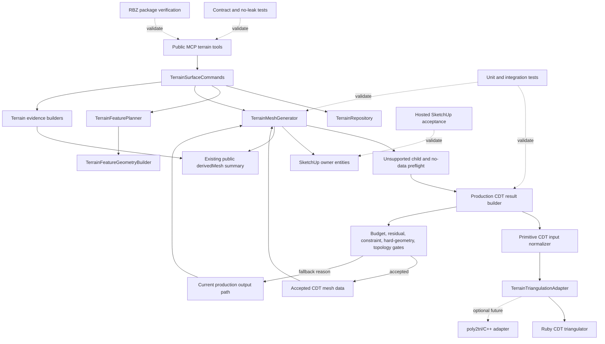

# Technical Plan: MTA-25 Productionize CDT Terrain Output With Current Backend Fallback
**Task ID**: `MTA-25`
**Title**: `Productionize CDT Terrain Output With Current Backend Fallback`
**Status**: `finalized`
**Date**: `2026-05-08`

## Source Task

- [Productionize CDT Terrain Output With Current Backend Fallback](./task.md)

## Problem Summary

MTA-24 selected residual-driven constrained Delaunay/CDT as the production-direction terrain output
backend, but the implementation is still a prototype and comparison harness. It proved sparse output
potential while exposing runtime pressure, conservative hard-geometry diagnostics, hosted topology
risks, and task-specific MTA-24 row/probe vocabulary that must not become production runtime shape.

MTA-25 must make CDT eligible for real production terrain output behind deterministic fallback to
the current production backend. The production path must consume final managed terrain state and
`TerrainFeatureGeometry`, compute and gate CDT output in memory before SketchUp mutation, preserve
public MCP response contracts, isolate MTA-24 harnesses from the production call graph, and prove
behavior with automated and hosted SketchUp acceptance.

## Goals

- Production-wire a CDT-oriented terrain output path behind explicit eligibility and fallback gates.
- Consume production `TerrainFeatureGeometry` and final managed terrain heightmap state as CDT input.
- Retain the current terrain output backend as fallback when CDT is disabled, unsupported, invalid,
  too expensive, or fails residual/topology/hard-geometry gates.
- Harden the triangulation adapter contract so Ruby CDT and a possible native/poly2tri adapter share
  the same primitive request, limits, diagnostics, and fallback envelope.
- Keep SketchUp entity mutation under `TerrainMeshGenerator` and keep CDT compute collaborators
  data-only.
- Preserve public MCP contracts, schemas, dispatcher behavior, response shapes, docs, and examples.
- Isolate or relocate MTA-24 task harnesses so production runtime does not depend on comparison rows
  or hosted bakeoff helpers.
- Validate through local tests, package verification, and hosted SketchUp acceptance over accepted
  CDT and forced-fallback cases.

## Non-Goals

- Re-running MTA-24 as another comparison-only bakeoff.
- Making CDT an unconditional default without fallback.
- Adding public backend selectors, simplification knobs, or CDT diagnostics.
- Changing public MCP terrain contracts without a separate contract task and coordinated artifact
  updates.
- Productionizing the MTA-23 adaptive-grid prototype as the selected backend.
- Implementing CDT dirty-window partial regeneration without a triangle ownership model.
- Making native C++ packaging mandatory unless Ruby CDT fails production gates during MTA-25.
- Letting a CDT strategy, triangulation adapter, or native bridge mutate SketchUp entities directly.

## Related Context

- [MTA-25 task](./task.md)
- [MTA-24 summary](specifications/tasks/managed-terrain-surface-authoring/MTA-24-prototype-constrained-delaunay-cdt-terrain-output-backend-and-three-way-bakeoff/summary.md)
- [MTA-23 summary](specifications/tasks/managed-terrain-surface-authoring/MTA-23-prototype-adaptive-simplification-backend-with-grey-box-sketchup-probes/summary.md)
- [MTA-22 summary](specifications/tasks/managed-terrain-surface-authoring/MTA-22-capture-adaptive-terrain-regression-fixture-pack/summary.md)
- [MTA-20 summary](specifications/tasks/managed-terrain-surface-authoring/MTA-20-define-terrain-feature-constraint-layer-for-derived-output/summary.md)
- [MTA-19 summary](specifications/tasks/managed-terrain-surface-authoring/MTA-19-implement-detail-preserving-adaptive-terrain-output-simplification/summary.md)
- [Managed Terrain Surface Authoring HLD](specifications/hlds/hld-managed-terrain-surface-authoring.md)
- [Managed Terrain Surface Authoring PRD](specifications/prds/prd-managed-terrain-surface-authoring.md)
- [Domain analysis](specifications/domain-analysis.md)
- [Ruby coding guidelines](specifications/guidelines/ryby-coding-guidelines.md)
- [SketchUp extension development guidance](specifications/guidelines/sketchup-extension-development-guidance.md)

## Research Summary

- MTA-24 is the closest calibrated analog. Its actual validation burden, implementation friction,
  discovery, and rework were all high enough that MTA-25 must assume hosted validation and fallback
  proof will dominate the task, not just production wiring.
- MTA-23 delivered `TerrainFeatureGeometry` as the backend-neutral constraint substrate and showed
  that terrain backend work needs candidate/current comparison, hard-intent diagnostics, and hosted
  SketchUp evidence.
- MTA-19 is the key negative analog: locally correct sampling did not prove SketchUp mesh viability.
  MTA-25 must require topology, mutation ordering, undo, and persistence evidence in the host.
- Current implementation research identified `TerrainMeshGenerator#regenerate` as the production
  insertion point. `TerrainSurfaceCommands` remains command/use-case orchestration; public MCP
  registration and dispatch are not expected to change.
- Existing MTA-24 `Cdt*` classes provide reusable triangulation, point-planning, and residual
  metering logic, but MTA-24 candidate rows and hosted-probe classes are validation artifacts, not
  production result shapes.
- SketchUp API research supports keeping bulk output generation under the existing operation and
  mutation conventions. `Entities#build` remains appropriate for bulk geometry generation, and
  `Model#start_operation` semantics mean MTA-25 should avoid nested operation assumptions.
- CGAL and Triangle references confirm the terrain pattern of triangulating XY constraints while
  lifting to 3D heights, but they also show that robust CDT needs explicit constraint handling and
  topology checks.
- `jhasse/poly2tri` is plausible for a future BSD-3-Clause native adapter, but its documented input
  restrictions require MTA-25 to own prevalidation for duplicate points, simple polygons, holes, and
  unsupported/intersecting constraints before any native call.

## Technical Decisions

### Data Model

- Add a production-owned CDT result envelope, separate from MTA-24 candidate rows.
- Accepted envelope fields:
  - `status: "accepted"`
  - `mesh` with JSON-safe `vertices` and `triangles`
  - `metrics`, `limits`, `limitations`
  - `featureGeometryDigest`, `referenceGeometryDigest`, `stateDigest`
  - `timing`
- Fallback envelope fields:
  - `status: "fallback"`
  - closed `fallbackReason`
  - sanitized `fallbackDetails`
  - `metrics`, `limits`, `limitations`
  - `featureGeometryDigest`, `referenceGeometryDigest`, `stateDigest`
  - `timing`
- Do not expose the internal envelope directly in public MCP terrain responses.
- `meshOwnership` is absent unless implementation adds an internal placeholder with tests proving it
  does not enable CDT partial regeneration and does not leak publicly.

### API and Interface Design

- CDT eligibility is internal to production terrain output generation. No public backend selector is
  added.
- `TerrainMeshGenerator` remains the lifecycle owner for:
  - unsupported-child and no-data preflight
  - choosing CDT versus current fallback
  - old derived output erasure timing
  - accepted CDT face emission
  - upward face normalization
  - derived face/edge marking
  - hidden derived edges
  - existing public `derivedMesh` summary shape
- CDT compute/result collaborators are data-only and must not mutate SketchUp entities.
- Introduce or extract production-owned collaborators behind the generator for:
  - feature/state-to-primitive CDT input normalization
  - triangulation adapter invocation
  - residual/topology/hard-geometry gate evaluation
  - result envelope assembly
- The triangulation adapter accepts normalized primitive data:
  - domain/boundary points
  - hard anchor points
  - protected/reference/corridor segments
  - optional hole/boundary descriptors when supported
  - residual/Steiner candidate points
  - local tolerance policy
  - epsilon policy
  - budget envelope
- Ruby CDT is the first implementation. A native/poly2tri adapter may be added only behind the same
  primitive request and result envelope.

### Public Contract Updates

Planned public delta: none.

MTA-25 must not change public request schemas, response schemas, `src/su_mcp/runtime/native/native_tool_catalog.rb`,
dispatcher passthrough, README usage, or public examples. Contract tests must prove public terrain
responses do not expose `cdt`, `constrainedDelaunay`, `poly2tri`, `nativeTriangulator`,
`candidateRow`, `comparisonRows`, `Mta24`, `rawTriangles`, `expandedConstraints`,
`solverPredicates`, `triangulatorKind`, `triangulatorVersion`, adapter limitations, or internal
fallback details.

If a public contract change becomes unavoidable, implementation must stop and update runtime
behavior, native catalog/schema, dispatcher passthrough, contract tests/fixtures, docs/examples,
task artifacts, plan, and size ledger in the same change.

### Error Handling

- Closed internal CDT fallback enum:
  - `cdt_disabled`
  - `feature_geometry_failed`
  - `native_unavailable`
  - `native_input_violation`
  - `input_normalization_failed`
  - `unsupported_constraint_shape`
  - `intersecting_constraints`
  - `pre_triangulate_budget_exceeded`
  - `point_budget_exceeded`
  - `face_budget_exceeded`
  - `runtime_budget_exceeded`
  - `residual_gate_failed`
  - `constraint_recovery_failed`
  - `hard_geometry_gate_failed`
  - `topology_gate_failed`
  - `invalid_mesh`
  - `adapter_exception`
- CDT failure falls back to current production output. It must not reject an otherwise valid terrain
  edit unless the current fallback also refuses.
- Adapter exceptions are converted to `adapter_exception` internally and must not leak exception
  class names, stack traces, native crash details, or solver internals to public responses.
- Native-unavailable and native-input-violation paths must be deterministic and safe even if no
  native adapter ships in MTA-25.

### State Management

- Terrain state remains authoritative; generated terrain output remains disposable derived geometry.
- Current unsupported-child and no-data refusals run before CDT compute and before erasing existing
  derived output.
- CDT computation, adapter invocation, and all gates complete in memory before old derived output is
  erased.
- If CDT falls back, current backend generation is selected before erase.
- If current fallback refuses, return the existing refusal shape and do not expose CDT internals.
- CDT is full-regeneration only in MTA-25. Existing current-backend dirty-window partial
  regeneration remains supported and covered against regression.
- `TerrainSurfaceCommands` keeps one coherent SketchUp operation for edit output behavior and does
  not introduce nested operations for CDT.

### Integration Points

- `src/su_mcp/terrain/terrain_surface_commands.rb`: continues to orchestrate terrain create/edit,
  repository save/load, feature planning, operation lifecycle, and public response assembly.
- `src/su_mcp/terrain/terrain_mesh_generator.rb`: receives enough post-save state and feature
  context to evaluate CDT and emit either accepted CDT or current fallback output.
- `src/su_mcp/terrain/terrain_feature_geometry_builder.rb`: remains production feature geometry
  source. CDT code must not read raw SketchUp objects directly.
- `src/su_mcp/terrain/cdt_terrain_candidate_backend.rb`,
  `src/su_mcp/terrain/cdt_terrain_point_planner.rb`,
  `src/su_mcp/terrain/cdt_height_error_meter.rb`, and
  `src/su_mcp/terrain/cdt_triangulator.rb`: may provide reusable internals, but production code must
  not depend on MTA-24 candidate rows or task harnesses.
- `src/su_mcp/terrain/mta24_three_way_terrain_comparison.rb` and
  `src/su_mcp/terrain/mta24_hosted_bakeoff_probe.rb`: remain validation/test artifacts or are moved
  out of production runtime ownership.
- Hosted SketchUp validation uses the MCP wrapper path, including `eval_ruby` where appropriate.

### Configuration

- Define named threshold constants or internal configuration for:
  - CDT enabled/disabled gate
  - point budget
  - projected face budget
  - dense-ratio safety budget
  - pre-triangulation runtime budget
  - residual-loop runtime budget
  - max residual and normalized residual excess
  - constraint coverage tolerance
  - hard-anchor/fixed-anchor distance tolerance
  - protected-region crossing tolerance
  - topology invalid counts
  - visible-gap risk proxy thresholds
- Add boundary tests for just-under and just-over threshold behavior.
- Thresholds may be calibrated from hosted evidence, but fallback remains retained unless evidence
  proves a narrower fallback is safe.

## Architecture Context

## Key Relationships

- `TerrainSurfaceCommands` remains the command/use-case owner for state, feature planning,
  operation lifecycle, and public responses.
- `TerrainMeshGenerator` remains the only MTA-25 owner of SketchUp output mutation.
- Production CDT collaborators are data-only and subordinate to `TerrainMeshGenerator` lifecycle
  decisions.
- `TerrainFeatureGeometry` is the production constraint input boundary.
- `TerrainTriangulationAdapter` is the Ruby/native seam; native implementation details do not leak
  into command behavior or public contracts.
- MTA-24 comparison and hosted-probe harnesses remain outside the production call graph.

## Acceptance Criteria

- Production terrain output can select CDT internally for eligible managed terrain states without
  public backend controls or schema changes.
- Production CDT consumes final terrain state and production `TerrainFeatureGeometry`, not raw
  SketchUp objects, MTA-24 comparison rows, or hosted-probe payloads.
- Production CDT returns a JSON-safe internal envelope with either accepted mesh data or a closed
  fallback reason, plus metrics, limits, limitations, digests, and timing.
- The adapter accepts normalized primitive input and has conformance coverage for Ruby and a native
  stub/poly2tri-ready shape.
- Native/poly2tri restrictions are normalized into deterministic fallback reasons before any native
  call.
- Budget, residual, constraint-recovery, hard-geometry, topology, and invalid-mesh gates are
  deterministic, machine-readable, and tested at meaningful boundaries.
- CDT compute and gate evaluation finish in memory before old derived SketchUp output is erased.
- Accepted CDT output is emitted by `TerrainMeshGenerator` with existing derived-output mutation
  conventions and existing public `derivedMesh` shape.
- CDT fallback routes to current production output safely; valid edits succeed when current fallback
  succeeds.
- Current fallback refusal returns the existing refusal shape and leaves no partial CDT or fallback
  geometry.
- CDT remains full-regeneration only; current-backend partial regeneration does not regress.
- Public responses stay backward compatible and do not leak CDT, native/poly2tri, fallback enum,
  raw mesh internals, adapter limitations, or MTA-24 vocabulary.
- MTA-24 harnesses are deleted, moved, or isolated so production runtime does not depend on them.
- Hosted acceptance proves accepted CDT and forced fallback across flat, crossfall, bumpy,
  high-relief, bounded/intersecting, hard preserve, fixed-anchor, and corridor/reference families.
- Summary evidence states whether Ruby CDT met gates, whether native/poly2tri is required or
  deferred, and whether current fallback can narrow, must remain, or needs follow-up.

## Test Strategy

### TDD Approach

The coverage below is a planning-stage minimum inventory, not the final executable
task-implementation queue. The task-implementation workflow must convert it into an ordered failing
test skeleton, may split or expand items, and must not silently shrink the coverage surface.
Boundary tests for thresholds must exist, but concrete constant values may be chosen during
implementation; the required planning commitment is just-under and just-over behavior coverage.

Implementation order should start with failing tests for the production result envelope, fallback
enum, adapter normalization/conformance, and public no-leak behavior. Generator mutation ordering
and fallback tests should go red before production wiring. Hosted acceptance can be represented by a
skipping/acceptance artifact early, then closed with live evidence before summary.

### Required Test Coverage

- Contract and no-leak tests:
  - public terrain evidence keeps existing `derivedMesh` and command outcome shape
  - no public backend selector or public fallback enum
  - no leaks of CDT/native/poly2tri/MTA-24/raw-triangle/solver/adapter internals
  - accepted CDT and CDT-fallback public paths are both covered
  - each internal fallback reason is forced through a public response path and none of the enum
    strings, timing keys, adapter limitations, or internal diagnostic keys appear publicly
  - public refusal envelope is byte-identical for the same failing input whether CDT was attempted
    or disabled
  - any unexpected public contract change starts with native catalog, dispatcher, docs/example, and
    fixture tests
- Production result envelope tests:
  - accepted envelope contains JSON-safe status, mesh, metrics, limits, limitations, digests, timing
  - fallback envelope contains JSON-safe status, closed reason, sanitized details, metrics, limits,
    limitations, digests, timing
  - MTA-24 backend/provenance vocabulary is stripped or translated
  - feature geometry failure avoids heavy triangulation and returns `feature_geometry_failed`
  - adapter exceptions return `adapter_exception` without public leakage
  - optional `meshOwnership` placeholder is internal only and does not enable partial CDT
- Adapter and normalization tests:
  - deterministic primitive request for the same feature geometry and state
  - boundary/domain, hard anchors, protected rectangles, reference/corridor segments,
    residual/Steiner points, tolerances, epsilon policy, and budgets are represented without raw
    SketchUp objects
  - duplicate/near-duplicate points, non-simple boundaries, touching holes, unsupported holes,
    intersecting constraints, zero-length constraints, unsupported protected primitives, and
    unsupported pressure primitives map to deterministic limitations or fallback reasons
  - a known intersecting-constraint input produces one machine-readable limitation in the normalized
    primitive request before any Ruby or native-stub triangulation call
  - Ruby adapter and native-stub adapter share envelope, limitation, timing, and fallback enum shape
  - native unavailable path returns `native_unavailable` and falls back safely
  - packaged/no-native environment exercises the native-unavailable path without depending on a
    native binary
- CDT gate tests:
  - pre-triangulation gates cover disabled CDT, point budget, projected face budget, runtime budget,
    and normalization failure before expensive work
  - residual-loop runtime gate stops deterministic retriangulation before exceeding the envelope
  - residual gate covers max residual, normalized residual excess, and local hard/firm/soft tolerance
  - constraint recovery gate covers incomplete constrained-edge coverage, intersecting constraints,
    unsupported recovery, and required protected/reference geometry
  - hard-geometry gate covers anchor miss, protected-region crossing, fixed-anchor distance, and
    corridor/reference preservation
  - topology gate covers down faces, non-manifold edges, invalid/degenerate faces, empty mesh,
    out-of-range triangle indices, and visible-gap proxies
  - post-save topology-gate failure routes through fallback semantics without partial public success
    or partial derived geometry
  - accepted cases prove sparse smooth output and residual-driven rough-terrain refinement
- Performance and budget tests:
  - pre-triangulation gates stop before expensive work for unsafe projected cost or unavailable
    native path
  - just-under and just-over tests cover runtime, point budget, face budget, residual threshold, and
    dense-ratio limits
  - performance diagnostics stay internal
- `TerrainMeshGenerator` mutation tests:
  - unsupported-child and no-data refusals run before CDT compute and before erase
  - CDT computes and gates fully in memory before erase
  - accepted CDT erases old output only after acceptance, emits faces, marks derived faces/edges,
    hides derived edges, normalizes upward faces, and reports existing public summary shape
  - CDT fallback before erase preserves old output until current backend is selected
  - fallback-current success replaces output through existing generation and returns sanitized
    success
  - fallback-current refusal returns existing refusal shape and exposes no CDT internals
  - CDT does not attempt dirty-window partial regeneration or require grid-cell ownership metadata
  - accepted CDT full regeneration does not mix with stale dirty-window ownership markers from prior
    current-backend partial regeneration
  - current-backend partial regeneration remains covered
- `TerrainSurfaceCommands` and state tests:
  - edit command passes post-save feature context and state summary into CDT gating without public
    input change
  - accepted CDT path commits one SketchUp operation and returns existing public edit shape
  - fallback-current success commits one operation with coherent state digest/revision and output
  - fallback-refusal follows existing abort/refusal behavior and leaves no partial output
  - undo after accepted CDT and fallback-current success restores coherent state/output in one
    operation
  - undo after CDT-induced fallback has the same operation/revision behavior as the pure
    current-backend path for the same edit
  - repository save/refusal ordering remains clear
  - owner transform unsupported behavior remains refused before mutation
- Harness isolation and packaging tests:
  - production runtime call graph does not require `Mta24ThreeWayTerrainComparison`,
    `Mta24HostedBakeoffProbe`, MTA-24 comparison rows, or task-named backend constants
  - harnesses are test/validation-only or isolated from package runtime ownership
  - package verification proves no public packaged behavior exposes MTA-24 bakeoff identifiers or
    candidate-row internals
  - packaged RBZ contents are checked for validation-only `Mta24` harness symbols and MTA-24
    candidate-row production dependencies
  - dead-code/dependency checks run on new CDT production files where practical
- Hosted acceptance and evidence:
  - add an MTA-25 hosted smoke/acceptance artifact that skips locally but records live validation
    steps
  - accepted-CDT families: flat, crossfall, bumpy, high-relief, bounded/intersecting, hard preserve,
    fixed-anchor, corridor/reference
  - forced-fallback families: runtime budget, point/face budget, topology failure,
    hard-geometry failure, residual failure, unsupported/native input, native unavailable when a
    native stub/adapter is present
  - evidence records timing, topology, residuals, fallback reason, face/vertex counts, dense ratio,
    undo, save-copy, save/reopen where practical, and before/after top-level entity preservation
  - save-copy-only validation records a dedicated evidence row when full active-model save/reopen is
    impractical
  - hard-geometry and visible-gap cases capture entity counts plus screenshot references or an
    explicit reason screenshots could not be captured
  - user/live visual acceptance covers visible hard-geometry and gap-risk cases
  - skipped active-model save/reopen is recorded as a gap and keeps current fallback retained

### Validation Commands

- Focused tests for new production CDT files and changed terrain tests.
- Full terrain test sweep.
- `ruby -Itest test/terrain/terrain_contract_stability_test.rb`
- RuboCop on touched Ruby files and affected tests.
- `bundle exec rake ci`, including package verification.

## Instrumentation and Operational Signals

- Internal CDT result envelope status and fallback reason.
- Adapter kind availability internally, without public leakage.
- Timing by phase: normalization, triangulation, residual refinement, gate evaluation, mutation.
- Point count, triangle count, projected face count, dense ratio, residual sample count, residual
  loop count.
- Max residual, normalized residual excess, local tolerance statistics.
- Constraint coverage, hard-anchor miss distance, protected/reference/corridor preservation status.
- Topology counts for down faces, non-manifold edges, invalid/degenerate faces, empty mesh, and
  out-of-range indices.
- Hosted evidence fields: timing, topology, residuals, fallback reason, face/vertex counts, dense
  ratio, undo, save-copy/save-reopen status, and top-level entity preservation.

## Implementation Phases

1. Add failing tests for the production CDT envelope, fallback enum, adapter conformance, public
   no-leak behavior, and hosted acceptance artifact.
2. Implement production-owned result envelope, fallback enum, primitive request normalizer, and Ruby
   adapter wrapper around reusable CDT internals without production dependency on MTA-24 harnesses.
3. Add pre-triangulation gates and runtime/residual/constraint/hard-geometry/topology gate
   evaluators with focused boundary tests.
4. Wire CDT eligibility into `TerrainMeshGenerator#regenerate` so preflight, in-memory CDT compute,
   fallback selection, and erase timing are deterministic.
5. Emit accepted CDT meshes through `TerrainMeshGenerator`; keep CDT full-regeneration only and
   preserve current-backend partial regeneration behavior.
6. Wire `TerrainSurfaceCommands` state/feature context as needed without public input or output
   shape changes, and cover operation/save/undo semantics.
7. Isolate, relocate, or leave validation-only MTA-24 harnesses outside the production call graph;
   strengthen package and no-leak checks.
8. Run local CI/package checks and hosted SketchUp acceptance. Summarize whether Ruby CDT meets
   gates, whether native/poly2tri is required or deferred, and whether fallback can narrow or must
   remain.

## Rollout Approach

- Ship CDT internally gated with current backend retained as fallback.
- Do not expose public backend selection.
- Treat Ruby CDT as the first production adapter. Native/poly2tri enters scope only if Ruby fails
  MTA-25 gates or implementation elects a bounded native adapter with package impact understood.
- Keep fallback retained unless hosted evidence proves it can be narrowed safely.
- Record fallback disposition in the task summary: retire, narrow, retain, or split native/fallback
  follow-up.

## Risks and Controls

- Runtime scaling: residual refinement can retriangulate repeatedly and exceed edit latency or MCP
  timeouts. Control with pre-triangulation budgets, loop runtime checks, boundary tests, hosted
  timing evidence, and retained current fallback.
- Native adapter/package risk: poly2tri/C++ adds input restrictions, binary loading, platform ABI,
  crash containment, and package verification scope. Control with a data-only adapter contract,
  native-unavailable/native-input-violation fallbacks, conformance tests, and no native commitment
  unless Ruby fails gates.
- Topology risk: low height residual can still produce invalid or visually bad SketchUp output.
  Control with topology/hard-geometry gates and hosted visual/topology acceptance.
- Partial-state risk: saved terrain state can become incoherent with output if old geometry is
  erased before CDT gates pass. Control with current preflight first, in-memory CDT gates, fallback
  selection before erase, existing refusal shape, undo tests, and hosted fallback evidence.
- Public contract drift: internal diagnostics could leak CDT, native, fallback, or MTA-24 terms.
  Control with no public delta, accepted/fallback no-leak tests, and coordinated artifact updates if
  public contract change becomes unavoidable.
- Harness ownership risk: MTA-24 validation helpers could become production dependencies. Control
  with call-graph/package checks and validation-only isolation.
- Threshold calibration: runtime, residual, topology, hard-anchor, and dense-ratio values may need
  hosted tuning. Control with named constants/configuration, boundary tests, hosted evidence, and
  retained fallback.
- Hosted validation burden: MTA-24 showed redeploy/reload/rerun loops can dominate task cost.
  Control by adding the hosted acceptance artifact early and keeping the matrix explicit.
- Save/reopen evidence risk: full active-model reopen may be impractical. Control by recording
  `save_copy` as a residual validation gap and retaining current fallback when reopen proof is
  missing.

## Dependencies

- Implemented task dependencies: MTA-20 feature intent/`TerrainFeatureGeometry`, MTA-22 fixtures,
  MTA-23 adaptive prototype and feature-geometry validation, MTA-24 residual-driven CDT evidence and
  H2H artifacts.
- Runtime dependencies: `TerrainSurfaceCommands`, `TerrainMeshGenerator`, `TerrainOutputPlan`,
  `TerrainFeatureGeometryBuilder`, CDT point planning, height-error metering, and triangulator
  internals.
- Validation dependencies: Minitest terrain suites, terrain contract stability tests, RuboCop,
  `bundle exec rake ci`, package verification, hosted SketchUp/MCP wrapper access, and live visual
  inspection for hard-geometry/gap-risk cases.
- External/domain dependencies: SketchUp Ruby operation and bulk-geometry behavior; poly2tri/C++ is
  optional and only enters implementation if Ruby fails gates or native work is deliberately scoped.

## Premortem Gate

Status: WARN

### Unresolved Tigers

- None.

### Plan Changes Caused By Premortem

- Added public no-leak checks that force every internal fallback reason through public response
  paths and require byte-identical public refusal envelopes when CDT is attempted versus disabled.
- Added adapter/native-readiness checks for machine-readable limitations before triangulation and a
  packaged/no-native `native_unavailable` fallback path.
- Added mutation and command-state checks for stale dirty-window marker non-mixing, post-save gate
  failure semantics, and undo parity after CDT-induced fallback.
- Added hosted evidence requirements for dedicated save-copy rows and screenshot/entity-count
  references on visible hard-geometry and gap-risk cases.
- Clarified that planning requires threshold boundary behavior coverage, while concrete constant
  values remain implementation calibration decisions.

### Accepted Residual Risks

- Risk: Ruby CDT may fail production runtime or robustness gates on representative accepted cases.
  - Class: Elephant
  - Why accepted: the current backend fallback remains retained, and native/poly2tri packaging is
    not made mandatory until measured Ruby evidence requires it.
  - Required validation: local budget tests plus hosted timing evidence must state whether Ruby met
    gates, whether native is required, or whether fallback remains with a follow-up task.
- Risk: full active-model save/reopen may be impractical during hosted acceptance.
  - Class: Paper Tiger
  - Why accepted: save-copy evidence plus explicit gap recording is sufficient only if fallback is
    retained.
  - Required validation: hosted artifact must record save-copy status and mark missing save/reopen
    as a residual persistence gap.
- Risk: exact threshold constants may shift during implementation and hosted calibration.
  - Class: Paper Tiger
  - Why accepted: the plan requires named constants/configuration and just-under/just-over tests but
    does not freeze arbitrary values before implementation evidence exists.
  - Required validation: boundary tests and hosted evidence must justify accepted thresholds before
    fallback can narrow.

### Carried Validation Items

- Convert the planning-stage TDD coverage inventory into an ordered failing skeleton during
  task-implementation without shrinking the coverage surface.
- Run local unit/integration/contract/package validation, including no-leak checks on accepted CDT
  and fallback paths.
- Run hosted accepted-CDT and forced-fallback matrices, with timing, topology, residual, undo,
  save-copy/save-reopen, entity-count, screenshot/reference, and fallback-disposition evidence.
- Record in the summary whether Ruby CDT met gates, whether native/poly2tri is required or deferred,
  and whether current fallback can narrow or must remain.

### Implementation Guardrails

- Do not let CDT compute, triangulation adapters, result builders, or native code mutate SketchUp
  entities directly.
- Do not erase old derived output until CDT has been computed, gated, and accepted, or until current
  fallback has been selected.
- Do not enable CDT dirty-window partial regeneration in MTA-25.
- Do not expose backend selectors, fallback enum values, raw triangles, adapter limitations,
  native/poly2tri details, or MTA-24 vocabulary in public MCP responses.
- Do not add native/poly2tri packaging scope unless Ruby CDT evidence fails the production gates or
  the scope is explicitly bounded behind the existing adapter contract.
- Do not retire or narrow current fallback without hosted evidence proving accepted CDT and
  forced-fallback behavior.

## Quality Checks

- [x] All required inputs validated
- [x] Problem statement documented
- [x] Goals and non-goals documented
- [x] Research summary documented
- [x] Technical decisions included
- [x] Architecture context included
- [x] Acceptance criteria included
- [x] Test requirements specified
- [x] Instrumentation and operational signals defined when needed
- [x] Risks and dependencies documented
- [x] Rollout approach documented when needed
- [x] Small reversible phases defined
- [x] Premortem completed with falsifiable failure paths and mitigations
- [x] Planning-stage size estimate considered before premortem finalization
