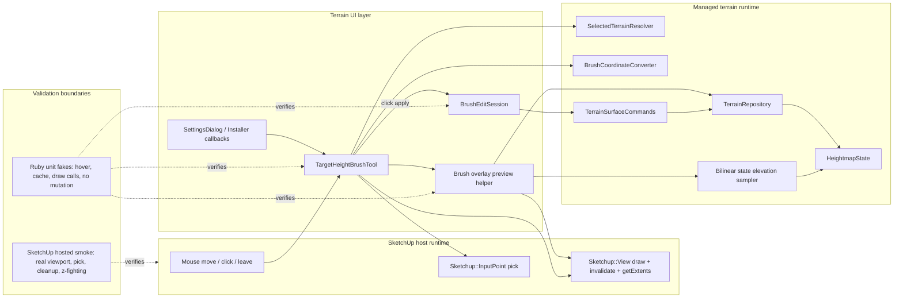

# Technical Plan: MTA-26 Add Managed Terrain Brush Overlay Feedback
**Task ID**: `MTA-26`
**Title**: `Add Managed Terrain Brush Overlay Feedback`
**Status**: `finalized`
**Date**: `2026-05-08`

## Source Task

- [Add Managed Terrain Brush Overlay Feedback](./task.md)

## Problem Summary

`MTA-18` added the first SketchUp-facing target-height brush flow, but the active
tool does not show an in-model footprint before click apply. Users need to see
the brush support radius, blend/falloff area, and invalid hover state without
turning preview into terrain source state or bypassing the managed terrain
command boundary.

## Goals

- Draw transient viewport feedback for the active Target Height Brush.
- Distinguish full-strength support radius from outer blend/falloff radius.
- Make valid and invalid hover states visible before click apply.
- Keep hover preview read-only and tied to the active SketchUp tool lifecycle.
- Preserve existing click-to-apply behavior and public MCP terrain contracts.
- Establish a narrow overlay foundation that later round-brush tools can reuse
  without implementing the `MTA-27` shared panel.

## Non-Goals

- Add new terrain edit modes or continuous stroke painting.
- Add corridor, survey, planar-fit, or local-fairing overlays.
- Add persistent preview geometry or mutate generated terrain mesh as source.
- Change public MCP tool names, schemas, dispatcher behavior, fixtures, or
  public response shapes.
- Implement hovered-entity targeting across nested terrain children.
- Replace sampling, validation, redrape, capture, or profile measurement
  workflows.

## Related Context

- `specifications/hlds/hld-managed-terrain-surface-authoring.md`
- `specifications/hlds/hld-platform-architecture-and-repo-structure.md`
- `specifications/guidelines/ryby-coding-guidelines.md`
- `specifications/guidelines/sketchup-extension-development-guidance.md`
- `specifications/tasks/managed-terrain-surface-authoring/MTA-18-define-bounded-managed-terrain-visual-edit-ui/summary.md`
- `specifications/tasks/managed-terrain-surface-authoring/MTA-12-add-circular-terrain-regions-and-preserve-zones/summary.md`
- `specifications/tasks/managed-terrain-surface-authoring/MTA-04-implement-bounded-grade-edit-mvp/summary.md`
- `specifications/tasks/managed-terrain-surface-authoring/MTA-27-generalize-managed-terrain-tool-panel-and-add-local-fairing/task.md`

## Research Summary

- `MTA-18` is the primary calibrated analog. It proved the toolbar/dialog/tool
  apply loop, but live SketchUp UI behavior caused repeated fix/redeploy/retest
  loops. MTA-26 must include hosted viewport smoke, not only Ruby fakes.
- `MTA-12` already implemented circular `target_height` regions and blend
  behavior. MTA-26 should not reopen terrain edit math or public schemas.
- `MTA-04` established owner-local public-meter terrain coordinates. Overlay
  geometry must use the same frame as apply requests, then transform to world
  points for drawing.
- SketchUp Ruby API research confirms `Tool#draw(view)` is the temporary
  graphics hook, `View#invalidate` schedules redraw, `InputPoint#pick` supports
  mouse-position feedback, and `Tool#getExtents` is required to avoid clipping
  when drawing outside current model bounds.
- UE Landscape source research supports the interaction model: keep hover state
  separate from mutation, distinguish support and falloff radius, represent
  invalid target state explicitly, and clean preview state on leave/deactivate.
- Existing profile/path-drape sampling already uses the right performance shape:
  prepare a sampling context once, then perform many cheap sample calls. MTA-26
  should reuse that pattern, but cache managed `HeightmapState` rather than
  prepared SketchUp face geometry because terrain state is authoritative.
- Varied-height terrain requires terrain-following overlay Z. A flat ring at the
  picked point Z is rejected because it can cut through or float over terrain.

## Technical Decisions

### Data Model

Preview state is transient and owned by the active tool/helper. It may contain:

- selected owner identity needed for cache comparison
- loaded read-only `HeightmapState` summary, state id, and revision
- current hover center in owner-local public-meter coordinates
- current settings snapshot: radius, blend distance, target height
- draw-ready support and falloff point arrays
- validity/status reason

Preview state must not persist into SketchUp model attributes and must not expose
raw SketchUp objects outside narrow UI/host-facing classes.

### API and Interface Design

- `TargetHeightBrushTool` owns SketchUp callbacks: activation, `onMouseMove`,
  `draw`, `getExtents`, `onMouseLeave`, deactivation, and click apply.
- A small target-height overlay preview helper may own cache lookup, ring point
  generation, terrain-following Z sampling, validity status, and extents.
- `BrushEditSession` remains the apply boundary and continues delegating durable
  edits to `TerrainSurfaceCommands#edit_terrain_surface`.
- `SelectedTerrainResolver` remains the first-slice target model. The overlay is
  valid only for the selected managed terrain, valid settings, successful cursor
  pick, and loadable terrain state.
- `BrushCoordinateConverter` or an adjacent helper keeps owner-local
  public-meter coordinates aligned between hover preview and apply request
  construction.
- Bilinear state elevation sampling should be SketchUp-free and follow existing
  terrain interpolation patterns. If a small reusable sampler is extracted, keep
  it in terrain state/region ownership rather than in transport or command
  layers.

### Public Contract Updates

Not applicable. This task must not change public MCP tool registration, request
schema, dispatcher behavior, native fixtures, response shape, docs examples, or
loader wiring. Public contract review is still required as a guardrail: the
implementation should confirm no changes are needed in
`src/su_mcp/runtime/native/native_tool_catalog.rb` or adjacent dispatcher tests.

### Error Handling

- Invalid settings, no selected managed terrain, failed cursor pick, missing
  terrain state, refused repository load, or owner transform mismatch produce an
  invalid hover state rather than an exception-driven user path.
- Invalid hover must always produce distinct status feedback. A disabled or
  invalid-style ring may be drawn only when cursor pick succeeds and settings
  are valid; no ring should be drawn for no-pick or invalid-settings states.
- Hover preview failures must not call terrain edit commands, start a SketchUp
  model operation, or mutate generated terrain geometry.
- Click apply refusals remain owned by the existing session/command path.

### State Management

- Repository state loading is a cache boundary, not a per-mouse-move operation.
- Cache selected-owner state by owner/state identity and revision where
  available. Refresh when owner changes, cached state is absent/refused, or an
  apply changes terrain revision.
- Mirror the existing profile/path-drape prepare-once/sample-many performance
  posture: prepare or load the expensive context once, then use bounded cheap
  sampling calls while moving the cursor.
- Per-hover work is bounded ring recomputation against an already-loaded
  heightmap. Do not scan SketchUp mesh faces per segment or per cursor move.
- Use one idempotent clear/invalidate hook for activate/reselection,
  deactivate, mouse leave, and managed terrain UI close so every lifecycle exit
  path removes stale overlay state.
- Settings changes must invalidate or refresh the active overlay before the next
  click apply.
- After click apply returns, mark preview state dirty and invalidate the active
  view before handing control back to the tool so the next hover cannot display
  stale terrain Z.

### Integration Points

- SketchUp host callbacks: `Tool#onMouseMove`, `Tool#draw`, `Tool#getExtents`,
  `Tool#onMouseLeave`, `View#invalidate`, and `InputPoint#pick`.
- Existing UI wiring: toolbar command, settings dialog callbacks, tool
  selection/reselection, and feedback/status behavior.
- Terrain read path: selected terrain resolver, repository load, terrain state,
  coordinate conversion, and bilinear interpolation.
- Terrain apply path: `BrushEditSession#apply_click` and
  `TerrainSurfaceCommands#edit_terrain_surface`.

### Configuration

No user-facing configuration is planned. Visual constants such as segment count,
line colors, line width, stipple, and small Z offset are implementation constants
chosen conservatively and adjusted only through hosted smoke if visibility or
z-fighting requires it.

## Architecture Context

## Key Relationships

- `TargetHeightBrushTool` is the SketchUp callback owner for hover, draw,
  extents, lifecycle cleanup, and click handoff.
- The overlay helper is read-only preview support. It does not own apply,
  terrain edit math, persistence, or public contracts.
- `BrushEditSession` remains the durable edit boundary and continues producing
  the existing circular `target_height` request shape.
- Terrain state is authoritative for overlay Z. Generated SketchUp mesh faces
  are not sampled for every hover update.
- Local tests prove Ruby state and command boundaries; hosted smoke proves real
  viewport and pick behavior.

## Acceptance Criteria

- With a valid selected managed terrain, active target-height brush, valid
  settings, and successful cursor pick, the viewport draws a transient circular
  support cue whose radius matches the current brush radius in public terrain
  units.
- With non-zero blend distance, the viewport distinguishes the full-strength
  support radius from the outer blend/falloff radius; with zero blend, it does
  not draw a misleading second ring.
- Ring vertices follow varied terrain height by sampling selected managed
  terrain state rather than drawing a flat picked-Z ring.
- Hover movement reuses cached terrain state and performs bounded point
  recomputation only.
- Settings changes refresh or invalidate the active overlay before the next
  click apply.
- Invalid hover states are visible and never invoke terrain edit commands or
  start a SketchUp model operation.
- Invalid hover always emits distinct status feedback; disabled ring drawing is
  limited to picked, settings-valid invalid states.
- Deactivate, mouse leave, and UI close remove stale overlay feedback.
- `getExtents` covers the current overlay points without persistent geometry.
- Click apply remains routed through `BrushEditSession` and
  `TerrainSurfaceCommands#edit_terrain_surface`.
- No public MCP contract surface changes.

## Test Strategy

### TDD Approach

Start with focused Ruby tests around the smallest seams before adding host code:

1. Add failing tests for the low-level terrain-state sampler before overlay
   code: bilinear elevation, explicit inside/outside bounds, and no-data
   interpolation refusal.
2. Add failing tests for reverse coordinate conversion before draw code:
   owner-local public-meter XYZ back to world/internal SketchUp points, including
   non-zero-origin or transformed owner parity with apply-time conversion.
3. Add failing tests for hover validity and no-mutation behavior:
   valid hover, invalid pick, invalid settings, no selected terrain, out-of-bounds
   hover, repository `absent`, and repository `refused` outcomes.
4. Add failing tests for cached state reuse and refresh after apply/owner change,
   including loaded-only caching so absent/refused state loads can recover.
5. Add failing tests for terrain-following support/falloff point generation:
   zero blend, positive blend, bounded segment count, and varied-height Z.
6. Add draw/extents/lifecycle tests with fake SketchUp views, including
   no persistent geometry, no model operation, no command invocation, deactivate,
   suspend, mouse leave, settings update, UI close, and no-view cleanup.
7. Preserve existing apply tests and run focused UI/runtime checks.
8. Finish with hosted SketchUp smoke for real viewport behavior and record the
   result in task-folder `hosted-smoke-notes.md`.

### Required Test Coverage

- Hover state:
  - valid mouse move updates hover center/status and invalidates view;
  - invalid pick, invalid settings, no selected terrain, or refused state load
    produces invalid hover without mutation;
  - deactivation and mouse leave clear overlay and invalidate view.
  - activate/reselection, deactivate, mouse leave, and UI close all call the same
    idempotent clear/invalidate path.
- Ring generation:
  - zero blend draws one support ring;
  - positive blend draws full-strength and outer blend/falloff rings;
  - varied heightmap produces different Z values across ring vertices;
  - segment count is bounded and independent of terrain sample count.
- Cache behavior:
  - cached state is reused across mouse moves for the same owner/revision;
  - cache refreshes after click apply or selected owner/revision change;
  - click apply marks preview cache dirty and invalidates before the next hover;
  - repository load refusal does not crash or apply an edit.
- Draw behavior:
  - fake view receives expected draw calls/styles;
  - `getExtents` includes drawable overlay points;
  - no persistent SketchUp geometry or model operation is created by hover/draw.
- Settings/dialog integration:
  - radius and blend updates invalidate or refresh active overlay;
  - existing toolbar checked state and dialog push behavior remain stable.
- Apply preservation:
  - click still delegates to `BrushEditSession#apply_click`;
  - request shape remains the existing circular `target_height` operation.
- Hosted smoke:
  - visible support and blend cues on managed terrain;
  - settings redraw before click;
  - invalid/no-selection hover feedback;
  - cleanup on deactivate/close/mouse leave;
  - non-zero-origin or transformed terrain case, with any skipped transformed
    hosted coverage recorded as a validation gap.

## Instrumentation and Operational Signals

- User-visible status should distinguish valid hover from invalid/no-target
  hover.
- Hosted smoke notes should record whether rings are visible, terrain-following,
  non-stale after settings changes, and cleaned up after lifecycle transitions.
- No runtime telemetry is required for this task.

## Implementation Phases

1. Add sampler, bounds, and preview-state tests and helper skeletons for
   selected-owner state cache, hover validity, invalid-state reporting,
   repository absent/refused outcomes, out-of-bounds hover, and no-mutation
   behavior.
2. Implement bounded ring geometry with owner-local public-meter coordinates,
   bilinear terrain-state Z sampling, reverse owner-local public-meter XYZ to
   world/internal draw-point conversion, radius parity with apply-time
   conversion, and extents.
3. Wire `TargetHeightBrushTool#onMouseMove`, `draw`, `getExtents`,
   `onMouseLeave`, deactivate, and view invalidation to the preview helper.
4. Connect settings dialog/installer updates so radius/blend changes refresh or
   invalidate the active overlay before apply.
5. Add idempotent lifecycle cleanup across activate/reselection, deactivate,
   mouse leave, and UI close; after apply, dirty the preview cache and invalidate
   the active view.
6. Preserve click apply routing, add no-public-contract guard checks for native
   catalog/dispatcher/docs posture, unchanged finite falloff options, and no
   overlay-specific `edit_terrain_surface` schema keys, then run focused Ruby
   tests.
7. Create or update `hosted-smoke-notes.md`, then run hosted SketchUp smoke for
   viewport visibility, z-fighting/clipping, cleanup, invalid hover, settings
   redraw, and transformed/non-zero-origin behavior or an explicit recorded
   validation gap.

## Rollout Approach

- Ship as an internal SketchUp UI behavior change behind the existing Target
  Height Brush command.
- No migration, persisted data update, packaging asset change, or public MCP
  contract rollout is expected.
- If hosted smoke shows ring visibility or z-fighting is unacceptable, adjust
  tactical draw constants before expanding scope.
- If hosted smoke shows selection-only targeting is misleading, record it as a
  follow-up/MTA-27 targeting issue rather than widening MTA-26 by default.
- If transformed-owner hosted validation cannot be run, local transform parity
  tests are required and the skipped hosted case must be called out in the
  implementation summary as a residual validation gap.

## Risks and Controls

- Host visibility: rings may be clipped, too faint, z-fighting, or drawn behind
  terrain. Control with `getExtents`, visual offset, simple styles, and hosted
  smoke.
- Hover performance: per-move repository loads or face sampling would stutter.
  Control with cached state, bounded ring segments, and cache reuse tests.
- Terrain-following Z: flat or stale-Z overlay misrepresents varied terrain.
  Control with per-ring-vertex state sampling and cache refresh after apply.
- Transform/unit drift: visual radius could diverge from apply semantics.
  Control with owner-local public-meter generation and transformed/non-zero
  coverage where practical.
- Lifecycle redraw: dialog updates or deactivation could leave stale rings.
  Control with explicit clear/invalidate hooks and hosted lifecycle smoke.
- Stale cache after apply: preview could briefly show old terrain Z. Control by
  dirtying the preview cache and invalidating immediately after apply returns.
- Public contract drift: UI work could accidentally change MCP behavior.
  Control with preserved apply tests and review of native catalog/dispatcher
  surfaces to confirm no changes.
- Scope creep: MTA-27 reuse could pull in shared panel work too early. Control by
  keeping MTA-26 target-height-first and extracting only small current-risk
  helpers.

## Dependencies

- Implemented `MTA-18` toolbar/dialog/tool/session baseline.
- Implemented `MTA-12` circular `target_height` support.
- Implemented `MTA-04` managed terrain state/repository/command boundary and
  owner-local public-meter semantics.
- SketchUp Ruby API callbacks and drawing primitives.
- Existing terrain repository, heightmap state, coordinate conversion, and
  interpolation patterns.
- SketchUp-hosted validation access.

## Premortem Gate

Status: PASS

### Unresolved Tigers

- None.

### Plan Changes Caused By Premortem

- Added the existing profile/path-drape prepare-once/sample-many pattern as the
  model for brush preview cache behavior, while keeping `HeightmapState` as the
  authoritative MTA-26 data source.
- Added a single idempotent clear/invalidate lifecycle guard for
  activate/reselection, deactivate, mouse leave, and UI close.
- Tightened invalid-hover behavior: distinct status is mandatory; disabled ring
  drawing is limited to picked, settings-valid invalid states.
- Added explicit post-apply cache dirtying and view invalidation so stale
  terrain-following Z cannot survive the next hover.
- Strengthened transformed/non-zero-origin validation from optional wording to a
  hosted gate or explicit recorded validation gap with local transform parity.

### Accepted Residual Risks

- Risk: Real SketchUp draw behavior may still require tactical visual tuning.
  - Class: Paper Tiger
  - Why accepted: The plan has bounded implementation constants and a required
    hosted visibility/z-fighting smoke gate.
  - Required validation: Hosted smoke must verify visible support/falloff rings
    and cleanup before closeout.
- Risk: Selection-only targeting may be less ergonomic than hovered-entity
  targeting.
  - Class: Elephant
  - Why accepted: MTA-26 intentionally preserves the MTA-18 selected-owner model
    to avoid broad nested-entity targeting scope.
  - Required validation: Hosted smoke must record whether selected-owner feedback
    is misleading; if so, carry the issue to MTA-27 or a follow-up rather than
    silently widening this task.

### Carried Validation Items

- Hosted smoke for real viewport visibility, z-fighting/clipping, settings
  redraw, lifecycle cleanup, invalid hover, and selected terrain targeting.
- Hosted non-zero-origin or transformed terrain coverage; if transformed hosted
  coverage is skipped, record it as a validation gap and cover transform parity
  locally.
- Local tests for terrain-following Z, cache reuse, post-apply cache dirtying,
  idempotent lifecycle cleanup, and no-hover mutation.
- Public contract drift review confirming no native catalog, dispatcher, schema,
  fixture, docs example, or response shape changes.

### Implementation Guardrails

- Do not reload terrain state or scan SketchUp faces on every mouse move.
- Do not draw a flat picked-Z ring for valid terrain hover.
- Do not create persistent preview geometry or start model operations during
  hover/draw.
- Do not route preview through terrain edit commands.
- Do not add public MCP contract changes for this overlay task.

## Quality Checks

- [x] All required inputs validated
- [x] Problem statement documented
- [x] Goals and non-goals documented
- [x] Research summary documented
- [x] Technical decisions included
- [x] Architecture context included
- [x] Acceptance criteria included
- [x] Test requirements specified
- [x] Instrumentation and operational signals defined when needed
- [x] Risks and dependencies documented
- [x] Rollout approach documented when needed
- [x] Small reversible phases defined
- [x] Premortem completed with falsifiable failure paths and mitigations
- [x] Planning-stage size estimate considered before premortem finalization
