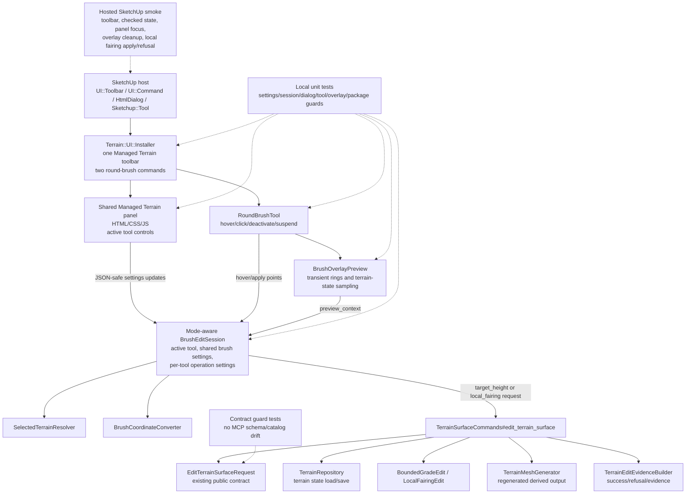

# Technical Plan: MTA-27 Generalize Managed Terrain Tool Panel And Add Local Fairing
**Task ID**: `MTA-27`
**Title**: `Generalize Managed Terrain Tool Panel And Add Local Fairing`
**Status**: `implemented`
**Date**: `2026-05-08`

## Source Task

- [Generalize Managed Terrain Tool Panel And Add Local Fairing](./task.md)

## Problem Summary

`MTA-18` and `MTA-26` proved one SketchUp-facing managed terrain round-brush
tool: `Target Height Brush`, with a target-height-specific dialog and transient
overlay feedback. `MTA-27` turns that first slice into a shared Managed Terrain
toolbar and panel foundation for two existing command-backed round-brush edit
modes: `target_height` and `local_fairing`.

The implementation must improve UI ergonomics with sliders plus adjacent numeric
inputs for bounded parameters, while preserving managed terrain command
ownership, state persistence, evidence, refusals, undo posture, and public MCP
contract stability.

## Goals

- Keep one `Managed Terrain` toolbar container with `Target Height Brush` and
  `Local Fairing` commands.
- Replace the target-height-specific dialog with one shared Managed Terrain
  panel that switches operation controls by active tool.
- Use external editor-inspired shared brush settings for `radius`,
  `blendDistance`, and `falloff`, with per-tool operation settings.
- Provide slider plus adjacent numeric input pairs for bounded brush and fairing
  controls where practical.
- Reject invalid panel values before request construction or apply.
- Route both tools through the existing `edit_terrain_surface` command path.
- Reuse the round-brush overlay family for both tools.

## Non-Goals

- Adding corridor, survey point, planar fit, point-list, validation-dashboard,
  continuous-stroke, pressure-sensitive, or broad sculpting behavior.
- Changing `local_fairing` terrain math, evidence shape, command dispatch, or
  public MCP schemas.
- Creating a broad managed-terrain tool registry for future tool families.
- Moving terrain state, persistence, or command behavior into JavaScript UI code.

## Related Context

- [Managed Terrain Surface Authoring HLD](specifications/hlds/hld-managed-terrain-surface-authoring.md)
- [Managed Terrain Surface Authoring PRD](specifications/prds/prd-managed-terrain-surface-authoring.md)
- [Domain Analysis](specifications/domain-analysis.md)
- [MTA-18 task](specifications/tasks/managed-terrain-surface-authoring/MTA-18-define-bounded-managed-terrain-visual-edit-ui/task.md)
- [MTA-26 task](specifications/tasks/managed-terrain-surface-authoring/MTA-26-add-managed-terrain-brush-overlay-feedback/task.md)
- [MTA-06 task](specifications/tasks/managed-terrain-surface-authoring/MTA-06-implement-local-terrain-fairing-kernel/task.md)
- [External editor UX research posture](specifications/research/managed-terrain/ue-reference-phase1.md)
- [SketchUp Extension Development Guidance](specifications/guidelines/sketchup-extension-development-guidance.md)

## Research Summary

- `MTA-18` shipped the current toolbar/dialog/tool/session baseline and showed
  that host lifecycle details such as `HtmlDialog` focus, toolbar checked state,
  selected-terrain refresh, and loaded Ruby class state require hosted smoke.
- `MTA-26` shipped transient brush overlay behavior and showed that overlay
  cache dirtying, transformed-owner coordinates, invalid settings, and live icon
  visibility need explicit tests.
- `MTA-06` shipped `local_fairing` on `edit_terrain_surface`. Current request
  validation supports `local_fairing` with `circle` regions, so MTA-27 does not
  need a public contract change.
- External terrain-editor UX research was used only for inspiration. The useful
  pattern is shared brush settings plus active tool-specific controls with
  bounded UI ranges and exact value editing. This plan does not import external
  editor architecture, continuous strokes, edit layers, or large landscape
  defaults.

## Technical Decisions

### Data Model

Use one Ruby-owned mode-aware brush state behind the shared panel:

- `activeTool`: `target_height` or `local_fairing`
- shared brush settings:
  - `radius`
  - `blendDistance`
  - `falloff`
- target-height operation settings:
  - `targetElevation`
- local-fairing operation settings:
  - `strength`
  - `neighborhoodRadiusSamples`
  - `iterations`
- shared feedback:
  - selected terrain label
  - status message
  - refusal details when present
  - active/applyable state

Shared brush settings persist globally across both tools. Per-tool operation
settings persist independently across tool switches, deactivate/suspend, and
resume.

### API and Interface Design

The internal UI surface should be a small round-brush foundation, not a broad
future-tool framework:

- Generalize the existing target-height `Sketchup::Tool` callback plumbing into
  a mode-aware round-brush tool or equivalent shared base.
- Keep one session-style apply boundary that builds existing
  `edit_terrain_surface` requests.
- Add a small mode definition or operation-settings wrapper for the two MTA-27
  round-brush tools.
- Keep the mode definition as a frozen two-entry structure for `target_height`
  and `local_fairing`. Do not add an open-ended registration API in this task.
- Keep `BrushOverlayPreview` read-only and driven by shared brush settings.
- Convert target-height-specific panel assets into a shared Managed Terrain
  panel with active-tool sections.

### Public Contract Updates

No public MCP contract updates are planned.

- No native tool catalog changes.
- No public request or response shape changes.
- No dispatcher or runtime schema changes.
- No native fixture changes for UI behavior.

Contract guard tests should prove UI-only names, panel keys, and overlay concepts
do not leak into the public MCP catalog or terrain request contract.

### Error Handling

- Invalid settings must create visible refusal/status state and block apply
  before any terrain command call.
- Ruby validation remains authoritative even if JavaScript validates first.
- A failed update must not silently preserve the previous valid value for apply.
  If a user enters invalid `radius` after valid `radius`, apply must refuse until
  a valid update clears the invalid state.
- If a user corrects invalid numeric input through the paired slider, Ruby state
  and panel state must both clear the invalid/apply-blocking state.
- Command-level refusals from `TerrainSurfaceCommands#edit_terrain_surface` must
  surface in the shared panel for both tools.

### State Management

- Activating a toolbar command sets `activeTool`, selects the round-brush tool,
  refreshes selected-terrain state, pushes panel state, and refreshes command
  validation.
- Dialog setting changes reselect the active round-brush tool to recover from
  host focus loss.
- Tool switch, dialog close, deactivate, suspend, mouse leave, and post-apply
  all clear or dirty transient overlay state as appropriate.
- Target elevation remains numeric-only in MTA-27. A universal elevation slider
  is deferred because this task does not define terrain-relative elevation
  bounds.

### Integration Points

- `src/su_mcp/main.rb` continues to call the managed terrain UI installer only.
- `src/su_mcp/terrain/ui/installer.rb` owns one toolbar with two commands.
- The shared panel communicates JSON-safe settings updates to Ruby.
- `TerrainSurfaceCommands#edit_terrain_surface` remains the durable mutation
  boundary.
- `EditTerrainSurfaceRequest` remains the public validation boundary.
- Package staging must include all panel and icon assets.

### Configuration

- Radius slider: default `2.0`, minimum `0.01`, ergonomic UI maximum `100.0`
  meters.
- Blend slider: default `0.0`, minimum `0.0`, ergonomic UI maximum `100.0`
  meters.
- Direct numeric radius and blend entry can exceed the slider UI maximum when
  finite and otherwise valid.
- Fairing strength: `> 0` and `<= 1`, default `0.35` or `0.5` selected during
  implementation from test ergonomics.
- Fairing neighborhood radius samples: integer `1..31`, candidate default `4`.
- Fairing iterations: integer `1..8`, default `1`.

## Architecture Context

## Key Relationships

- The panel and tool are presentation/controller surfaces only.
- Terrain mutation, persistence, output regeneration, and evidence stay in the
  managed terrain command path.
- The overlay previews terrain state read-only and does not mutate model
  geometry.
- UI tests prove local state/request behavior; hosted smoke proves SketchUp
  lifecycle behavior.

## Acceptance Criteria

- The SketchUp extension exposes one `Managed Terrain` toolbar containing both
  `Target Height Brush` and `Local Fairing` commands, with menu-reachable
  equivalents and no second terrain toolbar.
- Activating either command shows the same Managed Terrain panel, selects the
  correct round-brush SketchUp tool, refreshes toolbar checked state, and pushes
  current selected-terrain/status state.
- The shared panel renders selected-terrain and status feedback once while
  switching visible operation controls by active tool.
- Shared brush settings persist across both tools; operation settings persist
  independently across tool switches and suspend/resume.
- Bounded controls use slider plus adjacent numeric input pairs where practical.
  Radius and blend sliders use a `100m` ergonomic UI range, while direct numeric
  input can hold larger valid values without clamping request construction.
- Invalid panel values create visible apply-blocking refusal/status state before
  any terrain command call.
- Valid target-height apply still builds the existing circular `target_height`
  request shape.
- Valid local-fairing apply builds a circular `local_fairing` request using
  existing operation fields.
- Success and refusal outcomes for both tools are reflected in shared feedback
  without exposing raw SketchUp objects.
- Hover preview for both tools reuses transient round-brush overlay behavior,
  reflects current shared radius/blend settings, follows selected terrain state,
  and creates no persistent SketchUp geometry.
- Public MCP tool names, schemas, dispatcher behavior, native fixtures, and
  response shapes are unchanged.
- Package verification includes all shared panel assets and both toolbar icon
  assets.
- README SketchUp UI documentation describes the two-button toolbar, shared
  panel switching, and slider plus numeric input behavior.
- Hosted SketchUp smoke validates toolbar/container behavior, checked-state icon
  visibility, dialog focus/reselect behavior, panel switching, overlay cleanup,
  one valid local-fairing apply, and at least one UI-side invalid/refusal path.
- Hosted SketchUp smoke includes this focus sequence: activate Target Height,
  open the panel, type in a numeric field, activate Local Fairing, and verify
  toolbar checked state and visible operation controls match the new active tool
  before apply.

## Test Strategy

### TDD Approach

Start with local tests for state and request behavior before touching host UI
assets. Then generalize installer/tool wiring, panel assets, overlay reuse, and
finally package/docs/hosted smoke. Keep each phase reversible and avoid a broad
framework until tests prove the two round-brush tools need shared behavior.

### Required Test Coverage

- Settings tests:
  - defaults and JSON-safe snapshots for both tools;
  - shared brush validation;
  - target-height-only `targetElevation`;
  - local-fairing `strength`, `neighborhoodRadiusSamples`, and `iterations`;
  - invalid updates block apply and valid updates clear the block.
  - invalid numeric input corrected through the paired slider clears the
    apply-blocking state and synchronizes both controls.
- Session/request tests:
  - active tool switching;
  - independent operation settings persistence across switch and suspend/resume;
  - unchanged target-height request shape;
  - local-fairing circular request shape;
  - command success/refusal feedback for both modes.
- Installer/tool tests:
  - one toolbar with two commands;
  - menu entries for both;
  - checked validation state follows active tool;
  - overlay cleanup on switch/deactivate/suspend.
- Dialog/asset tests:
  - shared panel callback names and state push;
  - active-tool rendering;
  - slider plus numeric input pairs;
  - invalid JavaScript-side values are surfaced rather than silently applied.
- Overlay tests:
  - local-fairing preview uses shared brush settings;
  - radius above slider maximum is not clamped in preview/request construction;
  - after local-fairing apply changes terrain, the next hover samples fresh
    terrain state rather than stale pre-apply Z values;
  - local-fairing apply dirties overlay cache.
- Package/docs/guard tests:
  - staged assets include shared panel and both icon assets;
  - README updated;
  - native MCP catalog and request contract do not gain UI-only entries.
- Hosted smoke:
  - two-button toolbar under one container;
  - checked-state icon visibility;
  - dialog focus/reselect behavior, including activation, numeric field input,
    tool switch, checked-state verification, and panel state verification;
  - panel switching;
  - overlay cleanup;
  - valid local-fairing apply;
  - invalid/refusal path.

## Instrumentation and Operational Signals

- Panel status messages should expose current selected terrain, invalid input,
  command success, and command refusal states.
- Hosted smoke notes should record toolbar checked-state visibility and whether
  local-fairing apply changed terrain through the managed command path.

## Implementation Phases

1. Add mode-aware settings/session tests and request builders.
2. Generalize round-brush tool activation and installer command registration for
   two toolbar buttons.
3. Convert target-height assets into a shared panel with slider plus numeric
   input controls and apply-blocking invalid state.
4. Wire local-fairing apply and overlay reuse through the existing command path.
5. Add Local Fairing icon asset, package checks, README updates, and contract
   no-leak guards.
6. Run focused tests, regression/lint/package validation, and hosted SketchUp
   smoke.

## Rollout Approach

- No runtime feature flag or public MCP migration is needed.
- Preserve target-height behavior first; local-fairing UI can be added after
  unchanged target-height request tests pass.
- If hosted checked-state visibility fails, adjust SVG presentation only.
- If hosted focus/reselect behavior fails, fix installer/dialog callbacks before
  changing command or terrain behavior.

## Risks and Controls

- Shared state can become stale across tool switch, dialog update, and SketchUp
  focus changes: local state tests plus hosted focus/reselect smoke.
- Invalid input can apply stale previous values: failed updates create
  apply-blocking Ruby state; tests prove the next apply refuses.
- Slider max can become a false hard limit: numeric input remains authoritative
  above `100m`; tests prove no clamping in request/preview.
- A second tool can trigger overgeneralization: implement only a two-mode
  round-brush foundation, keep the mode definition frozen to the two MTA-27
  modes, and defer corridor/control-point families.
- Callback duplication can drift behavior: share round-brush lifecycle plumbing
  and vary only mode/status/request construction.
- UI names can leak into MCP contracts: no catalog/schema changes and guard
  tests prove no UI-only entries.
- Icon checked-state can render poorly in SketchUp: use transparent padded SVG
  style and hosted visual smoke.
- Overlay cache can be stale after local fairing: reuse post-apply dirtying and
  test local-fairing dirty path.

## Dependencies

- Implemented MTA-18 toolbar/dialog/tool/session baseline.
- Implemented MTA-26 overlay preview baseline.
- Implemented MTA-06 local-fairing command behavior.
- Current `EditTerrainSurfaceRequest` circle support for `local_fairing`.
- SketchUp hosted smoke access.
- Existing package staging support for `src/su_mcp/terrain/ui/assets`.

## Premortem Gate

Status: PASS

### Unresolved Tigers

- None.

### Plan Changes Caused By Premortem

- Added a concrete hosted focus/reselect sequence covering toolbar activation,
  numeric field focus, tool switching, checked state, and panel operation state.
- Strengthened invalid-input handling to require slider correction after numeric
  failure to clear apply-blocking state in both Ruby and panel state.
- Added an overlay freshness check after local-fairing apply.
- Added a frozen two-entry mode-definition guard to prevent accidental broad
  tool-registry scope.

### Accepted Residual Risks

- Risk: host toolbar/icon checked-state rendering can still need live visual
  tuning.
  - Class: Paper Tiger
  - Why accepted: prior MTA-18/MTA-26 tasks handled this with transparent SVGs
    and hosted smoke; it does not require architectural change.
  - Required validation: hosted checked-state visibility smoke for both buttons.
- Risk: direct numeric values above the slider UI range may be visually awkward.
  - Class: Paper Tiger
  - Why accepted: numeric value is intentionally authoritative and preserves
    larger-brush workflows.
  - Required validation: local no-clamp request/preview tests and hosted panel
    sanity check where practical.

### Carried Validation Items

- Hosted smoke for the exact focus/reselect sequence.
- Hosted smoke for one valid local-fairing apply and one invalid/refusal path.
- Local tests for invalid-update blocking and slider-based correction.
- Local overlay freshness test after local-fairing apply.
- Contract guard proving no UI-only schema/catalog drift.

### Implementation Guardrails

- Do not add public MCP tool/schema/dispatcher changes.
- Do not add corridor, survey, planar, validation-dashboard, point-list, or
  continuous-stroke behavior.
- Do not allow invalid UI updates to apply stale previous values.
- Do not clamp direct numeric radius/blend values to the `100m` slider max when
  the value is otherwise valid.
- Do not turn the two-mode round-brush definition into an open-ended future-tool
  registry.

## Quality Checks

- [x] All required inputs validated
- [x] Problem statement documented
- [x] Goals and non-goals documented
- [x] Research summary documented
- [x] Technical decisions included
- [x] Architecture context included
- [x] Acceptance criteria included
- [x] Test requirements specified
- [x] Instrumentation and operational signals defined when needed
- [x] Risks and dependencies documented
- [x] Rollout approach documented when needed
- [x] Small reversible phases defined
- [x] Premortem completed with falsifiable failure paths and mitigations
- [x] Planning-stage size estimate considered before premortem finalization
