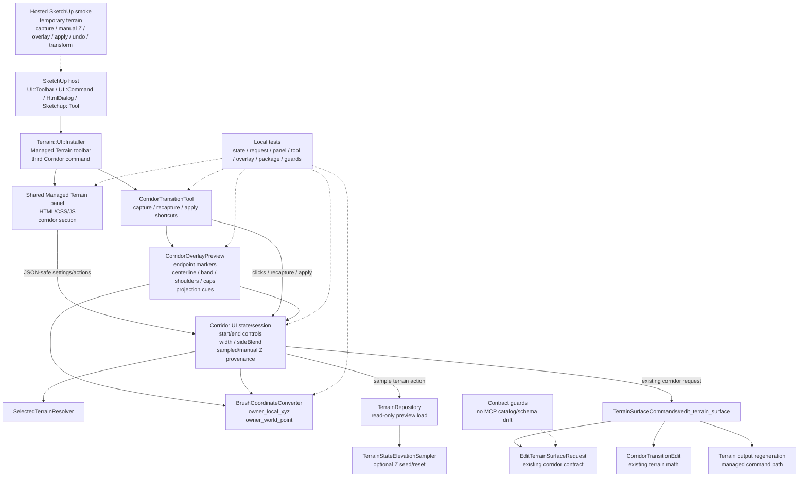

# Technical Plan: MTA-28 Add Managed Terrain Corridor Transition UI Tool
**Task ID**: `MTA-28`
**Title**: `Add Managed Terrain Corridor Transition UI Tool`
**Status**: `finalized`
**Date**: `2026-05-08`

## Source Task

- [Add Managed Terrain Corridor Transition UI Tool](./task.md)

## Problem Summary

The existing managed terrain UI supports round-brush workflows. Corridor
transitions have a different interaction shape: users need two explicit 3D
controls, width, side-blend settings, preview geometry, and an explicit Apply
step. MTA-28 adds that SketchUp-facing corridor tool over the existing
`corridor_transition` command path without changing public MCP contracts or
pulling future survey/planar point-list workflows into this slice.

## Goals

- Add a third command to the existing Managed Terrain toolbar and menu for
  Corridor Transition.
- Capture and edit start/end corridor controls as owner-local public-meter
  `x`, `y`, and `elevation` values.
- Let endpoint elevations be above, below, or equal to sampled terrain height.
- Provide slider plus numeric elevation editing for each endpoint.
- Provide numeric X/Y editing plus panel Recapture Start/End actions.
- Preserve manual endpoint Z during recapture unless the user explicitly uses
  Sample Terrain.
- Draw a required transient corridor overlay with endpoint markers, centerline,
  width band, side-blend shoulders, cap cues, and elevation/projection cues.
- Apply through the existing `TerrainSurfaceCommands#edit_terrain_surface`
  corridor path.
- Keep survey point, planar region fit, point-list, continuous stroke, hardscape
  mutation, and validation-dashboard workflows out of scope.

## Non-Goals

- New corridor terrain math.
- Public MCP schema, native catalog, dispatcher, or fixture changes.
- Persistent preview entities as source of truth.
- Full 3D transform gizmos for first-slice Z editing.
- X/Y sliders.
- Survey or planar point-list abstractions.
- A broad future-tool registry unless a small helper extraction is directly
  justified by MTA-28.

## Related Context

- [MTA-28 task](./task.md)
- [Managed Terrain Surface Authoring HLD](specifications/hlds/hld-managed-terrain-surface-authoring.md)
- [MTA-27 summary](specifications/tasks/managed-terrain-surface-authoring/MTA-27-generalize-managed-terrain-tool-panel-and-add-local-fairing/summary.md)
- [MTA-26 summary](specifications/tasks/managed-terrain-surface-authoring/MTA-26-add-managed-terrain-brush-overlay-feedback/summary.md)
- [MTA-18 size calibration](specifications/tasks/managed-terrain-surface-authoring/MTA-18-define-bounded-managed-terrain-visual-edit-ui/size.md)
- [MTA-05 size calibration](specifications/tasks/managed-terrain-surface-authoring/MTA-05-implement-corridor-transition-terrain-kernel/size.md)
- [SketchUp Extension Development Guidance](specifications/guidelines/sketchup-extension-development-guidance.md)
- [Ruby Coding Guidelines](specifications/guidelines/ryby-coding-guidelines.md)

## Research Summary

- MTA-27 proves the shared Managed Terrain toolbar and panel foundation, command
  checked-state behavior, dialog state push, invalid apply blocking, package
  asset coverage, and hosted smoke pattern.
- MTA-26 proves transient viewport overlay patterns, read-only terrain-state
  sampling, selected-owner preview context, cache invalidation, transformed
  owner smoke, and visual tuning needs.
- MTA-18 shows first-class SketchUp UI work has host-only risk around
  `UI::Command`, toolbar checked state, icon cache behavior, `HtmlDialog` focus,
  and selection refresh timing.
- MTA-05 provides the existing `corridor_transition` request shape and command
  semantics. The UI should construct that shape, not redefine corridor math.
- Local Unreal Engine Ramp tool source was inspected as behavioral prior art.
  The useful lesson is conceptual: ramp interaction is two explicit 3D points,
  Apply/Reset are separate from capture, terrain height can snap/seed Z, and
  preview draws point markers plus inner/outer ramp boundaries. No UE code or
  architecture should be copied.
- Consensus review resolved the main option set:
  panel Recapture Start/End is required, marker-select recapture is optional and
  smoke-gated, endpoint Z provenance is required, sliders use a dynamic local
  range with exact numeric input, UI preflight mirrors command validation, and
  the overlay is required scope.

## Technical Decisions

### Data Model

Introduce corridor-specific Ruby-owned UI state instead of expanding
round-brush state into a mixed brush/corridor object.

Required state fields:

- `active_tool`: corridor as a distinct managed terrain tool value.
- `start_control` and `end_control`, each with:
  - `point.x`
  - `point.y`
  - `elevation`
  - `elevation_provenance`: `sampled` or `manual`
- `selected_endpoint`: optional `start` or `end` for panel focus and slider
  range behavior.
- `recapture_target`: optional `start` or `end`, set by panel Recapture actions.
- `width`: positive public-meter value.
- `sideBlend.distance`: non-negative public-meter value.
- `sideBlend.falloff`: existing contract value, initially `cosine` or `none`.
- preview/status fields for selected terrain, apply readiness, and structured
  refusal feedback.

State snapshots sent to JavaScript must remain JSON-safe hashes, arrays,
strings, numbers, and booleans. SketchUp objects must not cross the panel
boundary.

### API and Interface Design

Public user interface:

- A Corridor Transition button appears in the existing Managed Terrain toolbar
  and corresponding menu family.
- Activating it opens or refreshes the shared Managed Terrain panel and selects a
  corridor-specific `Sketchup::Tool`.
- The panel adds a corridor section with:
  - Start endpoint subsection.
  - End endpoint subsection.
  - Numeric X/Y inputs per endpoint.
  - Elevation slider plus numeric input per endpoint.
  - Per-endpoint Sample Terrain action.
  - Recapture Start and Recapture End actions.
  - Width control.
  - Side-blend distance and falloff controls.
  - Reset and Apply actions.
- X/Y values are edited numerically or by viewport capture/recapture. They do
  not get sliders.
- Elevation numeric input is authoritative and accepts finite values outside the
  ergonomic slider range. Sliders provide fast local adjustment only.
- A valid Apply builds the existing corridor request:

```ruby
{
  operation: {
    mode: "corridor_transition",
    region: {
      type: "corridor",
      startControl: { point: { x: ..., y: ... }, elevation: ... },
      endControl: { point: { x: ..., y: ... }, elevation: ... },
      width: ...,
      sideBlend: { distance: ..., falloff: ... }
    }
  }
}
```

Internal interface boundaries:

- `Installer` remains toolbar/menu/dialog activation owner.
- New corridor state/session/request-construction support owns endpoint state,
  preflight, provenance, reset, sample, and command invocation.
- New corridor `Sketchup::Tool` owns click capture, optional marker hit testing,
  recapture mode, draw lifecycle, and keyboard shortcuts if added.
- New corridor overlay owns preview geometry and drawing roles.
- `BrushCoordinateConverter` gains or is paired with a full owner-local XYZ
  conversion helper.
- Existing round-brush classes stay behaviorally stable.

### Public Contract Updates

No public MCP contract change is planned.

Required contract posture:

- No new native MCP tool name.
- No new native schema keys for UI capture, overlays, endpoint provenance, or
  marker selection.
- No dispatcher or runtime routing changes for the UI.
- Request-construction tests must prove the UI sends the existing
  `corridor_transition` shape.
- Contract guard tests must prove corridor UI names and overlay concepts do not
  leak into public MCP catalog/schema fixtures.
- README updates should describe SketchUp UI behavior only if documentation is
  changed.

### Error Handling

The UI should preflight and block Apply before command invocation when:

- No managed terrain surface is selected.
- Start or end control is missing.
- Any required numeric value is non-finite.
- Width is non-positive.
- Side-blend distance is negative.
- Side-blend falloff is unsupported.
- Positive side-blend distance uses `none` if the existing validator refuses it.
- Start and end X/Y are coincident.

The existing command validator remains authoritative. If command invocation
returns refusal, the panel and status feedback should surface the structured
refusal without mutating local assumptions.

### State Management

State ownership is Ruby-first:

- JavaScript mirrors the latest Ruby snapshot and sends JSON-safe actions.
- Ruby updates state for panel edits, capture, recapture, reset, sample terrain,
  and apply.
- Capture behavior:
  - First valid point fills start if absent.
  - Second valid point fills end if start exists and end is absent.
  - When `recapture_target` is set, the next valid point updates that endpoint.
- Recapture behavior:
  - Panel Recapture Start/End is required baseline.
  - Optional marker-select recapture may be implemented only if local and hosted
    smoke prove it reliable.
  - Recapturing an endpoint with manual elevation updates X/Y but preserves Z.
  - Recapturing an endpoint with sampled elevation may reseed Z from terrain or
    clicked inference point according to implemented sampler behavior.
- Sample Terrain behavior:
  - Uses endpoint X/Y and selected terrain state to set endpoint elevation.
  - Sets provenance to `sampled`.
  - Refuses visibly if sampling is unavailable.
- Numeric/slider elevation edit behavior:
  - Sets provenance to `manual`.
  - Keeps exact numeric input authoritative.
  - Recenters slider range only on endpoint selection or committed numeric
    update, not on every keystroke.

### Integration Points

Primary code surfaces:

- `src/su_mcp/terrain/ui/installer.rb`
- `src/su_mcp/terrain/ui/settings_dialog.rb`
- `src/su_mcp/terrain/ui/assets/managed_terrain_panel.html`
- `src/su_mcp/terrain/ui/assets/target_height_brush.js`
- `src/su_mcp/terrain/ui/assets/target_height_brush.css`
- `src/su_mcp/terrain/ui/brush_coordinate_converter.rb`
- New corridor UI Ruby classes under `src/su_mcp/terrain/ui/`
- New corridor icon asset under `src/su_mcp/terrain/ui/assets/`
- Existing `TerrainSurfaceCommands#edit_terrain_surface`
- Existing `EditTerrainSurfaceRequest`
- Existing `CorridorTransitionEdit`
- Existing `SelectedTerrainResolver`, `TerrainRepository`, and
  `TerrainStateElevationSampler`

Integration constraints:

- Do not start a local SketchUp model operation in the UI session; durable apply
  goes through the command path that already owns mutation.
- Do not expose raw SketchUp objects to panel state.
- The overlay is transient and must not create persistent geometry.
- Dialog focus should reselect the corridor tool the same way round-brush tools
  are reselected today.

### Configuration

No user-level configuration is planned.

Implementation should choose finite defaults covered by tests:

- Positive width.
- Non-negative side-blend distance.
- Existing supported falloff, preferably `cosine` when side-blend distance is
  positive.
- Ergonomic elevation slider range around the selected/current endpoint while
  allowing exact numeric values outside that range.

## Architecture Context



## Key Relationships

- `Installer` remains the single owner of Managed Terrain toolbar/menu command
  registration and active SketchUp tool selection.
- The shared panel remains the presentation surface, while Ruby remains
  authoritative for corridor validation and request construction.
- Corridor state/tool/overlay are distinct from round-brush
  `BrushSettings`, `BrushEditSession`, `TargetHeightBrushTool`, and
  `BrushOverlayPreview`.
- Read-only terrain-state access is allowed for preview context and elevation
  seed/reset, but not mutation.
- Durable apply routes only through `TerrainSurfaceCommands#edit_terrain_surface`
  and the existing corridor validator/editor.
- Hosted smoke is required for SketchUp host behavior that local fake tests
  cannot prove.

## Acceptance Criteria

- The Managed Terrain toolbar exposes a Corridor Transition command in the same
  toolbar and menu family as Target Height Brush and Local Fairing.
- Activating Corridor Transition opens or refreshes the shared panel and selects
  a corridor-specific SketchUp tool without regressing round-brush behavior.
- The panel shows start/end endpoint sections, numeric X/Y inputs, elevation
  slider plus numeric pairs, width, side-blend distance/falloff, selected-terrain
  feedback, status, Reset, Apply, Recapture Start, Recapture End, and
  per-endpoint Sample Terrain actions.
- Start/end controls can be captured from SketchUp points and represented as
  owner-local public-meter X/Y/elevation values.
- Endpoint elevations can be manually set above, below, or equal to current
  terrain height.
- Endpoint provenance is deterministic: sampled on capture/sample, manual after
  user elevation edits, manual Z preserved on recapture, Sample Terrain resets
  Z/provenance.
- Manual Z acceptance is proven by a case where SketchUp inference does not
  supply the intended endpoint elevations: the user enters endpoint elevations
  in the panel, the preview markers move to those actual Z values, and Apply
  sends the panel values.
- Apply is blocked before command invocation for missing controls, non-finite
  numbers, non-positive width, invalid side-blend settings, and coincident X/Y.
- Apply is also blocked or visibly warned before command invocation when
  converted endpoint geometry is effectively collapsed for UI preview purposes,
  such as exact or tolerance-level near-coincident projected X/Y after owner
  transform conversion.
- Valid Apply constructs the existing `corridor_transition` request with
  `region.type: "corridor"`, start/end controls, width, sideBlend, and selected
  terrain target reference.
- Durable apply routes through the managed terrain command path and reports
  success or structured refusal to the panel/status feedback.
- The viewport preview shows endpoint markers at actual Z, centerline,
  full-width band, side-blend shoulders, endpoint/cap cues, and elevation or
  projection cues where endpoint Z differs from terrain.
- Preview and apply use correct owner-local/public-meter conversion for
  transformed or non-zero-origin terrain owners.
- Preview and apply parity is proven with at least one transformed or
  non-zero-origin terrain owner where endpoint Z differs from sampled terrain by
  more than 2 meters.
- The overlay remains transient and creates no persistent model entities.
- Panel Recapture Start/End is implemented and is the supported first-slice
  recapture path. Marker-select recapture is optional only if it has explicit
  local hit-test coverage, hosted proof, and a clean disabled/deferred fallback.
- Survey, planar, point-list, validation-dashboard, continuous-stroke, and
  hardscape mutation workflows remain absent.
- UI assets and any icon additions are included in package staging.
- Public MCP catalog/schema/dispatcher behavior remains unchanged with guard
  tests.
- Hosted SketchUp smoke verifies toolbar/panel activation, capture/recapture,
  manual Z above/below terrain, preview readability, valid apply, refusal before
  apply, undo posture, and transformed or non-zero-origin behavior where
  practical.

## Test Strategy

### TDD Approach

Implement in small failing-test slices before wiring broad UI behavior:

1. Corridor state and request-construction tests.
2. Full owner-local XYZ conversion and elevation provenance tests.
3. Panel asset/state/action tests.
4. Tool capture/recapture/apply lifecycle tests.
5. Overlay geometry/draw-command tests.
6. Installer/package/contract guard tests.
7. Hosted SketchUp smoke on a temporary terrain fixture.

### Required Test Coverage

- Corridor state supports start/end controls, width, sideBlend, reset, apply
  readiness, JSON-safe snapshots, invalid values, missing controls, coincident
  controls, and selected endpoint state.
- Request construction sends exact existing `corridor_transition` shape and
  maps command refusal/success to user-visible feedback.
- Coordinate conversion covers owner-local XYZ and arbitrary endpoint Z,
  including transformed or non-zero-origin owner cases where local fakes can
  model them.
- Elevation behavior proves sample-on-capture, manual values above/below terrain,
  preservation of manual Z on recapture, and Sample Terrain reset.
- Panel asset tests prove corridor controls exist, survey/planar controls remain
  absent, required controls fit through scrollable/taller dialog behavior, and
  slider/numeric synchronization preserves exact numeric values.
- Tool tests cover first click, second click, panel recapture mode, invalid
  picks, status text, apply gating, reset, deactivate/suspend cleanup, and
  optional marker hit testing if implemented.
- Overlay tests cover endpoint markers, centerline, width band, side-blend
  shoulders, caps, projection/elevation cues, extents, invalidation, transformed
  draw conversion, endpoint Z offsets greater than 2 meters from sampled
  terrain, and cache dirtying.
- Installer tests cover the third toolbar/menu command, icon path, checked
  state, correct tool selection, idempotent install, and existing round-brush
  behavior.
- Package staging tests cover any new corridor icon or asset.
- Contract guard tests prove no MCP catalog/schema/dispatcher drift.
- Contract guard tests prove UI-only metadata such as endpoint provenance,
  recapture mode, overlay cues, and marker state does not leak into public MCP
  requests, persisted terrain state, native fixtures, or documented public
  schemas.
- Hosted smoke covers the real `Sketchup::Tool`, `InputPoint#pick`,
  `HtmlDialog`, toolbar checked state, overlay readability, apply, refusal,
  undo posture, and transformed or non-zero-origin fixture behavior.
- Hosted smoke must include a panel-authored manual-Z case where inference did
  not supply the intended Z values, then verify the preview and Apply payload
  match the panel values.
- Hosted smoke must include at least one lifecycle-divergence probe: focus the
  dialog, edit endpoint values, return to the active tool, and confirm panel
  state, overlay state, and apply state still agree.

## Instrumentation and Operational Signals

- Panel/status text distinguishes: waiting for start, waiting for end,
  recapturing start, recapturing end, ready to apply, refused, and applied.
- Refusal feedback should preserve existing structured command error codes where
  available.
- Hosted smoke notes should record:
  - toolbar command visibility;
  - panel activation;
  - selected terrain detection;
  - endpoint coordinate/elevation values before apply;
  - manual Z above/below sampled terrain;
  - whether endpoint Z came from inference, numeric input, or Sample Terrain;
  - overlay role visibility;
  - apply route through managed command behavior;
  - undo posture;
  - transformed or non-zero-origin coordinate result.

## Implementation Phases

1. Add failing tests and corridor state skeleton.
   - Cover endpoint model, provenance, width/sideBlend, apply preflight,
     JSON-safe snapshots, and request construction.
   - Keep this phase independent of live SketchUp drawing.
2. Add owner-local XYZ and elevation seed/reset support.
   - Extend or pair `BrushCoordinateConverter`.
   - Add read-only terrain sampling behavior for capture/sample actions.
   - Prove manual Z is preserved on recapture.
3. Add panel and installer integration.
   - Add the Corridor command, icon, shared panel corridor section, JS actions,
     dialog sizing/scrollability, and state push/pull tests.
   - Keep existing target-height/local-fairing behavior passing.
4. Add corridor SketchUp tool capture and apply lifecycle.
   - Implement two-point capture, panel Recapture Start/End, reset, apply,
     invalid pick/status behavior, and command handoff.
   - Add optional Enter Apply only if cheap after baseline works.
5. Add required corridor overlay.
   - Draw endpoint markers at actual Z, centerline, width band, side-blend
     shoulders, cap cues, and elevation/projection cues.
   - Add extents/invalidation/cache tests.
   - Add marker-select recapture only if it stays simple and smokeable.
6. Finish package/docs/guards and hosted smoke.
   - Update package staging assertions, README UI notes if needed, and contract
     guards.
   - Run local Ruby tests and hosted SketchUp smoke on a temporary fixture.
   - Tune only overlay colors/line widths/stipples/glyphs after live smoke.

## Rollout Approach

- This is a SketchUp UI-only addition over existing corridor command semantics.
- No data migration, public MCP compatibility path, or server rollout is needed.
- The fallback for unreliable marker-select recapture is panel Recapture
  Start/End, which is required scope.
- If hosted smoke proves visual tuning is needed, adjust overlay styling without
  weakening required overlay roles.

## Risks and Controls

- Risk: corridor logic leaks into round-brush classes and creates unstable
  mixed abstractions. Control: create corridor-specific state/tool/overlay and
  extract only small helpers with direct tests.
- Risk: endpoint state goes stale across panel edits, recapture, selection
  changes, dialog focus, suspend/deactivate, or reset. Control: Ruby-owned state,
  explicit provenance, lifecycle tests, and panel state-push tests.
- Risk: UI preflight diverges from command validation. Control: mirror existing
  corridor contract cases in tests and keep command validation authoritative.
- Risk: transformed or non-zero-origin coordinate conversion is wrong. Control:
  owner-local XYZ tests plus hosted smoke on transformed or non-zero-origin
  terrain where practical.
- Risk: UI accidentally constrains endpoint Z to terrain height. Control:
  arbitrary-Z tests, provenance tests, no auto-resample on X/Y edit, and hosted
  smoke with endpoint Z intentionally offset from terrain.
- Risk: overlay is unreadable, stale, or geometrically misleading. Control:
  required overlay-role tests, extents/invalidation tests, and hosted visual
  tuning before closeout.
- Risk: marker-select recapture is unreliable in live SketchUp. Control:
  panel Recapture Start/End is required baseline; marker-select recapture is
  optional and smoke-gated with an explicit disabled/deferred fallback.
- Risk: numeric manual-Z works in state but does not become trustworthy to the
  user because inference, preview, and apply disagree. Control: require a
  hosted manual-Z case where intended endpoint Z is entered in the panel, differs
  from sampled terrain by more than 2 meters, and matches both preview and Apply.
- Risk: Ruby panel state and live overlay state diverge after dialog focus,
  selection changes, undo posture, suspend/resume, or tool reactivation.
  Control: lifecycle tests plus at least one hosted focus/reselect divergence
  probe before closeout.
- Risk: the current panel footprint cannot fit corridor controls. Control:
  endpoint subsections, scrollable or taller dialog, panel asset tests, and
  hosted visual check.
- Risk: public contract drift. Control: no planned MCP deltas and explicit
  catalog/schema/dispatcher guard tests.

## Dependencies

- Implemented MTA-27 shared Managed Terrain toolbar/panel baseline.
- Implemented MTA-26 overlay and preview-context patterns.
- Implemented MTA-05 corridor command behavior and request contract.
- Existing `TerrainSurfaceCommands#edit_terrain_surface`.
- Existing `SelectedTerrainResolver`, `TerrainRepository`, and
  `TerrainStateElevationSampler`.
- SketchUp hosted runtime access for real interaction and overlay validation.
- Package staging support for managed terrain UI assets.

## Premortem Gate

Status: PASS

### Unresolved Tigers

- None.

### Plan Changes Caused By Premortem

- Added an explicit manual-Z acceptance and hosted smoke case where SketchUp
  inference does not supply the intended endpoint elevations, so panel values
  must drive preview and Apply.
- Added transformed/non-zero-origin preview/apply parity with endpoint Z offset
  greater than 2 meters from sampled terrain.
- Added tolerance-level collapsed-geometry preflight/warning coverage so
  effectively coincident endpoints do not produce a misleading corridor preview.
- Tightened marker-select recapture: panel Recapture Start/End is the supported
  baseline, and marker selection may ship only with explicit local and hosted
  proof plus disabled/deferred fallback.
- Added lifecycle-divergence validation for dialog focus/reselect so panel
  state, overlay state, and Apply state are proven to agree after host events.
- Strengthened contract guards to ensure UI-only metadata never leaks into MCP
  requests, public schemas, persisted terrain state, or native fixtures.

### Accepted Residual Risks

- Risk: SketchUp inference may still be ambiguous on complex real models.
  - Class: Paper Tiger
  - Why accepted: the first slice deliberately supports numeric X/Y/Z and panel
    Recapture Start/End rather than scene gizmos or persistent draft entities.
  - Required validation: hosted smoke must prove numeric manual-Z, recapture,
    preview, and Apply parity on a temporary transformed or non-zero-origin
    terrain fixture.
- Risk: overlay cues may need visual tuning over real materials.
  - Class: Paper Tiger
  - Why accepted: required overlay roles are specified and colors/stipples/glyphs
    are tactical hosted-tuning details.
  - Required validation: hosted smoke must record endpoint marker, centerline,
    width band, shoulder, cap, and projection/elevation cue readability.
- Risk: future survey/planar tools may want richer capture primitives than this
  corridor slice.
  - Class: Elephant
  - Why accepted: MTA-28 is intentionally not the shared point-list or 3D gizmo
    foundation; overbuilding that now would blur task boundaries.
  - Required validation: do not extract a broad registry or shared point-list
    abstraction unless a later task proves the reuse need.

### Carried Validation Items

- Hosted manual-Z case where endpoint elevations differ from sampled terrain by
  more than 2 meters and the preview/apply payload match the panel.
- Hosted transformed or non-zero-origin owner case for owner-local XYZ parity.
- Hosted focus/reselect lifecycle probe after dialog editing.
- Overlay readability record for all required cue roles.
- Contract guard for no UI-only metadata in MCP schemas, requests, persisted
  terrain state, or native fixtures.

### Implementation Guardrails

- Do not make terrain height the only source of endpoint Z.
- Do not add public MCP contract keys, native catalog entries, dispatcher
  routes, or fixtures for UI-only corridor capture state.
- Do not use persistent model geometry as the corridor preview source of truth.
- Do not ship marker-select recapture unless panel recapture remains available
  and marker selection passes local and hosted proof.
- Do not fold corridor endpoint state into round-brush settings.

## Quality Checks

- [x] All required inputs validated
- [x] Problem statement documented
- [x] Goals and non-goals documented
- [x] Research summary documented
- [x] Technical decisions included
- [x] Architecture context included
- [x] Acceptance criteria included
- [x] Test requirements specified
- [x] Instrumentation and operational signals defined when needed
- [x] Risks and dependencies documented
- [x] Rollout approach documented when needed
- [x] Small reversible phases defined
- [x] Premortem completed with falsifiable failure paths and mitigations
- [x] Planning-stage size estimate considered before premortem finalization
