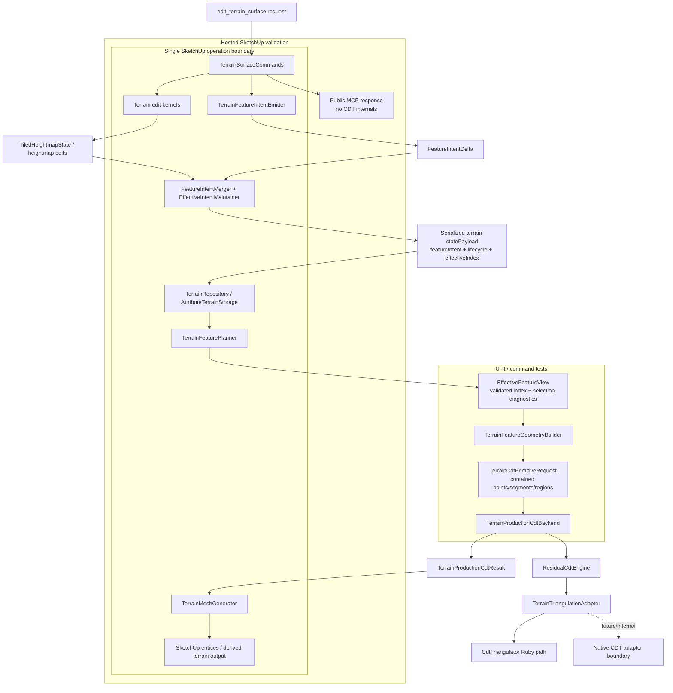

# Technical Plan: MTA-31 Enable CDT Terrain Output After Disabled Scaffold

**Task ID**: `MTA-31`
**Title**: `Enable CDT Terrain Output After Disabled Scaffold`
**Status**: `finalized`
**Date**: `2026-05-08`

## Source Task

- [Enable CDT Terrain Output After Disabled Scaffold](./task.md)

## Problem Summary

MTA-25 added a production-owned CDT scaffold but left CDT disabled by default after live SketchUp validation found minute-scale hangs on representative terrain histories with hundreds of accumulated feature intents. MTA-31 must make CDT safe to evaluate for future default production output without changing public MCP contracts or switching the default backend.

The work is not a CDT toggle. It must first make feature intent scalable, branch-correct under SketchUp undo, bounded by relevance and domain containment, measurable by phase and cardinality, and cleanly owned in production modules.

## Goals

- Preserve current backend behavior by default while keeping CDT internally/test enabled.
- Clean CDT module ownership before semantic behavior changes.
- Add an undoable materialized effective feature-intent layer with a minimal derived query index.
- Ensure normal CDT generation consumes active/relevant effective intent without replaying full edit history.
- Bound CDT primitive inputs by feature relevance and terrain domain containment.
- Add phase timing and input cardinality evidence for representative large-history edits.
- Decide Ruby-vs-native posture from evidence without requiring native binaries in this task.
- Validate rollback, undo, fallback, containment, no-leak behavior, and performance in hosted SketchUp.

## Non-Goals

- Enabling CDT by default.
- Replacing terrain edit kernels.
- Adding public backend selectors, public CDT diagnostics, public raw triangles, or user-facing simplification knobs.
- Shipping native/C++ binaries.
- Implementing dirty-region CDT regeneration unless evidence proves first-pass enablement cannot produce useful results without it.
- Removing the current production backend.

## Related Context

- [Managed Terrain Surface Authoring HLD](specifications/hlds/hld-managed-terrain-surface-authoring.md)
- [MTA-20 summary](specifications/tasks/managed-terrain-surface-authoring/MTA-20-define-terrain-feature-constraint-layer-for-derived-output/summary.md)
- [MTA-24 summary](specifications/tasks/managed-terrain-surface-authoring/MTA-24-prototype-constrained-delaunay-cdt-terrain-output-backend-and-three-way-bakeoff/summary.md)
- [MTA-25 summary](specifications/tasks/managed-terrain-surface-authoring/MTA-25-productionize-cdt-terrain-output-with-current-fallback/summary.md)
- [Ruby coding guidelines](specifications/guidelines/ryby-coding-guidelines.md)
- [SketchUp extension development guidance](specifications/guidelines/sketchup-extension-development-guidance.md)

## Research Summary

- MTA-20 shipped schema v3 `featureIntent`, semantic IDs, `FeatureIntentSet`, exact retirement, same-ID upsert, planner diagnostics, and no-leak posture. Its plan defined a richer replacement matrix than the current implementation performs.
- MTA-24 selected residual-driven CDT as the production candidate but left runtime, hosted validation, constraint precision, and sidecar cleanup as follow-up gates.
- MTA-25 added `ResidualCdtEngine`, `TerrainProductionCdtBackend`, result envelope, primitive request, triangulation adapter, and fallback wiring, but closed with CDT disabled after live large-history performance failure.
- Current `TerrainFeatureIntentEmitter` emits deterministic semantic IDs/scopes but always emits empty `retire_feature_ids` and `retirement_hints`.
- Current `FeatureIntentMerger` exact-retires IDs and same-ID upserts only.
- Current `TerrainFeatureGeometryBuilder` derives geometry from all persisted feature records.
- Current residual CDT timing is aggregate-after-work; it does not preempt expensive residual, triangulation, or SketchUp mutation phases.
- UE Landscape source supports the principle of materialized current contributions plus bounded recomposition, not unbounded edit-event replay. It also reinforces explicit update/undo hooks and bounded input/output areas.

## Technical Decisions

### Data Model

- Keep terrain state authoritative. Generated output remains disposable derived geometry.
- Migrate/normalize internal `featureIntent` to include authoritative lifecycle fields and a minimal derived `effectiveIndex`.
- Minimum authoritative feature fields:
  - `semanticScope`
  - `strengthClass`: `hard`, `firm`, or `soft`
  - `lifecycle.status`: `active`, `superseded`, `deprecated`, or `retired`
  - `lifecycle.supersededBy`
  - `lifecycle.updatedAtRevision`
  - `relevanceWindow` when distinct from `affectedWindow`
- `effectiveIndex` is a query cache, not source of truth. It is stored inside the same serialized terrain payload and includes revision, source digest, active IDs by strength, and query bounds needed by CDT selection.
- Normal CDT output validates stored lifecycle/source digest and effective revision against `effectiveIndex`. It must not silently rebuild the index from full feature history.
- Maintain a separate `effectiveRevision` that advances only when query-driving effective feature state changes. Terrain revision or unrelated feature metadata changes must not by themselves invalidate the index.
- Migration, explicit repair, deterministic fixture setup, and debug validation may rebuild the index from authoritative records.
- Canonical digest projection includes only stable query-driving fields: `id`, `kind`, `sourceMode`, `roles`, `priority`, `semanticScope`, `strengthClass`, lifecycle `status`, `supersededBy`, `affectedWindow`, `relevanceWindow`, and payload identity value.
- Digest projection excludes diagnostics, unordered/transient provenance, SketchUp transient IDs, timestamps, raw derived geometry, and public response data.
- Digest projection also excludes `lifecycle.updatedAtRevision`; that field remains audit/provenance data and must not cause normal-path fallback when the effective query result is unchanged.

### API and Interface Design

- Public MCP tool request and response shapes do not change.
- Add internal effective-intent maintenance behind `FeatureIntentMerger` or a closely owned collaborator.
- Add an effective selection view used by `TerrainFeaturePlanner` / `TerrainFeatureGeometryBuilder` so CDT feature geometry is prepared from active/relevant features, not raw historical records.
- Supersession is merge-time only:
  - incoming features compare against the currently active effective set;
  - normal output never performs chain-wide re-evaluation;
  - overlap and generic `affectedWindow` containment are not ownership proof.
- First-pass supersession table:
  - `fixed_control`: exact ID or explicit retirement only.
  - `preserve_region`: exact ID or explicit retirement only.
  - `linear_corridor`: same corridor semantic/control scope.
  - `planar_region`: same planar semantic/control scope.
  - `survey_control`: same survey control ID/scope.
  - `target_region`: same semantic scope; old soft containment may participate only with same semantic scope or explicit same-scope seed.
  - `fairing_region`: same semantic scope; old soft containment may participate only with same semantic scope or explicit same-scope seed.
  - `inferred_heightfield`: runtime-only, never persisted into effective state.

### Public Contract Updates

Not applicable. No public MCP tool names, request schemas, dispatcher routing, response shapes, README examples, or user-facing docs are planned to change.

If implementation unexpectedly requires public surface changes, the change must include native tool catalog/schema updates, dispatcher handling, contract fixtures/tests, README/examples, and task documentation in the same change.

### Error Handling

- Stale or mismatched `effectiveIndex` during normal CDT output returns an internal fallback/refusal reason such as `feature_effective_index_invalid`; public responses must not leak internal status, index fields, feature IDs, fallback enums, raw CDT data, or native details.
- Native unavailable and native input violation remain deterministic internal outcomes behind the production adapter/result envelope.
- Domain containment failures on hard geometry fallback/refuse before mutation.
- Unsupported or unsafe firm/soft geometry is clipped, ignored, or downgraded only according to deterministic primitive rules and internal diagnostics.
- Projected CDT input cardinality over budget must fallback before the first triangulation/residual pass rather than discovering overrun after expensive work has started.
- Old derived output must remain intact until accepted CDT or current-backend fallback is ready to emit replacement output.

### State Management

- The currently loaded serialized terrain state is the only authority after any supported undo/redo sequence.
- Effective lifecycle state and `effectiveIndex` must be saved inside `su_mcp_terrain/statePayload` before output generation inside the existing SketchUp operation.
- No process-local cache, abandoned redo branch, external feature log, or hosted probe artifact may decide active intent.
- After undo/redo, the next edit loads the restored payload and merges only against that branch.
- Hosted validation must prove rollback after refusal/fallback/exception where practical because local doubles cannot prove SketchUp operation semantics.

### Integration Points

- `TerrainSurfaceCommands`: retains operation ownership and sequencing across edit, feature merge, repository save, feature planning, output generation, commit/abort.
- `FeatureIntentSet`: normalizes lifecycle/index schema and digest-stable ordering.
- `FeatureIntentMerger`: owns lifecycle, supersession, effective index maintenance, and no-overlap-retirement semantics.
- `TerrainFeaturePlanner` / `TerrainFeatureGeometryBuilder`: consume validated effective views and report selection diagnostics separately from geometry diagnostics.
- `TerrainCdtPrimitiveRequest` / `CdtTerrainPointPlanner`: normalize and contain points, segments, and regions before triangulation.
- `TerrainProductionCdtBackend` / `ResidualCdtEngine`: record phase timings, cardinalities, fallback reasons, and budget status.
- `TerrainTriangulationAdapter`: remains the Ruby/native split boundary.
- `TerrainMeshGenerator`: remains the only SketchUp mutation boundary for derived output.

### Configuration

- CDT remains disabled by default.
- Existing internal injection/configuration used by tests may enable CDT for validation rows.
- No public configuration or public backend selector is introduced.

## Architecture Context

## Key Relationships

- Command orchestration owns the edit transaction; compute collaborators remain data-only.
- Serialized terrain state owns lifecycle and effective index; no external cache is authoritative.
- Effective selection precedes geometry derivation and CDT primitive normalization.
- CDT fallback must route through the existing result envelope and current-backend fallback behavior.
- Hosted validation owns real SketchUp undo, entity mutation, and save-copy evidence.

## Acceptance Criteria

- Default managed terrain create/edit output remains current-backend output unless CDT is explicitly enabled through internal test/configuration injection.
- CDT production/runtime files are structurally cleaned and pass focused regressions before semantic changes begin.
- Legacy v3 feature intent state migrates/normalizes into lifecycle/index shape deterministically.
- Merge/write maintains lifecycle fields and `effectiveIndex` inside serialized terrain state.
- Normal CDT generation validates the effective index and never silently rebuilds it from full history.
- Supersession follows the explicit merge-time rule table and never uses unrelated overlap or generic `affectedWindow` containment as ownership.
- Effective selection returns active hard features plus active firm/soft features intersecting relevance and produces selection diagnostics.
- CDT primitive preparation contains all points/segments before triangulation and applies deterministic point/segment/region containment outcomes.
- Projected seed-point, segment, region, and residual-refinement cardinalities are budget-checked before triangulation, with deterministic fallback when the projected work exceeds configured internal limits.
- Fallback/refusal/native-unavailable/native-input-violation/stale-index outcomes do not leak CDT internals publicly and preserve existing output safety.
- Undo/redo branch behavior is count-agnostic and loads only the current serialized terrain state.
- Phase timing and input cardinality evidence identify dominant costs on representative large-history fixtures.
- Hosted validation covers rollback, undo/edit-after-undo, fallback, containment, save-copy, visual/topology/entity-count checks, and public no-leak behavior.
- The task closes with an evidence-backed Ruby-vs-native posture and named follow-up blockers if CDT remains disabled.

## Test Strategy

### TDD Approach

Use two test queues.

Queue A is behavior-preserving structural cleanup. Start by renaming/relocating CDT production, validation, adapter, and probe ownership without semantic changes. Update require paths and existing tests first, then run focused regressions.

Queue B implements semantic/performance enablement on the cleaned structure. Add failing tests for lifecycle/index migration, merge-time supersession, stale-index fallback, no-normal-history replay, effective selection, containment, timing/cardinality metrics, fallback/no-leak, and undo branch behavior before implementation.

### Required Test Coverage

- Feature lifecycle and merge rules:
  - same-ID upsert;
  - exact retirement;
  - kind/scope supersession table;
  - overlap-with-unrelated retention;
  - active/superseded/deprecated/retired diagnostics;
  - soft target/fairing containment only with same semantic scope or explicit same-scope seed.
- Schema, digest, and index:
  - legacy v3 migration;
  - canonical digest field selection and stable ordering;
  - unrelated non-effective metadata/revision changes do not invalidate the effective index;
  - stale-index fallback;
  - migration/repair-only rebuild;
  - no silent normal-path full-history rebuild.
- Effective selection and geometry:
  - hard global inclusion;
  - firm/soft relevance-bounded selection;
  - selection diagnostics separate from geometry diagnostics;
  - geometry builder does not iterate raw historical features in normal CDT path.
- Primitive containment:
  - point, segment, and region rules by hard/firm/soft strength;
  - hard fallback/refusal before mutation;
  - firm/soft clip/ignore diagnostics;
  - native-input-violation readiness.
- Output and command integration:
  - current backend remains default;
  - old output preserved until accepted replacement or safe fallback;
  - fallback no-leak;
  - operation ordering around save, feature plan, output, commit/abort;
  - dirty-window CDT non-mixing remains preserved.
- Performance:
  - deterministic large-history fixture/generator with a documented fixture contract for terrain size, active/superseded/deprecated/replaced feature distribution, hard/firm/soft mix, affected/relevance window sizes, and expected cardinality pressure;
  - injected clock/timer tests;
  - phase timing and cardinality metrics;
  - cooperative budget checkpoints before expensive phases;
  - pre-triangulation cardinality gate that forces fallback before the first triangulation/residual pass when projected cost exceeds internal limits.
- Hosted SketchUp:
  - accepted CDT if available;
  - forced fallback;
  - boundary/corridor containment;
  - rollback after refusal/fallback/exception where practical;
  - repeated undo/edit-after-undo;
  - save-copy;
  - visual/topology/entity-count checks;
  - public no-leak checks.

## Instrumentation and Operational Signals

- Phase timings:
  - feature merge/effective update;
  - effective query;
  - geometry build;
  - primitive normalization/containment;
  - point planning;
  - triangulation;
  - residual scans and passes;
  - SketchUp mutation.
- Cardinalities:
  - active feature counts by strength;
  - included/excluded feature counts by reason;
  - anchors;
  - segments;
  - pressure regions;
  - seed points;
  - residual points/passes;
  - emitted faces/entities.
- Budget decisions:
  - projected seed points, segments, regions, and residual-refinement work before triangulation;
  - whether pre-triangulation cardinality gate accepted CDT or forced fallback.
- Decision signals:
  - sub-3-second small-edit target met/missed/blocked;
  - blocker class: effective selection, primitive planning, triangulation, residual scans, SketchUp mutation, native need, dirty-region need;
  - fallback/refusal category, internal only.

## Implementation Phases

1. Queue A structural cleanup:
   - rename/relocate CDT production, validation, adapter, and probe collaborators;
   - remove MTA-24/prototype/candidate vocabulary from production runtime;
   - update requires/tests/package paths;
   - run focused regression queue before behavior changes.
2. Feature intent schema and merge-time effective state:
   - migrate/normalize legacy feature intent payloads;
   - add lifecycle fields and strength/scope metadata;
   - implement merge-time active-set supersession;
   - maintain `effectiveIndex` and digest at write time;
   - add stale-index fallback and no-normal-rebuild tests.
3. Effective selection and CDT feature geometry:
   - add effective view/query API;
   - separate selection and geometry diagnostics;
   - update `TerrainFeaturePlanner` / `TerrainFeatureGeometryBuilder` to consume active/relevant features.
4. Primitive containment and CDT input bounding:
  - normalize points, segments, and regions into domain-contained primitive requests;
  - apply deterministic containment outcomes;
  - add point/segment/region budgets, pre-triangulation cardinality fallback, and native-input-violation readiness.
5. Timing, cardinality, and budget checkpoints:
   - add phase timers and input metrics;
   - add cooperative prevalidation/checkpoints;
   - profile deterministic large-history fixtures;
   - classify remaining bottlenecks.
6. Ruby-vs-native posture and fallback hardening:
   - record whether Ruby remains viable, native should split out, dirty-region CDT is required, or CDT must remain disabled;
   - keep native-unavailable/native-input-violation deterministic.
7. Validation and closeout:
   - run automated, contract, package, and hosted validation;
   - record hosted evidence;
   - capture follow-up gates and blockers.

## Rollout Approach

- Keep current backend as default throughout MTA-31.
- Use internal/test CDT enablement only.
- Land structural cleanup before semantic behavior.
- Keep public response shape stable and no-leak tests active.
- Close with either safe internal CDT enablement evidence or a clear decision to keep CDT disabled with named blockers.

## Risks and Controls

- Structural refactor regression: Queue A is behavior-preserving and must pass focused regressions before semantic work.
- Dual-authority drift: lifecycle records are authoritative; index is validated cache only; stale index falls back and rebuild is migration/repair/debug only.
- Digest fallback storms: use `effectiveRevision` and digest only query-driving fields; exclude audit-only `updatedAtRevision` and non-effective metadata from the validation digest.
- Supersession overreach: no overlap ownership; hard features exact/explicit only; soft containment requires same semantic scope or explicit same-scope seed.
- Undo branch incoherence: effective state is serialized with terrain state; no external cache is authoritative; hosted rollback/undo rows are required.
- Host rollback assumption failure: hosted validation must prove save/output rollback semantics; if not, mutation/save ordering must be revised.
- Boundary containment correctness: hard out-of-domain promises fallback; firm/soft clip/ignore is deterministic and diagnostic-backed.
- Performance insufficiency: instrumentation classifies blocker and gates dirty-region/native/residual/SketchUp follow-up.
- Late budget detection: pre-triangulation cardinality gates must fallback before CDT starts expensive triangulation/residual work.
- Public no-leak regression: no planned public contract delta; fallback/status/index diagnostics remain internal and covered by contract/no-leak tests.
- Fixture gap: original MTA-25 scene may be unavailable; deterministic generator is required fallback.
- Native ambiguity: adapter posture is hardened, but native binary delivery is out of scope.

## Premortem Gate

Status: PASS

### Unresolved Tigers

- None.

### Plan Changes Caused By Premortem

- Added `effectiveRevision` and removed `lifecycle.updatedAtRevision` from `effectiveIndex` digest inputs so audit/revision churn cannot trigger normal-path fallback storms.
- Added pre-triangulation cardinality gates for projected seed points, segments, regions, and residual-refinement work so CDT can fallback before expensive triangulation/residual loops.
- Added a deterministic large-history fixture contract requirement so performance evidence is not accepted from an unrepresentative generated scene.

### Accepted Residual Risks

- Risk: hosted SketchUp rollback semantics cannot be proven by local doubles.
  - Class: Elephant
  - Why accepted: this is an inherent host-runtime constraint, and the plan makes hosted rollback/undo rows non-negotiable closeout evidence.
  - Required validation: hosted refusal/fallback/exception rollback checks where practical, plus repeated undo/edit-after-undo and save-copy rows.
- Risk: Ruby CDT may remain too slow after effective filtering and cardinality gates.
  - Class: Elephant
  - Why accepted: MTA-31 is an evidence-gathering enablement task that preserves current backend default and does not require default CDT enablement.
  - Required validation: phase timing and cardinality evidence classifies blocker as dirty-region CDT, native triangulation, residual redesign, or SketchUp mutation.
- Risk: original MTA-25 live hang scene may be unavailable or stale.
  - Class: Paper Tiger
  - Why accepted: deterministic fixture/generator can close the evidence gap if it satisfies the documented fixture contract.
  - Required validation: fixture contract records terrain size, feature distribution, hard/firm/soft mix, relevance windows, and cardinality pressure before profiling evidence is accepted.

### Carried Validation Items

- Hosted rollback after refusal/fallback/exception where practical.
- Hosted repeated undo/edit-after-undo and save-copy.
- Large-history fixture/generator contract and performance evidence.
- Ruby-vs-native/dirty-region decision from timing and cardinality evidence.
- Public no-leak checks for stale-index, fallback, native-unavailable, native-input-violation, and module cleanup paths.

### Implementation Guardrails

- Do not enable CDT by default in MTA-31.
- Do not expose CDT diagnostics, raw triangles, native details, fallback enums, feature IDs, or effective-index state publicly.
- Do not silently rebuild `effectiveIndex` during normal CDT output.
- Do not let generic overlap or `affectedWindow` containment retire unrelated features.
- Do not run triangulation/residual loops when pre-triangulation cardinality budgets already require fallback.
- Do not merge semantic/performance behavior changes into the structural cleanup queue.

## Dependencies

- `MTA-20`: feature intent schema, semantic IDs, planner/no-leak posture.
- `MTA-24`: CDT algorithm evidence and hosted validation patterns.
- `MTA-25`: disabled production CDT scaffold and fallback ordering.
- `MTA-26`: target-height path is in-flight; refresh large-history fixture after it settles.
- SketchUp operation/undo/save-copy semantics.
- Internal terrain state serialization/migration compatibility.

## Quality Checks

- [x] All required inputs validated
- [x] Problem statement documented
- [x] Goals and non-goals documented
- [x] Research summary documented
- [x] Technical decisions included
- [x] Architecture context included
- [x] Acceptance criteria included
- [x] Test requirements specified
- [x] Instrumentation and operational signals defined when needed
- [x] Risks and dependencies documented
- [x] Rollout approach documented when needed
- [x] Small reversible phases defined
- [x] Premortem completed with falsifiable failure paths and mitigations
- [x] Planning-stage size estimate considered before premortem finalization
