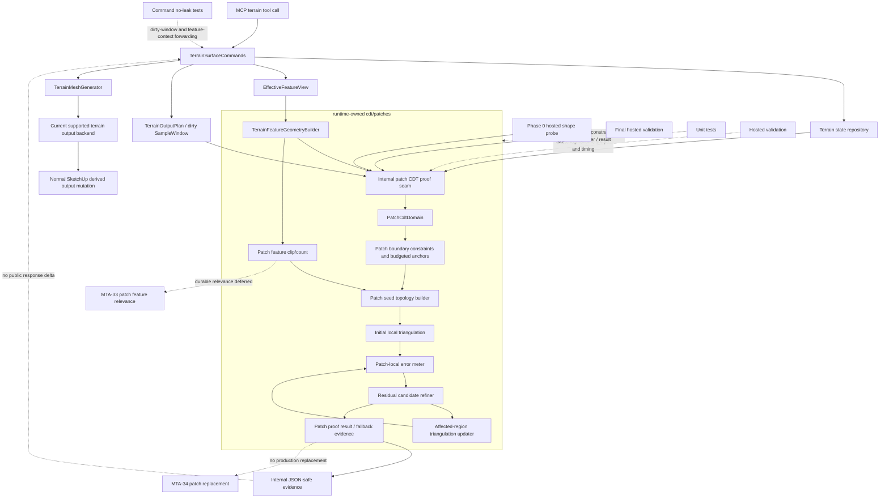

# Technical Plan: MTA-32 Implement Patch-Local Incremental Residual CDT Proof
**Task ID**: `MTA-32`
**Title**: `Implement Patch-Local Incremental Residual CDT Proof`
**Status**: `finalized`
**Date**: `2026-05-09`

## Source Task

- [Implement Patch-Local Incremental Residual CDT Proof](./task.md)

## Problem Summary

`MTA-31` proved that the current CDT scaffold has useful ownership seams and diagnostics, but the residual policy is still global: it scans the whole terrain, adds residual points, and retriangulates the growing point set repeatedly. Hosted evidence showed small terrain cases around 4-5 seconds and representative histories taking minutes. `MTA-32` must prove a different internal shape: derive a dirty local patch, refine residuals inside that patch, and update only affected triangulation regions when residual points are inserted.

This is a proof slice, not production enablement. It must create runtime-owned seams that later `MTA-33` feature relevance and `MTA-34` SketchUp patch replacement can use without turning the existing global residual engine into a pile of patch-mode branches.

## Goals

- Add an internally enabled patch-local CDT proof path based on dirty `SampleWindow` data and bounded patch domains.
- Preserve local terrain detail by adding residual points inside the patch until quality, budget, runtime, or improvement gates stop refinement.
- Avoid full-terrain residual scans and full-terrain retriangulation in the proof path.
- Avoid rebuilding the whole growing patch point set for every accepted residual insertion.
- Establish explicit ownership seams for patch domain derivation, boundary/constraint topology, residual metrics, affected-region updates, and proof evidence.
- Produce internal JSON-safe timing, quality, budget, fallback, boundary, and affected-region diagnostics sufficient to compare with `MTA-31`.
- Keep CDT disabled by default and preserve public MCP request/response shapes.

## Non-Goals

- Default-enabling CDT terrain output.
- Replacing SketchUp derived output patch geometry in production workflows.
- Implementing durable patch-relevant hard/firm/soft feature selection; that is `MTA-33`.
- Implementing SketchUp patch replacement, seam mutation, or entity lifecycle handling; that is `MTA-34`.
- Adding public backend selectors, tuning controls, or public CDT diagnostics.
- Shipping native/C++ triangulation binaries.
- Rewriting unrelated terrain edit kernels or terrain state storage.

## Related Context

- [Managed Terrain Surface Authoring HLD](../../../hlds/hld-managed-terrain-surface-authoring.md)
- [CDT Terrain Output External Review](../../../research/managed-terrain/cdt-terrain-output-external-review.md)
- `MTA-10`: dirty-window and local output replacement lessons.
- `MTA-20`: feature-intent state and runtime feature context.
- `MTA-24`: comparison CDT backend, residual measurement, triangulator seam, and bakeoff evidence.
- `MTA-25`: production CDT scaffold/fallback and the warning that full perimeter seeding increased seed counts and was removed.
- `MTA-31`: CDT ownership cleanup, residual timing probes, containment gates, hosted evidence, and current disabled-default posture.

## Research Summary

- `MTA-31` is the closest analog. It isolated the dominant cost as residual refinement plus repeated Ruby full retriangulation, not feature selection or public contract shape.
- `MTA-25` warns that live hosted validation can drive churn if planning does not freeze ownership and fallback behavior. It also records that full source-perimeter seeding/constraints overcorrected a boundary issue and increased seed counts.
- `MTA-10` shows local-output work must include hosted validation because command preparation, target resolution, and real SketchUp geometry can dominate expected costs.
- Current `ResidualCdtEngine` is global by design: whole-domain point planning, whole-state residual scans, and repeated full triangulation.
- Current `CdtTriangulator` has Bowyer-Watson batch behavior and private local non-manifold repair, but no public incremental insertion API. It also flags near-collinear triples, so dense rectangular boundary samples are risky.
- Current `CdtHeightErrorMeter` scans every state sample. MTA-32 needs patch-local metering.
- Current `CdtTerrainPointPlanner` uses full-terrain corners and bounded segment support. MTA-32 needs separate patch seed planning and explicit boundary segment records.
- External CDT sources support local cavity insertion, constrained edges as barriers, affected/crossed triangle diagnostics, and conservative fallback on degeneracy. Terrain TIN sources support greedy residual insertion with local candidate recomputation rather than broad rescans.

## Technical Decisions

### Data Model

- `PatchCdtDomain` is a runtime value object derived from authoritative terrain state plus dirty `SampleWindow` and a default clipped two-sample margin.
- The domain records patch sample bounds, owner-local XY bounds, source dimensions, margin, patch sample count, and containment helpers. Terrain state remains authoritative.
- Patch boundary topology is explicit JSON-safe segment/constraint data, not loose points. Boundary segments have stable directional IDs such as `patch_boundary:north`, deterministic clockwise ordering, source category, and mandatory inclusion rules.
- Boundary anchors use the hybrid budgeted policy:
  - mandatory patch corners;
  - mandatory feature/protected/hard-segment intersections with the patch boundary;
  - clipped hard segment endpoints;
  - coarse anchors only to cap segment length at roughly `nominal_spacing * 8.0`;
  - max eight subdivisions per boundary edge;
  - total boundary-anchor budget `min(64, max(16, floor(max_point_budget * 0.15)))`, excluding required hard feature/protected intersections;
  - adaptive boundary-residual anchors consume the boundary budget;
  - `boundary_budget_exceeded` is returned instead of adding every perimeter sample.
- Patch proof state is run-local only. Mutable triangulation/candidate state may exist during one proof run, but no reusable patch cache is persisted across commands in this task.

### API and Interface Design

- Add runtime-owned patch-local CDT collaborators under `src/su_mcp/terrain/output/cdt/patches/`.
- The internal proof seam accepts authoritative terrain state, dirty window/output plan data, feature geometry, and internal budgets. It returns JSON-safe internal evidence.
- The affected-region updater accepts current local triangulation plus one accepted residual point and returns updated local triangulation plus diagnostics: affected/crossed triangle counts, removed/created local triangle counts, boundary-preservation status, boundary violation reason, before/after point count, total patch triangle count, `rebuildDetected`, and `recomputationScope`.
- Patch-local residual refinement allows initial and final full-patch scans for quality evidence. After each accepted point, candidate recomputation is limited to affected triangles/cavities or a documented bounded neighborhood with a default recomputation multiplier gate of `affected_triangle_count * 2`.
- Any full patch point-set rebuild after an accepted residual insertion returns `affected_region_update_failed` rather than success evidence.
- `TerrainSurfaceCommands` may invoke the internal proof seam for validation/proof evidence, but public MCP request and response contracts do not change.

### Public Contract Updates

- Planned public contract delta: none.
- No public MCP tool names, schemas, request shapes, response shapes, docs, or examples should change.
- If a public surface unexpectedly becomes unavoidable, implementation must update runtime behavior, native tool catalog/schema registration, dispatcher handling, contract tests, README/examples, and task docs together before shipping that change.

### Error Handling

- Proof stop/fallback evidence must distinguish:
  - `refused_unsupported_topology`
  - `refused_boundary_constraint`
  - `quality_budget_exceeded`
  - `runtime_budget_exceeded`
  - `affected_region_update_failed`
  - `core_assumption_invalidated`
- Lower-level stop reasons include at least `empty_dirty_window`, `patch_domain_invalid`, `boundary_budget_exceeded`, `boundary_constraint_failed`, `point_budget_reached`, `face_budget_reached`, `runtime_budget_reached`, `improvement_stalled`, `residual_quality_not_met`, `triangulation_update_failed`, `out_of_domain_vertex`, and `unsupported_constraint_recovery`.
- Failures return deterministic internal evidence. They must not silently substitute global residual refinement, full patch rebuild per insertion, native triangulation, public contract changes, or production SketchUp replacement.

### State Management

- Terrain state remains authoritative.
- Patch proof output is disposable evidence, not durable terrain state.
- No persistent patch cache is introduced in `MTA-32`.
- Persistent patch cache/indexing and replacement ownership are deferred until `MTA-33`/`MTA-34` clarify feature relevance and mutation semantics.

### Integration Points

- `TerrainSurfaceCommands`: internal proof invocation and no-public-leak checks.
- `TerrainOutputPlan` / `SampleWindow`: dirty window source for `PatchCdtDomain`.
- `TerrainFeatureGeometryBuilder`: feature geometry input. MTA-32 clips/contains/counts features inside the patch proof without changing durable `EffectiveFeatureView` semantics.
- `TerrainMeshGenerator`: remains the normal production output path. MTA-32 must not route proof output into production replacement.
- `CdtTriangulator` / `TerrainTriangulationAdapter`: current batch behavior informs seed triangulation, but affected-region update must be explicit and diagnostic-driven.
- Hosted validation: exercises the runtime-owned internal seam with command-shaped inputs; it does not replace production geometry.

### Configuration

- Default patch margin: two sample intervals, clipped to terrain bounds.
- Boundary coarse anchor spacing: `nominal_spacing * 8.0`.
- Boundary subdivision cap: eight per edge.
- Boundary anchor budget: `min(64, max(16, floor(max_point_budget * 0.15)))`, excluding required hard feature/protected intersections.
- Numeric hosted performance thresholds are not invented in the plan before Phase 0. Phase 0 hosted-shape evidence must update this plan with concrete values before deeper affected-region implementation proceeds.
- Phase 0 command-shaped Ruby runtime evidence is recorded in [phase0-evidence.md](./phase0-evidence.md). Frozen proof thresholds are `maxPatchSeconds = 0.05`, `maxAcceptedHeightError = 0.05`, and `maxFallbackHeightErrorEvidence = 1.0216494384233006`. SketchUp-hosted threshold confirmation remains a manual validation gap until a hosted run is executed.
- Phase 0 hosted-shape evidence must exercise at least flat/smooth, rough/high-relief, boundary-constraint, and feature-intersection proof cases before thresholds freeze.

## Architecture Context

## Key Relationships

- `TerrainSurfaceCommands` remains the command orchestration boundary and keeps public responses stable.
- `cdt/patches` is runtime-owned implementation code, not a probe-only sidecar.
- `TerrainMeshGenerator` and the current backend remain the production output path.
- Patch proof evidence is the internal handoff shape for later `MTA-33` and `MTA-34`, not a public response.
- `MTA-33` owns durable patch-relevant feature selection.
- `MTA-34` owns SketchUp patch replacement and seam mutation.

## Acceptance Criteria

- A non-empty dirty `SampleWindow` produces a bounded patch domain with clipped two-sample default margin, owner-local XY bounds, source index bounds, patch sample count, and no dependence on raw SketchUp entities.
- Empty, invalid, or out-of-range dirty windows return deterministic internal refusal/fallback evidence without attempting a full-terrain solve.
- Normal managed terrain create/edit output remains on the current supported backend unless the internal proof seam is explicitly invoked for testing or validation.
- Public MCP terrain request and response shapes remain unchanged; patch proof diagnostics, raw triangles, residual queues, updater internals, and fallback classifications do not leak into public responses.
- Patch boundary topology is represented as explicit JSON-safe boundary/constraint segments with stable IDs, deterministic ordering/orientation, source category, mandatory inclusion rules, and boundary failure diagnostics.
- Boundary anchors follow the hybrid budgeted policy: mandatory corners/intersections, coarse anchors capped by `nominal_spacing * 8.0` and eight subdivisions per edge, adaptive boundary residual anchors only under the boundary budget, and `boundary_budget_exceeded` fallback instead of all-perimeter seeding.
- Patch seed topology never imports full-terrain boundary corners and does not add every patch perimeter sample by default.
- Feature geometry is clipped, contained, or rejected against the patch domain with included/excluded/intersecting counts, without changing durable `EffectiveFeatureView` relevance semantics.
- Patch-local residual quality measurement scans only patch samples and reports max error, RMS error, p95 error, dense ratio, scan sample count, and local residual stop/fallback evidence.
- Initial and final full-patch residual scans are allowed for quality evidence, but after each accepted residual point, candidate recomputation is limited to affected triangles/cavities or a documented bounded neighborhood with recomputation count bounded by the default `affected_triangle_count * 2` gate unless the proof returns failure evidence.
- Residual insertion uses an affected-region update path that reports affected/crossed triangle counts, removed/created local triangle counts, before/after point counts, total patch triangle count, rebuild detection, boundary-constraint preservation, and boundary violation reasons when update fails.
- The proof does not rebuild the whole growing patch point set after every accepted residual point; any fallback to broad rebuild/rescan is reported as proof failure evidence rather than counted as success.
- Result evidence distinguishes unsupported topology/constraint refusal, boundary constraint refusal, quality budget exceeded, runtime budget exceeded, affected-region update failure, and core-assumption invalidation.
- Accepted proof cases return JSON-safe internal evidence with patch domain, seed counts by source, boundary anchor counts, feature participation counts, residual/error metrics, affected-region metrics, timing, stop/fallback classification, and no raw SketchUp objects.
- Phase 0 hosted-shape validation exercises the runtime-owned proof seam through command-shaped dirty-window and feature-context inputs, records no-public-leak evidence, covers at least flat/smooth, rough/high-relief, boundary-constraint, and feature-intersection cases, and freezes numeric validation thresholds before deeper affected-region implementation proceeds.
- Final hosted validation uses fixed fixture classes and frozen metrics/thresholds; failures produce deterministic evidence or re-planning, not late algorithm substitution, public contract changes, or production patch replacement.
- Unit and integration coverage proves the patch-local proof path does not invoke full-grid residual refinement, does not route through production SketchUp replacement, and does not make the current global `ResidualCdtEngine` the patch controller.

## Test Strategy

### TDD Approach

Write failing tests at the owning layer before implementation. Start with structure and proof-seam tests, then domain and constraint tests, then local residual/error tests, then affected-region updater tests, then result/no-leak tests, then hosted validation.

### Required Test Coverage

- Patch domain derivation from dirty sample windows, margin clipping, empty/out-of-range windows, source index bounds, and owner-local bounds.
- Boundary segment contract tests for stable IDs, ordering/orientation, mandatory inclusion, feature-boundary intersections, and failure diagnostics.
- Boundary-anchor policy tests for `nominal_spacing * 8.0` coarse spacing, max eight subdivisions per edge, total budget formula, adaptive anchor budget use, and `boundary_budget_exceeded`.
- Regression tests proving all-perimeter-sample seeding is not the default and full-terrain boundary corners are not imported.
- Patch feature clip/count tests with included, excluded, and intersecting geometry, while preserving `EffectiveFeatureView` semantics.
- Patch-local error meter tests for patch-only scans and max/RMS/p95/dense-ratio metrics.
- Residual candidate invalidation tests proving per-insertion recomputation is affected-region-limited or bounded-neighborhood-limited.
- Affected-region updater tests for local removed/created triangles, affected/crossed triangle counts, boundary-constraint preservation, out-of-domain rejection, and update-failure evidence.
- Result-shape tests proving JSON-safe evidence and distinct fallback classifications.
- No-leak tests if `TerrainCdtBackend`, `TerrainMeshGenerator`, or command response paths are touched.
- Structure tests that deliberately bless `terrain/output/cdt/patches/` and keep probe vocabulary out of runtime files.
- Phase 0 hosted-shape validation and final hosted validation against flat/smooth, rough/high-relief, feature-crossing, boundary-error, and budget-exceeded/fallback patch fixtures.

## Instrumentation and Operational Signals

- Patch domain size, dirty window, margin, and patch sample count.
- Seed counts by source: boundary anchors, feature anchors, residual points.
- Boundary segment count, boundary anchor count, boundary budget used, adaptive boundary anchors added.
- Feature participation counts: included, excluded, intersecting, clipped.
- Residual metrics: max error, RMS error, p95 error, dense ratio, scan sample count, max residual excess.
- Affected-region metrics: insertion count, affected/crossed triangle counts, removed/created triangle counts, candidate recomputation count, updater failure reason.
- Rebuild detection metrics: before/after point count, total patch triangle count, `rebuildDetected`, and `recomputationScope` values of `affected`, `bounded_neighborhood`, or `full`.
- Timing buckets: domain derivation, seed topology, initial triangulation, residual measurement, affected-region update, final quality check, total proof time.
- Stop/fallback classification and lower-level stop reason.
- Public no-leak evidence and hosted command-shaped proof invocation evidence.

## Implementation Phases

1. Runtime-owned proof seam and structure
   - Add `terrain/output/cdt/patches/` ownership.
   - Add an internal proof result shape and runtime seam.
   - Update structure/no-leak tests.
   - Add Phase 0 hosted-shape probe covering flat/smooth, rough/high-relief, boundary-constraint, and feature-intersection cases; freeze numeric thresholds after evidence.

2. Patch domain and explicit boundary constraints
   - Implement `PatchCdtDomain`.
   - Add boundary segment records, stable IDs, orientation, and mandatory rules.
   - Implement hybrid boundary-anchor policy and budget fallbacks.

3. Patch feature participation and seed topology
   - Clip/contain/count feature geometry against the patch domain.
   - Build seed topology from patch constraints, boundary anchors, and feature seeds.
   - Keep full-domain point planner behavior unchanged.

4. Patch-local residual metrics
   - Add patch-only error metering and local quality metrics.
   - Add initial/final full-patch scans and residual candidate ownership by triangle/cavity.

5. Affected-region update proof
   - Add run-local mutable triangulation/update seam.
   - Insert accepted residual points through affected-region updates.
   - Enforce candidate invalidation, recomputation multiplier checks, rebuild detection, and affected-region diagnostics.

6. Internal proof backend/result integration
   - Compose domain, seed topology, local residual metrics, updater, budgets, and result evidence.
   - Add fallback classifications and no-public-leak coverage.

7. Hosted validation and evidence comparison
   - Run fixed fixtures inside SketchUp through the runtime-owned proof seam.
   - Compare against MTA-31 evidence.
   - Record pass/fail evidence or follow-up/replanning trigger.

## Rollout Approach

- CDT remains disabled by default.
- Patch proof is invoked only through internal tests, validation seams, or hosted proof harnesses.
- Phase 0 hosted-shape evidence is required before deeper affected-region implementation proceeds.
- Phase 0 must include at least one rough/high-relief, one boundary-constraint, and one feature-intersection case so threshold freezing is based on more than a clean smooth fixture.
- Final hosted validation cannot change implementation direction silently; it can pass, fail with deterministic evidence, or trigger re-planning.
- No production SketchUp patch replacement ships in MTA-32.

## Risks and Controls

- Affected-region updater may be too large for Ruby: keep updater contract narrow, test diagnostics first, and return deterministic proof failure rather than pretending full rebuild is incremental.
- Candidate recomputation may remain too broad: forbid per-insertion full-patch rescans except as failure evidence; test recomputation counts.
- Ruby incremental triangulation may silently rebuild the full patch internally: require rebuild detection diagnostics and updater tests that fail if each accepted insertion rebuilds the full patch point set or full patch triangle set.
- `bounded neighborhood` language may be used too loosely: enforce `recomputationScope` and default recomputation count `<= affected_triangle_count * 2` unless the proof returns failure evidence.
- Boundary anchors may explode face counts: use hybrid budgeted anchors and `boundary_budget_exceeded`.
- Constraint recovery may be too weak for hard boundary cases: fail closed with refusal/fallback evidence and do not claim production readiness.
- Hosted timing may not meet interactive goals: define proof success as bounded locality and scaling evidence, not default enablement.
- Public contract drift may leak internal solver details: planned public delta is none; add no-leak tests if public-adjacent seams are touched.
- Runtime ownership may erode into probe-only sidecars: place proof collaborators under `cdt/patches` and make hosted probes exercise that seam.
- MTA-33/MTA-34 scope may be absorbed: keep feature relevance and SketchUp replacement explicitly deferred.

## Dependencies

- `MTA-10`, `MTA-20`, `MTA-24`, `MTA-25`, and `MTA-31`.
- [Managed Terrain Surface Authoring HLD](../../../hlds/hld-managed-terrain-surface-authoring.md).
- [CDT Terrain Output External Review](../../../research/managed-terrain/cdt-terrain-output-external-review.md).
- Current terrain runtime components: `TerrainSurfaceCommands`, `TerrainOutputPlan`, `SampleWindow`, `TerrainFeatureGeometryBuilder`, `EffectiveFeatureView`, `TiledHeightmapState`, current CDT result/envelope patterns, and `terrain/output/cdt` structure tests.
- Ruby unit test environment and SketchUp-hosted validation environment.

## Quality Checks

- [x] All required inputs validated
- [x] Problem statement documented
- [x] Goals and non-goals documented
- [x] Research summary documented
- [x] Technical decisions included
- [x] Architecture context included
- [x] Acceptance criteria included
- [x] Test requirements specified
- [x] Instrumentation and operational signals defined when needed
- [x] Risks and dependencies documented
- [x] Rollout approach documented when needed
- [x] Small reversible phases defined
- [x] Premortem completed with falsifiable failure paths and mitigations
- [x] Planning-stage size estimate considered before premortem finalization

## Premortem Gate

Status: PASS

### Unresolved Tigers

- None.

### Plan Changes Caused By Premortem

- Added rebuild detection to the affected-region updater contract: before/after point count, total patch triangle count, removed/created triangle counts, `rebuildDetected`, and explicit failure if full patch rebuild is used as success evidence.
- Tightened residual candidate invalidation with `recomputationScope` instrumentation and a default `affected_triangle_count * 2` recomputation multiplier gate.
- Strengthened Phase 0 hosted-shape validation to require flat/smooth, rough/high-relief, boundary-constraint, and feature-intersection proof cases before numeric thresholds freeze.
- Added risk controls for silent full rebuilds and overly broad `bounded_neighborhood` interpretations.

### Accepted Residual Risks

- Risk: Ruby affected-region CDT may still be too weak or slow for production use.
  - Class: Paper Tiger
  - Why accepted: MTA-32 is an internal proof and can succeed by producing bounded locality evidence or deterministic proof failure.
  - Required validation: updater diagnostics, recomputation scope checks, and hosted timing evidence.
- Risk: Final numeric performance thresholds cannot be known before Phase 0 hosted-shape evidence.
  - Class: Paper Tiger
  - Why accepted: the plan explicitly gates deeper implementation on threshold freezing after Phase 0 instead of inventing thresholds now.
  - Required validation: Phase 0 plan update with concrete thresholds before affected-region implementation proceeds.
- Risk: MTA-32 does not solve durable feature relevance or SketchUp patch replacement.
  - Class: Elephant
  - Why accepted: those are intentionally owned by MTA-33 and MTA-34; absorbing them would blur foundational boundaries.
  - Required validation: feature clip/count evidence only, no `EffectiveFeatureView` semantic changes, and no production replacement path.

### Carried Validation Items

- Phase 0 hosted-shape probe must freeze numeric thresholds before deeper affected-region implementation proceeds.
- Final hosted validation must compare fixed fixture classes against MTA-31 evidence without tuning thresholds ad hoc.
- Hosted validation must prove command-shaped dirty-window and feature-context inputs reach the runtime-owned proof seam.

### Implementation Guardrails

- Do not implement MTA-32 as probe-only code outside the runtime path.
- Do not route proof output through normal `TerrainMeshGenerator` replacement.
- Do not expose patch CDT internals through public MCP responses.
- Do not treat full patch rebuild or per-insertion full-patch residual rescan as affected-region success.
- Do not add every perimeter sample as mandatory boundary topology.
- Do not change durable feature relevance semantics; `MTA-33` owns that.
- Do not persist reusable patch caches; persistent patch ownership waits for follow-on work.
