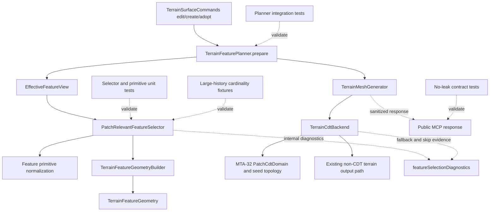

# Technical Plan: MTA-33 Implement Patch-Relevant Terrain Feature Constraints
**Task ID**: `MTA-33`
**Title**: `Implement Patch-Relevant Terrain Feature Constraints`
**Status**: `finalized`
**Date**: `2026-05-10`

## Source Task

- [Implement Patch-Relevant Terrain Feature Constraints](./task.md)

## Problem Summary

MTA-31 made terrain feature selection consume active effective feature state, but hard features
still participate too globally in local CDT output. A small patch edit can inherit far hard
constraints that existing cached output should preserve, inflating CDT inputs and weakening the
local-output performance goal. MTA-33 narrows CDT input to patch-relevant active effective features
without changing public MCP contracts or feature lifecycle semantics.

## Goals

- Select hard, firm, and soft terrain feature constraints by dirty-window or patch relevance for
  local CDT input.
- Preserve active-only effective feature lifecycle and deterministic stale-index handling from
  MTA-31.
- Treat touched hard/protected geometry conservatively through include, clip, expand, or internal
  CDT fallback behavior; do not publicly refuse otherwise valid heightmap edits because CDT cannot
  represent a touched feature.
- Record internal JSON-safe diagnostics for included/excluded counts, reasons, selection mode, and
  CDT participation gates.
- Prove public MCP response shapes and no-leak behavior remain stable.

## Non-Goals

- Replacing `FeatureIntentSet`, `FeatureIntentMerger`, or `EffectiveFeatureView`.
- Implementing production SketchUp patch replacement or seam mutation; that remains MTA-34 scope.
- Default-enabling CDT output.
- Adding public feature-selection controls, public CDT diagnostics, or public fallback enums.
- Introducing a persistent terrain feature spatial index unless implementation evidence proves the
  on-demand selector cannot meet the task.
- Solving artificial neighboring patch boundaries by making patch boundaries durable feature
  constraints.

## Related Context

- [Task MTA-33](./task.md)
- [Managed Terrain Surface Authoring HLD](specifications/hlds/hld-managed-terrain-surface-authoring.md)
- [CDT Terrain Output External Review](specifications/research/managed-terrain/cdt-terrain-output-external-review.md)
- MTA-20 established internal terrain feature constraint foundations.
- MTA-31 established effective feature lifecycle selection and exposed the current global-hard
  pressure.
- MTA-32 established patch-local CDT proof boundaries and patch-domain concepts, but deferred
  durable patch feature relevance to MTA-33.

## Research Summary

- The direct implementation issue is in
  `src/su_mcp/terrain/features/effective_feature_view.rb`: active hard features are currently
  included before window relevance is applied to firm/soft features.
- `src/su_mcp/terrain/features/terrain_feature_planner.rb` is the integration point. It calls
  `EffectiveFeatureView#selection`, builds internal constraints, optionally builds
  `TerrainFeatureGeometry`, and attaches `featureSelectionDiagnostics`.
- `TerrainFeatureGeometryBuilder#build` already accepts an explicit feature list, so a new selector
  can filter upstream without forcing geometry building to own lifecycle or relevance policy.
- `TerrainMeshGenerator` only invokes CDT when feature context and dirty-window feature geometry
  are present; skipped CDT can continue through the existing non-CDT output path.
- MTA-32 patch seed helpers clip/count geometry after feature geometry exists, which is too late to
  prevent far hard features from inflating upstream selection and diagnostics.
- Prior analogs MTA-31 and MTA-32 show this work needs deterministic stale-index tests,
  cardinality/performance evidence, no-leak checks, and careful handling of host-shaped windows
  such as `SampleWindow`.

## Technical Decisions

### Data Model

- Add an internal patch-relevance selection result that contains:
  - selected active effective features;
  - JSON-safe diagnostics with counts by strength and reason;
  - selection mode such as full-grid/all-active versus patch-relevant;
  - `cdtParticipation` as `eligible` or `skip`;
  - internal fallback trigger counts when CDT participation is skipped.
- Do not expose raw feature IDs, patch indexes, internal reason enums, CDT solver vocabulary, or
  fallback reasons through public MCP responses.
- Keep full-grid create/adopt behavior unchanged when no dirty/selection window exists: all active
  effective features remain eligible.

### API and Interface Design

- Introduce a terrain feature-layer collaborator, tentatively
  `PatchRelevantFeatureSelector`, called after `EffectiveFeatureView` and before
  `TerrainFeatureGeometryBuilder`.
- The selector accepts active effective selection output plus a dirty window or patch-domain-like
  object. It normalizes `SampleWindow`, hash windows, and patch bounds at the boundary.
- Share or extract lightweight owner-local primitive normalization with
  `TerrainFeatureGeometryBuilder` where practical, covering point anchors, rectangle/circle
  regions, line segments, and corridor envelopes.
- Use `PatchCdtDomain::DEFAULT_MARGIN_SAMPLES` semantics as the default two-sample expanded patch
  margin. Escalate to a wider margin only if a deterministic fixture proves two samples miss a
  seam-relevant hard/protected feature.

### Public Contract Updates

Not applicable. Public MCP tool names, request schemas, response shapes, docs, and examples are not
expected to change.

If implementation unexpectedly requires public surface changes, update the native tool catalog,
dispatcher/routing, command behavior, contract tests, README/examples, and task docs together in
the same change. That is a plan deviation and should be treated as scope drift.

### Error Handling

- Public `refused` means a managed terrain command returns a refusal outcome and does not apply the
  requested edit. MTA-33 must not introduce public refusals for otherwise valid edits solely
  because CDT patch selection/output cannot represent selected geometry.
- MTA-33-owned internal CDT fallback triggers are limited to:
  - `patch_relevant_hard_primitive_unsupported`: patch-relevant hard/protected geometry cannot be
    normalized into supported CDT input geometry;
  - `patch_relevant_hard_clip_degenerate`: patch-relevant hard/protected clipping collapses to
    empty or zero-length input;
  - `patch_relevant_feature_geometry_failed`: selected hard/protected feature geometry derivation
    fails.
- These triggers are pre-CDT or geometry-preparation gates. For unsupported patch-relevant
  hard/protected features, the selector marks `cdtParticipation: skip` before any CDT correction or
  refinement loop runs.
- Budget overflow in selected patch-relevant input skips CDT with internal missed-locality
  diagnostics and continues through the existing non-CDT terrain output plan.

### State Management

- `EffectiveFeatureView` remains responsible for active effective eligibility and stale
  effective-index behavior.
- Patch relevance does not mutate durable feature state, does not rebuild lifecycle indexes, and
  does not persist patch boundaries as feature constraints.
- Diagnostics attach to internal planning context/feature context only.

### Integration Points

- `TerrainFeaturePlanner#prepare` wires `EffectiveFeatureView` output into the new selector when a
  dirty/selection window exists.
- `TerrainFeatureGeometryBuilder` receives the selector's selected feature list.
- `TerrainMeshGenerator` and the CDT backend honor `cdtParticipation: skip` by not emitting an
  accepted CDT mesh for that regeneration attempt and by continuing through the existing non-CDT
  output path.
- `TerrainSurfaceCommands` remains responsible for passing edit changed-region windows into
  planning; public command response builders remain sanitized.

### Configuration

- No new public or user-facing configuration.
- Internal selector constants should be private to the terrain feature/output layer and tested
  through behavior. The default patch margin follows the existing two-sample MTA-32 patch margin.

## Architecture Context

## Key Relationships

- `EffectiveFeatureView` decides whether a feature is active and eligible at all; the selector
  decides whether an eligible feature is relevant to this CDT patch.
- The selector owns internal CDT participation gating, not the CDT correction loop.
- Geometry building remains downstream of selection and should not silently reselect far active
  features.
- Public command serialization remains downstream of internal diagnostics and must keep diagnostics
  hidden.

## Acceptance Criteria

- Dirty-window CDT feature preparation includes hard/protected features only when supported
  normalized geometry intersects, crosses, touches, or lies within the expanded patch margin.
- Dirty-window CDT feature preparation excludes far hard/protected features and records internal
  exclusion counts by strength and reason.
- Firm and soft features are selected only when their supported primitive or relevance window
  intersects the expanded patch.
- Active effective lifecycle eligibility and stale-index behavior remain unchanged and are covered
  by regression tests.
- Full-grid create/adopt paths keep current all-active-effective selection behavior when no dirty
  window/patch domain exists.
- Unsupported patch-relevant hard/protected primitives, degenerate patch-relevant clipping, and
  selected hard/protected geometry derivation failure cause internal CDT non-participation, not
  public command refusal.
- Budget overflow in selected patch-relevant features skips CDT with internal missed-locality
  diagnostics and continues through the existing non-CDT output path.
- Public MCP command responses do not expose raw feature IDs, patch indexes, internal reason enums,
  CDT solver details, or fallback vocabulary.
- Deterministic cardinality fixtures show materially lower hard-feature participation for a small
  patch than the prior global-hard behavior.
- At least one representative local fixture defines the previous global-hard baseline and proves
  patch-relevant dirty-window selection reduces selected hard-feature count by at least 40% while
  still selecting every touched/protected hard feature in that fixture.

## Test Strategy

### TDD Approach

1. Add a failing normalization contract test that locks `SampleWindow`, hash window, and
   patch-domain/bounds inputs to the same owner-local bounds expected by the selector and feature
   geometry builder.
2. Add failing selector tests for hard/protected inside, far outside, crossing, touching,
   boundary-near, unsupported patch-relevant, unsupported far, clipping-degenerate, and
   firm/soft near/far behavior.
3. Add failing primitive-normalization tests, or selector tests that lock point, rectangle, circle,
   segment, and corridor handling against builder-compatible expectations.
4. Add planner integration tests proving selected constraints, `featureGeometry`, and
   `featureSelectionDiagnostics` reflect patch relevance.
5. Add command/runtime tests proving valid edits continue through existing non-CDT output when CDT
   participation is skipped.
6. Add a multi-edit sequence test where repeated small-patch CDT skips do not grow cached output or
   dirty regions beyond the existing non-CDT regeneration behavior.
7. Add public contract/no-leak tests before exposing or broadening diagnostics.
8. Add local large-history/cardinality evidence tests after core correctness passes.

### Required Test Coverage

- `test/terrain/features/effective_feature_view_test.rb`: preserve stale-index and active-only
  lifecycle behavior while replacing any expectation that hard features are always global for local
  CDT selection.
- `test/terrain/features/terrain_feature_planner_test.rb`: selector integration, diagnostics,
  fallback trigger propagation, and feature geometry input shape.
- New or adjacent selector tests under `test/terrain/features/`: deterministic relevance predicates,
  margin behavior, budget skip, supported/unsupported primitive behavior, and window/domain shape
  normalization.
- `test/terrain/features/terrain_feature_geometry_builder_test.rb`: builder compatibility with any
  shared primitive normalization.
- `test/terrain/contracts/terrain_contract_stability_test.rb`: no public leakage of internal
  reasons, fallback triggers, feature IDs, patch indexes, or CDT details.
- `test/terrain/commands/terrain_surface_commands_test.rb`: changed-region windows reach feature
  planning, public edit success is preserved through CDT skip/fallback, and repeated small-patch
  skips do not cause unbounded dirty-region/cache growth.
- Patch seed/topology tests only if the selected feature geometry shape changes MTA-32 seed inputs.

## Instrumentation and Operational Signals

- Internal `featureSelectionDiagnostics` should include selection mode, eligible/selected/excluded
  counts by strength, counts by reason, and CDT fallback-trigger counts.
- Local fixture evidence should capture selected hard/firm/soft counts for a representative
  feature-heavy small patch before and after patch-relevant selection.
- Budget overflow diagnostics should be visible internally as missed-locality evidence, not public
  fallback vocabulary.

## Implementation Phases

1. Add shared primitive/window normalization and focused tests.
2. Add `PatchRelevantFeatureSelector` with relevance predicates, two-sample margin handling,
   diagnostics, and CDT participation gating.
3. Integrate selector in `TerrainFeaturePlanner#prepare` for dirty-window CDT feature geometry
   paths while preserving full-grid create/adopt behavior.
4. Wire internal CDT skip/fallback propagation so unsupported/degenerate/budget cases continue
   through the existing non-CDT output path without public refusal.
5. Update planner, command, contract, and cardinality/performance tests.
6. Run the smallest practical validation set; add hosted validation only if local fixtures cannot
   prove representative exclusion, no-leak behavior, and unchanged public command success.

## Rollout Approach

- Keep CDT disabled by default.
- Ship behind existing internal CDT selection/output behavior with no public request or response
  changes.
- Treat any public contract delta as plan drift requiring coordinated schema, dispatcher, docs, and
  contract-test updates.

## Risks and Controls

- Primitive interpretation drift: share/extract primitive normalization or cover selector and
  builder compatibility with tests.
- Over-aggressive hard/protected exclusion: require explicit touched-ordering tests and fallback
  trigger tests.
- CDT fallback becoming public refusal: require command tests proving otherwise valid edits still
  succeed through the existing non-CDT path.
- Budget fallback hiding performance failure: record missed-locality diagnostics and do not present
  fallback as local CDT success.
- Public contract drift or diagnostic leakage: require contract stability/no-leak tests.
- Host-shaped window mismatch: normalize and test `SampleWindow`, hash windows, and patch-domain
  bounds.
- Two-sample margin under-protection: keep wider margin as a gated escalation only if fixture
  evidence proves the default misses seam-relevant hard/protected geometry.
- Hidden hard-feature dependency not represented in current research: if implementation discovers
  explicit feature-to-feature dependency/protection references, selector policy must include the
  dependency-linked feature when patch-relevant or skip CDT with an internal fallback trigger rather
  than silently excluding it.
- On-demand O(n) selection scaling limit: cardinality/performance fixture evidence must show the
  selector materially reduces CDT input without becoming the dominant local-edit cost; if not,
  split a follow-up spatial-index task instead of broadening MTA-33 silently.

## Dependencies

- MTA-20 internal feature constraint foundation.
- MTA-31 effective feature lifecycle, validated effective index, and feature planner flow.
- MTA-32 patch domain and patch-local CDT proof semantics.
- Existing non-CDT terrain output generator as the fallback path for valid edits.
- Ruby tests that can run outside SketchUp for deterministic selector/planner behavior.

## Premortem Gate

Status: PASS

### Unresolved Tigers

- None.

### Plan Changes Caused By Premortem

- Added a falsifiable local cardinality threshold: at least one representative fixture must show
  at least 40% hard-feature count reduction versus the previous global-hard baseline while
  preserving all touched/protected hard features.
- Added a pre-selector window normalization contract test for `SampleWindow`, hash windows, and
  patch-domain/bounds shapes before relevance predicates are implemented.
- Added a multi-edit sequence validation that repeated CDT skips do not cause unbounded cached
  output or dirty-region growth.

### Accepted Residual Risks

- Risk: hard-feature mutual dependency could exist outside the researched model.
  - Class: Paper Tiger
  - Why accepted: no current researched feature schema shows explicit feature-to-feature dependency
    references, and broadening selection for hypothetical dependencies would weaken the locality
    goal.
  - Required validation: if implementation discovers explicit dependency/protection references,
    include dependency-linked features when patch-relevant or skip CDT internally.
- Risk: on-demand selection may still scan all active features.
  - Class: Elephant
  - Why accepted: MTA-33's primary goal is reducing CDT input participation, not building a durable
    spatial index; persistent indexing is a larger design with MTA-34 implications.
  - Required validation: local cardinality/performance fixture evidence must show the selector
    materially reduces CDT input without becoming the dominant edit cost.

### Carried Validation Items

- Deterministic selector, primitive, planner, command, contract, and cardinality tests.
- Hosted validation only if local fixtures cannot prove representative feature exclusion, no-leak
  behavior, and public edit success through CDT skip/fallback.
- Wider margin escalation only if a deterministic fixture proves the two-sample margin misses
  seam-relevant hard/protected geometry.

### Implementation Guardrails

- Do not put patch relevance inside `EffectiveFeatureView`; preserve that class as the lifecycle
  and stale-index boundary.
- Do not publicly refuse otherwise valid heightmap edits because CDT cannot represent
  patch-relevant touched geometry.
- Do not expose internal diagnostics, fallback triggers, feature IDs, patch indexes, or CDT
  vocabulary through public MCP responses.
- Do not solve MTA-34 replacement seams or artificial neighboring patch boundaries in MTA-33.
- Do not treat budget overflow fallback as local CDT success.

## Quality Checks

- [x] All required inputs validated
- [x] Problem statement documented
- [x] Goals and non-goals documented
- [x] Research summary documented
- [x] Technical decisions included
- [x] Architecture context included
- [x] Acceptance criteria included
- [x] Test requirements specified
- [x] Instrumentation and operational signals defined when needed
- [x] Risks and dependencies documented
- [x] Rollout approach documented when needed
- [x] Small reversible phases defined
- [x] Premortem completed with falsifiable failure paths and mitigations
- [x] Planning-stage size estimate considered before premortem finalization
