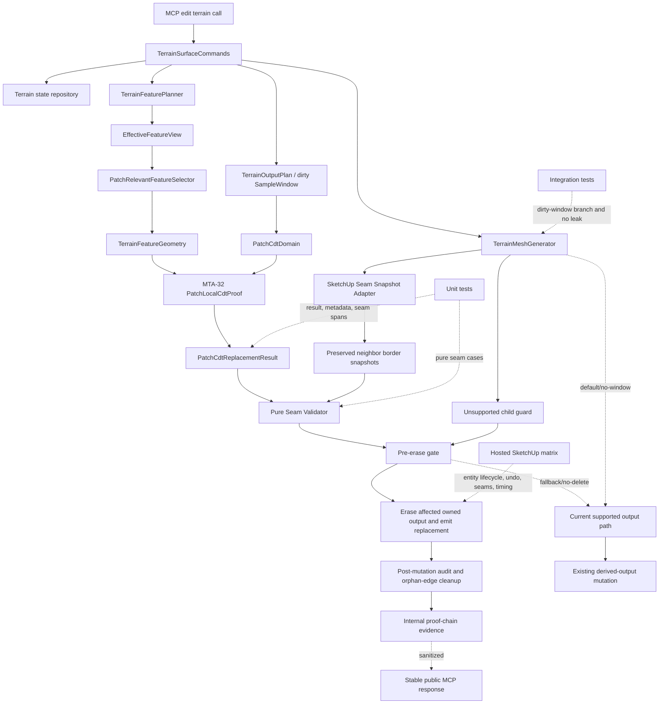

# Technical Plan: MTA-34 Implement CDT Patch Replacement And Seam Validation
**Task ID**: `MTA-34`
**Title**: `Implement CDT Patch Replacement And Seam Validation`
**Status**: `closed-blocked`
**Date**: `2026-05-10`

## Source Task

- [Implement CDT Patch Replacement And Seam Validation](./task.md)

## Problem Summary

`MTA-32` proves local CDT patch solving and `MTA-33` proves patch-relevant feature constraints, but
CDT still is not useful for interactive terrain edits unless accepted patch output can replace only
the affected SketchUp derived geometry. `MTA-34` is the final task in this proofing cycle: it must
prove the internal chain from patch-relevant constraints, to accepted local patch solve, to
seam-validated SketchUp replacement while keeping CDT disabled by default and public MCP contracts
unchanged.

The key failure to avoid is a fallback-only implementation that is safe but does not prove the local
CDT replacement loop. Safety fallbacks are still required, but MTA-34 success requires at least one
non-fallback hosted case where `MTA-33`, `MTA-32`, and `MTA-34` all participate.

## Closeout Outcome

MTA-34 is closed as blocked/incomplete, not accepted as product behavior. The implementation
produced useful replacement infrastructure, but hosted validation exposed a missing production
precondition: there is no stable CDT-owned patch output lifecycle for the replacement logic to
operate on.

The plan's positive proof-chain requirement was not met. The remaining product-loop work is now
defined in
[MTA-35 Productize Cached CDT Patch Output Lifecycle For Windowed Terrain Edits](../MTA-35-productize-cached-cdt-patch-output-lifecycle-for-windowed-terrain-edits/task.md).

Retained MTA-34 infrastructure should be audited and adapted by MTA-35 where it fits stable patch
identity, patch output bootstrap, dirty-window-to-patch mapping, repeated-edit metadata lifecycle,
and hosted visual proof requirements.

## Goals

- Replace only affected CDT patch derived output while leaving preserved neighboring output intact.
- Convert MTA-32 patch proof evidence into a production-safe replacement result, not direct debug
  mesh mutation.
- Validate seams between regenerated patch borders and preserved-neighbor borders before erasing
  old output.
- Reuse MTA-10 conservative mutation ordering and derived-output ownership posture.
- Honor MTA-33 `cdtParticipation` gates and avoid independent feature reselection.
- Keep CDT internally gated, disabled by default, and invisible to public MCP response contracts.
- Produce hosted evidence for positive local replacement, fallback/no-delete safety, undo, and
  timing.

## Non-Goals

- Default-enabling CDT terrain output.
- Implementing patch-local CDT refinement or incremental triangulation; that remains MTA-32 scope.
- Implementing patch-relevant feature selection; that remains MTA-33 scope.
- Adding public backend selectors, public patch diagnostics, public seam diagnostics, or public
  fallback enums.
- Introducing native/C++ triangulation.
- Building a durable global patch cache or mandatory per-patch group hierarchy.
- Reworking unrelated terrain tools, state schema, or command surfaces.

## Related Context

- [Managed Terrain Surface Authoring HLD](specifications/hlds/hld-managed-terrain-surface-authoring.md)
- [CDT Terrain Output External Review](specifications/research/managed-terrain/cdt-terrain-output-external-review.md)
- [MTA-10 partial terrain output regeneration](specifications/tasks/managed-terrain-surface-authoring/MTA-10-implement-partial-terrain-output-regeneration/task.md)
- [MTA-31 CDT enablement scaffold](specifications/tasks/managed-terrain-surface-authoring/MTA-31-enable-cdt-terrain-output-after-disabled-scaffold/task.md)
- [MTA-32 patch-local CDT proof](specifications/tasks/managed-terrain-surface-authoring/MTA-32-implement-patch-local-incremental-residual-cdt-proof/plan.md)
- [MTA-33 patch-relevant feature constraints](specifications/tasks/managed-terrain-surface-authoring/MTA-33-implement-patch-relevant-terrain-feature-constraints/plan.md)
- [MTA-14 UE source research handoff](specifications/tasks/managed-terrain-surface-authoring/MTA-14-evaluate-base-detail-preserving-survey-correction/task.md)

## Research Summary

- MTA-10 is the closest mutation analog. It proved that partial output replacement needs exact
  ownership metadata, no-delete fallback, unsupported-child refusal, orphan-edge cleanup, undo, and
  hosted validation because local doubles under-model SketchUp entity behavior.
- MTA-31 established effective feature state, `EffectiveFeatureView`, and a disabled-default CDT
  posture, but also showed global residual/retriangulation is the performance blocker.
- MTA-32 provides `PatchCdtDomain`, boundary topology, seed topology, topology/quality evidence, and
  patch proof output. Its `debugMesh` and proof vocabulary are validation-only and must not drive
  production mutation directly.
- MTA-33 provides the feature handoff: patch-relevant `TerrainFeatureGeometry` and internal
  `cdtParticipation: skip`. MTA-34 consumes this context rather than reselecting features.
- The external CDT review supports cached/local patches, hard patch boundaries, seam validation,
  patch replacement, and local residual work. It does not require native triangulation for this task.
- Targeted UE source inspection supports explicit regions, separated input/output areas,
  duplicate-border awareness, and pre-mutation result validation. UE architecture, render targets,
  and edit-layer storage are not imported into this Ruby SketchUp extension.

## Technical Decisions

### Data Model

Add an internal `PatchCdtReplacementResult` value object or equivalent adapter between MTA-32 proof
output and `TerrainMeshGenerator` mutation. It contains only production-safe data:

- `status`: accepted, skipped, or failed internal status;
- `patchDomain`: JSON-safe domain bounds/digest and source dimensions;
- `mesh`: owner-local vertices and triangle indices;
- `border`: side-labeled border spans and side summaries;
- `topology` and `quality`: accepted MTA-32-derived validation summaries;
- `featureDigest`: digest for selected MTA-33 feature context when used for proof/freshness;
- `stopReason` / internal failure reason;
- `evidence`: JSON-safe internal evidence for tests and hosted harnesses.

The replacement mesh contract must include owner-local vertices, triangle indices, border side
labels/spans, patch/domain digest, face count, and domain coverage evidence. A raw triangle list is
not sufficient.

Use the existing derived-output dictionary and add CDT-specific ownership keys. Regular-grid
`gridCell*` keys remain untouched and are not used to infer adaptive CDT ownership.

Required on every emitted CDT patch face:

- existing derived-output marker;
- output kind, for example CDT patch face;
- `cdtOwnershipSchemaVersion`;
- patch domain digest;
- replacement batch id or patch revision;
- patch face index.

Required on border-participating faces or associated seam snapshots:

- side label;
- border span id or equivalent ordered span reference;
- border participation flag;
- owning face digest used by seam snapshots.

Required for positive proof-chain evidence, but not necessarily persisted on every face:

- MTA-33 feature context digest or selected-feature digest;
- MTA-32 proof/replacement result digest;
- replacement result status and mutation mode.

Optional owner/root batch summary may record patch domain digest, replacement batch id, emitted face
count, border span counts by side, and hosted timing/validation summaries. It is not mandatory for
the first implementation. If hosted timing shows face scans dominate, create a follow-up patch
index/cache task instead of expanding MTA-34 into default-enable infrastructure.

### API and Interface Design

`TerrainMeshGenerator` gets a dirty-window CDT patch branch behind the existing internal CDT
enablement seam. The branch runs only when all are true:

- the edit has dirty-window output context;
- feature planning produced eligible MTA-33 feature geometry;
- `cdtParticipation` is eligible;
- a patch replacement collaborator is injected or internally enabled;
- existing unsupported-child guards pass.

The branch must:

1. Build/obtain a `PatchCdtReplacementResult` from MTA-32 proof output and MTA-33 feature geometry.
2. Collect preserved-neighbor seam snapshots through a SketchUp adapter.
3. Run a SketchUp-free seam validator against replacement border data and neighbor snapshots.
4. Validate pre-erase gates.
5. Replace only affected owned CDT patch faces/edges.
6. Emit replacement faces and metadata.
7. Cleanup orphan derived edges and audit the result.

Seam collection and validation are separate:

- SketchUp adapter: reads live derived entities and converts relevant borders to JSON-safe
  snapshots.
- Pure seam validator: compares generated patch border snapshots to preserved-neighbor snapshots
  without SketchUp objects.

Seam snapshots include side label, ordered owner-local XY/Z vertices, border edge/span records,
owning face digests, patch/domain digest, source output kind, and bounds/count summaries.

Seam comparison is span-based:

- Match by side label, opposite-side mapping, patch/domain digest, source output kind, and preserved
  neighbor ownership/domain digest when available.
- Normalize side orientation so reversed SketchUp edge ordering is not a false mismatch.
- Allow different subdivisions only when every endpoint and required span sample from both sides
  lies on the opposite border within XY tolerance and interpolated Z is within Z tolerance.
- Reject open gaps, duplicate overlapping border faces, protected-boundary crossings, stale/missing
  neighbor evidence, out-of-domain border triangles, unsupported duplicate border vertices, and
  unpaired side spans.

### Public Contract Updates

Not applicable. Planned public MCP delta is none.

No public request schemas, tool names, dispatcher routes, response shapes, README examples, backend
selectors, CDT diagnostics, seam diagnostics, patch IDs, or fallback enums should change.

If implementation proves a public surface change unavoidable, that is a plan deviation and must
update native tool catalog/schema registration, dispatcher handling, contract fixtures, integration
tests, README/examples, and task docs in the same change.

### Error Handling

Internal failure taxonomy:

- `cdt_non_participation`
- `patch_result_incomplete`
- `ownership_incomplete`
- `ownership_integrity_mismatch`
- `seam_mismatch`
- `topology_invalid`
- `unsupported_child_refusal`
- `mutation_failed`

Fallback/refusal routing:

| Internal condition | Planned route | Pre-erase rule |
| --- | --- | --- |
| `cdt_non_participation` from MTA-33 `cdtParticipation: skip` | current-output fallback | old output retained until fallback succeeds |
| `patch_result_incomplete` | current-output fallback | old output retained |
| `topology_invalid` | current-output fallback | old output retained |
| `seam_mismatch` with fresh preserved-neighbor evidence | current-output fallback | old output retained |
| `ownership_incomplete` on CDT patch metadata | current-output fallback only if current backend can safely replace affected output without relying on suspect CDT ownership | old output retained |
| `ownership_integrity_mismatch`, stale neighbor evidence, mixed unexpected derived entities, or unsupported child entities | public refusal / fail closed according to existing scene-safety posture | no deletion |
| `mutation_failed` after erase starts | abort SketchUp operation / rollback | operation must not commit partial output |

Fallback evidence remains internal and must not leak into public responses.

### State Management

Terrain state remains authoritative. Derived CDT patch geometry is disposable output. MTA-34 may
persist derived-output ownership attributes on emitted SketchUp faces, but must not change the
terrain payload schema.

Old derived output must not be erased until every pre-erase gate passes:

- topology accepted;
- replacement mesh complete;
- ownership complete;
- neighbor snapshots fresh;
- seam validation passed;
- unsupported children absent.

Undo must restore terrain state payload and derived output together through the existing SketchUp
operation path. Save/reopen validation is required whenever replacement safety depends on persisted
SketchUp entity attributes after reload, including face ownership, patch/domain digest, or patch
root metadata.

### Integration Points

- `TerrainSurfaceCommands`: continues to own command transaction, terrain state save, feature plan,
  output generation, and public response shaping.
- `TerrainFeaturePlanner` / MTA-33: supplies selected patch-relevant feature geometry and
  `cdtParticipation`.
- `src/su_mcp/terrain/output/cdt/patches/`: supplies patch domain/proof/topology evidence.
- `TerrainMeshGenerator`: owns derived-output mutation and receives the dirty-window CDT patch
  branch.
- SketchUp adapter seam: collects existing output ownership and preserved-neighbor border snapshots.
- Public contract tests: prove no patch/seam/fallback internals leak.
- Hosted validation harness: proves real SketchUp face/edge lifecycle, undo, save/reopen when
  needed, and performance.

### Configuration

Define separate output seam tolerances:

- `DEFAULT_OUTPUT_SEAM_XY_TOLERANCE_M`
- `DEFAULT_OUTPUT_SEAM_Z_TOLERANCE_M`

Both initially alias the existing CDT/base tolerance in meters, but remain named output seam
tolerance constants. Hosted evidence must recalibrate or confirm them if the seam matrix produces
false positives or false negatives. Public configuration is not added.

## Architecture Context

## Key Relationships

- MTA-34 consumes MTA-33-selected feature geometry and MTA-32 patch proof output; it does not
  duplicate their responsibilities.
- `PatchCdtReplacementResult` is the production-safe handoff between proof evidence and mutation.
- Seam validation compares generated patch borders against preserved-neighbor snapshots before any
  deletion.
- Public response builders stay downstream of internal evidence and continue to sanitize strategy
  telemetry.
- Current supported output remains the fallback/default path when CDT patch replacement is not
  eligible or safe.

## Acceptance Criteria

- A dirty-window edit with eligible patch-relevant feature geometry can complete the positive
  internal chain: `cdtParticipation=eligible`, accepted patch proof, accepted replacement result,
  seam validation passed, and `mutationMode=local_patch_replacement`. Fallback-only evidence cannot
  satisfy task completion.
- Accepted local replacement erases only derived output owned by the affected CDT patch region and
  leaves preserved neighboring output unchanged.
- Replacement mesh completeness, ownership completeness, neighbor snapshot freshness, seam
  validation, and unsupported-child checks all pass before old output is erased.
- Span-based seam validation accepts compatible unequal border subdivisions and rejects open gaps,
  duplicate overlaps, stale neighbor evidence, out-of-domain border triangles, protected-boundary
  crossings, duplicate unsupported border vertices, and XY/Z tolerance failures.
- MTA-33 `cdtParticipation: skip`, incomplete patch results, invalid topology, and ordinary seam
  mismatch fall back through current output without deleting old output first.
- Ownership integrity mismatch, stale neighbor evidence, mixed unexpected derived entities, and
  unsupported child entities fail closed or publicly refuse according to existing scene-safety
  posture without deletion.
- Mutation failure after erase begins aborts the SketchUp operation and does not commit partial
  output.
- Hosted undo restores terrain state payload and derived output together after the positive local
  CDT patch replacement case.
- Hosted save/reopen preserves replacement safety metadata for the positive local replacement case
  when CDT ownership/domain metadata is persisted on SketchUp entities.
- Public MCP terrain request schemas, dispatcher behavior, response shapes, docs, and examples
  remain unchanged and do not expose patch/seam/fallback vocabulary.
- Hosted timing separately records command preparation, MTA-33 selection, MTA-32 patch solve,
  ownership lookup/snapshot collection, seam validation, and SketchUp mutation.
- Hosted timing compares local patch replacement cost against a full-output/current-output baseline
  for the same fixture. If ownership lookup plus snapshot collection dominates the local path or
  the local path is not materially cheaper than the baseline, MTA-34 must record a default-enable
  blocker and follow-up indexing/cache task before closeout.

## Test Strategy

### TDD Approach

Start with SketchUp-free unit tests for the internal contracts before wiring mutation. Then add
`TerrainMeshGenerator` integration tests around dirty-window gating and fallback. Add contract
no-leak tests before hosted validation. Hosted tests come last because they validate real
SketchUp-specific entity lifecycle, undo, and visible seam behavior.

### Required Test Coverage

- `PatchCdtReplacementResult`: accepted mesh, incomplete mesh, proof-only field stripping,
  JSON-safe evidence, topology/quality propagation, and no global CDT collaborator calls.
- Replacement mesh completeness: missing border spans, empty faces, out-of-domain vertices,
  duplicate face indexes, incomplete domain coverage, and missing adaptive-face ownership fail
  before erase.
- Ownership lookup: complete CDT face ownership, duplicate ownership, missing ownership, legacy
  output, integrity mismatch, optional root/batch summary, and old-output retention on failure.
- Seam validator: matching XY/Z, separate XY/Z tolerance failures, reversed ordering, unequal border
  subdivision, duplicate border vertices, unpaired side spans, open gaps, duplicate overlapping
  border faces, protected-boundary crossing, stale neighbor evidence, and out-of-domain triangles.
- Seam validator asymmetry proof: one fixture with a 2x denser regenerated border that must pass
  span comparison, and the same geometry with an added protected-boundary crossing that must reject.
- Positive proof-chain evidence: eligible MTA-33 geometry reaches MTA-32 proof, accepted proof
  becomes accepted replacement, seam validation passes, and mutation mode records local patch
  replacement.
- `TerrainMeshGenerator`: dirty-window CDT patch branch runs only under internal enablement and
  eligible feature geometry; `cdtParticipation: skip` uses current output; full-grid/no-window paths
  do not attempt patch replacement; default disabled behavior remains current output.
- Command/contract tests: public edit responses hide patch ownership, seam diagnostics, raw
  triangles, fallback enums, `PatchCdtDomain`, `debugMesh`, and feature-selection internals across
  positive, skipped, fallback, and refusal/error paths. Public response shape must remain stable for
  CDT-eligible and CDT-skipped edits.
- Hosted validation: positive rough/feature-crossing local replacement, unchanged-neighbor proof,
  border subdivision asymmetry pass, seam mismatch no-delete fallback, stale-neighbor rejection,
  ownership mismatch no-delete/refusal, unsupported-child refusal/no-delete, repeated adjacent local
  edits, undo restore on the positive replacement case, save/reopen on the positive case when
  metadata is persisted, and timing split compared with a full-output/current-output baseline.

## Instrumentation and Operational Signals

- Positive proof-chain status: `cdtParticipation`, patch proof status, replacement status, seam
  validation status, mutation mode.
- Patch domain digest, replacement batch id, emitted face count, affected old face count, and border
  span counts by side.
- Seam metrics: XY max gap, Z max gap, failed side/span ids, duplicate overlap counts, stale
  snapshot indicators, and protected-boundary crossing counts.
- Ownership metrics: owned face count, missing/duplicate ownership count, integrity mismatch count,
  optional root summary presence, and orphan derived edge cleanup count.
- Timing buckets: command preparation, MTA-33 selection, MTA-32 patch solve, replacement adaptation,
  ownership lookup/snapshot collection, seam validation, erase/emit, audit, and total edit.
- Timing comparison: local patch replacement total and ownership/snapshot subtotal versus a
  full-output/current-output baseline for the same hosted fixture.
- Fallback/refusal classification for internal tests and hosted validation only.
- Public no-leak assertions for command responses.

## Implementation Phases

1. **Contract skeletons and failing tests**: add `PatchCdtReplacementResult`, ownership metadata
   constants, seam snapshot structs, failure taxonomy, and failing unit tests.
2. **Replacement result adapter**: translate MTA-32 proof output and MTA-33 feature context into a
   production-safe replacement result with completeness checks and proof vocabulary stripped.
3. **Ownership and seam validation**: implement CDT face ownership lookup, optional root summary
   handling, JSON-safe seam snapshot collection, and span-based seam validation.
4. **Dirty-window generator integration**: add the internal CDT patch replacement branch in
   `TerrainMeshGenerator` behind existing internal enablement and MTA-33 eligibility, preserving
   full-grid/default current-output behavior.
5. **Mutation and audit**: implement MTA-10-style safe mutation order, metadata marking,
   orphan-edge cleanup, post-mutation audit, and routing for fallback/refusal/rollback.
6. **Contract and hosted validation**: add no-leak tests, hosted positive chain proof, seam/fallback
   matrix, undo/save-reopen checks where needed, and timing evidence.
7. **Evidence calibration**: use hosted timing and seam evidence to confirm seam tolerances, decide
   whether optional root summaries are sufficient, and document any follow-up patch index/cache
   task if face scans dominate.

## Rollout Approach

- Keep CDT patch replacement disabled by default and reachable only through internal enablement or
  test injection seams.
- Preserve current supported output as the default path for production workflows.
- Do not add public configuration, selectors, or diagnostics.
- Treat successful hosted proof as evidence for a later default-enable bakeoff, not as default
  enablement.

## Risks and Controls

- Fallback-only implementation could miss the proof goal: require positive non-fallback hosted
  chain evidence before task completion.
- SketchUp entity lifecycle could invalidate local tests: require hosted validation for mutation,
  seams, undo, save/reopen when persisted metadata is consulted, and orphan-edge cleanup.
- Seam validator could accept cracks or reject valid adaptive borders: use span-based comparison,
  subdivision-asymmetry tests, separate XY/Z tolerances, and hosted visual/numeric seam checks.
- Ownership metadata could be incomplete or stale: require pre-erase metadata completeness, domain
  digest matching, stale-neighbor rejection, and post-mutation audit.
- Per-face metadata scans could erase locality gains: record ownership lookup/snapshot timing and
  compare against the full-output/current-output baseline; if scans dominate or erase local-path
  benefit, optimize or create a default-enable blocker/follow-up patch indexing/cache task before
  closeout.
- Public contract drift could leak internal CDT terms: add no-leak contract tests and avoid any
  public schema/dispatcher changes. Cover positive, skip, fallback, and refusal/error paths.
- Mutation failure after deletion could corrupt scene output: keep all mutation inside the existing
  SketchUp operation and abort/rollback on mutation failure.
- UE-source analogy could be over-imported: reuse only explicit windowing, input/output separation,
  duplicate-border awareness, and result-validation principles.

## Dependencies

- MTA-10 partial output ownership and mutation lessons.
- MTA-31 effective feature lifecycle, `EffectiveFeatureView`, and disabled-default CDT posture.
- MTA-32 patch-local CDT domain/proof/topology evidence.
- MTA-33 patch-relevant feature geometry and `cdtParticipation` behavior.
- Existing `TerrainSurfaceCommands` transaction flow and `TerrainMeshGenerator` mutation ownership.
- SketchUp hosted runtime for entity lifecycle, undo, save/reopen, and visible seam proof.

## Closeout Evidence

- Automated/local validation covered replacement result adaptation, provider/result no-leak
  behavior, seam validator cases, generator fallback/refusal behavior, command junction wiring, and
  public contract stability.
- Hosted smoke using tiny rectangles and fake providers was rejected as insufficient because it did
  not prove real command-path MTA-33 -> MTA-32 -> MTA-34 behavior.
- Larger hosted diagnostics showed useful replacement mechanics but were not accepted: UC01/UC02
  looked too grid-like or used topology-relaxed monkey patches, UC03 had overlap/gap/material
  problems, UC05 had inverted/material-bottom artifacts and extra edges, and UC04 exposed a real
  MTA-32 `topology_quality_failed` fallback.
- Complex shared-seam evidence remains blocked because the current seam snapshot model rejects
  multiple preserved neighbor spans/faces on one side as duplicate overlap while SketchUp rejects
  the equivalent varied-Z neighbor as one nonplanar face.
- Hosted timing comparison, undo-positive acceptance, and repeated-adjacent accepted replacement
  remain MTA-35 evidence requirements after stable CDT patch output lifecycle exists.

## Premortem Gate

Status: PASS

### Unresolved Tigers

- None.

### Plan Changes Caused By Premortem

- Strengthened positive proof-chain acceptance so fallback-only behavior cannot complete MTA-34.
- Made hosted undo and save/reopen validation mandatory on the positive replacement path when CDT
  metadata is persisted.
- Added locality usefulness timing comparison against a full-output/current-output baseline and a
  follow-up gate if ownership lookup/snapshot collection erases the benefit.
- Expanded seam validation proof with subdivision asymmetry pass and protected-boundary crossing
  rejection.
- Expanded no-leak tests to cover positive, skipped, fallback, and refusal/error paths.

### Accepted Residual Risks

- Risk: Seam tolerance may need adjustment after hosted visual/numeric proof.
  - Class: Paper Tiger
  - Why accepted: Separate XY/Z output seam tolerance constants and hosted calibration make the
    risk falsifiable without blocking implementation start.
  - Required validation: Hosted seam matrix must confirm or recalibrate the initial tolerance alias.
- Risk: Per-face scan cost may require later indexing/cache work.
  - Class: Elephant
  - Why accepted: MTA-34 should not grow into default-enable cache infrastructure, but it must
    measure the cost and create a follow-up/default-enable blocker if locality benefit is not
    proven.
  - Required validation: Hosted timing split and baseline comparison.

### Carried Validation Items

- Hosted positive proof-chain case with undo and save/reopen when metadata is persisted.
- Hosted face-scan timing, optional root-summary evaluation, and full-output/current-output baseline
  comparison.
- Hosted seam tolerance calibration and subdivision-asymmetry proof.
- Repeated adjacent local edits proving prior metadata remains usable.

### Implementation Guardrails

- Do not erase old derived output before all pre-erase gates pass.
- Do not expose internal CDT patch, seam, or fallback vocabulary through public MCP responses.
- Do not default-enable CDT or add public selectors in this task.
- Do not count CDT fallback as proof-chain success.
- Do not treat locality as proven without timing ownership lookup/snapshot collection.

## Quality Checks

- [x] All required inputs validated
- [x] Problem statement documented
- [x] Goals and non-goals documented
- [x] Research summary documented
- [x] Technical decisions included
- [x] Architecture context included
- [x] Acceptance criteria included
- [x] Test requirements specified
- [x] Instrumentation and operational signals defined when needed
- [x] Risks and dependencies documented
- [x] Rollout approach documented when needed
- [x] Small reversible phases defined
- [x] Premortem completed with falsifiable failure paths and mitigations
- [x] Planning-stage size estimate considered before premortem finalization
