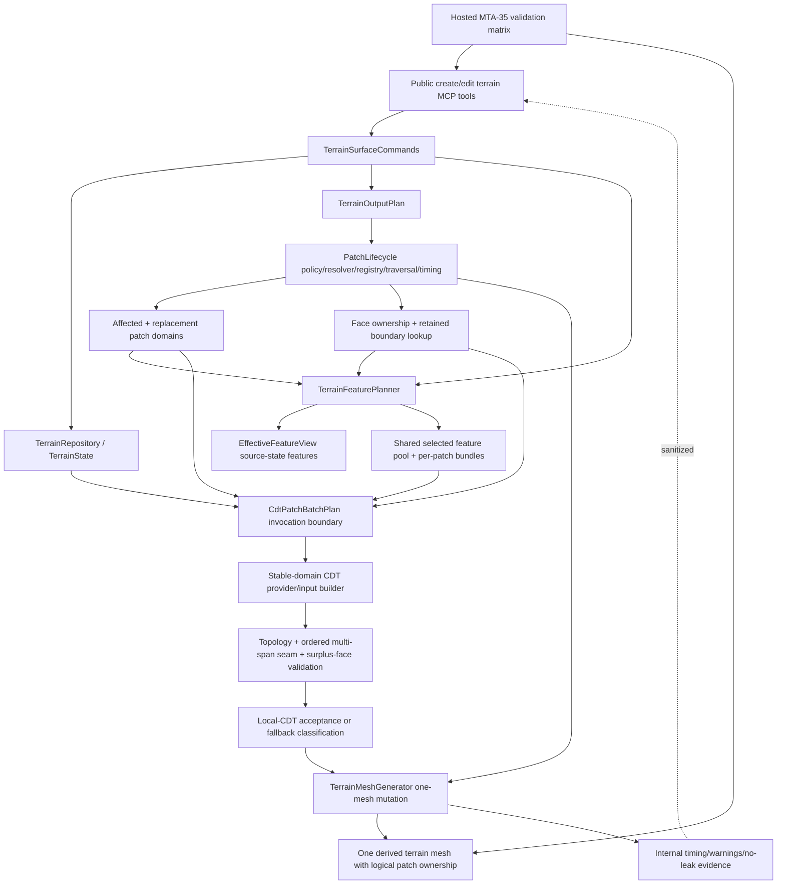

# Technical Plan: MTA-35 Implement CDT Replacement Provider On PatchLifecycle For Windowed Terrain Edits
**Task ID**: `MTA-35`
**Title**: `Implement CDT Replacement Provider On PatchLifecycle For Windowed Terrain Edits`
**Status**: `finalized-after-corrective-replanning`
**Date**: `2026-05-12`

## Source Task

- [Implement CDT Replacement Provider On PatchLifecycle For Windowed Terrain Edits](./task.md)

## Problem Summary

MTA-36 completed the reusable terrain patch lifecycle: stable logical patch IDs, dirty-window
mapping, conformance-ring expansion, registry persistence, face ownership, no-delete mutation
sequencing, timing, reload/readback, and one-mesh logical patch output. MTA-35 must not rebuild that
lifecycle.

MTA-35 implements the CDT-specific replacement provider on top of that substrate. Unlike adaptive
output, CDT cannot regenerate from terrain elevations alone. It must receive patch-relevant feature
intent as first-class constraints: corridor transitions, target-height pads and pressure regions,
planar-fit controls, survey points, fixed/protected/preserve zones, fairing context, and retained
boundary constraints.

MTA-32 and MTA-34 remain partial CDT evidence only. Their retained code may be mined, but accepted
MTA-35 behavior must meet the MTA-36 geometry bar: clean local cuts, correct stitching, no duplicate
edges, no stale faces, valid retained boundaries, and safe repeated edits inside one derived mesh.

## Goals

- Implement an internally gated stable-domain CDT replacement provider over MTA-36 `PatchLifecycle`.
- Keep `PatchLifecycle` as the only owner of patch identity, locality, registry, face ownership,
  no-delete mutation sequencing, timing, and readback.
- Adapt `TerrainFeaturePlanner` so feature intent is selected by `PatchLifecycle` affected,
  replacement, conformance, and retained-boundary relevance.
- Build CDT input from patch domains, patch-relevant feature geometry, terrain elevations, and
  retained boundary snapshots.
- Accept local CDT replacement only after topology, ordered multi-span seam, surplus-face, ownership,
  and mutation prevalidation pass.
- Route valid edits to fresh safe mesh generation when local CDT cannot be accepted.
- Preserve public terrain MCP request/response contracts and prevent leaks of CDT internals.
- Produce hosted SketchUp visual, save/reopen, repeated edit, fallback/no-delete, and timing evidence
  before any default-enable recommendation.

## Non-Goals

- Default-enable CDT terrain output.
- Add public backend selectors, patch controls, patch IDs, CDT diagnostics, seam diagnostics, or
  fallback enums.
- Rebuild the generic patch lifecycle proven by MTA-36.
- Treat MTA-32 or MTA-34 proof geometry as accepted product behavior without revalidation.
- Replace the public feature-intent model or add new public terrain edit modes.
- Implement native/C++ triangulation.
- Solve full seam-graph topology repair unless hosted fixtures prove ordered side-spans are
  insufficient.
- Add a full spatial index/cache unless timing evidence shows lookup or retained-boundary snapshot
  cost dominates.

## Related Context

- [Managed Terrain Surface Authoring HLD](specifications/hlds/hld-managed-terrain-surface-authoring.md)
- [CDT Terrain Output External Review](specifications/research/managed-terrain/cdt-terrain-output-external-review.md)
- [MTA-32 task](specifications/tasks/managed-terrain-surface-authoring/MTA-32-implement-patch-local-incremental-residual-cdt-proof/task.md)
- [MTA-33 task](specifications/tasks/managed-terrain-surface-authoring/MTA-33-filter-patch-relevant-feature-inputs-for-local-cdt-solves/task.md)
- [MTA-34 plan](specifications/tasks/managed-terrain-surface-authoring/MTA-34-integrate-windowed-cdt-replacement-into-managed-edit-operations/plan.md)
- [MTA-36 task](specifications/tasks/managed-terrain-surface-authoring/MTA-36-extract-reusable-patch-lifecycle-for-adaptive-terrain-output/task.md)

## Research Summary

- MTA-36 is the accepted positive baseline: generic `PatchLifecycle`, one derived mesh with logical
  patch ownership, bounded face-cavity mutation, no-delete prevalidation, registry persistence,
  reload/readback, save/reopen, undo, visual validation, timing, and public no-leak evidence.
- MTA-33 proved bounded feature relevance directionally, but its current API selects against one
  `selection_window`. MTA-35 must adapt it to batch selection over affected, replacement,
  conformance, and retained-boundary domains.
- MTA-32 is proof-only CDT evidence. Its dirty-window-derived domains and `debugMesh` handoff cannot
  become production replacement contracts.
- MTA-34 is closed-blocked. It retained useful provider/result/seam/mutation code, but hosted rows
  exposed bad nesting, stitching, duplicate edge, topology, material/layering, and seam-model gaps.
- Current code confirms the needed seam changes:
  `TerrainSurfaceCommands#adaptive_patch_policy_for` disables adaptive lifecycle when CDT is enabled;
  `PatchCdtReplacementProvider` still calls `PatchLocalCdtProof` with proof-era windows and
  `include_debug_mesh: true`; `PatchCdtReplacementResult` still accepts `debugMesh`; and
  `PatchCdtSeamValidator` rejects multiple neighbor spans per side.

## Technical Decisions

### Corrective Replanning Decisions

This plan was reopened after an implementation/Step 10 reread showed the first green local queue
proved only a partial dirty-replacement seam. The missing work was not limited to hosted validation:
initial CDT bootstrap, true batch feature planning, retained-boundary provider input, full provider
acceptance hardening, timing buckets, and repeated edit/readback proof were still incomplete.

- The implementation queue must start from the lowest missing lifecycle dependency, not from hosted
  SketchUp checks.
- A CDT-specific adapter layer is required, analogous in role to `adaptive_patches`, but it must only
  configure and consume `PatchLifecycle`. It may expose CDT policy/input/result helpers; it must not
  persist registry state, generate stable patch IDs outside `PatchLifecycle`, own face metadata, or
  sequence scene mutation.
- Initial create/rebuild bootstrap is a first-class implementation phase. Under the internal CDT
  gate, create/rebuild must emit one derived terrain mesh whose faces carry lifecycle-owned
  `cdtPatchId` ownership and whose owner registry is written through `PatchLifecycle` before dirty
  replacement can be accepted.
- Dirty replacement must consume the same bootstrap metadata and registry records that create/rebuild
  writes. Tests seeded only with handcrafted CDT faces are not sufficient acceptance evidence unless
  paired with a command/bootstrap path that produces the same metadata.
- Retained-boundary evidence must be captured before provider invocation from both expected
  PatchLifecycle neighbor domains and actual retained one-mesh faces. The same snapshot feeds
  provider input and post-solve seam validation; passing `retained_boundary_spans: []` is not an
  acceptable final implementation.
- `TerrainFeaturePlanner` needs an explicit internal batch-planning contract for CDT patch solves:
  shared selected source-feature pool, per-patch role-tagged bundles, derived feature geometry, and
  feature-selection digest. Reusing one generic `feature_context` hash as the batch contract is not
  sufficient.
- Provider acceptance must be a real gate, not only a wrapper around solver `status` and
  `topology.passed`. Accepted results must reject missing production mesh, duplicate triangles,
  duplicate/bad boundary edges, out-of-domain vertices/triangles, bad winding, stale or surplus
  retained faces, surplus replacement faces, seam gaps/overlaps, and seam Z mismatch above tolerance.
- Timing instrumentation is part of the local implementation queue. Command prep, feature selection,
  retained-boundary snapshot plus ownership lookup, CDT input build, solve, topology validation, seam
  validation, mutation, registry write, audit, fallback route, and total runtime must be captured
  internally before Step 10 closeout.
- Live SketchUp verification remains required, but it starts only after the corrected local queue,
  broad validation, and Step 10 code review pass. Running hosted checks against the partial path is
  explicitly not closeout evidence.

### Data Model

- `PatchLifecycle` remains the data owner for:
  - stable patch IDs and domains;
  - dirty-window to affected/replacement patch mapping;
  - conformance-ring expansion;
  - owner-attribute registry persistence;
  - face ownership and replacement batch metadata;
  - timing and reload/readback evidence.
- CDT provider state is invocation-scoped. Use a `CdtPatchBatchPlan`-style object containing
  affected patches, replacement patches, retained-boundary snapshots, shared selected source
  features, per-patch feature geometry bundles, provider results, local-CDT acceptance/fallback
  classification, warning/tolerance evidence, and timing.
- `CdtPatchBatchPlan` must not persist patch identity, registry records, or lifecycle state.
- `CdtPatchBatchPlan` must be assertable as an invocation-scoped value object: no registry write
  surface, no face-ownership authority, no stored raw mesh snapshots, and no patch identity
  generation.
- CDT-specific policy helpers may live in a CDT patch adapter namespace, but they must delegate
  identity, domain calculation, registry serialization, traversal, timing, and readback to
  `PatchLifecycle`.
- Stable `PatchLifecycle` patch IDs are the sole lookup/mutation identity. Old CDT domain digests may
  exist only as temporary audit correlation and must not drive replacement.
- PatchLifecycle may persist compact opaque provider fingerprints for stale/readback checks, such as
  source-state digest, feature-selection digest, provider policy fingerprint, replacement batch ID,
  and face counts. It must not persist raw feature geometry, raw CDT constraints, raw triangles, or
  raw seam vertices.

### Feature Selection And CDT Input

- Command/output-plan logic computes the lifecycle dirty window from the edit changed region plus any
  source feature affected/relevance windows that make output stale.
- PatchLifecycle maps that lifecycle dirty window to affected and replacement domains.
- Retained-boundary domains are neighboring non-replacement faces/patches bordering the replacement
  domain, backed by both expected registry/domain coverage and actual retained mesh snapshots.
- Retained-boundary snapshots are captured once before provider invocation and include expected
  neighbor patch IDs/domains, actual retained face ownership, ordered side spans, stale/surplus face
  evidence, and snapshot timing. Provider input and seam validation must consume this same snapshot.
- `TerrainFeaturePlanner` receives source terrain state, active/effective source feature intent,
  affected domains, replacement/conformance domains, retained-boundary domains/snapshots, the
  lifecycle dirty window, and configured feature safety margins.
- Feature inclusion must include features whose primitive, affected/relevance window, or semantic
  safety margin intersects the affected, replacement/conformance, or retained-boundary seam domain.
- Far unrelated features must be excluded even when globally active.
- Feature output is one shared selected source-feature pool plus per-patch role-tagged bundles with
  inclusion reasons such as affected, replacement, conformance, retained-boundary, and safety-margin.
- The internal batch API returns a structured plan, not only a flat `TerrainFeatureGeometry`: at
  minimum `selectedFeaturePool`, `patchFeatureBundles`, `featureGeometry`, `featureSelectionDigest`,
  included/excluded counts, and diagnostics.
- Inclusion-reason tags are part of the internal batch contract and must be testable; the same source
  feature may appear in multiple per-patch bundles by reference/ID, but derived geometry should not
  be recomputed or duplicated unless a patch-local clipped geometry variant is explicitly needed.
- `TerrainFeatureGeometryBuilder` remains the source for derived anchors, protected regions, pressure
  regions, reference segments, affected windows, tolerances, and limitations.
- Reference and boundary segments may be clipped for CDT input. Semantic controls such as anchors,
  survey controls, fixed/protected controls, and pressure regions keep source coordinates and source
  intent with local relevance tags.

### API and Interface Design

- Public MCP request and response contracts remain unchanged.
- Add internal CDT patch policy wiring that uses `PatchLifecycle::PatchGridPolicy` with CDT-specific
  prefixes/fingerprints instead of disabling lifecycle when CDT output is enabled.
- Add a small CDT patch adapter layer for policy and invocation-boundary objects. It is a
  capability-specific adapter over `PatchLifecycle`, not a separate lifecycle implementation.
- Add a domain-aware `TerrainFeaturePlanner` batch API. It should not perform triangulation-specific
  translation.
- Add a stable-domain CDT provider/input builder that receives:
  - replacement patch domain and batch domain from PatchLifecycle;
  - terrain state elevations;
  - retained neighbor/boundary snapshots from current one-mesh output;
  - patch-relevant feature geometry/context from TerrainFeaturePlanner;
  - provider budgets/tolerances and internal evidence controls.
- The CDT provider returns production mesh output, topology/seam/surplus validation results, timing,
  warnings/tolerance evidence, and local-CDT acceptance/fallback classification.
- Add a provider acceptance validator or equivalent provider-owned gate for duplicate geometry,
  winding, domain containment, surplus/stale retained evidence, and seam consistency before a result
  can be considered accepted.
- Command/output-plan logic owns fallback mesh routing. The CDT provider must not decide public
  command refusal.

### Public Contract Updates

Not applicable. Planned public deltas are none.

Implementation must still verify:

- native tool catalog schemas remain unchanged;
- dispatcher and command routing remain unchanged;
- public response shape remains unchanged;
- README/docs/examples remain unchanged unless a separate public contract task is created;
- public responses do not expose patch IDs, registry keys, feature bundle role names,
  retained-boundary diagnostics, topology categories, solver/fallback categories, timing buckets,
  raw vertices, raw triangles, or replacement batch IDs.

### Error Handling

- Valid heightmap edits must produce fresh derived mesh output.
- Local CDT replacement failure is an internal replacement-mode outcome, not public edit rejection.
- Local CDT replacement is accepted only after registry/ownership, retained-boundary, ordered
  multi-span seam, topology, surplus-face, and mutation prechecks pass.
- Local CDT failures route to safe full/adaptive/current mesh generation with internal
  warning/tolerance evidence.
- Old derived output must not be erased before accepted local CDT output or safe fallback output is
  ready.
- Public refusal is reserved for invalid requests, invalid feature intent, invalid/missing targets,
  or host conditions where no safe mesh generation path can complete without corrupting visible
  geometry.
- Public refusal for a valid heightmap edit must not be caused by local-CDT acceptance failure.
  Local-CDT failure routes to fallback mesh generation unless no safe mesh output path exists.
- Mutation exceptions after erase begins must bubble to the SketchUp operation boundary so rollback
  can protect the scene.

### State Management

- Terrain source state remains authoritative.
- CDT patch output is disposable derived state under the managed terrain owner.
- Registry persistence follows the MTA-36 JSON-string owner-attribute pattern under `su_mcp_terrain`.
- Registry/readback mismatch blocks local CDT acceptance and routes valid edits to safe fallback mesh
  generation.
- Create/rebuild and dirty replacement write registry records through the same `PatchLifecycle`
  registry store and read them back before accepting future dirty replacement.
- Repeated edits must use newly emitted face metadata, registry records, and source-state feature
  intent. They must not depend on stale pre-seeded fixture metadata.

### Integration Points

- `TerrainSurfaceCommands`: command orchestration, state save/load, operation boundary, feature
  planning invocation, output-plan/fallback routing, and public no-leak behavior.
- `TerrainOutputPlan`: dirty/full output intent plus resolved CDT patch lifecycle intents.
- `PatchLifecycle`: policy, resolver, registry, traversal, timing, face ownership, and readback.
- `TerrainFeaturePlanner`: source-state feature relevance and derived geometry bundles per
  PatchLifecycle domain.
- CDT provider/input builder: triangulation input assembly, production mesh handoff, topology,
  ordered multi-span seam, surplus-face, and acceptance/fallback classification.
- `TerrainMeshGenerator`: one-mesh CDT bootstrap/replacement mutation using MTA-36-style no-delete
  cavity mechanics.
- Hosted MTA-35 validation: real SketchUp face lifecycle, metadata persistence, retained-boundary
  snapshots, undo, save/reopen, visual quality, and timing.

### Configuration

- CDT replacement remains internally gated and disabled by default.
- Patch size, conformance ring, feature safety margins, seam tolerances, solver budgets, and timing
  buckets must be centralized and test-visible.
- Calibration is hosted-gated. Hard-coding provider-local constants is not acceptable.

## Architecture Context

## Key Relationships

- PatchLifecycle owns where replacement can occur.
- TerrainFeaturePlanner owns which source feature intent matters for those domains.
- CDT provider owns how selected constraints and terrain elevations become accepted local CDT mesh.
- Command/output-plan logic owns whether valid edits route to accepted local CDT or safe fallback
  mesh generation.
- TerrainMeshGenerator owns mutation of the one derived terrain mesh.

## Acceptance Criteria

- Internal CDT mode uses MTA-36 PatchLifecycle for patch IDs, dirty-window mapping, conformance
  expansion, registry, face ownership, no-delete mutation sequencing, timing, and readback.
- CDT output is one derived mesh with logical patch ownership on faces.
- Initial create/rebuild under the internal CDT gate emits lifecycle-owned CDT patch metadata and
  registry records before any dirty replacement acceptance can be claimed.
- Dirty edits map to affected/replacement CDT patch domains while unaffected neighbor domains remain
  outside replacement.
- Feature intent selection excludes far unrelated features and includes nearby corridor,
  target-height/pressure, fairing, planar, survey, fixed/protected/preserve, and retained-boundary
  controls when they affect replacement or retained seams.
- PatchLifecycle receives lifecycle windows/domains and compact provider fingerprints only; raw
  feature geometry flows from TerrainFeaturePlanner to the CDT provider.
- CDT provider input combines patch domains, terrain elevations, retained boundary snapshots, and
  patch-relevant feature geometry before triangulation.
- Local CDT replacement is accepted only after production mesh handoff, stable patch ownership,
  topology, ordered multi-span seam evidence, surplus-face checks, duplicate geometry checks,
  out-of-domain checks, winding checks, retained-boundary freshness checks, and mutation
  prevalidation pass.
- Valid edits still emit fresh derived mesh when local CDT is declined, with old output preserved
  until safe fallback output is ready.
- Repeated overlapping edits and save/reopen follow-up reuse or safely invalidate registry and face
  metadata.
- Public responses and public schemas remain unchanged and leak no CDT internals.
- Hosted rows cover corridor crossing patch boundaries, target-height pad with pressure/smoothing,
  fairing near prior intent, planar fit in overlapping patches, survey correction near retained
  boundary, preserve/protected zone near replacement, repeated edits, save/reopen follow-up,
  fallback/no-delete, ordered multi-span seam evidence, nonplanar retained-boundary multi-span
  behavior, registry invalidation after save/reopen, and performance comparison.
- Accepted local-CDT rows have no near-full-grid output, bad nesting, duplicate layered output,
  stale faces, duplicate edges, bad stitching, out-of-domain triangles, surplus retained faces, or
  seam Z mismatch beyond tolerance.
- Structural blocker rows prove that duplicate boundary edges, stale/surplus retained faces, seam
  gaps/overlaps above tolerance, and seam Z mismatch above configured tolerance block local-CDT
  acceptance while valid edits still generate fallback mesh.

## Test Strategy

### TDD Approach

1. Start with no-leak contract guards and stale-plan regression tests for public response shape.
2. Add CDT PatchLifecycle adapter/policy/resolver/traversal/registry tests before provider work.
3. Add create/rebuild bootstrap tests proving one-mesh CDT ownership and registry writeback.
4. Add retained-boundary snapshot tests before provider input tests.
5. Add domain-aware feature batch-planning tests before triangulation input assembly.
6. Add CDT input builder/provider acceptance tests using production mesh handoff, retained-boundary
   snapshots, and ordered multi-span seam evidence.
7. Add command integration tests for valid-edit fallback mesh generation and no-delete sequencing.
8. Add one-mesh mutation tests for dirty replacement, repeated edit, local registry readback, and
   registry update.
9. Add timing evidence tests before Step 10 closeout.
10. Finish with hosted feature-rich matrix, save/reopen, fallback/no-delete, and timing comparison.

### Required Test Coverage

- Unit:
  - CDT PatchLifecycle policy/resolver/traversal/registry adapter uses stable CDT patch IDs.
  - Dirty windows map to affected/replacement domains with conformance ring.
  - CDT create/rebuild bootstrap maps produced faces to lifecycle patch domains and writes registry
    records through `PatchLifecycle`.
  - Retained-boundary snapshot builder combines expected lifecycle neighbors with actual retained
    face spans and rejects stale/surplus retained evidence.
  - TerrainFeaturePlanner selects per PatchLifecycle domain and excludes far unrelated features.
  - Batch feature planning returns shared selected source pool plus per-patch role-tagged bundles.
  - Batch feature planning exposes feature-selection digest, included/excluded counts, and inclusion
    reasons without recomputing shared derived geometry unnecessarily.
  - Feature clipping preserves anchors, survey controls, fixed/protected controls, and pressure
    semantics.
  - Feature clipping tests prove survey-control semantics remain source-anchored while only
    reference/boundary geometry is clipped for CDT input.
  - `CdtPatchBatchPlan` has no registry write surface, face-ownership authority, patch ID generation,
    or persisted lifecycle state.
  - Ordered multi-span seam evidence rejects gaps, overlaps, duplicate boundary edges, stale/surplus
    retained faces, bad ordering, and Z mismatch above tolerance.
  - Existing one-span seam comparison code is wrapped or replaced so one-span assumptions cannot
    satisfy ordered multi-span evidence.
  - Provider declines local CDT acceptance for missing production mesh, duplicate triangles/edges,
    out-of-domain vertices, bad winding, bad seam spans, and surplus retained faces.
  - Timing buckets are populated for command prep, feature selection, retained snapshot/ownership
    lookup, CDT input build, solve, topology validation, seam validation, mutation, registry write,
    audit, fallback route, and total runtime.
- Integration:
  - Command create/bootstrap emits one CDT patch mesh and registry under internal gate.
  - Dirty edit resolves affected/replacement patches, builds per-patch feature geometry, validates
    all replacements, mutates one mesh, and updates only affected registry records.
  - Bootstrap or provider failure for a valid create/edit routes to fresh supported mesh output when
    safe, not public edit rejection.
  - Retained-boundary expected coverage and actual mesh mismatch blocks local CDT acceptance while
    valid edits still generate fallback mesh.
  - Repeated overlapping edits use new face metadata, registry readback, and source-state feature
    intent.
  - Public response shape remains unchanged.
- Hosted:
  - Feature-rich rows listed in acceptance criteria.
  - Fallback/no-delete row proving old output remains until safe output is ready.
  - Ordered multi-span retained-boundary row.
  - Nonplanar retained-boundary row that forces more than one ordered span per side.
  - Structural blocker rows proving bad CDT output blocks local-CDT acceptance while valid edits still
    generate mesh.
  - Save/reopen plus follow-up edit, including a registry invalidation path.
  - Local CDT timing versus full CDT/adaptive fallback.

## Instrumentation and Operational Signals

- Internal timing buckets: command prep, feature selection, CDT input build, solve,
  retained-boundary snapshot plus registry lookup, topology validation, seam validation, mutation,
  registry write, audit, and total runtime.
- Internal counts: affected patches, replacement patches, retained-boundary spans, selected features,
  excluded features, per-patch face counts, surplus faces, duplicate edges/faces, fallback route, and
  local-CDT acceptance category.
- Internal warnings: solver budget, simplification/tolerance, topology, seam, retained-boundary
  mismatch, registry/readback mismatch, and fallback generation.
- Public evidence remains sanitized and excludes internal CDT vocabulary.

## Implementation Phases

0. **Corrective Metadata And Drift Repair**
   - Keep task status and `summary.md` honest: partial implementation, with more missing than
     hosted verification.
   - Record that live SketchUp checks are paused until the corrected local queue and Step 10 review
     complete.
   - Update the implementation queue so tests cannot pass by exercising only handcrafted dirty
     replacement fixtures.

1. **No-Leak Guards And Retained CDT Audit Tests**
   - Expand contract tests for new internal vocabulary.
   - Add tests proving `PatchCdtDomain`, `cdtPatchDomainDigest`, and `debugMesh` are not production
     identity/handoff mechanisms.
   - Add failing tests for old one-span seam assumptions.

2. **CDT PatchLifecycle Adapter And Bootstrap**
   - Add CDT-specific PatchLifecycle policy/wiring without creating a second lifecycle.
   - Add the CDT patch adapter objects needed to configure policy and carry invocation data while
     delegating identity, registry, traversal, timing, and readback to `PatchLifecycle`.
   - Wire command/output-plan paths so CDT internal mode uses PatchLifecycle domains, registry, and
     traversal.
   - Generate internally gated CDT create/rebuild output as one derived mesh with logical patch
     ownership and registry writeback.
   - Keep current public tools unchanged.

3. **Retained-Boundary Snapshot**
   - Capture expected retained neighbor domains from PatchLifecycle resolution and actual retained
     face spans from the one-mesh output before provider invocation.
   - Reject stale/surplus retained faces, missing expected retained coverage, duplicate boundary
     edges, span gaps/overlaps, and ownership/readback mismatches.
   - Pass the snapshot into both `CdtPatchBatchPlan` and seam validation.

4. **Domain-Aware Feature Planning**
   - Add batch feature planning over affected, replacement/conformance, and retained-boundary domains.
   - Return shared selected source pool plus per-patch role-tagged bundles and derived geometry.
   - Include feature-selection digest, included/excluded counts, and inclusion reasons.
   - Prove far unrelated features are excluded and nearby controls are included, including controls
     whose relevance comes only through retained-boundary or safety-margin domains.

5. **Stable-Domain CDT Provider And Batch Plan**
   - Add invocation-scoped `CdtPatchBatchPlan`-style boundary.
   - Assert the batch plan cannot write registry data, generate patch IDs, own face metadata, or
     persist lifecycle state.
   - Build CDT inputs from patch domains, retained snapshots, elevations, and feature bundles.
   - Require production mesh handoff, provider timing, local-CDT acceptance/fallback classification,
     and acceptance validation for duplicate geometry, winding, domain containment, stale/surplus
     retained faces, and surplus replacement faces.

6. **One-Mesh Dirty Replacement Mutation**
   - Prevalidate all affected/replacement patches before erase.
   - Mutate affected faces and update registry/metadata using MTA-36-style cavity mechanics.
   - Prove the dirty path uses metadata emitted by CDT bootstrap or prior CDT replacement, not only
     handcrafted fixture metadata.

7. **Topology, Seam, Surplus, Fallback, And Timing Hardening**
   - Implement ordered multi-span seam evidence.
   - Add surplus-face, duplicate-edge, stale-face, bad-winding, and out-of-domain checks.
   - Route valid local-CDT failures to fresh fallback mesh generation.
   - Populate required timing buckets and internal warning/count evidence without public leaks.

8. **Repeated Edit, Readback, Step 10, And Hosted Validation**
   - Prove repeated local edits reuse newly emitted face metadata and registry readback.
   - Run broad local validation and Step 10 `grok-4.3` code review after the corrected local queue.
   - Run feature-rich hosted matrix, repeated edits, save/reopen follow-up, fallback/no-delete,
     nonplanar multi-span seam row, registry invalidation row, structural blocker rows, and timing
     comparison.
   - Record default-enable blocker or split tasks for solver/topology/seam/index performance issues.

## Rollout Approach

- Keep CDT replacement internally gated and disabled by default.
- Keep current/adaptive output as the supported user-facing path and fallback.
- Do not publish CDT controls or diagnostics.
- Treat hosted correctness and timing as blockers for any future default-enable task.
- Split follow-up work if full seam graph repair, CDT solver repair, or spatial indexing is required.

## Risks and Controls

- Retained CDT code emits bad topology or duplicate edges: local-CDT acceptance gates block the row;
  valid edits generate fallback mesh; solver/topology repair splits if representative rows fail.
- Feature relevance misses retained-boundary controls: batch selection tests must include retained
  boundary, conformance, and safety-margin inclusion reasons before provider integration.
- Local CDT is slower after feature/seam validation: timing records a default-enable blocker instead
  of weakening correctness.
- Retained-boundary snapshot plus registry lookup dominates runtime: timing records an
  index/cache/provider-optimization split trigger instead of hiding the cost in total runtime.
- Ordered multi-span seam evidence is insufficient: full seam graph/topology repair becomes a split
  trigger.
- Batch plan becomes a second lifecycle: it remains invocation-scoped; PatchLifecycle is the only
  persistent patch identity and registry owner.
- CDT adapter layer drifts into a second lifecycle: adapter tests must prove it only configures and
  consumes `PatchLifecycle`, and owns no registry persistence, patch identity generation, traversal,
  timing, readback, or mutation sequencing.
- Bootstrap remains missing while dirty replacement passes fixture tests: command integration tests
  must create CDT patch output and then dirty-replace it using produced metadata.
- Dual identity drift returns through old digests: stable PatchLifecycle patch IDs drive lookup and
  mutation; old digests are audit-only or removed.
- Retained-boundary spans are used only after solve: provider input tests must fail when the batch
  plan lacks retained-boundary snapshots.
- Valid edits regress to public rejection: generation-routing tests require fresh fallback mesh for
  valid edits.
- Public response leaks internal CDT vocabulary: expanded no-leak contract tests guard all new
  internal terms.
- SketchUp doubles hide host failures: hosted rows must prove face ownership, retained snapshots,
  undo, save/reopen, orphan edge cleanup, duplicate edge cleanup, and seam Z behavior.

## Dependencies

- MTA-36 PatchLifecycle code and hosted evidence.
- MTA-33 feature intent semantics and existing feature geometry builder.
- Retained MTA-32/MTA-34 CDT code as audit-only implementation material.
- Current terrain command save/edit flow and current/adaptive output fallback.
- SketchUp hosted validation access.

## Premortem Gate

Status: WARN

### Unresolved Tigers

- No blocking planning Tigers remain after the corrective pass, but implementation is not complete
  and live SketchUp verification is intentionally paused until the corrected local queue is done.

### Plan Changes Caused By Premortem

- Added explicit `CdtPatchBatchPlan` guardrails so the batch plan cannot become a hidden lifecycle.
- Added negative structural gates for duplicate boundary edges, stale/surplus retained faces,
  seam gaps/overlaps, and seam Z mismatch.
- Added hosted rows for nonplanar ordered multi-span retained boundaries and registry invalidation
  after save/reopen plus follow-up edit.
- Added retained-boundary snapshot plus registry lookup as its own timing bucket and split trigger.
- Tightened valid-edit routing so public refusal cannot be caused by local-CDT acceptance failure.
- Corrective replanning added explicit CDT adapter-layer constraints, made create/rebuild bootstrap
  a prerequisite for dirty replacement acceptance, required retained-boundary snapshots to feed
  provider input, made provider acceptance checks concrete, and moved timing/readback into the local
  queue before Step 10/hosted validation.

### Accepted Residual Risks

- Risk: ordered side-span seam evidence may be insufficient for representative retained boundaries.
  - Class: Elephant
  - Why accepted: MTA-35 requires ordered multi-span evidence and blocks one-span acceptance; full
    seam graph repair is intentionally split unless hosted fixtures prove it is necessary.
  - Required validation: hosted nonplanar multi-span row plus structural seam checks.
- Risk: retained CDT solver/provider code may need topology repair.
  - Class: Elephant
  - Why accepted: local-CDT acceptance gates block bad output and valid edits still generate fallback
    mesh; solver repair can split without corrupting user-visible terrain.
  - Required validation: feature-rich provider tests and hosted structural blocker rows.
- Risk: retained-boundary snapshot/registry lookup may erase locality performance.
  - Class: Paper Tiger
  - Why accepted: timing has a dedicated bucket and performance failure records a default-enable
    blocker or index/cache split rather than weakening correctness.
  - Required validation: hosted timing comparison after all correctness gates run.

### Carried Validation Items

- Feature-rich hosted matrix covering corridor, target-height/pressure, fairing, planar, survey,
  preserve/protected, repeated edit, save/reopen, fallback/no-delete, and performance rows.
- Nonplanar ordered multi-span retained-boundary hosted row.
- Registry readback or safe invalidation after save/reopen plus follow-up edit.
- Structural blocker rows for near-full-grid output, duplicate edges, bad stitching, stale faces,
  surplus retained faces, out-of-domain triangles, and seam mismatch.
- No-leak contract tests for all new CDT internal vocabulary.
- Corrected local implementation queue, broad validation, and Step 10 `grok-4.3` review before live
  SketchUp verification.

### Implementation Guardrails

- Do not rebuild or fork PatchLifecycle.
- Do not pass raw feature geometry into PatchLifecycle.
- Do not use `PatchCdtDomain`, `cdtPatchDomainDigest`, or `debugMesh` as production identity or
  production mesh handoff.
- Do not accept one-span retained-boundary evidence for hosted local-CDT acceptance.
- Do not erase old derived output before accepted local CDT or safe fallback output is ready.
- Do not reject valid heightmap edits because local CDT replacement cannot be accepted.
- Do not expose CDT patch, registry, feature-selection, topology, seam, fallback, timing, or raw mesh
  internals publicly.
- Do not run or claim live SketchUp closeout evidence until bootstrap, retained-boundary provider
  input, domain-aware feature batch planning, provider acceptance hardening, timing, and local
  repeated edit/readback proof are implemented.

## Quality Checks

- [x] All required inputs validated
- [x] Problem statement documented
- [x] Goals and non-goals documented
- [x] Research summary documented
- [x] Technical decisions included
- [x] Architecture context included
- [x] Acceptance criteria included
- [x] Test requirements specified
- [x] Instrumentation and operational signals defined when needed
- [x] Risks and dependencies documented
- [x] Rollout approach documented when needed
- [x] Small reversible phases defined
- [x] Premortem completed with falsifiable failure paths and mitigations
- [x] Planning-stage size estimate considered before premortem finalization
