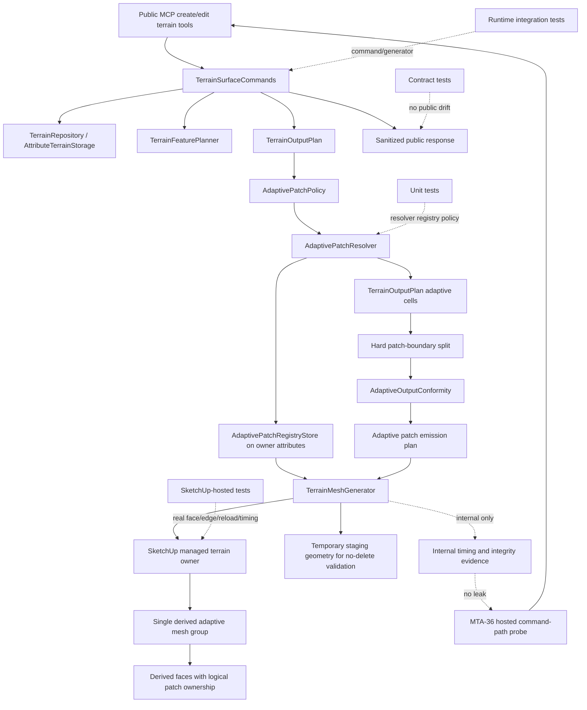

# Technical Plan: MTA-36 Productize Windowed Adaptive Patch Output Lifecycle For Fast Local Terrain Edits
**Task ID**: `MTA-36`
**Title**: `Productize Windowed Adaptive Patch Output Lifecycle For Fast Local Terrain Edits`
**Status**: `completed`
**Date**: `2026-05-11`
**Amended**: `2026-05-12`

## Source Task

- [MTA-36 Productize Windowed Adaptive Patch Output Lifecycle For Fast Local Terrain Edits](./task.md)

## Problem Summary

Current adaptive terrain output is the active compact production output path, but adaptive edit
regeneration still erases and rebuilds all derived output. Regular-grid output has a local
dirty-cell replacement path, but that path is not the production target for detailed terrain.
MTA-36 must prove the windowed output lifecycle on adaptive output before MTA-35 reintroduces CDT
solver and seam complexity.

The implementation must establish stable patch ownership, dirty-window-to-patch mapping,
no-delete mutation sequencing, repeated metadata reuse, fallback/refusal behavior, hosted timing,
undo, and reload/readback or safe invalidation without changing public MCP terrain contracts.

The first implementation pass used one SketchUp group per stable adaptive patch. Hosted rows proved
the lifecycle and numeric stitching, but this is not the final geometry shape MTA-35/CDT should
inherit. Separate patch groups do not share SketchUp edge/vertex topology, make cross-patch
simplification awkward, and can preserve surplus faces at logical patch boundaries. This plan is
therefore amended before final acceptance: MTA-36 must keep stable logical patches while emitting
accepted terrain output as one derived mesh container.

## Goals

- Add an internal windowed adaptive replacement lifecycle for local terrain edits.
- Partition adaptive output under stable owner-local patch ownership independent of dirty edit
  windows and transient adaptive cell splits.
- Preserve unaffected adaptive output during local edits.
- Emit production terrain as one derived mesh container with logical patch ownership on faces,
  rather than as persistent per-patch geometry islands.
- Replace affected logical patches through validated face-cavity mutation inside that one mesh
  context.
- Keep terrain source state authoritative and derived patch output disposable.
- Avoid broad retained-face metadata rewrites; write metadata only to newly emitted/affected output
  and compact registry/mesh records.
- Produce hosted command-path proof with real SketchUp entity lifecycle, timing, undo, reload, and
  visual validation.
- Leave a reusable lifecycle substrate for MTA-35 while keeping CDT-specific solver and feature
  semantics out of MTA-36.

## Non-Goals

- Implement CDT, constrained Delaunay, residual CDT solving, CDT seams, or CDT topology validation.
- Default-enable a new backend selector or expose patch controls publicly.
- Persist adaptive cells, raw mesh vertices, raw triangles, or patch registry data as terrain
  source state.
- Add a full spatial index/store before timing proves lightweight registry/face lookup loses
  locality.
- Treat toy fixtures, sidecar-only probes, fallback-only evidence, or patch-group-only output as
  acceptance proof.

## Related Context

- [Managed Terrain Surface Authoring HLD](specifications/hlds/hld-managed-terrain-surface-authoring.md)
- [Managed Terrain Surface Authoring PRD](specifications/prds/prd-managed-terrain-surface-authoring.md)
- [Domain analysis](specifications/domain-analysis.md)
- [MTA-10 dirty-window partial terrain replacement](specifications/tasks/managed-terrain-surface-authoring/MTA-10-optimize-output-regeneration-with-dirty-region-replacement/summary.md)
- [MTA-21 adaptive conformance baseline](specifications/tasks/managed-terrain-surface-authoring/MTA-21-implement-adaptive-terrain-tin-output-with-boundary-conformance/summary.md)
- [MTA-22 adaptive regression fixture pack](specifications/tasks/managed-terrain-surface-authoring/MTA-22-capture-adaptive-terrain-regression-fixture-pack/task.md)
- [MTA-23 adaptive backend prototype](specifications/tasks/managed-terrain-surface-authoring/MTA-23-prototype-adaptive-simplification-backend-with-grey-box-sketchup-probes/summary.md)
- [MTA-34 retained replacement infrastructure](specifications/tasks/managed-terrain-surface-authoring/MTA-34-implement-cdt-patch-replacement-and-seam-validation/summary.md)
- [MTA-35 cached CDT patch lifecycle plan](specifications/tasks/managed-terrain-surface-authoring/MTA-35-productize-cached-cdt-patch-output-lifecycle-for-windowed-terrain-edits/plan.md)

## Research Summary

- MTA-10 proved local output mutation can provide meaningful speedups, but also exposed the
  critical performance failure mode: rewriting all retained face digest/revision metadata on every
  edit destroys locality. MTA-36 must write bounded metadata only on newly emitted or affected
  output.
- MTA-21 established adaptive conformance via `AdaptiveOutputConformity`, but it is global today
  and does not provide stable patch ownership.
- MTA-22 and MTA-23 provide adaptive fixture and hosted evidence patterns. They do not prove
  command-path local replacement.
- MTA-34 retained useful no-delete/fallback/replacement patterns, but stable patch bootstrap and
  repeated-edit lifecycle were missing.
- MTA-35 planning provides transferable lifecycle decisions: fixed owner-local patch lattice,
  compact derived registry, batch prevalidation, no-delete mutation, reload/readback or safe
  invalidation, timing buckets, and spatial-index deferral. MTA-36 must not import CDT solver,
  topology, seam, or per-patch feature-intent requirements.
- Current code has flat derived-output discovery under `owner.entities`; single-mesh output
  requires explicit mesh-aware traversal for full erase, affected-face lookup, cavity integrity, and
  cleanup.
- Current adaptive planning is global. Read-only probes showed planning cost is modest for medium
  synthetic terrain but measurable at larger sizes. The first implementation may use global
  adaptive planning plus patch-filtered mutation only as a validation phase with timing gates.
- Live context terrain inspected through SketchUp MCP was about `45m x 84m`, `69 x 128` samples,
  and `68 x 127` output cells. Future denser terrain at the same physical magnitude may have tens
  of thousands of cells. Hosted validation must include at least some real-work-magnitude rows,
  not only tiny fixtures.

## Technical Decisions

### Data Model

- Terrain state remains authoritative source state.
- Adaptive patch registry and patch output are disposable derived output state under the managed
  terrain owner.
- Stable patch identity uses deterministic owner-local output-cell lattice coordinates and policy
  version. Dirty windows select stable patches; they never define persistent patch identity.
- Adaptive patch boundaries are hard adaptive split boundaries before conformance.
- Patch policy must include an output-policy fingerprint covering schema version, patch size,
  hard-boundary behavior, conformance-band policy, and adaptive metadata schema.
- Output is represented with logical ownership inside one geometry container:
  - the managed terrain owner contains one derived terrain mesh group for accepted adaptive output;
  - compact owner registry records patch status, bounds, freshness, and face counts;
  - the derived mesh group carries output-level metadata such as output kind, state digest/revision,
    replacement batch, and output-policy fingerprint;
  - every newly emitted adaptive face carries derived marker, adaptive output kind/schema, stable
    patch id, patch-local face index, state digest, and output-policy fingerprint.
- Terrain digest/revision and replacement batch are stored on compact registry/mesh records and
  newly emitted faces, not rewritten across retained faces.
- Persistent one-group-per-patch output is no longer an acceptance shape. Temporary staging groups
  are allowed for prevalidation, but successful output must commit into the single mesh group.
- Registry entries store only compact data: schema, output-policy fingerprint, patch id/lattice
  bounds, output bounds, state digest/revision, owner transform signature, replacement batch,
  face count, status, and compact timing/audit counters. They must not store raw cells, vertices,
  triangles, full meshes, or feature geometry.

### API and Interface Design

- Public MCP request and response contracts remain unchanged.
- Add internal adaptive lifecycle seams:
  - `AdaptivePatchPolicy` for schema, patch-size candidates, hard-boundary policy, conformance
    policy, output-policy fingerprint, and timing/compactness gates;
  - `AdaptivePatchResolver` for final output-window to affected patch mapping, ownership domains,
    and conformance/rebuild domains;
  - `AdaptivePatchRegistryStore` for owner-attribute registry read/write/versioning/invalidation;
  - an adaptive logical-patch emission/mutation helper consumed by `TerrainMeshGenerator`.
- `TerrainSurfaceCommands` remains responsible for state load/save, operation boundary, feature
  window reconciliation, and response assembly. It should pass the final `TerrainOutputPlan` and
  saved state to the generator; it should not own patch lattice policy.
- `TerrainOutputPlan` remains an internal full/dirty output descriptor and adaptive cell source.
  Its public summary must not expose patch ids, dirty windows, registry data, adaptive cells, or
  timing buckets.
- `TerrainFeaturePlanner` remains upstream reconciliation only for adaptive output. MTA-36 adaptive
  replacement must not require per-patch feature selection, feature geometry, or feature digests.
- `TerrainMeshGenerator` remains the SketchUp mutation boundary. It consumes resolved patch plans,
  validates affected output, selects affected faces inside the single mesh group, performs bounded
  cavity replacement, cleans orphan edges, and updates only affected registry entries.
- Traversal must be purpose-specific:
  - full erase handles the single derived mesh group and any temporary staging output;
  - affected lookup selects faces whose logical patch ownership is in the replacement set;
  - affected integrity inspects target faces plus boundary edges, not unrelated output metadata;
  - cleanup operates inside the single mesh group after cavity mutation and must not rewrite
    retained faces broadly.

### Single-Mesh Cavity Replacement Algorithm

1. Resolve the dirty output window to affected logical patches and replacement/conformance patches.
2. Build replacement adaptive cells only for the replacement domain plus planning context.
3. Emit replacement geometry into a temporary staging group or structured in-memory plan.
4. Validate staging output before touching accepted output:
   - every replacement face has logical patch ownership;
   - face counts and patch-local face indexes are complete;
   - replacement boundary vertices use exact terrain-state coordinates;
   - no unsupported entities are present.
5. Locate affected accepted faces in the single derived mesh group by face-level patch ownership.
6. Validate cavity boundary:
   - retained neighbor faces are identifiable;
   - retained boundary coordinates match the replacement boundary within tolerance;
   - no unsupported non-derived children or corrupted ownership are present.
7. Start one SketchUp operation commit:
   - delete only affected accepted faces;
   - clean orphan internal edges that no longer belong to any face;
   - emit replacement faces into the same mesh group;
   - apply face metadata and hidden/soft/smooth edge treatment;
   - update the compact registry for affected patches.
8. Audit the committed mesh:
   - no duplicate layered faces in the cavity;
   - internal seam segments have matching retained/replacement coverage;
   - no duplicate seam edges or Z mismatches;
   - no orphan derived edges remain in the affected bounds.
9. If prevalidation fails, preserve old output and return sanitized refusal or full rebuild. If
   mutation fails after erase begins, raise through the SketchUp operation boundary so host rollback
   protects the model.

### Public Contract Updates

Not applicable. Planned public deltas are none.

Implementation must still verify:

- `create_terrain_surface` and `edit_terrain_surface` public request schemas remain unchanged.
- Dispatcher routes and runtime tool catalog behavior remain unchanged.
- Public responses do not expose patch ids, registry internals, adaptive cells, raw triangles,
  fallback enums, dirty windows, internal timing buckets, or adaptive lifecycle vocabulary.
- README/docs/examples do not need public usage changes unless implementation unexpectedly changes
  public behavior.

### Error Handling

- Resolve patch policy, dirty window, registry state, unsupported children, affected ownership, and
  replacement output before erasing old output.
- Build and validate all affected patch output as a batch. Do not mutate patch-by-patch with a
  partial commit pattern.
- If prevalidation fails before mutation, preserve old output and route to sanitized refusal or safe
  full adaptive regeneration.
- If terrain state has already been saved and local adaptive replacement cannot safely complete,
  regenerate full adaptive output for the saved state or abort/refuse before claiming derived output
  freshness.
- If mutation raises after erase begins, bubble the exception to the SketchUp operation boundary so
  host rollback can protect the scene.
- Unsupported child entities under the managed terrain owner refuse or fall back before deletion.
- Registry or ownership corruption invalidates local replacement and routes to safe full adaptive
  regeneration/refusal.

### State Management

- Registry statuses remain small and internal, such as `valid`, `stale`, `rebuilt`, and
  `failed_integrity`.
- Full adaptive rebuild may bootstrap or refresh all patch registry entries.
- Local adaptive replacement updates only affected registry records and newly emitted face
  metadata.
- Reload/readback can reuse registry entries only when output-policy fingerprint, state
  digest/revision, owner transform signature, derived mesh identity, expected face counts, and
  patch-local face index completeness all match.
- Reload mismatch invalidates local replacement and routes future edits to full adaptive
  regeneration or sanitized refusal.

### Integration Points

- `TerrainSurfaceCommands`: command orchestration, state save/load, operation boundary, response
  assembly, and final output-window plan creation.
- `TerrainOutputPlan`: adaptive cell plan source and internal dirty/full intent.
- `AdaptiveOutputConformity`: conforming adaptive emission triangles.
- `TerrainMeshGenerator`: SketchUp mutation, derived mesh/face emission, cavity replacement,
  cleanup, and registry update.
- `AttributeTerrainStorage` and `TerrainRepository`: existing terrain state and owner transform
  persistence boundary.
- MTA-22 fixtures and MTA-23/MTA-24 probe patterns: hosted evidence inputs and schema patterns.

### Configuration

- Patch-size candidates are centralized in `AdaptivePatchPolicy`.
- Planned comparison matrix uses smaller/larger aligned power-of-two patch sizes, expected to start
  with `16` and `32` output cells, with smaller values such as `8` allowed for unit compactness
  probes when needed.
- Hosted evidence must report patch cell size and physical patch size in meters.
- Initial global adaptive planning plus local mutation is only a validation baseline. The
  implementation must use patch-local planning/conformance when planning cost dominates
  user-visible runtime.
- Performance gate:
  - target roughly `2x` total command-path speedup over current full adaptive regeneration when
    full regeneration latency is user-visible;
  - if both full and local paths are around or below `100-200ms`, missing the `2x` ratio is not a
    blocker by itself;
  - if full regeneration is above that responsiveness floor and local replacement is not roughly
    `2x` faster, add patch-local planning/conformance or record a performance finding before
    claiming reusable locality.
- Defer spatial index/store unless hosted timing shows lookup/integrity traversal dominates.

## Architecture Context

## Key Relationships

- Public MCP remains the outer contract; adaptive patch lifecycle remains internal.
- Terrain source state and adaptive patch registry are intentionally separate.
- The stable patch lifecycle is reusable by MTA-35; adaptive cells, adaptive-specific planning
  heuristics, and adaptive no-feature-intent behavior are not CDT lifecycle contracts.
- Hosted validation is required because SketchUp group/face/edge lifecycle, hidden edge cleanup,
  undo, reload, and attribute write costs cannot be proven by local doubles alone.

## Acceptance Criteria

- Adaptive create/full rebuild emits one accepted derived mesh group under stable deterministic
  logical patch ownership that is independent of dirty edit windows and transient adaptive cell
  splits.
- Patch ownership can be traced from registry to each newly emitted adaptive face using bounded
  adaptive metadata only; persistent per-patch SketchUp groups are not the accepted final topology.
- Local edits map the final reconciled dirty output window through output-cell overlap to affected
  stable patches, including patch-interior, patch-boundary, and patch-corner cases.
- Stable patch boundaries are enforced as adaptive split boundaries before conformance.
- Initial conformance calculation uses affected patches plus one immediate neighbor ring; tests
  prove after hard-boundary splitting that affected boundary emission depends only on affected plus
  immediate-ring cells, or the implementation expands the band/records a blocker.
- Local replacement builds and validates all affected replacement output, cavity boundary state,
  registry updates, and ownership integrity before accepted output is erased.
- Successful local replacement deletes and re-emits only affected faces inside the single mesh
  group; unaffected faces are not rewritten, rescanned broadly, or retagged.
- Single-mesh cavity replacement leaves no orphan internal edges, duplicate seam edges, duplicate
  layered faces, or Z-discontinuous logical patch seams.
- Repeated same-patch and adjacent-patch edits use newly emitted metadata from the prior edit.
- Failure in ownership lookup, registry validation, unsupported-child checks, conformance
  validation, replacement output validation, cavity validation, orphan-edge cleanup, or metadata
  integrity preserves old output until safe full regeneration, sanitized refusal, or operation
  abort is available.
- Registry reload/readback either validates output-policy fingerprint, state digest/revision, owner
  transform, mesh group identity, face count, and face-index completeness, or invalidates local
  replacement and routes to full adaptive regeneration/refusal.
- Public terrain contracts remain unchanged and leak no patch ids, registry internals, adaptive
  cells, raw triangles, fallback enums, internal timing buckets, or dirty-window internals.
- Hosted timing reports command prep, dirty-window mapping, adaptive planning, conformance,
  ownership/registry lookup, mutation, attribute/registry writes, audit, and total runtime.
- Hosted performance follows the `2x when user-visible / 100-200ms responsiveness floor` rule.
- Patch-size evidence compares fixed smaller/larger aligned power-of-two candidates and reports cell
  size, physical meters, compactness, repeated-edit timing, and selected default or blocker.
- Hosted acceptance includes representative/hostile adaptive families, at least some
  real-work-magnitude rows, repeated/adjacent edits, patch interior/boundary/corner edits,
  fallback/no-delete, unsupported children, undo, reload/readback or invalidation, and visual
  inspection. Toy-only, fallback-only, or sidecar-only evidence cannot close the task.

## Test Strategy

### TDD Approach

Start with pure policy/resolver/registry tests before SketchUp mutation. Add conformance and
hard-boundary compactness tests before generator wiring. Then implement generator/command
integration tests for bootstrap, local replacement, repeated edits, and fallback/no-delete. Finish
with public contract no-leak tests and hosted command-path evidence.

### Required Test Coverage

- Unit:
  - stable patch ids independent of dirty windows and adaptive cell splits;
  - sample-window to output-cell overlap mapping for patch interiors, edges, and corners;
  - fixed smaller/larger power-of-two patch-size comparison matrix;
  - output-policy fingerprint construction;
  - registry schema/versioning/invalidation for state, policy, transform, and integrity mismatch;
  - hard-boundary adaptive split compactness ratios;
  - one-neighbor-ring conformance invariant after hard-boundary splitting;
  - single-mesh cavity patch selection from face-level ownership;
  - orphan-edge cleanup scope for affected bounds;
  - duplicate seam segment and Z-mismatch audit logic;
  - no adaptive dependency on feature geometry or per-patch feature digests.
- Integration:
  - adaptive create/full rebuild bootstraps stable ownership;
  - adaptive create/full rebuild emits one derived mesh group, not one final group per patch;
  - dirty edit replaces only affected adaptive patch faces inside the single mesh group;
  - affected-patch lookup and integrity traversal are bounded to target face ownership and cavity
    boundary checks;
  - multi-patch batch validates before erase;
  - repeated same/adjacent edits use newly emitted metadata;
  - fallback/full adaptive regeneration preserves public shape and scene safety;
  - unsupported child and corrupted/missing ownership fail closed before deletion.
  - selecting the derived mesh group or nested derived faces does not change supported managed
    terrain target resolution behavior or leak patch internals publicly.
- Contract:
  - public schemas and responses are unchanged;
  - no public leaks of patch ids, registry internals, adaptive cells, raw triangles, fallback enums,
    internal timing, dirty windows, or patch lifecycle vocabulary.
- Hosted:
  - command-path local edit versus full adaptive regeneration timing;
  - representative/hostile terrain families and at least some real-work-magnitude rows;
  - smaller/larger aligned patch-size rows with physical patch size in meters;
  - repeated same-patch and adjacent-patch edits;
  - intersecting edits across target-height, fairing, planar-fit, survey, and corridor modes;
  - patch-interior, patch-boundary, and patch-corner dirty windows;
  - preserved-neighbor visual proof;
  - single-mesh stitch/topology audit after each accepted edit;
  - fallback/no-delete and unsupported-child rows;
  - undo;
  - reload/readback or explicit invalidation;
  - metadata/attribute write timing and proof unaffected patch faces are not touched.

## Instrumentation and Operational Signals

- Internal timing buckets:
  - command prep;
  - dirty-window mapping;
  - adaptive planning;
  - conformance;
  - registry lookup;
  - ownership/face lookup;
  - replacement emission planning;
  - mutation;
  - attribute/registry writes;
  - audit;
  - total runtime.
- Internal counts:
  - selected patch count;
  - conformance ring patch count;
  - emitted face count per affected patch;
  - deleted face count;
  - orphan edge cleanup count;
  - duplicate seam segment count;
  - Z-mismatch seam segment count;
  - preserved patch count;
  - metadata write count;
  - registry entries valid/stale/rebuilt/failed;
  - fallback/refusal category.
- Hosted evidence:
  - visual row id;
  - fixture family;
  - terrain physical extent and spacing;
  - patch size in cells and meters;
  - dirty window physical size and cell size;
  - full adaptive comparison timing;
  - reload/undo status;
  - no-delete and no-public-leak status.

## Implementation Phases

1. **Contract Guardrails And Baseline Instrumentation**
   - Add no-leak tests for public create/edit responses.
   - Add timing bucket structure as internal evidence only.
   - Add baseline full adaptive timing helpers for hosted comparison.

2. **Patch Policy, Resolver, And Registry**
   - Add `AdaptivePatchPolicy`, output-policy fingerprint, fixed patch-size candidate matrix, and
     stable patch id/lattice rules.
   - Add `AdaptivePatchResolver` for output-cell overlap, affected patch mapping, and conformance
     ring domains.
   - Add `AdaptivePatchRegistryStore` with schema/versioning/invalidation.

3. **Hard Boundary And Conformance Proof**
   - Split adaptive cells at hard patch boundaries.
   - Compare compactness for candidate patch sizes.
   - Prove one-neighbor-ring conformance invariant or record/implement required band expansion.

4. **Single Mesh Ownership Carrier**
   - Add one accepted derived mesh group with output-level metadata.
   - Add minimal per-new-face logical patch metadata.
   - Add purpose-specific traversal for full erase, affected face lookup, cavity integrity, and
     cleanup.
   - Prove no retained-face rewrite path exists.

5. **Adaptive Bootstrap Into One Mesh**
   - Make create/full rebuild emit one derived adaptive mesh group and registry entries.
   - Validate registry/mesh/face metadata consistency.
   - Ensure no persistent one-group-per-patch output remains after accepted create/full rebuild.
   - Preserve full adaptive fallback.

6. **Single Mesh Local Cavity Replacement**
   - Build affected replacement output in staging before accepted erase.
   - Select affected accepted faces by logical patch ownership.
   - Validate retained boundary and replacement boundary compatibility.
   - Delete affected faces and emit replacement faces into the same derived mesh group as one
     operation.
   - Update only affected registry records and newly emitted face metadata.
   - Clean affected orphan edges without broad recursive scans.
   - Audit duplicate seam edges, unmatched seam segments, Z discontinuities, duplicate layered
     faces, and orphan derived edges.

7. **Fallback, Reload, Undo, And Integrity Hardening**
   - Add failure routing for stale registry, unsupported children, invalid ownership, conformance
     failure, cavity validation failure, orphan-edge cleanup failure, mutation exceptions, and
     post-save local-output failure.
   - Add reload/readback validation or invalidation.
   - Add undo-focused integration and hosted checks.

8. **Hosted Probe And Timing Matrix**
   - Add dedicated MTA-36 hosted command-path probe/script.
   - Reuse MTA-22 fixture recipes and MTA-23/MTA-24 evidence field patterns.
   - Capture representative/hostile, real-work-magnitude, patch-size, repeated-edit, fallback,
     undo, reload, visual, and single-mesh topology rows.

9. **Patch-Group Evidence Reclassification**
   - Preserve existing patch-container hosted rows as lifecycle proof only.
   - Mark patch-container output as a rejected final topology for CDT readiness.
   - Keep reusable policy/resolver/registry/planning pieces that are independent of geometry
     grouping.

10. **MTA-35 Replan Handoff**
   - Summarize lifecycle pieces ready for CDT reuse.
   - Identify adaptive-only and patch-group-only assumptions that MTA-35 must not inherit.
   - Record whether patch-local adaptive planning or spatial index follow-up was required.

## Rollout Approach

- Keep public terrain workflows contract-compatible.
- Keep full adaptive regeneration as safe fallback until hosted validation proves local replacement.
- Do not expose public patch controls, diagnostics, backend selectors, or fallback categories.
- Treat the local adaptive path as accepted only when hosted evidence satisfies correctness,
  no-delete, timing, reload/undo, single-mesh topology, and anti-toy validation gates.
- Split follow-up tasks if timing proves true patch-local adaptive planning, a spatial index/store,
  or broader conformance bands are required beyond the planned gates.

## Risks and Controls

- Ownership metadata erases locality: bound writes to newly emitted/affected output, forbid
  retained-face rewrites, and measure metadata write cost.
- Global adaptive planning hides cost: separate adaptive planning/conformance timing; require
  `2x` speedup when full regeneration is user-visible unless both paths are below the
  responsiveness floor.
- One-neighbor-ring conformance is insufficient: require invariant tests and hosted seam evidence;
  expand the band or block the local claim if dependencies reach beyond the immediate ring.
- Stable patch boundaries inflate adaptive face count: compare fixed aligned patch-size candidates
  before mutation acceptance.
- Deferred index hides near-global scans: prove affected lookup/integrity traversal is bounded to
  affected faces/cavity bounds and measure lookup timing before deferring an index.
- Single derived mesh traversal breaks cleanup assumptions: add purpose-specific traversal tests and
  hosted erase/reload rows.
- Single mesh cavity mutation damages retained topology: build replacement output in staging,
  validate cavity boundaries before erase, raise through the SketchUp operation boundary on commit
  failure, and audit seam/edge topology after commit.
- Face lookup in one mesh becomes too broad: measure affected face lookup separately, then add a
  compact face index/store only if hosted timing proves lookup dominates.
- SketchUp group/face/edge behavior differs from doubles: hosted validation must cover real
  mutation, hidden edge cleanup, visual output, undo, reload, and attribute persistence.
- Validation underfits to toy terrain: hosted matrix must include representative/hostile adaptive
  fixtures and at least some real-work-magnitude rows.
- Public contract drift leaks internals: add no-leak contract tests and avoid public docs/examples
  changes unless a separate contract task is created.
- State saved but output replacement fails: use no-delete sequencing and full regeneration or abort
  before claiming output freshness.

## Dependencies

- Current adaptive output and MTA-21 conformance behavior.
- MTA-10 partial mutation lessons and performance guardrails.
- MTA-22 fixture pack and MTA-23/MTA-24 hosted evidence patterns.
- MTA-35 planning lifecycle vocabulary.
- `TerrainSurfaceCommands`, `TerrainOutputPlan`, `AdaptiveOutputConformity`,
  `TerrainMeshGenerator`, `AttributeTerrainStorage`, and `TerrainRepository` seams.
- SketchUp host runtime for acceptance evidence.

## Premortem Gate

Status: PASS

### Unresolved Tigers

- None.

### Plan Changes Caused By Premortem

- Added explicit integration coverage that selecting the derived mesh group or nested derived faces
  must not change supported managed-terrain target resolution behavior or leak patch internals
  publicly.
- Required patch-local planning/conformance if hosted timing shows global adaptive planning still
  dominates user-visible runtime.
- Kept anti-toy validation as an acceptance gate rather than a validation note.

### Accepted Residual Risks

- Risk: Global adaptive planning plus local mutation may not provide enough end-to-end benefit on
  user-visible terrain.
  - Class: Elephant
  - Resolution: Hosted timing showed this risk was real on dense terrain, so MTA-36 added
    patch-local adaptive planning/conformance before finalization.
  - Required validation: Hosted timing buckets for planning, conformance, lookup, mutation,
    attribute writes, audit, and total runtime against full adaptive regeneration.
- Risk: One-neighbor-ring conformance may be insufficient for some hard-boundary adaptive cases.
  - Class: Paper Tiger
  - Why accepted: The plan makes the ring an initial policy, not an assumption, and requires an
    invariant proof plus hosted seam evidence.
  - Required validation: Unit invariant tests and hosted visual/topology rows; expand the band or
    block the local claim if the invariant fails.
- Risk: Lightweight registry/face lookup may hide near-global scans.
  - Class: Paper Tiger
  - Why accepted: The plan requires bounded affected-face traversal and lookup timing before
    deferring an index/store.
  - Required validation: Integration tests and hosted timing proving lookup/integrity work scales
    with affected patch faces/cavity bounds, not all output entities.
- Risk: Hosted validation may underfit if implementation only uses toy terrain.
  - Class: Elephant
  - Why accepted: The plan explicitly rejects toy-only/fallback-only/sidecar-only closeout and
    requires representative, hostile, and real-work-magnitude command-path rows.
  - Required validation: Hosted matrix rows with repeated edits, boundary/corner windows, undo,
    reload/readback or invalidation, visual proof, and performance buckets.

### Carried Validation Items

- Hosted reload/readback or explicit invalidation for output-policy fingerprint, registry, derived
  mesh group, and face-index completeness.
- Hosted performance comparison against full adaptive regeneration using the `2x when user-visible /
  100-200ms responsiveness floor` rule.
- Fixed smaller/larger aligned patch-size comparison reporting cell size, physical meters,
  compactness, repeated-edit timing, and selected default or blocker.
- Real SketchUp proof for single-mesh cavity erase, hidden edge cleanup, unsupported-child refusal,
  undo, and selection/target behavior.
- Contract no-leak checks after internal patch ids, registry data, fallback categories, and timing
  evidence exist internally.

### Implementation Guardrails

- Do not rewrite metadata on unaffected retained faces.
- Do not make all derived-output scans silently recursive; use purpose-specific mesh-aware
  traversal.
- Do not expose patch ids, registry internals, fallback enums, adaptive cells, raw triangles,
  internal timing, or dirty-window internals publicly.
- Do not regress to global adaptive planning for dirty local patch replacement unless timing proves
  it remains below the responsiveness floor or a blocker is recorded.
- Do not close on toy-only, fallback-only, or sidecar-only evidence.
- Do not let MTA-35 inherit adaptive global-planning assumptions or adaptive no-feature-intent
  behavior as CDT lifecycle requirements.

## Quality Checks

- [x] All required inputs validated
- [x] Problem statement documented
- [x] Goals and non-goals documented
- [x] Research summary documented
- [x] Technical decisions included
- [x] Architecture context included
- [x] Acceptance criteria included
- [x] Test requirements specified
- [x] Instrumentation and operational signals defined when needed
- [x] Risks and dependencies documented
- [x] Rollout approach documented when needed
- [x] Small reversible phases defined
- [x] Premortem completed with falsifiable failure paths and mitigations
- [x] Planning-stage size estimate considered before premortem finalization
