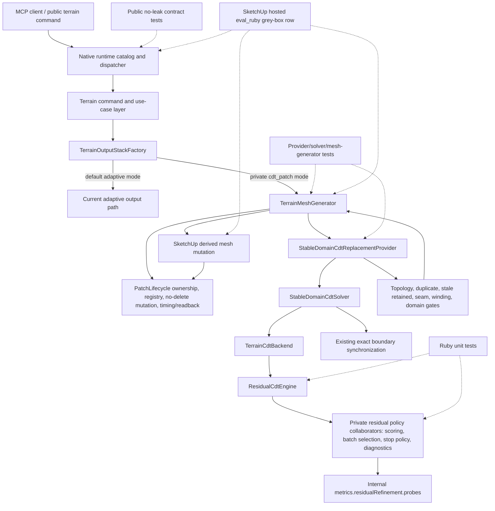

# Technical Plan: MTA-37 Implement CDT Patch Residual Frontier Batching
**Task ID**: `MTA-37`
**Title**: `Implement CDT Patch Residual Frontier Batching`
**Status**: `finalized`
**Date**: `2026-05-14`

## Source Task

- [Implement CDT Patch Residual Frontier Batching](./task.md)

## Problem Summary

MTA-35 proved the private strict `cdt_patch` path over the MTA-36 `PatchLifecycle`, but the path is still not performance-ready. The live broad-overlap evidence shows repeated residual scans and full patch retriangulation remain the dominant cost: roughly `30` engine builds, `~1.71s` residual scan time, `~4.31s` retriangulation time, and `~7.85s` lifecycle total.

MTA-37 improves residual point selection and batching while preserving the current safe PatchLifecycle handoff. It does not change seam ownership, default output mode, public MCP contracts, or native/backend selection. Its closeout evidence decides whether Ruby residual policy remains worth another slice or whether native/incremental backend work moves next.

## Goals

- Add backend-neutral residual scoring and batching policy for private CDT patch solves.
- Reduce repeated Ruby CDT rebuild count, residual scan time, and retriangulation time on strict CDT rows.
- Preserve topology, seam, ownership, registry, no-delete mutation, and readback gates.
- Keep `0.05m` as a quality/readiness target and next-direction signal, not a residual-only edit rejection rule.
- Keep CDT private, internally gated, and disabled on the default production path.
- Capture enough diagnostics to classify the next technical direction.

## Non-Goals

- Default-enable CDT output.
- Add a public CDT backend selector, public residual diagnostics, public patch controls, or public seam controls.
- Replace `PatchLifecycle` ownership, registry, mutation sequencing, timing, or readback.
- Implement native CGAL, Triangle, poly2tri, or another C/C++ backend.
- Implement full incremental CDT point insertion or local cavity invalidation.
- Replace exact boundary synchronization with a parent-owned seam lattice.
- Add post-CDT simplification to compensate for poor residual candidate selection.
- Change public terrain command request or response contracts.

## Related Context

- [Managed Terrain Surface Authoring HLD](specifications/hlds/hld-managed-terrain-surface-authoring.md)
- [CDT Terrain Output Path - Next Technical Direction](specifications/research/managed-terrain/cdt_terrain_next_direction.md)
- [CDT Terrain Output External Review](specifications/research/managed-terrain/cdt-terrain-output-external-review.md)
- [MTA-35 summary](specifications/tasks/managed-terrain-surface-authoring/MTA-35-productize-cached-cdt-patch-output-lifecycle-for-windowed-terrain-edits/summary.md)
- [MTA-36 summary](specifications/tasks/managed-terrain-surface-authoring/MTA-36-productize-windowed-adaptive-patch-output-lifecycle-for-fast-local-terrain-edits/summary.md)
- [MTA-32 summary](specifications/tasks/managed-terrain-surface-authoring/MTA-32-implement-patch-local-incremental-residual-cdt-proof/summary.md)
- [MTA-34 summary](specifications/tasks/managed-terrain-surface-authoring/MTA-34-implement-cdt-patch-replacement-and-seam-validation/summary.md)

## Research Summary

- The relevant CDT direction note recommends residual batching/error-frontier policy first, seam lattice second, and native CGAL evaluation only after residual and seam behavior are bounded.
- MTA-35 is the implemented CDT baseline: strict CDT over PatchLifecycle, private/default-disabled, public contracts unchanged, and broad-overlap timings still solve-bound.
- MTA-36 is the implemented lifecycle substrate: stable logical patches, registry JSON, no-delete mutation, timing/readback, and save/reopen evidence.
- MTA-32 is useful algorithmic prior art, but height residual alone can accept visually poor topology. MTA-37 must preserve topology and seam gates.
- MTA-34 is a cautionary hosted-evidence lesson: fake providers, tiny rectangles, and provider-only proof are insufficient.
- Current `ResidualCdtEngine` already has first-generation batching/thinning, so MTA-37 must improve selection quality per rebuild and diagnostics, not merely tune constants.
- Suggested Slice 1 target gates are evidence targets: engine builds `30 -> <= 6`, retriangulation `~4.31s -> <= 1.25s`, residual scan `~1.71s -> <= 0.75s`, lifecycle total `~7.85s -> <= 3.5s`, max error no worse than the current `0.05m` target, zero topology/seam regressions, and no fallback-rate increase.
- If build count falls but lifecycle total remains above about `5s`, pure Ruby triangulation overhead is the bottleneck and native/incremental planning should move next.

## Technical Decisions

### Slice 1 Non-Negotiables

- The residual frontier is patch-solve-local transient state. It must not become durable
  `PatchLifecycle` registry/state, but it must survive all residual refinement passes for the same
  patch solve.
- If existing seam synchronization re-solves the same patch inside one `StableDomainCdtSolver#solve`,
  the implementation must either preserve useful frontier/diagnostic state for that same solve or
  explicitly record the sync re-solve cost so closeout does not mistake discarded frontier work for a
  Ruby backend bottleneck.
- The first residual measurement after seed triangulation must populate a broad patch candidate
  field. Feeding the heap only from `worst_samples(limit: insert_batch_size)` or another tiny window
  is not sufficient.
- On representative broad-overlap patches, candidate frontier size must normally exceed the next
  insert batch size. This proves the heap is selecting from a real frontier rather than wrapping the
  next batch.
- Batch insertion must pop top weighted candidates from the existing frontier, not rescan and rebuild
  around a newly created frontier every pass.
- Minimum XY spacing must be enforced against the full current selected point set: seed points,
  mandatory/hard feature points, previously inserted residual points, and candidates already chosen
  for the current batch.
- Rebuild count must be controlled by accepted batches and a rebuild budget, not by individual
  residual candidates or under-filled batches caused by same-batch-only spacing.
- Incremental residual rescans must be limited to invalidated/dirty blocks after insertion. A full
  scan is required for initial frontier population and final quality evidence; mid-loop full
  confirmation scans are exceptional and must be counted separately.
- Existing exact seam mirroring remains active for this slice. Seam lattice, connected-component
  solves, durable frontier state, native CDT, and true incremental CDT cavity insertion remain out of
  scope.

### Explicit Anti-Patterns

- A class named `ResidualCandidateFrontier` is not sufficient unless it owns enough state to change
  scan and rebuild economics.
- A heap that only wraps the latest `worst_samples(limit: K)` result is not a Slice 1 frontier.
- Spacing checked only against candidates selected in the same batch is not sufficient.
- Rebuilding after tiny or systematically under-filled batches is not sufficient.
- Repeated main-loop full scans are not sufficient, even if candidate counters and timings are
  recorded.
- Hosted proof on toy terrains, provider-only calls, or adaptive fallback geometry is not accepted
  as Slice 1 performance evidence.

### Data Model

- Keep runtime CDT internals private below `TerrainCdtBackend`.
- Preserve the existing provider handoff shape expected by `TerrainMeshGenerator`.
- Extend internal diagnostics under `metrics.residualRefinement` and `metrics.residualRefinement.probes`.
- Add only JSON-safe diagnostic values: seed counts, candidate counts, rejection counts, max/RMS/p95 error, weighted error ratio, improvement by pass, scan timing, retriangulation timing, and engine build count.
- A `candidateFrontier` diagnostics subtree is allowed because Slice 1 introduces a real private
  frontier object with heap, full/incremental scan, and block invalidation semantics.

### API and Interface Design

- Public MCP request and response shapes remain unchanged.
- Runtime catalog, dispatcher passthrough, schemas, docs, and examples remain unchanged.
- Private CDT mode continues through existing `cdt_patch` mode wiring.
- Residual policy may use private collaborators below `ResidualCdtEngine` for:
  - candidate scoring / tolerance adaptation;
  - batch selection;
  - stop policy;
  - diagnostics accumulation.
- `ResidualCdtEngine` remains the orchestration point unless implementation shows a clearer local split.

### Public Contract Updates

Not applicable. MTA-37 must not change public tool names, public request schemas, public response shapes, runtime catalog entries, dispatcher routing, README examples, or user-facing setup.

If implementation introduces new internal diagnostic or fallback vocabulary, update public no-leak contract tests so those terms remain hidden from public responses.

### Error Handling

- Residual stop state, budget status, and provider validation failure remain separate concepts.
- Preserve existing residual stop states where applicable: `residual_satisfied`, `safety_cap`, `stalled`, `max_passes`, and `disabled`.
- Keep point, face, and runtime outcomes in existing budget-status fields such as `max_point_budget_exceeded`, `max_face_budget_exceeded`, and `max_runtime_budget_exceeded`.
- Provider/result gates remain authoritative for missing mesh, invalid topology, duplicate triangles, duplicate boundary edges, stale retained evidence, seam Z mismatch, bad winding, and out-of-domain geometry.
- Residual height error above `0.05m` drives refinement, diagnostics, and next-direction classification; it does not create a new residual-only edit rejection path.

### State Management

- `PatchLifecycle` remains authoritative for patch identity, registry persistence, face ownership, no-delete mutation, timing handoff, and readback.
- Existing exact boundary synchronization remains unchanged.
- Dirty CDT replacement must preserve old output until provider acceptance, ownership lookup, seam validation, and mutation preconditions pass.
- New residual policy state must stay transient to the solve/refinement path and must not become durable terrain state.

### Integration Points

- Residual policy integrates at `ResidualCdtEngine` pass selection and point insertion.
- Metrics integrate through existing `metrics.residualRefinement.probes`.
- `TerrainCdtBackend` keeps budget/fallback mapping and accepted/fallback envelope behavior.
- `StableDomainCdtSolver` keeps current patch-local feature filtering and boundary synchronization.
- `StableDomainCdtReplacementProvider` and replacement result classes keep current acceptance gates.
- `TerrainMeshGenerator` keeps current CDT bootstrap/dirty replacement, ownership lookup, seam validation, mutation, registry write, and fallback behavior.
- Hosted grey-box validation uses MCP `eval_ruby` for setup, private mode selection, evidence extraction, and structured capture, but the edit itself must go through the public terrain command family.

### Configuration

- Use the existing private `cdt_patch` mode selected through current runtime config/env/constant behavior.
- Do not add a new rollout flag unless implementation proves `cdt_patch` alone is insufficient for rollback.
- Start batch selection around the research guidance of `K = 8` or `16` per patch, then adapt by patch size, runtime, and improvement slope.

## Architecture Context

## Key Relationships

- Public terrain command shape stays unchanged.
- `TerrainMeshGenerator` and `PatchLifecycle` remain authoritative for patch identity, registry, ownership lookup, no-delete mutation, timing, and readback.
- `StableDomainCdtSolver` retains current exact boundary synchronization.
- `TerrainCdtBackend` keeps fallback/budget mapping and accepts residual metrics from `ResidualCdtEngine`.
- New residual policy code stays private below the CDT backend and feeds the existing internal metrics subtree.

## Acceptance Criteria

- In private `cdt_patch` mode, residual refinement scores candidates by weighted local residual error before insertion.
- The first residual scan for a patch solve populates a broad frontier whose candidate count can
  exceed the next insert batch size.
- The frontier can provide multiple top-K batches from retained candidate state without requiring a
  full residual rescan before every batch.
- Residual refinement inserts bounded batches per rebuild and records candidate scored, accepted, duplicate-rejected, spacing-rejected, and protected-state-rejected counts.
- Minimum XY spacing is enforced against the full current point set, including seed/mandatory points
  and previously inserted residual points, not just candidates in the same popped batch.
- After insertion, only dirty/invalidated residual blocks are rescored during the main loop; final
  full scan remains the quality/evidence guard.
- Batch selection is deterministic for equal inputs, including stable row/column tie-breaking.
- Residual policy preserves existing residual stop states and keeps point, face, and runtime budget outcomes in existing budget-status fields.
- Internal diagnostics remain JSON-safe and are emitted under existing private `metrics.residualRefinement` / `probes` structures.
- Residual height error above `0.05m` drives refinement and next-direction evidence but does not create a new residual-only edit rejection path.
- Existing provider/result gates still reject missing mesh, invalid topology, duplicate triangles, duplicate boundary edges, stale retained evidence, seam Z mismatch, bad winding, and out-of-domain geometry.
- Existing exact boundary synchronization and seam validation behavior remain unchanged.
- Dirty CDT replacement still preserves old output until provider acceptance, ownership lookup, seam validation, and no-delete mutation preconditions pass.
- Default terrain output remains adaptive; CDT stays private/default-disabled and selected only through existing `cdt_patch` mode wiring.
- Public MCP request schemas, response shapes, dispatcher behavior, runtime catalog entries, README examples, and user-facing setup do not change.
- Public no-leak checks prove CDT patch IDs, registry internals, fallback enums, timing buckets, raw vertices, raw triangles, and residual diagnostics remain hidden from public responses.
- Hosted grey-box validation through MCP `eval_ruby` replays a representative strict `cdt_patch` broad-overlap edit family through the public command path and records build count, residual scan time, retriangulation time, lifecycle total, face count, max/RMS/p95 error, seam/topology/registry status, and fallback outcome.
- Closeout classifies the row as Ruby-policy viable, seam-policy next, native/incremental-needed, or residual-policy failure based on correctness, fallback rate, build-count movement, timing buckets, and the research failure signal.

## Test Strategy

### TDD Approach

Start with focused failing tests around residual policy behavior, then implement the smallest private policy extraction needed to pass them. Broaden only after deterministic local policy behavior is proven.

### Required Test Coverage

- `ResidualCdtEngine` / policy tests:
  - weighted/local residual scoring;
  - broad initial candidate load where heap candidate count exceeds insert batch size;
  - multiple batches popped from retained frontier state without full rescanning each pass;
  - bounded batch insertion per rebuild;
  - spacing against existing seed/mandatory/prior residual points as well as same-batch candidates;
  - duplicate and protected-state rejection counters;
  - dirty-block-only incremental rescore requests after accepted insertion;
  - final full scan for max/RMS/p95 evidence without repeated main-loop full confirmations;
  - rebuild count bounded by accepted batch count/rebuild budget in a synthetic broad-overlap fixture;
  - deterministic tie-breaking;
  - residual stop states: `residual_satisfied`, `safety_cap`, `stalled`, `max_passes`, and `disabled`;
  - separate budget-status assertions for point, face, and runtime budgets;
  - max/RMS/p95 error and improvement-by-pass diagnostics;
  - scan and retriangulation probe updates.
- `TerrainCdtBackend` tests:
  - residual miss above target remains diagnostic unless strict existing gates fail;
  - budget/fallback mappings remain stable;
  - accepted/fallback envelopes stay compatible.
- `StableDomainCdtSolver` and provider tests:
  - patch-local feature filtering remains stable;
  - exact boundary synchronization remains active;
  - topology/seam/stale-retained/duplicate/bad-winding/out-of-domain gates still block local CDT acceptance.
- `TerrainMeshGenerator` tests:
  - accepted dirty replacement mutates through PatchLifecycle ownership and registry writeback;
  - provider, ownership, seam, and strict selected-output failures preserve old output before unsafe erase.
- Public no-leak contract tests:
  - public terrain responses do not expose new internal diagnostic or fallback terms.
- Hosted validation:
  - MCP `eval_ruby` grey-box row for representative broad-overlap strict `cdt_patch` behavior.

## Instrumentation and Operational Signals

- Engine build/retriangulation count.
- Residual scan count and time.
- Retriangulation time.
- Point insertion time.
- Candidates scored, accepted, duplicate-rejected, spacing-rejected, and protected-state-rejected.
- Worst weighted error ratio.
- Max/RMS/p95 height error.
- Improvement by pass.
- Lifecycle total time and relevant timing buckets.
- Face count and selected point count.
- Seam validation, topology validation, registry validity, output mode/tag, and fallback outcome.
- Next-direction classification.

## Implementation Phases

1. Freeze current residual diagnostic baseline.
   - Add failing tests for the Slice 1 non-negotiables: broad frontier load, multi-batch retained
     heap use, full-point-set spacing, dirty-block rescore, final full scan, candidate counters,
     deterministic batch behavior, error metrics, and stop/budget separation.
   - Confirm existing public no-leak and private `cdt_patch` wiring expectations.
2. Implement private residual policy behavior.
   - Add minimal private collaborators only where they improve clarity.
   - Keep orchestration in `ResidualCdtEngine`.
   - Add candidate scoring, broad frontier population, bounded batch selection, full-point-set
     spacing/duplicate/protected rejection, dirty-block rescore, and improvement-slope stop support.
3. Integrate diagnostics and acceptance behavior.
   - Extend `metrics.residualRefinement.probes`.
   - Preserve provider handoff shape.
   - Verify backend, solver, provider, and mesh-generator behavior.
4. Validate locally.
   - Run focused residual/terrain tests, contract no-leak tests, and RuboCop.
   - Run broader terrain suite where practical.
5. Validate hosted and classify.
   - Replay representative strict `cdt_patch` broad-overlap row through MCP `eval_ruby`.
   - Record target metrics and classify next direction.

## Rollout Approach

- Keep CDT private/default-disabled.
- Use existing `cdt_patch` private mode wiring.
- Do not add a public selector or public diagnostic surface.
- Treat MTA-37 as a gated internal performance/evidence slice.
- Default-enable discussion remains blocked until later readiness gates prove runtime, face count, error, seam, topology, registry, readback, and public no-leak behavior.

## Risks and Controls

- Existing residual engine already batches/thins, so the slice could add complexity without reducing rebuild count: require rebuild/retriangulation counts and candidate counters in tests and hosted evidence.
- The implementation could satisfy names but not economics: require red tests for retained frontier
  state, broad candidate load, full-point-set spacing, dirty-block rescore, and rebuild budget before
  further hosted timing.
- Weighted batches could reduce rebuilds while worsening quality: keep max/RMS/p95 error and provider gates authoritative.
- Batch selection could cluster around one terrain feature: enforce deterministic spacing, duplicate/protected rejection, and per-batch caps.
- Candidate scoring could miss narrow spikes: carry hierarchical min/max residual blocks as a follow-up trigger if max error fails while RMS/p95 look acceptable.
- Seam synchronization or Ruby triangulation constants could hide improvements: record scan, retriangulation, boundary sync/re-solve impact, provider solve, mutation, registry write, and lifecycle total separately.
- Hosted eval could bypass public command routing: eval may set up mode and extract evidence, but must drive the same public terrain command family.
- Hosted row could accidentally measure adaptive output: assert private `cdt_patch` selected output mode/tags and reject adaptive fallback as accepted CDT evidence.
- Public contract drift could leak internals: no schema/catalog/docs changes; update no-leak tests for any new internal terms.

## Dependencies

- MTA-35 strict CDT path and `cdt_patch` private wiring.
- MTA-36 PatchLifecycle registry, ownership, no-delete mutation, timing, and readback.
- Current `ResidualCdtEngine`, `CdtHeightErrorMeter`, `TerrainCdtBackend`, `StableDomainCdtSolver`, `StableDomainCdtReplacementProvider`, and `TerrainMeshGenerator`.
- Existing MCP `eval_ruby` escape-hatch tool for grey-box SketchUp hosted validation.
- SketchUp-hosted runtime access for the representative broad-overlap row.

## Premortem Gate

Status: PASS

### Unresolved Tigers

- None.

### Plan Changes Caused By Premortem

- Added this Premortem Gate as the final implementation-facing checklist.
- Confirmed hosted evidence must prove accepted strict `cdt_patch` output, not provider-only or adaptive fallback behavior.
- Confirmed research timing gates classify next direction; they do not become residual-only edit rejection rules.

### Accepted Residual Risks

- Risk: Ruby rebuild backend may not hit target timing even with better batching.
  - Class: Paper Tiger
  - Why accepted: MTA-37 is explicitly an evidence slice that decides whether Ruby remains viable.
  - Required validation: hosted broad-overlap row records build count, scan time, retriangulation time, lifecycle total, and next-direction classification.
- Risk: Candidate scoring may miss narrow max-error spikes while RMS/p95 look acceptable.
  - Class: Paper Tiger
  - Why accepted: max error remains a required signal and hidden-spike handling is a named follow-up trigger.
  - Required validation: record max/RMS/p95 error; if max fails while RMS/p95 pass, recommend hierarchical min/max residual blocks.
- Risk: Seam mirroring may remain a face-count blocker.
  - Class: Elephant
  - Why accepted: seam lattice is intentionally out of MTA-37 scope so residual policy effects remain isolated.
  - Required validation: record face count, boundary sync/re-solve timing, seam status, and classify seam lattice as next if residual policy improves but seam cost dominates.

### Carried Validation Items

- Hosted MCP `eval_ruby` grey-box broad-overlap row through the public terrain command path.
- Public no-leak contract checks for any new internal diagnostic or fallback vocabulary.
- Provider, solver, and mesh-generator tests proving topology, seam, ownership, stale-retained, registry, and no-delete safety remain authoritative.
- Closeout classification: Ruby residual/seam policy, seam lattice, native/incremental backend, or residual-policy failure.

### Implementation Guardrails

- Do not add a public CDT selector, public residual diagnostics, or public response fields.
- Do not enable CDT by default.
- Do not turn `0.05m` residual miss into a residual-only edit rejection rule.
- Do not change exact boundary synchronization in MTA-37.
- Do not add native/incremental CDT or fake local invalidation in this task.
- Do not use provider-only metrics or adaptive fallback geometry as accepted strict-CDT evidence.
- Do not erase old CDT output before provider acceptance, ownership lookup, seam validation, and mutation preconditions pass.

## Quality Checks

- [x] All required inputs validated
- [x] Problem statement documented
- [x] Goals and non-goals documented
- [x] Research summary documented
- [x] Technical decisions included
- [x] Architecture context included
- [x] Acceptance criteria included
- [x] Test requirements specified
- [x] Instrumentation and operational signals defined when needed
- [x] Risks and dependencies documented
- [x] Rollout approach documented when needed
- [x] Small reversible phases defined
- [x] Premortem completed with falsifiable failure paths and mitigations
- [x] Planning-stage size estimate considered before premortem finalization
