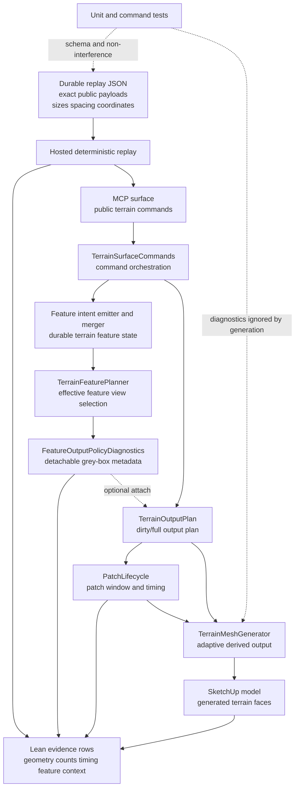

# Technical Plan: MTA-38 Establish Feature-Aware Adaptive Baseline, Policy, And Validation Harness
**Task ID**: `MTA-38`
**Title**: `Establish Feature-Aware Adaptive Baseline, Policy, And Validation Harness`
**Status**: `finalized`
**Date**: `2026-05-15`

## Source Task

- [Establish Feature-Aware Adaptive Baseline, Policy, And Validation Harness](./task.md)

## Problem Summary

Feature-aware adaptive output needs a durable, reproducible baseline before later tasks change mesh
behavior. The baseline must capture accepted public-command terrain create/edit flows, exact replay
inputs, current geometry counts/rendering evidence, timing, dirty-window/patch scope, and grey-box
feature-output diagnostics. It must not become another task-local fixture that future work cannot
reproduce.

## Goals

- Define a canonical durable replay spec with exact terrain generation inputs and public command
  payloads.
- Record current accepted adaptive output rendering/timing baseline rows through hosted MCP
  execution.
- Add stable, detachable grey-box `FeatureOutputPolicyDiagnostics` to output planning.
- Prove diagnostic metadata does not affect face or vertex generation.
- Include accepted intersecting edit rows whose coordinates make feature-context overlap explicit.
- Preserve public MCP request and response contracts.

## Non-Goals

- No feature-aware density, topology, forced subdivision, seam contract, diagonal choice, local
  detail, CDT, native acceleration, or backend selector behavior.
- No fallback matrix.
- No refusal-focused replay corpus.
- No reload/readback acceptance burden.
- No public no-leak reporting requirement.
- No saved SketchUp scene fixture as the reproduction source.
- No exact geometry-equivalence proof beyond proving MTA-38 diagnostics are not consumed by
  generation.

## Related Context

- [Managed Terrain Surface Authoring HLD](specifications/hlds/hld-managed-terrain-surface-authoring.md)
- [Recommended Backend Architecture for Feature-Aware Adaptive Terrain Output](specifications/research/managed-terrain/recommended_new_adaptive_backend_architecture.md)
- [MTA-20 feature constraint layer](specifications/tasks/managed-terrain-surface-authoring/MTA-20-define-terrain-feature-constraint-layer-for-derived-output/summary.md)
- [MTA-22 adaptive regression fixture pack](specifications/tasks/managed-terrain-surface-authoring/MTA-22-capture-adaptive-terrain-regression-fixture-pack/summary.md)
- [MTA-23 adaptive-grid prototype evidence](specifications/tasks/managed-terrain-surface-authoring/MTA-23-prototype-adaptive-simplification-backend-with-grey-box-sketchup-probes/summary.md)
- [MTA-24 intersecting bounded edit evidence](specifications/tasks/managed-terrain-surface-authoring/MTA-24-prototype-constrained-delaunay-cdt-terrain-output-backend-and-three-way-bakeoff/live-h2h-intersecting-bounded-edits-2026-05-07.md)
- [MTA-36 adaptive patch lifecycle evidence](specifications/tasks/managed-terrain-surface-authoring/MTA-36-productize-windowed-adaptive-patch-output-lifecycle-for-fast-local-terrain-edits/summary.md)

## Research Summary

- MTA-20 confirms all supported terrain edits can emit feature intent. MTA-38 must cover
  representative feature-context shapes, not invent a separate “feature-intent edit” category.
- MTA-22 is the closest replay/evidence infrastructure analog. Its main lesson is to keep source
  recipes and observed results distinct and machine-checkable.
- MTA-36 is the production adaptive lifecycle analog. It provides patch/timing evidence patterns,
  but MTA-38 must not import fallback, reload/readback, or no-leak acceptance rows.
- MTA-24 provides a useful intersecting feature-context row shape, but CDT remains negative context
  for this task.
- Current code gates full feature geometry mostly behind CDT paths. MTA-38 should add compact
  feature-output diagnostics for the production adaptive path without routing geometry generation
  through feature-aware behavior.

## Technical Decisions

### Data Model

Add `FeatureOutputPolicyDiagnostics` as a small internal value object.

Required fields:

- `schemaVersion`
- `featureViewDigest`
- `policyFingerprint`
- `selectionWindow`
- `selectedFeatureCounts`
- `selectedFeatureKinds`
- `selectedStrengthCounts`
- `affectedWindowSummary`
- `intersectionSummary`
- `localTolerancePolicy`
- `diagnosticOnly`

Rules:

- The object must be JSON-serializable and contain no SketchUp objects.
- It is detachable and optional.
- It carries compact summaries, not raw feature graphs.
- It does not participate in existing adaptive patch registry identity.
- It does not drive face or vertex generation in MTA-38.

Add optional diagnostic attachment to `TerrainOutputPlan`, for example a reader such as
`feature_output_policy_diagnostics`. Plans without diagnostics must behave exactly as before.

### Durable Replay Spec

Create `test/terrain/replay/feature_aware_adaptive_baseline.json`.

The replay spec is the reproduction source of truth. It must include:

- `schemaVersion`
- `corpusId`
- `units`
- canonical terrain generation metadata
- exact public `create_terrain_surface` payload
- sequences and rows with stable semantic IDs
- exact public `edit_terrain_surface` payloads
- expected accepted status for every row
- feature-context classification metadata for filtering and review

Canonical terrain:

- `49` columns by `49` rows
- `0.5m x 0.5m` spacing
- `48 x 48` output cells, dividing into a `3 x 3` patch grid at the current `16` cell patch size
- explicit origin/placement in the spec
- stable source element ID, not timestamp identity

Canonical rows:

- `create-baseline`
- `target-local-center`
- `target-adjacent-east`
- `target-repeat-center`
- `corridor-diagonal-intersect`
- `planar-pad-intersect`
- `survey-control-intersect`
- `fairing-envelope-intersect`

Preserve/fixed-control contexts may be included only if they remain accepted. They must not turn
the corpus into refusal evidence.

### API and Interface Design

- Public MCP tool schemas and response shapes do not change.
- The hosted runner uses the project’s MCP surface to execute public commands from the replay spec.
- Grey-box diagnostics and timing are captured internally by the replay harness, not added to
  public command responses.
- The evidence output is a lean operational row set, not a full diagnostic dump.
- Feature-view and policy digests are runtime traceability signals. They are not the replay
  reproducibility source; exact public payloads and terrain metadata are.

### Public Contract Updates

Not applicable. No public tool, request schema, response schema, dispatcher route, native catalog
entry, README usage text, or public example changes are planned.

If implementation discovers a public contract change is unavoidable, stop and update the runtime
catalog, dispatcher, contract tests, docs, and examples in the same change.

### Error Handling

- Replay spec validation must fail fast on missing terrain size, spacing, origin/placement,
  coordinates, row IDs, sequence IDs, public command payloads, or expected accepted status.
- Hosted replay rows that refuse unexpectedly are evidence failures, not accepted baseline rows.
- Diagnostics must fail closed in tests if they contain non-JSON-safe values or SketchUp objects.
- If full feature geometry preparation proves necessary and expensive, keep it out of MTA-38 unless
  a compact summary cannot satisfy traceability.

### State Management

- Terrain state remains authoritative.
- Generated mesh remains derived output.
- `FeatureOutputPolicyDiagnostics` is derived runtime/output-planning metadata.
- Replay evidence records state revision; it does not add state digest or reproduction digest
  fields.
- Existing adaptive patch registry and output policy fingerprint behavior remain stable.

### Integration Points

- `TerrainSurfaceCommands` integrates feature intent emission, feature planning, output planning,
  and mesh regeneration.
- `TerrainFeaturePlanner` or a nearby collaborator produces the compact selected feature-view
  summary used by `FeatureOutputPolicyDiagnostics`.
- `TerrainOutputPlan` carries the optional diagnostic object.
- `PatchLifecycle::PatchTiming` or an equivalent generic wrapper records the required timing
  buckets without CDT naming.
- `TerrainMeshGenerator` ignores diagnostics for generation.
- Hosted MCP replay executes the exact spec rows against SketchUp.

### Configuration

- Use fixed replay-spec values, not environment-dependent defaults.
- Hosted placement must be explicit in the replay spec and chosen to avoid existing scene content.
- Do not add global runtime configuration for MTA-38.

## Architecture Context

## Key Relationships

- The replay spec, not a saved scene, is the durable reproduction artifact.
- Public MCP commands are the only execution path for hosted replay rows.
- Feature diagnostics are grey-box evidence and do not alter public response shape.
- The output plan is the attachment point for diagnostics because output planning owns the
  feature-context traceability claim.
- Mesh generation must remain independent of diagnostics in this task.

## Acceptance Criteria

- A canonical replay spec exists at `test/terrain/replay/feature_aware_adaptive_baseline.json`.
- The replay spec contains exact public create/edit command payloads and all terrain reproduction
  inputs: units, origin/placement, columns, rows, spacing, elevation recipe or source, stable
  sequence IDs, stable row IDs, and expected accepted status.
- The replay corpus includes accepted create, local edit, adjacent edit, repeated edit, and
  representative edit-mode rows.
- At least one accepted sequence contains intersecting edits with exact coordinates that overlap
  feature contexts by construction.
- The replay spec is validated by automated tests that reject missing size, spacing, origin,
  coordinates, row IDs, sequence IDs, or public payload fields.
- `FeatureOutputPolicyDiagnostics` exists as a JSON-serializable, SketchUp-object-free internal
  diagnostic value object.
- `FeatureOutputPolicyDiagnostics` records compact traceability fields: schema version,
  feature-view digest, policy fingerprint, selection window, selected feature counts/kinds/strengths,
  affected-window summary, intersection summary, default local-tolerance policy, and diagnostic-only
  marker.
- `TerrainOutputPlan` can carry `FeatureOutputPolicyDiagnostics` optionally; paths without
  diagnostics still work.
- Public MCP terrain request and response contracts remain unchanged.
- Face/vertex generation does not consume `FeatureOutputPolicyDiagnostics`; focused tests compare
  generation behavior with diagnostics attached and detached.
- Generic internal timing buckets are available for baseline rows: `commandOutputPlanning`,
  `featureSelectionDiagnostics`, `dirtyWindowMapping`, `adaptivePlanning`, `mutation`, and `total`.
- The hosted replay runner uses the project’s MCP surface to generate terrain and apply the exact
  replay commands from the spec.
- Hosted evidence rows are lean and include only row ID, sequence ID, replay spec path/version,
  command kind, accepted status, verdict, state revision, feature-view digest, policy fingerprint,
  compact feature-context summary, dirty window, affected patch scope summary, face count, vertex
  count, rendering/topology summary, and timing buckets.
- Hosted replay evidence is recorded for the accepted baseline rows before later topology-affecting
  feature-aware tasks begin.
- The implementation does not add fallback matrices, refusal replay rows, reload/readback
  requirements, saved-scene fixture dependencies, public no-leak reporting, CDT routing, or public
  backend selectors.

## Test Strategy

### TDD Approach

1. Start with replay spec schema tests and failing fixture validation.
2. Add `FeatureOutputPolicyDiagnostics` unit tests for JSON safety, stable digest/fingerprint
   behavior, compact summaries, and attach/detach behavior.
3. Add command tests proving feature context reaches output planning and public responses remain
   unchanged.
4. Add mesh-generator non-interference tests with diagnostics attached and detached.
5. Add replay harness tests that load the canonical spec, execute rows through the intended MCP
   command path abstraction, and shape lean evidence rows.
6. Run hosted replay through SketchUp and record baseline evidence.

### Required Test Coverage

- Replay spec loader/schema tests:
  - required terrain generation fields;
  - exact public create/edit payload presence;
  - stable sequence and row IDs;
  - accepted row expectation;
  - rejection of saved-scene dependency or missing coordinates.
- Diagnostic object tests:
  - JSON-safe values;
  - no SketchUp object leakage;
  - stable feature-view digest and policy fingerprint;
  - compact selected kind/strength/window/intersection summaries.
- Output-plan/command tests:
  - optional diagnostics attachment;
  - feature-window selection reaches output planning;
  - intersecting replay-like contexts produce composed summaries;
  - public response shape unchanged.
- Mesh-generator tests:
  - face/vertex generation output is unchanged with diagnostics attached versus detached.
- Hosted replay:
  - create and accepted edit rows execute through MCP;
  - evidence rows record timing, geometry counts, dirty/patch scope, feature diagnostics, and verdict.
- The diagnostics attached/detached non-interference test must cover the canonical replay rows, not
  only a hand-picked small unit case.

## Instrumentation and Operational Signals

- Timing buckets:
  - `commandOutputPlanning`
  - `featureSelectionDiagnostics`
  - `dirtyWindowMapping`
  - `adaptivePlanning`
  - `mutation`
  - `total`
- Evidence row signals:
  - replay environment summary, including SketchUp build and extension/runtime version where
    available;
  - accepted status and verdict;
  - state revision;
  - feature-view digest;
  - policy fingerprint;
  - compact feature-context summary;
  - dirty window;
  - affected patch scope summary;
  - face and vertex counts;
  - basic rendering/topology summary.

## Implementation Phases

1. Define replay spec and loader validation.
   - Add `test/terrain/replay/feature_aware_adaptive_baseline.json`.
   - Add schema/loader tests.
   - Encode the canonical 49x49 terrain and accepted row sequence.

2. Add `FeatureOutputPolicyDiagnostics`.
   - Implement the internal value object.
   - Add compact feature-view summary and policy fingerprint logic.
   - Keep full `TerrainFeatureGeometry` out of the production adaptive path unless needed.

3. Attach diagnostics to output planning.
   - Add optional diagnostics to `TerrainOutputPlan`.
   - Wire command/output planning to produce diagnostics for accepted production adaptive rows.
   - Keep public response shape unchanged.

4. Add generic timing and evidence shaping.
   - Add non-CDT timing capture for the required buckets.
   - Build lean evidence-row shaping for replay output.

5. Prove non-interference and replay behavior.
   - Add attached/detached generation tests.
   - Run the non-interference proof against the canonical replay row set.
   - Add command and harness coverage.
   - Run focused terrain tests and contract checks.

6. Run hosted replay and record baseline evidence.
   - Execute deterministic replay through the project’s MCP surface in SketchUp.
   - Record accepted row evidence in the task closeout artifact.

## Rollout Approach

- This is internal baseline infrastructure; no public rollout gate is required.
- Keep diagnostics internal and detachable.
- Keep replay spec stable for MTA-39 through MTA-44.
- Do not default-enable any feature-aware geometry behavior in this task.

## Risks and Controls

- Replay spec omits reproduction-critical fields: schema tests must reject missing size, spacing,
  origin, coordinates, row IDs, sequence IDs, public payloads, and accepted-status fields.
- Diagnostics become public contract: contract tests and command tests must confirm public response
  shape remains unchanged.
- Diagnostics affect generation: mesh-generator A/B tests and code review must prove diagnostics
  are ignored by face/vertex generation.
- Timing buckets inherit CDT naming or semantics: use generic bucket names and keep CDT timing out
  of MTA-38 evidence.
- Hosted timing is noisy: record timing as baseline evidence with row context, not as hard
  performance pass/fail thresholds. Future tasks should compare timing directionally with row and
  environment context.
- Intersecting rows unexpectedly refuse: keep preserve/fixed contexts optional unless accepted, and
  treat unexpected refusal as a replay-spec failure.
- Full feature geometry preparation is too heavy: use compact feature-view summaries by default.
- 49x49 terrain is too small for useful timing: before accepting the hosted baseline, check whether
  the canonical row timings are measurable enough to compare. Add one larger secondary timing-only
  row only if the canonical terrain gives unusably tiny timing signals.

## Premortem Gate

Status: WARN

### Unresolved Tigers

- None.

### Plan Changes Caused By Premortem

- Clarified that feature-view and policy digests are runtime traceability signals, not
  reproducibility keys.
- Added replay environment summary to timing evidence so future comparisons can interpret timing
  rows without pretending exact milliseconds are portable.
- Required diagnostics attached/detached non-interference proof across the canonical replay row set.
- Promoted the larger secondary timing-only row to an explicit hosted-baseline gate if 49x49 timing
  is too small to compare.

### Accepted Residual Risks

- Risk: Compact diagnostics may be too coarse for future feature-aware comparison.
  - Class: Paper Tiger
  - Why accepted: MTA-38 only needs to prove feature context reached output planning before geometry
    changes. Later topology-affecting tasks can expand diagnostics with their own acceptance
    evidence.
  - Required validation: Canonical intersecting rows must record selected feature counts/kinds,
    strength counts, affected-window summary, intersection summary, feature-view digest, and policy
    fingerprint.
- Risk: Hosted timing is environment-sensitive.
  - Class: Elephant
  - Why accepted: Timing is required baseline context, but it is not a hard pass/fail contract.
  - Required validation: Hosted evidence must record environment summary and timing buckets; add a
    larger timing-only row if canonical row timings are unusably small.
- Risk: Future tasks might treat exact replay payloads as enough and ignore feature-view drift.
  - Class: Paper Tiger
  - Why accepted: Evidence rows carry feature-view digest and compact feature context, so drift is
    visible without making digests the reproduction source.
  - Required validation: Replay runner must record feature-view digest and policy fingerprint for
    accepted rows.

### Carried Validation Items

- Hosted MCP replay must execute the canonical accepted rows from the durable spec.
- Non-interference tests must compare generation with diagnostics attached and detached across the
  canonical row set.
- Public command response shape must remain unchanged.
- If compact diagnostics cannot produce the required intersection summary without full feature
  geometry, stop and replan rather than widening the task silently.

### Implementation Guardrails

- Do not add public MCP request or response fields.
- Do not use request digests, state digests, or feature-intent digests as replay reproduction keys.
- Do not route production adaptive output through CDT or feature-aware geometry behavior.
- Do not add fallback, refusal, reload/readback, no-leak, or saved-scene fixture requirements.
- Do not let `FeatureOutputPolicyDiagnostics` influence face or vertex generation.

## Dependencies

- MTA-20 feature intent and feature planning behavior.
- MTA-36 adaptive patch lifecycle and current patch policy behavior.
- Current public `create_terrain_surface` and `edit_terrain_surface` contracts.
- Hosted SketchUp access through the project’s MCP surface.
- Ruby terrain test suite and contract stability tests.

## Quality Checks

- [x] All required inputs validated
- [x] Problem statement documented
- [x] Goals and non-goals documented
- [x] Research summary documented
- [x] Technical decisions included
- [x] Architecture context included
- [x] Acceptance criteria included
- [x] Test requirements specified
- [x] Instrumentation and operational signals defined when needed
- [x] Risks and dependencies documented
- [x] Rollout approach documented when needed
- [x] Small reversible phases defined
- [x] Premortem completed with falsifiable failure paths and mitigations
- [x] Planning-stage size estimate considered before premortem finalization
