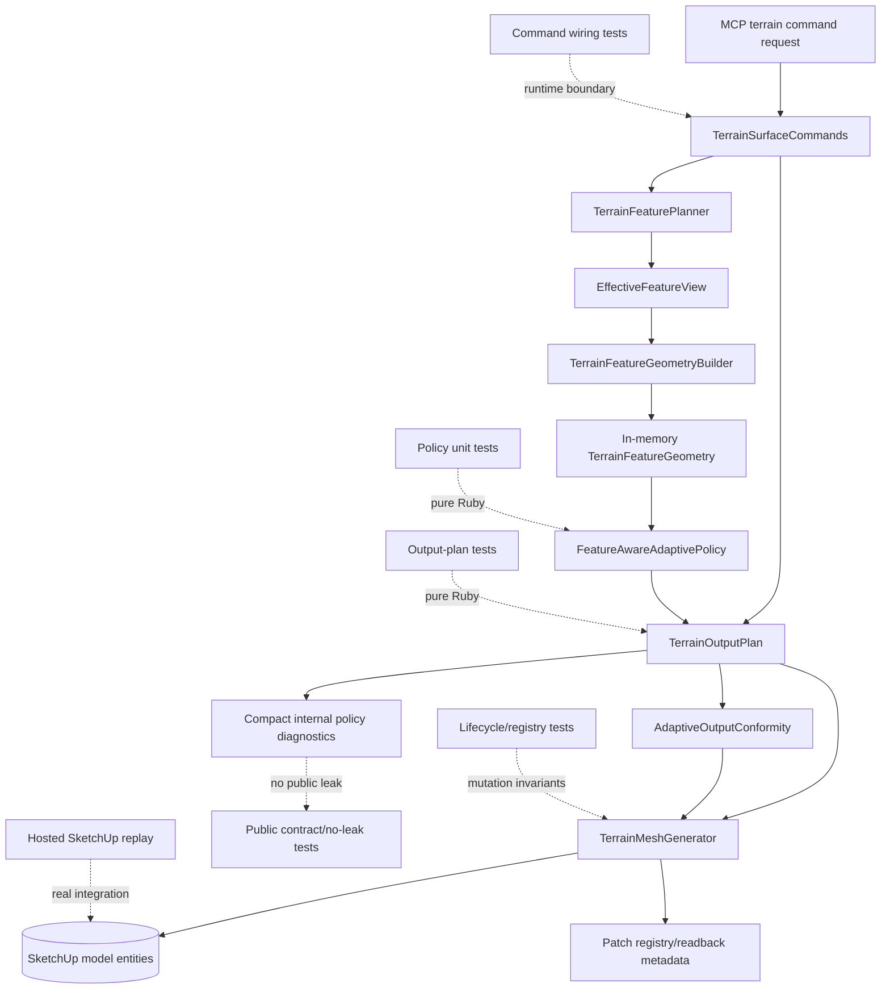

# Technical Plan: MTA-39 Add Feature-Aware Tolerance And Density Fields
**Task ID**: `MTA-39`
**Title**: `Add Feature-Aware Tolerance And Density Fields`
**Status**: `finalized`
**Date**: `2026-05-16`

## Source Task

- [Add Feature-Aware Tolerance And Density Fields](./task.md)

## Problem Summary

The production adaptive terrain output path uses a broadly fixed simplification policy. It can keep
height error bounded, but it does not allocate triangles based on selected feature intent. MTA-39
makes feature intent operational for the low-risk adaptive path by adding local tolerance and
target-density pressure while preserving PatchLifecycle, dirty-window replacement, registry/readback,
no-delete safety, and public MCP response shape.

## Goals

- Add feature-aware local simplification tolerance to production adaptive output.
- Add feature pressure / target-cell-size density pressure to production adaptive output.
- Keep the current adaptive patch/cell terrain output path as the production spine.
- Request and consume selected in-memory feature geometry even when CDT output is disabled.
- Preserve PatchLifecycle ownership, dirty-window behavior, registry/readback, no-delete mutation,
  and public command contracts.
- Prove the change by running the reusable MTA-38 hosted replay harness and publishing a full
  MTA-39 result pack.

## Non-Goals

- Do not force hard feature topology or protected boundaries to be represented exactly.
- Do not add forced subdivision masks, hard/protected topology refusal semantics, seam lattice
  upgrades, patch component promotion, sparse local detail tiles, CDT islands, native acceleration,
  or public backend selection.
- Do not add deterministic diagonal optimization; MTA-41 owns that optional slice.
- Do not expose feature graphs, selected feature internals, policy fields, patch IDs, registry data,
  timing buckets, raw triangles, or output-policy internals in public responses.
- Do not treat generated mesh vertices, faces, feature geometry, tolerance fields, or density fields
  as durable terrain state.

## Related Context

- [Managed Terrain Surface Authoring](specifications/hlds/hld-managed-terrain-surface-authoring.md)
- [Recommended Backend Architecture for Feature-Aware Adaptive Terrain Output](specifications/research/managed-terrain/recommended_new_adaptive_backend_architecture.md)
- [MTA-20 summary](specifications/tasks/managed-terrain-surface-authoring/MTA-20-define-terrain-feature-constraint-layer-for-derived-output/summary.md)
- [MTA-36 summary](specifications/tasks/managed-terrain-surface-authoring/MTA-36-productize-windowed-adaptive-patch-output-lifecycle-for-fast-local-terrain-edits/summary.md)
- [MTA-38 summary](specifications/tasks/managed-terrain-surface-authoring/MTA-38-establish-feature-aware-adaptive-baseline-policy-and-validation-harness/summary.md)
- [MTA-40 task](specifications/tasks/managed-terrain-surface-authoring/MTA-40-add-forced-subdivision-masks-for-feature-critical-geometry/task.md)
- [MTA-41 task](specifications/tasks/managed-terrain-surface-authoring/MTA-41-add-optional-deterministic-feature-aware-diagonal-optimization/task.md)

## Research Summary

- The backend architecture splits this work across Phase B / M1 slices **2** and **3**: local
  tolerance field and feature pressure / target density field. Slice **5** diagonal optimization is
  deliberately excluded and remains MTA-41.
- MTA-38 created the reusable hosted replay corpus and harness. MTA-39 must run that harness after
  implementation and publish a full task result pack; spot checks are not sufficient because MTA-39
  through MTA-44 rely on comparable adaptive-terrain evidence.
- MTA-20 provides the feature-intent and runtime feature context foundation. Existing
  `TerrainFeaturePlanner` can build selected in-memory `TerrainFeatureGeometry` when requested.
- MTA-36 provides the production PatchLifecycle substrate. MTA-39 changes planned cells, not the
  SketchUp mutation ownership model.
- MTA-23 prototype evidence supports monotone tolerance tightening, max/strictest density pressure,
  and role/strength target sizes, but it is not the production path and must not create hard topology
  promises.
- MTA-19 and MTA-21 are negative/validation analogs: correct height samples and adaptive conformance
  can still fail output-quality or compactness goals, so MTA-39 must prove locality, face-count
  directionality, and lifecycle preservation.

## Technical Decisions

### Data Model

- Add a production `FeatureAwareAdaptivePolicy` or equivalent pure-Ruby field evaluator under
  `src/su_mcp/terrain/output/`.
- The policy consumes selected in-memory `TerrainFeatureGeometry` derived by
  `TerrainFeaturePlanner` / `TerrainFeatureGeometryBuilder`.
- Feature geometry, local tolerance fields, and density fields remain derived planning views. Durable
  terrain state remains heightmap plus feature intent.
- Initial named constants should start conservatively unless implementation evidence forces a change:
  hard/protected tolerance multiplier `0.25`, firm multiplier `0.5`, soft multiplier `1.0`,
  tolerance floor multiplier `0.1`, firm target cell size around `1-2` source cells, and soft target
  cell size around `3-4` source cells.
- The policy participates deterministically in the existing policy fingerprint. Do not add a separate
  `policyVersion` field.

### API and Interface Design

- The policy exposes at least `local_tolerance_for(bounds)` and `target_cell_size_for(bounds)` or
  equivalent cell/patch-bound APIs.
- Local tolerance evaluation accounts for feature role, feature strength, proximity to the current
  cell or patch bounds, and available terrain context. Existing adaptive height residual remains part
  of the split decision; do not add a heavy terrain-analysis pass for this task.
- Tolerance aggregation is monotone tightening: stricter overlapping hard/protected/firm policy wins,
  and soft/fairing pressure cannot weaken it.
- Density aggregation uses max/strictest target-cell-size pressure, not additive scoring.
- Hard points, survey anchors, protected points/regions, and hard reference geometry can tighten
  local tolerance around their relevant bounds.

### Public Contract Updates

Not applicable for the planned implementation. Public MCP request shapes, response shapes, schema
registration, dispatcher behavior, docs, and examples should remain unchanged.

If implementation discovers a public contract change is unavoidable, stop and treat it as a scope
change that updates runtime behavior, native tool catalog/schema registration, dispatcher behavior,
contract tests, README/docs, and examples in the same change.

### Error Handling

- Missing, absent, or unsupported feature geometry degrades to baseline adaptive tolerance/density
  behavior without adding new MTA-39 public refusals, unless an existing upstream validation path
  already refuses the request.
- Existing no-delete and fallback behavior remains unchanged: old output remains until replacement
  output validates.
- Hard/protected exact-topology refusal remains MTA-40 scope, not MTA-39.

### State Management

- `EffectiveFeatureView` remains the active/relevant feature selector. It does not own adaptive
  split heuristics, tolerance multipliers, or density target rules.
- `TerrainFeatureGeometry` is requested/reused as selected in-memory derived context for adaptive
  planning. It is not persisted in terrain state.
- `TerrainOutputPlan` owns adaptive cell planning and consumes the policy inside the existing full
  and dirty patch-domain planning scopes.
- `TerrainMeshGenerator` remains downstream mutation/metadata code. It consumes planned cells and
  preserves PatchLifecycle ownership, registry/readback, and mutation sequencing.

### Integration Points

- Command to feature planner: production adaptive output must request selected feature geometry or
  policy input even when CDT output is disabled.
- Feature geometry to policy: the policy consumes selected in-memory feature geometry and tolerates
  missing/unsupported geometry through baseline fallback.
- Policy to output plan: recursive subdivision asks the policy for local tolerance and target cell
  size inside the current cell/patch domain.
- Output plan to mesh generator: density-driven face-count changes must preserve PatchLifecycle
  ownership metadata, registry/readback shape, and no-delete validation sequencing.
- Diagnostics to contract: compact internal evidence is allowed for replay, but normal public
  command responses must not expose internals.

### Configuration

- No user-facing configuration or runtime behavior switch is planned.
- The implemented tolerance/density behavior is production adaptive behavior once accepted.
- Hosted replay evidence is closeout proof, not a runtime activation switch.

## Architecture Context

## Key Relationships

- `FeatureIntentSet` -> `EffectiveFeatureView` -> `TerrainFeatureGeometryBuilder` ->
  feature-aware adaptive policy -> `TerrainOutputPlan` is the behavior chain.
- `FeatureOutputPolicyDiagnostics` remains evidence/summary support, not the behavior-driving object.
- `AdaptiveOutputConformity` and `TerrainMeshGenerator` remain downstream consumers. MTA-39 should
  not change diagonal choice, forced masks, seam lattice behavior, or mesh mutation policy there.
- Hosted replay is required because SketchUp entity lifecycle, timing, mutation safety, and
  registry/readback cannot be fully trusted from pure Ruby mocks.

## Acceptance Criteria

- Production adaptive output applies feature-aware local tolerance during recursive subdivision so
  hard/protected and firm feature areas can split more aggressively than baseline areas while soft
  or fairing features cannot weaken stricter overlapping tolerance.
- Production adaptive output applies feature-aware density or target-cell-size pressure during
  recursive subdivision so selected feature areas can receive locally denser allocation, bounded by
  the existing source-cell minimum and current full/dirty patch planning domains.
- Overlapping feature pressure is deterministic: tolerance aggregation chooses the strictest
  applicable tolerance, density aggregation chooses the strictest target-cell-size pressure, and
  repeated equivalent inputs produce equivalent planned cells and policy fingerprints.
- Production adaptive planning requests and consumes selected in-memory feature geometry even when
  CDT output is disabled.
- Feature geometry and tolerance/density fields remain derived in-memory planning inputs. Durable
  terrain state, source feature intent payloads, and normal public command responses do not store or
  expose raw feature geometry, policy fields, selected feature internals, patch IDs, registry data,
  timing buckets, or raw cell/triangle internals.
- Missing, absent, or unsupported feature geometry degrades to baseline adaptive tolerance/density
  behavior without adding new MTA-39 public refusals, unless an existing upstream validation path
  already refuses the request.
- Partial feature-geometry derivation degrades only for the unsupported portion and records compact
  internal fallback/coverage counts. It must not silently look identical to a fully feature-aware row
  in replay evidence.
- Dirty-window adaptive edits evaluate feature pressure only within the existing replacement
  planning scope and do not expand replacement to distant patches because of unrelated far feature
  pressure.
- Density-driven face-count changes preserve PatchLifecycle mutation safety: old output remains
  until replacement validates, face ownership metadata remains consistent, registry/readback shape
  remains valid, repeated edits remain stable, and existing no-delete failure behavior is preserved.
- Compact internal diagnostics and replay evidence include enough aggregate information to explain
  policy use: policy fingerprint, feature geometry digest, aggregate tolerance range,
  hard/protected point-region tolerance hit count and range, density-hit count, split-count
  aggregates, row verdict, and short reason.
- Diagnostic collection does not become a material contributor to adaptive planning time and does
  not introduce per-cell traces, raw field dumps, or high-cardinality feature/cell attribution in
  normal planning.
- MTA-39 does not introduce diagonal optimization, forced subdivision masks, hard/protected topology
  refusal semantics, seam lattice changes, component promotion, or sparse local detail behavior.
- A task-specific full hosted replay result pack is produced by running the reusable MTA-38 harness
  after implementation. It compares against the MTA-38 baseline corpus and classifies each row as
  `improved`, `neutral`, `regressed`, or `failed`, with any face-count growth explained as localized
  feature-window pressure rather than global drift.
- The MTA-39 result pack proves deterministic policy evidence for repeated equivalent inputs and
  classifies fallback rows distinctly from rows that fully applied feature-aware policy.
- Automated coverage proves policy semantics, output-plan integration, command/runtime wiring,
  public no-leak behavior, fallback behavior, dirty-window locality, and lifecycle/registry
  preservation before implementation closeout.

## Test Strategy

### TDD Approach

Start at the pure policy boundary, then move outward to output planning, command wiring, public
contract guards, lifecycle/registry preservation, and finally hosted replay. The likely first
failing target is a new policy-object test for deterministic local tolerance, density aggregation,
hard/protected point-region summaries, and compact diagnostics. The final closeout target is the
reusable MTA-38 hosted replay harness producing the full MTA-39 result pack.

### Required Test Coverage

| Queue order | AC / requirement | Behavior or risk | Implementation slice | Owner | Unit/core coverage | Integration/runtime coverage | Contract/schema coverage | Error/refusal coverage | Hosted/manual validation | Fixtures/helpers | Integration points | Focused command | Broader command | Blocker or explicit gap |
|---:|---|---|---|---|---|---|---|---|---|---|---|---|---|---|
| 1 | Feature-aware local tolerance uses role, strength, proximity, and available terrain context. | Strict local tolerance must affect allocation without a heavy terrain-analysis pass. | Phase 1 policy object; Phase 3 output-plan consumption. | Feature-aware adaptive policy; `TerrainOutputPlan`. | Policy tests for hard/protected, firm, soft/fairing, proximity falloff or bounds overlap, terrain-context inputs, and deterministic fingerprint inputs. | `TerrainOutputPlan` tests where stricter local tolerance changes split/stop decisions compared with fixed baseline. | Not applicable: no public schema change expected. | Missing terrain-context inputs fall back to base tolerance without public refusal. | Full MTA-38 harness result pack shows rows with local tolerance effects and compact tolerance ranges. | Policy geometry fixtures built from selected `TerrainFeatureGeometry`; adaptive terrain regression fixture. | `TerrainFeatureGeometry` -> policy -> `TerrainOutputPlan`. | `bundle exec ruby -Itest test/terrain/output/feature_aware_adaptive_policy_test.rb` | `bundle exec rake ruby:test` | New policy test file likely needed; exact helper names settle during implementation. |
| 2 | Soft/fairing pressure cannot weaken hard/protected/firm policy. | Overlap precedence must be monotone and deterministic. | Phase 1 policy object; Phase 3 output-plan consumption. | Feature-aware adaptive policy. | Monotone aggregation tests for overlapping hard/protected/firm/soft primitives. | Planned-cell tests prove stricter overlap wins when multiple pressures affect one cell. | No public leak of selected feature internals. | Unsupported soft/fairing geometry degrades to baseline pressure. | Replay verdict reasons distinguish strict tolerance hits from soft density-only pressure. | Overlapping feature geometry fixture. | Policy aggregation -> output-plan cell evaluation. | `bundle exec ruby -Itest test/terrain/output/feature_aware_adaptive_policy_test.rb` | `bundle exec rake ruby:test` | None beyond new policy fixture setup. |
| 3 | Hard points, survey anchors, protected points/regions, and hard reference geometry can tighten tolerance. | Hard/protected point pressure needs aggregate evidence without per-point forensics. | Phase 1 policy object; Phase 3 output-plan consumption. | Feature-aware adaptive policy; diagnostics summary. | Policy tests for hard-point/survey-anchor/protected-point tolerance hits and aggregate min/max summaries. | Output-plan tests prove nearby cells can split more aggressively while distant cells remain baseline. | Diagnostics remain internal and aggregate-only. | Unsupported hard-point geometry does not add an MTA-39-only public refusal unless an existing upstream path refuses. | Full result pack records aggregate hard/protected point-region hit count/range, not per-point traces. | Survey-anchor and protected-point feature geometry fixtures. | Feature geometry builder output -> policy summary -> replay diagnostics. | `bundle exec ruby -Itest test/terrain/output/feature_aware_adaptive_policy_test.rb` | `bundle exec rake ruby:test` | Exact representation of hard-point geometry should follow current `TerrainFeatureGeometryBuilder` output. |
| 4 | Feature pressure / target density creates bounded local allocation. | Density pressure can improve local allocation but must not become global face inflation. | Phase 1 policy object; Phase 4 density consumption. | Feature-aware adaptive policy; `TerrainOutputPlan`. | Max/strictest target-cell-size aggregation tests by role/strength. | Output-plan tests prove density pressure subdivides until target cell size or source-cell minimum, without sub-grid detail. | No public density-field output. | Density pressure alone does not force subdivision when policy and height conditions do not require it. | Result pack explains any face-count growth as local feature-window pressure. | Corridor, planar, target-region, and fairing feature fixtures. | Policy target-cell-size answers -> adaptive subdivision. | `bundle exec ruby -Itest test/terrain/output/terrain_output_plan_test.rb` | `bundle exec rake ruby:test` | Need to choose assertions that prove local allocation without depending on exact face counts too early. |
| 5 | Dirty-window planning remains patch-local. | Feature pressure must not expand replacement to distant patches. | Phase 4 density/tolerance consumption; Phase 5 lifecycle checks. | `TerrainOutputPlan`; PatchLifecycle window resolver. | Policy tests verify bounds-scoped evaluation inputs. | Dirty-window `TerrainOutputPlan` tests prove far features do not expand replacement scope. | No public patch IDs or registry data leak. | Baseline fallback applies when feature geometry is unavailable for the dirty window. | Hosted rows compare dirty-window scope and affected patch scope against MTA-38 baseline. | Dirty-window adaptive regression fixture with near and far feature pressure. | Patch window resolver -> output-plan policy evaluation. | `bundle exec ruby -Itest test/terrain/output/terrain_output_plan_test.rb` | `bundle exec rake ruby:test` | Hosted evidence needed for real dirty-window mutation, not only planned-cell assertions. |
| 6 | Production adaptive output requests selected feature geometry with CDT disabled. | Existing CDT-only feature geometry request would leave adaptive policy empty. | Phase 2 command/planner wiring. | `TerrainSurfaceCommands`; `TerrainFeaturePlanner`. | Pure tests can verify option-building helpers if isolated. | Command/runtime tests prove selected feature geometry or equivalent policy input reaches output planning when CDT is disabled. | Public command responses remain unchanged. | Feature geometry derivation failure degrades to baseline adaptive behavior without new MTA-39 public refusal. | Harness rows run through the hosted public command path, not direct policy calls. | Command test doubles around feature planner and output planning context. | Command -> feature planner -> output planner. | `bundle exec ruby -Itest test/terrain/commands/terrain_surface_commands_test.rb` | `bundle exec rake ruby:test` | May require a small test seam to observe planner options without exposing internals publicly. |
| 7 | Feature geometry and policy fields remain derived in-memory planning input. | Durable terrain state or public responses must not become a hidden source of truth. | Phase 2 wiring; Phase 6 contract checks. | Command/runtime contracts; terrain state serializers. | Serializer/state tests confirm feature geometry is not persisted if touched. | Runtime tests confirm output planning receives derived context. | Contract/no-leak tests reject diagnostics, digests, selected feature internals, patch IDs, registry data, timing buckets, and raw cell/triangle internals in public responses before hosted replay runs. | Missing/absent/partial feature geometry falls back to baseline behavior for unsupported portions and emits compact internal fallback counts. | Result pack may include compact internal evidence only. | Existing terrain state and public response fixtures. | Feature planner -> state serialization boundary; runtime response boundary. | `bundle exec ruby -Itest test/terrain/contracts/terrain_contract_stability_test.rb` | `bundle exec rake ruby:test` | If implementation changes public contract, this becomes a scope change requiring docs/schema updates. |
| 8 | PatchLifecycle mutation safety survives density-driven face-count changes. | Planned-cell changes must preserve SketchUp mutation safety. | Phase 5 mesh/lifecycle validation. | `TerrainMeshGenerator`; PatchLifecycle registry/readback. | Core metadata helpers tested where possible. | Mesh/lifecycle tests cover face ownership metadata, registry/readback shape, repeated edits, and no-delete behavior. | Registry/readback internals remain non-public. | Old output remains until replacement validates; existing no-delete failure behavior is preserved. | Full result pack records fallback/refusal/no-delete outcomes for every required harness row. | Adaptive patch lifecycle and terrain mesh generator fixtures. | Output plan -> mesh generator -> registry/readback. | `bundle exec ruby -Itest test/terrain/output/terrain_mesh_generator_test.rb` | `bundle exec rake ruby:test` | Real SketchUp hosted replay still required for entity lifecycle confidence. |
| 9 | Internal diagnostics are compact, deterministic, and cheap. | Evidence must explain behavior without becoming forensics or slowing planning. | Phase 1 diagnostics summary; Phase 6 replay evidence. | Feature-aware adaptive policy; `FeatureOutputPolicyDiagnostics` or nearby summary. | Tests for policy fingerprint, feature geometry digest, tolerance range, hard/protected hit count/range, density-hit count, and split-count aggregates. | Replay-capture integration consumes diagnostics without changing planning behavior. | Public no-leak coverage rejects diagnostics and timing buckets in normal responses. | Unsupported diagnostics inputs degrade to omitted/empty compact summaries. | Result pack includes row verdict and short reason without per-cell traces, raw field dumps, or high-cardinality attribution. | Diagnostics summary fixture and replay result fixture. | Policy summary -> diagnostics -> replay capture; diagnostics -> public contract boundary. | `bundle exec ruby -Itest test/terrain/output/feature_output_policy_diagnostics_test.rb` | `bundle exec rake ruby:test` | Need to avoid expanding diagnostics beyond compact aggregate fields during implementation. |
| 10 | MTA-39 stays inside local tolerance and density scope. | Implementation must not smuggle in MTA-40/MTA-41 behavior. | All phases. | Output policy; output plan; command integration. | Unit tests avoid diagonal scoring, forced masks, topology refusal, seam lattice, component promotion, and sparse detail assertions. | Integration tests assert no forced subdivision when height/density policy does not require it. | No public backend selector or shape change. | Hard/protected exact-topology requirements remain MTA-40 concerns. | Result-pack analysis treats hard topology gaps as follow-on scope unless they regress existing behavior. | Baseline/no-feature and low-error fixture. | Policy -> output plan; output plan -> conformance/mesh downstream. | `bundle exec ruby -Itest test/terrain/output/terrain_output_plan_test.rb` | `bundle exec rake ruby:test` | Exact-topology refusal and diagonal optimization are explicit gaps deferred to MTA-40/MTA-41. |
| 11 | Full hosted replay result pack is produced through the reusable MTA-38 harness. | Later MTA-40 through MTA-44 tasks need comparable evidence, not spot checks. | Phase 6 hosted validation. | MTA-38 replay harness and result artifact. | Unit coverage is not sufficient; only result artifact shape can be checked locally. | Replay result artifact tests should validate expected compact fields, verdict categories, repeated-input policy fingerprint stability, and fallback row classification where practical. | Public command path remains contract-compatible during hosted run, with no-leak coverage already green before capture. | Harness records fallback/refusal/no-delete outcomes for every required row. | Run hosted capture via `FeatureAwareAdaptiveBaselineCapture.capture_live!` and publish the full MTA-39 result pack. | `test/terrain/replay/feature_aware_adaptive_baseline.json`; MTA-39 results JSON. | Hosted public command path -> replay harness -> result pack. | SketchUp Ruby console / hosted bridge command from `test/terrain/replay/feature_aware_adaptive_baseline_capture.md` with MTA-39 results path. | `bundle exec rake ruby:test`; hosted replay recapture. | Hosted environment required; timing is evaluated by row bands and directionality, not exact single-run thresholds. |

Likely first failing target: `bundle exec ruby -Itest test/terrain/output/feature_aware_adaptive_policy_test.rb`.

Dependency order: policy unit tests -> output-plan tolerance tests -> output-plan density tests ->
command/runtime wiring -> contract/no-leak and fallback tests -> lifecycle/registry/no-delete tests
-> full hosted replay result pack.

## Instrumentation and Operational Signals

- Internal policy fingerprint reflecting mode/constants without a separate `policyVersion` field.
- Feature geometry digest.
- Aggregate tolerance min/max.
- Aggregate hard/protected point-region tolerance hit count and min/max range.
- Density-hit count.
- Compact feature-geometry coverage/fallback counts for absent, partial, or unsupported derived
  geometry.
- Aggregate split counts.
- Existing timing buckets, especially `adaptivePlanning`, `dirtyWindowMapping`, `mutation`, and
  `total`.
- Hosted row verdict: `improved`, `neutral`, `regressed`, or `failed`, with a short reason.

## Implementation Phases

1. Introduce the pure policy-field object with unit tests for deterministic fingerprint inputs,
   tolerance tightening, density aggregation, hard/protected tolerance summaries, and compact
   diagnostics. Do not change generated output yet.
2. Wire production adaptive output planning to request selected feature geometry or policy input
   with CDT disabled while keeping public responses unchanged.
3. Consume local tolerance in adaptive subdivision decisions and prove baseline fallback when feature
   geometry is absent or unsupported.
4. Consume density/target-cell-size pressure in adaptive subdivision decisions, bounded by existing
   patch domains and the source-cell minimum.
5. Verify contract/no-leak guards before hosted replay, then verify patch lifecycle metadata,
   registry/readback, repeated edits, and no-delete behavior under density-driven face-count changes.
6. Run the reusable MTA-38 hosted replay harness and publish the full MTA-39 result pack against
   MTA-38 results with compact row verdicts, repeated-input fingerprint stability, fallback row
   classification, and no forensic diagnostics.

## Rollout Approach

- No public or internal runtime switch is planned.
- The feature-aware tolerance/density policy is rolled out as production adaptive behavior once the
  implementation is accepted.
- Hosted replay evidence is task closeout proof, not activation gating.
- If feature geometry cannot be derived for a row that is otherwise valid, the adaptive planner falls
  back to baseline tolerance/density behavior and records compact internal evidence.

## Premortem Gate

Status: PASS

### Unresolved Tigers

- None.

### Plan Changes Caused By Premortem

- Added explicit handling for partial feature-geometry availability: unsupported portions degrade to
  baseline behavior and record compact coverage/fallback counts.
- Strengthened hosted result-pack requirements to include repeated-input policy fingerprint
  stability and distinct fallback row classification.
- Made no-leak contract coverage a prerequisite before running hosted replay capture.

### Accepted Residual Risks

- Risk: Hosted timing varies by environment.
  - Class: Paper Tiger
  - Why accepted: the plan compares row bands and attribution directionally instead of relying on
    exact single-run thresholds.
  - Required validation: full MTA-38 harness result pack with timing buckets and verdict reasons.
- Risk: Conservative policy constants may still need tuning.
  - Class: Paper Tiger
  - Why accepted: constants are named, bounded, and covered by policy/output-plan tests.
  - Required validation: unit/integration evidence plus replay explanation for face-count changes.
- Risk: MTA-39 policy constants may influence later MTA-40/MTA-41 work.
  - Class: Elephant
  - Why accepted: downstream tasks are already split and must re-evaluate topology/diagonal behavior
    with their own evidence.
  - Required validation: MTA-39 keeps constants inside the policy object and does not assert forced
    topology or diagonal guarantees.

### Carried Validation Items

- Run no-leak contract tests before hosted replay.
- Run lifecycle/registry/no-delete tests after planned-cell behavior changes.
- Run the reusable MTA-38 hosted replay harness and publish the full MTA-39 result pack.
- Include repeated-input policy fingerprint stability and fallback row classification in result-pack
  validation.
- Treat unexplained global face-count growth, dirty-scope expansion, public response leaks, or
  meaningful diagnostic overhead as regression signals.

### Implementation Guardrails

- Do not add a public or internal runtime switch for normal operation.
- Do not persist feature geometry, tolerance fields, or density fields as source terrain state.
- Do not expose diagnostics, digests, timing buckets, patch IDs, registry data, selected features, or
  raw cells/triangles in public responses.
- Do not implement forced subdivision masks, hard/protected topology refusal, seam lattice changes,
  component promotion, sparse local detail, or diagonal optimization in MTA-39.
- Do not add per-cell traces, raw field dumps, or high-cardinality feature/cell attribution in normal
  diagnostics.

## Risks and Controls

- Feature geometry preparation or diagnostic collection may be too expensive: request only selected
  derived geometry, keep diagnostics low-cardinality, and compare timing buckets through the MTA-38
  harness.
- Feature geometry may be partially unavailable even when the command is otherwise valid: degrade
  unsupported portions to baseline behavior, record compact coverage/fallback counts, and require the
  result pack to distinguish fallback rows from fully feature-aware rows.
- Density pressure may inflate face counts globally: bind policy evaluation to current full/dirty
  patch domains, test dirty-window locality, and require replay reasons tying face growth to local
  feature windows.
- Tolerance/density semantics may be mistaken for MTA-40 topology guarantees: keep validation limited
  to local allocation, tolerance tightening, bounded density pressure, fallback behavior, and
  lifecycle preservation.
- Prototype target sizes may be too aggressive: keep constants named, start conservatively, and tune
  only with unit/integration/replay evidence.
- Hosted timing can drift by environment: compare row bands and directionality rather than exact
  single-run thresholds.
- Public contract drift would violate the task boundary: no public shape changes are expected; if
  one becomes unavoidable, update schema/registration, dispatcher behavior, contract tests, docs, and
  examples in the same change. No-leak contract tests must be green before the hosted harness is run.
- SketchUp lifecycle assumptions can be hidden by local doubles: hosted replay and lifecycle tests
  must prove old-output preservation, face ownership, registry/readback, repeated edits, and
  no-delete behavior.

## Dependencies

- MTA-20 feature intent/runtime context and `TerrainFeaturePlanner` / `TerrainFeatureGeometryBuilder`
  behavior.
- MTA-36 PatchLifecycle semantics, face ownership metadata, no-delete sequencing, and
  registry/readback behavior.
- MTA-38 reusable hosted replay harness and baseline corpus.
- Existing Ruby test and lint tasks: `bundle exec rake ruby:test` and `bundle exec rake ruby:lint`.
- Hosted SketchUp validation environment for replay capture.

## Quality Checks

- [x] All required inputs validated
- [x] Problem statement documented
- [x] Goals and non-goals documented
- [x] Research summary documented
- [x] Technical decisions included
- [x] Architecture context included
- [x] Acceptance criteria included
- [x] Test requirements specified as a coverage-matrix seed
- [x] Instrumentation and operational signals defined
- [x] Risks and dependencies documented
- [x] Rollout approach documented
- [x] Small reversible phases defined
- [x] Premortem completed with falsifiable failure paths and mitigations
- [x] Planning-stage size estimate considered before premortem finalization
