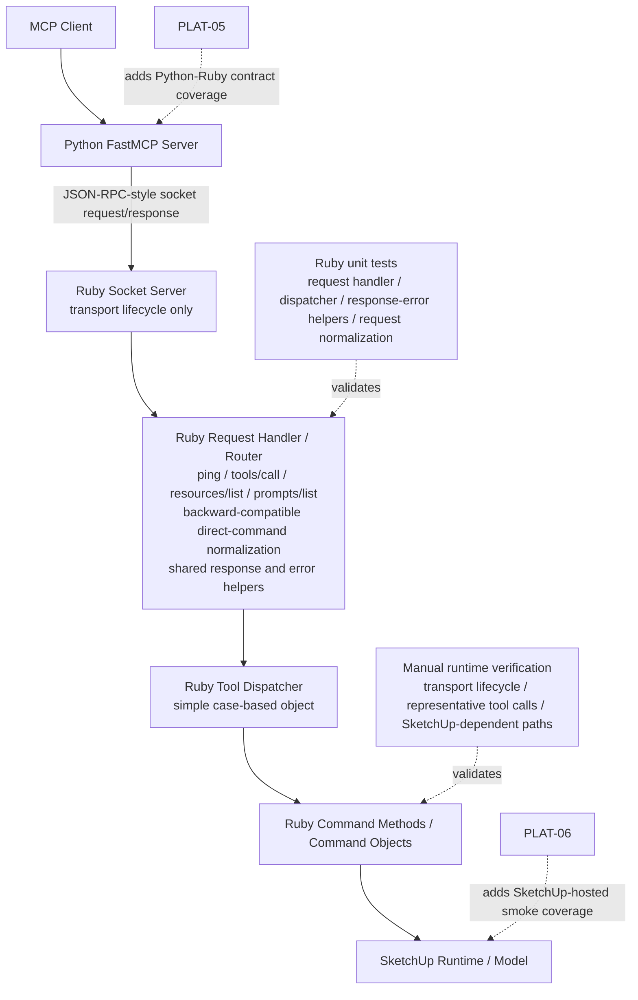

# Technical Plan: PLAT-01 Decompose Ruby Runtime Boundaries
**Task ID**: `PLAT-01`
**Title**: `Decompose Ruby Runtime Boundaries`
**Status**: `finalized`
**Date**: `2026-04-14`

## Source Task

- [Decompose Ruby Runtime Boundaries](./task.md)

## Problem Summary

The Ruby runtime already owns the correct behavior, but too much of that behavior is concentrated in [`src/su_mcp/socket_server.rb`](src/su_mcp/socket_server.rb). Transport ingress, JSON-RPC handling, bridge method routing, tool dispatch, cross-cutting result and error behavior, logging, and substantial command logic are all too close together. That concentration makes the Ruby side harder to review, harder to test, and harder to evolve without coupling infrastructure changes to behavior changes.

This task decomposes those Ruby runtime boundaries while preserving the current Ruby/Python ownership split, the bridge-facing contract, and the SketchUp extension packaging shape.

## Goals

- Separate Ruby transport ingress and request routing from Ruby command execution.
- Give shared Ruby runtime concerns explicit ownership outside the transport implementation.
- Preserve current bridge-facing behavior used by the Python adapter.
- Preserve the standard SketchUp loader and RBZ support-tree packaging shape.
- Create reviewable non-SketchUp seams and land the initial Ruby unit coverage for them inside this task.

## Non-Goals

- Implement new product-capability behavior.
- Redesign the Python MCP adapter or its MCP-facing tool contracts.
- Fully extract SketchUp adapters and serializers; that belongs to `PLAT-02`.
- Redefine the Python/Ruby bridge contract beyond compatibility-preserving cleanup.
- Rewrite the Ruby runtime into a speculative abstraction-heavy architecture.

## Related Context

- [Platform Architecture and Repo Structure](specifications/hlds/hld-platform-architecture-and-repo-structure.md)
- [Platform Tasks README](specifications/tasks/platform/README.md)
- [PLAT-02 Extract Ruby SketchUp Adapters and Serializers](specifications/tasks/platform/PLAT-02-extract-ruby-sketchup-adapters-and-serializers/task.md)
- [PLAT-05 Add Python/Ruby Contract Coverage](specifications/tasks/platform/PLAT-05-add-python-ruby-contract-coverage/task.md)
- [PLAT-06 Add SketchUp-Hosted Smoke and Fixture Coverage](specifications/tasks/platform/PLAT-06-add-sketchup-hosted-smoke-and-fixture-coverage/task.md)
- [SketchUp Extension Development Guidance](specifications/sketchup-extension-development-guidance.md)
- Current Ruby runtime hotspot: [socket_server.rb](src/su_mcp/socket_server.rb)
- Current bootstrap entrypoints: [su_mcp.rb](src/su_mcp.rb), [main.rb](src/su_mcp/main.rb), [extension.rb](src/su_mcp/extension.rb)

## Research Summary

- The platform HLD confirms the macro-architecture is already correct: one Ruby runtime inside SketchUp, one Python MCP adapter, one explicit socket boundary.
- The main architectural issue is concentration, not wrong ownership. The HLD explicitly identifies `socket_server.rb` as the Ruby hotspot to decompose.
- `PLAT-01` and `PLAT-02` are intentionally separate. This task should extract runtime ownership boundaries first and leave dedicated adapter and serializer ownership to `PLAT-02`.
- Unit coverage is part of this task's done-ness. `PLAT-01` should expose testable non-SketchUp seams and land focused tests for them rather than defer that verification to a follow-on cleanup task.
- `PLAT-05` and `PLAT-06` are deferred. This task should preserve the bridge contract and define manual runtime checks, but should not absorb contract-test or SketchUp-hosted smoke scope.
- SketchUp extension guidance reinforces two hard constraints for this work: keep the root loader small and preserve the standard RBZ layout of one loader plus one support tree.
- Current Ruby automated coverage is minimal. The only existing Ruby test is version alignment, so this task must define the first practical unit-test targets for extracted runtime logic.

## Refinement Summary

- Pass 1, initial shape:
  - identified the main decomposition boundary as transport lifecycle, request routing, shared runtime support, and command dispatch
  - kept the external JSON-RPC-style bridge contract stable
  - treated this task as Ruby-internal decomposition rather than adapter extraction or contract redesign
- Pass 2, challenge and simplification:
  - rejected a registry-style or plugin-style dispatcher as premature abstraction
  - chose a simple case-based dispatcher under YAGNI
  - rejected pulling broad serialization ownership into this task because that would blur into `PLAT-02`
  - tightened the boundary so shared runtime support owns envelopes/logging/error wrapping, while SketchUp-heavy helpers remain near command behavior
- Pass 3, sequencing and verification:
  - prioritized extracting non-SketchUp seams first so unit coverage can begin immediately
  - kept packaging-sensitive loader and support-tree behavior stable throughout the phases
  - defined a mixed verification model: Ruby unit tests for extracted runtime seams plus manual SketchUp verification for runtime-dependent paths
- Current implementation capture:
  - extracted read-oriented bridge commands into `scene_query_commands.rb` and a narrow `scene_query_serializer.rb` helper
  - preserved the existing top-level scene listing contract by intentionally reading `model.entities` for bridge-facing scene summaries and listings
  - rewired `SocketServer` dispatch so read/query commands route through the extracted seam while mutation-heavy commands remain in `socket_server.rb` for now

## Technical Decisions

### Data Model

- Keep the existing JSON-RPC-style request and response envelope as the external bridge contract.
- Introduce explicit Ruby-owned internal request and response handling boundaries, but do not introduce a new public payload model across runtimes.
- Normalize ownership around three internal categories:
  - transport/server lifecycle
  - request routing and bridge method handling
  - command dispatch and execution
- Keep serialization helpers near command behavior for now unless transport extraction requires a narrow shared helper. Broad serializer ownership is deferred to `PLAT-02`.

### API and Interface Design

- Keep [`SocketServer`](src/su_mcp/socket_server.rb) as the runtime entrypoint used by [`Main`](src/su_mcp/main.rb), but reduce it to server lifecycle and socket I/O responsibilities.
- Extract a dedicated Ruby request handler or router object responsible for:
  - direct-command backward compatibility
  - JSON-RPC method dispatch for `ping`, `tools/call`, `resources/list`, and `prompts/list`
  - request-id propagation into success and error responses
- Extract a simple case-based tool dispatcher object responsible for mapping tool names to command methods or command objects.
- Use YAGNI for dispatch: start with a single case-based dispatcher rather than a registration framework.
- Introduce explicit shared runtime support modules for:
  - response envelope shaping
  - runtime logging
  - common execution/error wrapping
- Keep public bridge method names and Python-visible tool names unchanged.

### Proposed Module Layout

- Keep the packaging-sensitive entrypoints unchanged:
  - [`src/su_mcp.rb`](src/su_mcp.rb)
  - [`src/su_mcp/main.rb`](src/su_mcp/main.rb)
  - [`src/su_mcp/extension.rb`](src/su_mcp/extension.rb)
- Evolve the Ruby support tree toward a small set of focused runtime modules under `src/su_mcp/`, for example:
  - `socket_server.rb` for transport lifecycle and socket I/O
  - a request handler/router module for bridge method handling
  - a dispatcher module for case-based tool selection
  - `scene_query_commands.rb` for read-oriented bridge commands that should no longer live in transport
  - `scene_query_serializer.rb` for narrow scene-query serialization support owned beside the extracted query seam
  - one or more shared runtime support modules for logging and response/error helpers
- Do not treat these filenames as rigid requirements. The required decision is ownership split, not a frozen file map.

### Error Handling

- Preserve current bridge-level behavior for parse errors, unknown methods, unknown tools, and command exceptions.
- Centralize JSON-RPC success and error response shaping so transport and dispatch code do not each invent their own envelopes.
- Keep request-id propagation consistent for both success and error responses, including backward-compatible direct-command paths.
- Continue returning JSON-serializable error payloads only.
- Avoid broad error taxonomy design unless needed for current centralization. The immediate goal is consistent ownership, not a large exception hierarchy.

### State Management

- Keep runtime state minimal and explicit:
  - `SocketServer` continues to own server lifecycle state such as host, port, running flag, server instance, and timer id.
  - request handlers and dispatchers should be effectively stateless across requests
  - command execution continues to rely on live SketchUp runtime state when needed
- Do not move SketchUp model state into shared caches or long-lived runtime registries as part of this task.

### Integration Points

- Python continues to send JSON-RPC-style requests over the socket boundary and expects structured responses.
- [`main.rb`](src/su_mcp/main.rb) continues to build and start the socket server without owning routing or command behavior.
- Packaging and release flows continue to rely on the `src/su_mcp.rb` loader and the `src/su_mcp/` support tree remaining packageable under current RBZ rules.
- Later tasks integrate with this structure as follows:
  - `PLAT-02` can extract adapter and serializer ownership from the decomposed command layer
  - `PLAT-03` can align the Python side to the clarified Ruby boundary

### Configuration

- Preserve current environment-driven bridge configuration in [`bridge.rb`](src/su_mcp/bridge.rb).
- Do not introduce new configuration sources unless required by the extraction.
- Any new shared runtime helpers should consume existing configuration values rather than defining parallel config mechanisms.
- Preserve current defaults for host, port, and transport assumptions.

### Deferred Decisions and Open Questions

- The dispatcher should start as a case-based object in this task. Whether that later becomes a registry is intentionally deferred until command growth justifies it.
- Serialization helpers should stay near command behavior unless transport extraction forces a minimal helper move. Broad serializer ownership is deferred to `PLAT-02`.
- The exact filenames and module nesting under `src/su_mcp/` are still flexible as long as the runtime owners become reviewable separately.
- Contract-test depth remains deferred to `PLAT-05`; this task only needs compatibility-preserving behavior plus representative checks.

## Architecture Context

## Key Relationships

- [`Main`](src/su_mcp/main.rb) should depend on the server entrypoint, not on request routing or command behavior details.
- The socket server should depend on a request handler boundary rather than owning JSON-RPC method behavior directly.
- The request handler should depend on shared response/error helpers and the dispatcher.
- The dispatcher should own tool-name-to-command selection, but not socket I/O or transport parsing.
- Command behavior remains Ruby-owned and SketchUp-facing, preserving the architectural boundary the HLD requires.
- Packaging and release support depend on the support-tree layout, not on a fixed small file count.

## Acceptance Criteria

- Ruby transport lifecycle code is structurally separate from request routing and command execution when the runtime is reviewed.
- A single Ruby-owned request handling boundary accepts the current supported request shapes and produces structured JSON-RPC-style responses.
- A single Ruby-owned dispatcher boundary selects command behavior for supported tools without requiring transport code to contain the tool-selection logic.
- Shared runtime concerns for response shaping, logging, and common execution/error handling are owned outside individual transport and command paths.
- Existing Python tool calls remain behaviorally compatible with the Ruby bridge for supported methods, including request-id propagation and structured error responses.
- The root SketchUp loader and RBZ package layout remain valid under existing packaging verification.
- New non-SketchUp Ruby runtime seams are covered by automated unit tests without requiring a live SketchUp runtime.
- Representative runtime checks confirm at least one read path, one mutation path, and one error path still behave correctly after the refactor.
- The chosen decomposition remains intentionally smaller than full adapter extraction and does not absorb work reserved for `PLAT-02`, `PLAT-05`, or `PLAT-06`.

## Test Strategy

### TDD Approach

- Extract non-SketchUp runtime behavior behind small seams before moving large command bodies.
- Add or update Ruby unit tests for each extracted shared runtime concern before or alongside the refactor that depends on it.
- Favor narrow tests around request normalization, routing, dispatch, and response shaping first, because those can be validated without SketchUp.
- Use manual runtime verification to guard SketchUp-dependent command execution while adapter extraction and deeper automation are still deferred.

### Required Test Coverage

- Ruby unit tests for request normalization:
  - direct `command` request conversion
  - `tools/call` passthrough
  - supported bridge methods
- Ruby unit tests for response behavior:
  - success envelopes
  - parse error behavior
  - unknown method handling
  - unknown tool handling
  - exception-to-error-response handling
  - request-id propagation
- Ruby unit tests for the simple case-based dispatcher:
  - supported tool selection
  - unsupported tool failure path
- Ruby unit tests for the extracted scene-query seam:
  - `list_resources` continues to enumerate top-level model entities rather than the active edit context
  - `get_scene_info` reports top-level counts and serialized entities using the extracted query/serialization boundary
  - `list_entities` continues to filter hidden top-level entities by default
  - `get_entity_info` still resolves by model id lookup and returns serialized group metadata
- Existing quality gates:
  - `bundle exec rake ruby:lint`
  - `bundle exec rake ruby:test`
  - `bundle exec rake package:verify`
- Manual runtime verification in SketchUp:
  - extension loads and menu wiring still works
  - socket bridge starts successfully
  - `ping` succeeds
  - `get_scene_info` or equivalent read path succeeds
  - `create_component` or equivalent mutation path succeeds
  - unknown tool or missing-entity path returns a structured error

## Implementation Phases

1. Extract shared runtime support modules for logging, response shaping, and common execution/error wrapping, with Ruby unit tests for the extracted non-SketchUp behavior.
2. Extract request parsing and JSON-RPC method routing into a dedicated handler that preserves backward-compatible request shapes and current supported bridge methods.
3. Extract a simple case-based tool dispatcher and rewire tool selection away from the transport implementation while keeping current command behavior intact.
4. Thin the socket server down to lifecycle and socket I/O responsibilities, update bootstrap wiring if needed, and keep packaging-sensitive entrypoints stable.
5. Add or refine unit coverage for the extracted runtime seams, then run Ruby lint, Ruby tests, packaging verification, and representative manual SketchUp checks.

## Implementation Outcome

- Completed in this task:
  - extracted read/query bridge behavior into `SceneQueryCommands`
  - extracted narrow scene-query serialization support into `SceneQuerySerializer`
  - rewired `SocketServer` and `ToolDispatcher` so `get_scene_info`, `list_entities`, `get_entity_info`, `get_selection`, and `resources/list` use the extracted read/query seam
  - added Ruby unit coverage that locks the top-level entity contract and multi-target dispatcher wiring
  - validated with `bundle exec rubocop Gemfile Rakefile rakelib test src/su_mcp`, `bundle exec rake ruby:test`, and `bundle exec rake package:verify`

## Follow-On Notes

- Mutation-heavy command behavior still lives in `socket_server.rb`; further extraction continues in the platform follow-on work rather than in this task closure.
- Representative live SketchUp smoke verification remains useful for operational confidence and is better covered by the downstream SketchUp-hosted validation work.
- Any further runtime decomposition should stay on the runtime-boundary side of the line and avoid absorbing the broader adapter/serializer ownership reserved for `PLAT-02`.

## Risks and Mitigations

- Bridge contract regression: preserve current request and response shapes and verify representative Python-to-Ruby flows manually after refactoring.
- Scope bleed into `PLAT-02`: keep serialization helpers and SketchUp API-heavy logic near command behavior unless a move is required to remove transport ownership.
- Overengineering the dispatcher: use a simple case-based object now and defer registries or plugin-style command registration until a later task justifies them.
- Weak automated safety net during refactor: add unit coverage for newly extracted non-SketchUp seams as part of the task instead of relying only on manual testing.
- Packaging regression: keep the root loader and support-tree layout intact and run `package:verify` before completion.
- Runtime-only failures hidden by unit tests: include manual SketchUp checks for startup, read, mutation, and error paths.

## Dependencies

- Revised platform HLD: [Platform Architecture and Repo Structure](specifications/hlds/hld-platform-architecture-and-repo-structure.md)
- Existing Ruby runtime entrypoints and packaging files:
  - [su_mcp.rb](src/su_mcp.rb)
  - [main.rb](src/su_mcp/main.rb)
  - [extension.rb](src/su_mcp/extension.rb)
  - [extension.json](src/su_mcp/extension.json)
  - [release_support.rb](rakelib/release_support.rb)
- Existing Ruby/Python bridge compatibility implied by [server.py](python/src/sketchup_mcp_server/server.py)
- Ruby lint/test/package tasks in [Rakefile](Rakefile) and [rakelib/ruby.rake](rakelib/ruby.rake)
- Follow-on sequencing with `PLAT-02`, `PLAT-03`, `PLAT-05`, and `PLAT-06`
- A live SketchUp runtime for final manual verification of runtime-dependent behavior

## Quality Checks

- [x] All required inputs validated
- [x] Problem statement documented
- [x] Goals and non-goals documented
- [x] Research summary documented
- [x] Technical decisions included
- [x] Architecture context included
- [x] Acceptance criteria included
- [x] Test requirements specified
- [x] Risks and dependencies documented
- [x] Small reversible phases defined
