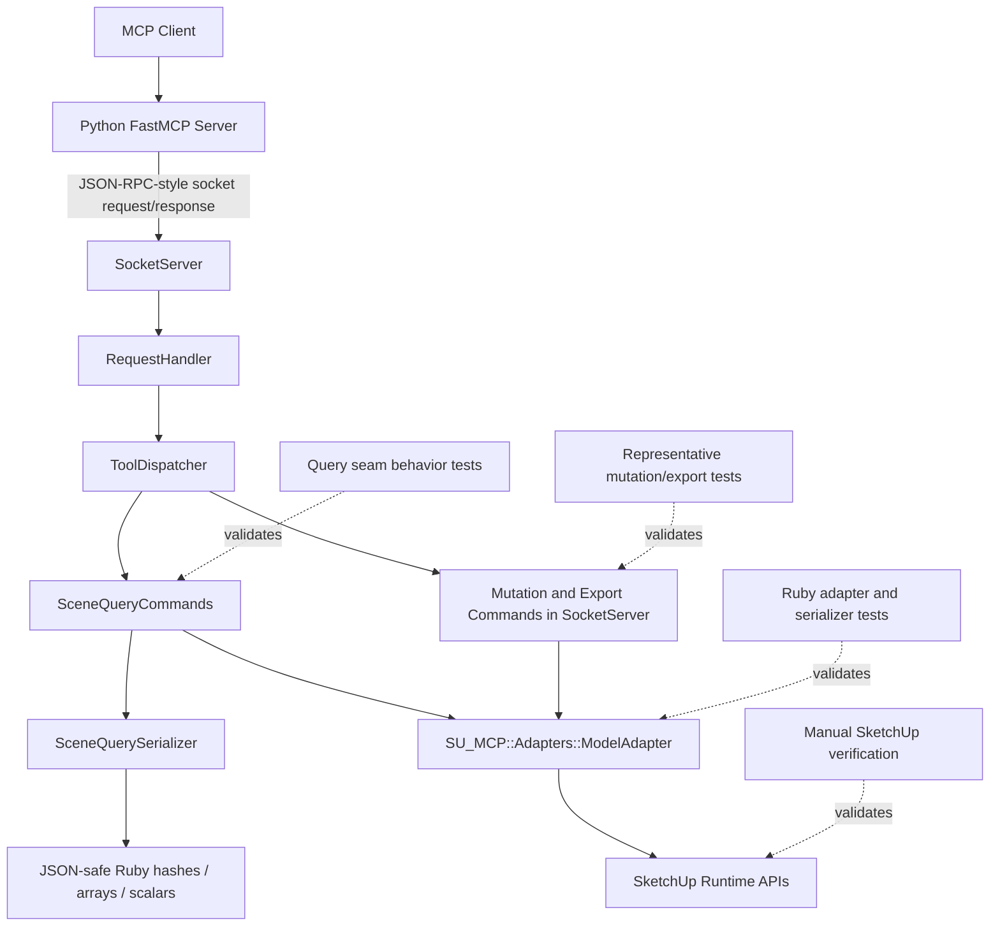

# Technical Plan: PLAT-02 Extract Ruby SketchUp Adapters and Serializers
**Task ID**: `PLAT-02`
**Title**: `Extract Ruby SketchUp Adapters and Serializers`
**Status**: `draft`
**Date**: `2026-04-14`

## Source Task

- [Extract Ruby SketchUp Adapters and Serializers](./task.md)

## Problem Summary

`PLAT-01` has already decomposed the Ruby runtime into clearer transport and command seams, but repeated low-level SketchUp API access still remains concentrated in shared read and mutation/export paths. The remaining hotspot is no longer the whole runtime shape; it is the repeated use of `Sketchup.active_model`, direct `find_entity_by_id(...)` lookups, collection access, and export mechanics across multiple Ruby command surfaces.

This task extracts a reusable Ruby adapter boundary for those direct SketchUp interactions and builds on the serializer seam that already exists for scene-query responses. The goal is to make those low-level concerns explicit and reusable without redoing `PLAT-01`, redesigning transport, or turning this task into a broad geometry refactor.

## Goals

- Extract explicit Ruby adapter ownership for direct SketchUp API access used by shared read, lookup, mutation, and export paths.
- Build on the existing serializer seam so touched SketchUp-derived payloads remain explicit, reusable, and JSON-safe.
- Reduce repeated low-level model and entity access logic in the Ruby command surfaces that survived `PLAT-01`.
- Preserve existing bridge-visible tool names, response shapes, and current read-path behavior for the touched flows.
- Leave a reusable Ruby adapter and serializer shape that later capability work can consume without inventing new low-level ownership patterns.

## Non-Goals

- Re-run `PLAT-01` by redesigning request routing, dispatcher ownership, or transport structure.
- Move SketchUp-facing behavior into Python or add Python-side platform logic.
- Replace the existing serializer seam with a speculative serializer framework or deep hierarchy.
- Rewrite geometry-heavy command implementations just to maximize adapter purity.
- Change exposed tool names or bridge-visible payload semantics beyond compatibility-preserving cleanup.

## Related Context

- [PLAT-02 Task](./task.md)
- [Platform Architecture and Repo Structure](specifications/hlds/hld-platform-architecture-and-repo-structure.md)
- [PLAT-01 Decompose Ruby Runtime Boundaries Task](specifications/tasks/platform/PLAT-01-decompose-ruby-runtime-boundaries/task.md)
- [PLAT-01 Technical Plan](specifications/tasks/platform/PLAT-01-decompose-ruby-runtime-boundaries/plan.md)
- [PLAT-06 Add SketchUp-Hosted Smoke and Fixture Coverage Task](specifications/tasks/platform/PLAT-06-add-sketchup-hosted-smoke-and-fixture-coverage/task.md)
- [SketchUp Extension Development Guidance](specifications/sketchup-extension-development-guidance.md)
- Current Ruby command surfaces:
  - [src/su_mcp/socket_server.rb](src/su_mcp/socket_server.rb)
  - [src/su_mcp/scene_query_commands.rb](src/su_mcp/scene_query_commands.rb)
- Current serializer baseline: [src/su_mcp/scene_query_serializer.rb](src/su_mcp/scene_query_serializer.rb)
- Ruby validation entrypoints:
  - [Rakefile](Rakefile)
  - [rakelib/ruby.rake](rakelib/ruby.rake)

## Research Summary

- `PLAT-01` is implemented and done. The current Ruby runtime already contains decomposed seams such as [src/su_mcp/request_handler.rb](src/su_mcp/request_handler.rb), [src/su_mcp/request_processor.rb](src/su_mcp/request_processor.rb), [src/su_mcp/tool_dispatcher.rb](src/su_mcp/tool_dispatcher.rb), [src/su_mcp/scene_query_commands.rb](src/su_mcp/scene_query_commands.rb), and [src/su_mcp/scene_query_serializer.rb](src/su_mcp/scene_query_serializer.rb).
- The platform HLD still points Ruby toward explicit SketchUp adapter ownership while keeping Python thin at the MCP boundary.
- Serializer extraction is no longer hypothetical. `SceneQuerySerializer` is already the serializer baseline for the scene-query seam and should be built on rather than ignored or duplicated.
- The strongest remaining extraction targets are the repeated low-level SketchUp mechanics still visible mostly in [src/su_mcp/socket_server.rb](src/su_mcp/socket_server.rb):
  - `Sketchup.active_model`
  - direct `find_entity_by_id(...)`
  - top-level and selection collection access
  - export mechanics in `export_scene`
- The current Ruby test and lint baseline is no longer minimal. Project-level Ruby validation already exists through `ruby:test`, `ruby:lint`, and `package:verify`, and `PLAT-02` should preserve those gates rather than plan around a narrow validation model.
- `PLAT-01` follow-on notes deliberately left broader adapter and serializer ownership to `PLAT-02`, while warning against turning this task back into another transport-layer refactor.

## Technical Decisions

### Data Model

- Keep the existing JSON-RPC-style bridge envelope unchanged.
- Keep live SketchUp objects inside Ruby adapter boundaries only.
- Keep serializer ownership responsible for converting SketchUp-derived values into JSON-safe hashes, arrays, strings, numbers, booleans, and `nil`.
- Keep tool-specific success payload composition close to the command behavior rather than moving whole response envelopes into adapters or serializers.

### API and Interface Design

- Introduce a shared adapter boundary at [src/su_mcp/adapters/model_adapter.rb](src/su_mcp/adapters/model_adapter.rb) as `SU_MCP::Adapters::ModelAdapter`.
- Keep the existing serializer baseline at [src/su_mcp/scene_query_serializer.rb](src/su_mcp/scene_query_serializer.rb) for this task rather than renaming or relocating it immediately.
- `SU_MCP::Adapters::ModelAdapter` should own:
  - `active_model!`
  - `find_entity!(id)`
  - `top_level_entities(include_hidden: false)` with hidden-entity filtering behavior that matches the current `SceneQueryCommands` default
  - `selected_entities`
  - `export_scene(format:, width: nil, height: nil)`
- Rewire [src/su_mcp/scene_query_commands.rb](src/su_mcp/scene_query_commands.rb) to use adapter-owned model and lookup access while preserving current serializer usage.
- Rewire representative mechanical paths in [src/su_mcp/socket_server.rb](src/su_mcp/socket_server.rb) to use the shared adapter, starting with:
  - `delete_component`
  - `transform_component`
  - `set_material` (dispatched to `apply_material`)
  - `export_scene`
- Do not force immediate adapter extraction across geometry-heavy joint and boolean operations unless the leftover substitutions remain obviously mechanical after the representative set lands.

### Error Handling

- Preserve existing Ruby exception messages where callers already depend on them, especially:
  - `"No active SketchUp model"`
  - `"Entity not found"`
  - current unsupported export format or exporter-availability failures
- Let `ModelAdapter` raise Ruby exceptions with those existing message semantics.
- Keep JSON-RPC error-envelope ownership in the higher runtime layer established by `PLAT-01`.
- Keep serializer code pure and non-rescuing except for compatibility-preserving defensive checks already implied by current behavior.

### State Management

- Keep `ModelAdapter` and `SceneQuerySerializer` stateless.
- Do not introduce caches, registries, or long-lived adapter state.
- Continue resolving live SketchUp state at call time through `Sketchup.active_model` and entities returned from it.

### Integration Points

- `PLAT-02` builds on the post-`PLAT-01` runtime shape rather than assuming one all-in-one runtime hotspot.
- `SceneQueryCommands` becomes the read-oriented consumer of `ModelAdapter` plus `SceneQuerySerializer`.
- `SocketServer` remains a consumer for representative mutation and export paths that still own direct SketchUp mechanics.
- `ToolDispatcher`, `RequestHandler`, `RequestProcessor`, and response-envelope ownership remain unchanged by this task.
- Python remains unchanged and continues to depend only on stable Ruby bridge responses.

### Configuration

- Preserve current bridge configuration ownership in [src/su_mcp/bridge.rb](src/su_mcp/bridge.rb).
- Preserve current export temp-directory behavior and option defaults unless moving them into `ModelAdapter` is necessary to keep export behavior coherent.
- Do not add new configuration sources for this task.

## Architecture Context

## Key Relationships

- [src/su_mcp/scene_query_commands.rb](src/su_mcp/scene_query_commands.rb) is now part of the baseline architecture and should be treated as the primary read-command seam that `PLAT-02` builds on.
- [src/su_mcp/scene_query_serializer.rb](src/su_mcp/scene_query_serializer.rb) is the current serializer owner and should remain the baseline unless a later task deliberately relocates it.
- `SU_MCP::Adapters::ModelAdapter` owns shared direct SketchUp model and entity access for the targeted concern set.
- [src/su_mcp/socket_server.rb](src/su_mcp/socket_server.rb) remains a mutation/export command surface, not the whole runtime architecture.
- Python continues to depend only on bridge-compatible request and response contracts and should not need any logic change for this task.

## Acceptance Criteria

- Direct SketchUp API access for shared active-model access, entity lookup, top-level or selection collection access, and export behavior is owned by an explicit Ruby adapter boundary rather than being repeated across command implementations.
- The existing read-query seam preserves current bridge-visible behavior after adapter rewiring, including top-level scene enumeration semantics, entity lookup behavior, and JSON-safe scene or entity payloads.
- Representative mutation and export paths use the extracted adapter boundary for mechanical model or entity access without changing exposed tool names or representative response shapes.
- Existing serializer ownership for entity- and bounds-oriented payload shaping remains explicit and reusable, and touched paths continue returning only JSON-serializable values.
- Missing-model, missing-entity, and unsupported-export-format failures remain clearly surfaced through the existing higher-level runtime error path rather than being swallowed or remapped inconsistently inside adapters.
- The task remains a targeted adapter and serializer ownership improvement and does not expand into a broad geometry rewrite, transport redesign, or Python-side behavior shift.
- The touched Ruby seams are covered by automated tests at the smallest practical layer, and the project-level Ruby validation gates continue to pass.
- The resulting adapter and serializer shape is reusable by later capability work without requiring new low-level SketchUp API extraction in each feature task.

## Test Strategy

### TDD Approach

- Add adapter tests first for `active_model!`, `find_entity!`, collection access, and export decision or error behavior where stable doubles are sufficient.
- Preserve the existing query-seam tests as integration guards while rewiring `SceneQueryCommands` to consume the adapter.
- Rewire the representative mutation and export paths in small slices and add focused tests around each rewired path.
- Keep final validation honest and project-level rather than narrowing checks to touched files only.
- Use manual SketchUp verification to confirm runtime-dependent behavior that still depends on live exporter availability or SketchUp-hosted execution.

### Required Test Coverage

- Ruby unit tests for [src/su_mcp/adapters/model_adapter.rb](src/su_mcp/adapters/model_adapter.rb):
  - missing active model
  - entity lookup success and failure
  - top-level entity collection behavior
  - selection access behavior
  - export decision and representative failure handling where deterministic
- Existing and extended Ruby integration tests for [src/su_mcp/scene_query_commands.rb](src/su_mcp/scene_query_commands.rb) to confirm current scene-query behavior still holds after adapter rewiring.
- Focused Ruby tests for the representative rewired paths in [src/su_mcp/socket_server.rb](src/su_mcp/socket_server.rb):
  - `delete_component`
  - `transform_component`
  - `set_material`
  - `export_scene`
- Ruby test execution via `bundle exec rake ruby:test`.
- Ruby lint verification via `bundle exec rake ruby:lint`.
- Packaging verification via `bundle exec rake package:verify`.
- Manual SketchUp verification of:
  - extension load and startup still working
  - one read path such as `get_scene_info` or `list_entities`
  - one lookup path such as `get_entity_info`
  - one simple mutate path such as `set_material` or `transform_component`
  - one export path such as `export_scene`
  - one error path for missing entity or unsupported format

## Implementation Phases

1. Add `SU_MCP::Adapters::ModelAdapter` with small focused tests for active model access, entity lookup, collection access, and export-facing behavior.
2. Rewire [src/su_mcp/scene_query_commands.rb](src/su_mcp/scene_query_commands.rb) to consume the adapter while preserving [src/su_mcp/scene_query_serializer.rb](src/su_mcp/scene_query_serializer.rb) as the serializer owner, then run the existing query-seam tests.
3. Rewire representative mechanical mutation and export paths in [src/su_mcp/socket_server.rb](src/su_mcp/socket_server.rb) to use `ModelAdapter`, adding focused tests as each path moves.
4. Reassess the remaining repeated lookup sites; only include additional substitutions if they are still obviously mechanical and do not drag the task into geometry-heavy refactoring.
5. Run `bundle exec rake ruby:test`, `bundle exec rake ruby:lint`, and `bundle exec rake package:verify`, then perform representative manual SketchUp verification and document any remaining runtime-only gaps.

## Risks and Mitigations

- Bridge compatibility regression: keep tool names, response shapes, and established exception semantics stable for touched paths; preserve the existing query-seam tests and add representative mutation/export checks before broadening rewiring.
- Scope bleed into geometry-heavy refactoring: limit the initial rewiring set to mechanical model, lookup, and export concerns; defer boolean and joint-heavy cleanup unless the remaining substitutions are trivial.
- Shared adapter overreach: keep `ModelAdapter` small and mechanical; do not let it absorb command orchestration, response composition, or serializer duties.
- Export-path runtime fragility: centralize export mechanics in the adapter, but keep manual SketchUp verification for exporter availability and environment-specific behavior.
- Weak or unrealistic tests: prefer the smallest practical unit boundary first, reuse the current Ruby test harness and SketchUp stubs, and avoid inventing oversized fake infrastructure when the read seam already provides stable integration coverage.
- Follow-on architecture drift: keep the plan aligned to the implemented `PLAT-01` seams so `PLAT-02` builds on current code reality rather than reintroducing a hotspot-first model.

## Dependencies

- Implemented runtime-boundary seams from [PLAT-01 Decompose Ruby Runtime Boundaries](specifications/tasks/platform/PLAT-01-decompose-ruby-runtime-boundaries/task.md) and [PLAT-01 Technical Plan](specifications/tasks/platform/PLAT-01-decompose-ruby-runtime-boundaries/plan.md)
- Platform ownership rules in [specifications/hlds/hld-platform-architecture-and-repo-structure.md](specifications/hlds/hld-platform-architecture-and-repo-structure.md)
- Current Ruby command and serializer surfaces in:
  - [src/su_mcp/socket_server.rb](src/su_mcp/socket_server.rb)
  - [src/su_mcp/scene_query_commands.rb](src/su_mcp/scene_query_commands.rb)
  - [src/su_mcp/scene_query_serializer.rb](src/su_mcp/scene_query_serializer.rb)
- Current extension bootstrap and packaging files in:
  - [src/su_mcp.rb](src/su_mcp.rb)
  - [src/su_mcp/main.rb](src/su_mcp/main.rb)
  - [src/su_mcp/extension.rb](src/su_mcp/extension.rb)
  - [src/su_mcp/extension.json](src/su_mcp/extension.json)
- Ruby validation entrypoints in:
  - [Rakefile](Rakefile)
  - [rakelib/ruby.rake](rakelib/ruby.rake)
  - existing Ruby tests under [test/](test)
- A live SketchUp runtime for final export and runtime-behavior confirmation
- Future SketchUp-hosted smoke coverage expected from [PLAT-06 Add SketchUp-Hosted Smoke and Fixture Coverage](specifications/tasks/platform/PLAT-06-add-sketchup-hosted-smoke-and-fixture-coverage/task.md)

## Quality Checks

- [x] All required inputs validated
- [x] Problem statement documented
- [x] Goals and non-goals documented
- [x] Research summary documented
- [x] Technical decisions included
- [x] Architecture context included
- [x] Acceptance criteria included
- [x] Test requirements specified
- [x] Risks and dependencies documented
- [x] Small reversible phases defined
