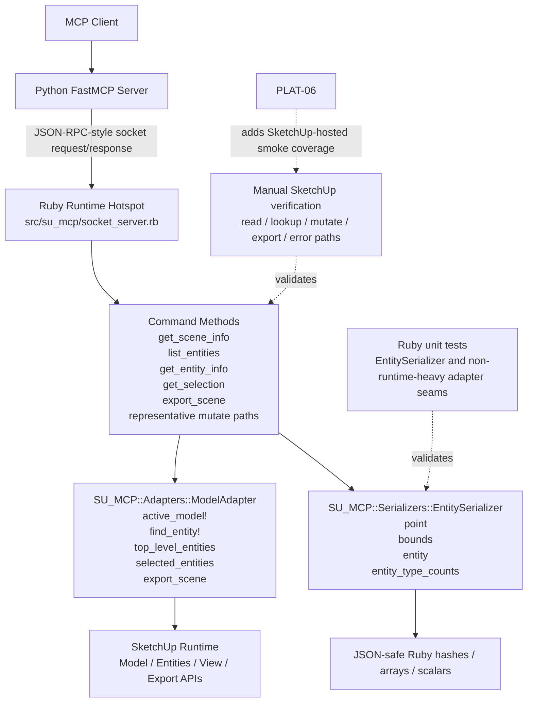

# Technical Plan: PLAT-02 Extract Ruby SketchUp Adapters and Serializers
**Task ID**: `PLAT-02`
**Title**: `Extract Ruby SketchUp Adapters and Serializers`
**Status**: `draft`
**Date**: `2026-04-13`

## Source Task

- [Extract Ruby SketchUp Adapters and Serializers](./task.md)

## Problem Summary

Direct SketchUp API usage, entity lookup, export helpers, and JSON-safe result shaping are still embedded in the current Ruby runtime hotspot at [src/su_mcp/socket_server.rb](src/su_mcp/socket_server.rb). That keeps read, mutation, and export paths coupled to low-level SketchUp mechanics and leaves reusable serialization behavior without an explicit platform owner.

This task extracts two simple Ruby-owned boundaries:

- a SketchUp adapter boundary for active-model and entity-facing API access
- a serializer boundary for JSON-safe SketchUp-derived payload shaping

The goal is to make those reusable without turning this task into another runtime-boundary refactor or a speculative framework exercise.

## Goals

- Extract explicit Ruby adapter ownership for direct SketchUp API access used by representative read, lookup, mutation, and export paths.
- Extract explicit Ruby serializer ownership for JSON-safe payload shaping derived from SketchUp objects.
- Reduce repeated low-level SketchUp lookup and serialization mechanics in the current runtime hotspot.
- Preserve the current Ruby-to-Python bridge behavior for the touched tool paths.
- Create reviewable Ruby seams that support incremental automated coverage growth.

## Non-Goals

- Re-run `PLAT-01` by redesigning transport, request routing, or dispatcher ownership.
- Redesign the Python MCP adapter or move SketchUp-facing logic into Python.
- Extract every geometry-heavy or behavior-heavy helper in one pass.
- Introduce an adapter registry, serializer framework, or deep class hierarchy.
- Change exposed tool names or bridge-visible payload shapes beyond compatibility-preserving cleanup.

## Related Context

- [Platform Architecture and Repo Structure](specifications/hlds/hld-platform-architecture-and-repo-structure.md)
- [PLAT-02 Task](./task.md)
- [PLAT-01 Decompose Ruby Runtime Boundaries Task](specifications/tasks/platform/PLAT-01-decompose-ruby-runtime-boundaries/task.md)
- [PLAT-01 Technical Plan](specifications/tasks/platform/PLAT-01-decompose-ruby-runtime-boundaries/plan.md)
- [PLAT-06 Add SketchUp-Hosted Smoke and Fixture Coverage Task](specifications/tasks/platform/PLAT-06-add-sketchup-hosted-smoke-and-fixture-coverage/task.md)
- [SketchUp Extension Development Guidance](specifications/sketchup-extension-development-guidance.md)
- Current Ruby hotspot: [src/su_mcp/socket_server.rb](src/su_mcp/socket_server.rb)
- Current Ruby bootstrap entrypoint: [src/su_mcp/main.rb](src/su_mcp/main.rb)
- Ruby lint/test tasks: [Rakefile](Rakefile), [rakelib/ruby.rake](rakelib/ruby.rake)

## Research Summary

- The platform HLD already defines the desired ownership: SketchUp API usage and SketchUp-derived serialization remain Ruby-owned, while Python stays a thin MCP adapter.
- `PLAT-01` and `PLAT-02` are intentionally separate. `PLAT-01` is the runtime-boundary decomposition task; `PLAT-02` is the follow-on extraction of reusable SketchUp adapters and serializers.
- `PLAT-01` is not implemented baseline. Its task is still not done, so its `plan.md` is design guidance and dependency context, not proof that code already landed.
- The current codebase still contains no adapter or serializer subtree under `src/su_mcp/`.
- The strongest extraction candidates in [src/su_mcp/socket_server.rb](src/su_mcp/socket_server.rb) are:
  - repeated direct entity lookup via `model.find_entity_by_id(...)`
  - reusable read-path collection access for scene, top-level entities, and selection
  - export mechanics in `export_scene`
  - reusable JSON-safe helpers `safe_float`, `point_to_a`, `bounds_to_h`, `serialize_entity`, and `entity_type_counts`
- Current Ruby automated coverage is minimal. The only existing Ruby test is [test/version_test.rb](test/version_test.rb), so this task should add initial extracted-boundary coverage rather than assume it exists.
- Current Ruby linting scope is narrow in [rakelib/ruby.rake](rakelib/ruby.rake) and does not cover new Ruby source files beyond `src/su_mcp/version.rb`. That is an implementation consideration and should be updated or called out as a gap.

## Technical Decisions

### Data Model

- Keep the existing JSON-RPC-style bridge request and response envelope unchanged.
- Keep live SketchUp objects inside Ruby adapter boundaries only.
- Make serializer boundaries responsible for converting SketchUp-derived data into JSON-safe hashes, arrays, strings, numbers, booleans, and `nil`.
- Keep command-level success payload assembly such as `{ success: true, ... }` outside the serializer so payload composition remains close to tool behavior.

### API and Interface Design

- Introduce the following first-cut file and namespace shape:
  - [src/su_mcp/adapters/model_adapter.rb](src/su_mcp/adapters/model_adapter.rb) -> `SU_MCP::Adapters::ModelAdapter`
  - [src/su_mcp/serializers/entity_serializer.rb](src/su_mcp/serializers/entity_serializer.rb) -> `SU_MCP::Serializers::EntitySerializer`
- Keep both as simple modules using `module_function`.
- `SU_MCP::Adapters::ModelAdapter` should own:
  - `active_model!`
  - `find_entity!(id)`
  - `top_level_entities(include_hidden: false)`
  - `selected_entities`
  - `export_scene(format:, width: nil, height: nil)`
- `SU_MCP::Serializers::EntitySerializer` should own:
  - `safe_float(value)`
  - `point(point3d)`
  - `bounds(bounds)`
  - `entity(entity)`
  - `entity_type_counts(entities)`
- Keep export in `ModelAdapter` for now because it is still active-model-driven SketchUp API work and does not justify a separate adapter yet.
- Rewire the current Ruby runtime to call these modules directly from the existing command methods in [src/su_mcp/socket_server.rb](src/su_mcp/socket_server.rb).
- Reuse `ModelAdapter.find_entity!` in obvious repeated direct-lookup call sites, but do not force noisy rewrites of geometry-heavy command bodies just to satisfy abstraction purity.

### Error Handling

- Preserve current bridge-visible error messages where they already exist, especially:
  - `"No active SketchUp model"`
  - `"Entity not found"`
  - existing unsupported export format failures
- Let adapter functions raise Ruby exceptions with those message texts.
- Keep JSON-RPC error-envelope ownership in the higher runtime layer rather than in adapters or serializers.
- Keep serializers pure and non-rescuing except for defensive nil or validity checks already implied by current behavior.

### State Management

- Keep `ModelAdapter` and `EntitySerializer` stateless.
- Do not introduce caches, registries, or long-lived runtime state.
- Continue relying on live SketchUp runtime state at call time through `Sketchup.active_model` and entities returned from it.

### Integration Points

- `socket_server.rb` remains the current integration point for this task because `PLAT-01` is not implemented yet.
- Representative read paths should call the new boundaries:
  - `get_scene_info`
  - `list_entities`
  - `get_entity_info`
  - `get_selection`
- `export_scene` should delegate SketchUp export mechanics to `ModelAdapter`.
- Obvious repeated direct lookup in representative mutation paths should reuse `find_entity!`, including:
  - `delete_component`
  - `transform_component`
  - `set_material`
  - similar simple repeated `find_entity_by_id(...)` call sites where the change is mechanical
- If `PLAT-01` lands later, the same extracted modules should become dependencies of the decomposed command layer without redesign.

### Configuration

- Preserve current bridge configuration ownership in [src/su_mcp/bridge.rb](src/su_mcp/bridge.rb).
- Preserve current export temp-directory behavior and option defaults unless centralizing them inside `ModelAdapter` is necessary for extraction clarity.
- Do not add new configuration sources for this task.

## Architecture Context

## Key Relationships

- [src/su_mcp/socket_server.rb](src/su_mcp/socket_server.rb) remains the immediate caller of the new boundaries until `PLAT-01` implementation changes that runtime shape.
- `ModelAdapter` owns direct active-model and entity-facing SketchUp API access for the extracted concern set.
- `EntitySerializer` owns JSON-safe payload shaping for entity and bounds data used by representative bridge responses.
- Higher-level command methods continue to own tool-specific response composition and workflow decisions.
- Python remains unchanged in behavior for this task and continues to depend only on stable Ruby bridge responses.

## Acceptance Criteria

- Direct SketchUp API access for representative read, entity lookup, and export paths is owned by explicit Ruby adapter code rather than embedded directly in the primary runtime hotspot.
- JSON-safe serialization for representative entity and bounds payloads is owned by explicit reusable Ruby serializer code rather than ad hoc helper methods in the runtime hotspot.
- `get_scene_info`, `list_entities`, `get_entity_info`, and `get_selection` use the extracted serializer boundary for entity-oriented payload shaping.
- `export_scene` uses the extracted adapter boundary for active-model export mechanics.
- Repeated direct entity lookup in representative simple mutation paths is centralized through the extracted adapter boundary where the substitution is mechanical.
- Existing Python-visible tool names and representative response shapes remain behaviorally compatible for touched paths.
- Missing-model, missing-entity, and unsupported-export-format failure behavior remains clearly surfaced through the existing higher-level bridge error handling path.
- The extraction stops short of a broad geometry or command-layer rewrite and remains small enough to review as a targeted ownership improvement.

## Test Strategy

### TDD Approach

- Extract pure serializer behavior first and add tests for it before or alongside rewiring the read paths that depend on it.
- Extract the adapter boundary second and keep its first scope small enough that representative behavior can be verified with narrow tests or runtime checks.
- Prefer low-risk, reversible rewiring in read paths before applying adapter lookup reuse to representative mutation paths.
- Use manual SketchUp verification for runtime-dependent behavior that is not yet practical to cover with deterministic unit tests.

### Required Test Coverage

- Ruby unit tests for [src/su_mcp/serializers/entity_serializer.rb](src/su_mcp/serializers/entity_serializer.rb):
  - float normalization
  - point serialization
  - bounds serialization
  - entity serialization for basic entity-like and group/component-like doubles
  - entity type counting
- Narrow Ruby tests for any non-runtime-heavy `ModelAdapter` behavior that can be exercised with doubles without building brittle fake-SketchUp infrastructure.
- Ruby test execution via `bundle exec rake ruby:test`.
- Packaging verification via `bundle exec rake package:verify`.
- Ruby lint verification:
  - expand [rakelib/ruby.rake](rakelib/ruby.rake) to lint newly added Ruby source files, or
  - explicitly call out the lint-coverage gap if implementation does not update it
- Manual SketchUp verification of:
  - extension load/startup still working
  - one read path such as `get_scene_info` or `list_entities`
  - one lookup path such as `get_entity_info`
  - one simple mutate path such as `set_material` or `transform_component`
  - one export path such as `export_scene`
  - one error path for missing entity or unsupported format

## Implementation Phases

1. Extract `EntitySerializer` and rewire representative read-path payload shaping to use it.
2. Add unit tests for serializer behavior and confirm the new module is covered by Ruby test execution.
3. Extract `ModelAdapter` with active-model access, entity lookup, collection access, and export behavior.
4. Rewire representative read, export, and simple repeated-lookup mutation paths to use `ModelAdapter`.
5. Run Ruby tests, packaging verification, and lint checks, then perform representative manual SketchUp verification and document any remaining gaps.

## Risks and Mitigations

- `PLAT-01` dependency ambiguity: Treat `PLAT-01` as design guidance, not implemented baseline; make `PLAT-02` land cleanly against the current runtime hotspot so it does not block on unimplemented decomposition.
- Bridge compatibility regression: Preserve current tool names, payload composition, and exception messages for touched paths; verify representative read, mutate, export, and error flows.
- Over-extraction into geometry-heavy code: Limit the extraction to adapter and serializer concerns with obvious reuse; defer broader command/geometry cleanup to later tasks.
- Weak automated safety net: Add serializer-focused Ruby tests as part of this task and use manual SketchUp checks where deterministic unit coverage is not yet practical.
- Lint blind spot for new Ruby files: Update the Ruby lint task to include the new source files or explicitly document the gap during implementation review.
- Export-path runtime fragility: Keep export behavior consolidated in `ModelAdapter`, but validate it manually in SketchUp because exporter availability and runtime behavior are environment-dependent.

## Dependencies

- Platform direction and ownership rules in [specifications/hlds/hld-platform-architecture-and-repo-structure.md](specifications/hlds/hld-platform-architecture-and-repo-structure.md)
- Task dependency on [PLAT-01 Decompose Ruby Runtime Boundaries](specifications/tasks/platform/PLAT-01-decompose-ruby-runtime-boundaries/task.md)
- Current Ruby runtime hotspot in [src/su_mcp/socket_server.rb](src/su_mcp/socket_server.rb)
- Current SketchUp extension structure in:
  - [src/su_mcp.rb](src/su_mcp.rb)
  - [src/su_mcp/main.rb](src/su_mcp/main.rb)
  - [src/su_mcp/extension.rb](src/su_mcp/extension.rb)
  - [src/su_mcp/extension.json](src/su_mcp/extension.json)
- Ruby test and lint entrypoints in:
  - [Rakefile](Rakefile)
  - [rakelib/ruby.rake](rakelib/ruby.rake)
  - [test/version_test.rb](test/version_test.rb)
- A live SketchUp runtime for final verification of export and model-dependent behavior

## Quality Checks

- [x] All required inputs validated
- [x] Problem statement documented
- [x] Goals and non-goals documented
- [x] Research summary documented
- [x] Technical decisions included
- [x] Architecture context included
- [x] Acceptance criteria included
- [x] Test requirements specified
- [x] Risks and dependencies documented
- [x] Small reversible phases defined
