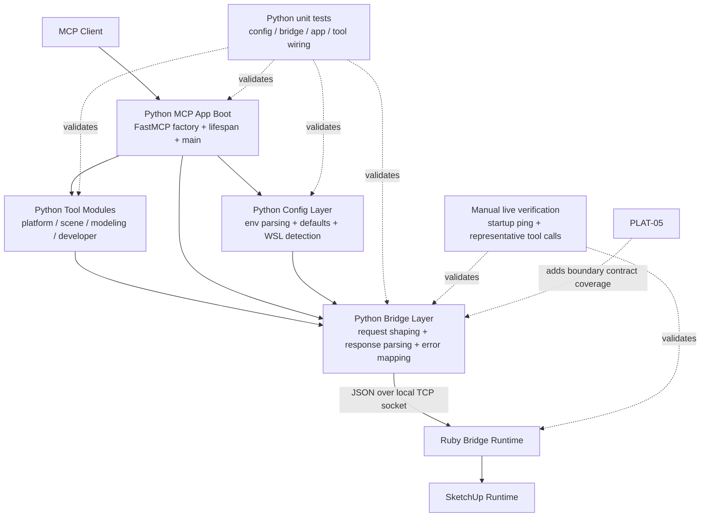

# Technical Plan: PLAT-03 Decompose Python MCP Adapter
**Task ID**: `PLAT-03`
**Title**: `Decompose Python MCP Adapter`
**Status**: `draft`
**Date**: `2026-04-13`

## Source Task

- [Decompose Python MCP Adapter](./task.md)

## Problem Summary

The Python MCP adapter already owns the correct runtime boundary, but too much of that ownership is concentrated in [python/src/sketchup_mcp_server/server.py](python/src/sketchup_mcp_server/server.py). FastMCP app boot, lifecycle behavior, environment and endpoint resolution, short-lived socket usage, request construction, response parsing, and every MCP tool definition currently live in one module.

That concentration makes the adapter harder to review, harder to test, and harder to extend as the tool surface grows. This task decomposes the Python side into explicit app boot, shared bridge invocation, and tool-module boundaries while preserving the current MCP-facing contract, package entrypoints, and cross-runtime version ownership.

## Goals

- Separate Python app boot and lifecycle behavior from shared bridge invocation and tool registration.
- Centralize endpoint resolution, request construction, response parsing, and boundary error handling in one Python-owned bridge layer.
- Move MCP tool definitions out of the primary boot module into thin capability-oriented tool modules.
- Preserve current package entrypoints, import surface, version ownership, and MCP-facing tool names and arguments.
- Create reviewable Python seams that support focused unit coverage for boot, config, bridge behavior, and tool wiring.

## Non-Goals

- Move capability behavior or SketchUp-specific logic from Ruby into Python.
- Redesign the Ruby command model or the Ruby/Python bridge protocol.
- Change exposed MCP tool names or argument contracts beyond compatibility-preserving cleanup.
- Introduce a plugin system, registry framework, or other speculative abstraction beyond the current adapter needs.
- Deliver full contract-test coverage or SketchUp-hosted smoke coverage in this task.

## Related Context

- [Platform Architecture and Repo Structure](specifications/hlds/hld-platform-architecture-and-repo-structure.md)
- [PLAT-03 Task](./task.md)
- [Platform Tasks README](specifications/tasks/platform/README.md)
- [PLAT-01 Decompose Ruby Runtime Boundaries Task](specifications/tasks/platform/PLAT-01-decompose-ruby-runtime-boundaries/task.md)
- [PLAT-01 Technical Plan](specifications/tasks/platform/PLAT-01-decompose-ruby-runtime-boundaries/plan.md)
- [PLAT-05 Add Python/Ruby Contract Coverage Task](specifications/tasks/platform/PLAT-05-add-python-ruby-contract-coverage/task.md)
- Current Python hotspot: [python/src/sketchup_mcp_server/server.py](python/src/sketchup_mcp_server/server.py)
- Current Python entrypoints and metadata:
  - [python/src/sketchup_mcp_server/__main__.py](python/src/sketchup_mcp_server/__main__.py)
  - [python/src/sketchup_mcp_server/__init__.py](python/src/sketchup_mcp_server/__init__.py)
  - [python/src/sketchup_mcp_server/version.py](python/src/sketchup_mcp_server/version.py)
  - [pyproject.toml](pyproject.toml)
  - [README.md](README.md)
- Existing Python automation entrypoints:
  - [Rakefile](Rakefile)
  - [rakelib/python.rake](rakelib/python.rake)
  - [python/tests/test_version.py](python/tests/test_version.py)

## Research Summary

- The platform HLD already defines the intended Python ownership split: MCP app boot, shared invocation and connection logic, tool modules by capability area, and boundary error mapping.
- The current architectural issue is concentration, not incorrect runtime ownership. Python should remain a thin adapter, but it should not remain a single hotspot module.
- `PLAT-03` is part of the core delivery path and should land focused unit coverage for the reviewable Python boundaries it introduces.
- `PLAT-05` is intentionally deferred. This task should preserve the bridge contract and add focused Python unit protection, but it should not absorb full Python/Ruby contract testing.
- The implemented baseline still has all Python adapter responsibilities in [python/src/sketchup_mcp_server/server.py](python/src/sketchup_mcp_server/server.py), and current Python automated coverage is still minimal at [python/tests/test_version.py](python/tests/test_version.py).
- External refinement support converged on the same recommendation: use a modest layer split, keep [server.py](python/src/sketchup_mcp_server/server.py) as a compatibility surface, centralize bridge error handling in the shared invocation layer, and group tools into a small number of capability-oriented modules instead of keeping them centralized or splitting into one module per tool.

## Technical Decisions

### Data Model

- Introduce a simple Python settings object, for example `ServerSettings`, that captures:
  - MCP transport mode
  - HTTP host and port
  - SketchUp bridge host and port
- Resolve environment variables once into that settings object and pass it through app and tool registration instead of re-reading environment state in multiple functions.
- Keep bridge payloads as plain JSON-serializable dictionaries rather than introducing public DTO layers for requests or responses.
- Introduce typed Python bridge exceptions for transport, protocol, and remote-error conditions so boundary error handling has an explicit home without changing exposed tool contracts.

### API and Interface Design

- Preserve the existing public Python import and entrypoint surface centered on:
  - [python/src/sketchup_mcp_server/server.py](python/src/sketchup_mcp_server/server.py)
  - [python/src/sketchup_mcp_server/__main__.py](python/src/sketchup_mcp_server/__main__.py)
  - [python/src/sketchup_mcp_server/__init__.py](python/src/sketchup_mcp_server/__init__.py)
  - [pyproject.toml](pyproject.toml)
- Keep [python/src/sketchup_mcp_server/server.py](python/src/sketchup_mcp_server/server.py) as a thin compatibility shim that exports:
  - `create_server`
  - `main`
  - `mcp`
- Extract the main implementation into a small internal shape:
  - `python/src/sketchup_mcp_server/app.py`
  - `python/src/sketchup_mcp_server/config.py`
  - `python/src/sketchup_mcp_server/bridge.py`
  - `python/src/sketchup_mcp_server/tools/__init__.py`
  - `python/src/sketchup_mcp_server/tools/platform.py`
  - `python/src/sketchup_mcp_server/tools/scene.py`
  - `python/src/sketchup_mcp_server/tools/modeling.py`
  - `python/src/sketchup_mcp_server/tools/developer.py`
- `app.py` should own:
  - FastMCP app creation
  - startup and shutdown lifespan wiring
  - transport branching for stdio or HTTP
  - composition of settings, bridge client, and tool registration
- `config.py` should own:
  - environment parsing
  - default values
  - WSL host detection
  - invalid transport and invalid HTTP port failures
- `bridge.py` should own:
  - the short-lived TCP bridge client
  - JSON request construction
  - JSON response parsing
  - request-id propagation
  - Ruby error payload interpretation
- Tool modules should expose explicit `register_tools(...)` functions that attach tool handlers to a passed `FastMCP` instance. Avoid distributing a shared global `mcp` object across modules.
- Use a small tool grouping that matches the current surface without over-fragmenting it:
  - `tools/platform.py` for `ping` and `bridge_configuration`
  - `tools/scene.py` for scene and selection inspection
  - `tools/modeling.py` for mutation, boolean, edge, and joint operations
  - `tools/developer.py` for `eval_ruby`

### Error Handling

- Keep startup ping non-fatal. App startup should continue if SketchUp is not reachable, while logging a warning through the lifecycle layer.
- Centralize bridge failure categories in `bridge.py`:
  - connection or socket failures
  - closed-without-response failures
  - incomplete or invalid JSON response failures
  - Ruby bridge error payloads
- Preserve current Ruby-visible and MCP-visible behavior where practical by keeping remote error messages intact instead of rewriting them in Python.
- Tool handlers should not parse error envelopes or build fallback transport behavior themselves. They should delegate to the shared bridge layer and let its exceptions surface consistently.
- Keep invalid local configuration failures explicit in `config.py`, especially unsupported MCP transport values and invalid HTTP port values.

### State Management

- Keep one `BridgeClient` instance per FastMCP app instance, configured with immutable bridge endpoint settings.
- Keep socket usage short-lived per request. Do not introduce a persistent socket session, connection pool, or cache.
- Keep tool modules stateless. Their responsibility is registration and light argument shaping only.
- Retain a module-level `mcp` export only as a compatibility surface for current entrypoints and README usage, not as the primary ownership location for adapter behavior.

### Integration Points

- Preserve the console entrypoint flow:
  [pyproject.toml](pyproject.toml) -> [python/src/sketchup_mcp_server/__main__.py](python/src/sketchup_mcp_server/__main__.py) -> [python/src/sketchup_mcp_server/server.py](python/src/sketchup_mcp_server/server.py) -> app boot logic
- Preserve the README FastMCP launch surface:
  `uv run fastmcp run python/src/sketchup_mcp_server/server.py:mcp`
- Preserve the runtime bridge flow:
  MCP tool handler -> shared Python bridge client -> local TCP JSON request -> Ruby runtime -> JSON response -> Python error/result mapping
- Ensure platform tools and app boot use the same resolved settings so `bridge_configuration` reports the same transport and endpoint values the server actually uses.
- Preserve request-id propagation from FastMCP `Context` into bridge requests for representative tool calls.

### Configuration

- Keep the existing environment variable names and defaults:
  - `SKETCHUP_MCP_TRANSPORT`
  - `SKETCHUP_MCP_HTTP_HOST`
  - `SKETCHUP_MCP_HTTP_PORT`
  - `SKETCHUP_HOST`
  - `SKETCHUP_PORT`
- Keep stdio as the default MCP transport and HTTP as the optional secondary transport.
- Keep WSL endpoint detection behavior, but isolate it behind config functions so it can be tested independently from the rest of the adapter.
- Do not add new configuration files, config formats, or runtime override layers in this task.

## Architecture Context

## Key Relationships

- [python/src/sketchup_mcp_server/server.py](python/src/sketchup_mcp_server/server.py) remains the compatibility-facing module, but it should no longer own the main implementation logic.
- `app.py` depends on `config.py`, `bridge.py`, and tool registration modules, but tool modules should not depend back on app boot to avoid import cycles.
- `config.py` is the single owner of environment parsing and endpoint derivation so transport and endpoint values stay consistent across boot and platform tools.
- `bridge.py` is the single owner of socket lifecycle, request shaping, response parsing, and bridge-side error interpretation so tool handlers remain thin.
- Tool modules own MCP exposure by capability area and stay close to a 1:1 mapping with Ruby command names.
- Real integration still exists at the Python/Ruby runtime boundary, so Python unit tests are necessary but not sufficient on their own.

## Acceptance Criteria

- Python app boot and lifecycle behavior are reviewable separately from shared bridge invocation and tool registration when the adapter is inspected.
- MCP tool definitions are no longer concentrated in the primary app-boot module, and individual tool handlers do not implement their own socket, request-construction, or response-parsing logic.
- The shared Python bridge layer consistently handles endpoint resolution, request-id propagation, request construction, response parsing, and boundary error behavior for representative tool calls.
- Existing package entrypoints and import surfaces remain valid, including the console script in [pyproject.toml](pyproject.toml), [python/src/sketchup_mcp_server/__main__.py](python/src/sketchup_mcp_server/__main__.py), [python/src/sketchup_mcp_server/__init__.py](python/src/sketchup_mcp_server/__init__.py), and the README `server.py:mcp` launch path.
- Existing MCP tool names and argument surfaces remain behaviorally compatible for the current Python tool surface.
- Platform-owned tools that report transport or bridge configuration reflect the same resolved settings used by app boot.
- Bridge transport failures, malformed-response failures, and Ruby-reported error payloads are handled through one shared Python boundary rather than ad hoc per-tool behavior.
- Extracted Python seams have focused automated unit coverage for configuration, bridge behavior, app boot, and representative tool wiring without requiring a live SketchUp runtime.
- Representative live verification still confirms startup behavior and at least one bridge-backed tool path after the refactor.

## Test Strategy

### TDD Approach

- Extract configuration resolution first and add tests for transport and endpoint parsing before moving app boot off the hotspot module.
- Extract bridge request and response behavior second and add unit tests for success, remote error, and malformed-response cases before rewiring tool handlers to depend on it.
- Extract app boot and lifecycle third, keeping [python/src/sketchup_mcp_server/server.py](python/src/sketchup_mcp_server/server.py) as a compatibility shim while tests protect entrypoint behavior.
- Extract tool modules last, verifying registration and representative argument-shaping behavior as the handlers move out of the boot module.
- Finish with live verification against a running SketchUp bridge to confirm the preserved runtime path still works outside mocks.

### Required Test Coverage

- Python config tests for:
  - default stdio transport
  - HTTP host and port parsing
  - invalid HTTP port failure
  - explicit SketchUp host override
  - WSL host detection fallback behavior
- Python bridge tests for:
  - `ping` request shaping
  - `tools/call` request shaping
  - request-id propagation
  - successful result extraction
  - Ruby error payload mapping
  - no-response and incomplete-response failures
  - malformed JSON response failure
- Python app tests for:
  - `create_server` composition
  - non-fatal startup ping behavior
  - shutdown cleanup behavior
  - `main()` stdio branch
  - `main()` HTTP branch
  - unsupported transport failure
- Python tool tests for:
  - registration of the expected tool names
  - representative passthrough call behavior for read, mutation, and developer tools
  - representative argument shaping for tools with optional fields
  - shared settings usage in `bridge_configuration`
- Existing quality gates:
  - `bundle exec rake python:lint`
  - `bundle exec rake python:test`
- Representative live verification with SketchUp available:
  - start the Python server through the normal entrypoint
  - confirm startup ping remains non-fatal
  - run `ping`
  - run `bridge_configuration`
  - run one read path such as `get_scene_info`
  - run one mutation path such as `create_component`
  - run one error path such as a missing-entity request

## Implementation Phases

1. Extract `config.py` and `bridge.py` under the current package while keeping [python/src/sketchup_mcp_server/server.py](python/src/sketchup_mcp_server/server.py) behaviorally compatible, and add focused tests for config and bridge behavior.
2. Extract `app.py` for FastMCP creation, lifespan, and transport branching, then convert [python/src/sketchup_mcp_server/server.py](python/src/sketchup_mcp_server/server.py) into a compatibility shim that re-exports `create_server`, `main`, and `mcp`.
3. Extract capability-oriented tool modules with explicit registration functions, keeping tool names, argument surfaces, and representative request-id behavior stable, and add tool-wiring tests.
4. Run Python lint and tests through the existing project entrypoints, then perform representative live verification against a running SketchUp bridge and update docs only if an exposed launch or usage surface had to change.

## Risks and Mitigations

- Bridge contract regression: preserve current tool names, argument shapes, request-id propagation, and representative error-message behavior; add focused bridge and tool tests plus live verification.
- Entrypoint or import regression: keep [python/src/sketchup_mcp_server/server.py](python/src/sketchup_mcp_server/server.py), [python/src/sketchup_mcp_server/__main__.py](python/src/sketchup_mcp_server/__main__.py), and [python/src/sketchup_mcp_server/__init__.py](python/src/sketchup_mcp_server/__init__.py) as stable public surfaces and verify them explicitly in tests.
- Import-cycle risk during decomposition: enforce a one-way dependency shape where app boot composes config, bridge, and tool registration, while tool modules do not import app boot.
- Over-abstracting the Python layer: use a small fixed module split and explicit registration functions rather than a dynamic registry, plugin system, or per-tool file explosion.
- Under-testing refactored seams: land focused tests in the same task for config, bridge, app, and representative tool wiring instead of deferring that safety to a follow-on cleanup task.
- Environment-specific endpoint behavior: isolate WSL detection and endpoint resolution in config tests and include live verification on the normal runtime path when possible.
- Dependency on current Ruby contract shape: treat [PLAT-01](specifications/tasks/platform/PLAT-01-decompose-ruby-runtime-boundaries/task.md) as dependency context and design guidance, not as implemented baseline, so this task remains compatible with the current Ruby bridge.

## Dependencies

- Platform direction in [specifications/hlds/hld-platform-architecture-and-repo-structure.md](specifications/hlds/hld-platform-architecture-and-repo-structure.md)
- Task dependency on [PLAT-01 Decompose Ruby Runtime Boundaries](specifications/tasks/platform/PLAT-01-decompose-ruby-runtime-boundaries/task.md)
- Follow-on verification dependencies:
  - [PLAT-05 Add Python/Ruby Contract Coverage Task](specifications/tasks/platform/PLAT-05-add-python-ruby-contract-coverage/task.md)
- Current Python package and launch surfaces:
  - [python/src/sketchup_mcp_server/server.py](python/src/sketchup_mcp_server/server.py)
  - [python/src/sketchup_mcp_server/__main__.py](python/src/sketchup_mcp_server/__main__.py)
  - [python/src/sketchup_mcp_server/__init__.py](python/src/sketchup_mcp_server/__init__.py)
  - [pyproject.toml](pyproject.toml)
  - [README.md](README.md)
- Existing Python quality gates:
  - [Rakefile](Rakefile)
  - [rakelib/python.rake](rakelib/python.rake)
  - [python/tests/test_version.py](python/tests/test_version.py)
- A live SketchUp runtime for final manual verification of the preserved Python-to-Ruby path

## Quality Checks

- [x] All required inputs validated
- [x] Problem statement documented
- [x] Goals and non-goals documented
- [x] Research summary documented
- [x] Technical decisions included
- [x] Architecture context included
- [x] Acceptance criteria included
- [x] Test requirements specified
- [x] Risks and dependencies documented
- [x] Small reversible phases defined
