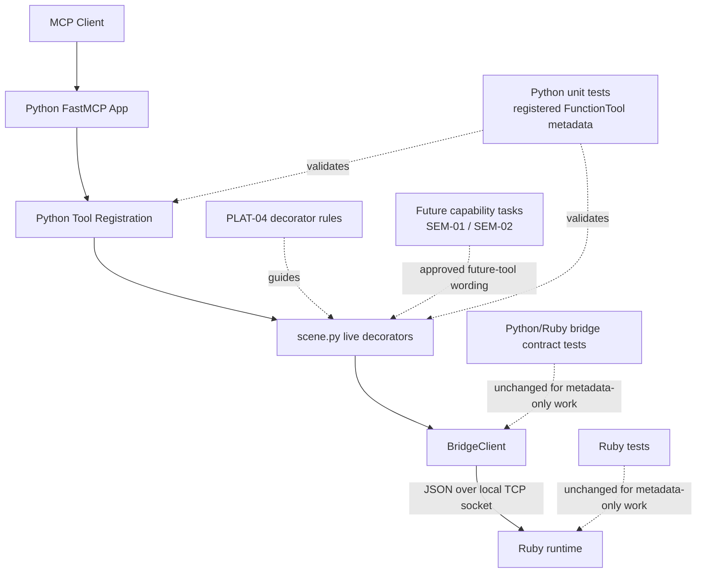

# Technical Plan: PLAT-04 Define MCP Tool Decoration and Phase-Specific Metadata
**Task ID**: `PLAT-04`
**Title**: `Define MCP Tool Decoration and Phase-Specific Metadata`
**Status**: `finalized`
**Date**: `2026-04-14`

## Source Task

- [Define MCP Tool Decoration and Phase-Specific Metadata](./task.md)

## Problem Summary

The Python MCP adapter now has the layering needed to own client-facing tool metadata cleanly, but the public tool surface still relies mostly on bare `@mcp.tool` registration plus docstrings. That leaves exposed tools under-described, makes read-only versus mutating posture inconsistent, and creates a risk that capability rollouts will improvise client-facing metadata per task.

`PLAT-04` should make MCP tool decoration a Python-owned platform concern without inventing a new registry too early. The task should attach explicit live metadata to already-exposed tools now, keep future-tool wording in the owning planned capability tasks until exposure, and ensure current-phase descriptions stay aligned with delivered behavior.

## Goals

- Define the platform-owned rules for live MCP tool metadata in the Python adapter.
- Apply explicit `title`, `description`, and behavior annotations to the already-exposed targeted tools `find_entities`, `sample_surface_z`, and `create_site_element`.
- Keep current-phase descriptions aligned with delivered targeting and interrogation scope.
- Distinguish read-only grounding tools from mutating tools through FastMCP-native annotations where the semantics are clear.
- Require later-phase public-tool expansions to carry approved current-phase metadata in their owning task and plan artifacts before exposure.

## Non-Goals

- Implement or expand Ruby/Python behavior for `find_entities`, `sample_surface_z`, or `create_site_element`.
- Introduce a central metadata registry or inactive Python catalog entries for tools that are not yet exposed.
- Change Python/Ruby bridge payloads, shared bridge contract artifacts, or Ruby command behavior.
- Redesign the full public tool catalog or remove `eval_ruby` from the surface.
- Guess future-tool metadata during implementation without support from the owning capability tasks.

## Related Context

- [Platform Architecture and Repo Structure](specifications/hlds/hld-platform-architecture-and-repo-structure.md)
- [PLAT-03 Decompose Python MCP Adapter](specifications/tasks/platform/PLAT-03-decompose-python-mcp-adapter/task.md)
- [PLAT-03 Technical Plan](specifications/tasks/platform/PLAT-03-decompose-python-mcp-adapter/plan.md)
- [STI-01 Targeting MVP and `find_entities`](specifications/tasks/scene-targeting-and-interrogation/STI-01-targeting-mvp-and-find-entities/task.md)
- [STI-02 Explicit Surface Interrogation via `sample_surface_z`](specifications/tasks/scene-targeting-and-interrogation/STI-02-explicit-surface-interrogation-via-sample-surface-z/task.md)
- [SEM-01 Establish Semantic Core and First Vertical Slice](specifications/tasks/semantic-scene-modeling/SEM-01-establish-semantic-core-and-first-vertical-slice/task.md)
- [SEM-01 Technical Plan](specifications/tasks/semantic-scene-modeling/SEM-01-establish-semantic-core-and-first-vertical-slice/plan.md)
- [SEM-02 Complete First-Wave Semantic Creation Vocabulary](specifications/tasks/semantic-scene-modeling/SEM-02-complete-first-wave-semantic-creation-vocabulary/task.md)
- [python/src/sketchup_mcp_server/tools/__init__.py](python/src/sketchup_mcp_server/tools/__init__.py)
- [python/src/sketchup_mcp_server/tools/scene.py](python/src/sketchup_mcp_server/tools/scene.py)
- [python/tests/test_tools.py](python/tests/test_tools.py)

## Research Summary

- `PLAT-03` is implemented and already provides the correct ownership seam: Python tool modules own FastMCP registration while Ruby owns runtime behavior.
- The current codebase does not have a shared decoration layer or catalog. Public metadata is mostly the default function name plus docstring.
- The installed FastMCP API already supports the fields this task needs directly on `@mcp.tool(...)`: `title`, `description`, `annotations`, `tags`, and `meta`.
- Native FastMCP annotations include `readOnlyHint`, `destructiveHint`, `idempotentHint`, and `openWorldHint`; `readOnlyHint` and `destructiveHint` are the clearest immediate fit for this task.
- `find_entities` and `sample_surface_z` are implemented today and already have stable Python tests that inspect registered `FunctionTool` definitions, which makes them the right first live rollout targets.
- `create_site_element` is now implemented through `SEM-01`, so its current-phase live wording should be attached directly to the exposed Python decorator while later expansion guidance remains in `SEM-02`.
- The Python/Ruby bridge contract artifact currently models request/response invariants, not client-facing MCP presentation metadata, so `PLAT-04` should stay Python-local unless the public bridge boundary changes intentionally.

## Technical Decisions

### Data Model

- The platform-owned decoration contract for this task is a shared rule set for required fields and posture, not a central runtime registry.
- Live MCP metadata is authored directly on exposed `@mcp.tool(...)` decorators in Python tool modules.
- In task terms, the shared decoration contract is satisfied by:
  - one common required metadata shape and posture rule set
  - explicit live decorator metadata on exposed tools
  - approved future-tool metadata carried in owning capability artifacts until exposure
- Each covered live tool must declare:
  - `title`
  - `description`
  - `annotations`
- `annotations` should use FastMCP-native fields when the semantics are clear.
- For `PLAT-04`, the required behavior posture fields are:
  - `readOnlyHint`
  - `destructiveHint`
- Future tools or later-phase expansions that are not yet exposed must not receive inactive Python metadata entries. Their approved current-phase wording belongs in the owning capability task and plan until implementation.

### API and Interface Design

- Apply explicit decorator metadata in place to the existing live tool definitions rather than introducing a separate metadata module.
- The minimum required live rollout in this task is:
  - `find_entities`
  - `sample_surface_z`
  - `create_site_element`
- The authoritative client-facing metadata for those tools should move from implicit function-name/docstring behavior to explicit decorator fields.
- Existing tool names, argument schemas, nested request models, and bridge passthrough behavior must remain unchanged.
- Adjacent already-exposed tools may adopt the same pattern in this task only if the edits stay mechanical and do not broaden scope materially.
- Future public tool tasks or later-phase expansions must specify approved live metadata before exposure:
  - title
  - bounded current-phase description
  - read-only or mutating annotation posture

### Error Handling

- Metadata changes in this task are Python-side presentation changes only and must not affect Ruby bridge requests or responses.
- Incorrect metadata wording or missing annotations should fail Python tests and review, not trigger new runtime fallback behavior.
- No bridge error mapping changes are required.
- Current-phase descriptions must avoid claiming deferred capability:
  - `find_entities` must not describe metadata-aware or collection-aware filtering before those behaviors exist.
  - `sample_surface_z` must describe explicit-target world-space XY sampling and avoid broad scene probing language.

### State Management

- There is no new persistent metadata state or runtime phase-selection mechanism in this task.
- Live tool decoration state is the code currently attached to exposed Python tool decorators.
- Planned tool metadata remains owned by the relevant capability task and plan artifacts until the tool or later-phase expansion is exposed.

### Integration Points

- The live integration seam is FastMCP registration in Python tool modules.
- Tool ordering remains owned by [python/src/sketchup_mcp_server/tools/__init__.py](python/src/sketchup_mcp_server/tools/__init__.py).
- The targeted implementation surface is primarily:
  - [python/src/sketchup_mcp_server/tools/scene.py](python/src/sketchup_mcp_server/tools/scene.py)
  - [python/src/sketchup_mcp_server/tools/semantic.py](python/src/sketchup_mcp_server/tools/semantic.py)
  - one small shared decoration helper in the Python tool layer
- Verification should inspect real registered `FunctionTool` metadata via FastMCP rather than only local constants or helper output.
- Ruby command routing, bridge invocation, and contract suites should remain unchanged unless implementation accidentally alters the boundary.

### Configuration

- No new environment variables, config files, or runtime switches are needed.
- No live phase-selection configuration is introduced in `PLAT-04`.
- Future phase changes happen when owning capability tasks expose a new tool or revise an already-exposed tool's approved metadata as part of that delivery.

## Architecture Context

## Key Relationships

- Python owns exposed MCP tool metadata; Ruby owns runtime behavior and bridge responses.
- The shared platform contract in this task is expressed through one common rule set, consistent decorator usage, tests, and planning guidance rather than a new metadata registry.
- `find_entities` and `sample_surface_z` are the read-only live targets because they are already exposed and have source-task-defined current boundaries.
- `create_site_element` is now a live mutating target because `SEM-01` is completed, while `SEM-02` owns the approved later-phase wording for the expanded semantic vocabulary.
- FastMCP-native annotations are sufficient for the immediate read-only versus mutating posture needs of this task.

## Acceptance Criteria

- The Python MCP surface exposes explicit `title`, `description`, and behavior annotations for `find_entities`, `sample_surface_z`, and `create_site_element` through live FastMCP tool definitions.
- The exposed `find_entities` metadata stays bounded to the delivered MVP targeting scope and does not claim metadata-aware or collection-aware filtering.
- The exposed `sample_surface_z` metadata states that callers provide an explicit target plus world-space XY sample points and does not present broad scene probing as the normal path.
- The exposed behavior annotations mark `find_entities` and `sample_surface_z` as read-only and non-destructive in a way that is visible on registered FastMCP tool definitions.
- The exposed `create_site_element` metadata advertises only the `SEM-01` semantic slice of `structure` and `pad`, and marks the tool as mutating but non-destructive.
- Existing tool names, argument schemas, request shaping, registration order, and Ruby bridge behavior for the targeted tools remain unchanged.
- Python tests verify the live registered metadata for the targeted tools by inspecting actual FastMCP `FunctionTool` definitions.
- The implementation guidance makes it explicit that future public tools and later-phase expansions must define approved current-phase metadata in their owning capability artifacts before exposure.
- The implementation does not introduce inactive Python metadata entries for still-planned tools or later-phase expansions.
- The implementation does not require Ruby changes, bridge contract artifact changes, or Python/Ruby contract-suite updates unless the bridge boundary is changed intentionally.

## Test Strategy

### TDD Approach

- Start by adding failing Python tests in [python/tests/test_tools.py](python/tests/test_tools.py) that inspect actual registered FastMCP tool definitions for the targeted live tools.
- Assert the exposed metadata fields directly on `FunctionTool` instances:
  - `title`
  - `description`
  - `annotations.readOnlyHint`
  - `annotations.destructiveHint`
- After the tests fail, update the live tool decorators in:
  - [python/src/sketchup_mcp_server/tools/scene.py](python/src/sketchup_mcp_server/tools/scene.py)
  - [python/src/sketchup_mcp_server/tools/semantic.py](python/src/sketchup_mcp_server/tools/semantic.py)
  to satisfy the assertions while preserving request/response behavior.
- Add a single small helper only if the shared required metadata shape is duplicated concretely during implementation.

### Required Test Coverage

- Python tool tests for:
  - registered metadata exposure for `find_entities`
  - registered metadata exposure for `sample_surface_z`
  - registered metadata exposure for `create_site_element`
  - preservation of existing request shaping and `request_id` propagation for the targeted tools
  - preservation of tool registration order if touched during the edits
- Python lint/format validation for the touched Python surface
- Optional lightweight test coverage for adjacent already-exposed tools only if their metadata is normalized in the same slice
- No required Ruby test additions or contract-artifact updates unless implementation changes the public Python/Ruby boundary

Recommended validation commands:

- `uv run pytest python/tests`
- `uv run ruff check python/src python/tests`
- `bundle exec rake python:lint`
- `bundle exec rake python:test`

## Implementation Phases

1. Add failing Python metadata assertions for `find_entities`, `sample_surface_z`, and `create_site_element` in [python/tests/test_tools.py](python/tests/test_tools.py).
2. Add one shared Python decoration helper for the required metadata shape only if duplication is concrete in the touched modules.
3. Update the live decorators in [python/src/sketchup_mcp_server/tools/scene.py](python/src/sketchup_mcp_server/tools/scene.py) and [python/src/sketchup_mcp_server/tools/semantic.py](python/src/sketchup_mcp_server/tools/semantic.py) to declare explicit `title`, `description`, and read-only or mutating annotations while preserving existing tool behavior.
4. Finalize the semantic-phase guidance in the relevant planning artifacts, run Python lint/tests, and confirm no Ruby or bridge-contract churn was introduced.

## Risks and Mitigations

- Scope creep into full-catalog normalization: keep the rollout limited to `find_entities`, `sample_surface_z`, and the already-live `create_site_element`, and expand only when additional edits remain mechanical.
- Overstated capability in descriptions: derive wording from [STI-01 Targeting MVP and `find_entities`](specifications/tasks/scene-targeting-and-interrogation/STI-01-targeting-mvp-and-find-entities/task.md) and [STI-02 Explicit Surface Interrogation via `sample_surface_z`](specifications/tasks/scene-targeting-and-interrogation/STI-02-explicit-surface-interrogation-via-sample-surface-z/task.md).
- Premature abstraction: keep metadata on decorators and add a helper only if duplication becomes concrete during implementation.
- Dead metadata for planned tools: keep future-tool or later-phase wording in owning task/plan artifacts rather than inactive Python entries.
- Accidental public-boundary churn: preserve names, schemas, request shaping, and registration order, and validate them with existing Python tests plus new metadata assertions.
- Under-testing exposed metadata: inspect real registered FastMCP tool definitions instead of only checking local constants or helper output.

## Dependencies

- Implemented Python tool-module seams from [PLAT-03 Decompose Python MCP Adapter](specifications/tasks/platform/PLAT-03-decompose-python-mcp-adapter/task.md)
- Platform ownership boundaries in [Platform Architecture and Repo Structure](specifications/hlds/hld-platform-architecture-and-repo-structure.md)
- Current targeting capability scope from [STI-01 Targeting MVP and `find_entities`](specifications/tasks/scene-targeting-and-interrogation/STI-01-targeting-mvp-and-find-entities/task.md)
- Current interrogation capability scope from [STI-02 Explicit Surface Interrogation via `sample_surface_z`](specifications/tasks/scene-targeting-and-interrogation/STI-02-explicit-surface-interrogation-via-sample-surface-z/task.md)
- Future semantic rollout guidance from:
  - [SEM-01 Establish Semantic Core and First Vertical Slice](specifications/tasks/semantic-scene-modeling/SEM-01-establish-semantic-core-and-first-vertical-slice/task.md)
  - [SEM-02 Complete First-Wave Semantic Creation Vocabulary](specifications/tasks/semantic-scene-modeling/SEM-02-complete-first-wave-semantic-creation-vocabulary/task.md)
- FastMCP support for explicit decorator metadata and tool annotations in the local Python environment

## Quality Checks

- [x] All required inputs validated
- [x] Problem statement documented
- [x] Goals and non-goals documented
- [x] Research summary documented
- [x] Technical decisions included
- [x] Architecture context included
- [x] Acceptance criteria included
- [x] Test requirements specified
- [x] Risks and dependencies documented
- [x] Small reversible phases defined
