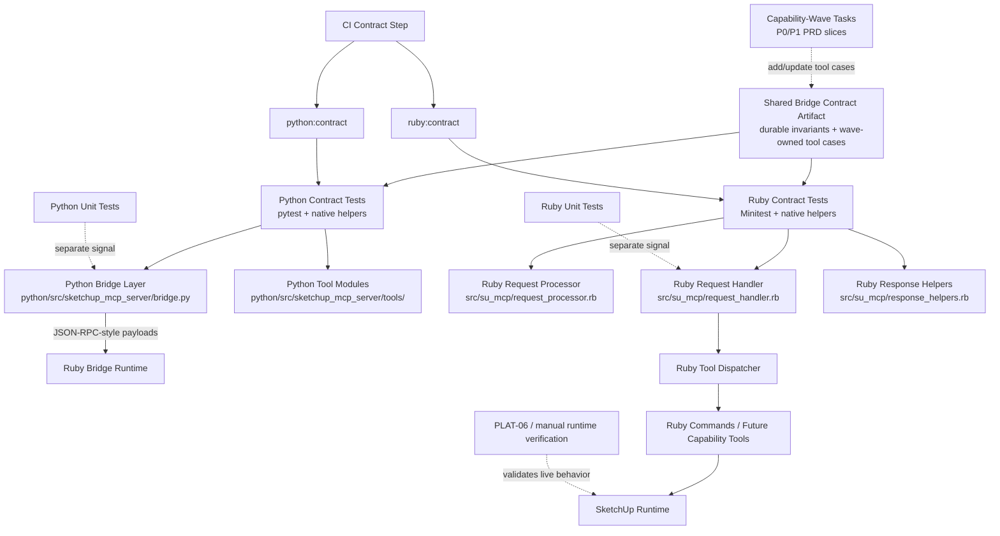

# Technical Plan: PLAT-05 Prepare Python/Ruby Contract Coverage Foundations
**Task ID**: `PLAT-05`
**Title**: `Prepare Python/Ruby Contract Coverage Foundations`
**Status**: `finalized`
**Date**: `2026-04-14`

## Source Task

- [Prepare Python/Ruby Contract Coverage Foundations](./task.md)

## Problem Summary

The Python/Ruby bridge already has some useful unit coverage, but it does not yet have a reusable contract-testing foundation that can survive the staged replacement of most or all current tools. Broadening coverage for the legacy tool catalog would create churn without protecting the work that is actually coming.

This task should instead prepare the contract layer for the replacement rollout: define the durable cross-runtime invariants, establish a lightweight shared contract artifact, wire those invariants into dedicated Ruby and Python contract suites, add a separate required CI contract step, and make it easy for each capability wave to add or update tool-specific contract cases as new P0 and P1 tools land.

## Goals

- Protect durable Python/Ruby bridge invariants with automated checks that survive tool replacement.
- Create a reusable contract-testing foundation that both Python and Ruby contract suites can consume without introducing product logic duplication.
- Make wave-owned contract additions straightforward for new or revised tools introduced by the capability PRDs.
- Keep the work small enough to remain a preparation task rather than a standalone test-framework project.
- Keep contract checks visibly distinct from unit tests in local execution and CI reporting.

## Non-Goals

- Add broad contract coverage for the current legacy tool catalog simply because it exists today.
- Replace existing unit tests with full cross-runtime contract tests.
- Require live SketchUp-hosted execution in the default CI path.
- Introduce a heavyweight shared runner that owns assertions, test orchestration, or runtime behavior across both languages.
- Move domain or product rules from Ruby into Python for testing convenience.
- Hide contract checks inside generic unit-test buckets where boundary regressions become hard to identify.

## Related Context

- [PLAT-05 Task](./task.md)
- [Platform Architecture and Repo Structure](specifications/hlds/hld-platform-architecture-and-repo-structure.md)
- [Platform Tasks README](specifications/tasks/platform/README.md)
- [PLAT-01 Decompose Ruby Runtime Boundaries Task](specifications/tasks/platform/PLAT-01-decompose-ruby-runtime-boundaries/task.md)
- [PLAT-01 Technical Plan](specifications/tasks/platform/PLAT-01-decompose-ruby-runtime-boundaries/plan.md)
- [PLAT-03 Decompose Python MCP Adapter Task](specifications/tasks/platform/PLAT-03-decompose-python-mcp-adapter/task.md)
- [PLAT-03 Technical Plan](specifications/tasks/platform/PLAT-03-decompose-python-mcp-adapter/plan.md)
- [PRD: Scene Targeting and Interrogation](specifications/prds/prd-scene-targeting-and-interrogation.md)
- [PRD: Semantic Scene Modeling](specifications/prds/prd-semantic-scene-modeling.md)
- [PRD: Staged Asset Reuse](specifications/prds/prd-staged-asset-reuse.md)
- [PRD: Scene Validation and Review](specifications/prds/prd-scene-validation-and-review.md)
- Current Python bridge tests: [python/tests/test_bridge.py](python/tests/test_bridge.py), [python/tests/test_tools.py](python/tests/test_tools.py)
- Current Ruby boundary tests: [test/request_handler_test.rb](test/request_handler_test.rb), [test/request_processor_test.rb](test/request_processor_test.rb), [test/response_helpers_test.rb](test/response_helpers_test.rb), [test/tool_dispatcher_test.rb](test/tool_dispatcher_test.rb)
- Current bridge seams: [python/src/sketchup_mcp_server/bridge.py](python/src/sketchup_mcp_server/bridge.py), [src/su_mcp/request_handler.rb](src/su_mcp/request_handler.rb), [src/su_mcp/request_processor.rb](src/su_mcp/request_processor.rb), [src/su_mcp/tool_dispatcher.rb](src/su_mcp/tool_dispatcher.rb)

## Research Summary

- The platform HLD keeps the ownership line clear: Ruby owns SketchUp-facing behavior and serialization, Python owns MCP exposure, request shaping, transport handling, and MCP-facing error mapping.
- `PLAT-01` and `PLAT-03` are implemented and provide the correct seams for contract preparation work. Ruby now has explicit request and response helpers, and Python has a dedicated bridge client plus tool modules.
- Current Python tests already protect parts of the boundary:
  - [python/tests/test_bridge.py](python/tests/test_bridge.py) checks `ping` and `tools/call` request shaping, request-id propagation, remote error mapping, and malformed/incomplete response behavior.
  - [python/tests/test_tools.py](python/tests/test_tools.py) checks tool registration and representative argument shaping, but it is still tied to the current public tool list.
- Current Ruby tests already protect parts of the boundary:
  - [test/request_handler_test.rb](test/request_handler_test.rb) checks `ping`, `tools/call`, resource and prompt methods, and error handling.
  - [test/request_processor_test.rb](test/request_processor_test.rb) checks parse-error handling and request-id preservation.
  - [test/response_helpers_test.rb](test/response_helpers_test.rb) checks standard JSON-RPC success and error payload shapes.
- The capability PRDs are still draft and are expected to replace most or all current tools in waves. The existence of those PRDs should influence the plan shape, but not be misread as implemented behavior.
- The highest-value contract preparation is therefore:
  - durable envelope and error invariants
  - a reusable shared contract artifact
  - a wave-extension mechanism for new tool cases
  - a separate required CI step that keeps contract failures distinct from unit failures
- The lowest-value contract work right now is broadening the current-tool matrix in ways that will be deleted soon.
- The current repo already has the right execution path for this split:
  - [Rakefile](Rakefile) defines top-level CI orchestration
  - [rakelib/ruby.rake](rakelib/ruby.rake) and [rakelib/python.rake](rakelib/python.rake) already provide language-specific test entrypoints
  - [.github/workflows/ci.yml](.github/workflows/ci.yml) already runs separate Ruby and Python jobs that can grow a distinct contract step without creating a new pipeline

## Technical Decisions

### Data Model

- Introduce a small neutral shared contract artifact for the Python/Ruby bridge under a repo-level location such as `contracts/bridge/`.
- Use a simple machine-readable format with no new runtime dependency burden in either language. The implemented foundation uses JSON at `contracts/bridge/bridge_contract.json` so both Python and Ruby can load the artifact with standard-library tooling only.
- Keep the artifact intentionally small and explicit. Each contract case should describe only boundary-relevant facts, for example:
  - `case_id`
  - `kind` such as `invariant` or `tool_case`
  - `wave` or `owner` metadata where applicable
  - request envelope facts
  - expected response or error-envelope facts
  - required fields or shape assertions
- Do not attempt to encode full assertion logic, dynamic behavior, or transport simulation inside the shared artifact.
- Seed the first version of the artifact with durable invariants only:
  - `ping` request and success envelope
  - generic `tools/call` request envelope
  - request-id propagation
  - standard Ruby-emitted error envelope facts for parse error, method not found, and operation failure
- Add wave-owned tool cases only for new replacement tools as those waves land.

### API and Interface Design

- Do not change the runtime bridge protocol as part of this task.
- Keep Python assertions native to pytest and existing helpers in `python/tests/`.
- Keep Ruby assertions native to Minitest and existing helpers in `test/`.
- Add small language-native loaders or helpers that read the shared contract artifact and expose reusable assertions for each suite.
- Put contract tests in explicit suites rather than mixing them into generic unit-test files:
  - `python/tests/contracts/`
  - `test/contracts/`
- Use the current seams directly:
  - Python side:
    - request shaping and response parsing via [python/src/sketchup_mcp_server/bridge.py](python/src/sketchup_mcp_server/bridge.py)
    - tool argument shaping via `python/src/sketchup_mcp_server/tools/`
  - Ruby side:
    - request parsing via [src/su_mcp/request_processor.rb](src/su_mcp/request_processor.rb)
    - request routing and method handling via [src/su_mcp/request_handler.rb](src/su_mcp/request_handler.rb)
    - response shaping via [src/su_mcp/response_helpers.rb](src/su_mcp/response_helpers.rb)
- Prove the foundation with one wave-ready `tools/call` golden-path case that does not depend on preserving the legacy catalog. Use a fake tool executor or similar seam rather than a live SketchUp command contract.
- Define an ownership rule: whenever a capability wave introduces or changes a public tool contract, that same change must update the shared contract artifact and the affected Python and Ruby contract tests in the same PR.
- Add dedicated language rake tasks such as `python:contract` and `ruby:contract`, and reserve existing `python:test` and `ruby:test` for unit and current non-contract test coverage.

### Error Handling

- Treat only cross-runtime payload rules as shared contract data.
- Keep Python-only transport failures such as socket connection failures, closed-without-response behavior, and malformed/incomplete JSON responses in Python-native tests; they should not be modeled as shared cross-runtime cases because Ruby never emits some of those states as valid payloads.
- Keep Ruby-emitted structured errors in the shared artifact when they are part of the supported bridge contract:
  - parse error
  - method not found
  - operation failure / command exception envelope
- Do not widen the shared artifact to cover unstable domain-specific error wording unless the wording is intentionally part of the public contract.

### State Management

- The shared contract artifact is test data, not runtime configuration.
- Keep it versioned with a light schema version so later waves can evolve it deliberately.
- Each tool-specific case should carry enough metadata to show ownership, such as PRD slice, wave, or task ID, so removals and replacements are explicit rather than inferred.
- Avoid long-lived compatibility state for removed tools unless a wave explicitly declares a compatibility window.

### Integration Points

- Python contract tests should validate that Python produces and interprets the bridge payloads described in the shared artifact.
- Ruby contract tests should validate that Ruby accepts and emits the payloads described in the shared artifact.
- Existing unit tests remain valuable and should not be replaced wholesale. The shared contract layer should sit above them as a thin alignment mechanism.
- Real socket integration and SketchUp-hosted behavior remain important, but they are not the default execution model for this task. Those concerns remain with existing manual checks and the later hosted-verification work in `PLAT-06`.
- The capability-wave implementation tasks should extend the shared artifact and contract checks as they replace tools from the current catalog.

### Configuration

- Reuse the existing rake-based CI integration pattern, but add distinct contract entrypoints:
  - `bundle exec rake ruby:contract`
  - `bundle exec rake python:contract`
- If a contract-artifact path is needed, keep it explicit and repo-relative rather than environment-driven.
- Do not introduce a separate contract-test runner or special CI mode in this task unless existing test entrypoints cannot reasonably host the new checks.
- If lightweight schema validation for the shared artifact is added, keep it local to the test suites and not as a runtime dependency.
- Add the new contract tasks to the existing CI workflow as a separate required step, not as an independent pipeline and not hidden inside unit-test steps.

## Implementation Notes

- Implemented shared artifact:
  - `contracts/bridge/bridge_contract.json`
- Implemented contract suites:
  - `python/tests/contracts/`
  - `test/contracts/`
- Implemented dedicated contract entrypoints:
  - `bundle exec rake ruby:contract`
  - `bundle exec rake python:contract`
- Implemented CI visibility:
  - separate `contract` job in `.github/workflows/ci.yml`
- Final local validation:
  - `bundle exec rake ci`
- Final external review:
  - `mcp__pal__codereview` with Grok reported no findings on the scoped `PLAT-05` change set

## Architecture Context

## Key Relationships

- The shared contract artifact is a single source of payload truth, but not a shared assertion runner.
- Contract suites are distinct from unit suites in both runtimes, even though they still use native test technology.
- Python remains responsible for transport construction, parsing, and MCP-facing behavior.
- Ruby remains responsible for request routing, command execution, and JSON-serializable response shaping.
- Shared contract preparation should target stable bridge rules and wave-owned tool contracts, not the temporary legacy catalog.
- Contract tests complement existing language-native unit tests rather than replacing them, and CI should report them separately.
- Live runtime behavior still needs separate validation because a shared contract artifact cannot prove SketchUp-hosted execution.

## Acceptance Criteria

- A shared machine-readable bridge contract artifact exists and is scoped to durable boundary invariants plus wave-owned tool cases.
- Python contract tests consume the shared artifact to verify `ping`, generic `tools/call` envelope behavior, request-id propagation, and supported shared error-envelope expectations.
- Ruby contract tests consume the shared artifact to verify request parsing, supported method routing, and structured success or error envelope behavior for the same durable invariants.
- The initial contract foundation includes at least one wave-ready `tools/call` golden-path case that proves a future replacement tool can add coverage without harness redesign.
- Python-only transport failure cases remain covered in Python-native tests and are not incorrectly forced into the shared cross-runtime artifact.
- Existing test tooling can run the new contract checks without requiring live SketchUp-hosted execution.
- Contract checks run as a separate required CI step from unit tests while staying inside the existing CI workflow.
- Dedicated language-level contract entrypoints exist so contract failures are visible independently from unit-test failures.
- The workflow for capability-wave ownership is explicit: any PR that introduces or changes a public tool contract must update the shared artifact and corresponding contract tests in the same change.
- The resulting foundation is small enough that it does not require a new cross-language runner, cross-process orchestration layer, or speculative fixture framework.

## Test Strategy

### TDD Approach

- Start by defining the minimal shared contract-artifact schema and the first invariant cases before wiring new assertions.
- Add Python-side contract helpers and tests first for `ping`, generic `tools/call`, and request-id propagation because those already have stable seams in [python/src/sketchup_mcp_server/bridge.py](python/src/sketchup_mcp_server/bridge.py).
- Add Ruby-side contract helpers and tests next for parse error, method not found, success envelope, and `tools/call` request routing through [src/su_mcp/request_processor.rb](src/su_mcp/request_processor.rb), [src/su_mcp/request_handler.rb](src/su_mcp/request_handler.rb), and [src/su_mcp/response_helpers.rb](src/su_mcp/response_helpers.rb).
- Add one wave-ready `tools/call` golden-path case using fake executors or recording helpers rather than a live SketchUp command.
- Add dedicated contract rake tasks and CI wiring once the first cases are in place so the boundary signal is visible immediately.
- Only after the foundation is stable should capability-wave tasks begin adding real tool-specific contract cases.

### Required Test Coverage

- Shared contract-artifact validation:
  - artifact parses successfully in both Python and Ruby
  - required fields exist for invariant and tool-case entries
  - invalid or incomplete contract entries fail fast in tests
- Python contract tests:
  - `ping` request envelope matches the shared artifact
  - `tools/call` request envelope matches the shared artifact
  - request-id propagation matches the shared artifact
  - shared Ruby error-envelope expectations map correctly into Python error behavior where applicable
  - Python transport/protocol edge cases remain covered natively outside the shared artifact
- Ruby contract tests:
  - parse error envelope matches the shared artifact
  - method-not-found envelope matches the shared artifact
  - success envelope for `ping` and routed `tools/call` cases matches the shared artifact
  - request-id propagation matches the shared artifact
  - routed `tools/call` cases can be exercised without a live SketchUp runtime
- Wave-readiness checks:
  - add one representative tool-case entry without changing loader architecture
  - verify both suites can consume that entry through language-native helpers
- Quality gates:
  - `bundle exec rake ruby:contract`
  - `bundle exec rake python:contract`
  - existing unit-test entrypoints continue separately
  - language-appropriate linting for any changed Ruby and Python files

## Implementation Phases

1. Define the shared contract-artifact scope, schema, path, and ownership rules, and seed it only with durable bridge invariants.
2. Implement lightweight Python and Ruby loaders/helpers plus explicit contract test directories while keeping assertions native to each language.
3. Add contract tests for the seeded invariants around the existing Python and Ruby bridge seams, including one wave-ready `tools/call` golden-path case.
4. Add dedicated `ruby:contract` and `python:contract` rake tasks and wire them into the existing CI workflow as a separate required contract step.
5. Document the extension rule for capability-wave work, verify the shared artifact can accept a new tool case without harness redesign, and hand off future tool-specific case growth to the capability-wave tasks that introduce those contracts.

## Risks and Mitigations

- Overengineering the foundation into a full shared runner: keep only a small shared artifact and native assertion helpers.
- Confusing contract checks with unit tests in local and CI feedback: keep separate directories, rake tasks, and CI step naming for contract coverage.
- Drift between Python and Ruby expectations: use one neutral shared artifact for boundary facts and require same-change updates when public contracts move.
- Hardening the soon-to-be-replaced legacy catalog: seed only durable invariants and one wave-ready proof case, not the full current tool surface.
- False confidence from non-hosted tests: keep live SketchUp verification explicitly outside the default contract-prep scope and continue treating hosted checks as separate work.
- Shared artifact sprawl as waves land: require ownership metadata per case and permit removal of old cases when compatibility windows end.

## Dependencies

- [PLAT-05 Task](./task.md)
- [Platform Architecture and Repo Structure](specifications/hlds/hld-platform-architecture-and-repo-structure.md)
- [Platform Tasks README](specifications/tasks/platform/README.md)
- Implemented Ruby boundary seams from `PLAT-01`
- Implemented Python adapter seams from `PLAT-03`
- Existing Ruby and Python test entrypoints
- Existing rake and CI integration points in [Rakefile](Rakefile), [rakelib/ruby.rake](rakelib/ruby.rake), [rakelib/python.rake](rakelib/python.rake), and [.github/workflows/ci.yml](.github/workflows/ci.yml)
- Capability-wave tasks that will replace the current tool surface and extend the shared contract artifact

## Quality Checks

- [x] All required inputs validated
- [x] Problem statement documented
- [x] Goals and non-goals documented
- [x] Research summary documented
- [x] Technical decisions included
- [x] Architecture context included
- [x] Acceptance criteria included
- [x] Test requirements specified
- [x] Risks and dependencies documented
- [x] Small reversible phases defined
