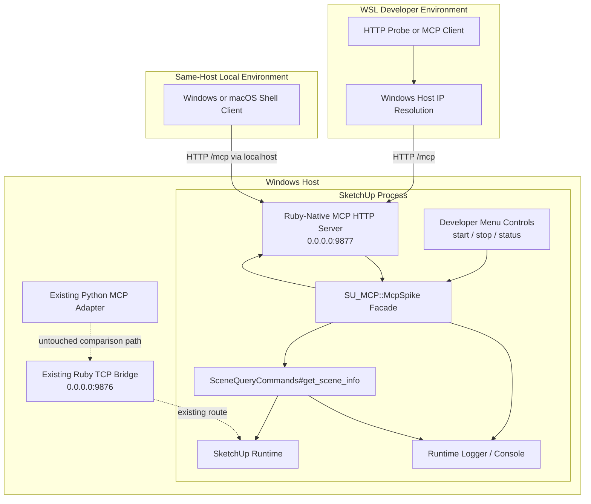

# Technical Plan: PLAT-07 Spike Ruby-Native MCP Runtime In SketchUp
**Task ID**: `PLAT-07`
**Title**: `Spike Ruby-Native MCP Runtime In SketchUp`
**Status**: `finalized`
**Date**: `2026-04-16`

## Source Task

- [Spike Ruby-Native MCP Runtime In SketchUp](./task.md)

## Problem Summary

The current platform pays a real complexity tax for running MCP in Python while keeping SketchUp behavior in Ruby. The ADR now points toward Ruby-native MCP over direct HTTP from the SketchUp host process as the target runtime shape, but the decision cannot be finalized from theory alone because this repo's real constraints are highly host-specific: embedded Ruby, RBZ packaging rules, vendoring requirements, top-level namespace safety, and actual client connectivity.

Because this work is explicitly in local developer mode, migration polish is not the main concern. The plan should optimize for fast, credible evidence: prove whether a minimal Ruby-native MCP server can run inside SketchUp, expose `get_scene_info` as a real existing tool path, and show what packaging and namespace work would still remain before broader adoption. For this spike, the authoritative acceptance path is environment-aware: same-host Windows or macOS clients may use localhost, while WSL clients reaching a Windows-hosted SketchUp process must validate the Windows host IP path unless mirrored-localhost behavior is explicitly proven.

## Goals

- prove a minimal Ruby-native MCP server can run from the SketchUp-hosted Ruby runtime in this repo
- exercise direct HTTP plus a minimal tool slice without the Python MCP adapter in the serving path
- evaluate the fastest viable vendoring posture for a local spike and identify what would need to change for production safety
- record a repo-specific go, conditional-go, or no-go outcome for further Ruby-native MCP work

## Non-Goals

- replace the existing Python adapter during this spike
- deliver production-grade namespace isolation and RBZ vendoring automation on the first pass
- expose the full current tool catalog through a new Ruby-native MCP surface
- solve every client-compatibility case before learning whether the basic host/runtime path works

## Related Context

- [PLAT-07 Task](./task.md)
- [ADR: Prefer Ruby-Native MCP as the Target Runtime Architecture](specifications/adrs/2026-04-16-ruby-native-mcp-target-runtime.md)
- [Platform Architecture and Repo Structure](specifications/hlds/hld-platform-architecture-and-repo-structure.md)
- [SketchUp Extension Development Guidance](specifications/sketchup-extension-development-guidance.md)
- [Ruby Platform Coding Guidelines](specifications/ruby-platform-coding-guidelines.md)
- [Platform Tasks README](specifications/tasks/platform/README.md)
- [RBZ Packaging Task](rakelib/package.rake)
- [Release Support Helpers](rakelib/release_support.rb)
- [Ruby Extension Entrypoint](src/su_mcp/main.rb)
- [Ruby Socket Bridge Server](src/su_mcp/socket_server.rb)

## Research Summary

- The current repo packages a direct snapshot of `src/su_mcp.rb` plus `src/su_mcp/**` into the RBZ, so runtime code has to exist inside that tree or a packaging staging tree before shipping.
- SketchUp extension guidance explicitly discourages normal gem installation and recommends copying dependency code into the extension support folder under the extension's namespace.
- The official Ruby MCP SDK is viable enough for a spike, but its normal usage assumes top-level `MCP::*` constants and a normal Ruby dependency model.
- Codex and Windsurf both support remote HTTP MCP patterns, so a direct Ruby-hosted HTTP spike is a valid target. No official benchmark suggests transport overhead should dominate the decision.
- Local developer mode changes the bar: for the spike, the main question is whether the host/runtime path works at all, not whether the repo has already solved polished migration or release packaging.
- Debate and consensus both converged on two practical constraints:
  - build-time staging is safer than committing a permanent third-party runtime tree into `src/` for production
  - shipping bare `::MCP` inside SketchUp is not the safe production answer, even if a local spike temporarily tolerates it
- The supported developer access patterns are not identical across environments:
  - same-host Windows shell -> Windows SketchUp can use localhost
  - same-host macOS shell -> macOS SketchUp can use localhost
  - WSL shell -> Windows SketchUp may require the Windows host IP rather than localhost in typical WSL2 NAT mode
- The spike must therefore validate the correct host-access path for the active environment instead of assuming one universal localhost rule.

## Technical Decisions

### Data Model

- Keep the spike data model minimal.
- Reuse existing Ruby-owned response shapes for the representative tool where practical so the spike exercises real behavior rather than a throwaway fake.
- Add only the smallest new Ruby-owned request and response wrappers needed to bind the Ruby MCP SDK to existing command or query code.
- Treat any spike-only MCP metadata or bootstrap code as disposable scaffolding unless it proves useful enough to keep.

### API and Interface Design

- The spike should stand up a Ruby-native MCP server over HTTP from inside SketchUp.
- Expose only a minimal slice:
  - `ping`
  - `get_scene_info` as the representative existing Ruby-owned read path
- Prefer a narrow adapter boundary such as `SU_MCP::McpSpike` or similar local facade so the rest of the repo does not couple directly to third-party MCP SDK constants.
- For local speed, the first spike may temporarily tolerate vendored code that still uses `MCP::*`, but the facade boundary must make later namespace isolation possible without broad rewrite churn.
- Keep the existing Python bridge untouched during the spike so comparison remains possible and rollback is trivial.
- Start and stop the spike through explicit SketchUp developer-menu actions rather than auto-starting it on extension load.
- Delegate `get_scene_info` directly to [src/su_mcp/scene_query_commands.rb](src/su_mcp/scene_query_commands.rb) so the spike reuses implemented Ruby-owned behavior and preserves its current response shape.

### Error Handling

- Fail loudly and locally during the spike.
- Surface startup, bind, vendoring, and request-handling errors in the SketchUp console and runtime logger.
- Distinguish clearly between:
  - dependency or load failures
  - MCP server bootstrap failures
  - HTTP bind or startup failures
  - tool-call failures inside Ruby-owned behavior
- If the spike requires temporary unsafe shortcuts, document them explicitly instead of hiding them behind generic rescue logic.

### State Management

- Treat the spike server as local-developer-only runtime state managed from the SketchUp extension process.
- Avoid any persistent external state beyond existing repo files and normal SketchUp model state.
- Do not add long-lived configuration or user-facing persistence unless needed to get the server running locally.
- Keep startup and shutdown controllable from SketchUp so repeated restart cycles remain easy during evaluation.

### Integration Points

- Integrate the Ruby-native MCP spike into the current SketchUp extension support tree, not as a standalone external process.
- Hook startup into the existing extension lifecycle conservatively so it can be enabled or disabled without disturbing the current Python bridge path more than necessary.
- Reuse existing Ruby-owned read behavior where possible:
  - `SceneQueryCommands#get_scene_info`
  - platform-owned status or bridge configuration equivalents if useful
- Validate the Windows-hosted SketchUp server from WSL using the Windows host IP.
- Validate at least a deterministic HTTP request path, and validate a real client connection path from Codex or Windsurf if direct client hookup is easy during the spike.

### Configuration

- Use explicit developer-only HTTP configuration for the spike.
- Keep configuration minimal and explicit:
  - bind host is configurable rather than hard-coded to localhost-only
  - a dedicated local port for the Ruby-native MCP spike, distinct from the existing TCP bridge on `9876`
  - a clear toggle or bootstrap seam so the spike can coexist with the current Python bridge during evaluation
- Use a concrete default spike port such as `9877` unless a local conflict requires another dedicated value.
- Recommended host posture by environment:
  - Windows shell -> Windows SketchUp: `127.0.0.1`
  - macOS shell -> macOS SketchUp: `127.0.0.1`
  - WSL shell -> Windows SketchUp: Windows host IP unless the environment is explicitly proven to support mirrored-localhost behavior
- Recommended bind posture by environment:
  - same-host local-only development may bind to `127.0.0.1`
  - WSL-to-Windows validation may require a broader Windows-side bind such as `0.0.0.0` or another host-reachable interface
- Avoid designing the final production configuration model during the spike.

## Architecture Context

## Key Relationships

- The spike is an architecture-validation slice, not the migration itself.
- The Ruby-native MCP runtime should sit behind an internal `SU_MCP` facade even if the first vendored dependency posture is intentionally lightweight.
- The existing Python MCP adapter remains available as a comparison and fallback path during the spike.
- The packaging answer for production may differ from the quickest local spike packaging answer.
- The host-access path is part of the spike itself, not an external assumption; localhost is valid only where it actually matches the active host topology.
- A successful spike should tighten the next decision; it should not silently become production architecture without a follow-on packaging decision.

## Acceptance Criteria

- A SketchUp-hosted Ruby-native MCP server can be started and stopped independently of the existing Python bridge.
- The Ruby-native MCP spike listens on a dedicated non-conflicting port and does not break the existing TCP bridge on `9876`.
- The spike is reachable through the correct access path for the active environment:
  - same-host Windows or macOS via localhost
  - WSL-to-Windows via the Windows host IP when localhost semantics do not hold
- The spike responds successfully to `ping` over the Ruby-native HTTP MCP path.
- The spike exposes `get_scene_info` through the Ruby-native MCP path without introducing new SketchUp-side scene-query behavior.
- `get_scene_info` returns the existing Ruby-owned structured response shape rather than a spike-specific ad hoc payload.
- If the Ruby MCP dependency cannot be loaded inside SketchUp, the failure is explicit and observable through the SketchUp console or runtime logger.
- If the spike HTTP server cannot bind or start, the failure is explicit and does not silently disable the existing bridge path.
- The spike startup path supports repeated restart cycles during local developer use.
- The spike documents the dependency posture used for the experiment, including whether vendored code was loaded with temporary top-level `MCP::*` exposure or isolated behind a stronger boundary.
- The spike result records a concrete `go`, `conditional-go`, or `no-go` outcome and names any blockers that would prevent broader Ruby-native MCP adoption in this repo.

## Test Strategy

### TDD Approach

- Start with the smallest possible boot proof:
  - failing local bootstrap attempt for the Ruby MCP runtime
  - minimal server startup path
  - `ping` handling
- Add the representative tool path second, using existing Ruby-owned behavior rather than inventing new domain logic.
- Add local validation hooks and smoke checks before widening the spike surface.
- Keep test investment proportional to spike scope:
  - focused Ruby unit coverage where the new bootstrap seam or facade is non-trivial
  - deterministic local HTTP smoke validation for the end-to-end path
- Do not spend spike time building a large permanent test matrix before the host/runtime viability is known.

### Required Test Coverage

- Ruby unit coverage for any new bootstrap, facade, or configuration helpers that can be tested without SketchUp.
- Validation that the local server can answer `ping` through the intended HTTP transport.
- Validation that `get_scene_info` reaches existing Ruby-owned behavior and returns the expected structured response.
- Manual SketchUp-hosted verification for:
  - startup
  - repeated restart
  - correct host-access validation for the active environment
  - `ping`
  - `get_scene_info`
  - client connectivity or deterministic HTTP probe
- Explicit recording of gaps that remain untested because the work is a local developer spike.

## Instrumentation and Operational Signals

- SketchUp console logs for server startup, port binding, request handling, and shutdown.
- Runtime logger entries for vendoring or load failures.
- A short spike result note captured in the task folder or follow-on summary describing:
  - server boot result
  - `get_scene_info` result
  - client connection result
  - observed packaging or namespace blockers

## Implementation Phases

1. Create the Ruby-native MCP bootstrap seam and dependency-loading posture for local developer use.
2. Expose `ping` and verify HTTP end to end from WSL into the Windows-hosted SketchUp process.
3. Expose `get_scene_info` through the spike facade and validate it against the existing Ruby-owned response path.
4. Evaluate namespace, packaging, reload, and client-connectivity friction; then record a go, conditional-go, or no-go outcome.

## Rollout Approach

- No production rollout in this task.
- Keep the existing Python adapter intact during the spike.
- Treat the Ruby-native server as opt-in and local-developer-only until the spike outcome is reviewed.
- If the spike fails on host/runtime or dependency posture, stop and record the blocker rather than widening the experiment.

## Risks and Controls

- Dependency loading fails inside SketchUp: keep the first vendoring posture minimal and log failures clearly.
- HTTP server lifecycle clashes with SketchUp runtime expectations: start with explicit developer-menu boot proof and explicit restart control.
- Bare `::MCP` causes shared-interpreter risk: isolate usage behind a `SU_MCP` facade and record whether further namespace rewriting is mandatory.
- Spike scope grows into migration work: keep the surface to `ping` plus one representative tool.
- The chosen host or bind posture does not match the active environment: make host and port explicit, validate the correct same-host or cross-environment path, and record the environment-specific limitation if the chosen path still fails.
- Client connectivity remains ambiguous: fall back to deterministic HTTP probing if direct IDE/client hookup blocks progress, but record that gap explicitly.

## Dependencies

- `PLAT-01`
- `PLAT-02`
- `PLAT-03`
- `specifications/adrs/2026-04-16-ruby-native-mcp-target-runtime.md`
- local access to a SketchUp host runtime for manual verification
- access from the active client environment to the SketchUp host through the correct path for that environment

## Premortem

### Intended Goal Under Test

Determine, with repo-specific evidence, whether Ruby-native MCP inside SketchUp is viable enough to justify continued platform investment beyond architecture debate.

### Failure Paths and Mitigations

- **Base assumptions that could lead us astray**
  - Business-plan mismatch: the repo needs an evidence-backed architecture decision, but the spike could optimize for elegance instead of proof.
  - Root-cause failure path: the spike spends time on polished packaging or migration design before proving basic host viability.
  - Why this misses the goal: it delays the actual decision while producing little new evidence.
  - Likely cognitive bias: planning fallacy.
  - Classification: Validate before implementation.
  - Mitigation now: keep the spike to `ping` plus one representative tool and defer production packaging polish.
  - Required validation: review the final change set for surface-area discipline.
- **Shortcuts that could weaken the outcome**
  - Business-plan mismatch: the repo needs a credible answer, but the spike could use so many shortcuts that success means little.
  - Root-cause failure path: the spike works only through fake handlers or a path that does not exercise real Ruby-owned behavior.
  - Why this misses the goal: it would not answer whether the real repo can serve MCP from inside SketchUp.
  - Likely cognitive bias: success theater.
  - Classification: Requires implementation-time instrumentation or acceptance testing.
  - Mitigation now: require one representative existing tool path in addition to `ping`.
  - Required validation: manual end-to-end verification against the real tool path.
- **Areas that could be weakly implemented**
  - Business-plan mismatch: the repo needs to know whether packaging and namespacing are tractable, not just whether an HTTP server can boot.
  - Root-cause failure path: the spike hardcodes dependency loading without documenting whether it bypasses the real packaging problem.
  - Why this misses the goal: it would understate the real cost of moving to Ruby-native MCP.
  - Likely cognitive bias: local-maximum bias.
  - Classification: Requires implementation-time instrumentation or acceptance testing.
  - Mitigation now: record the dependency posture used and what production-safe work remains.
  - Required validation: explicit spike summary noting vendoring and namespace implications.
- **Tests and evaluations needed to stay on track**
  - Business-plan mismatch: the repo needs real host evidence, but the spike could rely on unit tests alone.
  - Root-cause failure path: manual SketchUp-hosted validation is skipped because local code-level tests pass.
  - Why this misses the goal: host-runtime failures would remain invisible.
  - Likely cognitive bias: surrogate metric bias.
  - Classification: Requires implementation-time instrumentation or acceptance testing.
  - Mitigation now: require manual SketchUp-hosted startup and request validation.
  - Required validation: documented manual run covering startup, restart, and request path.
- **Environment assumptions that could invalidate the spike**
  - Business-plan mismatch: the repo needs a real proof for the active host topology, but the plan could assume localhost semantics that do not hold in the active environment.
  - Root-cause failure path: the spike validates only from one host posture and leaves the actual client-to-SketchUp access path unproven.
  - Why this misses the goal: it would give a false positive on developer usability and hide a real access blocker.
  - Likely cognitive bias: environment equivalence bias.
  - Classification: Requires implementation-time instrumentation or acceptance testing.
  - Mitigation now: make the bind host and client target explicit and validate the correct path for the active environment.
  - Required validation: successful `ping` and `get_scene_info` through the client-to-SketchUp path actually used by the developer environment.
- **What must be true for the task to succeed**
  - Business-plan mismatch: the repo needs a clear decision, but the spike could end in ambiguous “more research needed”.
  - Root-cause failure path: the result is recorded as observations without a recommendation.
  - Why this misses the goal: architecture remains blocked by indecision.
  - Likely cognitive bias: ambiguity aversion.
  - Classification: Validate before implementation.
  - Mitigation now: require a go, conditional-go, or no-go conclusion in the spike result.
  - Required validation: final recorded outcome in the task folder or closure summary.
- **Second-order and third-order effects**
  - Business-plan mismatch: the repo needs to preserve maintainability, but the spike could accidentally institutionalize unsafe shortcuts.
  - Root-cause failure path: a successful local hack becomes the de facto production pattern without follow-on packaging review.
  - Why this misses the goal: later platform work inherits avoidable namespace and packaging debt.
  - Likely cognitive bias: sunk-cost fallacy.
  - Classification: Underspecified task/spec/success criteria.
  - Mitigation now: state explicitly that a successful spike still requires a follow-on packaging and productionization decision.
  - Required validation: follow-on task or decision item created if the spike succeeds.

## Quality Checks

- [x] All required inputs validated
- [x] Problem statement documented
- [x] Goals and non-goals documented
- [x] Research summary documented
- [x] Technical decisions included
- [x] Architecture context included
- [x] Acceptance criteria included
- [x] Test requirements specified
- [x] Instrumentation and operational signals defined when needed
- [x] Risks and dependencies documented
- [x] Rollout approach documented when needed
- [x] Small reversible phases defined
- [x] Premortem completed with falsifiable failure paths and mitigations
