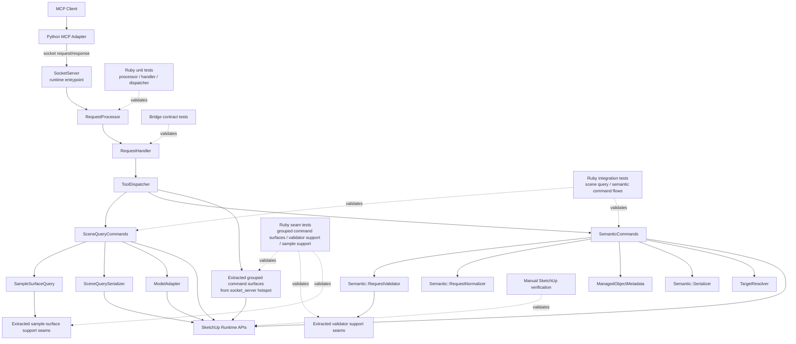

# Technical Plan: PLAT-08 Align Ruby Runtime With Coding Guidelines
**Task ID**: `PLAT-08`
**Title**: `Align Ruby Runtime With Coding Guidelines`
**Status**: `finalized`
**Date**: `2026-04-16`

## Source Task

- [Align Ruby Runtime With Coding Guidelines](./task.md)

## Problem Summary

The Ruby runtime now has an adopted portable coding-guidelines baseline, but the implementation still contains a few concentrated structural hotspots. The largest remaining issues are a transport-adjacent class that still owns too much command behavior, a semantic validator that mixes policy and geometry-validation mechanics, and a sample-surface query class that still contains too many lower-level internal subsystems. This task realigns those hotspots with the current Ruby coding guidelines without broadening into a full runtime redesign, Python adapter work, or the unaccepted Ruby-native MCP architecture direction.

## Goals

- Reduce the highest-value structural divergences still present in the identified Ruby runtime hotspots.
- Improve Ruby file and folder modularization only where hotspot extraction requires it.
- Preserve existing public bridge and tool behavior while making internal Ruby ownership more consistent and reviewable.
- Leave future Ruby capability work with cleaner structural seams than the current hotspots provide.

## Non-Goals

- Implement new product-capability behavior.
- Redesign the Python MCP adapter.
- Commit to or implement the unaccepted Ruby-native MCP ADR.
- Eliminate every remaining Ruby coding-guidelines divergence in one pass.
- Perform broad repo-wide folder re-bucketing or speculative abstraction work.

## Related Context

- [PLAT-08 Task](./task.md)
- [Platform Architecture and Repo Structure](specifications/hlds/hld-platform-architecture-and-repo-structure.md)
- [Ruby Coding Guidelines](specifications/guidelines/ryby-coding-guidelines.md)
- [Ruby Platform Coding Guidelines](specifications/guidelines/ruby-platform-coding-guidelines.md)
- [SketchUp Extension Development Guidance](specifications/guidelines/sketchup-extension-development-guidance.md)
- [PLAT-01 Technical Plan](specifications/tasks/platform/PLAT-01-decompose-ruby-runtime-boundaries/plan.md)
- [PLAT-02 Technical Plan](specifications/tasks/platform/PLAT-02-extract-ruby-sketchup-adapters-and-serializers/plan.md)
- Current hotspots:
  - [src/su_mcp/socket_server.rb](src/su_mcp/socket_server.rb)
  - [src/su_mcp/semantic/request_validator.rb](src/su_mcp/semantic/request_validator.rb)
  - [src/su_mcp/sample_surface_query.rb](src/su_mcp/sample_surface_query.rb)

## Research Summary

- `PLAT-01` and `PLAT-02` are already implemented. The runtime is no longer fully concentrated in one file, and the plan must build on the extracted seams that already exist.
- The strongest remaining divergences are structural, not ownership mistakes between Ruby and Python.
- Existing extracted seams such as [request_handler.rb](src/su_mcp/request_handler.rb), [request_processor.rb](src/su_mcp/request_processor.rb), [tool_dispatcher.rb](src/su_mcp/tool_dispatcher.rb), [scene_query_commands.rb](src/su_mcp/scene_query_commands.rb), [scene_query_serializer.rb](src/su_mcp/scene_query_serializer.rb), and [adapters/model_adapter.rb](src/su_mcp/adapters/model_adapter.rb) should be treated as baseline, not reopened casually.
- The accepted planning direction for this task is:
  - hotspot-first scope
  - minimal folder evolution
  - grouped command surfaces by concern as the default extraction style
  - opportunistic secondary cleanup only where hotspot extraction requires it
- The Ruby-native MCP ADR is proposed, not accepted. It is not part of this task's planning baseline and should not shape implementation choices here.

## Technical Decisions

### Data Model

- Preserve the current public bridge request and response data model.
- Preserve current Ruby command inputs as plain hashes and current public outputs as JSON-serializable hashes, arrays, strings, numbers, booleans, and `nil`.
- Do not introduce a new internal request object model or command framework as part of this cleanup.
- Allow narrow internal helper/result seams only where hotspot extraction needs them.

### API and Interface Design

- Keep [SocketServer](src/su_mcp/socket_server.rb) as the Ruby runtime entrypoint used by [main.rb](src/su_mcp/main.rb).
- Reduce `SocketServer` toward lifecycle, socket IO, request wiring, and command-surface construction.
- Extract remaining mutation/export/modeling command behavior from `SocketServer` into a small number of grouped concern-oriented command surfaces.
- Do not default to one class per operation. Per-operation objects are allowed only for outlier sub-areas where grouped ownership still proves too broad after first-pass slicing.
- Treat grouped extraction as complete for a concern area when:
  - the extracted concern no longer requires `SocketServer` to implement the corresponding command methods directly
  - the extracted surface is reviewable without transport lifecycle context
  - the extracted concern has focused seam-level tests or existing behavior guards that now exercise the new owner
- Keep [SemanticCommands](src/su_mcp/semantic_commands.rb) as a public orchestration surface. Only touch it where validator or refusal/result cleanup requires supporting changes.
- Keep [Semantic::RequestValidator](src/su_mcp/semantic/request_validator.rb) with one caller-facing entrypoint while splitting its internals by responsibility.
- Keep [SampleSurfaceQuery](src/su_mcp/sample_surface_query.rb) with one public operation while extracting lower-level mechanics into support seams.
- Keep [ToolDispatcher](src/su_mcp/tool_dispatcher.rb) mostly intact. Rewire routing to extracted grouped command surfaces, but do not turn dispatcher redesign into a task goal.

### First-Pass Extraction Targets

- For [SocketServer](src/su_mcp/socket_server.rb), the initial grouped concern-oriented extraction should start with:
  - component or entity mutation operations such as create, delete, transform, and material-setting paths
  - export and evaluation operations if they still sit beside mutation ownership and can be moved without widening the task into broader runtime redesign
  - boolean, edge-treatment, and join-style operations only after the simpler mutation/export grouping pattern is proven
- For [Semantic::RequestValidator](src/su_mcp/semantic/request_validator.rb), the required first split is:
  - geometry-validation mechanics out of the main validator class
  - with rule selection and caller-facing entrypoint preserved in the main validator seam
  - refusal-shaping cleanup only where the geometry or rule split would otherwise leave ownership merely cosmetic
- For [SampleSurfaceQuery](src/su_mcp/sample_surface_query.rb), the required first-pass internal extraction targets are:
  - face collection and visibility traversal
  - transform-heavy sampling helpers
  - hit clustering or obstruction filtering only if they remain a distinct internal subsystem after the first two extractions
- A hotspot should not be considered complete merely because helpers moved; the first-pass targets above must result in a clearer owner for one removed responsibility area.

### Error Handling

- Preserve public error and refusal behavior for touched flows unless a separate contract change is explicitly made.
- Do not introduce a broad new exception taxonomy in this task.
- Keep boundary error translation in the existing request/response path.
- Improve refusal/result ownership opportunistically when validator or semantic extraction exposes a clean seam, but do not make repo-wide refusal-model cleanup a task goal.
- Leave [semantic/request_normalizer.rb](src/su_mcp/semantic/request_normalizer.rb) `__public_params__` handling as known debt unless hotspot extraction forces a change.
- Leave [scene_query_serializer.rb](src/su_mcp/scene_query_serializer.rb) host precision lookup alone unless query cleanup touches that dependency in a way that makes opportunistic cleanup cheap and coherent.

### State Management

- Keep runtime state ownership unchanged at the macro level:
  - `SocketServer` owns runtime lifecycle state
  - request/dispatch seams remain effectively stateless per call
  - command behavior continues to operate on live SketchUp runtime state
- Do not introduce shared registries, caches, or lifecycle-heavy service containers as part of this cleanup.
- Keep extracted grouped command surfaces lightweight and dependency-explicit.

### Integration Points

- Python continues to call the Ruby runtime through the current bridge path.
- Existing request handling and dispatch seams remain the integration backbone for this task.
- New grouped command surfaces extracted from `SocketServer` must integrate through the current dispatcher path without changing public tool names.
- Validator and sample-query support extractions must preserve their current public callers and test surfaces.
- Packaging-sensitive runtime entrypoints remain:
  - [src/su_mcp.rb](src/su_mcp.rb)
  - [src/su_mcp/main.rb](src/su_mcp/main.rb)
  - [src/su_mcp/extension.rb](src/su_mcp/extension.rb)

### Secondary Cleanup Trigger Rules

- Secondary cleanup is in scope only when one of these is true:
  - hotspot extraction cannot complete cleanly without moving or narrowing the secondary seam
  - the secondary seam owns behavior that would otherwise leave the hotspot only cosmetically improved
  - the secondary seam must change to preserve current behavior or testability after the hotspot extraction
- Secondary cleanup is out of scope when it is only aesthetically desirable, loosely related, or a general coding-guidelines improvement that is not required by the hotspot work.

### Material Narrowing Heuristics

- A hotspot counts as materially improved only when:
  - the source file or class loses an actual responsibility, not just line count
  - the new owner has one clearer primary reason to change than the original hotspot did
  - the public caller-facing surface remains understandable and stable
  - the extracted seam is testable or reviewable on its own
- Moving private helpers into another large file without clarifying ownership does not count as success for this task.

### Configuration

- Preserve current bridge and runtime configuration ownership in [bridge.rb](src/su_mcp/bridge.rb).
- Do not add new configuration sources for this cleanup task.
- Keep any new grouped command surfaces or support seams consuming existing collaborators rather than introducing parallel configuration paths.

## Architecture Context

## Key Relationships

- [SocketServer](src/su_mcp/socket_server.rb) remains the runtime entrypoint, not the long-term owner of mutation/export/modeling command behavior.
- [RequestProcessor](src/su_mcp/request_processor.rb), [RequestHandler](src/su_mcp/request_handler.rb), and [ToolDispatcher](src/su_mcp/tool_dispatcher.rb) remain current platform seams and should not be broadly redesigned in this task.
- [SemanticCommands](src/su_mcp/semantic_commands.rb) remains a public orchestration seam; its role is preserved even if supporting internals become cleaner.
- [ModelAdapter](src/su_mcp/adapters/model_adapter.rb) remains the main explicit host-facing adapter seam already implemented.
- New files and folders are justified only where hotspot extraction requires them; the task is not a full namespace re-layout.

## Acceptance Criteria

- The Ruby runtime still exposes the same public tool names and bridge-facing request/response behavior for the flows touched by this cleanup.
- [SocketServer](src/su_mcp/socket_server.rb) no longer owns the extracted mutation/export/modeling command behavior directly and is materially narrower in responsibility than before.
- The command behavior extracted from `SocketServer` is organized into a small number of grouped concern-oriented surfaces and is reviewable independently of transport lifecycle code.
- [Semantic::RequestValidator](src/su_mcp/semantic/request_validator.rb) preserves its caller-facing validation role while materially reducing concentration of policy selection, geometry-validation mechanics, and refusal-shaping behavior.
- [SampleSurfaceQuery](src/su_mcp/sample_surface_query.rb) preserves its public query behavior while materially reducing concentration of lower-level traversal, transform, clustering, or similar internal mechanics.
- Secondary files touched by the cleanup change only where needed to support coherent extraction from the primary hotspots.
- The cleanup does not assume or implement the unaccepted Ruby-native MCP ADR; the current dual-runtime baseline remains intact.
- The Ruby runtime remains packaging-safe for the current SketchUp support-tree model after any new files or folders are introduced.
- Existing behavior tests for scene-query and semantic flows continue to pass after the cleanup.
- New or updated seam-level tests cover the extracted grouped command surfaces and any newly introduced validator or sample-query support seams.
- Error and refusal behavior for touched flows remains explicit and stable at the public boundary, even if internal ownership improves.
- Any remaining guideline divergences intentionally left out of scope are identifiable and do not prevent the cleaned hotspots from having materially narrower ownership than before.

## Test Strategy

### TDD Approach

- Use the current hotspot tests as regression guards rather than replacing the existing test strategy.
- Extract one coherent seam at a time and add or adapt the owning tests before or alongside the refactor.
- Prefer seam-level tests for new grouped command surfaces and extracted validator/query support seams.
- Keep current integration-style Ruby tests for scene-query and semantic command behavior as the primary behavior guards.
- Use manual SketchUp verification for runtime-sensitive mutation/export/modeling flows that cannot be fully proven by local automated tests.

### Required Test Coverage

- Existing Ruby boundary tests for:
  - [request_processor.rb](src/su_mcp/request_processor.rb)
  - [request_handler.rb](src/su_mcp/request_handler.rb)
  - [tool_dispatcher.rb](src/su_mcp/tool_dispatcher.rb)
- Existing Ruby behavior tests for:
  - [scene_query_commands.rb](src/su_mcp/scene_query_commands.rb)
  - [semantic_commands.rb](src/su_mcp/semantic_commands.rb)
  - [sample_surface_query.rb](src/su_mcp/sample_surface_query.rb)
  - [semantic/request_validator.rb](src/su_mcp/semantic/request_validator.rb)
- New or updated seam tests for:
  - extracted grouped command surfaces from `socket_server.rb`
  - extracted validator support seams
  - extracted sample-surface support seams when those seams become real stable owners
- Validation commands:
  - `bundle exec rake ruby:test`
  - `bundle exec rake ruby:lint`
  - `bundle exec rake package:verify`
- Contract validation when touched behavior materially affects the bridge:
  - `bundle exec rake ruby:contract`
  - `bundle exec rake python:contract`
- Manual SketchUp verification of at least:
  - extension load/startup
  - one extracted mutation or modeling path
  - one export or material-related path if touched
  - one representative error/refusal path

## Instrumentation and Operational Signals

- Current test suite remains the primary regression signal.
- Package verification remains the packaging/load-structure signal.
- Manual SketchUp verification notes remain the runtime-hosted confidence signal for touched mutation/export/modeling paths.
- No new runtime instrumentation is required unless an extraction introduces new ambiguity that tests cannot explain.

## Implementation Phases

1. Extract the first grouped concern-oriented command surface from [socket_server.rb](src/su_mcp/socket_server.rb), wire it through the existing dispatcher path, and add or adapt the owning tests.
2. Continue extracting the remaining grouped command surfaces from `socket_server.rb` in small reversible slices, starting with simpler mutation/entity paths before any boolean, edge, or join-heavy groups.
3. Split [Semantic::RequestValidator](src/su_mcp/semantic/request_validator.rb) by extracting geometry-validation mechanics first, preserving one caller-facing validator entrypoint and current semantic behavior.
4. Split [SampleSurfaceQuery](src/su_mcp/sample_surface_query.rb) by extracting traversal and transform-heavy mechanics first, then extract clustering or obstruction helpers only if they still remain a distinct internal subsystem.
5. Perform only the secondary cleanup required to support phases 1 through 4, then run validation commands and document any remaining manual SketchUp verification gaps.

## Rollout Approach

- Land the cleanup as phased internal refactors, not as one broad rewrite.
- Keep each extraction slice behaviorally compatible and reviewable on its own.
- Prefer intermediate states that are shippable and testable rather than a move-everything-first approach.
- Stop the task once the main hotspots have materially narrower ownership, even if some secondary divergences remain.
- Do not continue extracting a concern area once the material narrowing heuristics above are satisfied unless a remaining issue is still blocking testability, behavior preservation, or reviewability.

## Risks and Controls

- **Bridge behavior drift**: preserve existing behavior tests and contract checks; avoid changing public payload ownership unless extraction requires it.
- **Packaging or load-order breakage**: keep folder evolution minimal, preserve loader shape, and run `bundle exec rake package:verify`.
- **Grouped command surfaces becoming new mini-hotspots**: group by real concern, phase the extraction, and reassess after the first grouped slice.
- **Semantic validator scope bleed**: keep one public validator entrypoint, split lower-level mechanics first, and avoid semantic contract redesign.
- **Sample-surface cleanup destabilizing query behavior**: preserve current behavior tests and keep one public operation while extracting internals.
- **Runtime-only uncertainty in SketchUp-hosted flows**: call out manual SketchUp verification explicitly for touched mutation/export/modeling behavior.

## Dependencies

- Implemented platform baseline from:
  - [PLAT-01 Technical Plan](specifications/tasks/platform/PLAT-01-decompose-ruby-runtime-boundaries/plan.md)
  - [PLAT-02 Technical Plan](specifications/tasks/platform/PLAT-02-extract-ruby-sketchup-adapters-and-serializers/plan.md)
- Current platform and coding guidance:
  - [Platform Architecture and Repo Structure](specifications/hlds/hld-platform-architecture-and-repo-structure.md)
  - [Ruby Coding Guidelines](specifications/ryby-coding-guidelines.md)
  - [SketchUp Extension Development Guidance](specifications/sketchup-extension-development-guidance.md)
- Current Ruby runtime seams in:
  - [src/su_mcp/socket_server.rb](src/su_mcp/socket_server.rb)
  - [src/su_mcp/semantic/request_validator.rb](src/su_mcp/semantic/request_validator.rb)
  - [src/su_mcp/sample_surface_query.rb](src/su_mcp/sample_surface_query.rb)
  - [src/su_mcp/semantic_commands.rb](src/su_mcp/semantic_commands.rb)
  - [src/su_mcp/tool_dispatcher.rb](src/su_mcp/tool_dispatcher.rb)

## Premortem

### Intended Goal Under Test

Realign the highest-value Ruby structural hotspots with the adopted coding guidelines while preserving the current dual-runtime platform behavior and keeping the cleanup bounded, reviewable, and packaging-safe.

### Failure Paths and Mitigations

- **Base assumptions that could lead us astray**
  - Business-plan mismatch: the task needs hotspot cleanup, but the plan might optimize for architectural neatness.
  - Root-cause failure path: extraction work broadens into repo-wide restructuring because secondary issues are visible.
  - Why this misses the goal: the task becomes harder to finish, review, and validate.
  - Likely cognitive bias: scope creep through aesthetic completionism.
  - Classification: Validate before implementation.
  - Mitigation now: keep hotspot-first scope and minimal folder evolution explicit in the plan.
  - Required validation: phase-by-phase review against the primary hotspot list.
- **Ambiguous stopping conditions**
  - Business-plan mismatch: the task needs bounded cleanup, but the implementer might keep extracting after the main ownership win has already landed.
  - Root-cause failure path: grouped command or support-seam extraction continues past the point of material narrowing because no stop rule is explicit.
  - Why this misses the goal: the task turns into polish-driven churn and increases rollback risk.
  - Likely cognitive bias: sunk-cost fallacy plus completionism.
  - Classification: Validate before implementation.
  - Mitigation now: define secondary cleanup trigger rules and material narrowing heuristics in the plan.
  - Required validation: implementation review against the explicit stop conditions in this plan.
- **Shortcuts that could weaken the outcome**
  - Business-plan mismatch: the task needs materially narrower ownership, but the implementation might just move large blocks into new files.
  - Root-cause failure path: grouped command surfaces or validator support seams become renamed mini-hotspots.
  - Why this misses the goal: reviewability improves only cosmetically.
  - Likely cognitive bias: superficial decomposition.
  - Classification: Requires implementation-time acceptance testing.
  - Mitigation now: require grouped surfaces and extracted seams to be independently reviewable and materially narrower in responsibility.
  - Required validation: code review against the hotspot-focused success criteria and updated seam tests.
- **Areas that could be weakly implemented**
  - Business-plan mismatch: the task needs preserved public behavior, but extraction may accidentally change error or refusal semantics.
  - Root-cause failure path: internal ownership cleanup leaks into public bridge-visible behavior.
  - Why this misses the goal: downstream Python or contract behavior drifts despite internal cleanup.
  - Likely cognitive bias: assuming internal refactors are behavior-neutral.
  - Classification: Requires implementation-time instrumentation or acceptance testing.
  - Mitigation now: preserve existing behavior tests and contract checks for touched flows.
  - Required validation: Ruby behavior tests, contract tasks when touched behavior crosses the bridge materially.
- **Tests and evaluations needed to stay on track**
  - Business-plan mismatch: the task needs confidence in SketchUp-hosted behavior, but the implementation might rely only on local unit tests.
  - Root-cause failure path: mutation/export/modeling changes pass unit tests but still fail in the real SketchUp runtime.
  - Why this misses the goal: the cleanup appears safe locally but is not actually operationally safe.
  - Likely cognitive bias: over-trusting test doubles.
  - Classification: Requires implementation-time instrumentation or acceptance testing.
  - Mitigation now: require explicit manual SketchUp verification notes for touched runtime-sensitive flows.
  - Required validation: live SketchUp verification for representative touched paths.
- **What must be true for the task to succeed**
  - Business-plan mismatch: the task needs bounded delivery, but success depends on existing seams being good enough anchors.
  - Root-cause failure path: extracted baseline seams prove too weak, forcing unplanned redesign of request handling, dispatch, or runtime wiring.
  - Why this misses the goal: the task stops being cleanup and becomes platform redesign.
  - Likely cognitive bias: underestimating the cost of unfinished earlier decomposition.
  - Classification: Validate before implementation.
  - Mitigation now: treat request/handler/dispatcher/query seams as baseline and reopen them only when extraction truly requires it.
  - Required validation: early implementation slices should confirm that grouped command extraction can proceed without redoing core baseline seams.
- **Second-order and third-order effects**
  - Business-plan mismatch: the task needs future capability work to benefit, but the cleanup could create a fragmented structure that is harder to extend.
  - Root-cause failure path: too many tiny seams or inconsistent grouping patterns create new placement ambiguity.
  - Why this misses the goal: contributors still have to invent structure for future work.
  - Likely cognitive bias: over-correcting from concentration into fragmentation.
  - Classification: Validate before implementation.
  - Mitigation now: default to grouped command surfaces and minimal folder evolution, allowing per-operation extraction only for justified outliers.
  - Required validation: code review against the adopted planning defaults and resulting file/folder clarity.

## Quality Checks

- [x] All required inputs validated
- [x] Problem statement documented
- [x] Goals and non-goals documented
- [x] Research summary documented
- [x] Technical decisions included
- [x] Architecture context included
- [x] Acceptance criteria included
- [x] Test requirements specified
- [x] Instrumentation and operational signals defined when needed
- [x] Risks and dependencies documented
- [x] Rollout approach documented when needed
- [x] Small reversible phases defined
- [x] Premortem completed with falsifiable failure paths and mitigations

## Implementation Notes

- Implemented the first grouped SocketServer extraction as:
  - [EditingCommands](./../../../src/su_mcp/editing_commands.rb)
  - [ComponentGeometryBuilder](./../../../src/su_mcp/component_geometry_builder.rb)
  - [MaterialResolver](./../../../src/su_mcp/material_resolver.rb)
- Rewired [SocketServer](./../../../src/su_mcp/socket_server.rb) to construct `editing_commands` and route tool execution through it.
- Implemented the validator support seam as [Semantic::GeometryValidator](./../../../src/su_mcp/semantic/geometry_validator.rb) and rewired [RequestValidator](./../../../src/su_mcp/semantic/request_validator.rb) to delegate lower-level geometry and numeric checks.
- Implemented the sample-surface support seam as [SampleSurfaceSupport](./../../../src/su_mcp/sample_surface_support.rb) and rewired [SampleSurfaceQuery](./../../../src/su_mcp/sample_surface_query.rb) to delegate traversal and clustering mechanics.
- Added seam-focused tests:
  - [test/editing_commands_test.rb](./../../../test/editing_commands_test.rb)
  - [test/semantic_geometry_validator_test.rb](./../../../test/semantic_geometry_validator_test.rb)
  - [test/sample_surface_support_test.rb](./../../../test/sample_surface_support_test.rb)

## Final Validation

- Passed `bundle exec rake ruby:test`
- Passed `bundle exec rake ruby:lint`
- Passed `bundle exec rake package:verify`
- No user-facing docs changed because the public MCP surface, bridge contract, setup path, and tool names stayed the same.
- Manual SketchUp-hosted verification still remains for representative edit/material flows touched by the extracted `EditingCommands` slice.
