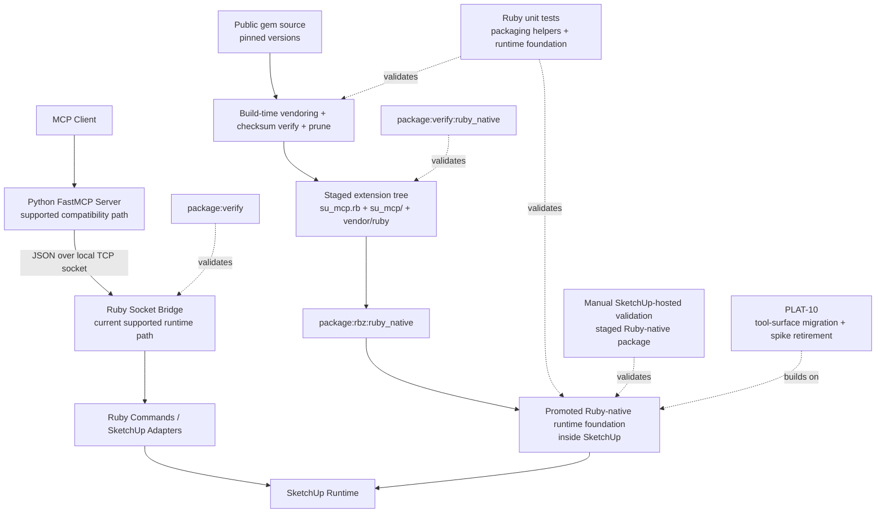

# Technical Plan: PLAT-09 Build Ruby-Native MCP Packaging And Runtime Foundations
**Task ID**: `PLAT-09`
**Title**: `Build Ruby-Native MCP Packaging And Runtime Foundations`
**Status**: `finalized`
**Date**: `2026-04-16`

## Source Task

- [Build Ruby-Native MCP Packaging And Runtime Foundations](./task.md)

## Problem Summary

PLAT-07 proved that SketchUp can host a Ruby-native MCP server for a real narrow slice, but the repo still cannot treat that path as a supported platform capability. The current Ruby-native path depends on manual staged RBZ assembly, spike-only runtime seams, local vendoring assumptions, and undocumented load-order or namespace expectations. PLAT-09 must convert that evidence into a deterministic repo-owned packaging and runtime foundation without prematurely migrating the public MCP surface or hardening the transitional dual-runtime posture into a permanent second system.

## Goals

- Build a deterministic repo-owned staged packaging path for the Ruby-native MCP runtime using public gem sources, pinned versions, and checksum verification.
- Promote the current spike internals into neutral runtime-foundation modules that later Ruby-native MCP work can reuse directly.
- Add repo-owned validation for the staged Ruby-native package so packaging regressions are visible in normal repository validation.
- Keep the current Python MCP adapter as the supported compatibility path while the Ruby-native foundation is being hardened.

## Non-Goals

- Migrate the current public MCP tool surface to Ruby-native ownership.
- Remove Python as the supported compatibility path.
- Finalize the permanent post-transition packaging or loader posture after Python is retired or reduced to an optional shim.
- Solve third-party namespace isolation by rewriting or forking the Ruby MCP SDK in this task.
- Introduce broad always-on SketchUp-hosted CI beyond the manual runtime checks needed for this foundation work.

## Related Context

- [PLAT-09 Task](./task.md)
- [Platform Architecture and Repo Structure](specifications/hlds/hld-platform-architecture-and-repo-structure.md)
- [ADR: Prefer Ruby-Native MCP as the Target Runtime Architecture](specifications/adrs/2026-04-16-ruby-native-mcp-target-runtime.md)
- [PLAT-07 Spike Ruby-Native MCP Runtime In SketchUp Task](specifications/tasks/platform/PLAT-07-spike-ruby-native-mcp-runtime-in-sketchup/task.md)
- [PLAT-07 Spike Ruby-Native MCP Runtime In SketchUp Summary](specifications/tasks/platform/PLAT-07-spike-ruby-native-mcp-runtime-in-sketchup/summary.md)
- [PLAT-10 Migrate Current Tool Surface To Ruby-Native MCP And Retire Spike](specifications/tasks/platform/PLAT-10-migrate-current-tool-surface-to-ruby-native-mcp-and-retire-spike/task.md)
- [SketchUp Extension Development Guidance](specifications/guidelines/sketchup-extension-development-guidance.md)
- Current packaging files:
  - [Rakefile](Rakefile)
  - [package.rake](rakelib/package.rake)
  - [release_support.rb](rakelib/release_support.rb)
- Current Ruby-native spike seams:
  - [main.rb](src/su_mcp/main.rb)
  - [mcp_spike_runtime_loader.rb](src/su_mcp/mcp_spike_runtime_loader.rb)
  - [mcp_spike_server.rb](src/su_mcp/mcp_spike_server.rb)
  - [mcp_spike_http_backend.rb](src/su_mcp/mcp_spike_http_backend.rb)
  - [mcp_spike_facade.rb](src/su_mcp/mcp_spike_facade.rb)

## Research Summary

- The updated platform HLD now explicitly treats the current dual-runtime architecture as the supported baseline and Ruby-native MCP as the accepted target direction. It assigns PLAT-09 to packaging and runtime foundations and PLAT-10 to public tool-surface migration.
- The current packaging implementation is still a direct source-tree snapshot of `src/su_mcp.rb` plus `src/su_mcp/**`, enforced by [package.rake](rakelib/package.rake) and [release_support.rb](rakelib/release_support.rb).
- PLAT-07 documented that the main remaining blockers are deterministic staged packaging, vendoring automation, archive-shape verification, and bounded namespace or load posture, not host-runtime viability.
- The repo currently has no populated `vendor/ruby/` tree. That means Ruby-native packaging is not reproducible from a clean checkout unless build-time vendoring is added.
- SketchUp extension guidance keeps three hard constraints in force:
  - preserve one root loader plus one same-name support tree
  - keep one top-level extension namespace
  - do not depend on runtime gem installation inside SketchUp
- The current local CI path already treats linting, tests, contract validation, and `package:verify` as normal platform ownership. PLAT-09 should extend that pattern rather than add a manual-only side path.
- The strongest packaging direction for this task is:
  - one shared packaging engine
  - explicit standard and Ruby-native package targets
  - build-time vendoring from public gem sources using pinned versions and checksums
  - pruning based on gem `require_paths` plus explicit runtime-asset exceptions
- Grok debate on the remaining refinement questions converged on:
  - keep upstream `MCP::*` constants unchanged for this task, but isolate application-owned usage behind `SU_MCP` runtime boundaries and document residual collision risk as transitional
  - promote spike internals to neutral runtime-foundation modules now, while leaving experimental menu and status UX transitional until PLAT-10

## Technical Decisions

### Data Model

- Keep the existing public MCP and Python/Ruby bridge data models unchanged in this task.
- Introduce a committed Ruby-native runtime manifest that defines:
  - gem name
  - exact version
  - checksum for the fetched `.gem` artifact
  - prune rules derived from gem `require_paths`
  - explicit runtime-asset exceptions when needed
  - a minimal staged-runtime load-test entrypoint or script that proves the pruned runtime can still boot in isolation before the RBZ is built
- Treat the manifest and staging metadata as the source of truth for build-time vendoring. Do not commit unpacked vendored runtime payloads.
- Keep staged runtime output under the standard extension support tree shape:
  - `su_mcp.rb`
  - `su_mcp/**`
  - `su_mcp/vendor/ruby/**`

### API and Interface Design

- Keep a single shared packaging implementation in [package.rake](rakelib/package.rake) and [release_support.rb](rakelib/release_support.rb), but expose explicit package targets:
  - `package:rbz`
  - `package:rbz:ruby_native`
- Mirror that split for verification:
  - `package:verify`
  - `package:verify:ruby_native`
  - `package:verify:all`
- Package selection should be explicit by task or target, not hidden behind implicit environment-sensitive loader behavior.
- Keep the standard package target behaviorally compatible with the current supported RBZ path.
- Add a deterministic staging flow for the Ruby-native package target:
  - fetch pinned gems from public gem sources with `gem fetch`
  - verify checksums
  - unpack into a deterministic repo-local staging workspace
  - prune to runtime-required contents
  - run the manifest-defined staged-runtime load test against the pruned runtime tree
  - stage into the Ruby-native package tree
- Promote the current `mcp_spike_*` runtime seams into neutral runtime-foundation modules under `src/su_mcp/`, with neutral class or module names that are reusable by PLAT-10.
- Update [main.rb](src/su_mcp/main.rb) to depend on the promoted runtime foundation modules rather than spike-named internals.
- Keep experimental menu and status labels explicitly transitional in this task. PLAT-09 promotes internals, not the public runtime posture.
- Allow short-lived compatibility wrappers during the rename only if they reduce risky edits and do not create a permanent second API surface.
- By the end of the task, [main.rb](src/su_mcp/main.rb) and other non-test application files should depend only on the neutral runtime-foundation modules. Spike-named internals may survive only in tests or temporary compatibility files that are explicitly transitional and scheduled for removal before task close.

### Error Handling

- Fail Ruby-native staging and packaging fast on:
  - gem fetch failure
  - checksum mismatch
  - malformed or missing gemspec data required for pruning
  - missing required staged runtime directories
  - forbidden files in the staged runtime tree
  - archive-shape mismatch
  - staged runtime load failure in isolated runtime tests
  - residual bootstrap references to spike-named runtime internals after promotion
- Return explicit packaging and staging errors from Rake tasks rather than silently skipping Ruby-native packaging work.
- Preserve current Ruby-native runtime status reporting when staged runtime support is absent, but update that reporting to use the promoted neutral runtime classes.
- Keep residual top-level `MCP::*` exposure risk documented as transitional. Do not claim namespace isolation is solved if the SDK still exposes top-level constants in SketchUp.

### State Management

- Treat build-time vendoring and staged package assembly as ephemeral state under a deterministic repo-local temporary workspace, for example under `tmp/package/ruby_native/`.
- Do not treat the installed SketchUp support tree as writable application state.
- Keep runtime configuration ownership in Ruby bootstrap and runtime support modules. Do not introduce a parallel config subsystem for the Ruby-native path.
- Preserve the current environment-driven Ruby-native host and port configuration posture proven in PLAT-07.

### Integration Points

- Current supported integration path remains:
  - MCP client -> Python FastMCP server -> Ruby socket bridge -> SketchUp behavior
- New PLAT-09 foundation path adds a staged Ruby-native package and promoted in-host runtime foundation:
  - public gem source -> build-time vendoring and pruning -> staged RBZ -> SketchUp-hosted Ruby-native runtime
- PLAT-09 must keep these two paths distinct:
  - supported Python compatibility path
  - staged Ruby-native foundation path
- PLAT-09 must not change the Python/Ruby bridge contract artifact unless the existing supported public bridge changes. That should be avoided in this task.
- Real integration must be validated at:
  - staged runtime loading inside the packaged extension tree
  - isolated staged-runtime loading outside the repo's normal Bundler or development load path
  - bootstrap wiring from [main.rb](src/su_mcp/main.rb) to the promoted runtime foundation
  - archive-shape verification for both package targets
  - manual SketchUp-hosted execution for the staged Ruby-native package

### Configuration

- Keep existing configuration ownership and defaults for:
  - the current Python bridge path
  - Ruby-native host and port configuration
- Do not introduce per-gem source URLs in the vendoring manifest. Use a single public gem-source policy plus per-gem pinned versions and checksums.
- Prefer `gem fetch` over `gem install` for build-time vendoring because the task needs deterministic package inputs rather than installed gem homes.
- Keep pruning conservative in PLAT-09:
  - allow gem `require_paths`, usually `lib/`
  - allow explicit runtime-asset exceptions only when proven necessary
  - deny non-runtime categories by default

## Architecture Context

## Key Relationships

- [main.rb](src/su_mcp/main.rb) remains the SketchUp runtime bootstrap entrypoint, but after PLAT-09 it should depend on neutral runtime-foundation modules rather than spike-named internals.
- [package.rake](rakelib/package.rake) and [release_support.rb](rakelib/release_support.rb) should remain the single owners of RBZ packaging mechanics, with explicit targets rather than duplicated packaging implementations.
- Build-time vendoring support should remain a packaging concern under `rakelib/`, not drift into runtime or application behavior modules.
- The Python MCP adapter remains the supported compatibility entrypoint during PLAT-09 and should not absorb new domain logic.
- The staged Ruby-native package path should be explicit and validated, but it must remain clearly transitional until PLAT-10 migrates canonical MCP tool exposure.
- The promoted runtime foundation should isolate application-owned usage behind `SU_MCP` boundaries even if the underlying SDK still exposes top-level `MCP::*` constants.

## Acceptance Criteria

- A clean checkout can produce the Ruby-native staged RBZ through a repo-owned task that fetches pinned public gems, verifies checksums, prunes staged runtime contents, and builds the package without relying on committed vendored runtime payloads.
- The standard RBZ package path remains valid and behaviorally unchanged for the currently supported package target.
- The Ruby-native package verification path fails if required staged runtime directories are missing, if forbidden payload categories are included, if the staged archive shape deviates from the expected support-tree layout, or if the pruned staged runtime cannot boot through the isolated staged-runtime load test.
- Ruby-native runtime internals no longer use spike-only module or class names for the core loader, server, backend, and facade seams.
- [main.rb](src/su_mcp/main.rb) and other non-test application files no longer depend on `mcp_spike_*` runtime classes or modules.
- Experimental Ruby-native menu or status affordances remain explicitly transitional rather than being silently hardened into the final public runtime posture.
- The promoted runtime foundation can report the staged runtime as unavailable in a structured way when vendored runtime support is absent, rather than failing implicitly.
- The task does not alter the current public Python/Ruby bridge contract or migrate the public MCP tool surface to Ruby-native ownership.
- Manual SketchUp-hosted validation confirms that the staged Ruby-native package loads and can still serve at least `ping` and `get_scene_info` through the promoted runtime foundation.
- Normal repository validation includes explicit verification of the Ruby-native staged package path in addition to the current standard package path, and the two package targets remain coordinated through one shared packaging implementation rather than divergent packaging codepaths.
- The plan and implementation leave PLAT-10 with a reusable runtime foundation rather than another spike-only packaging workflow.

## Test Strategy

### TDD Approach

- Start with packaging support seams that do not require SketchUp:
  - manifest parsing
  - checksum verification
  - gem unpacking and prune decisions
  - staged tree construction
  - archive verification rules
- Add or adapt runtime-foundation seam tests while promoting spike internals to neutral names.
- Rewire bootstrap only after staging and runtime-foundation seams are protected by tests.
- Finish with manual SketchUp-hosted validation of the staged Ruby-native package because that remains the only practical proof of real host-runtime loading in this task.

### Required Test Coverage

- Ruby tests for packaging support:
  - manifest parsing and validation
  - checksum failure handling
  - prune rules based on gem `require_paths`
  - explicit runtime-asset exception handling
  - failure on forbidden file categories or unexpected binaries
- Ruby tests for package verification:
  - current standard package shape remains valid
  - Ruby-native staged package shape is enforced
  - Ruby-native staged package fails verification when required runtime directories are absent
  - Ruby-native staged package verify unpacks the archive into a temporary verification workspace and runs the isolated staged-runtime load test without the repo's normal development load path
- Ruby tests for promoted runtime foundation seams:
  - status reporting when staged runtime is absent
  - runtime loading behavior against staged vendored dependencies
  - representative `ping` and `get_scene_info` transport behavior preserved through the promoted foundation
  - direct MCP SDK references are confined to the designated runtime foundation files rather than leaking into unrelated application code
- Existing quality gates:
  - `bundle exec rake ruby:lint`
  - `bundle exec rake ruby:test`
  - `bundle exec rake package:verify`
  - `bundle exec rake package:verify:ruby_native`
  - `bundle exec rake package:verify:all`
- Manual SketchUp-hosted validation:
  - install or load the staged Ruby-native RBZ
  - confirm extension startup and menu wiring
  - start the experimental Ruby-native path
  - validate `ping`
  - validate `get_scene_info`
  - record any remaining namespace or load-order concerns as transitional risk

## Instrumentation and Operational Signals

- Packaging task logs should show:
  - fetched gem names and versions
  - checksum verification success or failure
  - prune decisions and explicit retained exceptions
  - isolated staged-runtime load-test success or failure
  - staged package root location
- Ruby-native package verification should expose the exact archive-shape mismatch or forbidden-file failure when the staged package is invalid.
- Runtime status output from the promoted foundation should continue to report:
  - availability
  - missing runtime dependencies
  - vendored runtime root
- Verification output should expose whether direct MCP SDK references remain confined to the approved runtime foundation files, even though residual top-level `MCP::*` exposure is still treated as a transitional risk in this task.
- Manual SketchUp validation notes remain the required operational signal for actual host-runtime loading until SketchUp-hosted automation exists.

## Implementation Phases

1. Add a Ruby-native runtime manifest and packaging support that fetches pinned public gems, verifies checksums, unpacks, prunes, runs an isolated staged-runtime load test, and stages a deterministic Ruby-native support tree under a repo-local temporary workspace.
2. Extend the shared packaging engine to build and verify both the current standard RBZ and the Ruby-native staged RBZ through explicit package targets, plus a single `package:verify:all` aggregator, while keeping the standard path stable.
3. Promote the current `mcp_spike_*` internals into neutral runtime-foundation modules, add or adapt seam tests, and rewire [main.rb](src/su_mcp/main.rb) to the promoted foundation while eliminating spike-named runtime dependencies from non-test application files and keeping menu and status UX transitional.
4. Add Ruby-native package verification to normal repository validation, update docs and task metadata, and complete manual SketchUp-hosted validation of the staged Ruby-native package.

## Rollout Approach

- Keep the standard RBZ path and Python MCP adapter as the supported baseline during PLAT-09.
- Introduce the Ruby-native staged package as a repo-owned validated foundation path rather than as the final public runtime posture.
- Make the Ruby-native target explicit in docs, validation, and task naming so the repo does not silently accumulate a permanent parallel packaging model.
- Carry final public-surface migration, final UX cleanup, and any permanent loader simplification into PLAT-10.

## Risks and Controls

- **Pinned public gem fetches become nondeterministic or unavailable**: verify checksums, fail fast on mismatch or fetch failure, and keep the exact gem set pinned in committed metadata.
- **Package-shape verification passes while the staged runtime still cannot boot**: require an isolated staged-runtime load test after pruning and during Ruby-native package verification, and fail the packaging flow on any load error.
- **Pruning removes files needed at runtime**: prune conservatively by `require_paths`, allow explicit runtime-asset exceptions, and run staged runtime loader tests before package finalization.
- **Pruning leaves too much non-runtime content in the package**: add verification rules for forbidden directories and binaries in the staged runtime tree.
- **Neutral runtime promotion changes behavior while renaming internals**: preserve or add seam tests before rewiring bootstrap and keep short-lived compatibility wrappers only when needed to reduce risky edits.
- **Bootstrap promotion leaves hidden `mcp_spike_*` dependencies in app code**: require explicit checks that non-test application files depend only on the neutral runtime foundation before task close.
- **Residual `MCP::*` top-level exposure causes shared-interpreter collisions**: isolate application-owned usage behind `SU_MCP` boundaries, document the remaining collision risk as transitional, and do not claim namespace isolation is solved in this task.
- **Ruby-native staged packaging hardens into a permanent second system**: keep package targets explicit, preserve the current supported path, and document PLAT-10 as the owner of canonical MCP ownership migration and spike retirement.
- **Manual SketchUp validation is skipped because automated checks pass**: require explicit manual host-runtime validation notes for task completion because package-shape validation alone cannot prove SketchUp-hosted loading.

## Dependencies

- `PLAT-07`
- [Prefer Ruby-Native MCP as the Target Runtime Architecture](specifications/adrs/2026-04-16-ruby-native-mcp-target-runtime.md)
- [Platform Architecture and Repo Structure](specifications/hlds/hld-platform-architecture-and-repo-structure.md)
- [SketchUp Extension Development Guidance](specifications/guidelines/sketchup-extension-development-guidance.md)
- RubyGems public package source availability for the pinned gem set during build-time vendoring
- Existing Ruby packaging and lint/test tooling:
  - RubyGems `gem fetch`
  - Bundler / Rake
  - Zip packaging support already used by [package.rake](rakelib/package.rake)

## Premortem

### Intended Goal Under Test

Turn the PLAT-07 spike into a deterministic repo-owned Ruby-native MCP packaging and runtime foundation that later migration work can trust, without prematurely broadening scope into public tool migration or silently hardening a permanent dual-runtime platform.

### Failure Paths and Mitigations

- **Base assumptions that could lead us astray**
  - Business-plan mismatch: the business goal is a reproducible foundation path, but the plan could optimize for the appearance of automation while still depending on hidden local state.
  - Root-cause failure path: build-time vendoring still depends on developer-local gems, caches, or an implicitly populated runtime tree.
  - Why this misses the goal: the repo would still fail the clean-checkout reproducibility requirement that motivated PLAT-09.
  - Likely cognitive bias: false consensus from local-environment success.
  - Classification: Validate before implementation.
  - Mitigation now: define vendoring from pinned public `.gem` artifacts as the only supported packaging input and fail fast on missing staged runtime state.
  - Required validation: clean-checkout packaging test and checksum-enforced fetch path.
- **Shortcuts that could weaken the outcome**
  - Business-plan mismatch: the task must reduce migration risk, but a shortcut could keep spike internals and manual packaging assumptions in place under a new task name.
  - Root-cause failure path: package automation lands while core runtime seams remain spike-only and bootstrap continues to depend on experimental names or assumptions.
  - Why this misses the goal: PLAT-10 would inherit the same runtime-foundation ambiguity that PLAT-09 was supposed to remove.
  - Likely cognitive bias: local maximum bias.
  - Classification: Validate before implementation.
  - Mitigation now: require promotion of the core spike runtime seams to neutral foundation modules in the same task as packaging automation.
  - Required validation: code review of bootstrap dependencies and seam tests against the promoted neutral classes.
- **Areas that could be weakly implemented**
  - Business-plan mismatch: the business needs a safe staged runtime path, but the implementation could use aggressive pruning or shallow verification that produces a smaller package while breaking runtime loading.
  - Root-cause failure path: prune rules remove runtime-required files or preserve only what current tests happen to touch.
  - Why this misses the goal: the package would appear valid in CI but fail when loaded in SketchUp.
  - Likely cognitive bias: optimization bias.
  - Classification: Requires implementation-time instrumentation or acceptance testing.
  - Mitigation now: keep pruning conservative, allow explicit runtime-asset exceptions, and require staged runtime loader tests plus manual SketchUp-hosted validation.
  - Required validation: staged runtime tests and manual `ping` plus `get_scene_info` validation in SketchUp.
- **Areas that could be weakly implemented**
  - Business-plan mismatch: the business needs a reusable runtime foundation, but the implementation could rename files while leaving bootstrap and application dependencies tied to spike-era classes.
  - Root-cause failure path: `main.rb` or other non-test application files still reference spike-named runtime internals through wrappers or direct requires.
  - Why this misses the goal: PLAT-10 would inherit a renamed spike instead of a clean runtime foundation.
  - Likely cognitive bias: cosmetic refactor bias.
  - Classification: Validate before implementation.
  - Mitigation now: require non-test application files to depend only on neutral runtime-foundation modules by task completion.
  - Required validation: static checks or focused tests over runtime requires and bootstrap wiring.
- **Tests and evaluations needed to stay on track**
  - Business-plan mismatch: the business goal is not just build success but visible regression detection, yet the plan could rely on manual inspection after packaging.
  - Root-cause failure path: the Ruby-native staged package path is implemented but not wired into normal repository validation.
  - Why this misses the goal: packaging regressions would remain latent until manual install or later migration work.
  - Likely cognitive bias: optimism bias.
  - Classification: Validate before implementation.
  - Mitigation now: add `package:verify:ruby_native` to normal repo validation and require explicit archive-shape and forbidden-file checks.
  - Required validation: CI or local `rake ci` run including the Ruby-native verify target.
- **What must be true for the task to succeed**
  - Business-plan mismatch: the task is supposed to harden a Ruby-native foundation, but success depends on an assumption that the upstream SDK can be tolerated in SketchUp's shared interpreter without full rewrite in this task.
  - Root-cause failure path: residual `MCP::*` top-level exposure causes real collisions or startup instability that the plan only documented instead of controlling.
  - Why this misses the goal: the staged package would not be a credible platform foundation if the shared-interpreter risk is immediately destabilizing.
  - Likely cognitive bias: risk normalization.
  - Classification: Requires implementation-time instrumentation or acceptance testing.
  - Mitigation now: isolate all app-owned usage behind `SU_MCP` boundaries, keep the risk explicit, and require manual host-runtime validation that looks for load-order or startup conflicts.
  - Required validation: SketchUp-hosted start, stop, restart, and representative tool smoke with notes on namespace or load-order behavior.
- **Second-order and third-order effects**
  - Business-plan mismatch: the task should reduce migration complexity, but a poorly framed rollout could entrench a permanent dual packaging or dual runtime mindset.
  - Root-cause failure path: explicit Ruby-native packaging targets are introduced without clear transitional language, causing follow-on tasks or docs to treat both paths as long-term peers.
  - Why this misses the goal: the platform would preserve the complexity it is supposed to retire.
  - Likely cognitive bias: path dependence.
  - Classification: Indicates the task, spec, or success criteria are underspecified.
  - Mitigation now: document the standard path as supported baseline, the Ruby-native target as foundation path, and PLAT-10 as the owner of canonical runtime migration and spike retirement.
  - Required validation: plan, docs, and task wording reviewed for explicit transitional ownership and follow-on boundaries.

## Quality Checks

- [x] All required inputs validated
- [x] Problem statement documented
- [x] Goals and non-goals documented
- [x] Research summary documented
- [x] Technical decisions included
- [x] Architecture context included
- [x] Acceptance criteria included
- [x] Test requirements specified
- [x] Instrumentation and operational signals defined when needed
- [x] Risks and dependencies documented
- [x] Rollout approach documented when needed
- [x] Small reversible phases defined
- [x] Premortem completed with falsifiable failure paths and mitigations

## Implementation Outcome

- Landed a committed runtime manifest plus shared staging, vendoring, and verification support under `rakelib/release_support/`.
- Added explicit transitional package targets for the staged Ruby-native RBZ and wired `package:verify:all` into local CI and release preparation.
- Promoted the `mcp_spike_*` runtime internals to neutral `mcp_runtime_*` seams and rewired `main.rb` away from spike-named dependencies.
- Added an isolated staged-runtime load check to package verification so the pruned staged runtime is proven bootable outside the repo development load path.

## Final Validation Notes

- Passed `bundle exec rake package:verify`
- Passed `bundle exec rake package:verify:ruby_native`
- Passed `bundle exec rake package:verify:all`
- Focused runtime and package seam tests passed for the new manifest, staging, verification, and promoted runtime foundation files.
- CI and release validation succeeded, including production of the staged Ruby-native RBZ and upload of the generated artifact.
- SketchUp-hosted validation confirmed staged RBZ installation, runtime startup, and consistent behavior for the exposed native tool slice.
- Repo-wide `ruby:test` and `ruby:lint` still have noise from unrelated untracked modeling and joinery files already present in the worktree. Those files were restored after temporary isolation for scoped validation.
