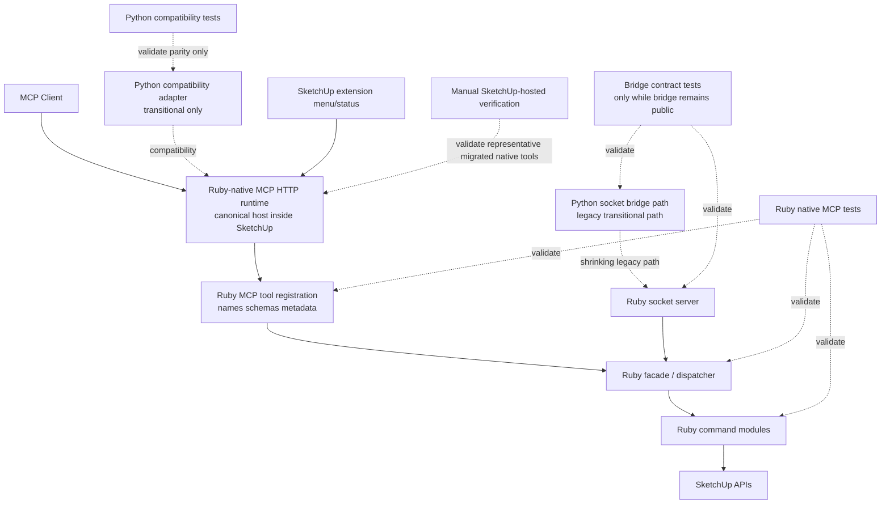

# Technical Plan: PLAT-10 Migrate Current Tool Surface To Ruby-Native MCP And Retire Spike
**Task ID**: `PLAT-10`
**Title**: `Migrate Current Tool Surface To Ruby-Native MCP And Retire Spike`
**Status**: `finalized`
**Date**: `2026-04-16`

## Source Task

- [Migrate Current Tool Surface To Ruby-Native MCP And Retire Spike](./task.md)

## Problem Summary

`PLAT-09` proved the repo can package and boot a Ruby-native MCP runtime inside SketchUp, but the current public MCP catalog is still canonically defined in Python while the native runtime only exposes a narrow promoted spike slice. That leaves the platform in a mixed ownership state: Ruby already owns most behavior, but Python still owns public MCP registration, schemas, metadata, and compatibility semantics for the live surface. `PLAT-10` must make Ruby-native MCP the canonical public host for the current migrated tool surface, shrink Python to an explicitly transitional compatibility role, and remove the remaining experimental runtime posture without expanding scope into full Python removal.

## Goals

- Make the Ruby-native MCP runtime inside SketchUp the canonical owner of the migrated public tool catalog.
- Reuse existing Ruby command ownership for tool behavior rather than duplicating domain logic across runtimes.
- Reduce Python to a clearly transitional compatibility layer that can be removed mechanically after native-consumption validation.
- Retire the remaining experimental runtime naming and menu posture now that the native path is no longer a spike.
- Preserve public tool names and representative client-facing behavior for the migrated surface unless a separate contract change is approved.

## Non-Goals

- Introduce new product capability beyond migrating the existing exposed tool surface.
- Remove Python entirely from the repository in this task.
- Finalize the permanent post-transition packaging shape after Python removal.
- Port Python-compatibility-only adapter tools such as `bridge_configuration` into the canonical Ruby-native public catalog.
- Redesign the entire Ruby command layer or bridge architecture beyond the migration seams needed for canonical native ownership.

## Related Context

- [PLAT-10 Task](./task.md)
- [Platform Architecture and Repo Structure](specifications/hlds/hld-platform-architecture-and-repo-structure.md)
- [ADR: Prefer Ruby-Native MCP as the Target Runtime Architecture](specifications/adrs/2026-04-16-ruby-native-mcp-target-runtime.md)
- [PLAT-07 Spike Ruby-Native MCP Runtime In SketchUp Task](specifications/tasks/platform/PLAT-07-spike-ruby-native-mcp-runtime-in-sketchup/task.md)
- [PLAT-07 Spike Ruby-Native MCP Runtime In SketchUp Summary](specifications/tasks/platform/PLAT-07-spike-ruby-native-mcp-runtime-in-sketchup/summary.md)
- [PLAT-09 Build Ruby-Native MCP Packaging And Runtime Foundations Task](specifications/tasks/platform/PLAT-09-build-ruby-native-mcp-packaging-and-runtime-foundations/task.md)
- [PLAT-09 Build Ruby-Native MCP Packaging And Runtime Foundations Summary](specifications/tasks/platform/PLAT-09-build-ruby-native-mcp-packaging-and-runtime-foundations/summary.md)
- [README](README.md)
- [SketchUp MCP Guide](sketchup_mcp_guide.md)
- Current native runtime seams:
  - [src/su_mcp/mcp_runtime_loader.rb](src/su_mcp/mcp_runtime_loader.rb)
  - [src/su_mcp/mcp_runtime_facade.rb](src/su_mcp/mcp_runtime_facade.rb)
  - [src/su_mcp/mcp_runtime_server.rb](src/su_mcp/mcp_runtime_server.rb)
  - [src/su_mcp/mcp_runtime_http_backend.rb](src/su_mcp/mcp_runtime_http_backend.rb)
  - [src/su_mcp/main.rb](src/su_mcp/main.rb)
- Current compatibility surfaces:
  - [python/src/sketchup_mcp_server/app.py](python/src/sketchup_mcp_server/app.py)
  - [python/src/sketchup_mcp_server/tools/](python/src/sketchup_mcp_server/tools)
  - [python/src/sketchup_mcp_server/bridge.py](python/src/sketchup_mcp_server/bridge.py)
  - [src/su_mcp/socket_server.rb](src/su_mcp/socket_server.rb)
  - [src/su_mcp/tool_dispatcher.rb](src/su_mcp/tool_dispatcher.rb)

## Research Summary

- `PLAT-07` implemented and validated a real SketchUp-hosted Ruby-native MCP slice, but only for `ping` and `get_scene_info`.
- `PLAT-09` promoted the native runtime/package seams out of spike internals and intentionally left tool-surface migration and experimental UX cleanup to `PLAT-10`.
- The current public MCP catalog is still registered in Python under [python/src/sketchup_mcp_server/tools/](python/src/sketchup_mcp_server/tools), and current Python tests treat that layer as the authoritative owner of tool names, schemas, and metadata.
- Most live public tools already resolve to Ruby-owned behavior through [src/su_mcp/tool_dispatcher.rb](src/su_mcp/tool_dispatcher.rb) and the existing Ruby command modules. The main gap is native MCP registration and canonical public ownership, not missing Ruby domain behavior.
- The current Ruby-native runtime only exposes `ping` and `get_scene_info` directly through [McpRuntimeFacade](src/su_mcp/mcp_runtime_facade.rb) and [McpRuntimeLoader](src/su_mcp/mcp_runtime_loader.rb).
- `bridge_configuration` is a Python compatibility-layer tool, not SketchUp or domain behavior. It should not be ported into the canonical Ruby-native catalog.
- `eval_ruby` should remain on the canonical surface during this migration so operators are not locked out by incomplete higher-level capability coverage.
- The existing bridge contract infrastructure remains valuable while the compatibility path exists, but `PLAT-10` should avoid deepening the bridge unless a transitional compatibility need requires it.
- The plan should shape Python for easy later removal once native-consumption validation is complete, but Python removal itself remains out of scope for this task.

## Technical Decisions

### Data Model

- Treat the Ruby-native MCP catalog as the canonical public data model for migrated tool names, descriptions, input schemas, annotations, and representative response shaping.
- Keep tool behavior and returned payloads Ruby-owned and JSON-serializable.
- Preserve the current public tool names for the migrated surface:
  - `ping`
  - `get_scene_info`
  - `list_entities`
  - `find_entities`
  - `sample_surface_z`
  - `get_entity_info`
  - `get_selection`
  - `create_site_element`
  - `set_entity_metadata`
  - `create_component`
  - `delete_component`
  - `transform_component`
  - `set_material`
  - `export_scene`
  - `boolean_operation`
  - `chamfer_edges`
  - `fillet_edges`
  - `eval_ruby`
- Treat `bridge_configuration` as compatibility-only and exclude it from the canonical Ruby-native catalog.
- Keep any legacy aliasing needed for transitional bridge compatibility internal to Ruby dispatch, not as a second canonical public catalog. In particular, `export` may remain a bridge alias while `export_scene` is the canonical public MCP tool name.

### API and Interface Design

- Expand [McpRuntimeLoader](src/su_mcp/mcp_runtime_loader.rb) so Ruby-native MCP registers the canonical migrated tool catalog directly inside SketchUp.
- Replace the current hardcoded two-tool registration posture with a Ruby-owned tool registry or manifest that keeps tool names, descriptions, schema builders, annotations, and handlers together in one canonical native definition source. Do not grow `McpRuntimeLoader#build_tools` into a long hand-written 20+ tool switchboard.
- Replace the narrow native-only facade in [McpRuntimeFacade](src/su_mcp/mcp_runtime_facade.rb) with a broader runtime execution surface that delegates to existing Ruby command owners rather than duplicating tool behavior.
- `McpRuntimeFacade` should adopt the collaborator initialization pattern currently assembled in [src/su_mcp/socket_server.rb](src/su_mcp/socket_server.rb), or share that construction through one explicit runtime-command factory, so the native runtime has access to the same scene, semantic, editing, modeling, joinery, and developer execution surfaces as the shrinking legacy path.
- Reuse [ToolDispatcher](src/su_mcp/tool_dispatcher.rb) or a small native-runtime wrapper around it for tool execution so current Ruby command mappings remain the behavior backbone.
- Keep [SocketServer](src/su_mcp/socket_server.rb) and [RequestHandler](src/su_mcp/request_handler.rb) as the shrinking legacy compatibility path while Python still exists; do not make them the canonical public MCP definition source.
- Promote the non-Python-native MCP semantics into Ruby for:
  - tool registration and ordering
  - titles and descriptions
  - read-only and destructive annotations where supported by the vendored MCP SDK
  - input schema exposure for representative migrated tools
- Reposition [python/src/sketchup_mcp_server/app.py](python/src/sketchup_mcp_server/app.py) and the tool modules under [python/src/sketchup_mcp_server/tools/](python/src/sketchup_mcp_server/tools) as compatibility-only surfaces. For migrated tools, the compatibility layer should derive its registration metadata from the canonical Ruby-native catalog, preferably from native `tools/list` at startup, rather than relying on manually duplicated Python schemas and descriptions. If a FastMCP limitation prevents fully generated registration for a retained compatibility tool, the plan must keep that duplication explicit and cover it with parity assertions so Python does not silently remain a second source of truth.
- Keep [python/src/sketchup_mcp_server/server.py](python/src/sketchup_mcp_server/server.py) as a thin compatibility alias surface only; do not add new behavior there.
- Retire the “Experimental MCP Runtime” posture in [src/su_mcp/main.rb](src/su_mcp/main.rb). The menu and host-facing status text should reflect the canonical native runtime while still exposing bridge status if the legacy compatibility path remains present.

### Error Handling

- Ruby-native MCP must surface representative tool failures as structured MCP-visible errors rather than raw exceptions or non-serializable Ruby data.
- Preserve current Ruby-owned in-band result envelopes where the underlying command semantics already depend on them, especially for semantic and modeling operations.
- Keep transitional compatibility-path error mapping explicit:
  - native Ruby runtime is the source of truth for canonical tool behavior
  - Python compatibility failures remain adapter or transport errors, not re-owned business logic
- Avoid adding new parallel error taxonomies in Python for migrated tools. If Python remains in the path, it should translate only compatibility transport concerns.
- Move `eval_ruby` out of [src/su_mcp/socket_server.rb](src/su_mcp/socket_server.rb) into a shared developer-command seam or the expanded native runtime facade so both runtimes can use one Ruby-owned implementation during transition.
- Preserve `eval_ruby` failure reporting as an explicit developer-facing failure surface while keeping it bounded to structured error output.

### State Management

- Keep Ruby-native MCP runtime state owned inside the SketchUp-hosted runtime and its existing server/bootstrap seams.
- Keep command execution effectively stateless per tool call apart from live SketchUp model state and existing command collaborators.
- Avoid new shared registries or generated catalog state just to keep Python in sync temporarily. The migration should favor Ruby-owned definitions and compatibility parity checks over a new permanent synchronization subsystem.

### Integration Points

- Canonical target path after `PLAT-10`:
  - MCP client
  - Ruby-native MCP runtime inside SketchUp
  - Ruby tool registration and response shaping
  - Ruby command dispatch
  - SketchUp adapters and model behavior
- Transitional compatibility paths that may still exist after `PLAT-10`:
  - Python compatibility adapter to native Ruby MCP for clients that still need the old entrypoint
  - legacy Python-to-Ruby socket bridge path while the compatibility surface still exists
- The native migration should be organized so later Python removal is mechanical:
  - no new Python-owned schemas for migrated tools
  - no new Python-only business semantics
  - no new bridge-only behavior for tools already consumable natively
- Real integration must be validated in the actual SketchUp host for representative migrated tools on the already-proven native runtime path.

### Configuration

- Preserve the environment-aware host and bind posture proven in `PLAT-07` and formalized in `PLAT-09`.
- Keep native runtime configuration owned in [src/su_mcp/mcp_runtime_config.rb](src/su_mcp/mcp_runtime_config.rb).
- Keep legacy bridge configuration ownership in [src/su_mcp/bridge.rb](src/su_mcp/bridge.rb) while the compatibility path remains.
- Do not add new configuration branches that harden the compatibility layer into a permanent second runtime.
- If Python remains temporarily, its configuration should describe compatibility transport behavior only, not canonical tool ownership.

## Architecture Context

## Key Relationships

- [src/su_mcp/mcp_runtime_loader.rb](src/su_mcp/mcp_runtime_loader.rb) becomes the canonical public MCP registration seam for the migrated surface.
- [src/su_mcp/mcp_runtime_facade.rb](src/su_mcp/mcp_runtime_facade.rb) should grow into a real native execution surface that routes into current Ruby command ownership instead of remaining a two-tool spike remnant, and it should reuse the same collaborator set the legacy socket path currently assembles.
- [src/su_mcp/tool_dispatcher.rb](src/su_mcp/tool_dispatcher.rb) is already the clearest reusable tool-to-command map and should be reused or wrapped rather than replaced casually.
- [python/src/sketchup_mcp_server/tools/](python/src/sketchup_mcp_server/tools) should stop being the authoritative MCP contract source for migrated tools and should either derive compatibility registration from the native catalog or be kept under explicit parity enforcement.
- [src/su_mcp/main.rb](src/su_mcp/main.rb) must align the SketchUp-facing runtime controls with the canonical native posture rather than preserving “experimental” wording.
- [src/su_mcp/socket_server.rb](src/su_mcp/socket_server.rb) remains relevant only as a transitional bridge while Python still exists.

## Acceptance Criteria

- The Ruby-native MCP runtime exposes the canonical public tool catalog for the migrated surface, and that catalog includes all intended migrated tools while excluding compatibility-only tools such as `bridge_configuration`.
- The Ruby-native `tools/list` response exposes stable tool names, descriptions, and input schemas for the migrated surface, with representative metadata semantics preserved for representative tools.
- Representative native `tools/call` requests succeed for:
  - scene inspection
  - semantic creation and mutation
  - modeling or editing
  - developer fallback via `eval_ruby`
- Representative native failures return structured MCP-visible errors without leaking raw SketchUp objects or non-serializable payloads.
- Public tool names and representative request/response behavior remain compatible for the migrated surface unless a separate intentional contract change is documented.
- `eval_ruby` remains available on the canonical native surface during this task.
- Python no longer acts as the canonical source of truth for migrated tool registration, schemas, or metadata, and its remaining role is explicitly transitional.
- The Python compatibility layer, where still present, validates representative parity against the native canonical surface rather than re-owning the catalog.
- Any retained Python compatibility registration for migrated tools is generated from or explicitly parity-checked against the native Ruby catalog so manual Python metadata drift cannot become a hidden second source of truth.
- The migrated native surface is verified from at least one real MCP client against the SketchUp-hosted Ruby-native runtime for representative migrated tools, building on the connectivity proof already established in `PLAT-07`.
- Spike-era runtime/menu wording and other experimental feature-surface seams are removed or promoted so the native runtime no longer presents itself as an experimental side path.
- The migrated runtime preserves the environment-aware host and bind posture established in prior native-runtime work.
- Ruby-native packaging and startup remain compatible with the staged runtime foundation from `PLAT-09`.
- Documentation and validation artifacts are updated wherever public runtime ownership or operator workflow changes.
- Direct native consumption is verified in a real SketchUp-hosted environment for representative migrated tools.

## Test Strategy

### TDD Approach

- Start with failing Ruby-native catalog tests that describe the canonical public surface before changing production code.
- Add or expand native-runtime tests for:
  - full or representative native `tools/list`
  - representative schema and metadata exposure
  - representative native `tools/call` success and failure behavior
- Reuse current Ruby command and dispatcher tests as behavior guards while promoting native registration.
- After native ownership is protected by tests, narrow Python tests to compatibility-only behavior and representative parity checks.
- Keep manual SketchUp-hosted validation as a required final check because representative migrated-tool validation on the native path is the evidence needed for later Python removal.

### Required Test Coverage

- Ruby-native MCP tests for:
  - migrated tool inventory exposed via `tools/list`
  - representative titles, descriptions, annotations, and input schemas
  - representative read-tool native execution
  - representative mutation-tool native execution
  - `eval_ruby` native availability and representative failure behavior
  - registry or manifest-driven native tool registration so the canonical catalog does not regress into large ad hoc loader code
- Existing Ruby command and dispatcher tests should continue to cover:
  - [src/su_mcp/tool_dispatcher.rb](src/su_mcp/tool_dispatcher.rb)
  - scene-query command ownership
  - semantic command ownership
  - modeling/editing/joinery ownership already present in Ruby
  - shared developer-command ownership once `eval_ruby` is extracted from `SocketServer`
- Python compatibility tests for:
  - representative compatibility-path parity with the native canonical surface
  - native-catalog-to-compatibility registration parity for names, descriptions, and representative schemas
  - any still-public compatibility-only tools such as `bridge_configuration`
  - startup and shutdown behavior while the compatibility layer remains
- Bridge contract tests only where the shrinking compatibility boundary is still public and behaviorally relevant.
- Validation commands should include the smallest practical real project checks for the touched surface:
  - Ruby tests and lint for native runtime changes
  - Python tests and lint for compatibility-layer changes
  - bridge contract suites only if the public compatibility boundary changes
  - package verification for the staged native runtime path
- Manual SketchUp-hosted validation should cover at minimum:
  - extension startup
  - native runtime startup
  - native `tools/list`
  - one representative scene tool
  - one representative semantic or modeling mutation tool
  - `eval_ruby`
  - one real MCP client exercising representative migrated tools on the native runtime

## Instrumentation and Operational Signals

- Native `tools/list` and representative native tool-call tests are the primary signal that Ruby now owns the public MCP catalog.
- Compatibility-path parity tests are the primary signal that Python has become a removable compatibility layer rather than a second catalog owner.
- Manual SketchUp-hosted validation is the primary signal that representative migrated tools work on the native runtime in the real host rather than only in isolated tests.
- Package verification remains the primary signal that the native runtime remains staging-safe and installable.
- Host-facing runtime status text in SketchUp should make it obvious which runtime is canonical and whether any transitional bridge remains active.
- Explicit native-versus-compatibility catalog assertions should make drift visible while both runtimes still exist.

## Implementation Phases

1. Define the canonical native tool inventory and compatibility boundary.
   Confirm the migrated native catalog, explicitly exclude `bridge_configuration`, keep `eval_ruby`, and document any internal legacy aliases such as `export`.
2. Expand native Ruby MCP registration and execution seams.
   Grow [mcp_runtime_loader.rb](src/su_mcp/mcp_runtime_loader.rb) and [mcp_runtime_facade.rb](src/su_mcp/mcp_runtime_facade.rb) to expose the canonical catalog through existing Ruby command ownership, using a Ruby-owned registry or manifest and a shared collaborator-construction seam.
3. Add native-catalog-first test coverage.
   Make Ruby-native `tools/list`, representative schema/metadata, and representative tool-call tests fail first, then implement to green.
4. Reposition Python as compatibility-only.
   Reduce Python MCP tests and wiring so they validate parity and compatibility behavior rather than primary ownership, and derive retained migrated-tool registration from the native catalog wherever practical.
5. Retire spike-era host posture.
   Promote or rename experimental runtime menu and status wording in [main.rb](src/su_mcp/main.rb), and update docs for the canonical native runtime posture.
6. Run final native and compatibility validation.
   Execute the smallest practical real project validation and complete manual SketchUp-hosted verification for representative migrated native tools, including at least one real MCP client against the native runtime.

## Rollout Approach

- Keep the task reversible by promoting canonical native ownership before deleting transitional compatibility seams.
- Preserve the compatibility path during `PLAT-10`, but stop adding new ownership or semantics to it.
- Validate representative migrated tools on the native runtime first, then treat any remaining Python surface as transitional and removable.
- Do not treat menu promotion or docs promotion as sufficient evidence of success; representative migrated-tool validation from a real MCP client on the native runtime must pass before the task is considered complete.
- If a migrated tool proves blocked in the native runtime, keep the block explicit in the plan or task follow-up rather than hiding it behind continued Python ownership.
- Leave Python deletion to a follow-on task once native-consumption validation is established for the intended client set.

## Implementation Outcome Notes

- The shipped implementation keeps Python explicitly described as a compatibility surface, but does not add stronger generated-registration or drift-enforcement machinery because Python is expected to be removed before new tool growth resumes.
- The shipped work focuses on Ruby-owned canonical catalog definition, shared Ruby command-collaborator construction, shared developer-command ownership for `eval_ruby`, and promotion of the SketchUp-facing native runtime posture.
- Live SketchUp-hosted deployment exposed one real post-implementation gap: [main.rb](src/su_mcp/main.rb) was constructing [McpRuntimeFacade](src/su_mcp/mcp_runtime_facade.rb) without a shared [RuntimeCommandFactory](src/su_mcp/runtime_command_factory.rb), so the native runtime advertised mutation and developer tools that were not actually wired to command targets. The follow-up fix injects the shared factory into the native facade and adds regression coverage in [test/mcp_runtime_main_integration_test.rb](test/mcp_runtime_main_integration_test.rb).
- The same live validation also exposed native catalog schema drift for `get_entity_info` and `sample_surface_z`: the runtime loader had been advertising looser schemas than the Ruby commands actually accepted. The follow-up fix tightens the native catalog contract in [mcp_runtime_loader.rb](src/su_mcp/mcp_runtime_loader.rb) and adds regression coverage in [test/mcp_runtime_loader_test.rb](test/mcp_runtime_loader_test.rb) so `tools/list` matches the live command surface.
- Later live SketchUp-hosted validation confirmed 15 tools working end to end on the native runtime and narrowed the remaining native failures to three shared geometry operations: `boolean_operation`, `chamfer_edges`, and `fillet_edges`. Those tools were already past registration, schema, and dispatch, but failed during Ruby geometry execution with `NoMethodError: undefined method 'copy' for #<Sketchup::Edge ...>`.
- A follow-up Ruby geometry fix was then implemented in [modeling_support.rb](src/su_mcp/modeling_support.rb) and [solid_modeling_commands.rb](src/su_mcp/solid_modeling_commands.rb). The shared copy path now rebuilds uncopiable edges and faces, boolean union now operates on copied groups/components instead of `Sketchup::Entities`, and chamfer point generation now derives a planar quad from the two adjacent faces. Regression coverage was added in [test/modeling_support_test.rb](test/modeling_support_test.rb) and [test/solid_modeling_commands_test.rb](test/solid_modeling_commands_test.rb), and the follow-up Ruby validation passed via `bundle exec rake ruby:test` and `bundle exec rake ruby:lint`.
- Subsequent live revalidation confirmed `boolean_operation` working end to end on a real union call with the expected solid replacement and bounds/topology changes. It also confirmed that `fillet_edges` and `chamfer_edges` now execute without runtime errors and generate additional geometry in-host.
- One further local chamfer follow-up was then implemented in [solid_modeling_commands.rb](src/su_mcp/solid_modeling_commands.rb): chamfer point sets are now fully snapshotted before any new chamfer faces are added, so later edge processing cannot pick up freshly-created faces and produce invalid geometry. Regression coverage for that mutation-order bug was added in [test/solid_modeling_commands_test.rb](test/solid_modeling_commands_test.rb), and the focused solid-modeling test suite remains green.
- The latest live validation boundary is that the remaining edge-treatment gap is functional correctness rather than invocation failure: both `fillet_edges` and `chamfer_edges` now return success and create geometry, but the resulting solids are still non-manifold in SketchUp and need a separate geometry-quality follow-up.
- The inherited joinery tools `create_mortise_tenon`, `create_dovetail`, and `create_finger_joint` were also removed from the native Ruby catalog and Python compatibility layer after validation confirmed they were never used and should not remain on the supported surface.

## Risks and Controls

- Native catalog ownership remains partially in Python because schema or metadata work is left there:
  add failing Ruby-native catalog tests first and convert Python checks into parity checks after native ownership is established.
- Python compatibility veneers remain manually duplicated and drift from the native catalog:
  prefer generated compatibility registration from native `tools/list`, and otherwise require explicit parity assertions for names, descriptions, and representative schemas.
- Ruby is declared canonical without validating the migrated surface from a real client on the SketchUp-hosted native runtime:
  require representative migrated-tool verification from at least one real MCP client configuration in addition to local runtime tests.
- The plan migrates only execution but not MCP-visible semantics:
  require native `tools/list`, representative schema, and representative metadata coverage rather than only tool-call smoke tests.
- The native runtime cannot reach the same command collaborators currently assembled by the legacy socket path:
  share collaborator construction explicitly between the native facade and legacy path rather than recreating it ad hoc.
- `eval_ruby` remains trapped in `SocketServer` and becomes the last reason the legacy path still owns unique behavior:
  extract it into a shared Ruby-owned developer-command seam during the migration.
- The vendored Ruby MCP SDK cannot express the metadata or schema surface the plan assumes:
  validate representative native `tools/list` metadata and schema exposure early before broad catalog migration, and adjust the compatibility posture explicitly if the SDK cannot support parity yet.
- Compatibility pressure causes new Python-only abstractions that make later removal harder:
  forbid new Python-owned business semantics or generated catalog layers for migrated tools.
- A broad tool-inventory migration hides tool-specific gaps until late:
  stage the work by representative categories and keep `eval_ruby` available as an operational fallback.
- Host-runtime behavior differs from isolated tests:
  require direct SketchUp-hosted validation of representative native tools before declaring the task complete.
- Experimental runtime wording or controls remain in place after the migration:
  include explicit menu/status checks in the implementation phases and final validation.
- Bridge compatibility drift breaks clients during transition:
  keep representative compatibility-path tests and bridge contract validation for any compatibility surface that remains public.

## Dependencies

- `PLAT-09` for the staged native runtime foundation and packaging posture.
- `PLAT-07` for the original in-host native runtime viability proof.
- [specifications/adrs/2026-04-16-ruby-native-mcp-target-runtime.md](specifications/adrs/2026-04-16-ruby-native-mcp-target-runtime.md)
- [specifications/hlds/hld-platform-architecture-and-repo-structure.md](specifications/hlds/hld-platform-architecture-and-repo-structure.md)
- Existing Ruby command ownership under [src/su_mcp/](src/su_mcp/)
- Existing Python compatibility surface under [python/src/sketchup_mcp_server/](python/src/sketchup_mcp_server/)
- SketchUp-hosted runtime availability for manual native-consumption verification
- At least one real MCP client configuration available for representative migrated-tool validation on the native runtime
- Current package and validation entrypoints in [Rakefile](Rakefile) and [rakelib/](rakelib/)

## Premortem

### Intended Goal Under Test

Make the SketchUp-hosted Ruby-native MCP runtime the real canonical public host for the current tool surface, reduce Python to a clearly transitional compatibility role, and leave the repo positioned so Python removal becomes a follow-on cleanup instead of another architectural migration.

### Failure Paths and Mitigations

- **Base assumptions that could lead us astray**
  - Business-plan mismatch: the business goal needs Ruby to be the actual public host, while the draft plan could still have optimized for internal Ruby reuse without proving external native consumption.
  - Root-cause failure path: the previously proven native connection path still works, but the migrated tool surface is not validated from a real MCP client, so Python remains the de facto usable path for meaningful work.
  - Why this misses the goal: Ruby is only canonical on paper, and the repo stays trapped in a practical dual-runtime posture.
  - Likely cognitive bias: proxy success bias from over-trusting local seam tests.
  - Classification: requires implementation-time instrumentation or acceptance testing
  - Mitigation now: require at least one real MCP client validation of representative migrated tools against the native runtime as part of final validation and acceptance.
  - Required validation: documented native client smoke using the SketchUp-hosted runtime plus representative migrated tool calls.
- **Shortcuts that could weaken the outcome**
  - Business-plan mismatch: the business goal needs Python to shrink, while the draft plan could still leave Python owning enough schemas or metadata that future removal remains architectural.
  - Root-cause failure path: Python compatibility definitions remain the place where migrated tool semantics are easiest to discover or maintain, even after Ruby gains a native catalog.
  - Why this misses the goal: the repo still has two practical sources of truth and future Python removal is delayed.
  - Likely cognitive bias: transition-comfort bias that treats temporary duplication as harmless.
  - Classification: validate before implementation
  - Mitigation now: state explicitly that Ruby owns canonical `tools/list`, schemas, metadata, and representative semantics; Python tests become parity checks rather than ownership checks.
  - Required validation: failing Ruby-native catalog tests first, followed by Python parity tests that no longer define the canonical surface.
- **Areas that could be weakly implemented**
  - Business-plan mismatch: the business goal needs MCP-visible parity, while the draft plan could under-specify native metadata and schema behavior.
  - Root-cause failure path: tools register and execute natively, but titles, annotations, or schemas diverge enough that clients still rely on Python definitions.
  - Why this misses the goal: migrated tools are not fully consumable as the public native surface even though the base runtime path already works.
  - Likely cognitive bias: execution-path bias that overvalues successful tool calls over catalog fidelity.
  - Classification: validate before implementation
  - Mitigation now: require early representative native `tools/list` validation for names, descriptions, schemas, and annotations before broad catalog rollout.
  - Required validation: native runtime tests for representative tool metadata plus manual inspection of the native catalog.
- **Tests and evaluations needed to stay on track**
  - Business-plan mismatch: the business goal needs a shrinking compatibility layer, while the draft plan could let bridge tests dominate validation again.
  - Root-cause failure path: implementation passes bridge and compatibility tests but lacks strong native-catalog validation, so the old boundary still determines success.
  - Why this misses the goal: the migration optimizes the wrong boundary and preserves the old ownership model.
  - Likely cognitive bias: sunk-cost bias around existing bridge test infrastructure.
  - Classification: validate before implementation
  - Mitigation now: make Ruby-native catalog tests the first TDD target and keep bridge-contract validation only for any still-public compatibility boundary.
  - Required validation: test ordering and coverage that visibly privileges native ownership over compatibility preservation.
- **What must be true for the task to succeed**
  - Business-plan mismatch: the business goal needs canonical native ownership without premature Python removal, while the draft plan could ignore the operational need for fallback capability.
  - Root-cause failure path: the migration narrows the public surface too aggressively and operators lose reach during implementation or validation.
  - Why this misses the goal: the native path becomes fragile and the team falls back to preserving Python ownership longer than intended.
  - Likely cognitive bias: purity bias favoring architectural cleanliness over operational safety.
  - Classification: validate before implementation
  - Mitigation now: keep `eval_ruby` on the canonical native surface during `PLAT-10` and require representative non-`eval_ruby` native coverage so it remains a fallback, not the success path.
  - Required validation: native tests and manual validation covering both representative first-class tools and `eval_ruby`.
- **Second-order and third-order effects**
  - Business-plan mismatch: the business goal needs the repo to stop advertising a spike posture, while the draft plan could treat UI and docs as secondary cleanup.
  - Root-cause failure path: code ownership changes but menu labels, operator guidance, or docs still describe the native runtime as experimental.
  - Why this misses the goal: users and future implementers keep treating Python as the real path, reinforcing dual-runtime drift.
  - Likely cognitive bias: code-complete bias that undervalues naming and operator signaling.
  - Classification: requires implementation-time instrumentation or acceptance testing
  - Mitigation now: include menu/status and docs updates as explicit implementation phases and acceptance criteria.
  - Required validation: host-facing menu/status checks plus doc review for runtime ownership wording.

## Quality Checks

- [x] All required inputs validated
- [x] Problem statement documented
- [x] Goals and non-goals documented
- [x] Research summary documented
- [x] Technical decisions included
- [x] Architecture context included
- [x] Acceptance criteria included
- [x] Test requirements specified
- [x] Instrumentation and operational signals defined when needed
- [x] Risks and dependencies documented
- [x] Rollout approach documented when needed
- [x] Small reversible phases defined
- [x] Premortem completed with falsifiable failure paths and mitigations
